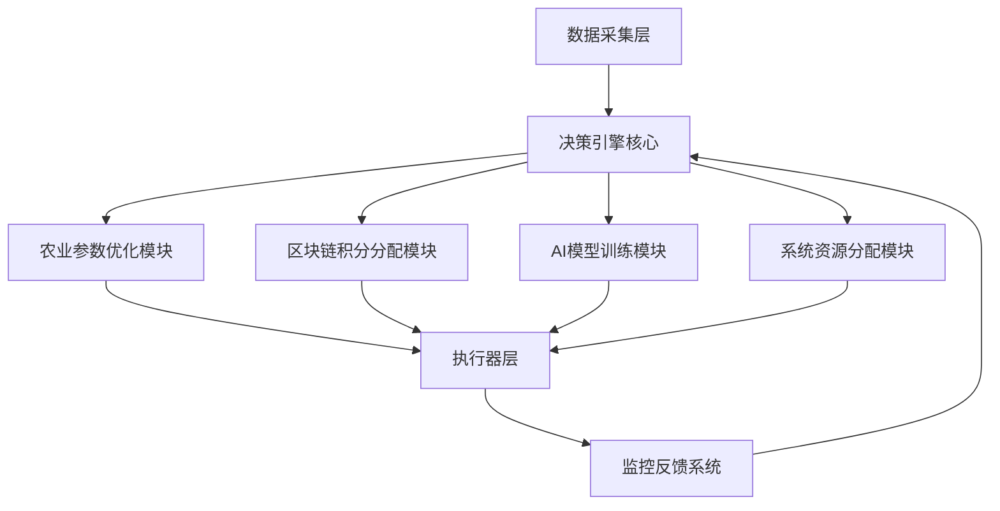
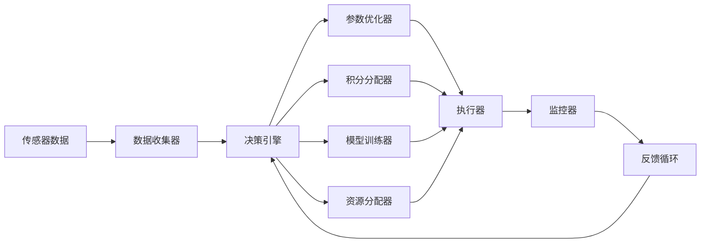

## 产品概述

AI自主决策系统是为现有AI农业平台构建的完全自主决策引擎，实现农业全流程的智能化决策管理

## 核心功能

- **农业参数优化决策**：根据环境数据自动调整灌溉、施肥、温控等农业参数
- **区块链积分分配决策**：基于贡献度自动分配和调整区块链积分奖励
- **AI模型自动训练决策**：监控模型性能，自主决定模型训练时机和参数调整
- **系统资源动态分配**：实时分配计算资源、存储资源和网络资源
- **强化学习决策引擎**：集成强化学习算法实现持续优化决策策略
- **秒级实时响应**：所有决策支持秒级响应，确保系统实时性

## 技术栈

- **后端框架**：Python + FastAPI（高性能API服务）
- **机器学习框架**：PyTorch + OpenAI Gym（强化学习环境）
- **消息队列**：Redis + Celery（实时任务处理）
- **数据库**：PostgreSQL（结构化数据）+ InfluxDB（时序数据）
- **监控系统**：Prometheus + Grafana（系统监控和决策可视化）

## 架构设计

### 系统架构

采用微服务架构，每个决策模块独立部署，通过消息总线进行通信



### 模块划分

- **决策引擎核心**：强化学习算法实现，负责任务调度和策略决策
- **农业参数优化模块**：基于环境数据和历史效果优化农业参数
- **区块链积分分配模块**：根据用户贡献和系统指标动态分配积分
- **AI模型训练模块**：监控模型性能，自主触发训练和参数调优
- **系统资源分配模块**：实时监控资源使用，动态分配计算资源
- **监控反馈系统**：收集决策效果，为强化学习提供反馈数据

### 数据流设计



## 实现细节

### 核心目录结构

```
ai-decision-system/
├── src/
│   ├── core/                    # 决策引擎核心
│   │   ├── reinforcement_learning/  # 强化学习算法
│   │   ├── decision_maker/          # 决策器
│   │   └── scheduler/               # 任务调度器
│   ├── modules/                # 功能模块
│   │   ├── agriculture/        # 农业参数优化
│   │   ├── blockchain/         # 区块链积分分配
│   │   ├── model_training/     # AI模型训练
│   │   └── resource_allocation/ # 系统资源分配
│   ├── data/                   # 数据处理
│   │   ├── collectors/         # 数据收集器
│   │   ├── processors/         # 数据处理器
│   │   └── storage/            # 数据存储
│   ├── api/                    # API接口
│   │   ├── endpoints/          # 端点定义
│   │   └── middleware/         # 中间件
│   └── monitoring/             # 监控系统
│       ├── metrics/            # 指标收集
│       ├── alerts/             # 告警系统
│       └── visualization/      # 可视化
├── config/                     # 配置文件
├── tests/                      # 测试代码
└── docs/                       # 文档
```

### 关键技术实现

- **强化学习决策引擎**：使用PPO算法实现多目标优化决策
- **实时数据处理**：Redis Streams实现秒级数据流处理
- **分布式任务调度**：Celery实现高并发决策任务处理
- **决策效果评估**：A/B测试框架验证决策效果
- **资源隔离**：Docker容器化实现资源隔离和弹性伸缩

### 性能优化

- 内存缓存热点决策数据
- 异步非阻塞IO处理
- 决策结果预计算和缓存
- 分布式锁机制避免决策冲突

## 代理扩展

### SubAgent

- **code-explorer**（来自<subagent>）
- 目的：探索现有AI农业平台的代码结构，了解系统架构和接口
- 预期成果：获取平台现有模块、数据接口和系统约束的详细分析报告

### Skill

- **skill-creator**（来自<skills>）
- 目的：创建决策系统专用的技能模块，封装决策逻辑和算法
- 预期成果：生成可复用的决策技能组件，支持农业参数优化、积分分配等核心功能