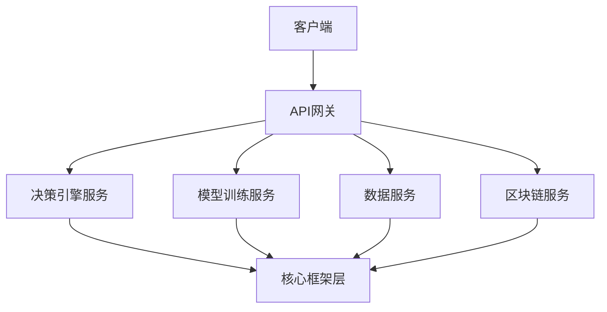
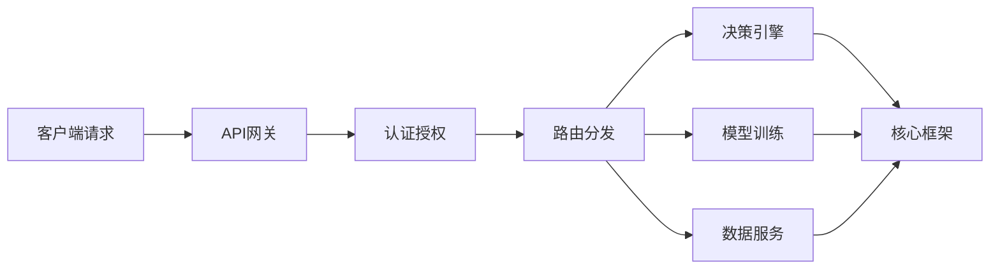

## 产品概述

将现有的AI农业决策系统从单体架构重构为微服务架构，实现功能与框架的完全分离

## 核心功能

- 决策引擎微服务：提供强化学习驱动的农业参数优化和决策能力
- 模型训练微服务：支持AI模型的自动训练和优化
- API网关服务：统一入口，路由分发和认证管理
- 数据服务：农业数据管理和区块链积分分配
- 核心框架层：独立的基础框架和工具库
- 混合部署模式：支持本地和云端混合部署

## 技术栈

- 后端框架：Node.js + Express.js (TypeScript)
- 微服务通信：gRPC + REST API
- 数据存储：MongoDB + Redis
- 消息队列：RabbitMQ
- 容器化：Docker + Docker Compose
- 服务发现：Consul
- 监控：Prometheus + Grafana

## 架构设计

### 系统架构

采用微服务架构，每个功能模块独立部署，通过API网关统一对外提供服务。



### 模块划分

1. **API网关模块**

- 路由分发、负载均衡
- 认证授权、限流熔断
- 技术：Express.js + JWT

2. **决策引擎模块**

- 强化学习算法实现
- 农业参数优化决策
- 技术：Python + TensorFlow

3. **模型训练模块**

- AI模型自动训练
- 模型版本管理
- 技术：Python + PyTorch

4. **数据服务模块**

- 农业数据管理
- 区块链积分分配
- 技术：Node.js + MongoDB

5. **核心框架模块**

- 通用工具库
- 配置管理
- 日志监控

### 目录结构

```
ai-agriculture-microservices/
├── api-gateway/           # API网关服务
├── decision-engine/       # 决策引擎服务
├── model-training/        # 模型训练服务
├── data-service/         # 数据服务
├── blockchain-service/   # 区块链服务
├── core-framework/       # 核心框架层
├── docker-compose.yml    # 容器编排
└── deploy/              # 部署配置
```

### 数据流设计



## 技术实现方案

### 服务间通信

- 使用gRPC进行高性能服务间通信
- REST API用于外部接口调用
- 消息队列处理异步任务

### 数据一致性

- 事件溯源模式保证数据最终一致性
- 分布式事务处理关键业务

### 部署策略

- 开发环境：Docker Compose本地部署
- 生产环境：Kubernetes集群部署
- 混合模式：关键服务本地部署，计算密集型服务云端部署

## 代理扩展

### 技能

- **ai自主决策引擎**
- 目的：为微服务架构提供强化学习驱动的农业决策能力
- 预期成果：实现农业参数优化、区块链积分分配等核心决策功能

### 子代理

- **code-explorer**
- 目的：分析现有单体架构代码，识别可分离的功能模块
- 预期成果：生成详细的模块分离方案和代码迁移计划