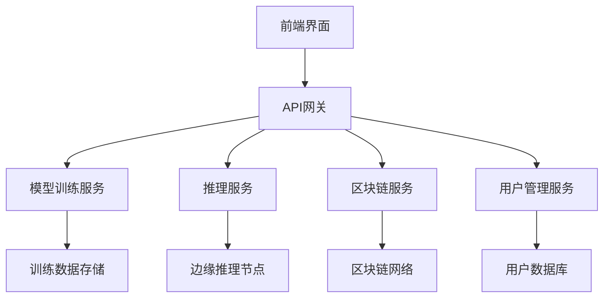

## 产品概述

构建一个先进的AI项目架构，集成边缘推理、隐私保护和区块链技术，提供端到端的AI解决方案

## 核心功能

- 基于JAX+Flax的高性能AI模型训练和推理
- React+TypeScript构建的现代化管理界面
- 云原生架构支持弹性扩展和自动部署
- 边缘计算节点实现低延迟推理服务
- 隐私保护机制确保数据安全
- 区块链集成用于模型版本控制和数据溯源

## 技术栈

- **AI框架**: JAX + Flax (高性能机器学习)
- **前端**: React + TypeScript + Tailwind CSS
- **后端**: Python + FastAPI (微服务架构)
- **数据库**: PostgreSQL + Redis
- **容器化**: Docker + Kubernetes
- **区块链**: Hyperledger Fabric
- **边缘计算**: TensorFlow Lite + ONNX Runtime

## 系统架构

采用微服务架构，将系统拆分为独立的服务模块，支持水平扩展和独立部署



## 模块划分

1. **前端管理平台** (React + TypeScript)

- 模型管理界面
- 训练监控面板
- 推理结果展示
- 系统配置管理

2. **AI核心服务** (JAX + Flax)

- 模型训练模块
- 模型优化模块
- 推理引擎模块
- 边缘部署模块

3. **区块链集成** (Hyperledger Fabric)

- 模型版本控制
- 数据溯源记录
- 权限管理合约
- 审计日志

4. **基础设施** (Kubernetes + Docker)

- 服务发现与负载均衡
- 自动扩缩容
- 监控告警系统
- 日志收集

## 核心目录结构

```
ai-project-advanced-architecture/
├── frontend/                 # React前端
│   ├── src/
│   │   ├── components/       # 可复用组件
│   │   ├── pages/           # 页面组件
│   │   ├── services/        # API服务
│   │   └── types/           # TypeScript类型
│   └── package.json
├── backend/                  # Python后端
│   ├── ai_service/          # AI服务
│   ├── blockchain/          # 区块链集成
│   ├── edge_computing/      # 边缘计算
│   └── api/                 # FastAPI接口
├── infrastructure/          # 基础设施
│   ├── k8s/                # Kubernetes配置
│   ├── docker/             # Dockerfile
│   └── monitoring/         # 监控配置
└── docs/                   # 文档
```

## 关键技术实现

1. **JAX模型训练**

- 使用Flax构建神经网络
- 支持分布式训练
- 模型自动优化

2. **边缘推理优化**

- 模型量化压缩
- 动态批处理
- 缓存策略优化

3. **隐私保护机制**

- 差分隐私
- 联邦学习
- 同态加密

## 设计风格

采用现代科技感设计风格，结合深色主题和霓虹色彩，体现AI项目的先进性和专业性。界面布局采用卡片式设计，支持响应式布局和动态交互效果。

## 页面规划

1. **仪表盘页面** - 系统概览和关键指标展示
2. **模型管理页面** - 模型训练、部署和版本控制
3. **推理服务页面** - 实时推理监控和结果分析
4. **区块链页面** - 数据溯源和审计日志
5. **系统设置页面** - 配置管理和权限控制

## 页面块设计

### 仪表盘页面

- **顶部导航栏**: 深色背景，包含logo、用户信息和通知中心
- **侧边菜单**: 固定式导航，支持折叠，包含主要功能入口
- **数据概览区**: 关键指标卡片展示，使用图表可视化训练进度和系统状态
- **实时监控区**: 动态图表展示推理请求量和响应时间
- **快速操作区**: 常用功能快捷入口，支持拖拽排序

### 模型管理页面

- **模型列表区**: 卡片式布局展示所有模型，支持筛选和搜索
- **训练控制区**: 训练参数配置和进度监控，支持实时日志查看
- **版本历史区**: 时间轴展示模型版本变更，支持版本对比
- **部署状态区**: 可视化展示模型在各节点的部署状态

### 推理服务页面

- **服务监控区**: 实时展示推理服务状态和性能指标
- **请求分析区**: 请求量统计和错误率分析图表
- **结果展示区**: 推理结果可视化，支持图像、文本等多种格式
- **边缘节点区**: 边缘节点状态监控和负载均衡配置

## 代理扩展

### 子代理

- **code-explorer** (来自 <subagent>)
- 用途：探索项目结构和代码文件，协助构建复杂的多模块项目
- 预期结果：建立完整的项目目录结构和模块依赖关系