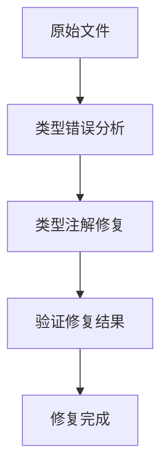

## 产品概述

修复system_test.py文件中的Pyright类型检查错误

## 核心功能

- 修复str类的items属性访问错误
- 为optimization和status变量添加正确的类型注解
- 解决items方法的类型推断问题
- 修复第156行的类型注解缺失问题

## 技术栈

- 编程语言：Python
- 类型检查器：Pyright
- 主要工具：Python类型注解系统

## 架构设计

### 系统架构

采用简单的脚本修复模式，直接修改源代码文件中的类型注解问题

### 实现细节

#### 核心修复策略

1. **str类型错误修复**：将错误的items属性访问改为正确的字典访问方式
2. **变量类型注解**：为optimization和status变量添加明确的类型注解
3. **方法类型推断**：为items方法添加返回类型注解
4. **第156行修复**：为缺失类型注解的变量或函数添加正确注解

#### 技术实现计划

1. 分析当前类型错误的具体位置和原因
2. 确定正确的类型注解方案
3. 逐一修复每个类型错误
4. 验证修复后的类型检查结果

## 代理扩展

### SubAgent

- **code-explorer** (来自<subagent>)
- 目的：深入分析system_test.py文件的结构和类型错误详情
- 预期结果：获取完整的错误位置、类型和修复建议