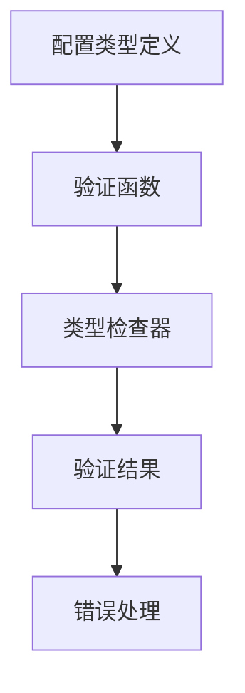

## 产品概述

修复validate_configuration函数的类型检查问题，确保类型安全和运行时可靠性

## 核心功能

- 分析现有validate_configuration函数的类型定义问题
- 修复Any类型的过度使用，提供精确的类型定义
- 确保配置验证逻辑的类型安全性
- 增强运行时错误检测和预防能力

## 技术栈

- 编程语言：TypeScript
- 类型检查：TypeScript编译器
- 测试框架：Jest（用于类型安全验证）
- 代码分析：TypeScript类型系统

## 架构设计

### 系统架构

采用模块化架构，将类型定义与验证逻辑分离：



### 模块划分

- **类型定义模块**：定义配置对象的精确类型接口
- **验证函数模块**：实现类型安全的配置验证逻辑
- **测试模块**：验证类型安全性和功能正确性

### 实现细节

#### 核心目录结构

```
project/
├── src/
│   ├── types/
│   │   └── config.ts      # 配置类型定义
│   ├── utils/
│   │   └── validation.ts  # 验证函数
│   └── index.ts          # 主入口
├── tests/
│   └── validation.test.ts # 测试用例
└── tsconfig.json         # TypeScript配置
```

#### 关键代码结构

```typescript
// 配置类型定义
interface Configuration {
  requiredField: string;
  optionalField?: number;
  nestedConfig: {
    subField: boolean;
  };
}

// 验证函数类型签名
function validateConfiguration(config: unknown): config is Configuration {
  // 类型安全的验证逻辑
}
```

## 技术实现方案

1. **问题分析**：识别当前validate_configuration函数中的类型问题
2. **类型重构**：用精确接口替换Any类型
3. **验证增强**：添加运行时类型检查
4. **测试验证**：确保类型安全性和功能正确性

## 代理扩展

### SubAgent

- **code-explorer** (来自 <subagent>)
- 用途：深入分析现有代码库中的validate_configuration函数及相关类型定义
- 预期结果：全面了解当前代码结构、类型使用情况和潜在问题