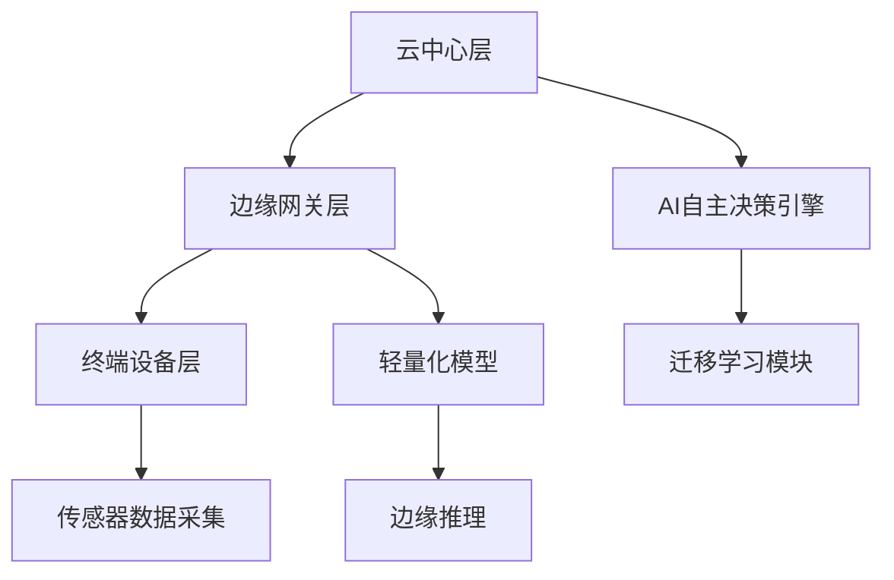
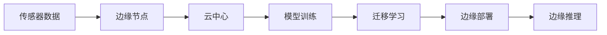

## 产品概述

农业AI迁移学习与边缘计算集成系统，在现有AI自主决策系统基础上集成迁移学习风险控制机制和边缘计算部署能力

## 核心功能

- 农业AI模型迁移学习风险控制（数据可信度验证、分层迁移、农业规则约束）
- 边缘计算部署策略（模型轻量化、分层部署、云边协同）
- 与现有AI自主决策系统的无缝集成
- 实时监控和风险预警机制
- 模型性能评估和优化建议

## 技术栈

- 后端框架：Python + FastAPI
- 机器学习框架：PyTorch/TensorFlow
- 边缘计算：Docker容器化部署
- 数据库：Redis（缓存）+ MySQL（持久化）
- 消息队列：RabbitMQ（云边通信）
- 监控工具：Prometheus + Grafana

## 架构设计

### 系统架构

采用分层架构模式，包含云中心层、边缘网关层和终端设备层



### 模块划分

- **迁移学习控制模块**：负责模型迁移的风险评估和约束验证
- **边缘部署模块**：管理模型轻量化和分层部署策略
- **云边协同模块**：处理中心与边缘节点之间的数据同步和模型更新
- **监控预警模块**：实时监控系统状态和风险预警

### 数据流设计



## 实现细节

### 核心目录结构

```
agriculture-ai/
├── migration_learning/
│   ├── risk_control/     # 风险控制模块
│   ├── data_validation/  # 数据可信度验证
│   └── rule_constraints/ # 农业规则约束
├── edge_computing/
│   ├── model_lightweight/ # 模型轻量化
│   ├── deployment_strategy/ # 部署策略
│   └── cloud_edge_sync/  # 云边协同
├── core/
│   ├── decision_engine/  # 自主决策引擎
│   └── monitoring/       # 监控系统
└── api/
    ├── endpoints/        # API接口
    └── middleware/       # 中间件
```

### 关键技术实现

- 迁移学习风险评估算法
- 模型压缩和量化技术
- 边缘节点资源调度策略
- 实时数据流处理管道

## 代理扩展

### Skill

- **ai自主决策引擎**
- 目的：集成现有的AI自主决策能力，提供农业参数优化和区块链积分分配功能
- 预期成果：实现迁移学习与自主决策的无缝衔接，提升系统智能化水平

### SubAgent

- **code-explorer**
- 目的：探索现有项目代码结构，了解当前系统架构和集成点
- 预期成果：准确识别现有系统的接口和扩展点，确保集成方案的可实施性