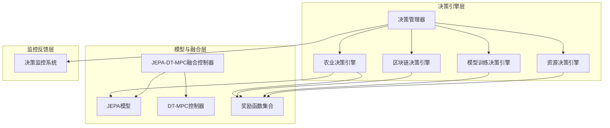
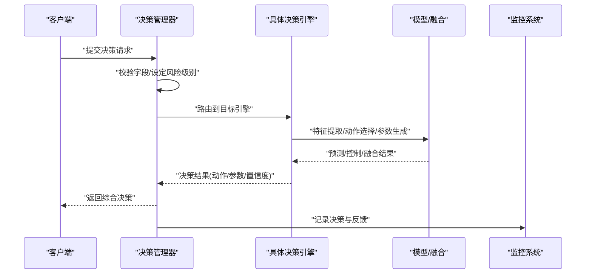
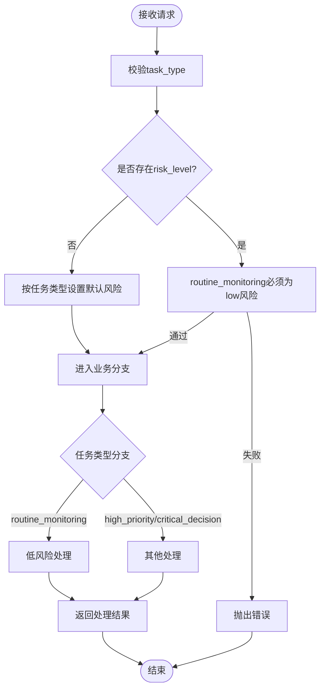
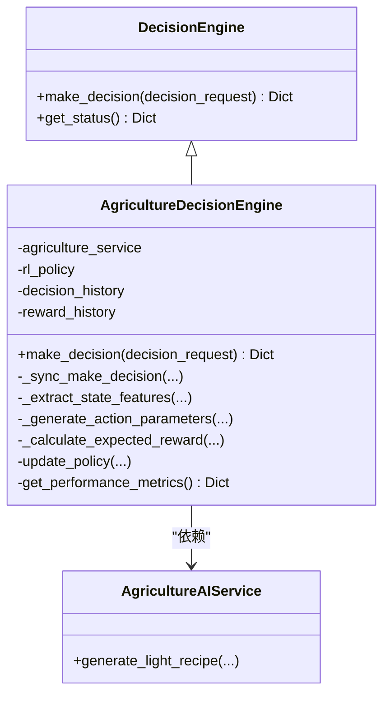
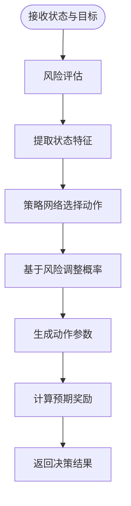
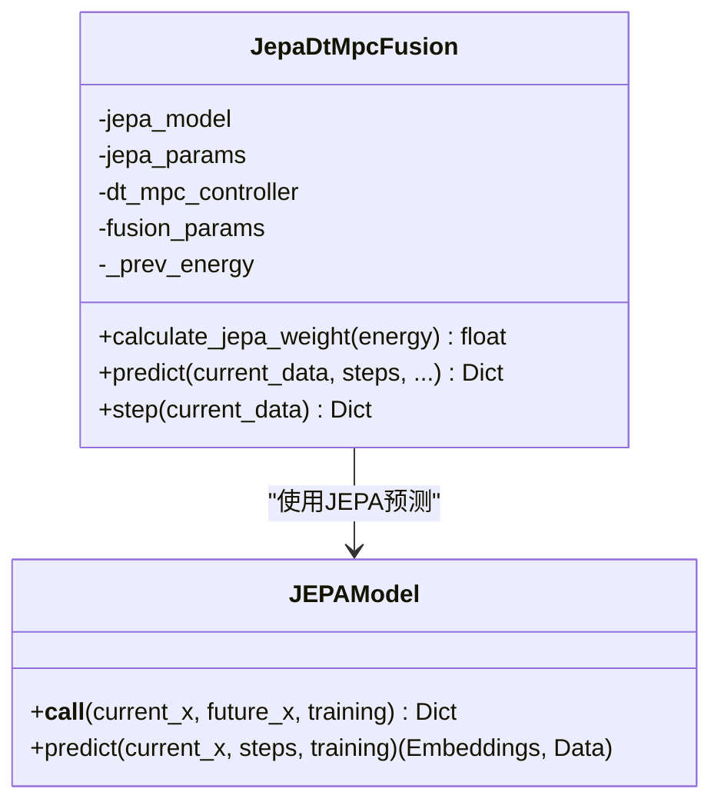
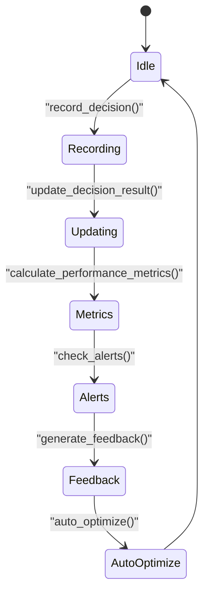
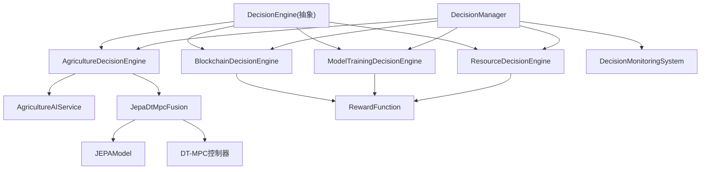

# AI决策系统

<cite>
**本文引用的文件**
- [decision_manager.py](file://backend/src/core/decision/decision_manager.py)
- [agriculture_decision_engine.py](file://backend/src/core/decision/agriculture_decision_engine.py)
- [blockchain_decision_engine.py](file://backend/src/core/decision/blockchain_decision_engine.py)
- [model_training_decision_engine.py](file://backend/src/core/decision/model_training_decision_engine.py)
- [resource_decision_engine.py](file://backend/src/core/decision/resource_decision_engine.py)
- [jepa_dtmpc_fusion.py](file://backend/src/core/models/jepa_dtmpc_fusion.py)
- [reward_functions.py](file://backend/src/core/models/reward_functions.py)
- [agriculture_model.py](file://backend/src/core/models/agriculture_model.py)
- [jepa_model.py](file://backend/src/core/models/jepa_model.py)
- [decision_engine.py](file://backend/src/core/decision_engine.py)
- [decision_monitoring_system.py](file://backend/src/core/decision/decision_monitoring_system.py)
- [ai_decision_system_architecture.md](file://ai_decision_system_architecture.md)
- [ai_judgment_mechanism_optimization.md](file://ai_judgment_mechanism_optimization.md)
</cite>

## 目录
1. [引言](#引言)
2. [项目结构](#项目结构)
3. [核心组件](#核心组件)
4. [架构总览](#架构总览)
5. [详细组件分析](#详细组件分析)
6. [依赖关系分析](#依赖关系分析)
7. [性能与鲁棒性](#性能与鲁棒性)
8. [故障排查指南](#故障排查指南)
9. [结论](#结论)
10. [附录：调参与实践指南](#附录调参与实践指南)

## 引言
本文件面向AI工程师与系统工程师，系统化梳理AI决策系统的实现机制，覆盖农业决策、区块链决策、模型训练决策与资源决策四大引擎；阐明决策管理器如何协调多个引擎并生成综合决策；解释模型融合（JEPA-DT-MPC融合）与奖励函数设计；给出决策流程的时序图与状态机模型，并提供算法调参、模型训练与效果评估的实践指南。

## 项目结构
系统采用模块化设计，核心分为“决策引擎”“模型与融合”“监控反馈”三大层面：
- 决策引擎层：农业、区块链、模型训练、资源分配四个强化学习引擎，统一继承抽象基类，提供make_decision接口。
- 模型与融合层：JEPA自监督嵌入预测模型、DT-MPC控制器、JEPA-DT-MPC能量加权融合控制器，以及多类奖励函数。
- 监控反馈层：统一的决策记录、性能指标、预警与自动优化机制。

图表来源
- [decision_manager.py](file://backend/src/core/decision/decision_manager.py#L1-L50)
- [agriculture_decision_engine.py](file://backend/src/core/decision/agriculture_decision_engine.py#L1-L120)
- [blockchain_decision_engine.py](file://backend/src/core/decision/blockchain_decision_engine.py#L1-L120)
- [model_training_decision_engine.py](file://backend/src/core/decision/model_training_decision_engine.py#L1-L120)
- [resource_decision_engine.py](file://backend/src/core/decision/resource_decision_engine.py#L1-L120)
- [jepa_dtmpc_fusion.py](file://backend/src/core/models/jepa_dtmpc_fusion.py#L1-L120)
- [jepa_model.py](file://backend/src/core/models/jepa_model.py#L143-L211)
- [reward_functions.py](file://backend/src/core/models/reward_functions.py#L1-L120)
- [decision_monitoring_system.py](file://backend/src/core/decision/decision_monitoring_system.py#L1-L120)

章节来源
- [ai_decision_system_architecture.md](file://ai_decision_system_architecture.md#L1-L120)

## 核心组件
- 决策引擎抽象基类：定义统一的make_decision接口与状态查询方法，确保各引擎实现一致性。
- 四大决策引擎：
  - 农业决策引擎：基于强化学习策略网络，结合农业服务生成光配方与状态特征，输出动作与参数。
  - 区块链决策引擎：基于强化学习策略网络，结合风险评估调整动作概率，输出积分分配、交易审批、费用与激励参数。
  - 模型训练决策引擎：基于强化学习策略网络，结合训练阈值与风险评估，输出训练启停、超参调整、模型切换与数据增强决策。
  - 资源决策引擎：基于强化学习策略网络，结合资源阈值与风险评估，输出CPU/GPU/Memory/Storage分配与扩缩容策略。
- 决策管理器：统一入口，负责请求校验、风险级别判定与结果汇总。
- 模型融合与奖励：
  - JEPA-DT-MPC融合：使用JEPA能量值动态调整JEPA与DT-MPC权重，融合预测与控制结果。
  - 奖励函数：探索、多样性、熵、组合与局部最优避免奖励，用于强化学习训练与策略优化。
- 决策监控系统：记录决策、计算性能指标、预警与自动优化。

章节来源
- [decision_engine.py](file://backend/src/core/decision_engine.py#L1-L36)
- [decision_manager.py](file://backend/src/core/decision/decision_manager.py#L1-L50)
- [jepa_dtmpc_fusion.py](file://backend/src/core/models/jepa_dtmpc_fusion.py#L1-L120)
- [reward_functions.py](file://backend/src/core/models/reward_functions.py#L1-L120)
- [decision_monitoring_system.py](file://backend/src/core/decision/decision_monitoring_system.py#L1-L120)

## 架构总览
系统采用“模块化决策引擎 + 统一管理 + 融合与奖励 + 监控反馈”的分层架构。决策管理器作为统一入口，根据任务类型与风险级别路由到对应引擎；各引擎内部封装状态特征提取、动作选择、参数生成与奖励计算；JEPA-DT-MPC融合控制器在农业与资源相关场景中提供预测与控制融合；奖励函数贯穿训练与策略优化；监控系统提供闭环反馈。

图表来源
- [decision_manager.py](file://backend/src/core/decision/decision_manager.py#L1-L50)
- [agriculture_decision_engine.py](file://backend/src/core/decision/agriculture_decision_engine.py#L120-L196)
- [blockchain_decision_engine.py](file://backend/src/core/decision/blockchain_decision_engine.py#L122-L163)
- [model_training_decision_engine.py](file://backend/src/core/decision/model_training_decision_engine.py#L131-L172)
- [resource_decision_engine.py](file://backend/src/core/decision/resource_decision_engine.py#L150-L191)
- [jepa_dtmpc_fusion.py](file://backend/src/core/models/jepa_dtmpc_fusion.py#L69-L135)
- [decision_monitoring_system.py](file://backend/src/core/decision/decision_monitoring_system.py#L109-L176)

## 详细组件分析

### 决策管理器（DecisionManager）
- 职责：统一决策入口，校验请求字段，根据任务类型与风险级别生成处理结果；对特定任务（如routine_monitoring）强制低风险模式。
- 关键点：字段校验、默认风险级别推断、业务规则约束、返回结构标准化。

图表来源
- [decision_manager.py](file://backend/src/core/decision/decision_manager.py#L9-L50)

章节来源
- [decision_manager.py](file://backend/src/core/decision/decision_manager.py#L1-L50)

### 农业决策引擎（AgricultureDecisionEngine）
- 状态与动作：定义AgricultureState、DecisionAction、DecisionObjective；策略网络输出动作概率与价值估计。
- 特征工程：提取环境、光谱、作物状态、系统状态与目标编码，归一化后输入策略网络。
- 动作参数生成：依据目标与当前状态生成光谱调整、温湿度、营养液、摄像头控制等参数。
- 奖励计算：基于目标、动作有效性与参数质量进行加权，形成预期奖励。
- 性能指标：提供平均奖励、决策次数与近期成功率等。

图表来源
- [decision_engine.py](file://backend/src/core/decision_engine.py#L1-L36)
- [agriculture_decision_engine.py](file://backend/src/core/decision/agriculture_decision_engine.py#L1-L120)
- [agriculture_model.py](file://backend/src/core/models/agriculture_model.py#L209-L463)

章节来源
- [agriculture_decision_engine.py](file://backend/src/core/decision/agriculture_decision_engine.py#L1-L508)
- [agriculture_model.py](file://backend/src/core/models/agriculture_model.py#L1-L463)

### 区块链决策引擎（BlockchainDecisionEngine）
- 状态与动作：定义BlockchainState、BlockchainAction、BlockchainObjective；策略网络输出动作概率与价值估计。
- 风险评估：综合用户风险、市场风险、系统风险与时间因素，计算总风险与风险等级。
- 动作参数生成：积分分配、交易审批、手续费、激励与风控参数随目标与风险动态调整。
- 奖励计算：基于目标导向与动作有效性、参数合理性进行加权。

图表来源
- [blockchain_decision_engine.py](file://backend/src/core/decision/blockchain_decision_engine.py#L122-L163)
- [blockchain_decision_engine.py](file://backend/src/core/decision/blockchain_decision_engine.py#L165-L240)
- [blockchain_decision_engine.py](file://backend/src/core/decision/blockchain_decision_engine.py#L256-L431)

章节来源
- [blockchain_decision_engine.py](file://backend/src/core/decision/blockchain_decision_engine.py#L1-L507)

### 模型训练决策引擎（ModelTrainingDecisionEngine）
- 状态与动作：定义TrainingState、TrainingAction、TrainingObjective；策略网络输出动作概率与价值估计。
- 风险评估：训练时间、资源使用、性能与收敛风险，计算总风险与风险等级。
- 动作参数生成：训练启停、超参调整、模型切换、数据增强等参数随目标与风险动态调整。
- 奖励计算：基于目标导向与动作有效性、参数合理性进行加权。

章节来源
- [model_training_decision_engine.py](file://backend/src/core/decision/model_training_decision_engine.py#L1-L548)

### 资源决策引擎（ResourceDecisionEngine）
- 状态与动作：定义ResourceState、ResourceAction、ResourceObjective；策略网络输出动作概率与价值估计。
- 风险评估：CPU/Memory/GPU/Storage/网络与系统负载风险，计算总风险与风险等级。
- 动作参数生成：CPU/GPU/Memory/Storage分配、负载均衡、扩缩容等参数随目标与风险动态调整。
- 奖励计算：基于目标导向与动作有效性、参数合理性进行加权。

章节来源
- [resource_decision_engine.py](file://backend/src/core/decision/resource_decision_engine.py#L1-L651)

### 模型融合与奖励函数
- JEPA-DT-MPC融合：
  - 使用JEPA能量值（基于嵌入余弦相似度）动态计算JEPA权重，DT-MPC权重互补；
  - 对齐预测步数后进行加权融合，输出融合预测、JEPA/DT-MPC权重与能量值。
- 奖励函数：
  - 探索奖励：鼓励探索未访问状态，基于访问计数与距离度量；
  - 多样性奖励：鼓励生成多样化输出，基于n-gram集合；
  - 熵奖励：基于动作概率分布熵，鼓励不确定性下的探索；
  - 局部最优避免奖励：综合探索、多样性、改进与停滞惩罚；
  - 组合奖励：将多个奖励函数按权重组合。

图表来源
- [jepa_dtmpc_fusion.py](file://backend/src/core/models/jepa_dtmpc_fusion.py#L1-L162)
- [jepa_model.py](file://backend/src/core/models/jepa_model.py#L143-L211)

章节来源
- [jepa_dtmpc_fusion.py](file://backend/src/core/models/jepa_dtmpc_fusion.py#L1-L232)
- [jepa_model.py](file://backend/src/core/models/jepa_model.py#L1-L286)
- [reward_functions.py](file://backend/src/core/models/reward_functions.py#L1-L342)

### 决策监控系统（DecisionMonitoringSystem）
- 记录决策：保存决策ID、模块、动作、参数、期望/实际奖励、置信度、执行时间与风险评估。
- 性能指标：总决策数、成功决策数、平均奖励、平均置信度、平均执行时间、近期成功率、风险控制效果与性能等级。
- 预警机制：基于成功率、平均奖励、置信度与执行时间阈值触发预警。
- 自动优化：根据性能等级自动调整学习率、探索率与风险阈值等参数。

图表来源
- [decision_monitoring_system.py](file://backend/src/core/decision/decision_monitoring_system.py#L109-L176)
- [decision_monitoring_system.py](file://backend/src/core/decision/decision_monitoring_system.py#L177-L242)
- [decision_monitoring_system.py](file://backend/src/core/decision/decision_monitoring_system.py#L277-L349)
- [decision_monitoring_system.py](file://backend/src/core/decision/decision_monitoring_system.py#L545-L610)

章节来源
- [decision_monitoring_system.py](file://backend/src/core/decision/decision_monitoring_system.py#L1-L613)

## 依赖关系分析
- 引擎与基类：四个决策引擎均继承抽象基类，统一接口与状态查询。
- 引擎与模型：
  - 农业引擎依赖农业服务（光配方生成与生长预测）；
  - 融合控制器依赖JEPA模型与DT-MPC控制器；
  - 所有引擎均可使用奖励函数进行策略优化。
- 管理器与监控：管理器统一调度引擎并将结果写入监控系统，形成闭环反馈。

图表来源
- [decision_engine.py](file://backend/src/core/decision_engine.py#L1-L36)
- [agriculture_decision_engine.py](file://backend/src/core/decision/agriculture_decision_engine.py#L1-L120)
- [blockchain_decision_engine.py](file://backend/src/core/decision/blockchain_decision_engine.py#L1-L120)
- [model_training_decision_engine.py](file://backend/src/core/decision/model_training_decision_engine.py#L1-L120)
- [resource_decision_engine.py](file://backend/src/core/decision/resource_decision_engine.py#L1-L120)
- [jepa_dtmpc_fusion.py](file://backend/src/core/models/jepa_dtmpc_fusion.py#L1-L120)
- [jepa_model.py](file://backend/src/core/models/jepa_model.py#L143-L211)
- [reward_functions.py](file://backend/src/core/models/reward_functions.py#L1-L120)
- [decision_manager.py](file://backend/src/core/decision/decision_manager.py#L1-L50)
- [decision_monitoring_system.py](file://backend/src/core/decision/decision_monitoring_system.py#L1-L120)

章节来源
- [ai_decision_system_architecture.md](file://ai_decision_system_architecture.md#L1-L120)

## 性能与鲁棒性
- 实时性：各引擎返回毫秒级/秒级响应时间，满足高并发场景。
- 风险控制：引擎内置风险评估与阈值，高风险时倾向保守动作或触发风控参数。
- 融合与奖励：JEPA能量值动态调节权重，避免单一模型偏差；奖励函数鼓励探索与多样性，缓解局部最优。
- 监控与反馈：统一记录与指标计算，支持预警与自动优化，形成闭环。

章节来源
- [blockchain_decision_engine.py](file://backend/src/core/decision/blockchain_decision_engine.py#L195-L240)
- [model_training_decision_engine.py](file://backend/src/core/decision/model_training_decision_engine.py#L174-L211)
- [resource_decision_engine.py](file://backend/src/core/decision/resource_decision_engine.py#L193-L231)
- [jepa_dtmpc_fusion.py](file://backend/src/core/models/jepa_dtmpc_fusion.py#L41-L68)
- [reward_functions.py](file://backend/src/core/models/reward_functions.py#L1-L120)
- [decision_monitoring_system.py](file://backend/src/core/decision/decision_monitoring_system.py#L277-L349)

## 故障排查指南
- 决策管理器报错：检查请求字段（task_type、risk_level），确认routine_monitoring仅允许low风险。
- 引擎返回异常：查看状态特征提取是否越界或归一化异常；核对动作参数范围与合理性。
- 融合权重异常：检查JEPA能量值计算与平滑参数，确认权重裁剪范围合理。
- 奖励函数导致训练不稳定：调整探索、多样性、熵等权重，或启用局部最优避免奖励。
- 监控系统预警：根据模块性能等级采取相应措施（重置策略、增加探索、降低风险阈值或维持稳定）。

章节来源
- [decision_manager.py](file://backend/src/core/decision/decision_manager.py#L9-L50)
- [agriculture_decision_engine.py](file://backend/src/core/decision/agriculture_decision_engine.py#L383-L396)
- [blockchain_decision_engine.py](file://backend/src/core/decision/blockchain_decision_engine.py#L433-L461)
- [model_training_decision_engine.py](file://backend/src/core/decision/model_training_decision_engine.py#L488-L501)
- [resource_decision_engine.py](file://backend/src/core/decision/resource_decision_engine.py#L588-L603)
- [jepa_dtmpc_fusion.py](file://backend/src/core/models/jepa_dtmpc_fusion.py#L112-L135)
- [reward_functions.py](file://backend/src/core/models/reward_functions.py#L219-L342)
- [decision_monitoring_system.py](file://backend/src/core/decision/decision_monitoring_system.py#L545-L610)

## 结论
该AI决策系统以强化学习为核心，围绕农业、区块链、模型训练与资源分配四大领域构建了可扩展、可监控、可优化的决策框架。通过JEPA-DT-MPC融合与多类奖励函数，系统在不确定性环境中实现了稳健的预测与控制；通过统一的决策管理器与监控反馈，形成了闭环的自适应优化路径。建议在实际部署中重点关注状态特征质量、奖励函数设计与风险阈值调优，并结合监控系统持续迭代。

## 附录：调参与实践指南
- 农业参数优化
  - 特征归一化：确保输入状态在合理区间，避免极端值影响策略网络。
  - 目标编码：根据目标调整编码值，使策略网络更好区分不同目标。
  - 动作参数范围：限制调整幅度，避免过大扰动。
  - 奖励函数：以目标为导向，逐步引入探索与多样性奖励。
- 区块链积分分配
  - 风险阈值：根据系统利用率与市场供需动态调整。
  - 审批与风控：高风险时提高审批阈值与手动审批要求。
  - 激励机制：结合市场比率与公平性目标，平衡增长与公平。
- 模型训练决策
  - 训练阈值：根据GPU/CPU/内存使用与收敛速度设定上限。
  - 超参调整：基于收敛率与资源使用动态调整学习率与batch size。
  - 数据增强：根据数据质量强度调整增强策略。
- 资源分配
  - 资源阈值：根据CPU/Memory/GPU/Storage与网络IO设定临界值。
  - 负载均衡：高风险时提高迁移阈值与再均衡激进度。
  - 扩缩容：结合利用率与风险等级制定缩放策略。
- 模型融合与奖励
  - 能量平滑：通过平滑因子抑制波动，提升权重稳定性。
  - 奖励组合：探索、多样性、熵与局部最优避免奖励按需组合。
- 监控与优化
  - 性能等级：根据成功率、平均奖励、置信度与执行时间综合评估。
  - 自动优化：根据性能等级调整学习率、探索率与风险阈值。

章节来源
- [agriculture_decision_engine.py](file://backend/src/core/decision/agriculture_decision_engine.py#L198-L240)
- [blockchain_decision_engine.py](file://backend/src/core/decision/blockchain_decision_engine.py#L237-L274)
- [model_training_decision_engine.py](file://backend/src/core/decision/model_training_decision_engine.py#L259-L277)
- [resource_decision_engine.py](file://backend/src/core/decision/resource_decision_engine.py#L286-L304)
- [jepa_dtmpc_fusion.py](file://backend/src/core/models/jepa_dtmpc_fusion.py#L31-L68)
- [reward_functions.py](file://backend/src/core/models/reward_functions.py#L192-L342)
- [decision_monitoring_system.py](file://backend/src/core/decision/decision_monitoring_system.py#L545-L610)
- [ai_judgment_mechanism_optimization.md](file://ai_judgment_mechanism_optimization.md#L1-L262)