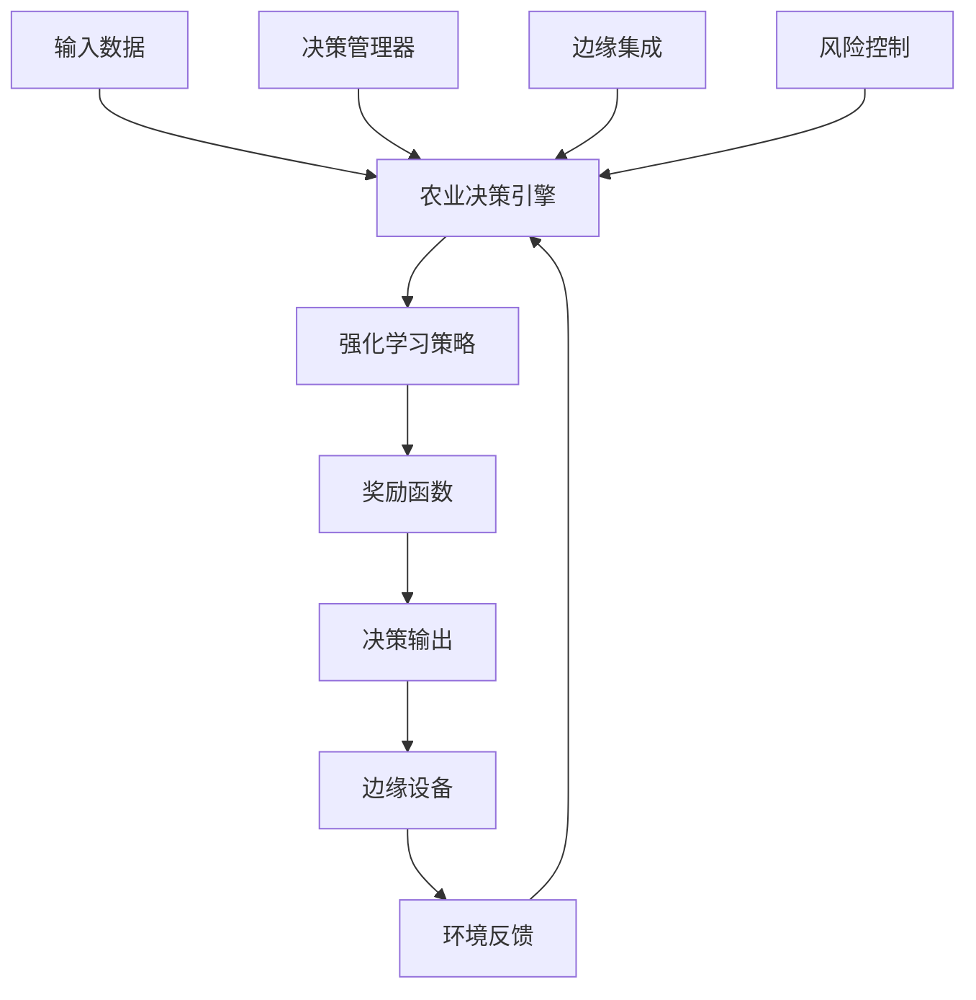
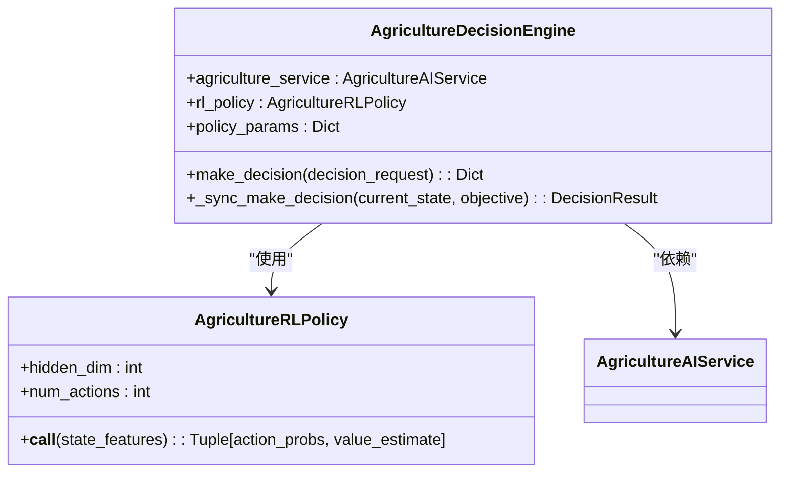
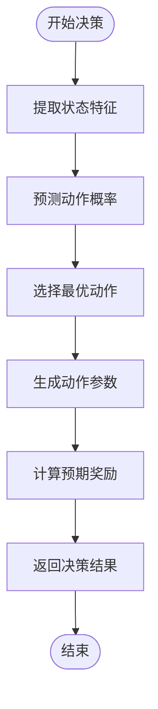
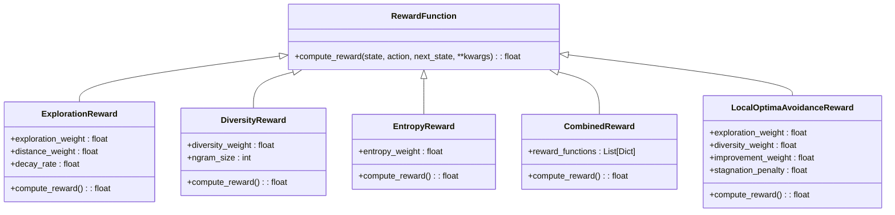
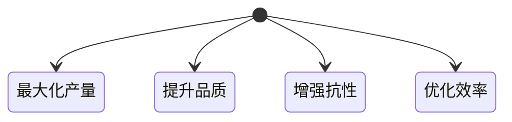
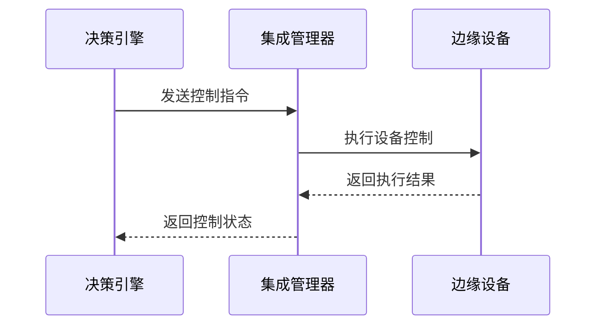
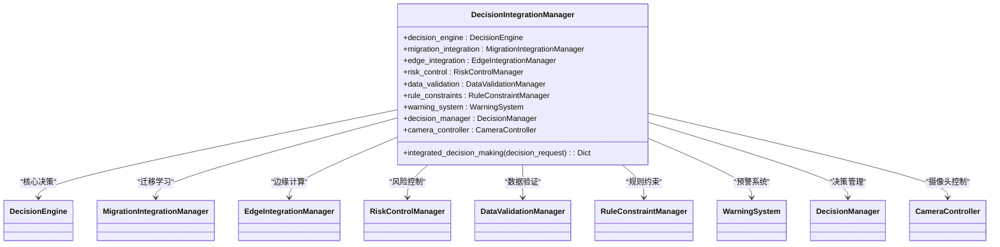
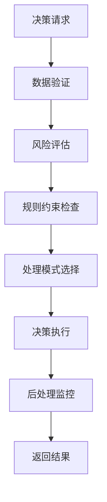
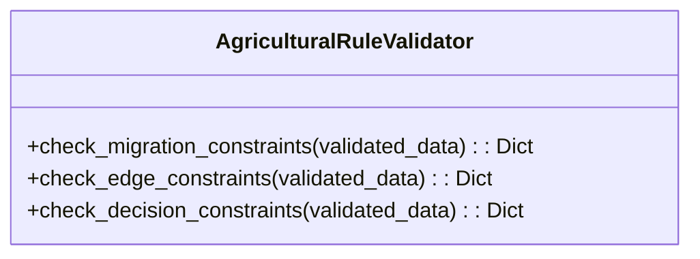

# 农业决策引擎

<cite>
**本文档引用的文件**   
- [agriculture_decision_engine.py](file://backend/src/core/decision/agriculture_decision_engine.py)
- [agriculture_model.py](file://backend/src/core/models/agriculture_model.py)
- [reward_functions.py](file://backend/src/core/models/reward_functions.py)
- [decision_integration.py](file://backend/src/integration/decision_integration.py)
- [decision.py](file://backend/src/api/routes/decision.py)
- [performance_config.py](file://backend/config/performance_config.py)
</cite>

## 目录
1. [引言](#引言)
2. [系统架构](#系统架构)
3. [核心组件分析](#核心组件分析)
4. [强化学习算法实现](#强化学习算法实现)
5. [决策流程与数据处理](#决策流程与数据处理)
6. [奖励函数设计](#奖励函数设计)
7. [超参数配置](#超参数配置)
8. [多目标优化策略](#多目标优化策略)
9. [边缘设备联动控制](#边缘设备联动控制)
10. [决策管理器集成](#决策管理器集成)
11. [专家配置方法](#专家配置方法)
12. [常见问题排查](#常见问题排查)
13. [结论](#结论)

## 引言
农业决策引擎是一个基于强化学习的智能系统，旨在优化作物生长参数。该引擎通过分析土壤湿度、气象数据和作物类型等输入信息，生成最优的灌溉量、施肥策略和种植密度等决策输出。系统采用PPO（Proximal Policy Optimization）算法作为核心强化学习方法，结合边缘计算设备实现精准的农业管理。

## 系统架构

**图源**
- [agriculture_decision_engine.py](file://backend/src/core/decision/agriculture_decision_engine.py#L1-L508)
- [decision_integration.py](file://backend/src/integration/decision_integration.py#L1-L615)

## 核心组件分析

### 农业决策引擎
农业决策引擎是系统的核心组件，负责处理农业相关的决策任务。它继承自`DecisionEngine`基类，实现了基于强化学习的决策机制。

**组件源**
- [agriculture_decision_engine.py](file://backend/src/core/decision/agriculture_decision_engine.py#L1-L508)

### 农业AI服务
农业AI服务提供作物生长模型、光谱分析和光配方生成等核心功能。该服务包含预定义的作物配置，支持多种作物类型。

**组件源**
- [agriculture_model.py](file://backend/src/core/models/agriculture_model.py#L1-L463)

## 强化学习算法实现

### PPO算法架构
系统采用PPO算法作为强化学习框架，其核心是策略网络和价值网络的联合优化。策略网络输出动作概率，价值网络估计状态价值。

**图源**
- [agriculture_decision_engine.py](file://backend/src/core/decision/agriculture_decision_engine.py#L68-L91)

### 状态特征提取
系统将农业环境状态转换为特征向量，包括环境参数、光谱参数、作物状态和系统状态。

**组件源**
- [agriculture_decision_engine.py](file://backend/src/core/decision/agriculture_decision_engine.py#L198-L229)

## 决策流程与数据处理

### 输入数据处理
系统接收多种输入数据，包括：
- 环境参数：温度、湿度、CO2浓度、光照强度
- 光谱参数：紫外线、远红外线、白光、红光强度
- 作物信息：作物类型、生长天数、生长率、健康评分
- 系统状态：能耗、资源利用率

### 决策输出生成
决策输出包括动作类型和具体参数，系统根据当前状态和目标生成最优决策。

**图源**
- [agriculture_decision_engine.py](file://backend/src/core/decision/agriculture_decision_engine.py#L162-L196)

## 奖励函数设计

### 奖励函数类型
系统实现了多种奖励函数，用于避免局部最优解：

**图源**
- [reward_functions.py](file://backend/src/core/models/reward_functions.py#L12-L342)

### 奖励计算逻辑
奖励函数根据基础奖励、探索奖励、多样性奖励和改进奖励进行综合计算。

**组件源**
- [reward_functions.py](file://backend/src/core/models/reward_functions.py#L241-L287)

## 超参数配置

### 强化学习超参数
系统配置了关键的强化学习超参数：

| 参数 | 值 | 说明 |
|------|-----|------|
| 学习率 | 0.001 | 模型更新步长 |
| 折扣因子 | 0.99 | 未来奖励衰减率 |
| 探索率 | 0.1 | 随机探索概率 |
| 经验缓冲区大小 | 10000 | 存储的历史经验数量 |
| 批量训练大小 | 32 | 每次训练的样本数量 |

**组件源**
- [performance_config.py](file://backend/config/performance_config.py#L23-L31)

### 决策引擎配置
决策引擎的性能配置参数：

| 参数 | 值 | 说明 |
|------|-----|------|
| 最大并发决策数 | 10 | 同时处理的决策请求数 |
| 决策超时时间 | 2.0秒 | 决策处理的最大时间 |
| 缓存大小 | 1000 | 存储的决策结果数量 |
| 缓存生存时间 | 300秒 | 缓存的有效期 |

**组件源**
- [performance_config.py](file://backend/config/performance_config.py#L13-L20)

## 多目标优化策略

### 决策目标枚举
系统支持多种决策目标：

**图源**
- [agriculture_decision_engine.py](file://backend/src/core/decision/agriculture_decision_engine.py#L26-L32)

### 目标权衡策略
系统根据不同的目标调整决策策略，实现多目标优化。

**组件源**
- [agriculture_decision_engine.py](file://backend/src/core/decision/agriculture_decision_engine.py#L333-L348)

## 边缘设备联动控制

### 设备控制流程
系统与边缘设备的联动控制流程：

**图源**
- [decision_integration.py](file://backend/src/integration/decision_integration.py#L288-L292)

### 摄像头控制
系统支持摄像头的智能控制，根据作物健康状况自动启动视觉识别。

**组件源**
- [decision_integration.py](file://backend/src/integration/decision_integration.py#L294-L349)

## 决策管理器集成

### 集成架构
决策管理器与其他组件的集成关系：

**图源**
- [decision_integration.py](file://backend/src/integration/decision_integration.py#L23-L615)

### 风险控制流程
系统通过多层风险控制确保决策安全：

**图源**
- [decision_integration.py](file://backend/src/integration/decision_integration.py#L54-L111)

## 专家配置方法

### 农业规则验证
农业专家可以通过配置规则约束来调整决策行为：

**组件源**
- [decision_integration.py](file://backend/src/integration/decision_integration.py#L37-L38)

### 配置调整接口
系统提供配置更新接口，允许专家动态调整系统参数。

**组件源**
- [decision_integration.py](file://backend/src/integration/decision_integration.py#L597-L615)

## 常见问题排查

### 决策延迟问题
当出现决策延迟时，可检查以下方面：

1. **系统资源**：检查CPU、内存和GPU使用率
2. **网络延迟**：检查边缘设备与决策引擎的通信延迟
3. **缓存配置**：确认缓存大小和生存时间设置合理
4. **并发限制**：检查最大并发决策数是否过低

**组件源**
- [performance_config.py](file://backend/config/performance_config.py#L13-L20)

### 参数过拟合问题
针对参数过拟合问题，建议采取以下措施：

1. **增加探索率**：提高`exploration_rate`参数值
2. **调整奖励函数**：增强探索奖励和多样性奖励
3. **监控性能指标**：定期检查决策性能和奖励变化
4. **数据多样性**：确保训练数据具有足够的多样性

**组件源**
- [reward_functions.py](file://backend/src/core/models/reward_functions.py#L226-L240)

## 结论
农业决策引擎通过强化学习算法实现了作物生长参数的智能优化。系统结合了PPO算法、多目标优化和边缘计算技术，能够根据环境数据和作物状态生成最优决策。通过与决策管理器的深度集成，系统实现了安全可靠的自主决策能力。未来可通过持续优化奖励函数和超参数配置，进一步提升系统的决策质量和适应性。