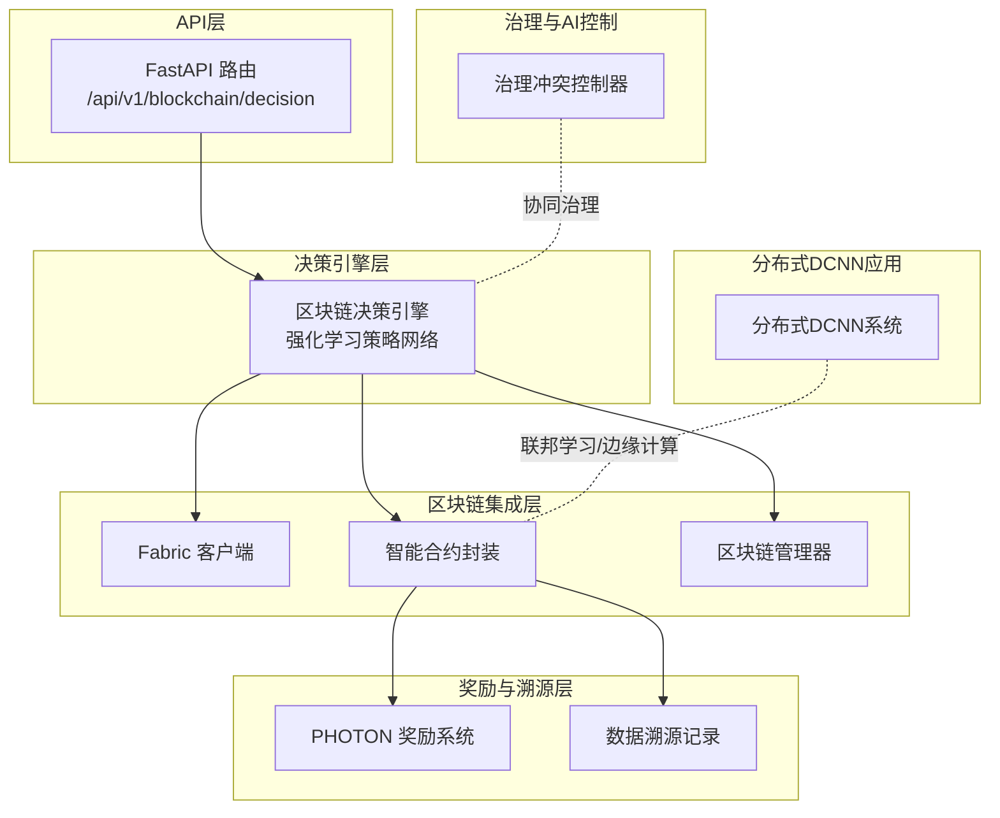
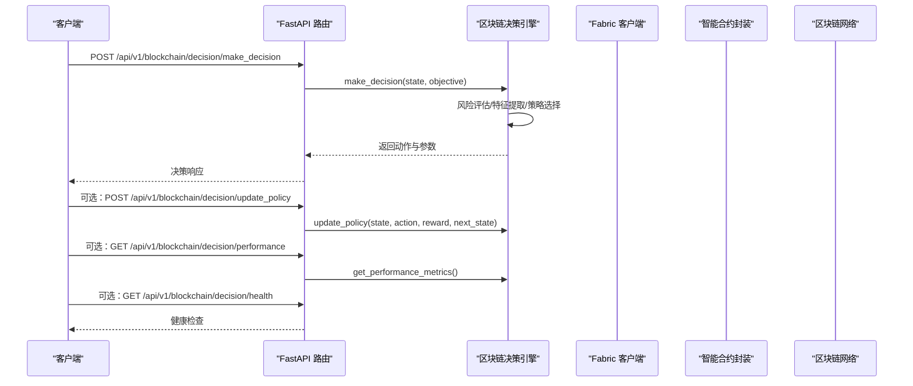
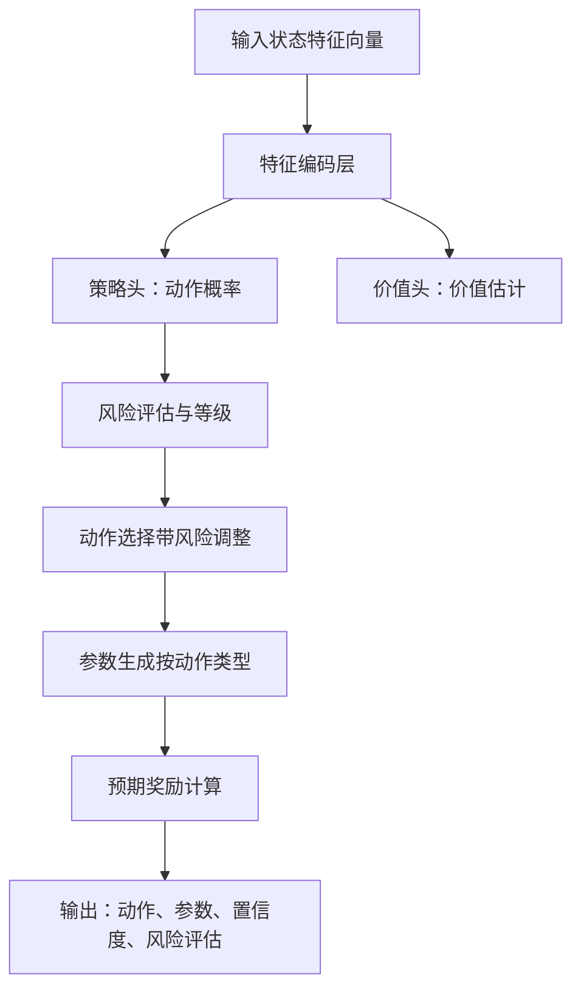
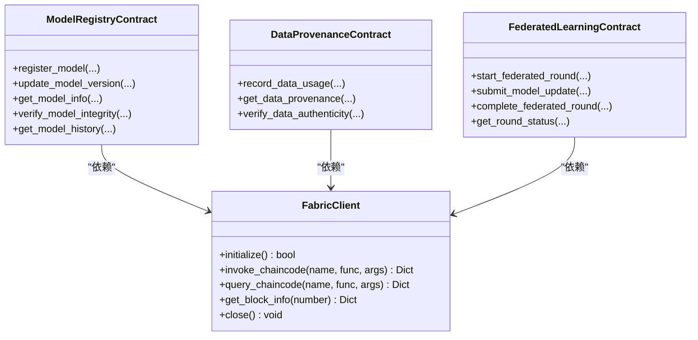
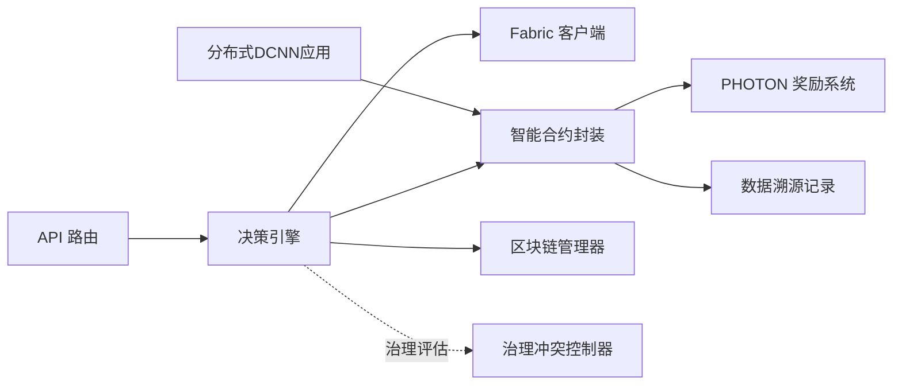

# 区块链决策引擎

<cite>
**本文引用的文件列表**
- [fabric_client.py](file://backend/src/blockchain/fabric_client.py)
- [blockchain_decision_engine.py](file://backend/src/core/decision/blockchain_decision_engine.py)
- [photon_rewards.py](file://backend/src/blockchain/photon_rewards.py)
- [smart_contracts.py](file://backend/src/blockchain/smart_contracts.py)
- [blockchain_manager.py](file://backend/src/blockchain/blockchain_manager.py)
- [config.py](file://backend/src/blockchain/config.py)
- [blockchain_decision.py](file://backend/src/api/routes/blockchain_decision.py)
- [governance_conflict_controller.py](file://backend/src/ai_risk_control/governance_conflict_controller.py)
- [main.py](file://backend/src/distributed_dcnn/main.py)
</cite>

## 目录
1. [引言](#引言)
2. [项目结构](#项目结构)
3. [核心组件](#核心组件)
4. [架构总览](#架构总览)
5. [详细组件分析](#详细组件分析)
6. [依赖关系分析](#依赖关系分析)
7. [性能考量](#性能考量)
8. [故障排查指南](#故障排查指南)
9. [结论](#结论)
10. [附录](#附录)

## 引言
本文件面向“区块链决策引擎”的技术实现，聚焦以下目标：
- 基于链上数据（模型贡献记录、数据使用溯源）生成激励分配与权限控制决策；
- 与 Hyperledger Fabric 的交互机制（智能合约调用、交易验证与事件监听）；
- 决策输入（节点贡献度、数据质量评分）到输出（Photon 奖励分配、访问权限升降）的映射逻辑；
- 结合代码片段展示 fabric_client.py 的集成方式与共识机制影响；
- 在去中心化治理中的角色，以及与 AI 控制模块的协同逻辑；
- 性能瓶颈（如链上查询延迟）的优化建议与故障恢复策略。

## 项目结构
该系统围绕“区块链决策引擎”构建，主要由以下层次组成：
- API 层：提供区块链决策的 REST 接口，驱动决策引擎工作；
- 决策引擎层：基于强化学习的策略网络，输出动作与参数；
- 区块链集成层：Fabric 客户端、智能合约封装、链上状态管理；
- 奖励与溯源层：PHOTON 奖励系统与数据溯源记录；
- 去中心化治理与 AI 控制：治理冲突评估与人-AI协作机制；
- 分布式 DCNN 应用：联邦学习、边缘计算与区块链奖励的闭环。

图表来源
- [blockchain_decision.py](file://backend/src/api/routes/blockchain_decision.py#L1-L259)
- [blockchain_decision_engine.py](file://backend/src/core/decision/blockchain_decision_engine.py#L1-L507)
- [fabric_client.py](file://backend/src/blockchain/fabric_client.py#L1-L222)
- [smart_contracts.py](file://backend/src/blockchain/smart_contracts.py#L1-L249)
- [blockchain_manager.py](file://backend/src/blockchain/blockchain_manager.py#L1-L366)
- [photon_rewards.py](file://backend/src/blockchain/photon_rewards.py#L1-L165)
- [governance_conflict_controller.py](file://backend/src/ai_risk_control/governance_conflict_controller.py#L1-L644)
- [main.py](file://backend/src/distributed_dcnn/main.py#L1-L181)

章节来源
- [blockchain_decision.py](file://backend/src/api/routes/blockchain_decision.py#L1-L259)
- [blockchain_decision_engine.py](file://backend/src/core/decision/blockchain_decision_engine.py#L1-L507)
- [fabric_client.py](file://backend/src/blockchain/fabric_client.py#L1-L222)
- [smart_contracts.py](file://backend/src/blockchain/smart_contracts.py#L1-L249)
- [blockchain_manager.py](file://backend/src/blockchain/blockchain_manager.py#L1-L366)
- [photon_rewards.py](file://backend/src/blockchain/photon_rewards.py#L1-L165)
- [governance_conflict_controller.py](file://backend/src/ai_risk_control/governance_conflict_controller.py#L1-L644)
- [main.py](file://backend/src/distributed_dcnn/main.py#L1-L181)

## 核心组件
- 区块链决策引擎：基于 JAX/Flax 的强化学习策略网络，输入区块链系统状态，输出动作与参数，并评估预期奖励与风险等级。
- Fabric 客户端：封装 Hyperledger Fabric 的连接、通道健康检查、智能合约调用与查询、区块信息获取。
- 智能合约封装：对模型注册、数据溯源、联邦学习等合约进行统一接口封装。
- 区块链管理器：提供开发/生产模式切换、链上状态查询与模拟实现。
- PHOTON 奖励系统：基于贡献记录的多维度评分与池化分配，支持链上/链下模拟。
- 去中心化治理控制器：评估 AI 决策与社区治理之间的冲突，提供协作与应急机制。
- 分布式 DCNN 应用：将联邦学习、边缘计算与区块链奖励串联，形成闭环。

章节来源
- [blockchain_decision_engine.py](file://backend/src/core/decision/blockchain_decision_engine.py#L1-L507)
- [fabric_client.py](file://backend/src/blockchain/fabric_client.py#L1-L222)
- [smart_contracts.py](file://backend/src/blockchain/smart_contracts.py#L1-L249)
- [blockchain_manager.py](file://backend/src/blockchain/blockchain_manager.py#L1-L366)
- [photon_rewards.py](file://backend/src/blockchain/photon_rewards.py#L1-L165)
- [governance_conflict_controller.py](file://backend/src/ai_risk_control/governance_conflict_controller.py#L1-L644)
- [main.py](file://backend/src/distributed_dcnn/main.py#L1-L181)

## 架构总览
系统通过 API 路由触发决策引擎，决策引擎根据目标与状态生成动作参数；随后通过 Fabric 客户端与智能合约封装访问链上状态或提交事务；同时，PHOTON 奖励系统与数据溯源记录为激励与合规提供依据；治理控制器评估 AI 决策与社区治理的冲突，必要时介入。

图表来源
- [blockchain_decision.py](file://backend/src/api/routes/blockchain_decision.py#L1-L259)
- [blockchain_decision_engine.py](file://backend/src/core/decision/blockchain_decision_engine.py#L1-L507)

章节来源
- [blockchain_decision.py](file://backend/src/api/routes/blockchain_decision.py#L1-L259)
- [blockchain_decision_engine.py](file://backend/src/core/decision/blockchain_decision_engine.py#L1-L507)

## 详细组件分析

### 区块链决策引擎（强化学习策略）
- 输入状态：用户贡献度、活跃度、信誉度、余额；市场需求/供应、交易量、平均交易价值；总发行/流通积分、系统利用率、风险水平；距离上次决策的时间；目标枚举。
- 动作空间：分配积分、审批交易、设置交易费、调整激励、风险控制、无动作。
- 策略网络：两分支（动作概率、价值估计），状态特征向量经全连接层+ReLU，再分别输出动作与价值。
- 风险评估：用户/市场/系统风险合成，给出风险等级；高风险时倾向保守动作。
- 参数生成：针对不同动作生成具体参数（如积分分配数量、审批阈值、交易费率、激励倍数、风控限额等）。
- 预期奖励：按目标与动作有效性、参数合理性打分。
- 策略更新：记录经验并维护历史，提供性能指标（平均奖励、决策次数、近期成功率、风控效果）。

图表来源
- [blockchain_decision_engine.py](file://backend/src/core/decision/blockchain_decision_engine.py#L1-L507)

章节来源
- [blockchain_decision_engine.py](file://backend/src/core/decision/blockchain_decision_engine.py#L1-L507)

### Fabric 客户端与智能合约交互
- 初始化与健康检查：加载网络配置，获取组织管理员用户与通道，检查通道可用性。
- 智能合约调用：invoke_chaincode 支持链上事务提交，返回交易 ID、负载与时间戳；query_chaincode 支持状态查询；get_block_info 获取区块信息。
- 模拟实现：当 hfc 不可用时，使用模拟路径，便于开发与测试。
- 与智能合约封装配合：ModelRegistryContract/DataProvenanceContract/FederatedLearningContract 将 Fabric 客户端与具体合约方法绑定，统一参数序列化与结果解析。

图表来源
- [fabric_client.py](file://backend/src/blockchain/fabric_client.py#L1-L222)
- [smart_contracts.py](file://backend/src/blockchain/smart_contracts.py#L1-L249)

章节来源
- [fabric_client.py](file://backend/src/blockchain/fabric_client.py#L1-L222)
- [smart_contracts.py](file://backend/src/blockchain/smart_contracts.py#L1-L249)

### 区块链管理器与链上状态
- 初始化：开发模式下返回模拟状态；生产模式下可扩展接入真实网络。
- 模型注册/版本更新/完整性校验/历史查询：提供链上模型生命周期管理。
- 数据溯源记录/查询：记录训练/推理数据使用并可回溯。
- 联邦学习轮次：启动、提交更新、完成聚合，提供状态查询。
- 关闭：释放资源。

章节来源
- [blockchain_manager.py](file://backend/src/blockchain/blockchain_manager.py#L1-L366)

### PHOTON 奖励系统与数据溯源
- 贡献记录结构：包含边缘节点标识、模型改进度、数据质量、推理速度、时间戳与哈希。
- 贡献评分：按权重计算总分，归一化至[0,1]。
- 奖励分配：按总贡献度占比分配池化奖励。
- 记录与验证：生成贡献哈希并存档，支持验证。
- 智能合约接口模拟：部署、执行分发、交易验证。

章节来源
- [photon_rewards.py](file://backend/src/blockchain/photon_rewards.py#L1-L165)

### 去中心化治理与 AI 控制协同
- 治理冲突评估：评估权力争夺、决策冲突、共识破坏、治理失效、社区分裂等风险，计算协作评分与共识稳定性。
- 共识管理：基于共识达成率、节点参与度、算力集中度等指标评估风险。
- 社区调解与人-AI 协作：促进冲突解决与决策最终化。
- 与决策引擎协同：在高冲突风险时调整策略或触发应急机制，保障系统稳定。

章节来源
- [governance_conflict_controller.py](file://backend/src/ai_risk_control/governance_conflict_controller.py#L1-L644)

### 分布式 DCNN 应用与联邦学习
- 主程序：初始化 DCNN 系统、联邦学习管理器与奖励管理器，提供批量图像处理、系统状态查询。
- 与区块链集成：通过智能合约封装与奖励系统对接，形成“联邦学习—边缘计算—链上奖励”的闭环。

章节来源
- [main.py](file://backend/src/distributed_dcnn/main.py#L1-L181)

## 依赖关系分析
- API 路由依赖决策引擎；决策引擎依赖状态与目标枚举；输出动作与参数供后续链上操作使用。
- Fabric 客户端与智能合约封装解耦，便于替换网络实现（开发/生产）。
- 区块链管理器提供统一的链上操作接口，屏蔽底层差异。
- PHOTON 奖励系统与数据溯源为链上激励与合规提供数据基础。
- 治理控制器与 AI 控制模块协同，避免治理失效与链上分叉风险。

图表来源
- [blockchain_decision.py](file://backend/src/api/routes/blockchain_decision.py#L1-L259)
- [blockchain_decision_engine.py](file://backend/src/core/decision/blockchain_decision_engine.py#L1-L507)
- [fabric_client.py](file://backend/src/blockchain/fabric_client.py#L1-L222)
- [smart_contracts.py](file://backend/src/blockchain/smart_contracts.py#L1-L249)
- [blockchain_manager.py](file://backend/src/blockchain/blockchain_manager.py#L1-L366)
- [photon_rewards.py](file://backend/src/blockchain/photon_rewards.py#L1-L165)
- [governance_conflict_controller.py](file://backend/src/ai_risk_control/governance_conflict_controller.py#L1-L644)
- [main.py](file://backend/src/distributed_dcnn/main.py#L1-L181)

章节来源
- [blockchain_decision.py](file://backend/src/api/routes/blockchain_decision.py#L1-L259)
- [blockchain_decision_engine.py](file://backend/src/core/decision/blockchain_decision_engine.py#L1-L507)
- [fabric_client.py](file://backend/src/blockchain/fabric_client.py#L1-L222)
- [smart_contracts.py](file://backend/src/blockchain/smart_contracts.py#L1-L249)
- [blockchain_manager.py](file://backend/src/blockchain/blockchain_manager.py#L1-L366)
- [photon_rewards.py](file://backend/src/blockchain/photon_rewards.py#L1-L165)
- [governance_conflict_controller.py](file://backend/src/ai_risk_control/governance_conflict_controller.py#L1-L644)
- [main.py](file://backend/src/distributed_dcnn/main.py#L1-L181)

## 性能考量
- 链上查询延迟：Fabric 查询与调用存在网络往返开销，建议：
  - 缓存热点状态（如模型信息、轮次状态）；
  - 批量查询与合并事务；
  - 使用事件订阅减少轮询；
  - 在开发模式下使用模拟实现加速迭代。
- 决策响应时间：策略网络为轻量级前向，毫秒级响应；建议：
  - 将状态特征标准化与归一化，降低数值不稳定；
  - 参数生成采用阈值裁剪，避免极端值导致链上失败。
- 共识机制影响：
  - Fabric 的排序与背书策略会影响交易确认时间；在高并发场景下，建议：
    - 合理设置交易批大小与超时；
    - 对高频读取使用只读查询，写入合并；
    - 在治理冲突高发时，适当提高审批阈值与人工复核比例，降低链上分叉风险。

[本节为通用指导，无需列出具体文件来源]

## 故障排查指南
- Fabric 客户端初始化失败：
  - 检查网络配置文件路径与通道名称；
  - 确认组织管理员用户与通道可用性；
  - 若 hfc 不可用，确认是否处于开发模式。
- 智能合约调用失败：
  - 核对合约名、函数名与参数序列化；
  - 检查交易签名与账户权限；
  - 使用查询接口验证状态一致性。
- 决策引擎异常：
  - 检查状态字段归一化与边界；
  - 核对目标枚举映射；
  - 使用性能接口查看平均奖励与成功率。
- 治理冲突告警：
  - 关注协作评分与共识稳定性指标；
  - 必要时启动应急治理机制与人-AI 协作流程。

章节来源
- [fabric_client.py](file://backend/src/blockchain/fabric_client.py#L1-L222)
- [blockchain_decision.py](file://backend/src/api/routes/blockchain_decision.py#L1-L259)
- [governance_conflict_controller.py](file://backend/src/ai_risk_control/governance_conflict_controller.py#L1-L644)

## 结论
该区块链决策引擎以强化学习为核心，结合 Hyperledger Fabric 的链上能力与 PHOTON 奖励系统，实现了基于模型贡献与数据溯源的激励分配与权限控制。通过智能合约封装与区块链管理器，系统在开发与生产模式间灵活切换；治理控制器确保 AI 决策与社区治理的协同与稳定。未来可在缓存、批处理与事件订阅方面进一步优化链上延迟，并在高冲突场景下完善应急治理机制。

[本节为总结性内容，无需列出具体文件来源]

## 附录
- 配置参考：网络类型、RPC 地址、链 ID、合约地址、Gas 上限与价格、Fabric 网络配置等。
- API 参考：决策接口、性能指标接口、策略更新接口、健康检查接口。

章节来源
- [config.py](file://backend/src/blockchain/config.py#L1-L80)
- [blockchain_decision.py](file://backend/src/api/routes/blockchain_decision.py#L1-L259)