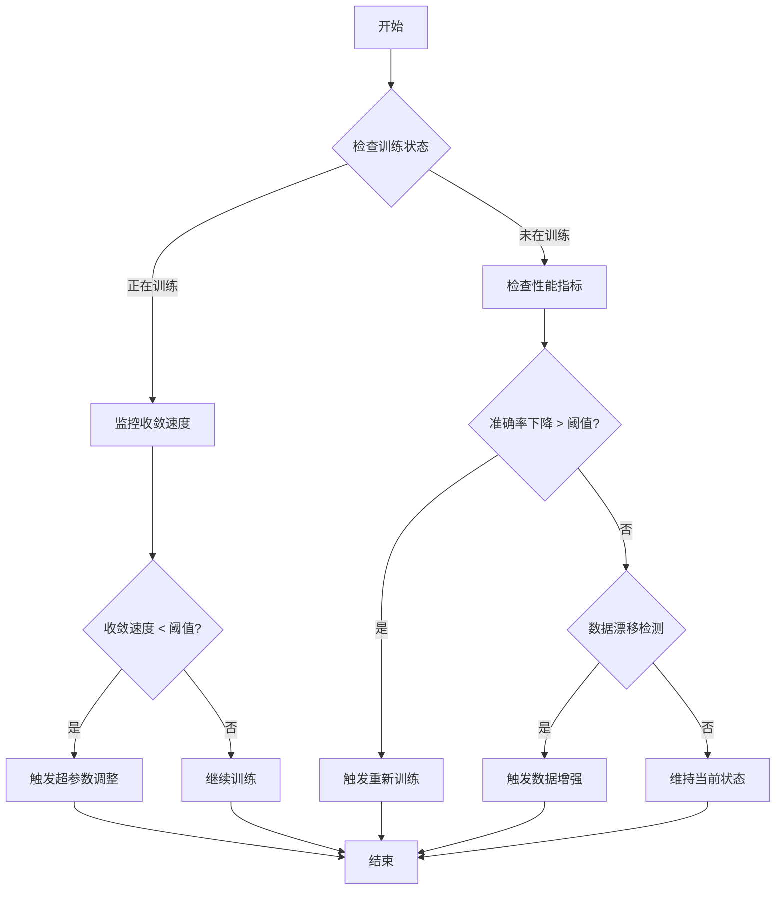
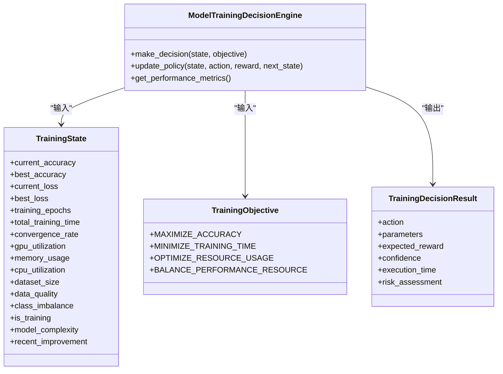
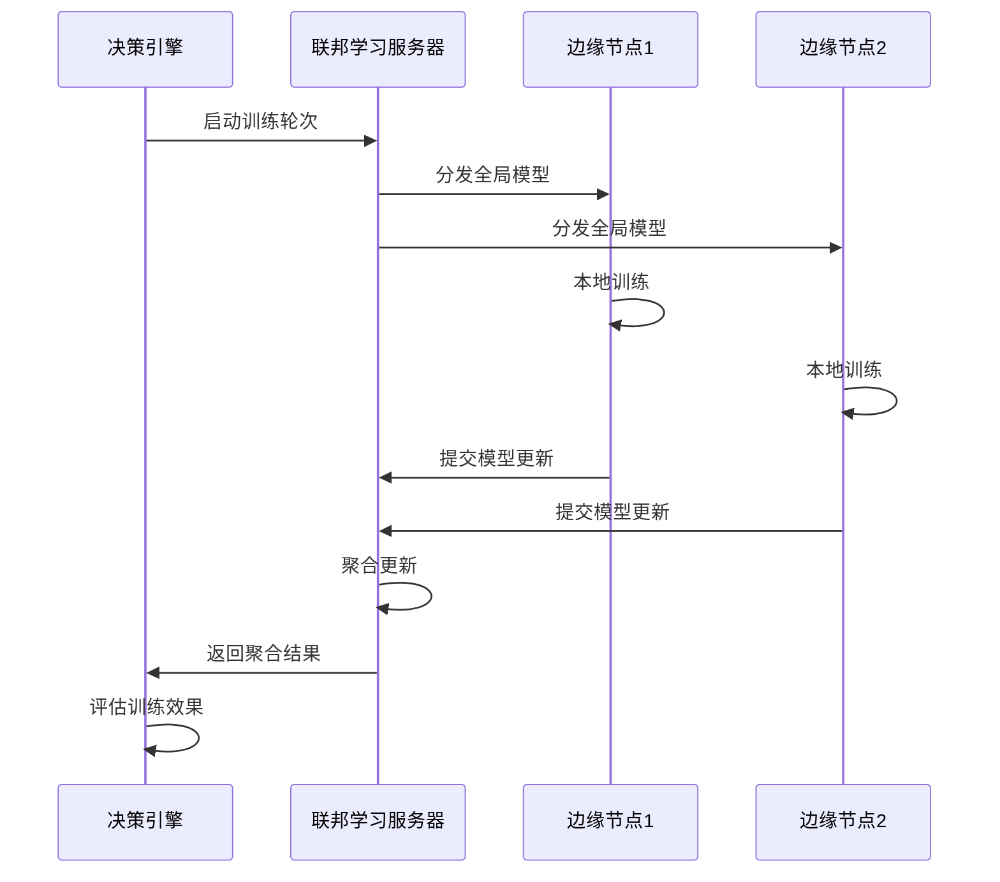
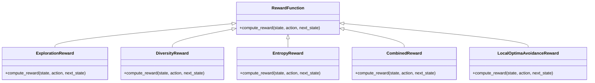
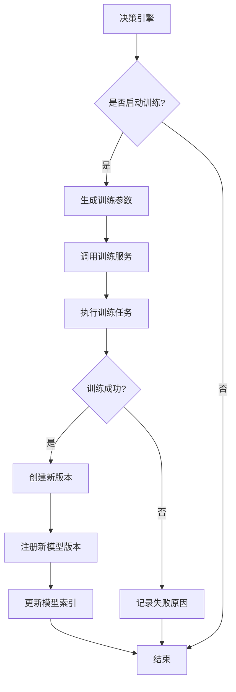
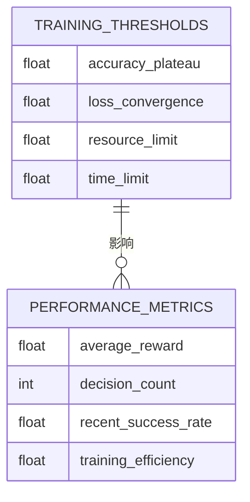
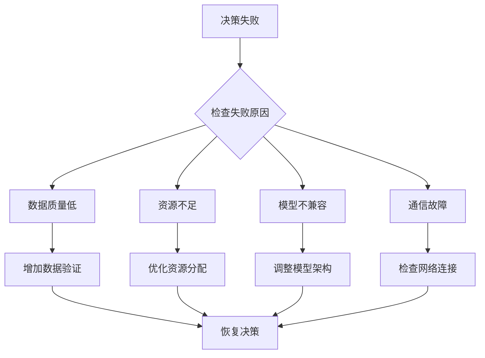

# 模型训练决策引擎

<cite>
**本文档引用的文件**   
- [model_training_decision_engine.py](file://backend/src/core/decision/model_training_decision_engine.py)
- [reward_functions.py](file://backend/src/core/models/reward_functions.py)
- [model_training_decision.py](file://backend/src/api/routes/model_training_decision.py)
- [federated_learning.py](file://backend/src/federated/federated_learning.py)
- [federated_learning.py](file://backend/src/edge/federated_learning.py)
- [training_service.py](file://backend/src/core/services/training_service.py)
- [performance_monitor.py](file://backend/src/performance/performance_monitor.py)
- [decision_integration.py](file://backend/src/integration/decision_integration.py)
</cite>

## 目录
1. [引言](#引言)
2. [模型训练决策触发机制](#模型训练决策触发机制)
3. [训练策略与资源分配决策](#训练策略与资源分配决策)
4. [联邦学习协同机制](#联邦学习协同机制)
5. [奖励函数在训练目标优化中的作用](#奖励函数在训练目标优化中的作用)
6. [训练任务调度与版本控制](#训练任务调度与版本控制)
7. [AI工程师实践指南](#ai工程师实践指南)
8. [训练决策失败分析](#训练决策失败分析)
9. [结论](#结论)

## 引言

模型训练决策引擎是AI平台的核心组件，负责自动化地决定模型再训练的时机、策略和资源配置。该引擎基于强化学习技术，通过分析模型性能、数据状态和系统资源等多维度指标，动态做出最优决策。引擎与联邦学习模块紧密协同，优化边缘节点的模型聚合时机和通信开销。通过奖励函数的设计，实现了准确率、公平性和能耗等多目标的权衡优化。本文档详细阐述了训练决策引擎的工作原理、核心算法和实际应用，为AI工程师提供全面的技术指导。

## 模型训练决策触发机制

模型训练决策引擎通过监控多个关键指标来动态决定是否触发模型再训练。这些指标包括数据漂移、性能下降、资源使用情况等。引擎采用强化学习方法，将训练决策建模为马尔可夫决策过程，通过策略网络选择最优动作。

决策引擎定义了多种训练动作，包括开始训练、停止训练、调整超参数、切换模型类型和数据增强等。每种动作都有相应的触发条件和执行参数。例如，当检测到数据质量下降或模型性能停滞时，引擎会触发数据增强或重新训练动作。

**Diagram sources**
- [model_training_decision_engine.py](file://backend/src/core/decision/model_training_decision_engine.py#L174-L209)

**Section sources**
- [model_training_decision_engine.py](file://backend/src/core/decision/model_training_decision_engine.py#L16-L25)
- [model_training_decision.py](file://backend/src/api/routes/model_training_decision.py#L13-L18)

## 训练策略与资源分配决策

训练决策引擎根据不同的训练目标和系统状态，选择最优的训练策略和资源分配方案。训练目标包括最大化准确率、最小化训练时间、优化资源使用或平衡性能与资源。

**Diagram sources**
- [model_training_decision_engine.py](file://backend/src/core/decision/model_training_decision_engine.py#L27-L63)
- [model_training_decision_engine.py](file://backend/src/core/decision/model_training_decision_engine.py#L102-L121)

**Section sources**
- [model_training_decision_engine.py](file://backend/src/core/decision/model_training_decision_engine.py#L27-L63)
- [model_training_decision_engine.py](file://backend/src/core/decision/model_training_decision_engine.py#L102-L121)

## 联邦学习协同机制

模型训练决策引擎与联邦学习模块紧密协同，优化边缘节点的模型聚合时机和通信开销。联邦学习服务器负责协调多个客户端的训练过程，而决策引擎则根据系统状态决定何时启动新的训练轮次。

**Diagram sources**
- [federated_learning.py](file://backend/src/federated/federated_learning.py#L64-L89)
- [federated_learning.py](file://backend/src/edge/federated_learning.py#L74-L105)

**Section sources**
- [federated_learning.py](file://backend/src/federated/federated_learning.py#L17-L34)
- [federated_learning.py](file://backend/src/edge/federated_learning.py#L60-L67)

## 奖励函数在训练目标优化中的作用

奖励函数在训练目标优化中起着关键作用，通过设计多目标奖励函数来平衡准确率、公平性和能耗等不同目标。系统实现了多种奖励函数，包括探索奖励、多样性奖励、熵奖励和组合奖励。

**Diagram sources**
- [reward_functions.py](file://backend/src/core/models/reward_functions.py#L12-L342)

**Section sources**
- [reward_functions.py](file://backend/src/core/models/reward_functions.py#L12-L342)

## 训练任务调度与版本控制

训练决策引擎结合A/B测试决策流程，实现智能的训练任务调度和版本控制。当决策引擎决定启动训练时，会调用训练服务执行具体的训练任务，并根据训练结果创建新版本的模型。

**Diagram sources**
- [model_training_decision.py](file://backend/src/api/routes/model_training_decision.py#L262-L305)
- [training_service.py](file://backend/src/core/services/training_service.py#L74-L511)

**Section sources**
- [model_training_decision.py](file://backend/src/api/routes/model_training_decision.py#L262-L305)
- [training_service.py](file://backend/src/core/services/training_service.py#L74-L511)

## AI工程师实践指南

AI工程师可以通过调整训练阈值来优化模型训练决策。系统提供了多个可配置的阈值参数，包括准确率停滞阈值、损失收敛阈值、资源使用上限和训练时间限制。

**Diagram sources**
- [model_training_decision_engine.py](file://backend/src/core/decision/model_training_decision_engine.py#L113-L118)
- [model_training_decision_engine.py](file://backend/src/core/decision/model_training_decision_engine.py#L521-L531)

**Section sources**
- [model_training_decision_engine.py](file://backend/src/core/decision/model_training_decision_engine.py#L113-L118)
- [model_training_decision_engine.py](file://backend/src/core/decision/model_training_decision_engine.py#L521-L531)

## 训练决策失败分析

训练决策可能因多种原因失败，包括数据质量问题、资源不足、模型不兼容等。系统通过性能监控模块跟踪决策执行情况，并提供详细的失败原因分析。

**Diagram sources**
- [performance_monitor.py](file://backend/src/performance/performance_monitor.py#L66-L117)
- [decision_integration.py](file://backend/src/integration/decision_integration.py#L507-L579)

**Section sources**
- [performance_monitor.py](file://backend/src/performance/performance_monitor.py#L66-L117)
- [decision_integration.py](file://backend/src/integration/decision_integration.py#L507-L579)

## 结论

模型训练决策引擎通过强化学习技术实现了模型再训练的自动化决策，有效平衡了准确率、训练时间和资源使用等多个目标。与联邦学习模块的协同工作优化了边缘计算环境下的模型更新策略。通过精心设计的奖励函数，系统能够在多目标优化中找到最佳平衡点。AI工程师可以通过调整阈值参数和监控性能指标来优化训练决策过程，确保模型持续保持最佳性能。