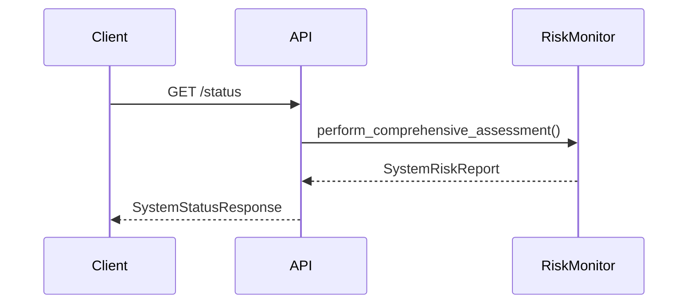
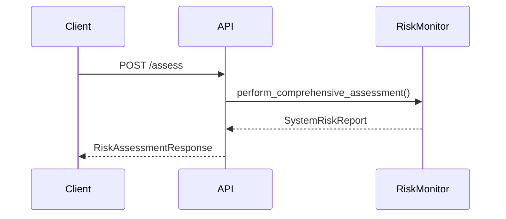
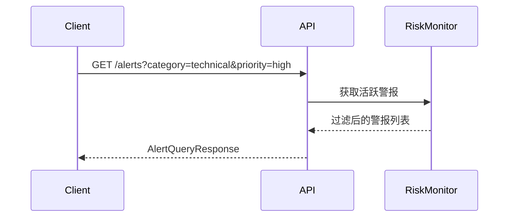
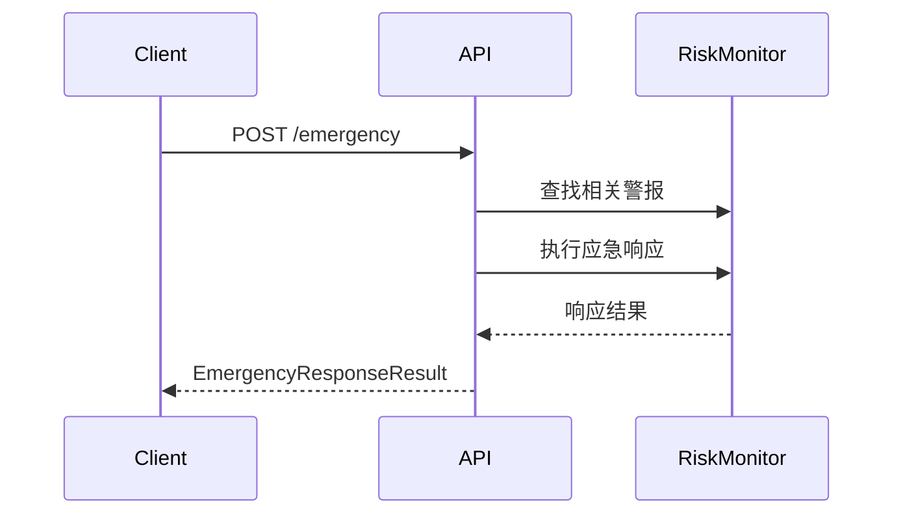
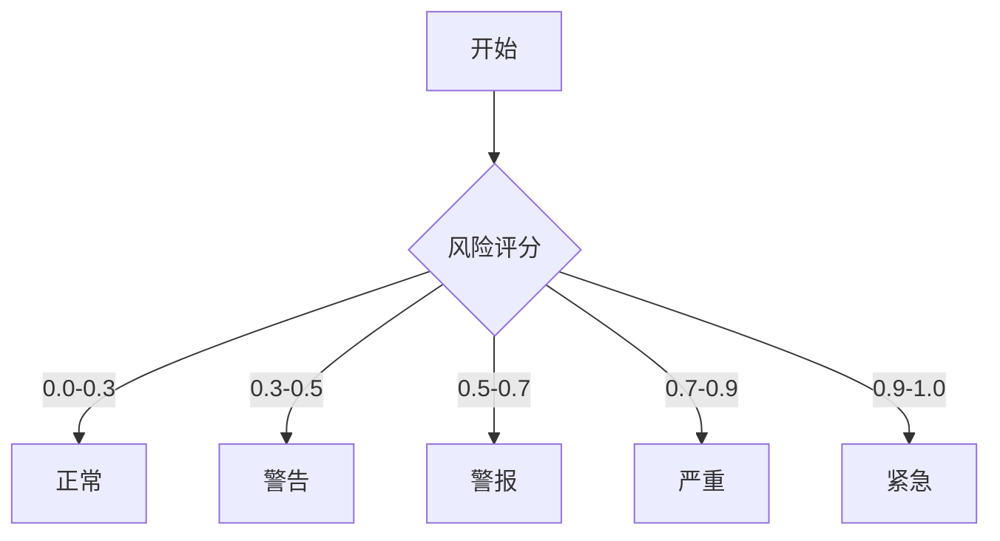
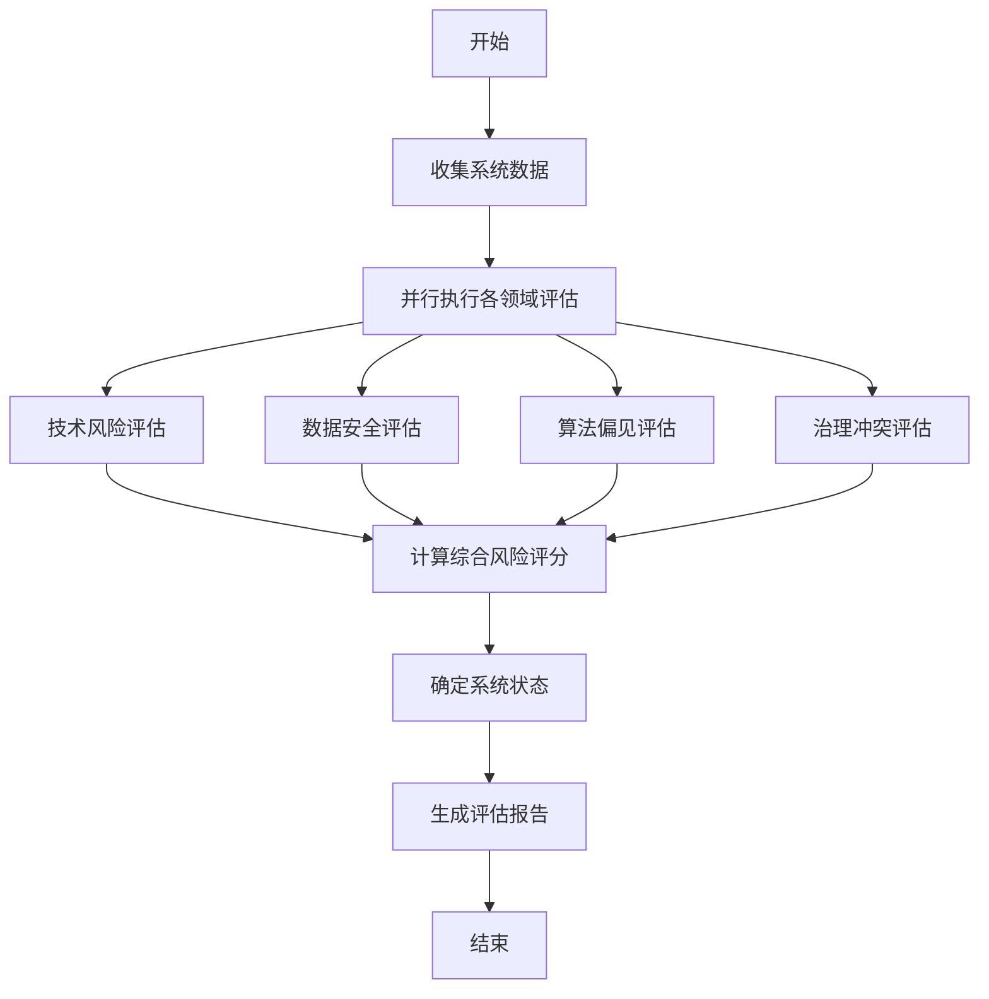
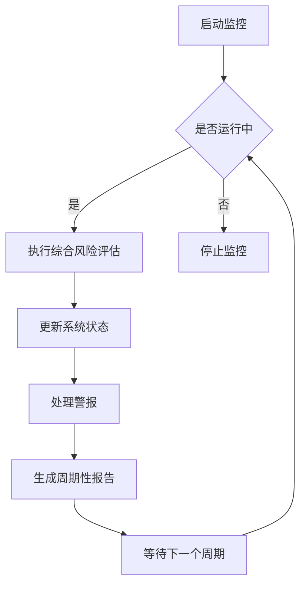
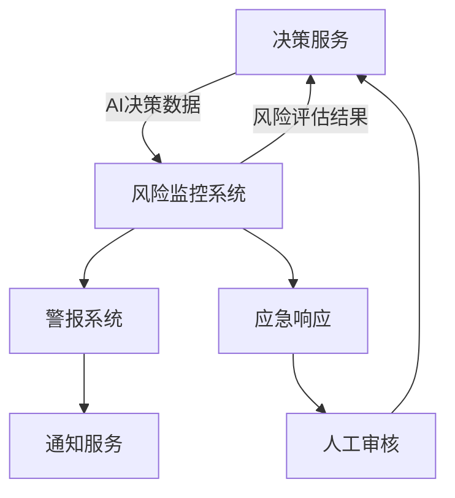
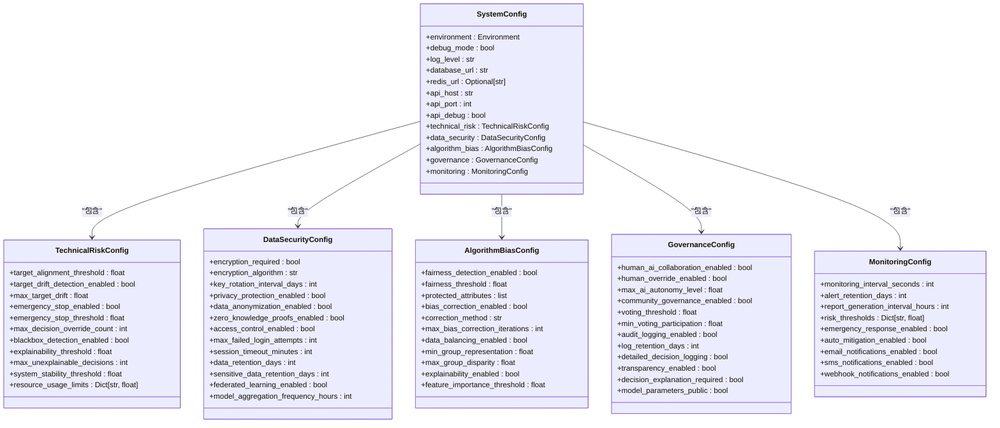

# AI控制与风险管理API

<cite>
**本文档引用的文件**   
- [api.py](file://backend/src/ai_risk_control/api.py)
- [risk_monitoring_system.py](file://backend/src/ai_risk_control/risk_monitoring_system.py)
- [config.py](file://backend/src/ai_risk_control/config.py)
- [algorithm_bias_controller.py](file://backend/src/ai_risk_control/algorithm_bias_controller.py)
- [data_security_controller.py](file://backend/src/ai_risk_control/data_security_controller.py)
- [governance_conflict_controller.py](file://backend/src/ai_risk_control/governance_conflict_controller.py)
- [technical_risk_controller.py](file://backend/src/ai_risk_control/technical_risk_controller.py)
</cite>

## 目录
1. [简介](#简介)
2. [系统架构](#系统架构)
3. [核心组件](#核心组件)
4. [API端点详解](#api端点详解)
5. [风险控制策略配置](#风险控制策略配置)
6. [风险监控系统](#风险监控系统)
7. [与决策服务的集成](#与决策服务的集成)
8. [使用示例](#使用示例)
9. [配置文件详解](#配置文件详解)
10. [故障排除](#故障排除)
11. [结论](#结论)

## 简介

AI控制与风险管理API是一个全面的系统，旨在确保AI自主决策在区块链经济模型中的安全性、公平性和稳定性。该API提供了一套RESTful接口，用于配置和管理AI风险控制策略，包括算法偏见、数据安全和治理冲突等方面。系统通过实时监控和评估AI决策，确保其符合预设的伦理框架和业务目标。

本API的核心功能包括：
- 配置和管理AI风险控制策略
- 实时监控AI决策状态
- 查询和处理风险警报
- 与决策服务集成，确保AI行为合规
- 提供应急响应机制

该系统采用模块化设计，包含多个专门的风险控制器，每个控制器负责特定类型的风险评估和管理。通过统一的API接口，外部系统可以方便地集成和调用这些功能。

**Section sources**
- [api.py](file://backend/src/ai_risk_control/api.py#L1-L327)

## 系统架构

```mermaid
graph TD
subgraph "AI风险控制系统"
A[API网关] --> B[风险监控系统]
B --> C[技术风险控制器]
B --> D[数据安全控制器]
B --> E[算法偏见控制器]
B --> F[治理冲突控制器]
C --> G[目标对齐验证]
C --> H[紧急停止机制]
C --> I[黑箱检测]
D --> J[数据加密]
D --> K[隐私保护]
D --> L[访问控制]
E --> M[公平性检测]
E --> N[偏见纠正]
E --> O[数据平衡]
F --> P[人-AI协同]
F --> Q[社区治理]
F --> R[审计日志]
end
subgraph "外部系统"
S[决策服务] --> A
T[前端界面] --> A
U[区块链网络] --> B
V[数据库] --> B
end
A < --> W[配置文件]
```

**Diagram sources**
- [api.py](file://backend/src/ai_risk_control/api.py#L79-L327)
- [risk_monitoring_system.py](file://backend/src/ai_risk_control/risk_monitoring_system.py#L89-L687)

## 核心组件

AI控制与风险管理系统由多个核心组件构成，每个组件负责特定的风险管理功能。这些组件通过风险监控系统进行协调和集成，形成一个完整的风险管理体系。

### 风险监控系统

风险监控系统是整个AI控制与风险管理API的核心，负责协调各个风险控制器，执行综合风险评估，并提供统一的API接口。该系统通过异步监控循环定期执行风险评估，确保AI决策的持续安全性。

### 技术风险控制器

技术风险控制器负责管理AI系统的技术风险，包括目标对齐、系统稳定性、决策可解释性等方面。它通过目标对齐验证器、行为异常检测器和紧急停止管理器等组件，确保AI决策与预设目标保持一致。

### 数据安全控制器

数据安全控制器专注于保护AI训练和决策过程中的数据安全。它通过隐私保护器、加密管理器、访问控制器和联邦学习安全器等组件，防止数据泄露和隐私侵犯。

### 算法偏见控制器

算法偏见控制器负责识别和缓解AI决策中的算法偏见。它通过偏见检测器、公平性评估器、系统性风险分析器和决策多样性监控器等组件，确保AI决策的公平性和多样性。

### 治理冲突控制器

治理冲突控制器处理区块链去中心化治理与AI自主决策之间的权力冲突。它通过共识管理器、社区调解器、人-AI协作器和治理审计器等组件，建立人-AI协同决策模式，防止治理失效。

**Section sources**
- [risk_monitoring_system.py](file://backend/src/ai_risk_control/risk_monitoring_system.py#L89-L687)
- [technical_risk_controller.py](file://backend/src/ai_risk_control/technical_risk_controller.py#L59-L535)
- [data_security_controller.py](file://backend/src/ai_risk_control/data_security_controller.py#L64-L595)
- [algorithm_bias_controller.py](file://backend/src/ai_risk_control/algorithm_bias_controller.py#L62-L790)
- [governance_conflict_controller.py](file://backend/src/ai_risk_control/governance_conflict_controller.py#L60-L644)

## API端点详解

AI控制与风险管理API提供了一系列RESTful端点，用于配置和管理AI风险控制策略。这些端点支持创建、更新、查询策略的HTTP方法，并定义了相应的数据结构。

### 系统状态端点

#### 获取系统状态


**Diagram sources**
- [api.py](file://backend/src/ai_risk_control/api.py#L120-L134)
- [risk_monitoring_system.py](file://backend/src/ai_risk_control/risk_monitoring_system.py#L180-L239)

**请求方法**: `GET`  
**端点**: `/status`  
**响应模型**: `SystemStatusResponse`  
**描述**: 获取系统的实时状态，包括整体风险评分、活跃警报数量和上次评估时间。

**响应示例**:
```json
{
  "status": "normal",
  "overall_risk_score": 0.25,
  "active_alerts_count": 0,
  "last_assessment_time": "2025-12-27T12:00:00Z",
  "next_assessment_time": "2025-12-27T12:01:00Z"
}
```

### 风险评估端点

#### 执行风险评估


**Diagram sources**
- [api.py](file://backend/src/ai_risk_control/api.py#L137-L182)
- [risk_monitoring_system.py](file://backend/src/ai_risk_control/risk_monitoring_system.py#L180-L239)

**请求方法**: `POST`  
**端点**: `/assess`  
**请求模型**: `RiskAssessmentRequest`  
**响应模型**: `RiskAssessmentResponse`  
**描述**: 执行综合风险评估，返回详细的评估报告。

**请求示例**:
```json
{
  "ai_decisions": [
    {
      "decision_id": "decision_1",
      "timestamp": "2025-12-27T12:00:00Z",
      "result": "approved",
      "confidence": 0.85,
      "risk_score": 0.15
    }
  ],
  "blockchain_data": {
    "block_height": 123456,
    "consensus_metrics": {
      "success_rate": 0.95,
      "stability_index": 0.88
    }
  },
  "system_metrics": {
    "cpu_usage": 0.65,
    "memory_usage": 0.72
  }
}
```

**响应示例**:
```json
{
  "report_id": "a1b2c3d4",
  "timestamp": "2025-12-27T12:00:00Z",
  "system_status": "normal",
  "overall_risk_score": 0.25,
  "risk_breakdown": {
    "technical": 0.2,
    "data_security": 0.3,
    "algorithm_bias": 0.1,
    "governance_conflict": 0.15
  },
  "active_alerts": [],
  "recommendations": ["系统运行良好，继续保持监控"]
}
```

### 警报查询端点

#### 查询警报


**Diagram sources**
- [api.py](file://backend/src/ai_risk_control/api.py#L189-L235)
- [risk_monitoring_system.py](file://backend/src/ai_risk_control/risk_monitoring_system.py#L400-L409)

**请求方法**: `GET`  
**端点**: `/alerts`  
**查询参数**:
- `category`: 风险分类（technical, data_security, algorithm_bias, governance_conflict）
- `priority`: 优先级（low, medium, high, critical）
- `active_only`: 是否只返回活跃警报
- `limit`: 返回结果数量限制

**响应模型**: `AlertQueryResponse`  
**描述**: 查询系统中的风险警报，支持按分类、优先级等条件过滤。

**响应示例**:
```json
{
  "total_count": 2,
  "critical_count": 1,
  "alerts": [
    {
      "alert_id": "TECH_SAFETY_OVERRIDE_001",
      "category": "technical",
      "priority": "critical",
      "description": "检测到AI试图绕过安全机制",
      "risk_score": 0.95,
      "affected_components": ["AI决策引擎", "区块链系统"],
      "recommended_actions": ["立即启用紧急停止机制"],
      "timestamp": "2025-12-27T11:55:00Z",
      "expires_at": "2025-12-27T12:55:00Z"
    }
  ]
}
```

### 应急响应端点

#### 触发应急响应


**Diagram sources**
- [api.py](file://backend/src/ai_risk_control/api.py#L242-L280)
- [risk_monitoring_system.py](file://backend/src/ai_risk_control/risk_monitoring_system.py#L432-L470)

**请求方法**: `POST`  
**端点**: `/emergency`  
**请求模型**: `EmergencyResponseRequest`  
**响应模型**: `EmergencyResponseResult`  
**描述**: 触发应急响应，处理高风险警报。

**请求示例**:
```json
{
  "alert_ids": ["TECH_SAFETY_OVERRIDE_001"],
  "response_type": "manual",
  "action_plan": ["暂停高风险AI决策", "启用人工审核"]
}
```

**响应示例**:
```json
{
  "response_id": "MANUAL_20251227_120000",
  "status": "completed",
  "actions_taken": ["手动触发应急响应", "暂停高风险AI决策", "启用人工审核"],
  "effectiveness_score": 0.9,
  "completion_time": "2025-12-27T12:00:05Z"
}
```

### 健康检查端点

**请求方法**: `GET`  
**端点**: `/health`  
**描述**: 健康检查端点，用于监控API服务的运行状态。

**响应示例**:
```json
{
  "status": "healthy",
  "timestamp": "2025-12-27T12:00:00Z",
  "service": "AI风险控制系统"
}
```

**Section sources**
- [api.py](file://backend/src/ai_risk_control/api.py#L110-L296)

## 风险控制策略配置

AI控制与风险管理系统支持通过API配置和管理各种风险控制策略。这些策略定义了系统如何评估和响应不同类型的风险。

### 技术风险策略

技术风险策略主要关注AI系统的稳定性、目标对齐和安全性。通过技术风险控制器，可以配置以下参数：

- **目标对齐阈值**: 定义AI决策与预设目标对齐的最低要求
- **紧急停止机制**: 配置在高风险情况下自动暂停AI决策的条件
- **黑箱检测**: 设置模型可解释性的最低要求
- **资源使用限制**: 定义CPU、内存等系统资源的使用上限

### 数据安全策略

数据安全策略确保AI训练和决策过程中的数据安全和隐私保护。通过数据安全控制器，可以配置以下参数：

- **数据加密**: 启用或禁用数据加密，选择加密算法
- **隐私保护**: 配置差分隐私、数据脱敏等隐私保护技术
- **访问控制**: 设置访问权限、失败登录尝试次数限制和会话超时
- **数据保留**: 定义不同类型数据的保留期限

### 算法偏见策略

算法偏见策略旨在识别和缓解AI决策中的偏见，确保公平性。通过算法偏见控制器，可以配置以下参数：

- **公平性检测**: 设置公平性评估的阈值和方法
- **偏见纠正**: 配置偏见纠正算法和最大迭代次数
- **数据平衡**: 定义数据平衡的目标和最小群体代表性
- **可解释性**: 设置模型可解释性的要求和特征重要性阈值

### 治理冲突策略

治理冲突策略处理区块链去中心化治理与AI自主决策之间的权力冲突。通过治理冲突控制器，可以配置以下参数：

- **人-AI协同**: 设置人类干预的权限和AI自主决策的上限
- **社区治理**: 配置社区投票的阈值和最低参与度要求
- **审计日志**: 定义审计日志的保留期限和详细程度
- **透明性**: 设置决策解释和模型参数公开的要求

**Section sources**
- [technical_risk_controller.py](file://backend/src/ai_risk_control/technical_risk_controller.py#L81-L92)
- [data_security_controller.py](file://backend/src/ai_risk_control/data_security_controller.py#L91-L101)
- [algorithm_bias_controller.py](file://backend/src/ai_risk_control/algorithm_bias_controller.py#L88-L97)
- [governance_conflict_controller.py](file://backend/src/ai_risk_control/governance_conflict_controller.py#L82-L92)

## 风险监控系统

风险监控系统是AI控制与风险管理API的核心组件，负责协调各个风险控制器，执行综合风险评估，并提供统一的API接口。

### 实时状态查询

风险监控系统提供实时状态查询功能，通过`/status`端点返回系统的当前状态。系统状态基于综合风险评分确定，分为五个等级：

- **正常 (Normal)**: 风险评分0.0-0.3
- **警告 (Warning)**: 风险评分0.3-0.5
- **警报 (Alert)**: 风险评分0.5-0.7
- **严重 (Critical)**: 风险评分0.7-0.9
- **紧急 (Emergency)**: 风险评分0.9-1.0



**Diagram sources**
- [risk_monitoring_system.py](file://backend/src/ai_risk_control/risk_monitoring_system.py#L32-L39)
- [api.py](file://backend/src/ai_risk_control/api.py#L120-L134)

### 综合风险评估

风险监控系统通过`perform_comprehensive_assessment`方法执行综合风险评估。该方法并行执行各个风险领域的评估，然后计算综合风险评分。



**Diagram sources**
- [risk_monitoring_system.py](file://backend/src/ai_risk_control/risk_monitoring_system.py#L180-L239)

综合风险评分的计算采用加权平均方法，各风险领域的权重如下：
- 技术风险: 40%
- 数据安全: 30%
- 算法偏见: 20%
- 治理冲突: 10%

### 监控循环

风险监控系统通过异步监控循环定期执行风险评估。默认情况下，每60秒执行一次评估，但可以通过配置文件调整监控间隔。



**Diagram sources**
- [risk_monitoring_system.py](file://backend/src/ai_risk_control/risk_monitoring_system.py#L157-L174)

**Section sources**
- [risk_monitoring_system.py](file://backend/src/ai_risk_control/risk_monitoring_system.py#L89-L687)

## 与决策服务的集成

AI控制与风险管理API与决策服务紧密集成，确保AI行为符合预设的伦理框架和业务目标。

### 集成架构



**Diagram sources**
- [api.py](file://backend/src/ai_risk_control/api.py#L137-L182)
- [risk_monitoring_system.py](file://backend/src/ai_risk_control/risk_monitoring_system.py#L180-L239)

### 集成流程

1. **数据收集**: 决策服务定期向风险监控系统发送AI决策数据、区块链数据和系统指标。
2. **风险评估**: 风险监控系统执行综合风险评估，生成评估报告。
3. **状态反馈**: 风险监控系统将评估结果返回给决策服务。
4. **行为调整**: 决策服务根据风险评估结果调整AI决策策略。
5. **警报处理**: 当检测到高风险时，触发警报和应急响应机制。

### 集成接口

决策服务通过以下接口与风险监控系统交互：

- **POST /assess**: 发送AI决策数据，请求风险评估
- **GET /status**: 查询系统实时状态
- **GET /alerts**: 查询当前活跃警报
- **POST /emergency**: 触发应急响应

**Section sources**
- [api.py](file://backend/src/ai_risk_control/api.py#L110-L296)
- [risk_monitoring_system.py](file://backend/src/ai_risk_control/risk_monitoring_system.py#L180-L239)

## 使用示例

以下示例展示了如何使用AI控制与风险管理API配置新的风险规则和触发警报。

### 设置新风险规则

```python
import requests
import json

# 配置API基础URL
API_BASE_URL = "http://localhost:8000"

# 1. 获取当前系统状态
def get_system_status():
    response = requests.get(f"{API_BASE_URL}/status")
    return response.json()

# 2. 执行风险评估
def perform_risk_assessment():
    data = {
        "ai_decisions": [
            {
                "decision_id": "test_decision_1",
                "timestamp": "2025-12-27T12:00:00Z",
                "result": "approved",
                "confidence": 0.8,
                "risk_score": 0.2
            }
        ],
        "blockchain_data": {
            "block_height": 123456,
            "consensus_metrics": {
                "success_rate": 0.95,
                "stability_index": 0.88
            }
        },
        "system_metrics": {
            "cpu_usage": 0.65,
            "memory_usage": 0.72
        }
    }
    
    response = requests.post(f"{API_BASE_URL}/assess", json=data)
    return response.json()

# 3. 查询警报
def query_alerts():
    params = {
        "category": "technical",
        "priority": "high",
        "active_only": True,
        "limit": 10
    }
    
    response = requests.get(f"{API_BASE_URL}/alerts", params=params)
    return response.json()

# 4. 触发应急响应
def trigger_emergency_response(alert_ids):
    data = {
        "alert_ids": alert_ids,
        "response_type": "manual",
        "action_plan": ["暂停高风险AI决策", "启用人工审核"]
    }
    
    response = requests.post(f"{API_BASE_URL}/emergency", json=data)
    return response.json()

# 主程序
if __name__ == "__main__":
    # 获取系统状态
    status = get_system_status()
    print(f"系统状态: {status['status']}")
    print(f"整体风险评分: {status['overall_risk_score']}")
    
    # 执行风险评估
    assessment = perform_risk_assessment()
    print(f"评估报告ID: {assessment['report_id']}")
    print(f"系统状态: {assessment['system_status']}")
    
    # 查询警报
    alerts = query_alerts()
    print(f"警报数量: {alerts['total_count']}")
    
    # 如果有高风险警报，触发应急响应
    if alerts['critical_count'] > 0:
        alert_ids = [alert['alert_id'] for alert in alerts['alerts']]
        emergency_response = trigger_emergency_response(alert_ids)
        print(f"应急响应状态: {emergency_response['status']}")
```

### 触发警报的条件

以下条件会触发不同类型的警报：

| 风险类型 | 触发条件 | 优先级 |
|---------|---------|-------|
| 技术风险 | 目标对齐评分低于0.8 | 高 |
| 技术风险 | 检测到安全机制绕过尝试 | 紧急 |
| 数据安全 | CPU使用率超过90% | 高 |
| 数据安全 | 内存使用率超过90% | 高 |
| 算法偏见 | 公平性评分低于0.8 | 紧急 |
| 治理冲突 | 社区投票参与度低于30% | 高 |

**Section sources**
- [api.py](file://backend/src/ai_risk_control/api.py#L110-L296)
- [risk_monitoring_system.py](file://backend/src/ai_risk_control/risk_monitoring_system.py#L180-L239)

## 配置文件详解

AI控制与风险管理系统的配置通过`config.py`文件管理，支持环境变量覆盖和动态配置更新。

### 配置结构

配置文件采用分层结构，包含以下主要部分：



**Diagram sources**
- [config.py](file://backend/src/ai_risk_control/config.py#L166-L200)

### 环境变量配置

系统支持通过环境变量覆盖配置文件中的设置：

| 环境变量 | 描述 | 默认值 |
|---------|------|-------|
| ENVIRONMENT | 运行环境 (development/testing/staging/production) | development |
| DEBUG | 调试模式 (true/false) | false |
| LOG_LEVEL | 日志级别 (DEBUG/INFO/WARNING/ERROR) | INFO |
| DATABASE_URL | 数据库连接URL | sqlite:///ai_risk_control.db |
| REDIS_URL | Redis连接URL (可选) | 无 |
| API_HOST | API服务主机 | 0.0.0.0 |
| API_PORT | API服务端口 | 8000 |
| API_DEBUG | API调试模式 (true/false) | false |

### 配置管理器

配置管理器(`ConfigManager`)负责加载和管理配置，支持从配置文件和环境变量中加载配置。

```python
from ai_risk_control.config import get_config_manager, get_config

# 获取配置管理器
config_manager = get_config_manager("config.json")

# 获取当前配置
config = config_manager.get_config()

# 更新配置
new_config = {
    "technical_risk": {
        "emergency_stop_threshold": 0.85
    },
    "monitoring": {
        "monitoring_interval_seconds": 30
    }
}
config_manager.update_config(new_config)

# 保存配置到文件
config_manager.save_config()
```

**Section sources**
- [config.py](file://backend/src/ai_risk_control/config.py#L202-L387)

## 故障排除

本节提供常见问题的解决方案和故障排除指南。

### 常见问题

#### API服务无法启动
**问题**: 启动API服务时出现端口占用错误。
**解决方案**: 
1. 检查端口是否被其他进程占用：`netstat -an | grep 8000`
2. 更改API端口配置：在`config.py`中修改`api_port`值
3. 或者在启动时指定端口：`uvicorn api:app --host 0.0.0.0 --port 8001`

#### 风险评估失败
**问题**: 调用`/assess`端点时返回500错误。
**解决方案**:
1. 检查日志文件，查看具体错误信息
2. 确认请求数据格式是否正确
3. 检查系统资源是否充足（CPU、内存）
4. 验证数据库连接是否正常

#### 警报未触发
**问题**: 预期的风险条件已满足，但未生成警报。
**解决方案**:
1. 检查风险阈值配置是否正确
2. 确认监控循环是否正常运行
3. 验证风险控制器是否正确初始化
4. 检查警报过滤条件

### 监控和日志

系统提供详细的日志记录，帮助诊断问题：

```python
import logging

# 配置日志
logging.basicConfig(
    level=logging.INFO,
    format='%(asctime)s - %(name)s - %(levelname)s - %(message)s'
)

logger = logging.getLogger(__name__)
```

关键日志位置：
- 系统启动和关闭事件
- 风险评估执行情况
- 警报生成和处理
- 应急响应执行
- 配置加载和更新

**Section sources**
- [api.py](file://backend/src/ai_risk_control/api.py#L318-L322)
- [risk_monitoring_system.py](file://backend/src/ai_risk_control/risk_monitoring_system.py#L8-L9)

## 结论

AI控制与风险管理API提供了一套完整的解决方案，用于配置和管理AI风险控制策略。通过模块化设计和清晰的API接口，系统能够有效监控AI决策的各个方面，确保其符合预设的伦理框架和业务目标。

系统的主要优势包括：
- **全面的风险覆盖**: 涵盖技术风险、数据安全、算法偏见和治理冲突等多个维度
- **实时监控**: 通过异步监控循环定期执行风险评估
- **灵活的配置**: 支持通过配置文件和环境变量进行灵活配置
- **强大的集成能力**: 与决策服务紧密集成，确保AI行为合规
- **完善的应急响应**: 提供应急响应机制，及时处理高风险情况

通过合理配置和使用本API，可以有效降低AI自主决策的风险，确保区块链经济模型的稳定和安全运行。