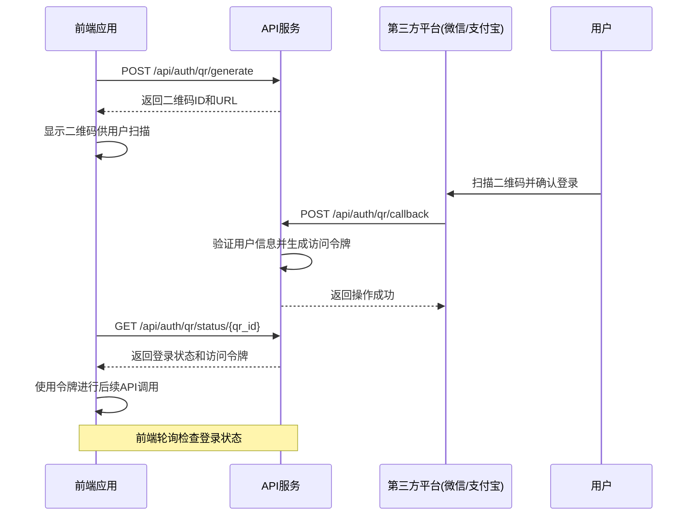

# API参考

<cite>
**本文档引用的文件**
- [simple_app.py](file://backend/src/api/simple_app.py)
- [__init__.py](file://backend/src/api/__init__.py)
- [routes/__init__.py](file://backend/src/api/routes/__init__.py)
- [routes/auth.py](file://backend/src/api/routes/auth.py)
- [routes/models.py](file://backend/src/api/routes/models.py)
- [routes/inference.py](file://backend/src/api/routes/inference.py)
- [routes/training.py](file://backend/src/api/routes/training.py)
- [routes/system.py](file://backend/src/api/routes/system.py)
- [routes/edge.py](file://backend/src/api/routes/edge.py)
- [routes/federated.py](file://backend/src/api/routes/federated.py)
- [routes/agriculture.py](file://backend/src/api/routes/agriculture.py)
- [routes/decision.py](file://backend/src/api/routes/decision.py)
- [routes/community.py](file://backend/src/api/routes/community.py)
</cite>

## 目录
1. [简介](#简介)
2. [API版本控制与废弃政策](#api版本控制与废弃政策)
3. [认证机制](#认证机制)
4. [核心API端点](#核心api端点)
   1. [模型管理API](#模型管理api)
   2. [推理服务API](#推理服务api)
   3. [训练服务API](#训练服务api)
   4. [系统管理API](#系统管理api)
   5. [边缘计算API](#边缘计算api)
   6. [联邦学习API](#联邦学习api)
   7. [农业AI API](#农业ai-api)
   8. [决策引擎API](#决策引擎api)
   9. [社区功能API](#社区功能api)
   10. [认证API](#认证api)
5. [SDK生成与测试工具集成](#sdk生成与测试工具集成)
6. [性能优化建议](#性能优化建议)

## 简介
本API参考文档为AI决策系统提供完整的RESTful端点说明，涵盖所有公开的API接口。文档基于`backend/src/api/routes`目录中的路由定义，详细描述了每个API的HTTP方法、URL路径、请求参数、请求体结构、响应格式与错误码。系统支持扫码登录、API密钥等多种认证机制，为前端与第三方开发者提供全面的集成指导。

**Section sources**
- [__init__.py](file://backend/src/api/__init__.py#L6-L75)
- [routes/__init__.py](file://backend/src/api/routes/__init__.py#L6-L31)

## API版本控制与废弃政策
本系统当前API版本为1.0.0，通过`/api`前缀统一管理所有端点。未来版本将采用语义化版本控制（Semantic Versioning），在重大变更时升级主版本号。废弃的API端点将保留至少6个月的兼容期，并在文档中明确标记为"deprecated"，同时提供迁移指南。所有API响应中均包含版本信息，便于客户端进行版本兼容性处理。

**Section sources**
- [__init__.py](file://backend/src/api/__init__.py#L20-L24)
- [simple_app.py](file://backend/src/api/simple_app.py#L323-L326)

## 认证机制
系统提供多种认证方式，包括扫码登录和API密钥认证。扫码登录通过微信、支付宝等第三方平台实现，适用于前端用户。API密钥认证适用于服务间调用和第三方集成，密钥通过请求头`api_key`传递。所有认证相关的端点均位于`/api/auth`路径下，支持生成二维码、检查登录状态、密码登录和注册等功能。



**Diagram sources**
- [routes/auth.py](file://backend/src/api/routes/auth.py#L87-L213)

## 核心API端点

### 模型管理API
提供模型的创建、查询、更新、删除和版本管理功能。支持从HuggingFace等平台加载预训练模型，以及通过文件上传导入模型。模型管理API还包含训练、量化和推理等生命周期管理功能。

**HTTP方法**: `GET`, `POST`, `PUT`, `DELETE`  
**基础路径**: `/api/models`

#### 获取模型列表
获取所有已注册模型的列表。

- **端点**: `GET /api/models`
- **请求参数**: 无
- **成功响应**:
  ```json
  {
    "models": [
      {
        "id": "string",
        "model_id": "string",
        "model_type": "string",
        "name": "string",
        "version": "string",
        "created_at": "string",
        "updated_at": "string",
        "metrics": {},
        "hyperparameters": {},
        "description": "string",
        "status": "string"
      }
    ],
    "total_count": 0
  }
  ```
- **错误码**:
  - `500`: 获取模型列表失败

#### 创建模型
创建一个新的AI模型。

- **端点**: `POST /api/models`
- **请求体**:
  ```json
  {
    "name": "string",
    "description": "string",
    "status": "string",
    "version": "string",
    "model_type": "string",
    "hyperparameters": {},
    "model_id": "string"
  }
  ```
- **成功响应**:
  ```json
  {
    "id": "string",
    "model_id": "string",
    "model_type": "string",
    "name": "string",
    "version": "string",
    "created_at": "string",
    "updated_at": "string",
    "metrics": {},
    "hyperparameters": {},
    "description": "string",
    "status": "string"
  }
  ```
- **错误码**:
  - `400`: 请求参数错误
  - `500`: 创建模型失败

#### 加载预训练模型
从指定路径加载预训练模型。

- **端点**: `POST /api/models/pretrained`
- **请求体**:
  ```json
  {
    "model_name_or_path": "string",
    "model_format": "string",
    "model_type": "string",
    "name": "string",
    "metadata": {}
  }
  ```
- **成功响应**: 模型加载结果
- **错误码**:
  - `400`: 无效的请求
  - `500`: 加载预训练模型失败

#### 量化模型
对指定模型进行量化以优化性能。

- **端点**: `POST /api/models/{model_id}/quantize`
- **请求体**:
  ```json
  {
    "quantization_type": "int8"
  }
  ```
- **成功响应**: 量化结果
- **错误码**:
  - `404`: 模型不存在
  - `500`: 量化模型失败

**Section sources**
- [routes/models.py](file://backend/src/api/routes/models.py#L66-L572)

### 推理服务API
提供文本生成、图像分类、图像生成等推理功能。所有推理端点均需要API密钥认证，确保服务安全。支持批量推理和推理统计信息查询，便于性能监控和优化。

**HTTP方法**: `POST`, `GET`  
**基础路径**: `/api/inference`

#### 文本生成推理
使用指定模型进行文本生成。

- **端点**: `POST /api/inference/text/generation`
- **认证**: API密钥（请求头`api_key`）
- **请求体**:
  ```json
  {
    "model_id": "string",
    "prompt": "string",
    "max_length": 0,
    "temperature": 0,
    "repetition_penalty": 0,
    "num_return_sequences": 0,
    "beam_search": false,
    "beam_width": 0,
    "early_stopping": true,
    "no_repeat_ngram_size": 0,
    "do_sample": false,
    "top_p": 0,
    "top_k": 0
  }
  ```
- **成功响应**:
  ```json
  {
    "predictions": "string",
    "confidence": 0,
    "processing_time": 0,
    "metadata": {}
  }
  ```
- **错误码**:
  - `400`: 请求参数错误
  - `401`: 认证失败
  - `500`: 文本生成失败

#### 图像分类推理
对输入图像进行分类。

- **端点**: `POST /api/inference/image/classification`
- **认证**: API密钥
- **请求体**:
  ```json
  {
    "model_id": "string",
    "image_data": [[[0]]],
    "top_k": 0
  }
  ```
- **成功响应**:
  ```json
  {
    "predictions": "string",
    "confidence": 0,
    "processing_time": 0,
    "metadata": {}
  }
  ```
- **错误码**:
  - `400`: 请求参数错误
  - `401`: 认证失败
  - `500`: 图像分类失败

#### 批量推理
对多个输入进行批量推理。

- **端点**: `POST /api/inference/batch`
- **认证**: API密钥
- **请求体**:
  ```json
  {
    "model_id": "string",
    "inputs": ["string"],
    "batch_size": 0
  }
  ```
- **成功响应**:
  ```json
  {
    "results": [
      {
        "predictions": "string",
        "confidence": 0,
        "processing_time": 0,
        "metadata": {}
      }
    ],
    "total_count": 0,
    "success_count": 0,
    "error_count": 0
  }
  ```
- **错误码**:
  - `400`: 请求参数错误
  - `401`: 认证失败
  - `500`: 批量推理失败

**Section sources**
- [routes/inference.py](file://backend/src/api/routes/inference.py#L98-L284)

### 训练服务API
提供模型训练、分布式训练和训练监控功能。支持配置训练参数，查询训练任务状态，并可取消正在进行的训练任务。

**HTTP方法**: `POST`, `GET`, `DELETE`  
**基础路径**: `/api/training`

#### 开始训练任务
启动模型训练任务。

- **端点**: `POST /api/training/start`
- **请求体**:
  ```json
  {
    "model_id": "string",
    "dataset": {},
    "config": {},
    "distributed": false
  }
  ```
- **成功响应**:
  ```json
  {
    "task_id": "string",
    "status": "string",
    "model_id": "string",
    "message": "string",
    "progress": 0,
    "metrics": {}
  }
  ```
- **错误码**:
  - `404`: 模型不存在
  - `500`: 启动训练任务失败

#### 获取训练任务状态
查询指定训练任务的当前状态。

- **端点**: `GET /api/training/status/{task_id}`
- **成功响应**:
  ```json
  {
    "task_id": "string",
    "status": "string",
    "model_id": "string",
    "message": "string",
    "progress": 0,
    "metrics": {}
  }
  ```
- **错误码**:
  - `404`: 训练任务不存在
  - `500`: 获取训练状态失败

#### 取消训练任务
取消指定的训练任务。

- **端点**: `DELETE /api/training/{task_id}`
- **成功响应**:
  ```json
  {
    "message": "string"
  }
  ```
- **错误码**:
  - `404`: 训练任务不存在
  - `400`: 无法取消已完成或失败的任务

**Section sources**
- [routes/training.py](file://backend/src/api/routes/training.py#L54-L281)

### 系统管理API
提供系统状态、健康检查、配置管理和日志查询功能。用于监控系统运行状况，获取系统信息和性能指标。

**HTTP方法**: `GET`, `POST`, `DELETE`  
**基础路径**: `/api/system`

#### 健康检查
检查系统各组件的健康状态。

- **端点**: `GET /api/system/health`
- **成功响应**:
  ```json
  {
    "status": "string",
    "timestamp": "string",
    "version": "string",
    "components": {}
  }
  ```
- **错误码**:
  - `500`: 健康检查失败

#### 获取系统信息
获取系统详细信息，包括平台、CPU、内存等。

- **端点**: `GET /api/system/info`
- **成功响应**:
  ```json
  {
    "platform": "string",
    "python_version": "string",
    "hostname": "string",
    "cpu_count": 0,
    "memory_total": 0,
    "memory_used": 0,
    "disk_usage": {},
    "uptime": 0,
    "current_time": "string"
  }
  ```
- **错误码**:
  - `500`: 获取系统信息失败

#### 获取系统性能指标
获取CPU、内存、磁盘等系统性能指标。

- **端点**: `GET /api/system/metrics`
- **成功响应**:
  ```json
  {
    "cpu_usage": 0,
    "memory_usage": 0,
    "disk_usage": 0,
    "network": {
      "sent": 0,
      "received": 0
    },
    "ai_service_status": "string",
    "storage_status": "string",
    "timestamp": "string"
  }
  ```
- **错误码**:
  - `500`: 获取系统指标失败

**Section sources**
- [routes/system.py](file://backend/src/api/routes/system.py#L139-L395)

### 边缘计算API
提供边缘节点管理、WASM模型部署、联邦学习和负载均衡功能。支持注册边缘节点、部署WASM模型、执行边缘推理和监控边缘计算系统状态。

**HTTP方法**: `POST`, `GET`  
**基础路径**: `/api/edge`

#### 注册边缘节点
将新的边缘节点注册到系统中。

- **端点**: `POST /api/edge/nodes/register`
- **请求体**:
  ```json
  {
    "node_id": "string",
    "address": "string",
    "capabilities": {}
  }
  ```
- **成功响应**:
  ```json
  {
    "message": "string",
    "node_id": "string",
    "status": "string"
  }
  ```
- **错误码**:
  - `400`: 节点注册失败
  - `500`: 节点注册失败

#### 部署WASM模型
将WASM模型部署到指定的边缘节点。

- **端点**: `POST /api/edge/models/deploy`
- **请求体**:
  ```json
  {
    "node_id": "string",
    "model_name": "string",
    "wasm_path": "string",
    "memory_limit": 0,
    "stack_size": 0,
    "enable_simd": false,
    "enable_threads": false
  }
  ```
- **成功响应**:
  ```json
  {
    "message": "string",
    "node_id": "string",
    "model_name": "string",
    "status": "string"
  }
  ```
- **错误码**:
  - `400`: WASM模型部署失败
  - `500`: 模型部署失败

#### 单次边缘推理
在指定边缘节点上执行单次推理。

- **端点**: `POST /api/edge/inference/single`
- **请求体**:
  ```json
  {
    "node_id": "string",
    "model_name": "string",
    "input_data": "any",
    "function_name": "string"
  }
  ```
- **成功响应**:
  ```json
  {
    "message": "string",
    "node_id": "string",
    "model_name": "string",
    "result": "any",
    "success": true
  }
  ```
- **错误码**:
  - `400`: 推理请求失败
  - `500`: 推理失败

**Section sources**
- [routes/edge.py](file://backend/src/api/routes/edge.py#L117-L432)

### 联邦学习API
提供联邦学习客户端注册、训练轮次管理、模型聚合和隐私保护配置功能。支持差分隐私保护，确保数据安全。

**HTTP方法**: `POST`, `GET`  
**基础路径**: `/api/federated`

#### 注册联邦学习客户端
将新的客户端注册到联邦学习系统。

- **端点**: `POST /api/federated/clients/register`
- **请求体**:
  ```json
  {
    "client_id": "string",
    "其他客户端信息": "any"
  }
  ```
- **成功响应**:
  ```json
  {
    "success": true,
    "client_id": "string",
    "message": "string"
  }
  ```
- **错误码**:
  - `400`: 客户端ID不能为空或客户端已存在

#### 开始训练轮次
启动新的联邦学习训练轮次。

- **端点**: `POST /api/federated/rounds/start`
- **请求体**: 训练配置
- **成功响应**:
  ```json
  {
    "success": true,
    "round_info": "any",
    "message": "string"
  }
  ```
- **错误码**:
  - `500`: 启动训练轮次失败

#### 提交客户端更新
客户端提交本地训练后的模型更新。

- **端点**: `POST /api/federated/rounds/{round_id}/updates`
- **请求体**:
  ```json
  {
    "client_id": "string",
    "update": "any"
  }
  ```
- **成功响应**:
  ```json
  {
    "success": true,
    "message": "string"
  }
  ```
- **错误码**:
  - `400`: 客户端ID或更新数据不能为空，或提交更新失败

**Section sources**
- [routes/federated.py](file://backend/src/api/routes/federated.py#L36-L264)

### 农业AI API
提供光谱分析、植物生长预测、光配方生成和种植规划等农业AI功能。基于作物类型和生长阶段提供智能化的农业决策支持。

**HTTP方法**: `POST`, `GET`  
**基础路径**: `/api/agriculture`

#### 生成光配方
根据作物类型和环境条件生成最优光谱配方。

- **端点**: `POST /api/agriculture/light-recipe`
- **请求体**:
  ```json
  {
    "crop_type": "string",
    "current_day": 0,
    "target_objective": "string",
    "environment": {}
  }
  ```
- **成功响应**:
  ```json
  {
    "success": true,
    "data": {
      "recipe": {
        "uv_380nm": 0,
        "far_red_720nm": 0,
        "white_light": 0,
        "red_660nm": 0,
        "white_red_ratio": 0
      },
      "current_stage": "string",
      "light_hours": 0,
      "recommendations": ["string"]
    }
  }
  ```
- **错误码**:
  - `400`: 请求参数错误

#### 预测植物生长
预测植物在特定环境下的生长状态。

- **端点**: `POST /api/agriculture/growth-prediction`
- **请求体**:
  ```json
  {
    "crop_type": "string",
    "current_day": 0,
    "environmental_data": {},
    "spectrum_data": [0]
  }
  ```
- **成功响应**:
  ```json
  {
    "success": true,
    "data": {
      "growth_rate": 0,
      "health_score": 0,
      "yield_potential": 0
    }
  }
  ```
- **错误码**:
  - `400`: 请求参数错误

#### 获取作物配置
获取系统支持的所有作物的配置信息。

- **端点**: `GET /api/agriculture/crop-configs`
- **成功响应**:
  ```json
  {
    "success": true,
    "data": {
      "作物名称": {
        "growth_stages": [
          {
            "stage_name": "string",
            "duration_days": 0,
            "optimal_temperature": [0, 0],
            "optimal_humidity": [0, 0],
            "light_hours": 0
          }
        ],
        "target_yield": "string",
        "quality_metrics": {}
      }
    }
  }
  ```

**Section sources**
- [routes/agriculture.py](file://backend/src/api/routes/agriculture.py#L56-L319)

### 决策引擎API
提供农业参数优化、风险分析和决策反馈功能。基于强化学习算法做出最优决策，并支持决策性能监控和参数优化。

**HTTP方法**: `POST`, `GET`  
**基础路径**: `/api/decision`

#### 农业决策
根据环境参数和作物状态做出农业优化决策。

- **端点**: `POST /api/decision/agriculture`
- **请求体**:
  ```json
  {
    "temperature": 0,
    "humidity": 0,
    "co2_level": 0,
    "light_intensity": 0,
    "spectrum_config": {},
    "crop_type": "string",
    "growth_day": 0,
    "growth_rate": 0,
    "health_score": 0,
    "yield_potential": 0,
    "energy_consumption": 0,
    "resource_utilization": 0,
    "objective": "string",
    "task_type": "string",
    "risk_level": "string"
  }
  ```
- **成功响应**:
  ```json
  {
    "success": true,
    "data": {
      "decision_id": "string",
      "action": "string",
      "parameters": {},
      "expected_reward": 0,
      "confidence": 0,
      "execution_time": 0,
      "recommendations": ["string"],
      "risk_assessment": {}
    }
  }
  ```
- **错误码**:
  - `400`: 请求参数错误

#### 提供决策反馈
向系统提供决策执行后的反馈，用于优化决策策略。

- **端点**: `POST /api/decision/feedback`
- **请求体**:
  ```json
  {
    "decision_id": "string",
    "actual_reward": 0,
    "next_state": {},
    "success_indicator": false,
    "feedback_notes": "string"
  }
  ```
- **成功响应**:
  ```json
  {
    "success": true,
    "data": {
      "feedback_id": "string",
      "message": "string"
    }
  }
  ```
- **错误码**:
  - `400`: 请求参数错误

**Section sources**
- [routes/decision.py](file://backend/src/api/routes/decision.py#L89-L376)

### 社区功能API
提供直播流管理、社区帖子和评论功能。支持获取直播列表、帖子列表，以及创建评论和点赞操作。

**HTTP方法**: `GET`, `POST`  
**基础路径**: `/api/community`

#### 获取直播流列表
获取当前所有直播流的信息。

- **端点**: `GET /api/community/live-streams`
- **成功响应**:
  ```json
  [
    {
      "id": 0,
      "title": "string",
      "streamer": "string",
      "category": "string",
      "viewers": 0,
      "status": "string",
      "cover_image": "string",
      "tags": ["string"],
      "start_time": "string",
      "streamer_avatar": "string",
      "description": "string"
    }
  ]
  ```

#### 获取社区帖子列表
获取社区所有帖子，支持按分类和关键词过滤。

- **端点**: `GET /api/community/posts`
- **查询参数**:
  - `category`: 按分类过滤
  - `search`: 按关键词搜索
- **成功响应**:
  ```json
  [
    {
      "id": 0,
      "title": "string",
      "content": "string",
      "user_id": "string",
      "username": "string",
      "avatar": "string",
      "likes": 0,
      "comments": [
        {
          "id": 0,
          "user_id": "string",
          "username": "string",
          "content": "string",
          "time": "string",
          "likes": 0
        }
      ],
      "time": "string",
      "tags": ["string"],
      "category": "string"
    }
  ]
  ```

#### 创建评论
在指定帖子下创建新的评论。

- **端点**: `POST /api/community/posts/{post_id}/comments`
- **请求体**:
  ```json
  {
    "content": "string"
  }
  ```
- **成功响应**:
  ```json
  {
    "id": 0,
    "user_id": "string",
    "username": "string",
    "content": "string",
    "time": "string",
    "likes": 0
  }
  ```
- **错误码**:
  - `404`: 帖子不存在

**Section sources**
- [routes/community.py](file://backend/src/api/routes/community.py#L140-L297)

### 认证API
提供扫码登录、密码登录、用户注册和登出功能。支持微信、支付宝等第三方平台的扫码登录。

**HTTP方法**: `POST`, `GET`  
**基础路径**: `/api/auth`

#### 生成扫码登录二维码
生成用于扫码登录的二维码。

- **端点**: `POST /api/auth/qr/generate`
- **成功响应**:
  ```json
  {
    "qr_id": "string",
    "qr_code_url": "string",
    "expires_in": 0,
    "created_at": "string"
  }
  ```

#### 检查扫码登录状态
检查扫码登录的当前状态。

- **端点**: `GET /api/auth/qr/status/{qr_id}`
- **成功响应**:
  ```json
  {
    "qr_id": "string",
    "status": "string",
    "user_info": {},
    "access_token": "string",
    "token_type": "string"
  }
  ```
- **错误码**:
  - `404`: 二维码不存在

#### 密码登录
使用邮箱和密码进行登录。

- **端点**: `POST /api/auth/login`
- **请求体**:
  ```json
  {
    "email": "string",
    "password": "string"
  }
  ```
- **成功响应**:
  ```json
  {
    "message": "string",
    "user_info": {},
    "access_token": "string",
    "token_type": "string"
  }
  ```
- **错误码**:
  - `401`: 邮箱或密码错误

**Section sources**
- [routes/auth.py](file://backend/src/api/routes/auth.py#L87-L343)

## SDK生成与测试工具集成
系统支持通过OpenAPI规范生成多种语言的SDK，包括Python、JavaScript和Java。开发者可使用Swagger UI进行API测试，所有端点均提供详细的文档和示例。建议使用Postman或curl进行集成测试，利用API密钥进行身份验证。对于边缘计算和联邦学习功能，建议使用模拟环境进行端到端测试。

**Section sources**
- [__init__.py](file://backend/src/api/__init__.py#L20-L25)
- [simple_app.py](file://backend/src/api/simple_app.py#L323-L328)

## 性能优化建议
1. **批量处理**: 对于大量推理请求，使用批量推理API以提高吞吐量。
2. **缓存机制**: 启用推理缓存，避免重复计算。
3. **模型量化**: 对生产环境中的模型进行量化，减少内存占用和提高推理速度。
4. **边缘计算**: 将计算密集型任务下放到边缘节点，降低中心服务器负载。
5. **连接复用**: 使用HTTP长连接或连接池，减少连接建立开销。
6. **异步处理**: 对于耗时较长的训练任务，使用异步API并轮询状态。

**Section sources**
- [routes/inference.py](file://backend/src/api/routes/inference.py#L258-L278)
- [routes/training.py](file://backend/src/api/routes/training.py#L54-L104)