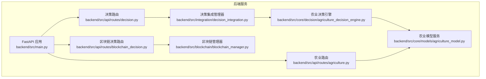
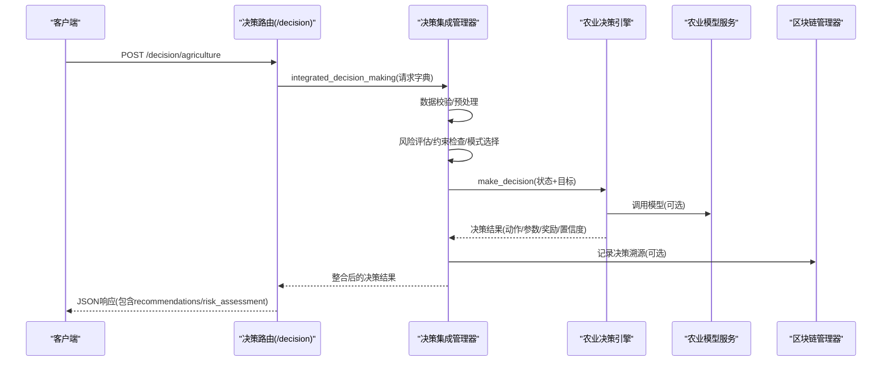
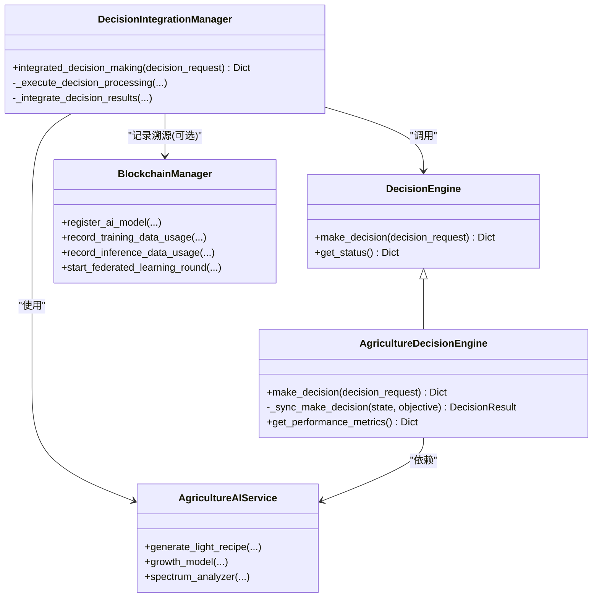

# 农业决策API

<cite>
**本文引用的文件**
- [backend/src/api/routes/agriculture.py](file://backend/src/api/routes/agriculture.py)
- [backend/src/api/routes/decision.py](file://backend/src/api/routes/decision.py)
- [backend/src/core/decision/agriculture_decision_engine.py](file://backend/src/core/decision/agriculture_decision_engine.py)
- [backend/src/core/models/agriculture_model.py](file://backend/src/core/models/agriculture_model.py)
- [backend/src/integration/decision_integration.py](file://backend/src/integration/decision_integration.py)
- [backend/src/blockchain/blockchain_manager.py](file://backend/src/blockchain/blockchain_manager.py)
- [backend/src/api/routes/blockchain_decision.py](file://backend/src/api/routes/blockchain_decision.py)
- [backend/src/api/routes/inference.py](file://backend/src/api/routes/inference.py)
- [backend/src/core/decision_engine.py](file://backend/src/core/decision_engine.py)
- [backend/src/main.py](file://backend/src/main.py)
- [README.md](file://README.md)
</cite>

## 目录
1. [简介](#简介)
2. [项目结构](#项目结构)
3. [核心组件](#核心组件)
4. [架构总览](#架构总览)
5. [详细组件分析](#详细组件分析)
6. [依赖关系分析](#依赖关系分析)
7. [性能与调用频率](#性能与调用频率)
8. [故障排查指南](#故障排查指南)
9. [结论](#结论)
10. [附录](#附录)

## 简介
本文件面向“农业决策API”的使用者与维护者，系统化梳理RESTful端点、请求/响应结构、错误码、与核心决策引擎（agriculture_decision_engine.py）的调用关系、与模型推理服务的集成方式，以及与区块链模块的交互（决策溯源）。同时给出典型请求示例与响应字段说明，并提供性能预期与调用频率建议。

## 项目结构
后端采用FastAPI框架，API路由位于backend/src/api/routes，核心业务逻辑位于backend/src/core，集成模块位于backend/src/integration，区块链模块位于backend/src/blockchain。主入口通过backend/src/main.py启动。

图示来源
- [backend/src/main.py](file://backend/src/main.py#L1-L43)
- [backend/src/api/routes/agriculture.py](file://backend/src/api/routes/agriculture.py#L1-L319)
- [backend/src/api/routes/decision.py](file://backend/src/api/routes/decision.py#L1-L376)
- [backend/src/api/routes/blockchain_decision.py](file://backend/src/api/routes/blockchain_decision.py#L1-L259)
- [backend/src/integration/decision_integration.py](file://backend/src/integration/decision_integration.py#L1-L615)
- [backend/src/core/decision/agriculture_decision_engine.py](file://backend/src/core/decision/agriculture_decision_engine.py#L1-L508)
- [backend/src/core/models/agriculture_model.py](file://backend/src/core/models/agriculture_model.py#L1-L463)
- [backend/src/blockchain/blockchain_manager.py](file://backend/src/blockchain/blockchain_manager.py#L1-L366)

章节来源
- [README.md](file://README.md#L1-L165)
- [backend/src/main.py](file://backend/src/main.py#L1-L43)

## 核心组件
- 农业路由（/agriculture）：提供光配方生成、植物生长预测、光谱分析、作物配置查询、种植规划、数据贡献等接口。
- 决策路由（/decision）：提供农业参数优化决策、批量决策、反馈、性能指标、历史查询、参数优化等接口。
- 决策集成管理器：封装数据校验、风险评估、约束检查、处理模式选择、并行执行多模块、后处理与风险监控。
- 农业决策引擎：基于强化学习策略网络，接收状态与目标，输出动作、参数、预期奖励、置信度等。
- 农业模型服务：提供光谱分析、植物生长预测、光配方生成等模型能力。
- 区块链管理器：提供模型注册、版本更新、数据使用溯源、联邦学习轮次管理等能力；与区块链决策路由配合使用。

章节来源
- [backend/src/api/routes/agriculture.py](file://backend/src/api/routes/agriculture.py#L1-L319)
- [backend/src/api/routes/decision.py](file://backend/src/api/routes/decision.py#L1-L376)
- [backend/src/integration/decision_integration.py](file://backend/src/integration/decision_integration.py#L1-L615)
- [backend/src/core/decision/agriculture_decision_engine.py](file://backend/src/core/decision/agriculture_decision_engine.py#L1-L508)
- [backend/src/core/models/agriculture_model.py](file://backend/src/core/models/agriculture_model.py#L1-L463)
- [backend/src/blockchain/blockchain_manager.py](file://backend/src/blockchain/blockchain_manager.py#L1-L366)

## 架构总览
农业决策API通过FastAPI路由接收请求，将请求数据交给决策集成管理器进行统一处理：数据校验、风险评估、约束检查、模式选择、并行执行核心决策引擎与摄像头控制等模块，最后进行后处理与风险监控。核心决策引擎基于强化学习策略网络生成动作与参数，农业模型服务提供光谱分析、生长预测、光配方生成等能力。区块链模块用于模型与数据使用溯源。

图示来源
- [backend/src/api/routes/decision.py](file://backend/src/api/routes/decision.py#L89-L140)
- [backend/src/integration/decision_integration.py](file://backend/src/integration/decision_integration.py#L54-L120)
- [backend/src/core/decision/agriculture_decision_engine.py](file://backend/src/core/decision/agriculture_engine.py#L119-L161)
- [backend/src/core/models/agriculture_model.py](file://backend/src/core/models/agriculture_model.py#L1-L463)
- [backend/src/blockchain/blockchain_manager.py](file://backend/src/blockchain/blockchain_manager.py#L205-L242)

## 详细组件分析

### 农业路由（/agriculture）
- 端点与用途
  - POST /agriculture/light-recipe：生成光配方（基于作物类型、当前天数、目标、环境）
  - POST /agriculture/growth-prediction：植物生长预测（环境数据、光谱数据、生长天数）
  - POST /agriculture/spectrum-analysis：光谱分析（光谱数据）
  - GET /agriculture/crop-configs：获取可用作物配置
  - POST /agriculture/crop-planning：制定种植计划（作物类型、目标产量、起止日期）
  - POST /agriculture/data-contribution：数据贡献（用户ID、作物类型、生长数据、图片/视频）
  - GET /agriculture/recommendations/{crop_type}?current_day=…：获取生长建议
- 请求参数与JSON Schema
  - 光配方请求：crop_type、current_day、target_objective、environment
  - 生长预测请求：crop_type、current_day、environmental_data、spectrum_data
  - 光谱分析请求：spectrum_data
  - 种植规划请求：crop_type、target_yield、start_date、expected_harvest_date
  - 数据贡献请求：user_id、crop_type、growth_data、images、videos
  - 生长建议查询：路径参数crop_type，查询参数current_day
- 响应格式
  - 成功时返回包含success与data的对象；data内包含具体结果字段
  - 错误时返回HTTP 400，detail为错误信息
- 与核心模块的关系
  - 调用农业模型服务（AgricultureAIService）生成配方、预测、分析
  - 与作物配置、阶段信息、推荐建议等数据交互

章节来源
- [backend/src/api/routes/agriculture.py](file://backend/src/api/routes/agriculture.py#L18-L319)
- [backend/src/core/models/agriculture_model.py](file://backend/src/core/models/agriculture_model.py#L1-L463)

### 决策路由（/decision）
- 端点与用途
  - POST /decision/agriculture：农业参数优化决策（温度、湿度、CO2、光照强度、光谱配置、作物类型、生长天数、生长率、健康评分、产量潜力、能耗、资源利用率、目标、任务类型、风险级别）
  - POST /decision/risk：风险分析决策（同上）
  - POST /decision/agriculture/batch：批量农业决策（批量请求列表）
  - POST /decision/feedback：提供决策反馈（决策ID、实际奖励、下一个状态、成功指示、备注）
  - GET /decision/performance：获取决策性能指标
  - POST /decision/history：查询决策历史（起止时间、作物类型、目标、limit、offset）
  - POST /decision/optimize：优化决策参数（模拟）
- 请求参数与JSON Schema
  - 决策请求：温度、湿度、CO2、光照强度、光谱配置、作物类型、生长天数、生长率、健康评分、产量潜力、能耗、资源利用率、目标、任务类型、风险级别
  - 批量请求：requests列表（每项为上述字段）、batch_id、priority
  - 反馈请求：decision_id、actual_reward、next_state、success_indicator、feedback_notes
  - 历史查询：start_time、end_time、crop_type、objective、limit、offset
- 响应格式
  - 成功时返回包含success与data的对象；data内包含决策ID、动作、参数、预期奖励、置信度、执行时间、建议、风险评估等
  - 错误时返回HTTP 400
- 与核心模块的关系
  - 通过决策集成管理器（DecisionIntegrationManager）执行：数据校验、风险评估、约束检查、模式选择、并行执行核心决策引擎与摄像头控制、后处理与风险监控
  - 农业决策引擎（AgricultureDecisionEngine）基于强化学习策略网络生成动作与参数

章节来源
- [backend/src/api/routes/decision.py](file://backend/src/api/routes/decision.py#L1-L376)
- [backend/src/integration/decision_integration.py](file://backend/src/integration/decision_integration.py#L1-L615)
- [backend/src/core/decision/agriculture_decision_engine.py](file://backend/src/core/decision/agriculture_decision_engine.py#L1-L508)
- [backend/src/core/decision_engine.py](file://backend/src/core/decision_engine.py#L1-L36)

### 决策集成管理器（DecisionIntegrationManager）
- 职责
  - 数据验证与预处理
  - 风险评估（迁移学习、边缘计算、决策风险）
  - 规则约束检查（迁移学习、边缘计算、决策约束）
  - 处理模式选择（低/中/高风险、约束满足与否）
  - 并行执行核心决策引擎、摄像头控制等模块
  - 后处理与风险监控（风险后处理、风险监控任务）
  - 回退机制（集成失败时回退到基础决策）
- 关键流程
  - integrated_decision_making：统一协调上述步骤
  - _execute_decision_processing：并行执行多个处理模块
  - _integrate_decision_results：整合核心决策与其他模块结果
  - _handle_integration_failure：集成失败回退

章节来源
- [backend/src/integration/decision_integration.py](file://backend/src/integration/decision_integration.py#L1-L615)

### 农业决策引擎（AgricultureDecisionEngine）
- 职责
  - 实现DecisionEngine接口，基于状态与目标生成动作与参数
  - 强化学习策略网络（策略头+价值头），输出动作概率与价值估计
  - 参数生成：光谱调整、温度、湿度、营养液、摄像头控制等
  - 奖励计算与有效性评估、参数质量评估
  - 性能指标：平均奖励、决策次数、近期成功率
- 关键流程
  - make_decision：异步决策入口，转为AgricultureState与目标枚举，调用同步决策方法
  - _sync_make_decision：提取状态特征、选择动作、生成参数、计算预期奖励
  - _generate_action_parameters：按动作类型生成具体参数
  - update_policy/get_performance_metrics：策略更新与性能指标

章节来源
- [backend/src/core/decision/agriculture_decision_engine.py](file://backend/src/core/decision/agriculture_decision_engine.py#L1-L508)
- [backend/src/core/decision_engine.py](file://backend/src/core/decision_engine.py#L1-L36)

### 农业模型服务（AgricultureAIService）
- 职责
  - 光谱分析器：从光谱数据提取UV、远红、白光、红光强度与白红配比
  - 植物生长模型：基于环境与光谱统计特征预测生长率、健康评分、产量潜力
  - 光配方生成器：基于作物类型、阶段、目标与环境条件生成光配方
  - 作物配置：内置多种作物的生长阶段、目标与质量指标
- 关键流程
  - generate_light_recipe：生成光配方并返回当前阶段、光照时长与建议
  - _get_current_stage/_get_growth_recommendations：阶段判定与建议生成

章节来源
- [backend/src/core/models/agriculture_model.py](file://backend/src/core/models/agriculture_model.py#L1-L463)

### 区块链模块与交互
- 区块链管理器（BlockchainManager）
  - 提供模型注册、版本更新、完整性验证、数据使用溯源、联邦学习轮次管理等能力
  - 支持开发模式与生产模式切换
- 区块链决策路由（/api/v1/blockchain/decision）
  - 提供make_decision、performance、update_policy、health等接口
  - 与区块链管理器配合，实现决策溯源与生态治理

章节来源
- [backend/src/blockchain/blockchain_manager.py](file://backend/src/blockchain/blockchain_manager.py#L1-L366)
- [backend/src/api/routes/blockchain_decision.py](file://backend/src/api/routes/blockchain_decision.py#L1-L259)

### 模型推理服务（/inference）
- 端点与用途
  - 文本生成、图像分类、图像生成、批量推理、统计信息、缓存清理
- 认证
  - 通过Header携带API密钥进行校验
- 与农业决策API的关系
  - 作为通用推理服务，可被上层业务（如决策集成）按需调用（本仓库未直接在农业决策API中显式调用推理服务）

章节来源
- [backend/src/api/routes/inference.py](file://backend/src/api/routes/inference.py#L1-L284)

## 依赖关系分析

图示来源
- [backend/src/core/decision_engine.py](file://backend/src/core/decision_engine.py#L1-L36)
- [backend/src/core/decision/agriculture_decision_engine.py](file://backend/src/core/decision/agriculture_decision_engine.py#L1-L508)
- [backend/src/integration/decision_integration.py](file://backend/src/integration/decision_integration.py#L1-L615)
- [backend/src/core/models/agriculture_model.py](file://backend/src/core/models/agriculture_model.py#L1-L463)
- [backend/src/blockchain/blockchain_manager.py](file://backend/src/blockchain/blockchain_manager.py#L1-L366)

## 性能与调用频率
- 性能预期
  - 决策响应时间：建议小于500ms（引擎内部执行时间约0.1秒，集成流程包含并行与风险监控，需结合实际部署资源评估）
- 调用频率限制
  - 本仓库未实现速率限制中间件；建议在网关或API层引入限流策略（如每分钟请求数、并发上限），并结合熔断与降级策略保障稳定性
- 监控与可观测性
  - 可通过GET /decision/performance获取决策引擎性能指标，辅助容量规划与性能优化

章节来源
- [backend/src/core/decision/agriculture_decision_engine.py](file://backend/src/core/decision/agriculture_decision_engine.py#L180-L200)
- [backend/src/api/routes/decision.py](file://backend/src/api/routes/decision.py#L250-L272)

## 故障排查指南
- 常见错误码
  - 400：参数无效、数据验证失败、请求格式错误
  - 500：决策引擎内部错误、集成失败回退
- 排查要点
  - 检查请求参数是否完整且类型正确（如温度、湿度、光谱数组长度、作物类型是否受支持）
  - 查看决策集成管理器日志，关注数据校验、风险评估、约束检查、处理模式选择、并行执行结果
  - 若集成失败，确认回退机制是否生效，查看回退原因与时间戳
  - 区块链相关问题：检查区块链管理器初始化状态与开发/生产模式配置

章节来源
- [backend/src/api/routes/agriculture.py](file://backend/src/api/routes/agriculture.py#L82-L122)
- [backend/src/api/routes/decision.py](file://backend/src/api/routes/decision.py#L141-L143)
- [backend/src/integration/decision_integration.py](file://backend/src/integration/decision_integration.py#L507-L580)

## 结论
农业决策API通过清晰的路由划分与强大的决策集成管理器，实现了从数据采集、风险评估、约束检查到决策执行与后处理的闭环。核心决策引擎基于强化学习策略网络，结合农业模型服务，能够为农业生产提供参数优化与阶段建议。区块链模块为模型与数据使用提供溯源能力，有助于生态治理与审计。建议在生产环境中完善限流、熔断与监控体系，确保稳定与高性能。

## 附录

### API端点一览与示例

- 获取某地块的施肥建议（示例思路）
  - 方法：GET /agriculture/recommendations/{crop_type}?current_day={day}
  - 示例请求：GET /agriculture/recommendations/番茄?current_day=45
  - 响应字段：crop_type、current_stage、current_day、recommendations、next_stage
  - 说明：返回当前阶段建议与下一阶段准备提示

- 生成光配方（示例思路）
  - 方法：POST /agriculture/light-recipe
  - 请求体：crop_type、current_day、target_objective、environment
  - 示例请求体：
    - crop_type: "番茄"
    - current_day: 45
    - target_objective: "最大化产量"
    - environment: {"temperature": 25.0, "humidity": 60.0, "co2": 400.0}
  - 响应字段：recipe（uv_380nm、far_red_720nm、white_light、red_660nm、white_red_ratio）、current_stage、light_hours、recommendations

- 植物生长预测（示例思路）
  - 方法：POST /agriculture/growth-prediction
  - 请求体：crop_type、current_day、environmental_data、spectrum_data
  - 响应字段：growth_rate、health_score、yield_potential

- 农业参数优化决策（示例思路）
  - 方法：POST /decision/agriculture
  - 请求体：温度、湿度、CO2、光照强度、光谱配置、作物类型、生长天数、生长率、健康评分、产量潜力、能耗、资源利用率、目标、任务类型、风险级别
  - 响应字段：decision_id、action、parameters、expected_reward、confidence、execution_time、recommendations、risk_assessment

- 批量决策（示例思路）
  - 方法：POST /decision/agriculture/batch
  - 请求体：requests（列表，每项为上述字段）、batch_id、priority
  - 响应字段：batch_id、total_decisions、total_execution_time、average_execution_time、decisions

- 数据贡献（示例思路）
  - 方法：POST /agriculture/data-contribution
  - 请求体：user_id、crop_type、growth_data、images、videos
  - 响应字段：photon_points_earned、contribution_id、message

- 区块链决策（示例思路）
  - 方法：POST /api/v1/blockchain/decision/make_decision
  - 请求体：用户贡献、用户活跃度、信誉、余额、市场供需、交易量、平均交易额、发行总量、流通量、系统利用率、风险级别、time_since_last_decision、objective
  - 响应字段：action、parameters、expected_reward、confidence、execution_time、risk_assessment、decision_id、timestamp

章节来源
- [backend/src/api/routes/agriculture.py](file://backend/src/api/routes/agriculture.py#L56-L122)
- [backend/src/api/routes/agriculture.py](file://backend/src/api/routes/agriculture.py#L270-L294)
- [backend/src/api/routes/decision.py](file://backend/src/api/routes/decision.py#L89-L140)
- [backend/src/api/routes/decision.py](file://backend/src/api/routes/decision.py#L151-L214)
- [backend/src/api/routes/blockchain_decision.py](file://backend/src/api/routes/blockchain_decision.py#L75-L139)