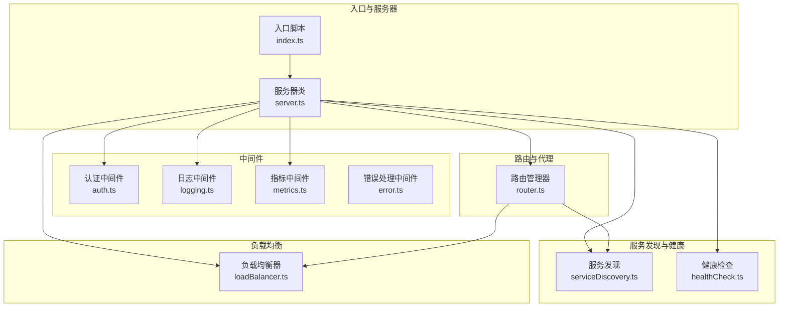
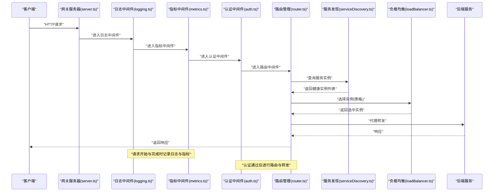
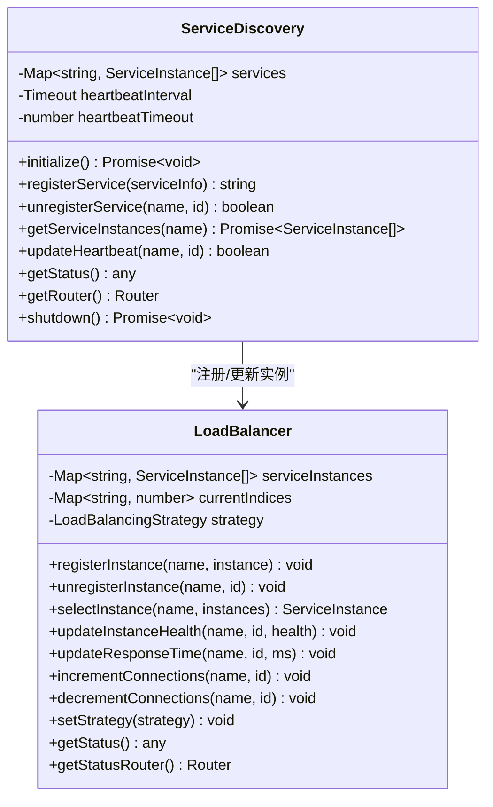
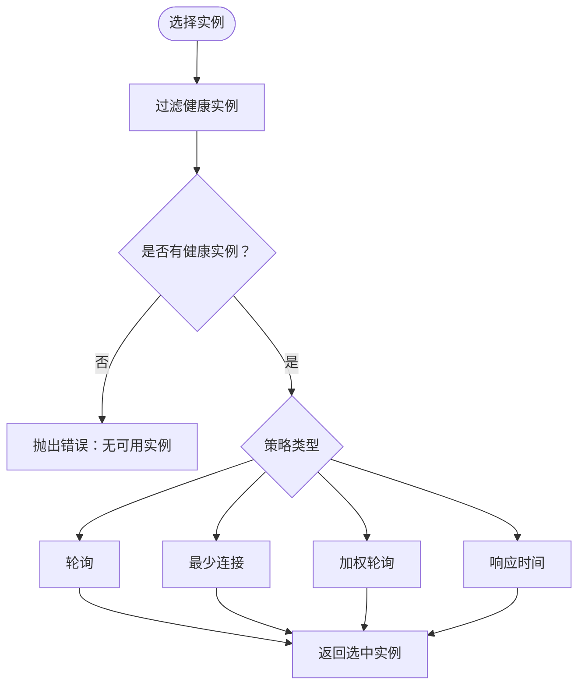
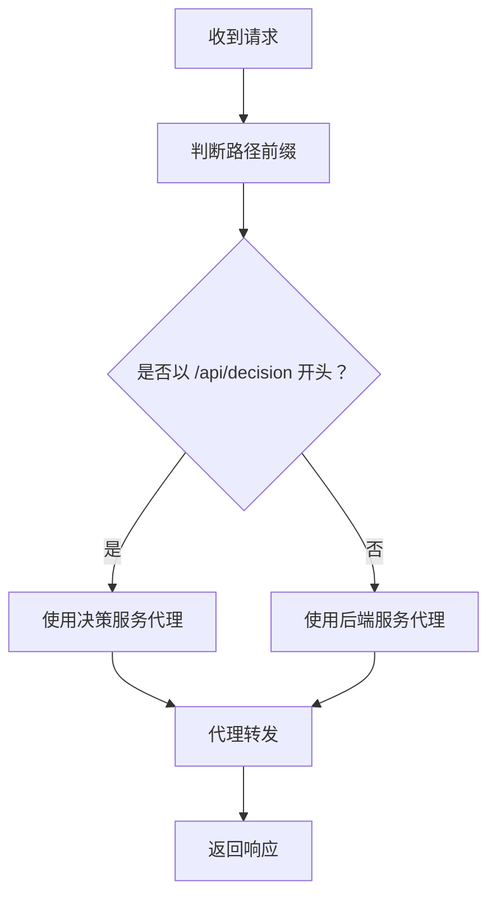
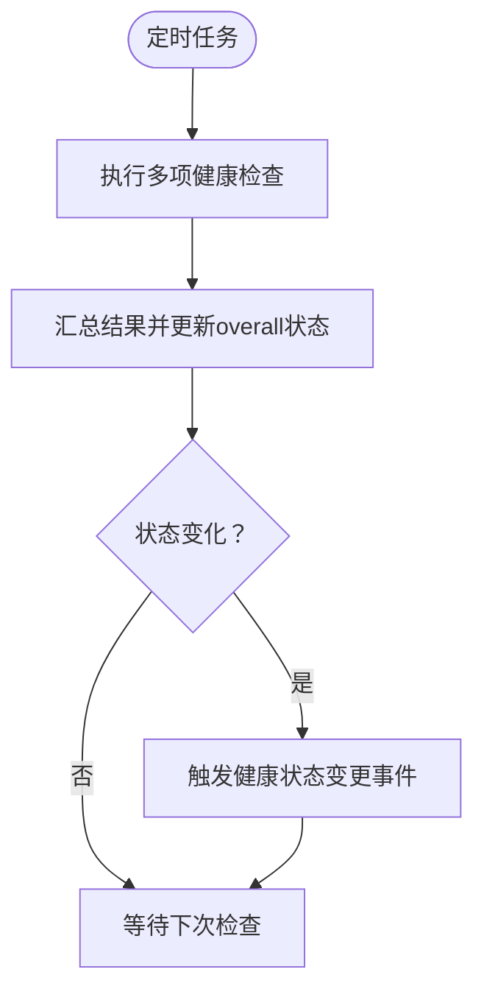
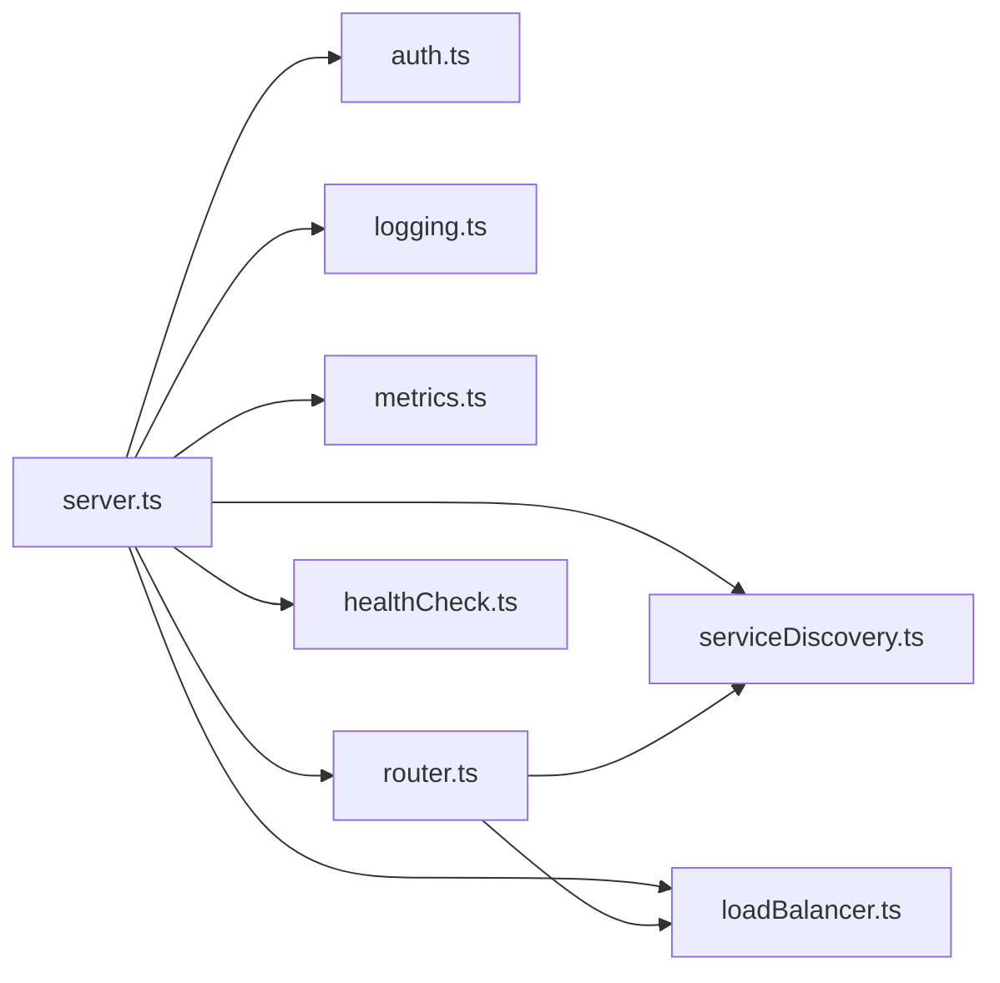

# API网关

<cite>
**本文引用的文件**
- [api-gateway/src/index.ts](file://api-gateway/src/index.ts)
- [api-gateway/src/server.ts](file://api-gateway/src/server.ts)
- [api-gateway/src/discovery/serviceDiscovery.ts](file://api-gateway/src/discovery/serviceDiscovery.ts)
- [api-gateway/src/load-balancing/loadBalancer.ts](file://api-gateway/src/load-balancing/loadBalancer.ts)
- [api-gateway/src/routing/router.ts](file://api-gateway/src/routing/router.ts)
- [api-gateway/src/middleware/auth.ts](file://api-gateway/src/middleware/auth.ts)
- [api-gateway/src/middleware/logging.ts](file://api-gateway/src/middleware/logging.ts)
- [api-gateway/src/middleware/metrics.ts](file://api-gateway/src/middleware/metrics.ts)
- [api-gateway/src/middleware/error.ts](file://api-gateway/src/middleware/error.ts)
- [api-gateway/src/health/healthCheck.ts](file://api-gateway/src/health/healthCheck.ts)
- [api-gateway/.env.example](file://api-gateway/.env.example)
- [api-gateway/package.json](file://api-gateway/package.json)
- [api-gateway/README.md](file://api-gateway/README.md)
</cite>

## 目录
1. [简介](#简介)
2. [项目结构](#项目结构)
3. [核心组件](#核心组件)
4. [架构总览](#架构总览)
5. [详细组件分析](#详细组件分析)
6. [依赖关系分析](#依赖关系分析)
7. [性能考虑](#性能考虑)
8. [故障排查指南](#故障排查指南)
9. [结论](#结论)
10. [附录](#附录)

## 简介
本文件面向运维与开发人员，系统化文档化该API网关在Node.js + Express.js上的实现，重点覆盖以下方面：
- 服务发现：如何注册、注销、心跳维护与状态查询
- 路由转发：基于路径的路由规则与代理转发
- 负载均衡：多策略实例选择与健康状态联动
- 中间件链路：认证、日志、指标、错误处理的执行顺序与配置
- 网关配置与扩展：.env配置项、中间件扩展方法
- 运维监控与故障排查：健康检查、指标输出与常见问题定位

## 项目结构
API网关采用分层与按功能域组织的目录结构：
- 入口与服务器：入口脚本加载环境变量并启动服务器；服务器类集中配置中间件、路由与错误处理
- 发现与健康：服务发现模块负责服务实例登记与心跳；健康检查模块负责网关与外部服务健康状态汇总
- 负载均衡：负载均衡器维护实例列表、健康状态与连接数，并根据策略选择实例
- 路由与代理：路由管理器定义服务路由规则与代理配置，支持决策服务与后端服务的差异化转发
- 中间件：认证、日志、指标、错误处理四个中间件按序执行，形成请求生命周期的处理链



图表来源
- [api-gateway/src/index.ts](file://api-gateway/src/index.ts#L1-L45)
- [api-gateway/src/server.ts](file://api-gateway/src/server.ts#L1-L105)
- [api-gateway/src/routing/router.ts](file://api-gateway/src/routing/router.ts#L1-L140)
- [api-gateway/src/discovery/serviceDiscovery.ts](file://api-gateway/src/discovery/serviceDiscovery.ts#L1-L268)
- [api-gateway/src/load-balancing/loadBalancer.ts](file://api-gateway/src/load-balancing/loadBalancer.ts#L1-L229)
- [api-gateway/src/health/healthCheck.ts](file://api-gateway/src/health/healthCheck.ts#L1-L254)
- [api-gateway/src/middleware/auth.ts](file://api-gateway/src/middleware/auth.ts#L1-L38)
- [api-gateway/src/middleware/logging.ts](file://api-gateway/src/middleware/logging.ts#L1-L20)
- [api-gateway/src/middleware/metrics.ts](file://api-gateway/src/middleware/metrics.ts#L1-L20)
- [api-gateway/src/middleware/error.ts](file://api-gateway/src/middleware/error.ts#L1-L33)

章节来源
- [api-gateway/src/index.ts](file://api-gateway/src/index.ts#L1-L45)
- [api-gateway/src/server.ts](file://api-gateway/src/server.ts#L1-L105)

## 核心组件
- 服务器类：集中初始化中间件、路由、错误处理；启动时初始化服务发现与健康检查；优雅关闭时释放资源
- 路由管理器：定义服务路由规则与代理配置，支持决策服务与后端服务的差异化转发
- 服务发现：注册/注销服务实例、心跳维护、健康状态变更事件、状态查询接口
- 负载均衡器：维护实例列表、健康状态、连接数与响应时间，按策略选择实例
- 健康检查：周期性检查网关自身与外部服务健康状态，提供基础/详细/就绪/存活等健康接口
- 中间件链：日志、指标、认证、错误处理按序执行，形成请求生命周期处理

章节来源
- [api-gateway/src/server.ts](file://api-gateway/src/server.ts#L1-L105)
- [api-gateway/src/routing/router.ts](file://api-gateway/src/routing/router.ts#L1-L140)
- [api-gateway/src/discovery/serviceDiscovery.ts](file://api-gateway/src/discovery/serviceDiscovery.ts#L1-L268)
- [api-gateway/src/load-balancing/loadBalancer.ts](file://api-gateway/src/load-balancing/loadBalancer.ts#L1-L229)
- [api-gateway/src/health/healthCheck.ts](file://api-gateway/src/health/healthCheck.ts#L1-L254)
- [api-gateway/src/middleware/logging.ts](file://api-gateway/src/middleware/logging.ts#L1-L20)
- [api-gateway/src/middleware/metrics.ts](file://api-gateway/src/middleware/metrics.ts#L1-L20)
- [api-gateway/src/middleware/auth.ts](file://api-gateway/src/middleware/auth.ts#L1-L38)
- [api-gateway/src/middleware/error.ts](file://api-gateway/src/middleware/error.ts#L1-L33)

## 架构总览
下图展示请求从进入网关到后端服务的完整生命周期，包括中间件链、服务发现与负载均衡的协作。



图表来源
- [api-gateway/src/server.ts](file://api-gateway/src/server.ts#L1-L105)
- [api-gateway/src/middleware/logging.ts](file://api-gateway/src/middleware/logging.ts#L1-L20)
- [api-gateway/src/middleware/metrics.ts](file://api-gateway/src/middleware/metrics.ts#L1-L20)
- [api-gateway/src/middleware/auth.ts](file://api-gateway/src/middleware/auth.ts#L1-L38)
- [api-gateway/src/routing/router.ts](file://api-gateway/src/routing/router.ts#L1-L140)
- [api-gateway/src/discovery/serviceDiscovery.ts](file://api-gateway/src/discovery/serviceDiscovery.ts#L1-L268)
- [api-gateway/src/load-balancing/loadBalancer.ts](file://api-gateway/src/load-balancing/loadBalancer.ts#L1-L229)

## 详细组件分析

### 服务发现模块
- 职责
  - 注册/注销服务实例，维护实例健康状态
  - 心跳检测与超时判定，自动标记不健康实例
  - 预注册已知服务，便于本地开发与演示
  - 提供REST接口：注册、注销、心跳、状态查询、实例查询
- 关键数据结构
  - 服务实例：包含id、host、port、权重、健康状态、最后心跳时间等
  - 事件：服务注册、注销、不健康事件
- 与负载均衡的集成
  - 注册实例时同步到负载均衡器
  - 心跳更新与超时会同步健康状态
- 与路由的关系
  - 路由管理器通过服务发现获取健康实例，再交由负载均衡器选择



图表来源
- [api-gateway/src/discovery/serviceDiscovery.ts](file://api-gateway/src/discovery/serviceDiscovery.ts#L1-L268)
- [api-gateway/src/load-balancing/loadBalancer.ts](file://api-gateway/src/load-balancing/loadBalancer.ts#L1-L229)

章节来源
- [api-gateway/src/discovery/serviceDiscovery.ts](file://api-gateway/src/discovery/serviceDiscovery.ts#L1-L268)

### 负载均衡模块
- 策略
  - 轮询(round-robin)
  - 最少连接(least-connections)
  - 加权轮询(weighted-round-robin)
  - 响应时间(response-time)
- 关键能力
  - 维护实例健康状态、连接数、响应时间
  - 选择健康实例，若无健康实例则抛出错误
  - 提供状态查询与策略设置接口
- 与服务发现联动
  - 服务发现注册/注销实例时同步到负载均衡器
  - 心跳超时会将实例标记为不健康



图表来源
- [api-gateway/src/load-balancing/loadBalancer.ts](file://api-gateway/src/load-balancing/loadBalancer.ts#L1-L229)

章节来源
- [api-gateway/src/load-balancing/loadBalancer.ts](file://api-gateway/src/load-balancing/loadBalancer.ts#L1-L229)

### 路由与代理模块
- 路由规则
  - 决策服务：/api/decision
  - 后端服务：/api 下的多个子路径
- 代理配置
  - 使用http-proxy-middleware进行透明转发
  - changeOrigin与pathRewrite确保后端服务正确接收请求
- 路由中间件
  - 根据请求路径选择对应代理
  - 记录转发日志并调用代理中间件



图表来源
- [api-gateway/src/routing/router.ts](file://api-gateway/src/routing/router.ts#L1-L140)

章节来源
- [api-gateway/src/routing/router.ts](file://api-gateway/src/routing/router.ts#L1-L140)

### 中间件链与请求生命周期
- 执行顺序
  1) 安全与限流：Helmet、CORS、限流
  2) 解析与压缩：compression、express.json/urlencoded
  3) 日志中间件：记录请求开始与完成
  4) 指标中间件：记录耗时与状态码
  5) 认证中间件：仅对/api/decision与/api下的受保护路由生效
  6) 路由中间件：匹配路径并代理转发
  7) 错误处理中间件：统一错误响应
- 认证中间件
  - 放行预检请求
  - 读取请求头中的X-API-KEY
  - 校验API密钥列表，通过则放行
- 日志与指标
  - 日志中间件：请求开始与完成时打印
  - 指标中间件：完成时输出耗时与状态码（可对接Prometheus）

```mermaid
sequenceDiagram
participant C as "客户端"
participant G as "网关服务器"
participant L as "日志中间件"
participant M as "指标中间件"
participant A as "认证中间件"
participant R as "路由中间件"
participant E as "错误处理中间件"
C->>G : "HTTP请求"
G->>L : "进入日志中间件"
L->>M : "进入指标中间件"
M->>A : "进入认证中间件"
A->>R : "进入路由中间件"
R-->>C : "返回响应"
Note over L,M,A,R : "发生错误时进入错误处理中间件"
R->>E : "next(error)"
E-->>C : "统一错误响应"
```

图表来源
- [api-gateway/src/server.ts](file://api-gateway/src/server.ts#L1-L105)
- [api-gateway/src/middleware/logging.ts](file://api-gateway/src/middleware/logging.ts#L1-L20)
- [api-gateway/src/middleware/metrics.ts](file://api-gateway/src/middleware/metrics.ts#L1-L20)
- [api-gateway/src/middleware/auth.ts](file://api-gateway/src/middleware/auth.ts#L1-L38)
- [api-gateway/src/middleware/error.ts](file://api-gateway/src/middleware/error.ts#L1-L33)

章节来源
- [api-gateway/src/server.ts](file://api-gateway/src/server.ts#L1-L105)
- [api-gateway/src/middleware/auth.ts](file://api-gateway/src/middleware/auth.ts#L1-L38)
- [api-gateway/src/middleware/logging.ts](file://api-gateway/src/middleware/logging.ts#L1-L20)
- [api-gateway/src/middleware/metrics.ts](file://api-gateway/src/middleware/metrics.ts#L1-L20)
- [api-gateway/src/middleware/error.ts](file://api-gateway/src/middleware/error.ts#L1-L33)

### 健康检查模块
- 周期性检查
  - 网关自身健康、内存使用、数据库连接、外部服务
- 状态汇总
  - overall状态：healthy/degraded/unhealthy
  - 详细组件状态与时间戳
- 接口
  - 基础健康、详细健康、就绪检查、存活检查、服务健康状态、手动触发检查



图表来源
- [api-gateway/src/health/healthCheck.ts](file://api-gateway/src/health/healthCheck.ts#L1-L254)

章节来源
- [api-gateway/src/health/healthCheck.ts](file://api-gateway/src/health/healthCheck.ts#L1-L254)

## 依赖关系分析
- 服务器类依赖中间件、路由、服务发现、健康检查与负载均衡
- 路由管理器依赖服务发现与负载均衡器
- 服务发现与负载均衡器通过事件与同步接口耦合
- 中间件之间低耦合，通过Express中间件链串联



图表来源
- [api-gateway/src/server.ts](file://api-gateway/src/server.ts#L1-L105)
- [api-gateway/src/routing/router.ts](file://api-gateway/src/routing/router.ts#L1-L140)
- [api-gateway/src/discovery/serviceDiscovery.ts](file://api-gateway/src/discovery/serviceDiscovery.ts#L1-L268)
- [api-gateway/src/load-balancing/loadBalancer.ts](file://api-gateway/src/load-balancing/loadBalancer.ts#L1-L229)
- [api-gateway/src/health/healthCheck.ts](file://api-gateway/src/health/healthCheck.ts#L1-L254)

章节来源
- [api-gateway/src/server.ts](file://api-gateway/src/server.ts#L1-L105)
- [api-gateway/src/routing/router.ts](file://api-gateway/src/routing/router.ts#L1-L140)
- [api-gateway/src/discovery/serviceDiscovery.ts](file://api-gateway/src/discovery/serviceDiscovery.ts#L1-L268)
- [api-gateway/src/load-balancing/loadBalancer.ts](file://api-gateway/src/load-balancing/loadBalancer.ts#L1-L229)
- [api-gateway/src/health/healthCheck.ts](file://api-gateway/src/health/healthCheck.ts#L1-L254)

## 性能考虑
- 中间件顺序优化：日志与指标在认证之前，避免对未认证请求产生不必要的开销
- 代理转发：启用changeOrigin与pathRewrite，减少后端服务适配成本
- 负载均衡策略：根据场景选择least-connections或response-time策略，提升吞吐与延迟表现
- 压缩与限流：开启compression与rateLimit，降低带宽与DDoS风险
- 健康检查频率：合理设置检查间隔，避免过度检查导致额外负载

## 故障排查指南
- 服务不可用
  - 检查服务发现状态与实例健康状态
  - 确认负载均衡器是否仍有健康实例
- 认证失败
  - 确认请求头中携带正确的X-API-KEY
  - 核对认证中间件的密钥列表配置
- 代理错误
  - 查看路由中间件日志，确认目标服务URL与路径重写
  - 检查后端服务是否可达
- 错误处理
  - 统一错误响应由错误处理中间件输出
  - 对ECONNREFUSED与代理错误进行分类处理
- 健康检查
  - 使用健康检查接口查看overall状态与详细组件状态
  - 若状态为unhealthy，结合日志与指标定位问题

章节来源
- [api-gateway/src/middleware/error.ts](file://api-gateway/src/middleware/error.ts#L1-L33)
- [api-gateway/src/health/healthCheck.ts](file://api-gateway/src/health/healthCheck.ts#L1-L254)
- [api-gateway/src/discovery/serviceDiscovery.ts](file://api-gateway/src/discovery/serviceDiscovery.ts#L1-L268)
- [api-gateway/src/load-balancing/loadBalancer.ts](file://api-gateway/src/load-balancing/loadBalancer.ts#L1-L229)
- [api-gateway/src/routing/router.ts](file://api-gateway/src/routing/router.ts#L1-L140)

## 结论
该API网关以Express为基础，通过清晰的中间件链、服务发现与负载均衡模块，实现了高可用、可观测与可扩展的统一入口。建议在生产环境中：
- 使用更严格的认证机制（如JWT）与鉴权策略
- 将指标中间件接入Prometheus/Grafana
- 配置服务发现与负载均衡策略以适配业务流量特征
- 建立完善的健康检查与告警体系

## 附录

### 网关配置（.env）与扩展中间件指导
- 环境变量参考
  - 服务器与安全：PORT、NODE_ENV、JWT_SECRET、API_KEYS
  - 前端与日志：FRONTEND_URL、LOG_LEVEL
  - 服务发现与心跳：SERVICE_DISCOVERY_TIMEOUT、HEARTBEAT_INTERVAL
  - 负载均衡：LOAD_BALANCING_STRATEGY
  - 限流：RATE_LIMIT_WINDOW_MS、RATE_LIMIT_MAX_REQUESTS
  - 监控与外部服务：METRICS_ENABLED、HEALTH_CHECK_INTERVAL、各服务URL
- 扩展自定义中间件
  - 在middleware目录新增中间件文件
  - 在服务器类的setupMiddlewares中注册中间件
  - 注意中间件顺序与职责边界，避免重复处理

章节来源
- [api-gateway/.env.example](file://api-gateway/.env.example#L1-L43)
- [api-gateway/src/server.ts](file://api-gateway/src/server.ts#L1-L105)
- [api-gateway/src/middleware/auth.ts](file://api-gateway/src/middleware/auth.ts#L1-L38)
- [api-gateway/src/middleware/logging.ts](file://api-gateway/src/middleware/logging.ts#L1-L20)
- [api-gateway/src/middleware/metrics.ts](file://api-gateway/src/middleware/metrics.ts#L1-L20)
- [api-gateway/src/middleware/error.ts](file://api-gateway/src/middleware/error.ts#L1-L33)

### 服务发现与后端服务通信
- 服务注册
  - 通过服务发现接口提交服务信息，网关将实例注册到负载均衡器
- 心跳维护
  - 定时上报心跳，超时将被标记为不健康
- 实例选择
  - 路由中间件查询服务发现，负载均衡器按策略选择实例并返回
- 后端服务
  - 路由管理器将请求转发至后端服务，保持路径与头部一致性

章节来源
- [api-gateway/src/discovery/serviceDiscovery.ts](file://api-gateway/src/discovery/serviceDiscovery.ts#L1-L268)
- [api-gateway/src/load-balancing/loadBalancer.ts](file://api-gateway/src/load-balancing/loadBalancer.ts#L1-L229)
- [api-gateway/src/routing/router.ts](file://api-gateway/src/routing/router.ts#L1-L140)

### 负载均衡策略与请求分配
- 策略选择
  - round-robin：简单均匀分配
  - least-connections：优先选择空闲连接较少的实例
  - weighted-round-robin：按权重分配，适合异构实例
  - response-time：优先选择响应时间较短的实例
- 实例健康与连接
  - 健康状态由服务发现心跳驱动
  - 连接数与响应时间由上游调用方或监控系统更新

章节来源
- [api-gateway/src/load-balancing/loadBalancer.ts](file://api-gateway/src/load-balancing/loadBalancer.ts#L1-L229)
- [api-gateway/src/discovery/serviceDiscovery.ts](file://api-gateway/src/discovery/serviceDiscovery.ts#L1-L268)

### 运维监控指标与健康检查
- 指标输出
  - 指标中间件在请求完成时输出耗时与状态码
  - 可对接Prometheus/Grafana进行可视化
- 健康检查
  - 基础健康：返回overall状态
  - 详细健康：返回组件与系统信息
  - 就绪/存活：用于编排系统探测
  - 服务健康：返回各服务健康状态

章节来源
- [api-gateway/src/middleware/metrics.ts](file://api-gateway/src/middleware/metrics.ts#L1-L20)
- [api-gateway/src/health/healthCheck.ts](file://api-gateway/src/health/healthCheck.ts#L1-L254)