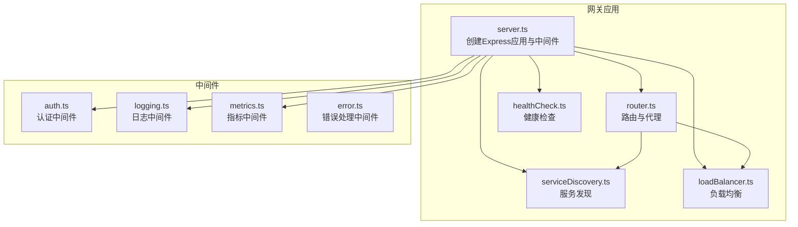
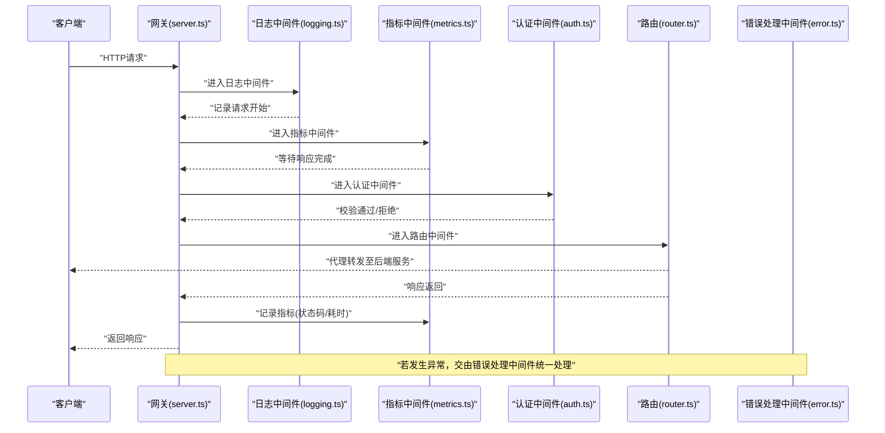
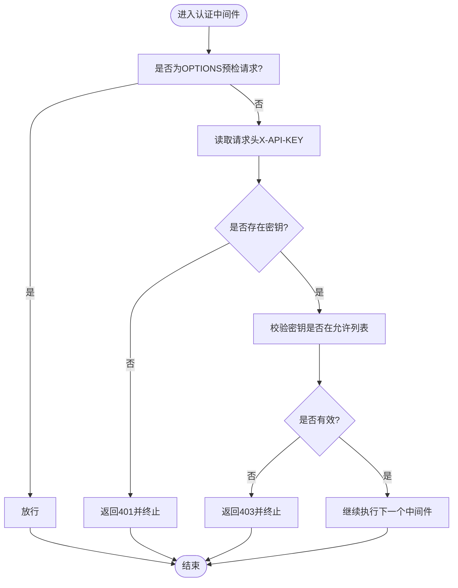
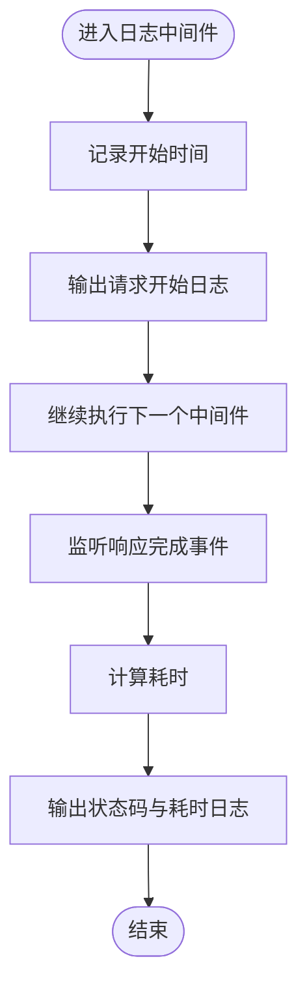
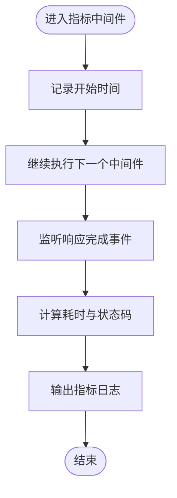
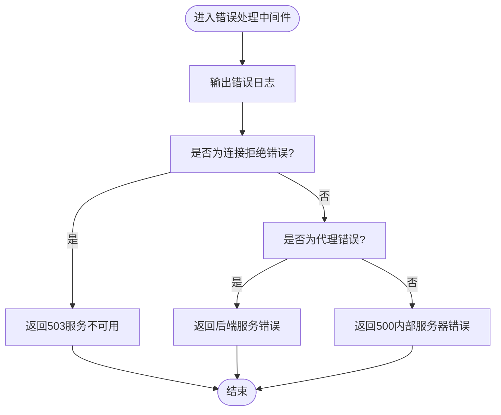
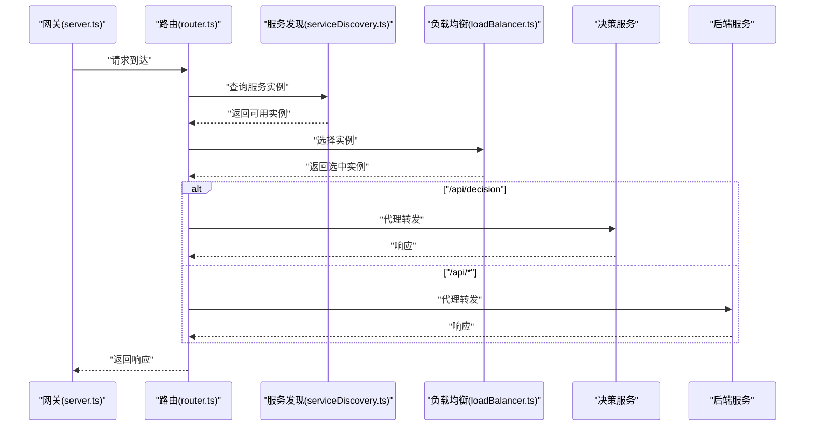
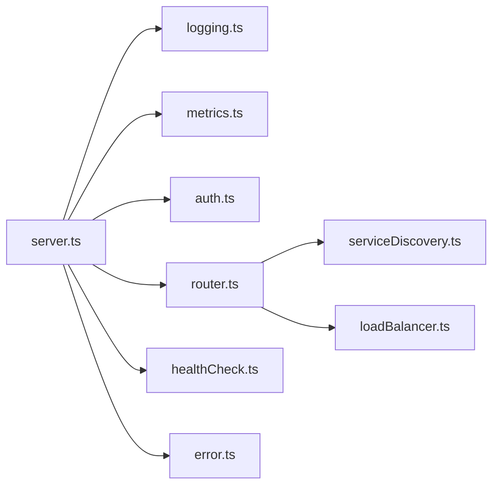

# 中间件系统

<cite>
**本文引用的文件**
- [api-gateway/src/server.ts](file://api-gateway/src/server.ts)
- [api-gateway/src/middleware/auth.ts](file://api-gateway/src/middleware/auth.ts)
- [api-gateway/src/middleware/logging.ts](file://api-gateway/src/middleware/logging.ts)
- [api-gateway/src/middleware/metrics.ts](file://api-gateway/src/middleware/metrics.ts)
- [api-gateway/src/middleware/error.ts](file://api-gateway/src/middleware/error.ts)
- [api-gateway/src/routing/router.ts](file://api-gateway/src/routing/router.ts)
- [api-gateway/src/health/healthCheck.ts](file://api-gateway/src/health/healthCheck.ts)
- [api-gateway/src/discovery/serviceDiscovery.ts](file://api-gateway/src/discovery/serviceDiscovery.ts)
- [api-gateway/src/load-balancing/loadBalancer.ts](file://api-gateway/src/load-balancing/loadBalancer.ts)
- [api-gateway/src/index.ts](file://api-gateway/src/index.ts)
- [api-gateway/package.json](file://api-gateway/package.json)
- [api-gateway/.env.example](file://api-gateway/.env.example)
- [api-gateway/README.md](file://api-gateway/README.md)
</cite>

## 目录
1. [简介](#简介)
2. [项目结构](#项目结构)
3. [核心组件](#核心组件)
4. [架构总览](#架构总览)
5. [详细组件分析](#详细组件分析)
6. [依赖关系分析](#依赖关系分析)
7. [性能考量](#性能考量)
8. [故障排查指南](#故障排查指南)
9. [结论](#结论)
10. [附录](#附录)

## 简介
本文件聚焦于API网关的中间件执行链，系统性梳理认证(auth)、日志(logging)、指标收集(metrics)与错误处理(error)中间件的实现逻辑、挂载方式、执行顺序以及与路由、服务发现、负载均衡的协作关系。同时给出中间件配置、扩展方法与常见问题的解决方案，帮助读者快速理解并正确使用该中间件体系。

## 项目结构
API网关采用Express应用作为核心载体，中间件按职责分层挂载，路由与代理在路由模块中集中管理，健康检查、服务发现与负载均衡作为辅助能力贯穿请求生命周期。

图表来源
- [api-gateway/src/server.ts](file://api-gateway/src/server.ts#L1-L105)
- [api-gateway/src/routing/router.ts](file://api-gateway/src/routing/router.ts#L1-L140)
- [api-gateway/src/health/healthCheck.ts](file://api-gateway/src/health/healthCheck.ts#L1-L254)
- [api-gateway/src/discovery/serviceDiscovery.ts](file://api-gateway/src/discovery/serviceDiscovery.ts#L1-L268)
- [api-gateway/src/load-balancing/loadBalancer.ts](file://api-gateway/src/load-balancing/loadBalancer.ts#L1-L229)

章节来源
- [api-gateway/src/server.ts](file://api-gateway/src/server.ts#L1-L105)
- [api-gateway/src/routing/router.ts](file://api-gateway/src/routing/router.ts#L1-L140)

## 核心组件
- 认证中间件：对特定路由进行API密钥校验，放行预检请求，其余请求必须携带有效密钥。
- 日志中间件：记录请求开始与响应完成后的状态码与耗时。
- 指标中间件：在响应完成后输出指标日志，便于接入监控系统。
- 错误处理中间件：统一捕获异常，区分后端代理错误与网络连接错误，返回标准化错误响应。

章节来源
- [api-gateway/src/middleware/auth.ts](file://api-gateway/src/middleware/auth.ts#L1-L38)
- [api-gateway/src/middleware/logging.ts](file://api-gateway/src/middleware/logging.ts#L1-L20)
- [api-gateway/src/middleware/metrics.ts](file://api-gateway/src/middleware/metrics.ts#L1-L20)
- [api-gateway/src/middleware/error.ts](file://api-gateway/src/middleware/error.ts#L1-L33)

## 架构总览
中间件在Express应用中的挂载顺序与路由绑定如下：
- 全局中间件：日志中间件、指标中间件、安全与限流中间件等在应用层统一挂载。
- 路由中间件：认证中间件仅应用于API路由（/api/decision与/api），随后进入路由管理器进行代理转发。
- 错误处理：最后挂载全局错误处理中间件，确保所有未捕获异常被统一处理。

图表来源
- [api-gateway/src/server.ts](file://api-gateway/src/server.ts#L27-L76)
- [api-gateway/src/routing/router.ts](file://api-gateway/src/routing/router.ts#L61-L80)
- [api-gateway/src/middleware/logging.ts](file://api-gateway/src/middleware/logging.ts#L1-L20)
- [api-gateway/src/middleware/metrics.ts](file://api-gateway/src/middleware/metrics.ts#L1-L20)
- [api-gateway/src/middleware/auth.ts](file://api-gateway/src/middleware/auth.ts#L1-L38)
- [api-gateway/src/middleware/error.ts](file://api-gateway/src/middleware/error.ts#L1-L33)

## 详细组件分析

### 认证中间件（auth）
- 作用：对特定API路由进行API密钥校验，放行预检请求。
- 执行逻辑：
  - 放行OPTIONS预检请求。
  - 读取请求头中的API密钥，若缺失则返回401。
  - 校验API密钥是否在允许列表中，不在则返回403。
  - 校验通过后继续执行后续中间件。
- 与路由的关系：仅挂载在/api/decision与/api路由上，避免对健康检查等非业务路由施加认证。

图表来源
- [api-gateway/src/middleware/auth.ts](file://api-gateway/src/middleware/auth.ts#L1-L38)
- [api-gateway/src/server.ts](file://api-gateway/src/server.ts#L58-L72)

章节来源
- [api-gateway/src/middleware/auth.ts](file://api-gateway/src/middleware/auth.ts#L1-L38)
- [api-gateway/src/server.ts](file://api-gateway/src/server.ts#L58-L72)

### 日志中间件（logging）
- 作用：记录请求开始与响应完成后的状态码与耗时。
- 执行逻辑：
  - 记录请求开始时间。
  - 监听响应完成事件，计算耗时并输出日志。
  - 继续执行下一个中间件。

图表来源
- [api-gateway/src/middleware/logging.ts](file://api-gateway/src/middleware/logging.ts#L1-L20)

章节来源
- [api-gateway/src/middleware/logging.ts](file://api-gateway/src/middleware/logging.ts#L1-L20)

### 指标中间件（metrics）
- 作用：在响应完成后输出指标日志，便于接入Prometheus或其他监控系统。
- 执行逻辑：
  - 记录请求开始时间。
  - 监听响应完成事件，计算耗时与状态码，输出指标日志。
  - 继续执行下一个中间件。

图表来源
- [api-gateway/src/middleware/metrics.ts](file://api-gateway/src/middleware/metrics.ts#L1-L20)

章节来源
- [api-gateway/src/middleware/metrics.ts](file://api-gateway/src/middleware/metrics.ts#L1-L20)

### 错误处理中间件（error）
- 作用：统一捕获异常并返回标准化错误响应。
- 执行逻辑：
  - 输出错误日志。
  - 区分网络连接错误与代理错误，分别返回对应状态码与消息。
  - 默认返回500内部服务器错误。

图表来源
- [api-gateway/src/middleware/error.ts](file://api-gateway/src/middleware/error.ts#L1-L33)

章节来源
- [api-gateway/src/middleware/error.ts](file://api-gateway/src/middleware/error.ts#L1-L33)

### 路由与代理（router）
- 作用：根据请求路径将请求转发到决策服务或后端服务，并支持健康检查与服务发现集成。
- 关键点：
  - 对/api/decision与/api路由分别挂载认证中间件与代理。
  - 提供路由中间件，依据路径选择决策服务或后端服务代理。
  - 提供健康检查路由与服务发现路由。

图表来源
- [api-gateway/src/server.ts](file://api-gateway/src/server.ts#L58-L72)
- [api-gateway/src/routing/router.ts](file://api-gateway/src/routing/router.ts#L61-L80)
- [api-gateway/src/discovery/serviceDiscovery.ts](file://api-gateway/src/discovery/serviceDiscovery.ts#L1-L268)
- [api-gateway/src/load-balancing/loadBalancer.ts](file://api-gateway/src/load-balancing/loadBalancer.ts#L1-L229)

章节来源
- [api-gateway/src/routing/router.ts](file://api-gateway/src/routing/router.ts#L1-L140)
- [api-gateway/src/server.ts](file://api-gateway/src/server.ts#L58-L72)

## 依赖关系分析
- 中间件依赖：
  - 日志与指标中间件依赖Express响应事件模型。
  - 认证中间件依赖请求头中的API密钥。
  - 错误处理中间件依赖Express错误回调签名。
- 应用层依赖：
  - server.ts统一挂载中间件、路由与错误处理。
  - router.ts提供代理与路由选择逻辑。
  - healthCheck.ts、serviceDiscovery.ts、loadBalancer.ts提供运行期支撑。

图表来源
- [api-gateway/src/server.ts](file://api-gateway/src/server.ts#L1-L105)
- [api-gateway/src/routing/router.ts](file://api-gateway/src/routing/router.ts#L1-L140)
- [api-gateway/src/discovery/serviceDiscovery.ts](file://api-gateway/src/discovery/serviceDiscovery.ts#L1-L268)
- [api-gateway/src/load-balancing/loadBalancer.ts](file://api-gateway/src/load-balancing/loadBalancer.ts#L1-L229)
- [api-gateway/src/health/healthCheck.ts](file://api-gateway/src/health/healthCheck.ts#L1-L254)
- [api-gateway/src/middleware/error.ts](file://api-gateway/src/middleware/error.ts#L1-L33)

章节来源
- [api-gateway/src/server.ts](file://api-gateway/src/server.ts#L1-L105)
- [api-gateway/src/routing/router.ts](file://api-gateway/src/routing/router.ts#L1-L140)

## 性能考量
- 中间件顺序影响可观测性与性能：
  - 日志与指标中间件应尽量靠前，以便覆盖所有后续处理。
  - 认证中间件仅对业务路由生效，避免对健康检查等路径施加不必要的开销。
- 压缩与限流：
  - 启用压缩减少带宽消耗。
  - 使用限流中间件保护后端服务免受突发流量冲击。
- 监控与告警：
  - 指标中间件输出的日志可接入Prometheus/Grafana进行可视化与告警。
- 负载均衡：
  - 结合服务发现与负载均衡策略提升整体吞吐与稳定性。

章节来源
- [api-gateway/src/server.ts](file://api-gateway/src/server.ts#L27-L76)
- [api-gateway/src/middleware/metrics.ts](file://api-gateway/src/middleware/metrics.ts#L1-L20)
- [api-gateway/src/load-balancing/loadBalancer.ts](file://api-gateway/src/load-balancing/loadBalancer.ts#L1-L229)
- [api-gateway/src/discovery/serviceDiscovery.ts](file://api-gateway/src/discovery/serviceDiscovery.ts#L1-L268)

## 故障排查指南
- 中间件顺序错误导致日志缺失：
  - 症状：日志中间件未输出请求开始或完成日志。
  - 排查：确认日志中间件在路由之前挂载，且未被后续中间件提前中断。
  - 参考：server.ts中中间件挂载顺序。
- 认证失败：
  - 症状：返回401或403。
  - 排查：检查请求头是否包含正确的API密钥；核对允许列表。
  - 参考：auth中间件逻辑。
- 代理错误：
  - 症状：返回后端服务错误或503。
  - 排查：检查后端服务健康状态、服务发现与负载均衡配置。
  - 参考：error中间件与healthCheck、serviceDiscovery、loadBalancer。
- 未捕获异常：
  - 症状：进程崩溃或返回500。
  - 排查：查看错误处理中间件输出的日志，定位异常来源。
  - 参考：error中间件与index.ts中的未捕获异常处理。

章节来源
- [api-gateway/src/server.ts](file://api-gateway/src/server.ts#L27-L76)
- [api-gateway/src/middleware/auth.ts](file://api-gateway/src/middleware/auth.ts#L1-L38)
- [api-gateway/src/middleware/error.ts](file://api-gateway/src/middleware/error.ts#L1-L33)
- [api-gateway/src/health/healthCheck.ts](file://api-gateway/src/health/healthCheck.ts#L1-L254)
- [api-gateway/src/discovery/serviceDiscovery.ts](file://api-gateway/src/discovery/serviceDiscovery.ts#L1-L268)
- [api-gateway/src/load-balancing/loadBalancer.ts](file://api-gateway/src/load-balancing/loadBalancer.ts#L1-L229)
- [api-gateway/src/index.ts](file://api-gateway/src/index.ts#L1-L45)

## 结论
该中间件系统通过清晰的职责划分与合理的挂载顺序，实现了对请求的可观测、可治理与可扩展。认证中间件仅作用于业务路由，日志与指标中间件覆盖全链路，错误处理中间件统一兜底。结合服务发现与负载均衡，网关能够在多服务环境下稳定地承载外部请求。

## 附录

### 中间件配置与扩展方法
- 配置方式：
  - 环境变量：参考.env.example中的关键配置项（端口、密钥、限流、监控等）。
  - 中间件挂载：在server.ts中调整中间件顺序与挂载范围。
  - 路由规则：在router.ts中新增或修改路由规则与代理行为。
- 自定义扩展：
  - 新增中间件：在middleware目录创建新文件，遵循Express中间件签名并在server.ts中挂载。
  - 指标采集：在metrics中间件中扩展指标维度（如路径、用户ID等）。
  - 错误分类：在error中间件中增加新的错误类型分支与对应处理逻辑。
- 常见问题与修复：
  - 中间件顺序错误导致日志缺失：将日志中间件置于路由之前。
  - 认证密钥无效：核对请求头与允许列表，必要时替换为JWT集成。
  - 代理错误：检查后端服务健康状态与服务发现配置。

章节来源
- [api-gateway/.env.example](file://api-gateway/.env.example#L1-L43)
- [api-gateway/src/server.ts](file://api-gateway/src/server.ts#L27-L76)
- [api-gateway/src/routing/router.ts](file://api-gateway/src/routing/router.ts#L1-L140)
- [api-gateway/src/middleware/logging.ts](file://api-gateway/src/middleware/logging.ts#L1-L20)
- [api-gateway/src/middleware/metrics.ts](file://api-gateway/src/middleware/metrics.ts#L1-L20)
- [api-gateway/src/middleware/error.ts](file://api-gateway/src/middleware/error.ts#L1-L33)