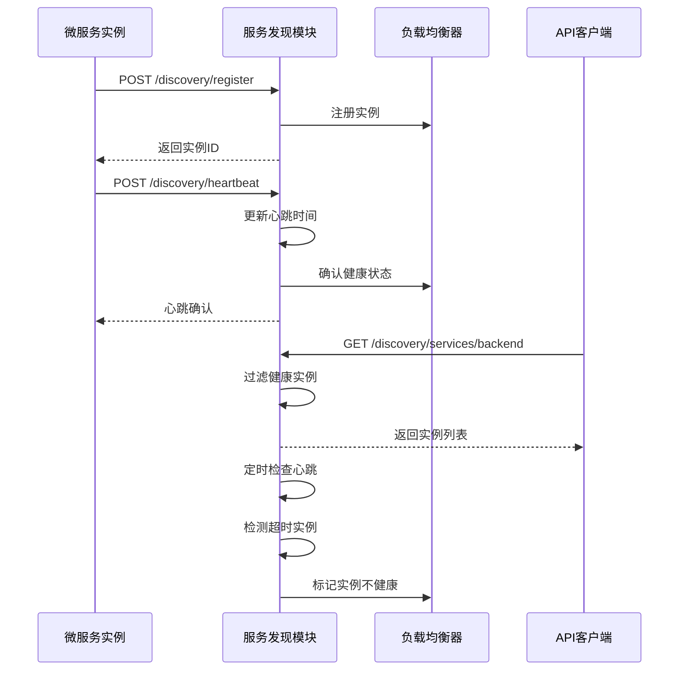
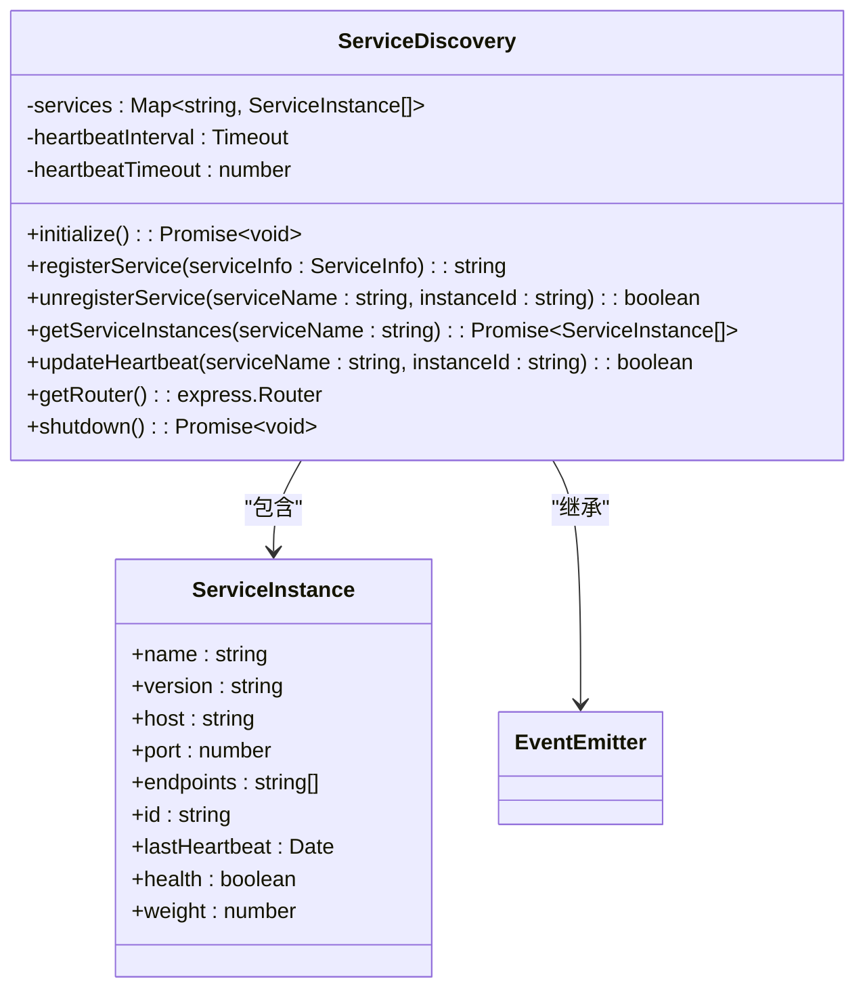
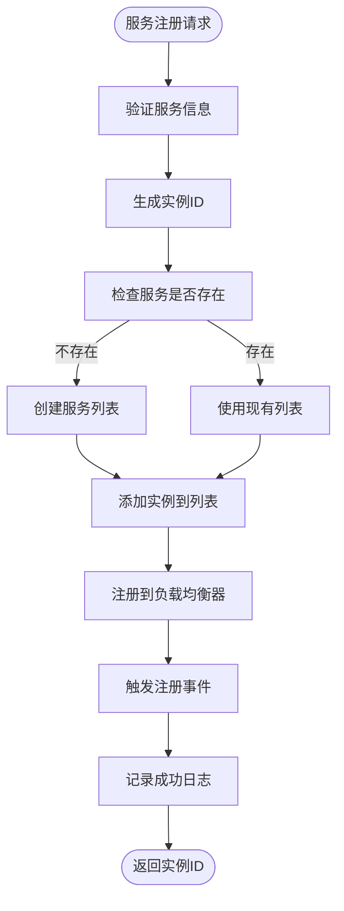
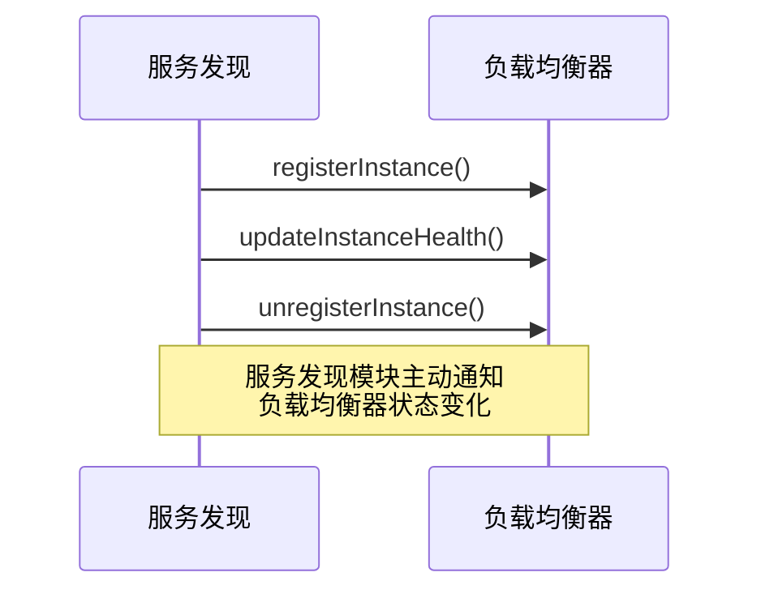
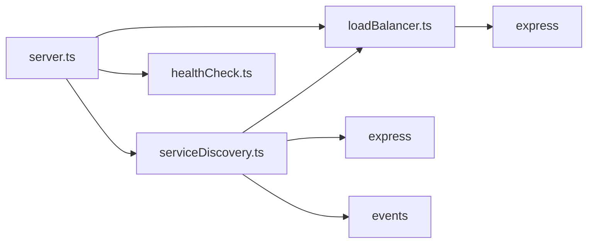

# 服务发现

<cite>
**本文档引用的文件**   
- [serviceDiscovery.ts](file://api-gateway/src/discovery/serviceDiscovery.ts)
- [loadBalancer.ts](file://api-gateway/src/load-balancing/loadBalancer.ts)
- [healthCheck.ts](file://api-gateway/src/health/healthCheck.ts)
- [.env](file://api-gateway/.env)
- [server.ts](file://api-gateway/src/server.ts)
- [router.ts](file://api-gateway/src/routing/router.ts)
- [README.md](file://api-gateway/README.md)
</cite>

## 目录
1. [引言](#引言)
2. [项目结构](#项目结构)
3. [核心组件](#核心组件)
4. [架构概述](#架构概述)
5. [详细组件分析](#详细组件分析)
6. [依赖分析](#依赖分析)
7. [性能考虑](#性能考虑)
8. [故障排除指南](#故障排除指南)
9. [结论](#结论)

## 引言
本文档详细描述了服务发现模块如何实现后端微服务的动态注册与发现机制。重点说明`serviceDiscovery.ts`如何通过事件驱动方式从注册中心获取`backend`、`decision-service`等实例列表，以及其与负载均衡模块的协作关系。文档涵盖服务健康检查集成、故障节点剔除策略、缓存机制与刷新间隔配置等内容。

## 项目结构
API网关服务位于`api-gateway`目录下，采用TypeScript构建。服务发现模块位于`api-gateway/src/discovery/`目录中，核心文件为`serviceDiscovery.ts`。该模块与负载均衡模块(`load-balancing`)、健康检查模块(`health`)紧密协作，共同实现微服务架构中的服务治理功能。

```mermaid
graph TB
subgraph "API网关"
SD[服务发现模块]
LB[负载均衡模块]
HC[健康检查模块]
RM[路由管理器]
end
SD --> LB : "注册实例"
SD --> HC : "提供服务状态"
RM --> SD : "查询服务实例"
LB --> RM : "提供目标实例"
```

**图示来源**
- [serviceDiscovery.ts](file://api-gateway/src/discovery/serviceDiscovery.ts#L1-L268)
- [loadBalancer.ts](file://api-gateway/src/load-balancing/loadBalancer.ts#L1-L229)
- [router.ts](file://api-gateway/src/routing/router.ts#L1-L140)

**本节来源**
- [serviceDiscovery.ts](file://api-gateway/src/discovery/serviceDiscovery.ts#L1-L268)
- [project_structure](file://#L1-L500)

## 核心组件
服务发现模块的核心是`ServiceDiscovery`类，它实现了微服务的注册、发现和心跳检测机制。该模块通过事件驱动方式与负载均衡器协同工作，当服务实例状态发生变化时，自动通知负载均衡器更新实例列表。

服务发现模块与`loadBalancer`模块深度集成，在服务注册、注销和健康状态变化时，自动同步状态。这种设计确保了负载均衡器始终拥有最新的服务实例信息，从而实现高效的请求分发。

**本节来源**
- [serviceDiscovery.ts](file://api-gateway/src/discovery/serviceDiscovery.ts#L21-L268)
- [loadBalancer.ts](file://api-gateway/src/load-balancing/loadBalancer.ts#L16-L229)

## 架构概述
服务发现模块采用事件驱动架构，通过Express路由接口接收服务注册、心跳和查询请求。模块内部维护一个服务实例映射表，记录所有注册服务的实例信息，包括健康状态、最后心跳时间等关键属性。



**图示来源**
- [serviceDiscovery.ts](file://api-gateway/src/discovery/serviceDiscovery.ts#L205-L256)
- [server.ts](file://api-gateway/src/server.ts#L68-L71)

## 详细组件分析

### 服务发现机制分析
服务发现模块实现了完整的微服务生命周期管理，包括服务注册、心跳维持、服务发现和自动注销功能。模块通过REST API接口暴露这些功能，使微服务能够动态地加入和退出系统。

#### 类图


**图示来源**
- [serviceDiscovery.ts](file://api-gateway/src/discovery/serviceDiscovery.ts#L21-L268)

#### 服务注册流程


**图示来源**
- [serviceDiscovery.ts](file://api-gateway/src/discovery/serviceDiscovery.ts#L40-L79)

**本节来源**
- [serviceDiscovery.ts](file://api-gateway/src/discovery/serviceDiscovery.ts#L1-L268)

### 负载均衡协作分析
服务发现模块与负载均衡模块通过直接的模块引用进行协作。当服务实例状态发生变化时，服务发现模块会直接调用负载均衡器的相关方法，确保两个模块之间的状态同步。

#### 协作时序图


**图示来源**
- [serviceDiscovery.ts](file://api-gateway/src/discovery/serviceDiscovery.ts#L65-L74)
- [loadBalancer.ts](file://api-gateway/src/load-balancing/loadBalancer.ts#L22-L50)

**本节来源**
- [serviceDiscovery.ts](file://api-gateway/src/discovery/serviceDiscovery.ts#L3-L4)
- [loadBalancer.ts](file://api-gateway/src/load-balancing/loadBalancer.ts#L1-L12)

## 依赖分析
服务发现模块依赖于多个核心组件，包括负载均衡器、Express框架和Node.js的EventEmitter。这些依赖关系构成了服务发现功能的基础架构。



**图示来源**
- [serviceDiscovery.ts](file://api-gateway/src/discovery/serviceDiscovery.ts#L1-L3)
- [server.ts](file://api-gateway/src/server.ts#L6-L13)

**本节来源**
- [serviceDiscovery.ts](file://api-gateway/src/discovery/serviceDiscovery.ts#L1-L268)
- [server.ts](file://api-gateway/src/server.ts#L1-L105)

## 性能考虑
服务发现模块在设计时考虑了性能因素，采用内存数据结构存储服务实例信息，确保服务查询的高效性。心跳检查间隔设置为10秒，平衡了实时性和系统开销。

模块通过预注册机制初始化已知服务，避免了系统启动时的服务发现延迟。同时，服务实例的健康状态缓存减少了对后端服务的频繁探测，降低了网络开销。

## 故障排除指南
当服务发现功能出现问题时，可通过以下方式进行调试和排查：

1. 检查服务发现API端点`/discovery/status`获取当前服务状态
2. 验证微服务是否正确发送注册请求和心跳
3. 检查负载均衡器状态`/load-balancer/status`确认实例同步情况
4. 查看API网关日志中的服务发现相关输出

服务发现模块提供了详细的日志输出，包括服务注册、心跳超时和实例注销等关键事件，便于问题定位和系统监控。

**本节来源**
- [serviceDiscovery.ts](file://api-gateway/src/discovery/serviceDiscovery.ts#L244-L246)
- [server.ts](file://api-gateway/src/server.ts#L60-L61)

## 结论
服务发现模块实现了微服务架构中的核心服务治理功能，通过事件驱动的方式与负载均衡器紧密协作，确保了系统的高可用性和弹性。模块设计简洁高效，支持服务的动态注册与发现，为AI农业微服务系统提供了可靠的基础设施支持。