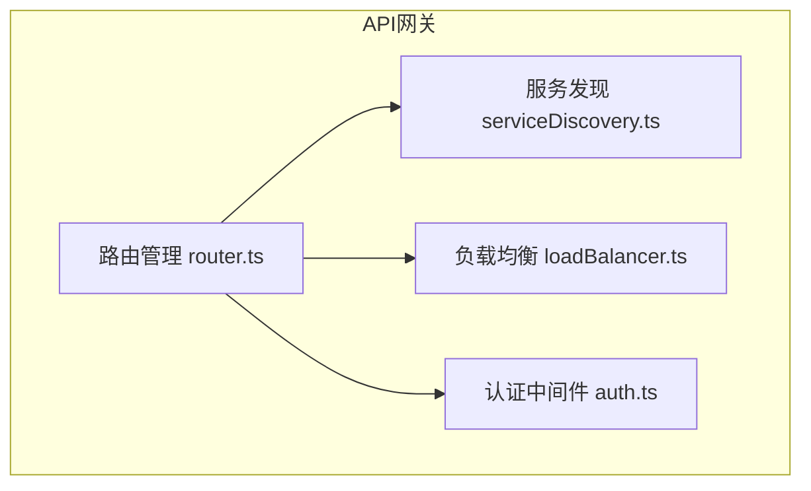
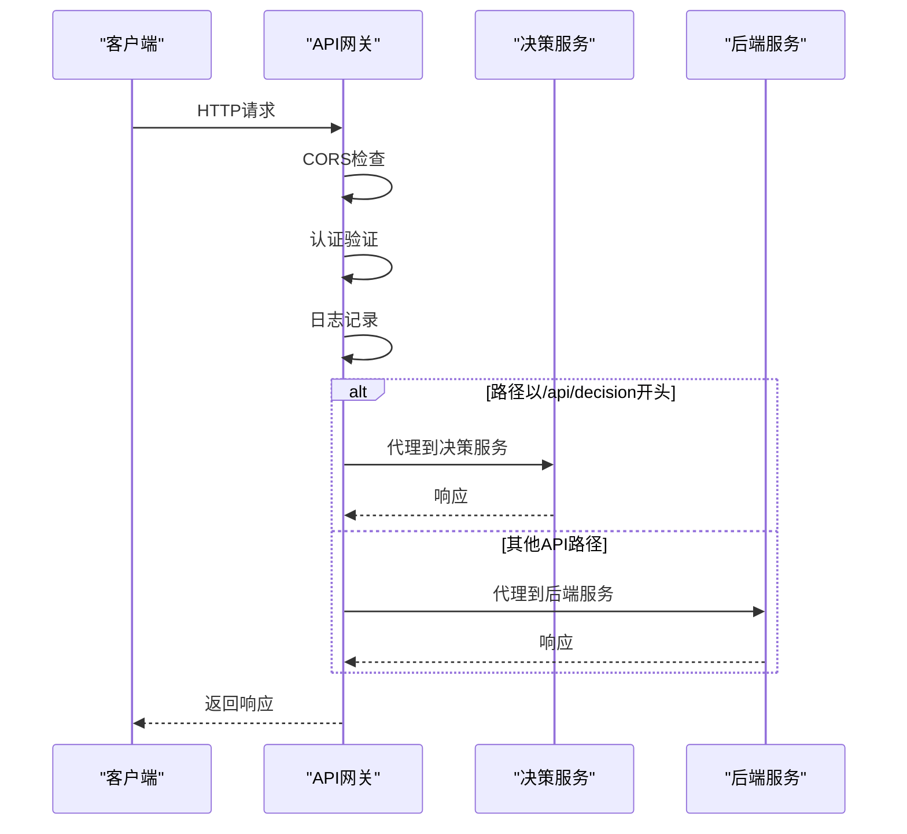
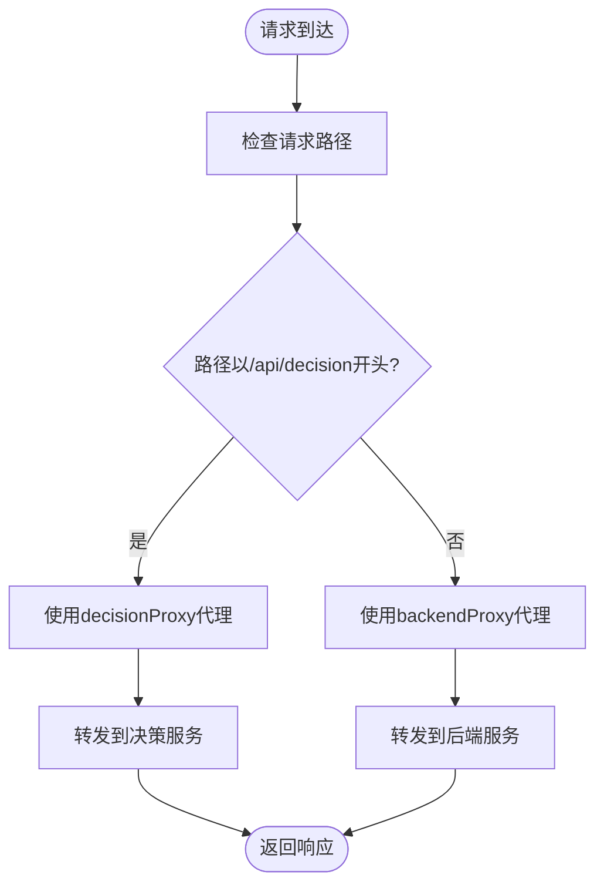
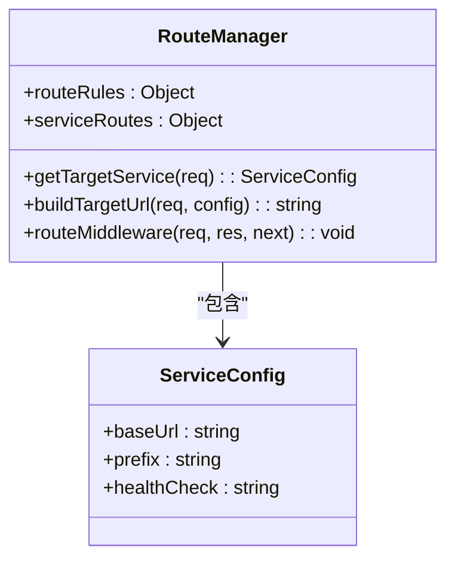
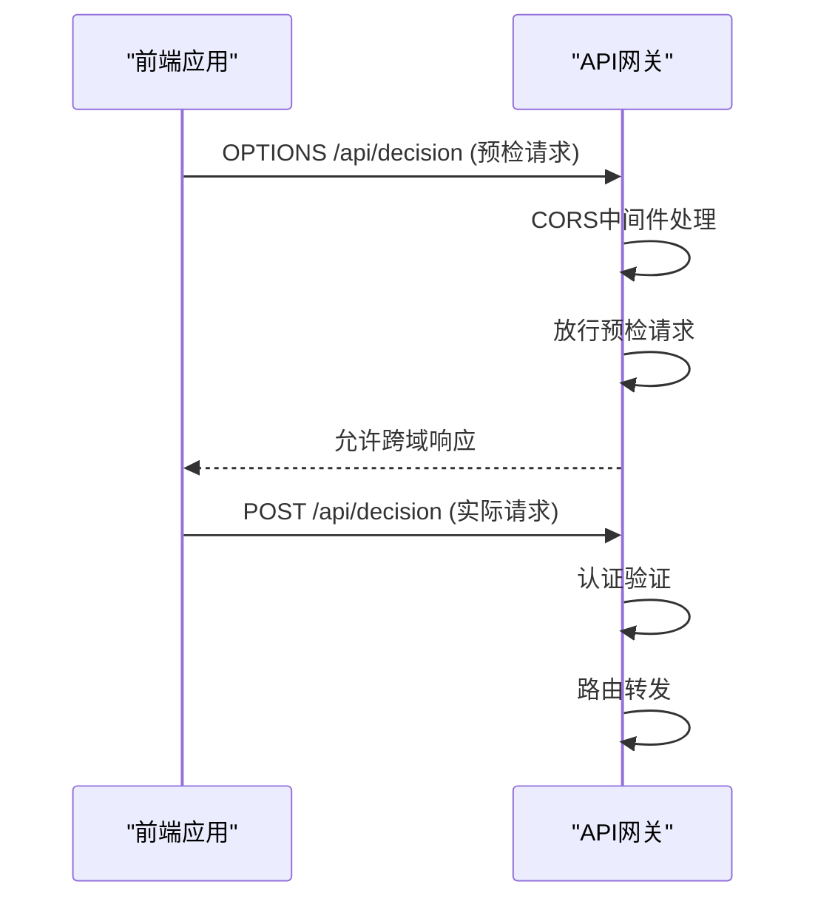
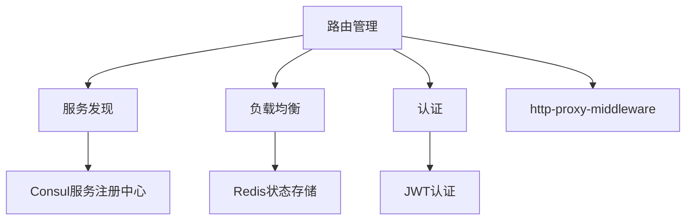

# 路由管理

<cite>
**本文档引用的文件**  
- [router.ts](file://api-gateway/src/routing/router.ts)
- [server.ts](file://api-gateway/src/server.ts)
- [auth.ts](file://api-gateway/src/middleware/auth.ts)
- [serviceDiscovery.ts](file://api-gateway/src/discovery/serviceDiscovery.ts)
- [loadBalancer.ts](file://api-gateway/src/load-balancing/loadBalancer.ts)
- [decision.py](file://decision-service/src/api/routes/decision.py)
- [simple_app.py](file://backend/src/api/simple_app.py)
</cite>

## 目录
1. [项目结构](#项目结构)
2. [核心组件](#核心组件)
3. [架构概述](#架构概述)
4. [详细组件分析](#详细组件分析)
5. [依赖分析](#依赖分析)
6. [性能考虑](#性能考虑)
7. [故障排除指南](#故障排除指南)

## 项目结构

API网关的路由模块位于`api-gateway/src/routing/`目录下，核心文件为`router.ts`。该模块基于Express.js框架实现，通过`http-proxy-middleware`将请求转发至后端微服务。路由配置与服务发现、负载均衡、认证等模块紧密集成，形成完整的API网关功能。

**图示来源**  
- [router.ts](file://api-gateway/src/routing/router.ts)
- [serviceDiscovery.ts](file://api-gateway/src/discovery/serviceDiscovery.ts)
- [loadBalancer.ts](file://api-gateway/src/load-balancing/loadBalancer.ts)
- [auth.ts](file://api-gateway/src/middleware/auth.ts)

**本节来源**  
- [api-gateway/src/routing/router.ts](file://api-gateway/src/routing/router.ts)
- [api-gateway/src/server.ts](file://api-gateway/src/server.ts)

## 核心组件

路由模块的核心是`router.ts`文件中定义的路由管理器，它实现了基于Express.js的路由注册机制和路径匹配规则。通过`routeRules`配置对象定义了不同API路径与后端服务的映射关系，并使用`http-proxy-middleware`创建代理中间件来转发请求。

路由管理器提供了`getTargetService`方法用于根据请求路径查找目标服务配置，`buildTargetUrl`方法用于构建目标URL，以及`routeMiddleware`作为核心路由中间件处理请求转发逻辑。系统支持将请求转发至`decision-service`和`backend`两个主要微服务。

**本节来源**  
- [router.ts](file://api-gateway/src/routing/router.ts#L1-L140)

## 架构概述

API网关采用分层架构设计，路由模块作为核心组件与其他功能模块协同工作。当客户端请求到达网关时，首先经过安全中间件（CORS、helmet）、限流和压缩处理，然后进入自定义中间件链（日志、指标、认证），最后由路由中间件根据路径规则将请求代理到相应的后端服务。

**图示来源**  
- [server.ts](file://api-gateway/src/server.ts#L58-L72)
- [router.ts](file://api-gateway/src/routing/router.ts#L110-L123)

## 详细组件分析

### 路由注册机制分析

路由模块通过在`server.ts`中调用`app.use()`方法注册路由中间件。对于`/api/decision`路径，使用`decisionProxy`代理到决策服务；对于其他API路径，使用`backendProxy`代理到后端服务。这种设计实现了基于路径前缀的路由分发。

**图示来源**  
- [server.ts](file://api-gateway/src/server.ts#L63-L64)
- [router.ts](file://api-gateway/src/routing/router.ts#L42-L59)

**本节来源**  
- [server.ts](file://api-gateway/src/server.ts#L58-L72)
- [router.ts](file://api-gateway/src/routing/router.ts#L42-L59)

### 路径匹配规则分析

路由模块实现了精确的路径匹配规则，通过`routeRules`对象定义了从API路径到服务配置的映射。系统采用前缀匹配策略，更具体的路由规则（如`/api/decision`）放在前面，确保正确匹配。当没有找到匹配规则时，默认路由到后端服务。

**图示来源**  
- [router.ts](file://api-gateway/src/routing/router.ts#L24-L39)
- [router.ts](file://api-gateway/src/routing/router.ts#L85-L97)

**本节来源**  
- [router.ts](file://api-gateway/src/routing/router.ts#L24-L97)

### 动态路由与参数解析

虽然当前实现主要基于静态路径前缀匹配，但系统设计支持动态路由扩展。通过`getTargetService`方法的路径前缀检查机制，可以轻松添加新的动态路由规则。参数解析由后端服务负责，API网关主要处理路径级别的路由转发。

对于需要参数解析的场景，可以通过扩展`routeRules`配置或添加专门的路由处理器来实现。当前系统已具备处理复杂路由模式的基础架构，只需在配置中添加相应的正则表达式或通配符支持即可。

**本节来源**  
- [router.ts](file://api-gateway/src/routing/router.ts#L89-L93)

### 前缀路由配置

系统采用基于前缀的路由配置方式，所有API路径均以`/api`为根前缀。决策服务使用`/api/decision`作为专用前缀，其他服务共享`/api`前缀下的不同子路径。这种设计实现了清晰的API版本控制和功能划分。

在`server.ts`中，通过`app.use('/api/decision', ...)`和`app.use('/api', ...)`的挂载方式实现了前缀路由配置。这种分层挂载机制确保了路由规则的有序执行和正确的路径处理。

**本节来源**  
- [server.ts](file://api-gateway/src/server.ts#L63-L64)
- [router.ts](file://api-gateway/src/routing/router.ts#L26-L38)

### API版本控制集成

系统通过路径前缀实现了API版本控制。`/api/decision`路径明确标识了决策服务的API版本，而`/api`路径下的其他端点也遵循类似的版本控制模式。这种基于URL的版本控制方式简单有效，便于客户端识别和使用不同版本的API。

未来扩展时，可以通过添加版本号到路径前缀（如`/api/v1/decision`）来实现更精细的版本管理。当前架构已为这种扩展做好了准备，只需修改路由配置和代理目标即可。

**本节来源**  
- [server.ts](file://api-gateway/src/server.ts#L63)
- [decision.py](file://decision-service/src/api/routes/decision.py#L9)

### 跨域请求处理

API网关通过`cors`中间件处理跨域请求。在`server.ts`中配置了允许所有来源（`origin: '*'`）、支持多种HTTP方法和特定请求头的CORS策略。这使得前端应用可以无缝调用API网关提供的服务。

CORS配置还特别处理了预检请求（OPTIONS），确保复杂请求能够正常通过。认证中间件也专门放行了OPTIONS请求，避免预检请求被认证拦截。

**图示来源**  
- [server.ts](file://api-gateway/src/server.ts#L32-L36)
- [auth.ts](file://api-gateway/src/middleware/auth.ts#L9-L11)

**本节来源**  
- [server.ts](file://api-gateway/src/server.ts#L29-L36)
- [auth.ts](file://api-gateway/src/middleware/auth.ts#L9-L11)

## 依赖分析

路由模块依赖多个核心组件协同工作。它依赖`serviceDiscovery`模块获取后端服务实例信息，依赖`loadBalancer`模块实现负载均衡，依赖`auth`模块进行请求认证。这些依赖关系在`server.ts`的导入和初始化过程中明确体现。

**图示来源**  
- [server.ts](file://api-gateway/src/server.ts#L6-L13)
- [package.json](file://api-gateway/package.json#L27-L41)

**本节来源**  
- [server.ts](file://api-gateway/src/server.ts#L6-L13)
- [package.json](file://api-gateway/package.json)

## 性能考虑

路由模块在性能方面进行了多项优化。使用`http-proxy-middleware`实现了高效的HTTP代理，避免了不必要的请求解析开销。日志中间件采用非阻塞方式记录请求完成事件，减少对请求处理的影响。

系统还实现了请求限流（rate limiting），防止恶意或过量请求影响服务稳定性。压缩中间件对响应进行压缩，减少网络传输开销。这些性能优化措施共同确保了API网关的高吞吐量和低延迟。

**本节来源**  
- [server.ts](file://api-gateway/src/server.ts#L39-L45)
- [server.ts](file://api-gateway/src/server.ts#L48)
- [logging.ts](file://api-gateway/src/middleware/logging.ts)

## 故障排除指南

### 404未找到错误排查

当出现404错误时，首先检查请求路径是否符合路由规则。确保路径以`/api`或`/api/decision`开头。检查`routeRules`配置是否包含对应路径的映射。确认目标服务是否正常运行，可通过健康检查端点验证。

使用日志中间件查看请求处理流程，确认请求是否被正确路由。检查代理中间件的target配置是否正确指向后端服务地址。如果使用服务发现，验证服务注册信息是否正确。

**本节来源**  
- [router.ts](file://api-gateway/src/routing/router.ts#L89-L97)
- [error.ts](file://api-gateway/src/middleware/error.ts)

### 循环转发问题处理

循环转发通常由代理配置错误引起。检查`pathRewrite`配置是否正确，避免路径重写导致的无限循环。确保`changeOrigin`设置正确，防止主机头问题。验证目标服务的响应是否包含正确的重定向头。

在`http-proxy-middleware`配置中设置适当的日志级别（如`logLevel: 'debug'`），监控代理过程中的请求和响应。检查是否有中间件修改了请求路径导致意外的路由行为。

**本节来源**  
- [router.ts](file://api-gateway/src/routing/router.ts#L46-L47)
- [router.ts](file://api-gateway/src/routing/router.ts#L56-L57)

### 性能优化建议

1. **缓存路由查找结果**：对于频繁访问的路由，可以缓存`getTargetService`的查找结果，减少路径匹配开销。
2. **连接池管理**：配置代理中间件的连接池参数，复用后端连接，减少TCP握手开销。
3. **异步日志写入**：将日志写入改为异步操作，避免阻塞请求处理线程。
4. **静态资源缓存**：对于API文档等静态资源，添加适当的缓存头，减少网关处理压力。
5. **监控和告警**：集成Prometheus监控，设置请求延迟和错误率告警，及时发现性能问题。

**本节来源**  
- [server.ts](file://api-gateway/src/server.ts#L10-L11)
- [router.ts](file://api-gateway/src/routing/router.ts#L48-L49)
- [logging.ts](file://api-gateway/src/middleware/logging.ts)