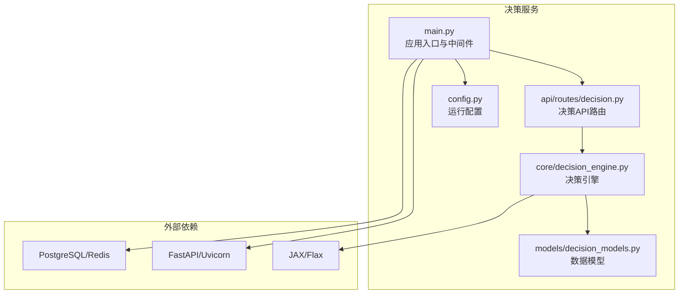
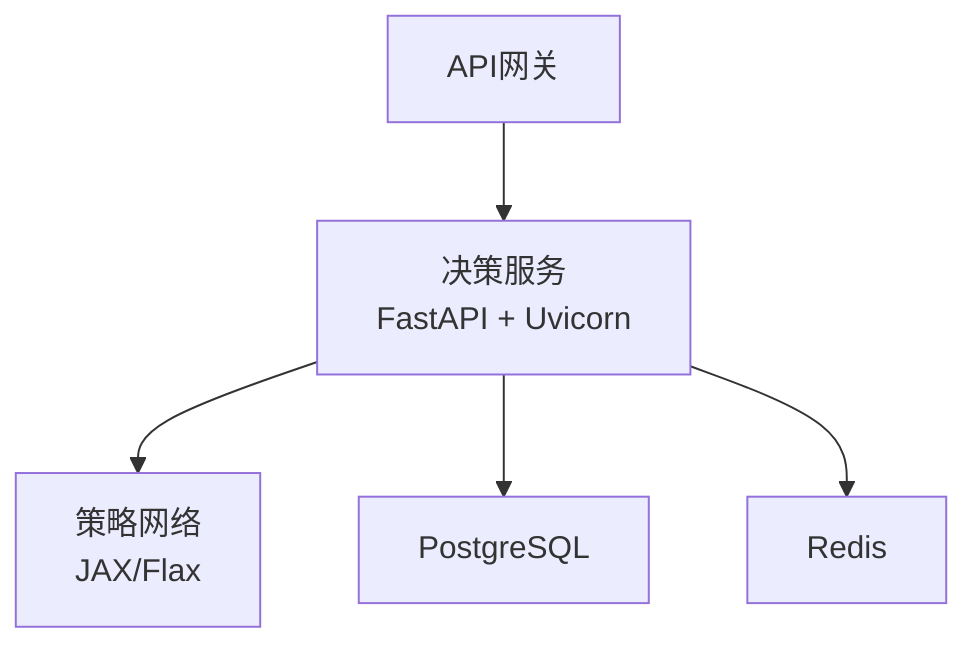
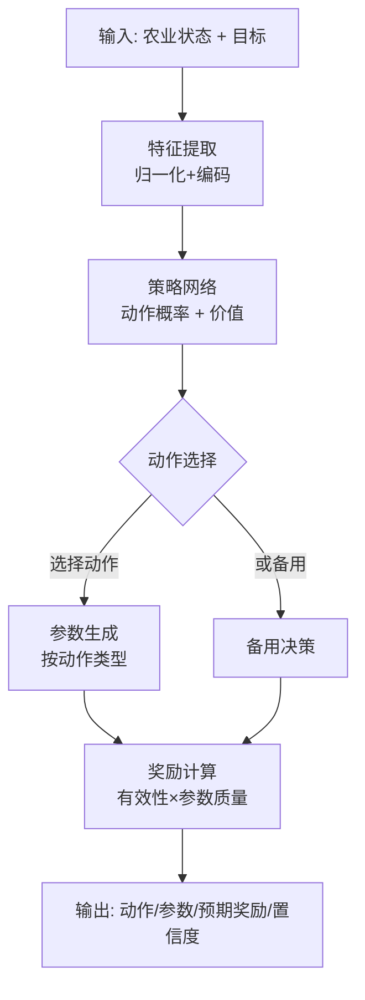
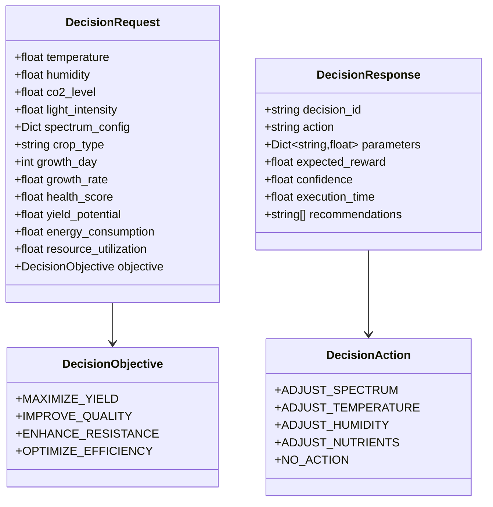
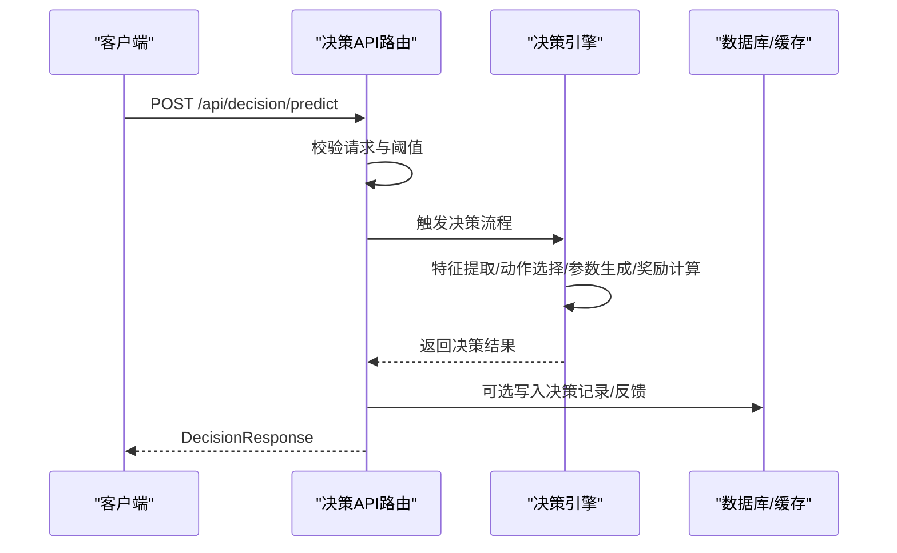
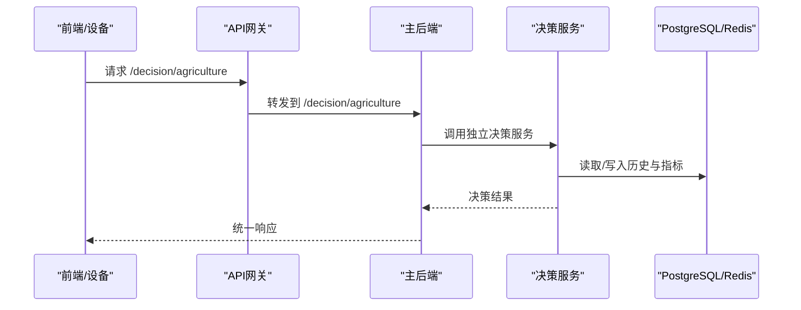
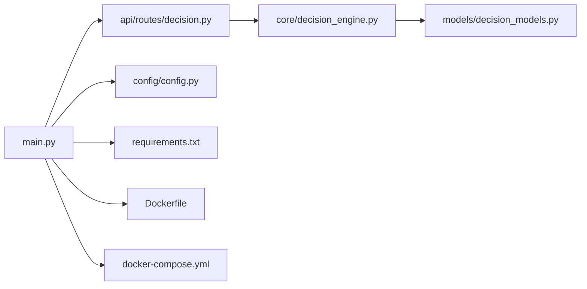

# 决策服务

<cite>
**本文引用的文件**
- [decision-engine.py](file://decision-service/src/core/decision_engine.py)
- [decision-models.py](file://decision-service/src/models/decision_models.py)
- [decision-route.py](file://decision-service/src/api/routes/decision.py)
- [main.py](file://decision-service/src/main.py)
- [config.py](file://decision-service/src/config/config.py)
- [Dockerfile](file://decision-service/Dockerfile)
- [docker-compose.yml](file://decision-service/docker-compose.yml)
- [requirements.txt](file://decision-service/requirements.txt)
- [README.md](file://decision-service/README.md)
- [agriculture-decision-engine.py](file://backend/src/core/decision/agriculture_decision_engine.py)
- [backend-decision-route.py](file://backend/src/api/routes/decision.py)
</cite>

## 目录
1. [简介](#简介)
2. [项目结构](#项目结构)
3. [核心组件](#核心组件)
4. [架构总览](#架构总览)
5. [详细组件分析](#详细组件分析)
6. [依赖关系分析](#依赖关系分析)
7. [性能考虑](#性能考虑)
8. [故障排查指南](#故障排查指南)
9. [结论](#结论)
10. [附录](#附录)

## 简介
本文件面向独立部署的“决策服务”，聚焦其决策引擎算法实现、REST API 接口设计与微服务通信模式。文档重点说明：
- 决策引擎如何基于强化学习策略网络对农业环境状态进行建模，并输出动作与参数建议；
- REST API 的请求/响应格式、认证方式与错误码定义；
- 该服务如何与主后端及其他微服务协同工作；
- 独立部署、配置与性能调优的完整指南。

## 项目结构
决策服务采用模块化组织：核心引擎位于 src/core，API 路由位于 src/api/routes，应用入口与中间件位于 src/main.py，配置位于 src/config，容器化与编排位于根目录的 Dockerfile、docker-compose.yml 与 requirements.txt。

图表来源
- [main.py](file://decision-service/src/main.py#L1-L146)
- [config.py](file://decision-service/src/config/config.py#L1-L56)
- [decision-route.py](file://decision-service/src/api/routes/decision.py#L1-L121)
- [decision-engine.py](file://decision-service/src/core/decision_engine.py#L1-L397)
- [decision-models.py](file://decision-service/src/models/decision_models.py#L1-L145)

章节来源
- [README.md](file://decision-service/README.md#L1-L44)
- [Dockerfile](file://decision-service/Dockerfile#L1-L29)
- [docker-compose.yml](file://decision-service/docker-compose.yml#L1-L41)
- [requirements.txt](file://decision-service/requirements.txt#L1-L14)

## 核心组件
- 决策引擎（AgricultureRLPolicy + DecisionEngine）
  - 使用 JAX/Flax 构建策略网络，输出动作概率与价值估计；根据目标与状态特征生成动作参数与预期奖励。
- 数据模型（DecisionAction、DecisionObjective、DecisionResult 等）
  - 定义动作枚举、目标枚举、请求/响应模型与数据库 ORM 表结构。
- API 路由（/api/decision）
  - 提供健康检查、模型列表、预测与服务状态等端点。
- 应用入口与中间件（FastAPI + 中间件）
  - 生命周期管理、CORS、请求日志、异常处理、根路径与健康检查。
- 配置（Settings）
  - 主机、端口、数据库、Redis、CORS、超时、批处理限制、指标开关、API Key 等。

章节来源
- [decision-engine.py](file://decision-service/src/core/decision_engine.py#L1-L397)
- [decision-models.py](file://decision-service/src/models/decision_models.py#L1-L145)
- [decision-route.py](file://decision-service/src/api/routes/decision.py#L1-L121)
- [main.py](file://decision-service/src/main.py#L1-L146)
- [config.py](file://decision-service/src/config/config.py#L1-L56)

## 架构总览
决策服务作为独立微服务，通过 FastAPI 对外提供 REST API；内部使用 JAX/Flax 的策略网络进行推理；可选地对接 PostgreSQL 与 Redis 存储与缓存；通过 API Key 或网关鉴权接入主后端。

图表来源
- [main.py](file://decision-service/src/main.py#L1-L146)
- [decision-engine.py](file://decision-service/src/core/decision_engine.py#L1-L397)
- [docker-compose.yml](file://decision-service/docker-compose.yml#L1-L41)

## 详细组件分析

### 决策引擎算法实现
- 状态特征提取
  - 将温度、湿度、CO2、光照强度、光谱配置、作物类型、生长时间、生长速率、健康评分、产量潜力、能耗、资源利用率与目标编码归一化为固定维度向量。
- 策略网络
  - 使用两层 Dense + ReLU 的特征编码，分别输出动作概率分布与价值估计；动作数与后端一致。
- 动作选择与参数生成
  - 依据策略网络输出选择动作；按动作类型生成光谱、温度、湿度、营养液等参数调整建议。
- 奖励与置信度
  - 基于目标与动作有效性、参数合理性计算预期奖励；动作概率作为置信度来源。
- 备用逻辑
  - 当策略参数不可用时，采用基于目标的规则化决策，保证服务可用性。
- 性能指标
  - 维护奖励历史与决策计数，提供平均奖励、决策总数与近期成功率等指标。

图表来源
- [decision-engine.py](file://decision-service/src/core/decision_engine.py#L100-L397)

章节来源
- [decision-engine.py](file://decision-service/src/core/decision_engine.py#L1-L397)

### 数据模型与数据库
- 动作与目标枚举
  - 决策动作：调整光谱、温度、湿度、营养液、无动作；目标：最大化产量、提升品质、增强抗性、优化效率。
- 请求/响应模型
  - 决策请求包含环境参数、光谱配置、作物信息、系统状态与目标；响应包含决策ID、动作、参数、预期奖励、置信度、执行时间与建议。
- 数据库表
  - 决策记录表、决策反馈表、性能指标表，支持持久化与追踪。

图表来源
- [decision-models.py](file://decision-service/src/models/decision_models.py#L1-L145)

章节来源
- [decision-models.py](file://decision-service/src/models/decision_models.py#L1-L145)

### REST API 设计与认证
- 健康检查
  - GET /api/decision/health
  - 返回服务健康状态与服务名。
- 模型列表
  - GET /api/decision/models
  - 返回可用模型清单（名称、版本、状态、准确率）。
- 决策预测
  - POST /api/decision/predict
  - 请求体：input_data、model_type、confidence_threshold
  - 响应体：decision、confidence、reasoning、metadata
  - 错误：500 内部错误。
- 服务状态
  - GET /api/decision/status
  - 返回服务状态、版本、模型数量、运行时长等。
- 认证方式
  - 配置中提供 API Key，默认示例值需在生产中替换；建议通过网关统一鉴权。

图表来源
- [decision-route.py](file://decision-service/src/api/routes/decision.py#L1-L121)
- [decision-engine.py](file://decision-service/src/core/decision_engine.py#L100-L397)

章节来源
- [decision-route.py](file://decision-service/src/api/routes/decision.py#L1-L121)
- [config.py](file://decision-service/src/config/config.py#L1-L56)

### 微服务通信模式
- 与主后端协作
  - 主后端提供统一的 /decision 路由，内部通过决策集成管理器调用农业决策引擎；决策服务独立部署，主后端通过网关转发请求至决策服务。
- 与边缘/设备交互
  - 主后端将前端或设备上报的状态封装为 AgricultureState，决策服务负责生成动作参数并返回建议。
- 与基础设施
  - 通过 docker-compose 启动时依赖 PostgreSQL 与 Redis，便于持久化与异步任务。

图表来源
- [backend-decision-route.py](file://backend/src/api/routes/decision.py#L1-L200)
- [agriculture-decision-engine.py](file://backend/src/core/decision/agriculture_decision_engine.py#L1-L200)
- [docker-compose.yml](file://decision-service/docker-compose.yml#L1-L41)

章节来源
- [backend-decision-route.py](file://backend/src/api/routes/decision.py#L1-L200)
- [agriculture-decision-engine.py](file://backend/src/core/decision/agriculture_decision_engine.py#L1-L200)
- [docker-compose.yml](file://decision-service/docker-compose.yml#L1-L41)

## 依赖关系分析
- 框架与运行时
  - FastAPI + Uvicorn 提供高性能 ASGI 服务；JAX/Flax 提供策略网络推理；SQLAlchemy/Alembic 支持数据库迁移。
- 外部服务
  - PostgreSQL 用于持久化决策记录与指标；Redis 用于缓存与异步任务。
- 配置耦合
  - Settings 集中管理主机、端口、数据库、Redis、CORS、超时、批大小、指标开关与 API Key。

图表来源
- [main.py](file://decision-service/src/main.py#L1-L146)
- [decision-route.py](file://decision-service/src/api/routes/decision.py#L1-L121)
- [decision-engine.py](file://decision-service/src/core/decision_engine.py#L1-L397)
- [decision-models.py](file://decision-service/src/models/decision_models.py#L1-L145)
- [config.py](file://decision-service/src/config/config.py#L1-L56)
- [requirements.txt](file://decision-service/requirements.txt#L1-L14)
- [Dockerfile](file://decision-service/Dockerfile#L1-L29)
- [docker-compose.yml](file://decision-service/docker-compose.yml#L1-L41)

章节来源
- [requirements.txt](file://decision-service/requirements.txt#L1-L14)
- [config.py](file://decision-service/src/config/config.py#L1-L56)

## 性能考虑
- 推理性能
  - 使用 JAX/Flax 在 CPU 上进行快速张量运算；建议在生产环境中启用 GPU 加速（如可用）。
- 批处理与限流
  - 配置批大小限制与决策超时，避免单次请求阻塞；对高优先级任务设置更短超时。
- 缓存与持久化
  - 利用 Redis 缓存热点决策与模型参数；PostgreSQL 记录历史与指标，定期清理过期数据。
- 监控与指标
  - 开启指标采集，关注平均奖励、决策总数、近期成功率与平均执行时间，结合 Prometheus/Grafana 可视化。

[本节为通用指导，无需特定文件来源]

## 故障排查指南
- 健康检查
  - 通过 GET /api/decision/health 与 /health 验证服务存活；docker-compose 已内置健康检查。
- 日志与异常
  - 应用中间件记录请求与响应状态；全局异常处理器返回统一错误结构。
- 配置问题
  - 确认 .env 中 DATABASE_URL、REDIS_URL、API_KEY 等配置正确；必要时在 docker-compose 中覆盖。
- 依赖缺失
  - 确认 requirements.txt 依赖安装完成；Dockerfile 已包含系统编译依赖。

章节来源
- [decision-route.py](file://decision-service/src/api/routes/decision.py#L1-L121)
- [main.py](file://decision-service/src/main.py#L1-L146)
- [docker-compose.yml](file://decision-service/docker-compose.yml#L1-L41)

## 结论
决策服务以 JAX/Flax 策略网络为核心，提供稳定的农业参数优化决策能力；通过 FastAPI 提供清晰的 REST API，支持健康检查、模型列表、预测与服务状态查询；可独立部署并与主后端通过网关协同工作。建议在生产中启用 GPU、完善鉴权与监控，并结合缓存与数据库优化性能与可靠性。

[本节为总结性内容，无需特定文件来源]

## 附录

### 独立部署步骤
- 环境准备
  - 安装 Python 3.9+ 与 pip；拉取仓库后进入 decision-service 目录。
- 依赖安装
  - 使用 requirements.txt 安装依赖。
- 配置文件
  - 复制 .env.example 为 .env，按需修改数据库、Redis、CORS、API Key 等配置。
- 启动服务
  - 直接运行 Uvicorn 启动应用；或使用 Dockerfile 构建镜像并运行。
- 编排与依赖
  - 使用 docker-compose 同时启动决策服务、PostgreSQL 与 Redis。

章节来源
- [README.md](file://decision-service/README.md#L1-L44)
- [Dockerfile](file://decision-service/Dockerfile#L1-L29)
- [docker-compose.yml](file://decision-service/docker-compose.yml#L1-L41)
- [requirements.txt](file://decision-service/requirements.txt#L1-L14)

### API 端点一览
- GET /api/decision/health
  - 返回服务健康状态。
- GET /api/decision/models
  - 返回模型列表（名称、版本、状态、准确率）。
- POST /api/decision/predict
  - 请求体：input_data、model_type、confidence_threshold
  - 响应体：decision、confidence、reasoning、metadata
  - 错误：500 内部错误。
- GET /api/decision/status
  - 返回服务状态、版本、模型数量、运行时长等。

章节来源
- [decision-route.py](file://decision-service/src/api/routes/decision.py#L1-L121)

### 认证与安全
- API Key
  - 配置中提供 API Key 字段，默认示例值需替换；建议通过网关统一鉴权。
- CORS
  - 默认允许所有来源，生产环境建议限定白名单。

章节来源
- [config.py](file://decision-service/src/config/config.py#L1-L56)

### 数据模型字段说明
- 决策请求
  - 温度、湿度、CO2、光照强度、光谱配置、作物类型、生长时间、生长速率、健康评分、产量潜力、能耗、资源利用率、目标。
- 决策响应
  - 决策ID、动作、参数、预期奖励、置信度、执行时间、建议列表。

章节来源
- [decision-models.py](file://decision-service/src/models/decision_models.py#L87-L141)