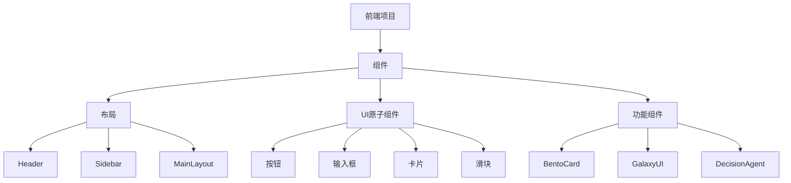
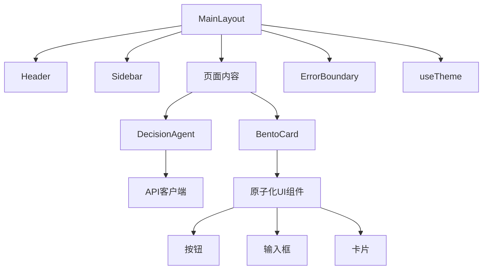
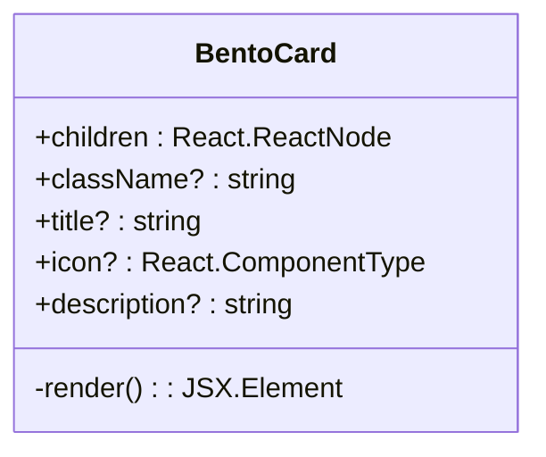
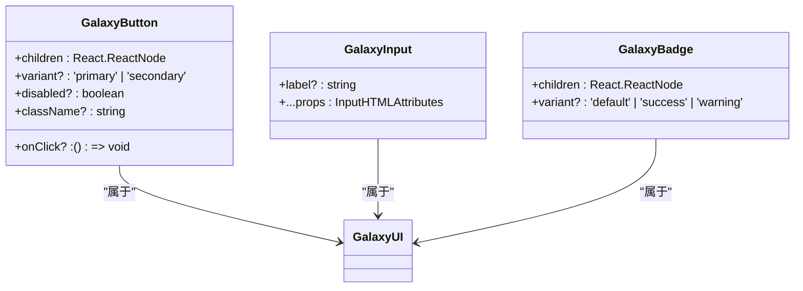
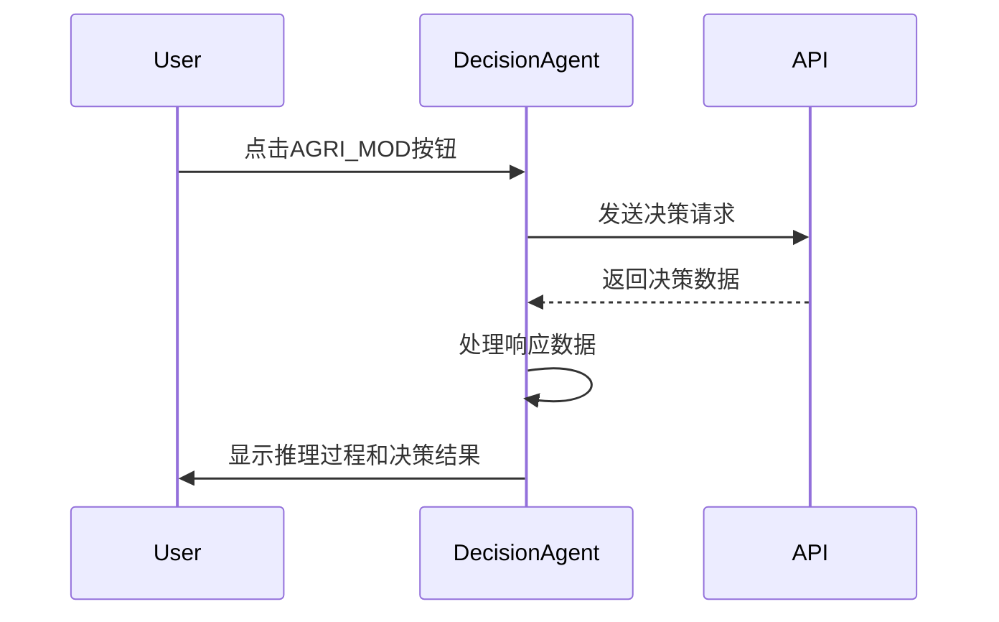
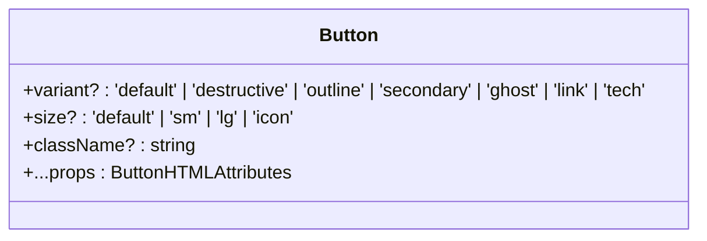
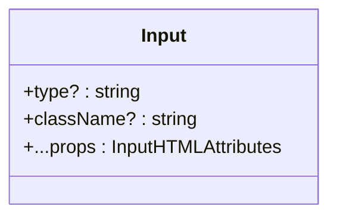
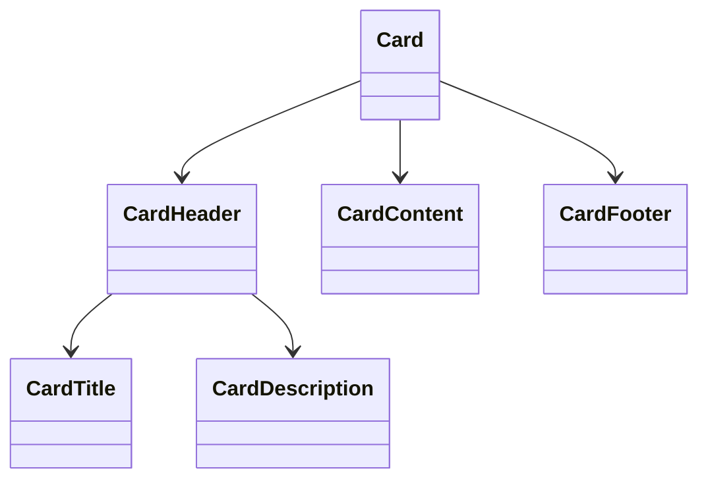
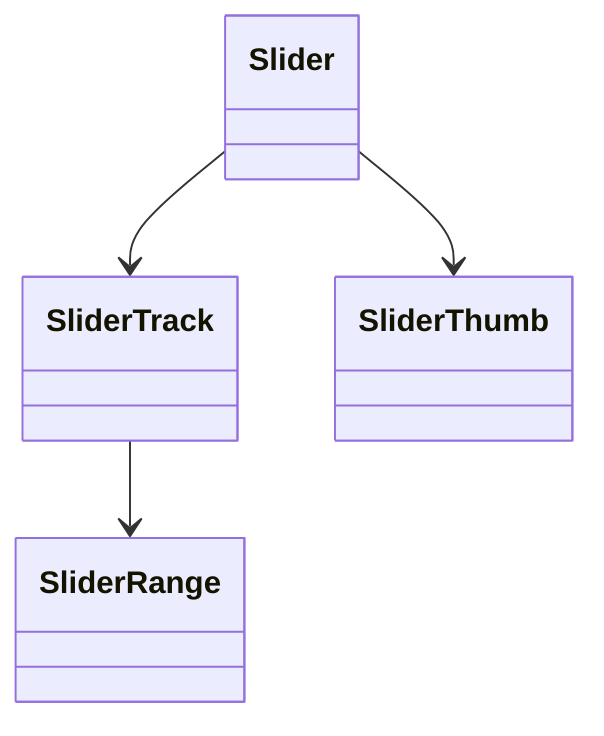
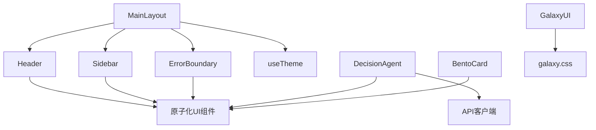

# UI组件体系

<cite>
**本文档引用的文件**   
- [BentoCard.tsx](file://frontend/src/components/ui/BentoCard.tsx)
- [GalaxyUI.tsx](file://frontend/src/components/GalaxyUI.tsx)
- [DecisionAgent.tsx](file://frontend/src/components/DecisionAgent.tsx)
- [Header.tsx](file://frontend/src/components/layout/Header.tsx)
- [Sidebar.tsx](file://frontend/src/components/layout/Sidebar.tsx)
- [MainLayout.tsx](file://frontend/src/components/layout/MainLayout.tsx)
- [ErrorBoundary.tsx](file://frontend/src/components/ErrorBoundary.tsx)
- [useTheme.tsx](file://frontend/src/hooks/useTheme.tsx)
- [button.tsx](file://frontend/src/components/ui/button.tsx)
- [input.tsx](file://frontend/src/components/ui/input.tsx)
- [card.tsx](file://frontend/src/components/ui/card.tsx)
- [slider.tsx](file://frontend/src/components/ui/slider.tsx)
- [Button.test.tsx](file://frontend/src/components/ui/Button.test.tsx)
- [Input.test.tsx](file://frontend/src/components/ui/Input.test.tsx)
- [Slider.test.tsx](file://frontend/src/components/ui/Slider.test.tsx)
- [galaxy.css](file://frontend/src/galaxy.css)
- [index.css](file://frontend/src/index.css)
</cite>

## 目录
1. [简介](#简介)
2. [项目结构](#项目结构)
3. [核心组件](#核心组件)
4. [架构概述](#架构概述)
5. [详细组件分析](#详细组件分析)
6. [依赖分析](#依赖分析)
7. [性能考虑](#性能考虑)
8. [故障排除指南](#故障排除指南)
9. [结论](#结论)

## 简介
本文档深入分析基于React 18与TypeScript构建的UI组件体系，重点阐述BentoCard、GalaxyUI、DecisionAgent等核心自定义组件的设计理念与复用机制。文档化布局组件（Header、Sidebar、MainLayout）的结构与响应式设计策略。详细说明原子化UI组件（按钮、输入框、图表等）的实现细节、Props接口定义、事件处理逻辑及可访问性支持。结合代码示例展示组件组合模式与主题定制能力（useTheme）。解释ErrorBoundary的错误捕获机制与容错设计。为前端开发者提供组件开发规范、测试策略（Button.test.tsx等）与最佳实践。

## 项目结构
该项目的前端部分采用模块化设计，组件被组织在`src/components`目录下，分为`layout`、`ui`和功能组件。布局组件（Header、Sidebar、MainLayout）负责整体页面结构，而`ui`目录包含原子化UI组件如按钮、输入框、卡片等。核心功能组件如BentoCard、GalaxyUI和DecisionAgent被单独放置，便于复用和维护。样式通过Tailwind CSS和自定义CSS模块（galaxy.css）实现，支持主题定制和响应式设计。

**图示来源**
- [Header.tsx](file://frontend/src/components/layout/Header.tsx)
- [Sidebar.tsx](file://frontend/src/components/layout/Sidebar.tsx)
- [MainLayout.tsx](file://frontend/src/components/layout/MainLayout.tsx)
- [button.tsx](file://frontend/src/components/ui/button.tsx)
- [input.tsx](file://frontend/src/components/ui/input.tsx)
- [card.tsx](file://frontend/src/components/ui/card.tsx)
- [slider.tsx](file://frontend/src/components/ui/slider.tsx)

**章节来源**
- [Header.tsx](file://frontend/src/components/layout/Header.tsx)
- [Sidebar.tsx](file://frontend/src/components/layout/Sidebar.tsx)
- [MainLayout.tsx](file://frontend/src/components/layout/MainLayout.tsx)

## 核心组件
本项目的核心组件包括BentoCard、GalaxyUI和DecisionAgent。BentoCard是一个可复用的卡片组件，支持标题、图标和描述，通过framer-motion实现悬停动画效果。GalaxyUI是一组遵循统一设计语言的UI组件集合，包括按钮、输入框、徽章等，通过CSS类实现一致的视觉风格。DecisionAgent是一个复杂的智能决策组件，模拟神经网络推理过程，提供实时决策支持。

**章节来源**
- [BentoCard.tsx](file://frontend/src/components/ui/BentoCard.tsx)
- [GalaxyUI.tsx](file://frontend/src/components/GalaxyUI.tsx)
- [DecisionAgent.tsx](file://frontend/src/components/DecisionAgent.tsx)

## 架构概述
系统采用分层架构，顶层为布局组件，中间层为功能组件，底层为原子化UI组件。MainLayout作为根布局，集成Header和Sidebar，提供导航和认证检查。功能组件如DecisionAgent通过API客户端与后端交互，原子化组件通过Props接口实现高度可配置性。主题系统通过useTheme钩子实现，支持暗色和亮色模式切换。

**图示来源**
- [MainLayout.tsx](file://frontend/src/components/layout/MainLayout.tsx)
- [DecisionAgent.tsx](file://frontend/src/components/DecisionAgent.tsx)
- [BentoCard.tsx](file://frontend/src/components/ui/BentoCard.tsx)
- [button.tsx](file://frontend/src/components/ui/button.tsx)
- [input.tsx](file://frontend/src/components/ui/input.tsx)
- [card.tsx](file://frontend/src/components/ui/card.tsx)
- [ErrorBoundary.tsx](file://frontend/src/components/ErrorBoundary.tsx)
- [useTheme.tsx](file://frontend/src/hooks/useTheme.tsx)

## 详细组件分析
### BentoCard 分析
BentoCard组件是一个现代化的卡片容器，支持丰富的视觉效果和交互。它使用framer-motion实现悬停动画，当用户将鼠标悬停在卡片上时，卡片会轻微上移并显示装饰性背景元素。组件通过Props接受标题、图标、描述和子内容，具有高度的可复用性。

**图示来源**
- [BentoCard.tsx](file://frontend/src/components/ui/BentoCard.tsx)

### GalaxyUI 分析
GalaxyUI是一组遵循统一设计系统的UI组件，包括按钮、输入框、徽章、进度条等。这些组件通过CSS类（如galaxy-button、galaxy-input）实现一致的视觉风格，支持主题定制和响应式设计。组件之间通过共享的CSS变量和动画实现协调的用户体验。

**图示来源**
- [GalaxyUI.tsx](file://frontend/src/components/GalaxyUI.tsx)
- [galaxy.css](file://frontend/src/galaxy.css)

### DecisionAgent 分析
DecisionAgent组件模拟了一个神经智能决策系统，提供实时决策支持。它通过API客户端与后端交互，获取决策数据，并在终端界面中显示推理过程和决策结果。组件使用framer-motion实现动画效果，包括消息的淡入淡出和加载状态的脉冲动画。

**图示来源**
- [DecisionAgent.tsx](file://frontend/src/components/DecisionAgent.tsx)
- [api-client.ts](file://frontend/src/lib/api-client.ts)

### 原子化UI组件分析
原子化UI组件是构建用户界面的基本单元，包括按钮、输入框、卡片、滑块等。这些组件通过Props接口实现高度可配置性，支持不同的变体、大小和状态。组件通过Tailwind CSS和自定义CSS类实现一致的视觉风格，支持主题定制和响应式设计。

#### 按钮组件
按钮组件支持多种变体（默认、危险、轮廓、次要、幽灵、链接、科技感）和大小（默认、小、大、图标），通过Props接口实现高度可配置性。

**图示来源**
- [button.tsx](file://frontend/src/components/ui/button.tsx)

#### 输入框组件
输入框组件提供基础的输入功能，支持占位符、禁用状态和自定义样式，通过Props接口继承原生输入属性。

**图示来源**
- [input.tsx](file://frontend/src/components/ui/input.tsx)

#### 卡片组件
卡片组件提供容器功能，支持头部、标题、描述、内容和页脚部分，通过组合式API实现灵活的布局。

**图示来源**
- [card.tsx](file://frontend/src/components/ui/card.tsx)

#### 滑块组件
滑块组件基于Radix UI实现，提供范围选择功能，支持自定义轨道、范围和滑块样式。

**图示来源**
- [slider.tsx](file://frontend/src/components/ui/slider.tsx)

**章节来源**
- [button.tsx](file://frontend/src/components/ui/button.tsx)
- [input.tsx](file://frontend/src/components/ui/input.tsx)
- [card.tsx](file://frontend/src/components/ui/card.tsx)
- [slider.tsx](file://frontend/src/components/ui/slider.tsx)

## 依赖分析
项目依赖关系清晰，布局组件依赖于原子化UI组件，功能组件依赖于布局组件和API服务。通过React的Context API实现状态管理，useAuth和useTheme等自定义钩子提供全局状态访问。组件之间通过Props传递数据和回调函数，实现松耦合和高内聚。

**图示来源**
- [MainLayout.tsx](file://frontend/src/components/layout/MainLayout.tsx)
- [Header.tsx](file://frontend/src/components/layout/Header.tsx)
- [Sidebar.tsx](file://frontend/src/components/layout/Sidebar.tsx)
- [ErrorBoundary.tsx](file://frontend/src/components/ErrorBoundary.tsx)
- [useTheme.tsx](file://frontend/src/hooks/useTheme.tsx)
- [DecisionAgent.tsx](file://frontend/src/components/DecisionAgent.tsx)
- [BentoCard.tsx](file://frontend/src/components/ui/BentoCard.tsx)
- [GalaxyUI.tsx](file://frontend/src/components/GalaxyUI.tsx)
- [galaxy.css](file://frontend/src/galaxy.css)

**章节来源**
- [MainLayout.tsx](file://frontend/src/components/layout/MainLayout.tsx)
- [Header.tsx](file://frontend/src/components/layout/Header.tsx)
- [Sidebar.tsx](file://frontend/src/components/layout/Sidebar.tsx)
- [ErrorBoundary.tsx](file://frontend/src/components/ErrorBoundary.tsx)
- [useTheme.tsx](file://frontend/src/hooks/useTheme.tsx)

## 性能考虑
组件体系在性能方面进行了优化，使用React.memo避免不必要的重新渲染，通过useCallback和useMemo优化回调函数和计算值。动画效果使用CSS过渡而非JavaScript，确保60fps的流畅体验。API请求通过React Query进行缓存和预取，减少网络延迟对用户体验的影响。

## 故障排除指南
当组件出现渲染错误时，ErrorBoundary会捕获错误并显示友好的错误界面，提供刷新页面的选项。开发人员可以通过浏览器控制台查看详细的错误信息。对于样式问题，应检查Tailwind CSS类名是否正确，以及自定义CSS是否被正确加载。对于交互问题，应检查事件处理函数是否正确绑定，以及状态更新是否按预期工作。

**章节来源**
- [ErrorBoundary.tsx](file://frontend/src/components/ErrorBoundary.tsx)

## 结论
该UI组件体系展示了现代前端开发的最佳实践，包括模块化设计、组件复用、主题定制和错误处理。通过合理的架构设计和代码组织，实现了高可维护性和可扩展性。建议在开发新功能时遵循现有模式，确保代码风格和用户体验的一致性。