# 前端架构

<cite>
**本文档中引用的文件**   
- [package.json](file://frontend/package.json)
- [vite.config.ts](file://frontend/vite.config.ts)
- [main.tsx](file://frontend/src/main.tsx)
- [App.tsx](file://frontend/src/App.tsx)
- [tailwind.config.js](file://frontend/tailwind.config.js)
- [BentoCard.tsx](file://frontend/src/components/ui/BentoCard.tsx)
- [GalaxyUI.tsx](file://frontend/src/components/GalaxyUI.tsx)
- [MainLayout.tsx](file://frontend/src/components/layout/MainLayout.tsx)
- [useAuth.tsx](file://frontend/src/hooks/useAuth.tsx)
- [useEventSource.ts](file://frontend/src/hooks/useEventSource.ts)
- [api-client.ts](file://frontend/src/lib/api-client.ts)
- [api.ts](file://frontend/src/services/api.ts)
- [query-client.ts](file://frontend/src/lib/query-client.ts)
- [Dashboard.tsx](file://frontend/src/pages/Dashboard.tsx)
- [AIControl.tsx](file://frontend/src/pages/AIControl.tsx)
- [Agriculture.tsx](file://frontend/src/pages/Agriculture.tsx)
</cite>

## 目录
1. [项目结构](#项目结构)
2. [核心架构](#核心架构)
3. [组件体系](#组件体系)
4. [状态管理](#状态管理)
5. [路由机制](#路由机制)
6. [API集成](#api集成)
7. [页面结构](#页面结构)
8. [开发工作流](#开发工作流)

## 项目结构

前端项目采用基于React 18与TypeScript的现代前端架构，使用Vite作为构建工具，结合Tailwind CSS进行样式化。项目结构清晰，按功能模块组织，主要包含组件、页面、服务、钩子和工具库等目录。

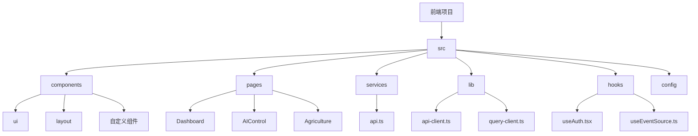

**图源**
- [package.json](file://frontend/package.json)
- [vite.config.ts](file://frontend/vite.config.ts)
- [tailwind.config.js](file://frontend/tailwind.config.js)

## 核心架构

前端应用采用现代化的React架构，基于React 18的并发特性，结合TypeScript提供类型安全。使用Vite作为构建工具，提供快速的开发服务器启动和热模块替换。应用整体架构分为UI层、状态管理层、服务层和数据获取层。

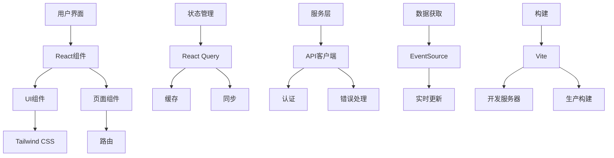

**图源**
- [main.tsx](file://frontend/src/main.tsx)
- [App.tsx](file://frontend/src/App.tsx)
- [lib/query-client.ts](file://frontend/src/lib/query-client.ts)

## 组件体系

前端应用构建了一套完整的UI组件体系，基于React 18与TypeScript，采用原子设计原则。组件体系包括基础UI组件、布局组件和高级自定义组件。

### BentoCard组件

BentoCard是一个高级UI组件，用于创建具有悬停效果和装饰性背景的卡片。它使用framer-motion实现动画效果，支持标题、图标、描述和自定义内容。

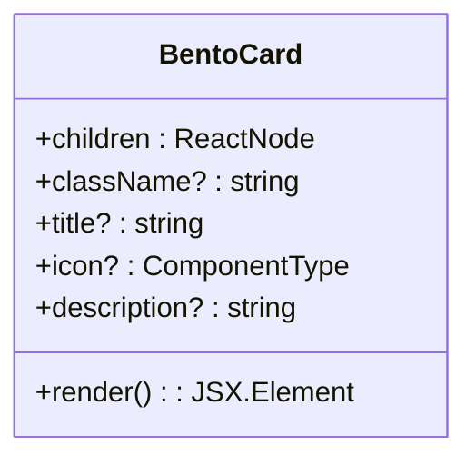

**图源**
- [BentoCard.tsx](file://frontend/src/components/ui/BentoCard.tsx)

### GalaxyUI组件库

GalaxyUI是一套自定义UI组件库，提供了一系列具有统一视觉风格的组件，包括卡片、按钮、输入框、徽章、进度条、模态框、统计卡片、开关、头像、标签、时间线、加载器和通知等。

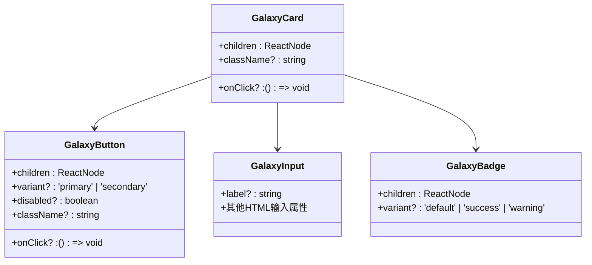

**图源**
- [GalaxyUI.tsx](file://frontend/src/components/GalaxyUI.tsx)

## 状态管理

前端应用采用多层状态管理策略，结合React Context和React Query，实现全局状态和数据状态的有效管理。

### 认证状态管理

使用React Context实现认证状态管理，通过AuthProvider提供认证上下文，包含用户信息、登录、登出和认证状态等。

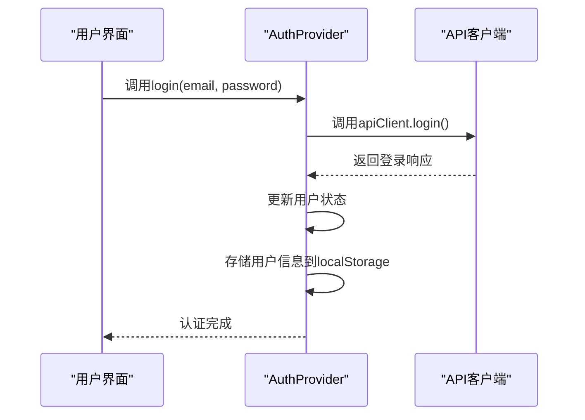

**图源**
- [useAuth.tsx](file://frontend/src/hooks/useAuth.tsx)

### 数据状态管理

使用React Query进行数据获取和状态管理，提供数据缓存、自动刷新、错误处理和持久化等功能。通过自定义hooks封装数据查询逻辑。

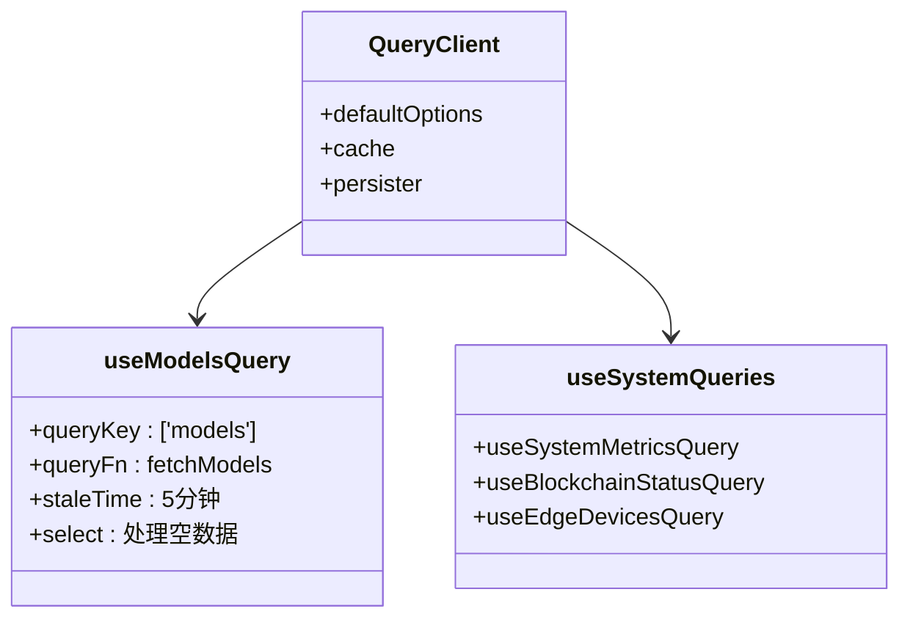

**图源**
- [query-client.ts](file://frontend/src/lib/query-client.ts)
- [useModelsQuery.ts](file://frontend/src/hooks/useModelsQuery.ts)

## 路由机制

前端应用使用React Router DOM实现路由管理，采用懒加载策略优化性能。路由配置包含登录页面和受保护的业务路由，通过MainLayout包装业务页面。

```mermaid
graph TD
A[Router] --> B[AuthProvider]
B --> C[QueryClientProvider]
C --> D[ErrorBoundary]
D --> E[Suspense]
E --> F[Routes]
F --> G[/login]
F --> H[/]
F --> I[/agriculture]
F --> J[/models]
F --> K[/models/:id]
F --> L[/inference]
F --> M[/blockchain]
F --> N[/federated]
F --> O[/monitoring]
F --> P[/performance]
F --> Q[/settings]
F --> R[/community]
F --> S[/ai-control]
H --> T[MainLayout]
I --> T
J --> T
K --> T
L --> T
M --> T
N --> T
O --> T
P --> T
Q --> T
R --> T
S --> T
```

**图源**
- [App.tsx](file://frontend/src/App.tsx)

## API集成

前端应用通过API客户端与后端API网关通信，实现认证处理、错误拦截和实时数据更新等功能。

### API客户端实现

API客户端基于Axios构建，包含请求拦截器和响应拦截器，自动注入API Key和Bearer Token，统一处理401/403错误并重定向到登录页面。

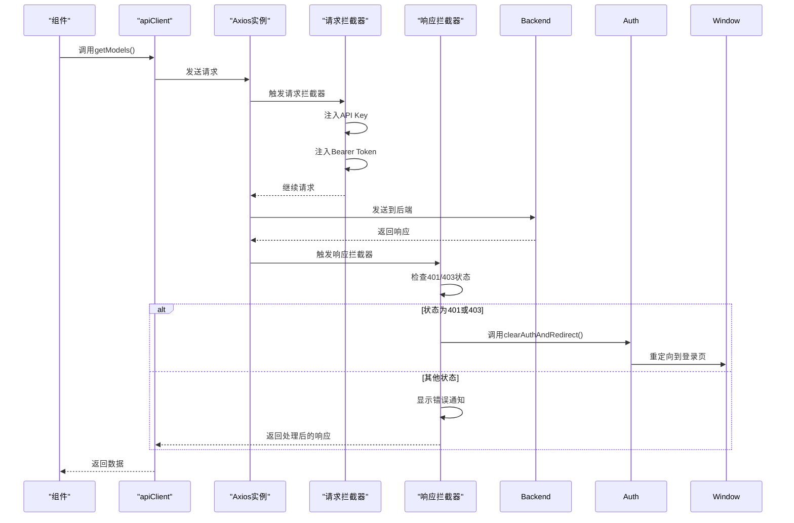

**图源**
- [api-client.ts](file://frontend/src/lib/api-client.ts)
- [api.ts](file://frontend/src/services/api.ts)

### 实时数据更新

使用EventSource实现服务器发送事件(SSE)的实时数据更新，通过useEventSource自定义Hook封装SSE逻辑，支持自动重连、数据更新策略和与React Query集成。

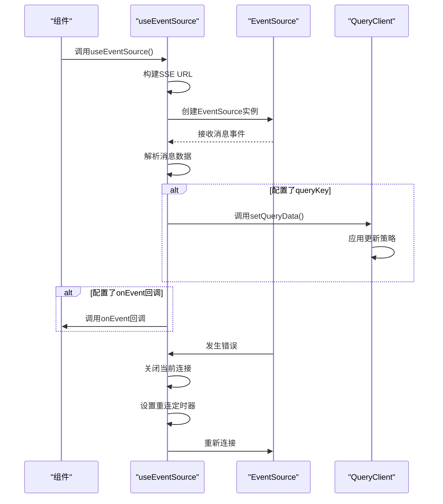

**图源**
- [useEventSource.ts](file://frontend/src/hooks/useEventSource.ts)

## 页面结构

前端应用包含多个功能页面，每个页面都有特定的用户交互流程和数据展示需求。

### Dashboard页面

Dashboard页面是系统概览页面，展示关键指标、AI代理、遥测数据和系统日志。使用BentoCard组件构建网格布局，通过多个数据查询获取系统状态。

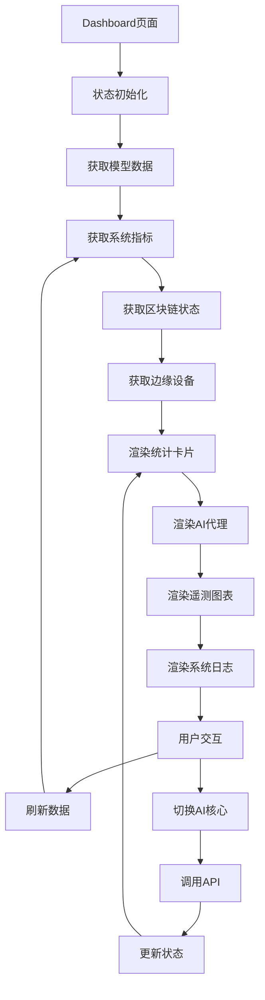

**图源**
- [Dashboard.tsx](file://frontend/src/pages/Dashboard.tsx)

### AIControl页面

AIControl页面是AI控制中心，提供设备编排、模式预设、视觉智能和JEPA预测等功能。支持语音控制和摄像头集成。

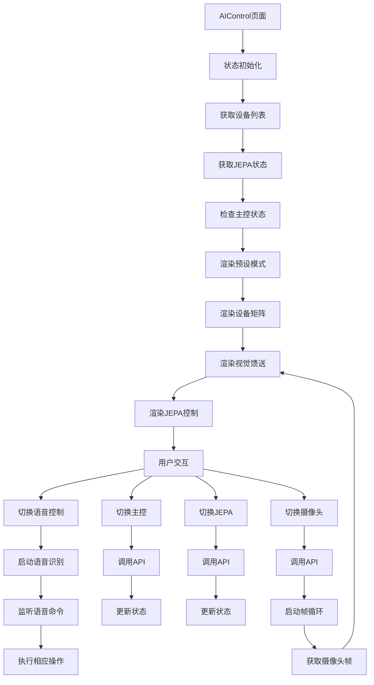

**图源**
- [AIControl.tsx](file://frontend/src/pages/AIControl.tsx)

### Agriculture页面

Agriculture页面是农业智能页面，提供作物选择、环境设置、光配方生成、生长预测和种植计划等功能。

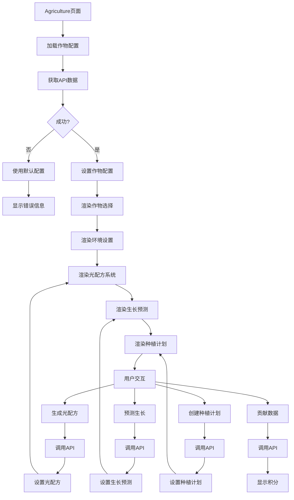

**图源**
- [Agriculture.tsx](file://frontend/src/pages/Agriculture.tsx)

## 开发工作流

前端应用提供完整的开发、测试与构建工作流，基于现代前端工具链。

### 开发环境

使用Vite提供快速的开发服务器，支持热模块替换和代理配置。开发服务器监听3000端口，代理API请求到后端服务。

```mermaid
flowchart LR
A[开发服务器] --> B[Vite]
B --> C[端口3000]
C --> D[代理配置]
D --> E[/api -> http://localhost:8002]
B --> F[TypeScript支持]
B --> G[React插件]
B --> H[别名@ -> src]
B --> I[测试配置]
```

**图源**
- [vite.config.ts](file://frontend/vite.config.ts)

### 构建配置

使用Vite进行生产构建，输出到dist目录，生成源映射文件。构建过程包括TypeScript类型检查和代码打包。

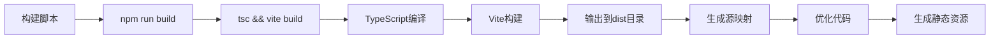

**图源**
- [package.json](file://frontend/package.json)
- [vite.config.ts](file://frontend/vite.config.ts)

### 测试配置

使用Vitest进行单元测试和UI测试，配置JSDOM环境和测试工具库。支持测试覆盖率和UI测试界面。

```mermaid
flowchart LR
A[测试脚本] --> B[npm run test]
B --> C[Vitest]
C --> D[JSDOM环境]
D --> E[测试文件]
E --> F[@testing-library]
F --> G[用户事件]
G --> H[断言]
A --> I[npm run test:ui]
I --> J[Vitest UI]
J --> K[浏览器界面]
```

**图源**
- [package.json](file://frontend/package.json)
- [vite.config.ts](file://frontend/vite.config.ts)