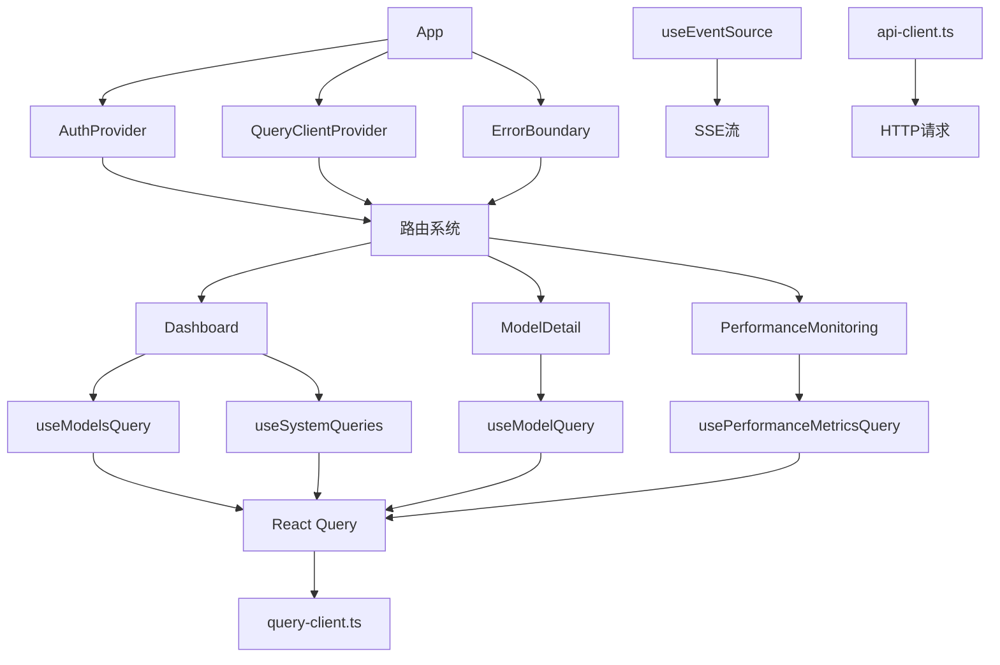
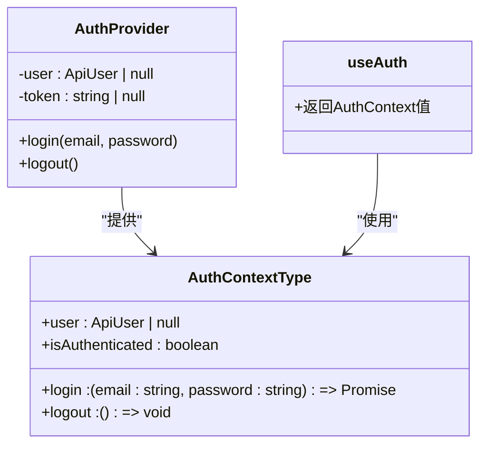
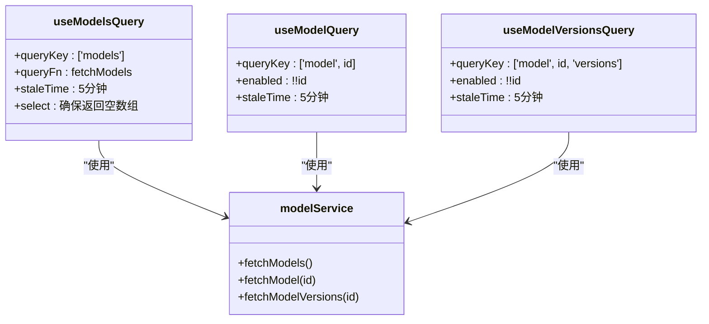
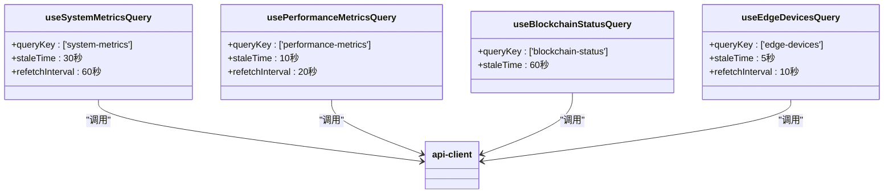
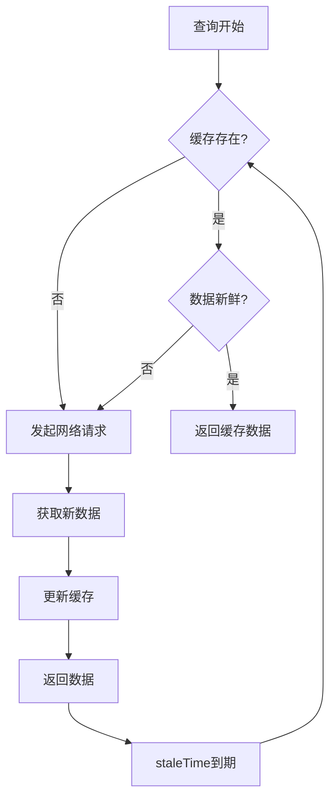
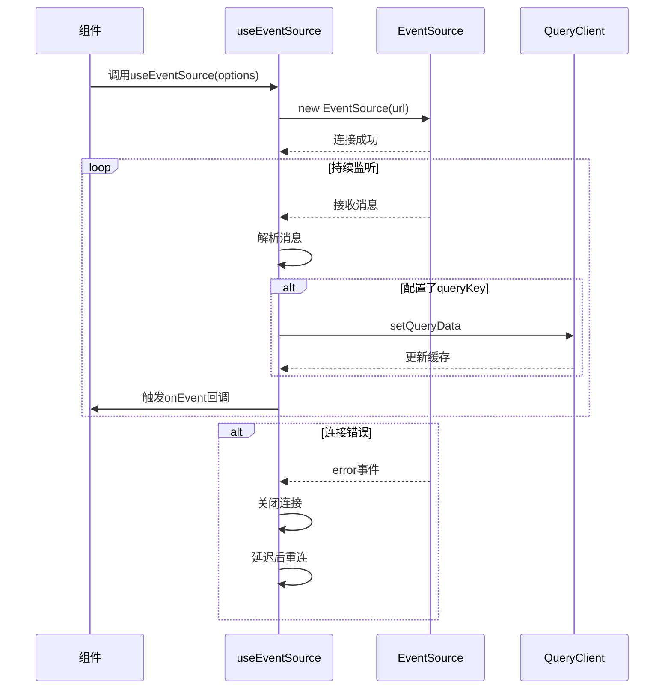
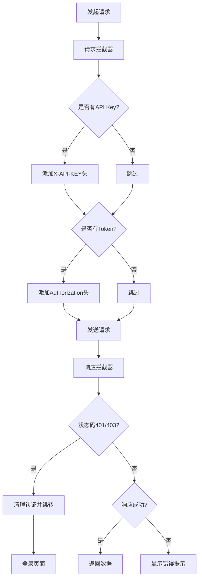

# 状态与数据流管理

<cite>
**本文档引用的文件**  
- [useAuth.tsx](file://frontend/src/hooks/useAuth.tsx)
- [useModelsQuery.ts](file://frontend/src/hooks/useModelsQuery.ts)
- [useSystemQueries.ts](file://frontend/src/hooks/useSystemQueries.ts)
- [useEventSource.ts](file://frontend/src/hooks/useEventSource.ts)
- [api.ts](file://frontend/src/services/api.ts)
- [api-client.ts](file://frontend/src/lib/api-client.ts)
- [query-client.ts](file://frontend/src/lib/query-client.ts)
- [modelService.ts](file://frontend/src/services/modelService.ts)
- [App.tsx](file://frontend/src/App.tsx)
- [Dashboard.tsx](file://frontend/src/pages/Dashboard.tsx)
- [ModelDetail.tsx](file://frontend/src/pages/ModelDetail.tsx)
- [PerformanceMonitoring.tsx](file://frontend/src/pages/PerformanceMonitoring.tsx)
</cite>

## 目录
1. [简介](#简介)
2. [状态管理架构概览](#状态管理架构概览)
3. [核心状态管理Hooks](#核心状态管理hooks)
4. [基于React Query的数据获取与缓存](#基于react-query的数据获取与缓存)
5. [实时数据流处理](#实时数据流处理)
6. [API服务层封装](#api服务层封装)
7. [最佳实践与性能优化](#最佳实践与性能优化)
8. [常见问题与解决方案](#常见问题与解决方案)
9. [结论](#结论)

## 简介

本项目前端应用采用现代化的React状态管理架构，结合React Context、React Query和自定义Hooks，实现了高效、可维护的状态管理。系统通过`useAuth`管理用户认证状态，利用`useModelsQuery`和`useSystemQueries`等自定义Hooks封装数据获取逻辑，通过React Query提供强大的缓存、自动刷新和错误处理机制。同时，`useEventSource`Hook处理实时数据流，确保决策监控和性能指标的实时性。API服务层通过`api-client.ts`进行统一封装，实现请求拦截、认证令牌管理和错误统一处理。

**Section sources**
- [App.tsx](file://frontend/src/App.tsx#L1-L131)
- [main.tsx](file://frontend/src/main.tsx#L1-L11)

## 状态管理架构概览

前端应用的状态管理架构采用分层设计，核心组件包括：

1. **全局状态管理**：通过React Context实现，主要由`AuthProvider`提供用户认证状态
2. **数据获取与缓存**：基于React Query实现，提供查询、缓存、自动刷新和错误重试功能
3. **实时数据流**：通过`useEventSource`Hook处理SSE（Server-Sent Events）流
4. **API服务层**：统一的API客户端封装，处理请求拦截、认证和错误处理

架构通过`App.tsx`中的组件树集成，`AuthProvider`和`QueryClientProvider`作为顶层提供者，为整个应用提供状态和数据获取能力。



**Diagram sources**
- [App.tsx](file://frontend/src/App.tsx#L1-L131)
- [query-client.ts](file://frontend/src/lib/query-client.ts#L1-L26)

**Section sources**
- [App.tsx](file://frontend/src/App.tsx#L1-L131)
- [query-client.ts](file://frontend/src/lib/query-client.ts#L1-L26)

## 核心状态管理Hooks

### useAuth Hook

`useAuth`是基于React Context实现的认证状态管理Hook，负责用户登录、登出和认证状态的管理。它使用`localStorage`持久化用户信息和令牌，并在组件卸载时自动清理。



**Diagram sources**
- [useAuth.tsx](file://frontend/src/hooks/useAuth.tsx#L1-L95)

**Section sources**
- [useAuth.tsx](file://frontend/src/hooks/useAuth.tsx#L1-L95)

### useModelsQuery Hook

`useModelsQuery`是一组基于React Query的自定义Hooks，用于管理模型相关的数据获取。它封装了模型列表、模型详情和模型版本的查询逻辑。



**Diagram sources**
- [useModelsQuery.ts](file://frontend/src/hooks/useModelsQuery.ts#L1-L34)
- [modelService.ts](file://frontend/src/services/modelService.ts#L1-L44)

**Section sources**
- [useModelsQuery.ts](file://frontend/src/hooks/useModelsQuery.ts#L1-L34)
- [modelService.ts](file://frontend/src/services/modelService.ts#L1-L44)

### useSystemQueries Hook

`useSystemQueries`包含多个系统级查询Hook，用于获取系统指标、性能数据、区块链状态等。每个Hook都配置了适当的缓存和刷新策略。



**Diagram sources**
- [useSystemQueries.ts](file://frontend/src/hooks/useSystemQueries.ts#L1-L118)

**Section sources**
- [useSystemQueries.ts](file://frontend/src/hooks/useSystemQueries.ts#L1-L118)

## 基于React Query的数据获取与缓存

### 查询键设计

系统采用语义化的查询键设计，确保缓存的准确性和可维护性。查询键遵循以下模式：

- 单一实体：`['entity', id]`
- 实体集合：`['entities']`
- 实体关系：`['entity', id, 'related']`
- 系统指标：`['system-metrics']`

这种设计使得缓存管理更加直观，同时也便于手动失效特定查询。

### 缓存策略

React Query的缓存策略在`query-client.ts`中全局配置：



**Diagram sources**
- [query-client.ts](file://frontend/src/lib/query-client.ts#L1-L26)

### 自动刷新机制

系统根据不同数据的实时性需求配置了差异化的自动刷新策略：

| 查询Hook | 缓存时间 | 刷新间隔 | 适用场景 |
|---------|--------|--------|--------|
| useSystemMetricsQuery | 30秒 | 60秒 | 系统指标 |
| usePerformanceMetricsQuery | 10秒 | 20秒 | 性能监控 |
| useEdgeDevicesQuery | 5秒 | 10秒 | 边缘设备状态 |
| useModelsQuery | 5分钟 | 无 | 模型列表 |

### 错误重试机制

React Query默认配置了1次重试，在`query-client.ts`中通过`retry: 1`设置。对于关键操作，可以在具体查询中覆盖此配置。

**Section sources**
- [query-client.ts](file://frontend/src/lib/query-client.ts#L1-L26)
- [useSystemQueries.ts](file://frontend/src/hooks/useSystemQueries.ts#L1-L118)

## 实时数据流处理

### useEventSource Hook

`useEventSource`是一个通用的SSE（Server-Sent Events）订阅Hook，支持自动重连和与React Query集成。它提供了灵活的数据更新策略，包括替换、追加和自定义合并。



**Diagram sources**
- [useEventSource.ts](file://frontend/src/hooks/useEventSource.ts#L1-L147)

### 数据更新策略

`useEventSource`支持多种数据更新策略：

- **replace**：直接替换现有数据（默认）
- **append**：将新数据追加到现有数组
- **自定义函数**：提供自定义的合并逻辑

同时支持去重和保留最近N条记录的功能，通过`dedupeBy`和`keepLast`参数配置。

**Section sources**
- [useEventSource.ts](file://frontend/src/hooks/useEventSource.ts#L1-L147)

## API服务层封装

### 请求拦截与认证

`api-client.ts`通过Axios拦截器实现统一的请求处理：



**Diagram sources**
- [api-client.ts](file://frontend/src/lib/api-client.ts#L1-L66)

### 错误统一处理

响应拦截器实现了统一的错误处理机制：

1. **认证失效**：401/403状态码自动清理认证信息并重定向到登录页
2. **网络异常**：显示"网络异常，请检查连接"
3. **服务器错误**：显示"服务器错误(5xx)"
4. **客户端错误**：显示具体错误信息

同时使用`react-hot-toast`提供用户友好的错误提示。

### API客户端封装

`api.ts`中的`ApiClient`类封装了所有API调用，提供类型安全的接口。每个方法都返回标准化的`ApiResponse`格式，包含`success`、`data`和`error`字段。

**Section sources**
- [api-client.ts](file://frontend/src/lib/api-client.ts#L1-L66)
- [api.ts](file://frontend/src/services/api.ts#L1-L1673)

## 最佳实践与性能优化

### 选择性订阅

通过React Query的`enabled`选项实现选择性订阅，避免不必要的网络请求：

```typescript
const { data } = useModelQuery(id, {
  enabled: !!id // 仅当id存在时才发起请求
});
```

### 缓存优化

- **持久化缓存**：使用`@tanstack/react-query-persist-client`将查询缓存持久化到`localStorage`
- **合理设置staleTime**：根据数据更新频率设置适当的缓存新鲜时间
- **手动失效**：在数据变更后手动失效相关查询，确保数据一致性

### 性能监控

在`PerformanceMonitoring.tsx`中，系统通过高频查询（每10秒）监控关键性能指标，并提供优化建议。

**Section sources**
- [useModelsQuery.ts](file://frontend/src/hooks/useModelsQuery.ts#L1-L34)
- [useSystemQueries.ts](file://frontend/src/hooks/useSystemQueries.ts#L1-L118)
- [query-client.ts](file://frontend/src/lib/query-client.ts#L1-L26)
- [PerformanceMonitoring.tsx](file://frontend/src/pages/PerformanceMonitoring.tsx#L1-L527)

## 常见问题与解决方案

### 状态不一致

**问题**：用户登出后，部分组件仍显示旧状态。

**解决方案**：
1. 确保`AuthProvider`包裹整个应用
2. 在`clearAuthAndRedirect`中同步清理`localStorage`
3. 使用React Query的`invalidateQueries`失效相关查询

### 数据刷新延迟

**问题**：数据更新后UI没有及时反映。

**解决方案**：
1. 检查`staleTime`设置是否过长
2. 在数据变更后手动调用`refetch`
3. 对于实时性要求高的数据，使用更短的`refetchInterval`

### 内存泄漏

**问题**：组件卸载后仍收到SSE消息。

**解决方案**：
1. 在`useEffect`的清理函数中关闭`EventSource`
2. 清理定时器
3. 确保`useEventSource`的`enabled`选项正确设置

**Section sources**
- [useAuth.tsx](file://frontend/src/hooks/useAuth.tsx#L1-L95)
- [useEventSource.ts](file://frontend/src/hooks/useEventSource.ts#L1-L147)
- [Dashboard.tsx](file://frontend/src/pages/Dashboard.tsx#L1-L320)

## 结论

本项目的状态管理架构设计合理，通过React Context、React Query和自定义Hooks的组合，实现了高效、可维护的状态管理。认证状态通过`useAuth`统一管理，数据获取通过React Query提供强大的缓存和刷新机制，实时数据通过`useEventSource`处理。API服务层的统一封装确保了请求的一致性和安全性。建议继续保持当前架构，并根据实际使用情况优化缓存策略和错误处理机制。