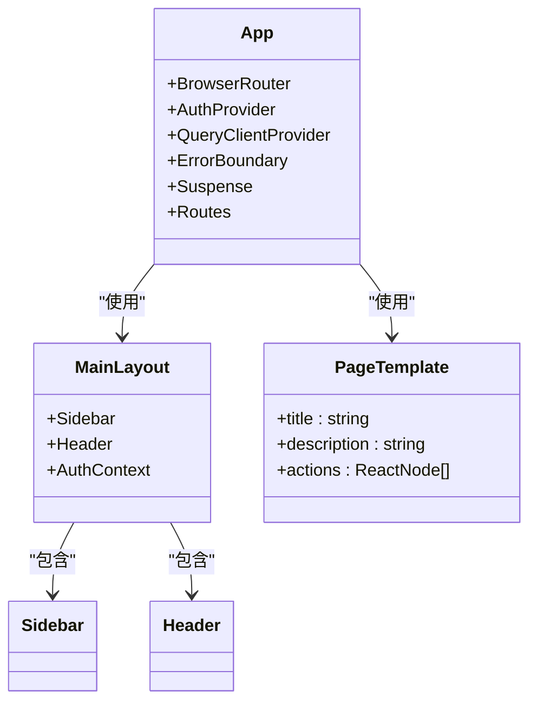

# 页面结构与路由机制

<cite>
**本文档引用的文件**   
- [App.tsx](file://frontend/src/App.tsx)
- [MainLayout.tsx](file://frontend/src/components/layout/MainLayout.tsx)
- [Sidebar.tsx](file://frontend/src/components/layout/Sidebar.tsx)
- [Header.tsx](file://frontend/src/components/layout/Header.tsx)
- [PageTemplate.tsx](file://frontend/src/components/PageTemplate.tsx)
- [Dashboard.tsx](file://frontend/src/pages/Dashboard.tsx)
- [AIControl.tsx](file://frontend/src/pages/AIControl.tsx)
- [Agriculture.tsx](file://frontend/src/pages/Agriculture.tsx)
- [Blockchain.tsx](file://frontend/src/pages/Blockchain.tsx)
- [ModelManagement.tsx](file://frontend/src/pages/ModelManagement.tsx)
- [PerformanceMonitoring.tsx](file://frontend/src/pages/PerformanceMonitoring.tsx)
- [api.ts](file://frontend/src/services/api.ts)
- [useAuth.tsx](file://frontend/src/hooks/useAuth.tsx)
</cite>

## 目录
1. [项目结构概览](#项目结构概览)
2. [核心页面功能与布局](#核心页面功能与布局)
3. [路由配置与导航机制](#路由配置与导航机制)
4. [页面一致性设计](#页面一致性设计)
5. [主应用组件集成](#主应用组件集成)
6. [复杂功能实现](#复杂功能实现)
7. [新页面开发指南](#新页面开发指南)

## 项目结构概览

前端项目采用基于React的现代架构，组织结构清晰。核心代码位于`frontend/src`目录下，主要分为`components`（组件）、`pages`（页面）、`services`（服务）和`hooks`（自定义Hook）等模块。`App.tsx`作为应用的根组件，负责集成路由、状态管理和全局布局。`pages`目录下存放了所有核心功能页面，如`Dashboard`、`AIControl`、`Agriculture`等。`components`目录则包含了可复用的UI组件和布局组件，如`PageTemplate`和`MainLayout`。

**Section sources**
- [App.tsx](file://frontend/src/App.tsx#L1-L131)
- [MainLayout.tsx](file://frontend/src/components/layout/MainLayout.tsx#L1-L71)

## 核心页面功能与布局

### 仪表盘 (Dashboard)
`Dashboard`页面是系统的主入口，提供系统概览。其功能定位是集中展示关键性能指标（KPI），如活跃模型数量、神经吞吐量、边缘节点数和区块链高度。UI布局采用响应式网格系统，包含一个欢迎区域、一个统计卡片网格和一个主Bento网格。主Bento网格由一个占据8列的“神经智能代理”区域和一个4列的“遥测数据”图表区域组成，下方还有“系统日志”和“边缘网络”等信息模块。用户交互流程主要体现在通过“启动AI核心”按钮控制全局AI状态。

**Section sources**
- [Dashboard.tsx](file://frontend/src/pages/Dashboard.tsx#L1-L356)

### AI控制 (AIControl)
`AIControl`页面的功能定位是提供对AI设备和核心功能的集中控制。UI布局分为左右两栏，左侧为“AI运行模式”预设和“设备矩阵”，右侧为“视觉智能”和“JEPA预测”控制面板。该页面实现了多步骤工作流，例如用户可以先选择一个预设模式，然后在设备矩阵中选择目标设备，最后通过“激活主控”按钮启动整个系统。页面还集成了语音控制和摄像头实时视频流等高级交互功能。

**Section sources**
- [AIControl.tsx](file://frontend/src/pages/AIControl.tsx#L1-L405)

### 农业AI (Agriculture)
`Agriculture`页面的功能定位是为农业场景提供智能化的种植管理。UI布局采用三栏式设计，左侧为作物选择和环境参数设置，中间为光配方生成和生长预测，右侧为种植计划和当前生长阶段信息。用户交互流程清晰：用户首先选择作物和生长天数，然后设置当前环境参数，接着点击“生成光配方”和“预测生长状态”按钮获取AI建议，最后点击“制定种植计划”来创建一个详细的种植时间表。

**Section sources**
- [Agriculture.tsx](file://frontend/src/pages/Agriculture.tsx#L1-L464)

### 区块链 (Blockchain)
`Blockchain`页面的功能定位是展示基于Hyperledger Fabric的AI模型版本控制和数据溯源系统。UI布局包含多个信息卡片，如“区块链统计”、“最近交易”、“智能合约”和“网络状态”。用户可以通过输入模型ID来“验证完整性”或“查询历史”，从而与区块链进行交互。该页面通过模拟数据展示了模型在区块链上的验证过程和交易历史。

**Section sources**
- [Blockchain.tsx](file://frontend/src/pages/Blockchain.tsx#L1-L357)

## 路由配置与导航机制

### 路由配置
应用的路由配置在`App.tsx`文件中定义，使用`react-router-dom`库。所有受保护的业务路由都包裹在`Layout`组件内，而`/login`页面则独立于布局之外。路由路径与`pages`目录下的文件名一一对应，例如`/models`路径对应`ModelManagement.tsx`页面。代码中还包含了一个旧路径`/model/:id`的重定向逻辑，将其重定向到新的`/models/:id`路径，体现了良好的向后兼容性。

```mermaid
graph TD
A[App.tsx] --> B[BrowserRouter]
B --> C[Routes]
C --> D[/login]
D --> E[LoginPage]
C --> F[/]
F --> G[Layout]
G --> H[Dashboard]
C --> I[/models]
I --> G
G --> J[ModelManagement]
C --> K[/models/:id]
K --> G
G --> L[ModelDetail]
C --> M[其他路径]
M --> N[重定向到 /]
```

**Diagram sources**
- [App.tsx](file://frontend/src/App.tsx#L19-L110)

### 导航机制
导航机制主要通过`Sidebar`组件实现。侧边栏的菜单项与路由路径完全同步，当用户点击某个菜单项时，`react-router-dom`的`NavLink`组件会导航到对应的路由。侧边栏还实现了智能预取功能，当用户将鼠标悬停在某个菜单项上时，会预先加载该页面所需的数据，从而提升用户体验。`Header`组件则提供了全局搜索、通知和用户信息等辅助导航功能。

**Section sources**
- [Sidebar.tsx](file://frontend/src/components/layout/Sidebar.tsx#L1-L193)
- [Header.tsx](file://frontend/src/components/layout/Header.tsx#L1-L50)

## 页面一致性设计

### PageTemplate组件
`PageTemplate`组件是实现页面一致性设计的核心。它提供了一个标准化的页面结构，包含一个标题和操作区域以及一个内容区域。通过`title`、`description`和`actions`等props，可以轻松地为不同页面定制标题、描述和操作按钮。例如，`ModelManagement`页面使用`PageTemplate`来展示“模型管理”标题和“新建模型”、“导入模型”等操作按钮，确保了所有管理类页面的视觉一致性。

**Section sources**
- [PageTemplate.tsx](file://frontend/src/components/PageTemplate.tsx#L1-L68)

### 布局组件
`MainLayout`组件负责整个应用的全局布局，它集成了`Sidebar`和`Header`，并为页面内容提供了一个带有动画效果的主内容区域。`MainLayout`还负责处理用户认证状态，如果用户未登录，则自动重定向到登录页面。这种将布局和认证逻辑封装在单一组件中的做法，极大地简化了各个页面的实现。

**Section sources**
- [MainLayout.tsx](file://frontend/src/components/layout/MainLayout.tsx#L1-L71)

## 主应用组件集成

`App.tsx`作为主应用组件，是整个前端应用的集成中心。它通过`BrowserRouter`集成路由系统，通过`<Layout>`组件集成全局布局，并通过`AuthProvider`和`QueryClientProvider`集成全局状态（认证状态和数据查询状态）。`ErrorBoundary`组件被用来捕获和处理运行时错误，`Suspense`组件则用于处理页面的懒加载和加载状态。这种分层集成的方式使得应用结构清晰，职责分明。



**Diagram sources**
- [App.tsx](file://frontend/src/App.tsx#L1-L131)
- [MainLayout.tsx](file://frontend/src/components/layout/MainLayout.tsx#L1-L71)
- [PageTemplate.tsx](file://frontend/src/components/PageTemplate.tsx#L1-L68)

## 复杂功能实现

### 模型管理页面
`ModelManagement`页面实现了复杂的表单和数据可视化功能。它包含一个带有搜索和筛选功能的模型列表，每个模型以卡片形式展示其名称、状态、准确率等信息。页面还实现了三个模态框：用于创建新模型的“新建模型”模态框、用于从文件导入模型的“导入模型”模态框，以及用于从市场（如Hugging Face）一键导入模型的“从市场导入模型”模态框。这些模态框都使用了受控组件来管理表单状态，并通过`apiClient`服务与后端进行交互。

**Section sources**
- [ModelManagement.tsx](file://frontend/src/pages/ModelManagement.tsx#L1-L551)

### 性能监控页面
`PerformanceMonitoring`页面是数据可视化的典范。它使用`recharts`库创建了多个图表，如“迁移学习精度趋势”和“边缘计算延迟趋势”面积图。页面还实现了动态的优化建议卡片，用户可以点击“应用优化”按钮来触发优化操作。该页面通过`useEffect` Hook和`setInterval`实现了模拟的实时数据更新，展示了如何构建一个动态的监控仪表板。

**Section sources**
- [PerformanceMonitoring.tsx](file://frontend/src/pages/PerformanceMonitoring.tsx#L1-L527)

## 新页面开发指南

### 创建新页面
要创建一个新页面，首先在`frontend/src/pages`目录下创建一个新的`.tsx`文件，例如`NewPage.tsx`。该文件应导出一个名为`NewPage`的函数组件。

### 集成路由
在`App.tsx`文件中，使用`lazy`函数动态导入新页面，并在`<Routes>`组件中添加一条新的路由规则。例如：
```tsx
const NewPage = lazy(() => import('./pages/NewPage').then(module => ({ default: module.NewPage })))
...
<Route path="/new-page" element={<Layout><NewPage /></Layout>} />
```

### 使用PageTemplate
在新页面的组件中，使用`PageTemplate`组件来确保页面风格的一致性。例如：
```tsx
export function NewPage() {
  return (
    <PageTemplate 
      title="新页面" 
      description="这是一个新页面的描述"
      actions={[<Button>操作1</Button>, <Button>操作2</Button>]}
    >
      {/* 页面具体内容 */}
    </PageTemplate>
  )
}
```

### 数据交互
如果新页面需要与后端交互，应通过`services/api.ts`文件中定义的`apiClient`实例来调用API。避免在页面组件中直接使用`axios`或`fetch`。

**Section sources**
- [App.tsx](file://frontend/src/App.tsx#L19-L110)
- [PageTemplate.tsx](file://frontend/src/components/PageTemplate.tsx#L1-L68)
- [api.ts](file://frontend/src/services/api.ts#L1-L800)