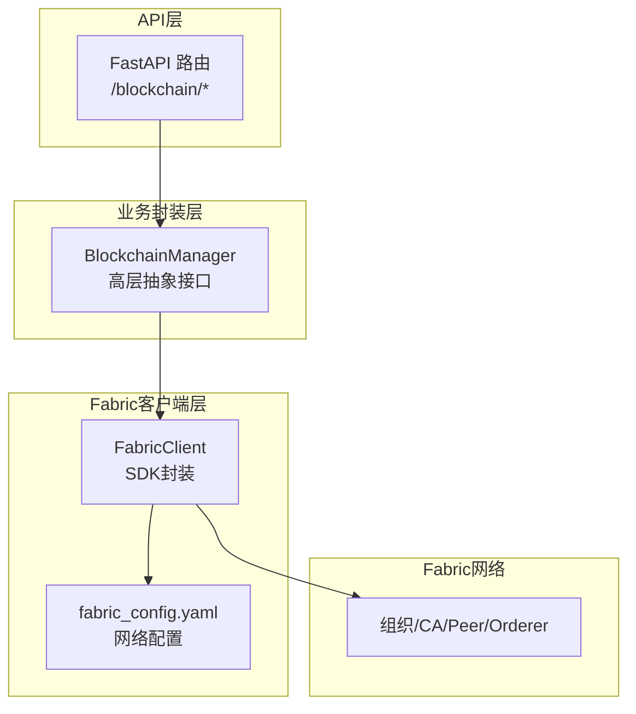
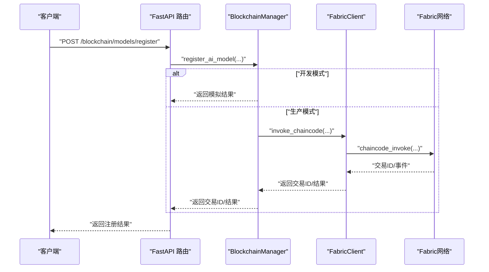
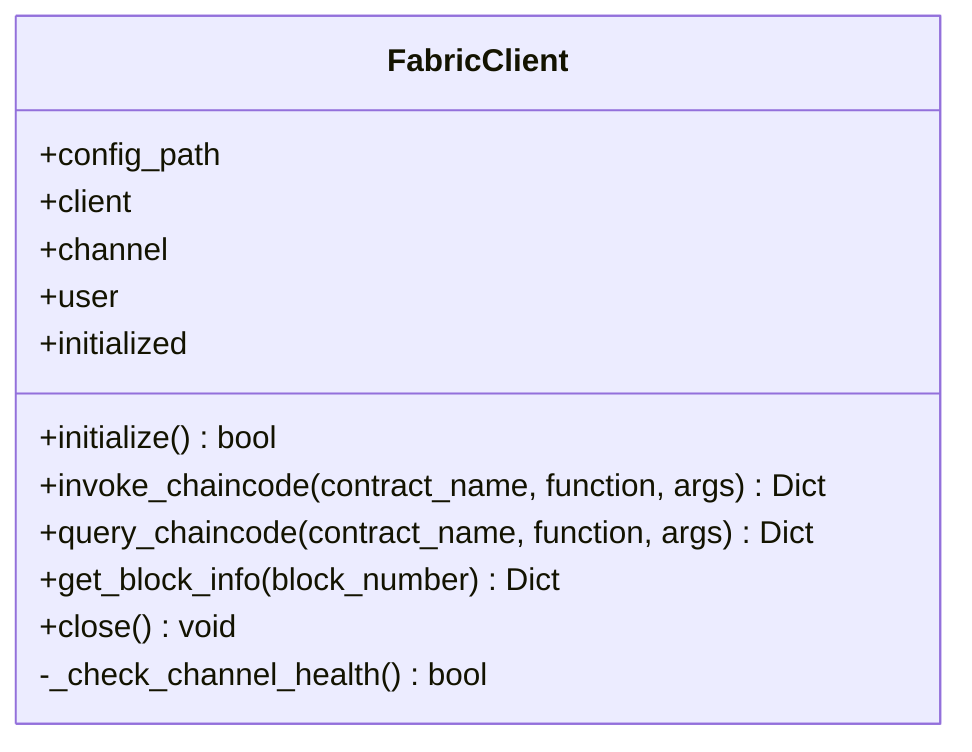
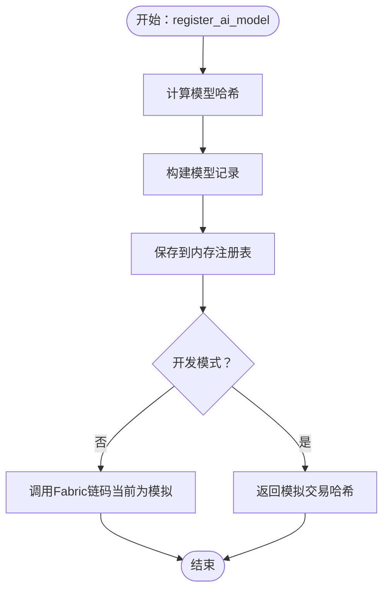
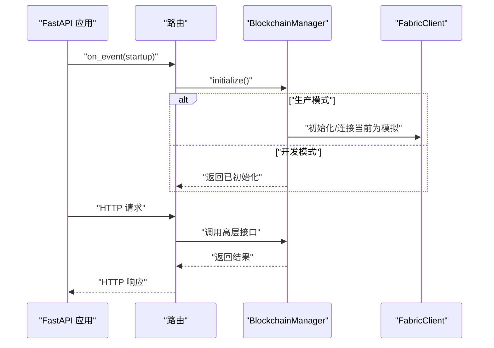
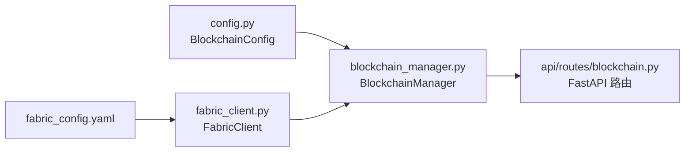

# 区块链客户端交互

<cite>
**本文引用的文件**
- [fabric_client.py](file://backend/src/blockchain/fabric_client.py)
- [blockchain_manager.py](file://backend/src/blockchain/blockchain_manager.py)
- [config.py](file://backend/src/blockchain/config.py)
- [fabric_config.yaml](file://backend/blockchain/fabric_config.yaml)
- [blockchain.py](file://backend/src/api/routes/blockchain.py)
</cite>

## 目录
1. [引言](#引言)
2. [项目结构](#项目结构)
3. [核心组件](#核心组件)
4. [架构总览](#架构总览)
5. [详细组件分析](#详细组件分析)
6. [依赖关系分析](#依赖关系分析)
7. [性能考量](#性能考量)
8. [故障排查指南](#故障排查指南)
9. [结论](#结论)

## 引言
本文件围绕后端区块链子系统，系统化阐述 fabric_client.py 如何基于 Hyperledger Fabric SDK（hfc）实现与区块链网络的安全通信，包括身份认证、通道连接、交易提交与事件监听机制；同时说明 blockchain_manager.py 如何封装客户端实例并提供高层抽象接口供 API 层调用。文档还覆盖交易提交的超时重试策略、证书管理与 TLS 加密配置现状，以及常见连接故障（如证书过期、节点不可达）的排查方法与恢复流程，并给出性能优化建议（如连接池管理）。

## 项目结构
该子系统位于 backend/src/blockchain 目录，包含以下关键文件：
- fabric_client.py：Fabric 客户端封装，负责与 Fabric 网络交互（初始化、通道健康检查、链码调用/查询、区块查询、关闭连接）
- blockchain_manager.py：区块链管理器，提供面向业务的高层接口（模型注册/版本更新/完整性校验/历史查询、数据溯源、联邦学习轮次生命周期管理），并在开发模式与生产模式间切换
- config.py：区块链配置类，支持以太坊/以太坊兼容网络参数与 Fabric 配置占位
- fabric_config.yaml：Fabric 网络配置文件，描述组织、通道、节点、CA、gRPC 地址与 TLS 参数
- backend/src/api/routes/blockchain.py：FastAPI 路由层，对外暴露 REST 接口，依赖 BlockchainManager 提供业务能力

图表来源
- [blockchain.py](file://backend/src/api/routes/blockchain.py#L1-L120)
- [blockchain_manager.py](file://backend/src/blockchain/blockchain_manager.py#L1-L120)
- [fabric_client.py](file://backend/src/blockchain/fabric_client.py#L1-L120)
- [fabric_config.yaml](file://backend/blockchain/fabric_config.yaml#L1-L45)

章节来源
- [blockchain.py](file://backend/src/api/routes/blockchain.py#L1-L120)
- [blockchain_manager.py](file://backend/src/blockchain/blockchain_manager.py#L1-L120)
- [fabric_client.py](file://backend/src/blockchain/fabric_client.py#L1-L120)
- [fabric_config.yaml](file://backend/blockchain/fabric_config.yaml#L1-L45)

## 核心组件
- FabricClient：对 Fabric SDK 的封装，负责初始化、通道健康检查、链码调用/查询、区块查询、关闭连接。具备可选的模拟实现分支，便于开发/测试。
- BlockchainManager：对外提供模型注册/版本更新/完整性校验/历史查询、数据溯源、联邦学习轮次生命周期管理等高层接口；内部根据配置决定是否启用真实 Fabric 客户端或模拟实现。
- BlockchainConfig：统一读取环境变量，提供网络类型、RPC 地址、链 ID、合约地址映射、Fabric 配置占位、账户、Gas 参数、合约 ABI 等配置项。
- fabric_config.yaml：Fabric 网络配置文件，包含组织、通道、节点、CA、gRPC 地址与 TLS 参数（ssl-target-name-override、grpc-max-send-message-length、grpc.keepalive_time_ms、verify 等）。

章节来源
- [fabric_client.py](file://backend/src/blockchain/fabric_client.py#L28-L222)
- [blockchain_manager.py](file://backend/src/blockchain/blockchain_manager.py#L1-L120)
- [config.py](file://backend/src/blockchain/config.py#L1-L80)
- [fabric_config.yaml](file://backend/blockchain/fabric_config.yaml#L1-L45)

## 架构总览
Fabric 客户端通过 Fabric SDK 与网络交互，使用 fabric_config.yaml 中的组织、通道、节点、CA、gRPC 地址与 TLS 参数进行安全连接。API 层通过 BlockchainManager 提供的高层接口访问底层 Fabric 能力，开发模式下可直接返回模拟结果，生产模式下委托 FabricClient 执行真实操作。

图表来源
- [blockchain.py](file://backend/src/api/routes/blockchain.py#L100-L160)
- [blockchain_manager.py](file://backend/src/blockchain/blockchain_manager.py#L94-L128)
- [fabric_client.py](file://backend/src/blockchain/fabric_client.py#L83-L135)

## 详细组件分析

### FabricClient 组件分析
- 初始化与通道健康检查
  - 从 fabric_config.yaml 加载网络配置，获取组织管理员用户与通道实例
  - 通过通道信息查询进行健康检查，确保通道可用
  - 支持模拟实现，便于开发/测试
- 链码调用与查询
  - 调用链码时指定请求者、通道名、节点、函数名、参数、合约名
  - 查询链码时返回数据
  - 对异常进行捕获并返回标准化结构
- 区块查询
  - 通过通道获取区块头信息（当前哈希、前一区块哈希、交易数量）
- 关闭连接
  - 清理客户端、通道、用户状态，标记未初始化

图表来源
- [fabric_client.py](file://backend/src/blockchain/fabric_client.py#L28-L222)

章节来源
- [fabric_client.py](file://backend/src/blockchain/fabric_client.py#L38-L135)
- [fabric_client.py](file://backend/src/blockchain/fabric_client.py#L136-L215)
- [fabric_client.py](file://backend/src/blockchain/fabric_client.py#L216-L222)

### BlockchainManager 组件分析
- 初始化与状态
  - 根据配置判断是否为开发模式；开发模式直接返回“已初始化”，否则执行连接逻辑（当前为模拟）
  - 提供 get_blockchain_status，返回健康状态与组件信息
- 模型生命周期
  - 注册模型：计算哈希、生成记录、返回交易哈希（开发模式为模拟）
  - 更新版本：追加版本记录
  - 完整性校验：比较当前哈希与注册的最新版本哈希
  - 历史查询：返回版本历史
- 数据溯源
  - 记录训练/推理数据使用，生成溯源记录与交易哈希
- 联邦学习
  - 启动轮次、提交边缘节点更新、完成轮次并记录聚合结果
  - 查询轮次状态

图表来源
- [blockchain_manager.py](file://backend/src/blockchain/blockchain_manager.py#L94-L128)

章节来源
- [blockchain_manager.py](file://backend/src/blockchain/blockchain_manager.py#L25-L87)
- [blockchain_manager.py](file://backend/src/blockchain/blockchain_manager.py#L94-L128)
- [blockchain_manager.py](file://backend/src/blockchain/blockchain_manager.py#L131-L187)
- [blockchain_manager.py](file://backend/src/blockchain/blockchain_manager.py#L188-L204)
- [blockchain_manager.py](file://backend/src/blockchain/blockchain_manager.py#L205-L242)
- [blockchain_manager.py](file://backend/src/blockchain/blockchain_manager.py#L243-L257)
- [blockchain_manager.py](file://backend/src/blockchain/blockchain_manager.py#L258-L311)
- [blockchain_manager.py](file://backend/src/blockchain/blockchain_manager.py#L312-L361)
- [blockchain_manager.py](file://backend/src/blockchain/blockchain_manager.py#L362-L366)

### API 路由与依赖注入
- 路由层在应用启动时创建 BlockchainManager 并初始化；在关闭时清理
- 多个端点依赖 BlockchainManager 提供的高层接口，如模型注册、版本更新、完整性校验、历史查询、数据溯源、联邦学习轮次管理等
- 当模块导入失败时，提供模拟实现并返回 503

图表来源
- [blockchain.py](file://backend/src/api/routes/blockchain.py#L30-L44)
- [blockchain.py](file://backend/src/api/routes/blockchain.py#L61-L120)
- [blockchain.py](file://backend/src/api/routes/blockchain.py#L100-L160)

章节来源
- [blockchain.py](file://backend/src/api/routes/blockchain.py#L1-L120)
- [blockchain.py](file://backend/src/api/routes/blockchain.py#L100-L160)
- [blockchain.py](file://backend/src/api/routes/blockchain.py#L212-L275)
- [blockchain.py](file://backend/src/api/routes/blockchain.py#L277-L360)
- [blockchain.py](file://backend/src/api/routes/blockchain.py#L362-L386)
- [blockchain.py](file://backend/src/api/routes/blockchain.py#L388-L416)

## 依赖关系分析
- FabricClient 依赖 Fabric SDK（hfc）与 fabric_config.yaml
- BlockchainManager 依赖 BlockchainConfig 与 FabricClient（在生产模式下）
- API 路由依赖 BlockchainManager，通过依赖注入在启动时创建并管理生命周期

图表来源
- [config.py](file://backend/src/blockchain/config.py#L1-L80)
- [blockchain_manager.py](file://backend/src/blockchain/blockchain_manager.py#L1-L40)
- [fabric_client.py](file://backend/src/blockchain/fabric_client.py#L1-L40)
- [blockchain.py](file://backend/src/api/routes/blockchain.py#L1-L40)

章节来源
- [config.py](file://backend/src/blockchain/config.py#L1-L80)
- [blockchain_manager.py](file://backend/src/blockchain/blockchain_manager.py#L1-L40)
- [fabric_client.py](file://backend/src/blockchain/fabric_client.py#L1-L40)
- [blockchain.py](file://backend/src/api/routes/blockchain.py#L1-L40)

## 性能考量
- 连接复用与池化
  - 当前实现未显式实现连接池；FabricClient 在每次调用时直接使用已初始化的 client/channel，未见连接复用策略
  - 建议：在生产环境中引入连接池（按组织/通道维度），减少 gRPC 连接建立开销；设置合理的最大连接数、空闲超时与重用策略
- 调用并发
  - FabricClient 的方法均为异步，API 层也采用异步依赖注入；建议在路由层对高并发请求进行限流与队列控制，避免瞬时压力导致节点过载
- 事件监听
  - FabricClient 未实现事件监听；若需监听交易事件，可在 Fabric SDK 层增加事件订阅与回调处理，结合连接池与重连策略
- 超时与重试
  - 当前未实现显式的超时与重试；建议在链码调用处增加超时控制与指数退避重试（区分网络错误与业务错误），并记录重试次数与耗时指标
- 日志与监控
  - 已有基础日志输出；建议补充链码调用耗时、重试次数、错误码统计等指标，便于性能分析与告警

章节来源
- [fabric_client.py](file://backend/src/blockchain/fabric_client.py#L83-L135)
- [blockchain.py](file://backend/src/api/routes/blockchain.py#L100-L160)

## 故障排查指南
- 证书过期/验证失败
  - fabric_config.yaml 中 CA 配置包含 httpOptions.verify 字段；若设置为 false，将跳过证书验证，这在开发环境可行但不适用于生产
  - 排查步骤：
    - 确认 CA URL 与证书路径有效
    - 检查 ssl-target-name-override 是否与证书 CN/SAN 一致
    - 若为自签证书，确保客户端信任链正确
  - 恢复流程：
    - 更新证书与 CA 配置
    - 重启后端服务，重新加载 fabric_config.yaml
- 节点不可达
  - 检查 peer/orderer 的 gRPC 地址与端口是否可达
  - 查看 grpcOptions 中的 keepalive 时间与消息大小限制
  - 使用网络连通性工具验证端口开放情况
- 通道健康检查失败
  - FabricClient 在初始化时会调用通道信息查询；若失败，需检查通道名称、组织 MSP、用户凭据
  - 建议在 API 层提供独立的健康检查端点，快速定位问题
- 交易提交异常
  - 捕获链码调用异常并返回标准化错误结构；建议在 API 层记录错误码与重试次数
  - 对于超时/网络错误，实施指数退避重试；对于业务错误（如参数非法），直接返回错误给调用方
- 开发模式与生产模式切换
  - BlockchainConfig.is_development_mode 决定行为；开发模式下返回模拟结果，生产模式下委托 FabricClient
  - 确保环境变量正确设置，避免误入模拟模式

章节来源
- [fabric_config.yaml](file://backend/blockchain/fabric_config.yaml#L1-L45)
- [fabric_client.py](file://backend/src/blockchain/fabric_client.py#L38-L82)
- [blockchain_manager.py](file://backend/src/blockchain/blockchain_manager.py#L25-L41)
- [blockchain.py](file://backend/src/api/routes/blockchain.py#L61-L120)

## 结论
本系统通过 FabricClient 将 Fabric SDK 能力封装为可维护的客户端组件，并由 BlockchainManager 提供面向业务的高层接口，API 层通过依赖注入与生命周期管理实现稳定的服务交付。当前实现具备良好的可扩展性与开发友好性，但在生产环境中仍需补齐连接池、事件监听、超时重试与 TLS 证书治理等关键能力，以满足高可用与高性能需求。