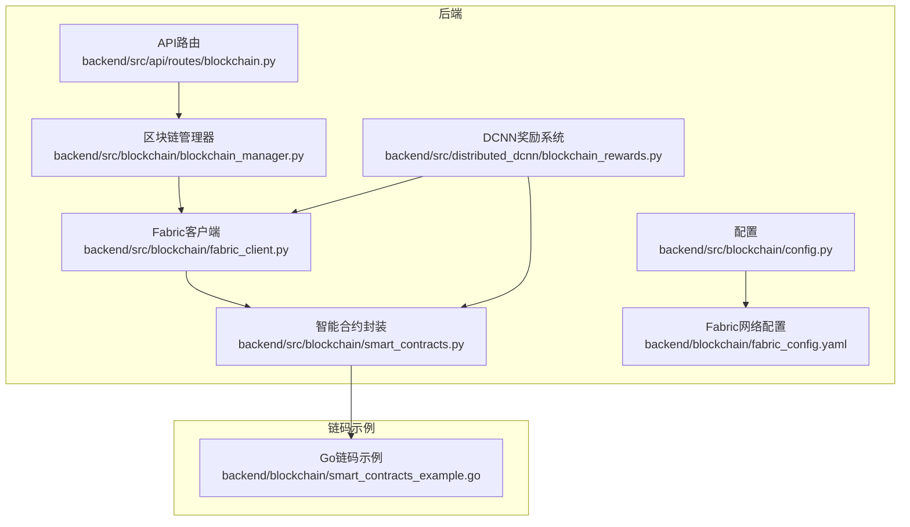
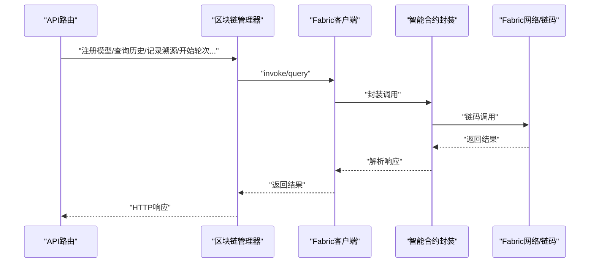
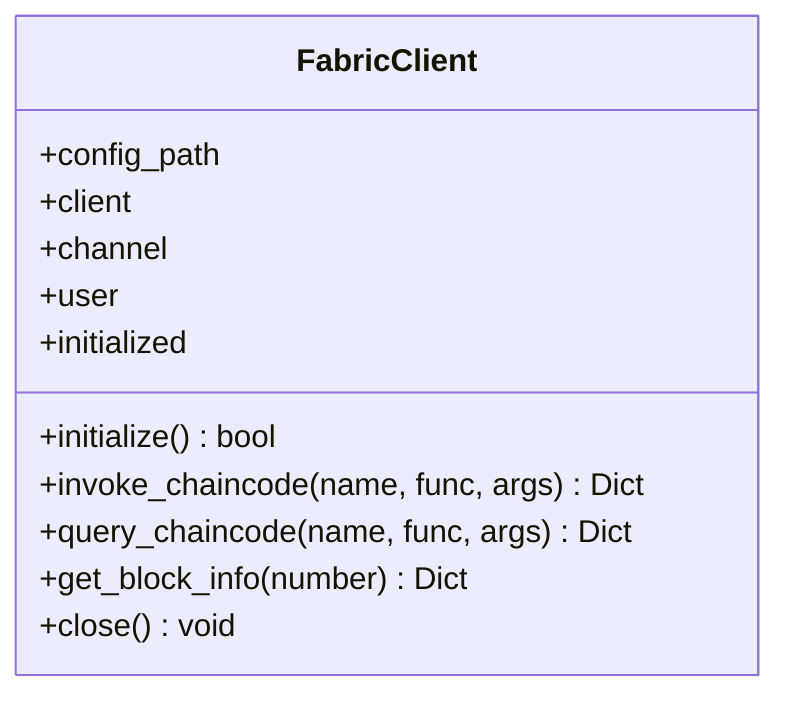
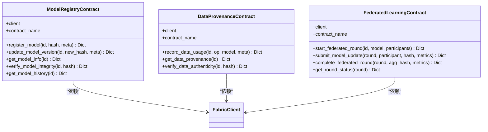
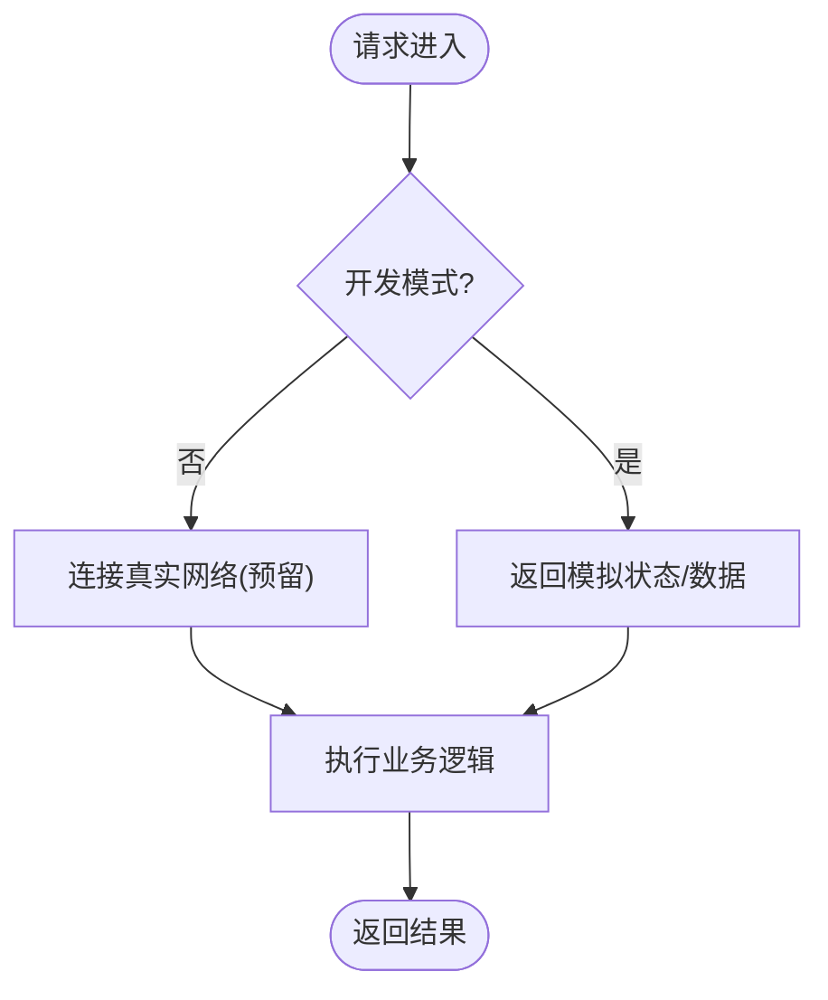
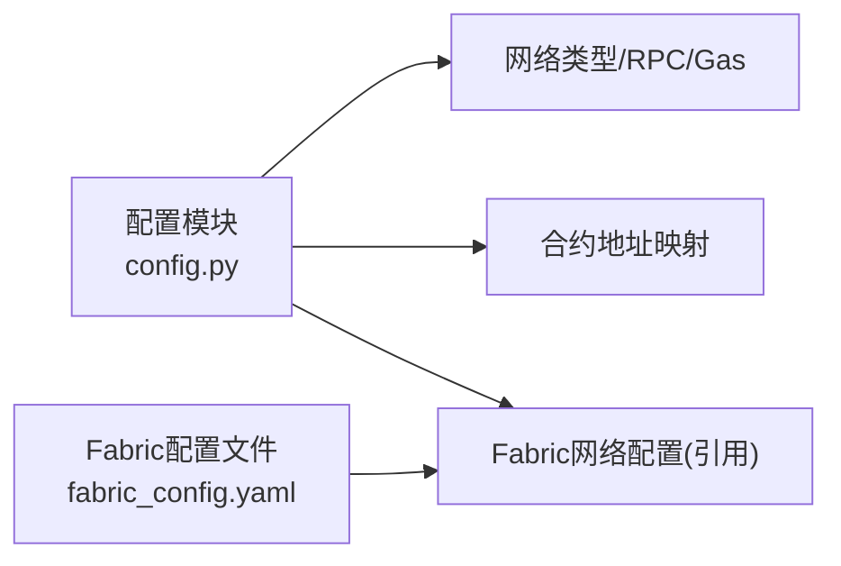
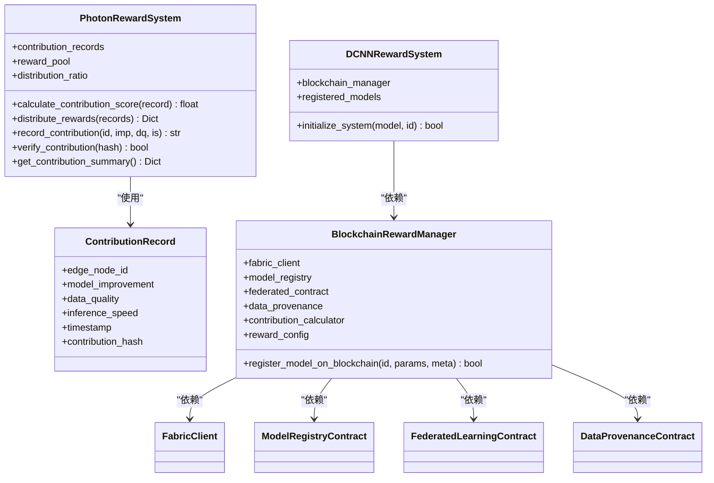
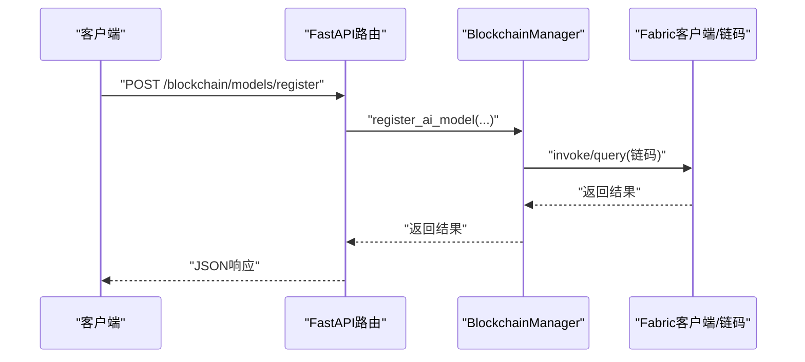
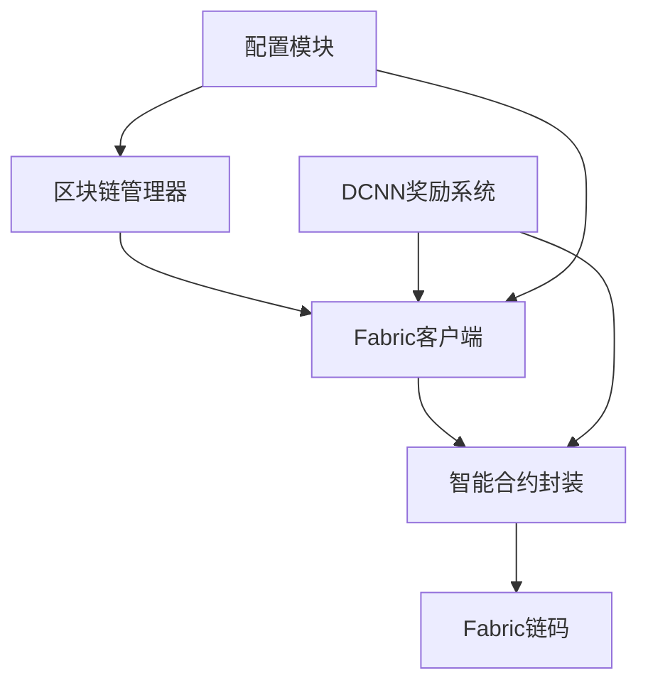

# 区块链集成

<cite>
**本文引用的文件**
- [fabric_client.py](file://backend/src/blockchain/fabric_client.py)
- [photon_rewards.py](file://backend/src/blockchain/photon_rewards.py)
- [smart_contracts.py](file://backend/src/blockchain/smart_contracts.py)
- [fabric_config.yaml](file://backend/blockchain/fabric_config.yaml)
- [blockchain_manager.py](file://backend/src/blockchain/blockchain_manager.py)
- [config.py](file://backend/src/blockchain/config.py)
- [smart_contracts_example.go](file://backend/blockchain/smart_contracts_example.go)
- [blockchain.py](file://backend/src/api/routes/blockchain.py)
- [blockchain_rewards.py](file://backend/src/distributed_dcnn/blockchain_rewards.py)
- [edge_node_client.py](file://backend/examples/edge_node_client.py)
</cite>

## 目录
1. [简介](#简介)
2. [项目结构](#项目结构)
3. [核心组件](#核心组件)
4. [架构总览](#架构总览)
5. [详细组件分析](#详细组件分析)
6. [依赖关系分析](#依赖关系分析)
7. [性能考量](#性能考量)
8. [故障排查指南](#故障排查指南)
9. [结论](#结论)
10. [附录：部署与运维指南](#附录：部署与运维指南)

## 简介
本文件面向开发者，系统性阐述本项目中的Hyperledger Fabric区块链集成方案，涵盖：
- 智能合约设计与Fabric网络交互
- 数据溯源机制与贡献奖励系统
- 模型版本与数据使用记录的上链存储与验证
- 区块链网络配置、通道管理与链码部署的操作指南
- 链上数据查询、事件监听与故障恢复的最佳实践

## 项目结构
后端采用模块化设计，区块链相关能力集中在“blockchain”子目录，同时在“distributed_dcnn”中扩展了DCNN奖励系统与Fabric链码对接。API层通过FastAPI路由暴露区块链能力。

图表来源
- [blockchain.py](file://backend/src/api/routes/blockchain.py#L1-L120)
- [blockchain_manager.py](file://backend/src/blockchain/blockchain_manager.py#L1-L120)
- [fabric_client.py](file://backend/src/blockchain/fabric_client.py#L1-L120)
- [smart_contracts.py](file://backend/src/blockchain/smart_contracts.py#L1-L120)
- [config.py](file://backend/src/blockchain/config.py#L1-L80)
- [fabric_config.yaml](file://backend/blockchain/fabric_config.yaml#L1-L45)
- [blockchain_rewards.py](file://backend/src/distributed_dcnn/blockchain_rewards.py#L1-L120)

章节来源
- [blockchain.py](file://backend/src/api/routes/blockchain.py#L1-L120)
- [blockchain_manager.py](file://backend/src/blockchain/blockchain_manager.py#L1-L120)
- [fabric_client.py](file://backend/src/blockchain/fabric_client.py#L1-L120)
- [smart_contracts.py](file://backend/src/blockchain/smart_contracts.py#L1-L120)
- [config.py](file://backend/src/blockchain/config.py#L1-L80)
- [fabric_config.yaml](file://backend/blockchain/fabric_config.yaml#L1-L45)
- [blockchain_rewards.py](file://backend/src/distributed_dcnn/blockchain_rewards.py#L1-L120)

## 核心组件
- Fabric客户端：负责与Fabric网络建立连接、通道健康检查、调用/查询链码、获取区块信息。
- 智能合约封装：为模型注册、数据溯源、联邦学习等业务提供统一的链码调用接口。
- 区块链管理器：提供API层的业务编排，包含模型注册/版本更新/完整性校验、数据溯源记录、联邦学习轮次管理等。
- 配置模块：集中管理网络类型、合约地址、Gas参数、Fabric网络配置等。
- Fabric网络配置：定义组织、通道、Peer、Orderer、CA等网络拓扑。
- DCNN奖励系统：在Fabric链码基础上，实现贡献度量化、奖励分配与上链记录。

章节来源
- [fabric_client.py](file://backend/src/blockchain/fabric_client.py#L28-L196)
- [smart_contracts.py](file://backend/src/blockchain/smart_contracts.py#L1-L249)
- [blockchain_manager.py](file://backend/src/blockchain/blockchain_manager.py#L94-L204)
- [config.py](file://backend/src/blockchain/config.py#L1-L80)
- [fabric_config.yaml](file://backend/blockchain/fabric_config.yaml#L1-L45)
- [blockchain_rewards.py](file://backend/src/distributed_dcnn/blockchain_rewards.py#L1-L200)

## 架构总览
系统通过API路由将业务请求转交给区块链管理器；管理器根据配置决定是否走Fabric链码或模拟实现；Fabric客户端负责与Fabric网络交互；智能合约封装提供链码调用；DCNN奖励系统在Fabric链码之上进行贡献度计算与奖励分配。

图表来源
- [blockchain.py](file://backend/src/api/routes/blockchain.py#L100-L210)
- [blockchain_manager.py](file://backend/src/blockchain/blockchain_manager.py#L94-L204)
- [fabric_client.py](file://backend/src/blockchain/fabric_client.py#L83-L175)
- [smart_contracts.py](file://backend/src/blockchain/smart_contracts.py#L20-L110)

## 详细组件分析

### Fabric客户端（Hyperledger Fabric）
- 初始化：加载网络配置文件，获取组织管理员用户与通道，进行通道健康检查。
- 调用链码：支持invoke与query两类操作，封装返回结构，包含事务ID、载荷/数据、时间戳等。
- 区块查询：按区块号获取区块头信息，便于链上审计与监控。
- 模拟实现：当hfc不可用时，提供模拟行为，便于开发测试。

图表来源
- [fabric_client.py](file://backend/src/blockchain/fabric_client.py#L28-L222)

章节来源
- [fabric_client.py](file://backend/src/blockchain/fabric_client.py#L28-L222)

### 智能合约封装（ModelRegistry/DataProvenance/FederatedLearning）
- ModelRegistryContract：提供注册模型、更新版本、查询信息、完整性校验、历史查询等。
- DataProvenanceContract：提供记录数据使用、查询溯源、验证数据真实性等。
- FederatedLearningContract：提供开始轮次、提交更新、完成轮次、查询状态等。

图表来源
- [smart_contracts.py](file://backend/src/blockchain/smart_contracts.py#L20-L249)

章节来源
- [smart_contracts.py](file://backend/src/blockchain/smart_contracts.py#L20-L249)

### 区块链管理器（API编排）
- 提供模型注册、版本更新、完整性校验、历史查询。
- 提供数据溯源记录与查询。
- 提供联邦学习轮次的启动、更新提交、完成与状态查询。
- 开发模式下返回模拟状态与数据，生产模式下可接入真实网络。

图表来源
- [blockchain_manager.py](file://backend/src/blockchain/blockchain_manager.py#L25-L93)

章节来源
- [blockchain_manager.py](file://backend/src/blockchain/blockchain_manager.py#L94-L204)
- [blockchain_manager.py](file://backend/src/blockchain/blockchain_manager.py#L205-L361)

### 配置模块与Fabric网络配置
- 配置模块：集中管理网络类型、RPC地址、链ID、合约地址、Gas参数、Fabric网络配置、账户信息等。
- Fabric网络配置：定义组织、通道、Peer、Orderer、CA等网络拓扑与连接参数。

图表来源
- [config.py](file://backend/src/blockchain/config.py#L1-L80)
- [fabric_config.yaml](file://backend/blockchain/fabric_config.yaml#L1-L45)

章节来源
- [config.py](file://backend/src/blockchain/config.py#L1-L80)
- [fabric_config.yaml](file://backend/blockchain/fabric_config.yaml#L1-L45)

### PHOTON奖励系统与DCNN奖励机制
- PHOTON奖励系统：提供贡献记录、贡献度计算、奖励分配、摘要统计与智能合约接口模拟。
- DCNN奖励系统：在Fabric链码基础上，实现贡献度量化（数据量、计算时间、模型改进、准确率提升）、质量调整、奖励分配与上链记录。

图表来源
- [photon_rewards.py](file://backend/src/blockchain/photon_rewards.py#L1-L165)
- [blockchain_rewards.py](file://backend/src/distributed_dcnn/blockchain_rewards.py#L1-L200)

章节来源
- [photon_rewards.py](file://backend/src/blockchain/photon_rewards.py#L1-L165)
- [blockchain_rewards.py](file://backend/src/distributed_dcnn/blockchain_rewards.py#L1-L200)

### API路由与最佳实践
- API路由：提供区块链状态、模型注册/版本/验证/历史、数据溯源记录/查询、联邦学习轮次管理等接口。
- 最佳实践：
  - 使用依赖注入获取BlockchainManager实例，确保生命周期管理。
  - 对外返回统一结构，包含success、data/error、timestamp等字段。
  - 在开发模式下返回模拟数据，生产模式下接入真实网络。

图表来源
- [blockchain.py](file://backend/src/api/routes/blockchain.py#L100-L170)
- [blockchain_manager.py](file://backend/src/blockchain/blockchain_manager.py#L94-L158)
- [fabric_client.py](file://backend/src/blockchain/fabric_client.py#L83-L175)

章节来源
- [blockchain.py](file://backend/src/api/routes/blockchain.py#L1-L120)
- [blockchain.py](file://backend/src/api/routes/blockchain.py#L100-L210)
- [blockchain.py](file://backend/src/api/routes/blockchain.py#L276-L386)

## 依赖关系分析
- 组件耦合：
  - Fabric客户端与智能合约封装强耦合，通过链码名称与函数名进行解耦。
  - 区块链管理器与Fabric客户端弱耦合，通过配置模块控制是否启用真实网络。
  - DCNN奖励系统依赖Fabric客户端与智能合约封装，形成上层业务与底层链码的桥接。
- 外部依赖：
  - Fabric SDK（hfc）用于真实网络交互；开发模式下提供模拟实现。
  - Go链码示例展示Fabric链码的典型实现模式（注册、更新、查询、历史）。

图表来源
- [fabric_client.py](file://backend/src/blockchain/fabric_client.py#L28-L120)
- [smart_contracts.py](file://backend/src/blockchain/smart_contracts.py#L20-L110)
- [blockchain_manager.py](file://backend/src/blockchain/blockchain_manager.py#L14-L33)
- [config.py](file://backend/src/blockchain/config.py#L1-L80)
- [blockchain_rewards.py](file://backend/src/distributed_dcnn/blockchain_rewards.py#L153-L200)

章节来源
- [fabric_client.py](file://backend/src/blockchain/fabric_client.py#L28-L120)
- [smart_contracts.py](file://backend/src/blockchain/smart_contracts.py#L20-L110)
- [blockchain_manager.py](file://backend/src/blockchain/blockchain_manager.py#L14-L33)
- [config.py](file://backend/src/blockchain/config.py#L1-L80)
- [blockchain_rewards.py](file://backend/src/distributed_dcnn/blockchain_rewards.py#L153-L200)

## 性能考量
- Fabric客户端调用链码时建议：
  - 批量提交与异步等待策略，减少阻塞。
  - 合理设置超时与重试，避免长时间占用资源。
- 区块链管理器：
  - 在开发模式下使用内存缓存与模拟实现，提高响应速度。
  - 生产模式下注意Gas费用与区块确认时间，合理安排批量操作。
- 奖励系统：
  - 贡献度计算应尽量在本地完成，仅在必要时上链，减少链上写入压力。

## 故障排查指南
- Fabric客户端初始化失败：
  - 检查网络配置文件路径与内容，确认组织、通道、Peer、Orderer、CA配置正确。
  - 确认hfc包可用，或切换到开发模式使用模拟实现。
- 通道健康检查失败：
  - 检查Orderer与Peer服务状态，确认gRPC端口可达。
- 调用/查询链码失败：
  - 查看链码函数签名与参数顺序，确保与封装一致。
  - 检查链码部署状态与合约名称。
- 区块链管理器未初始化：
  - 确认API启动事件中初始化流程已执行。
- 奖励系统异常：
  - 检查贡献度计算权重与质量调整因子，确保输入指标合法。
  - 确认链上注册与提交流程已完成。

章节来源
- [fabric_client.py](file://backend/src/blockchain/fabric_client.py#L38-L82)
- [fabric_config.yaml](file://backend/blockchain/fabric_config.yaml#L1-L45)
- [blockchain.py](file://backend/src/api/routes/blockchain.py#L30-L44)
- [blockchain_rewards.py](file://backend/src/distributed_dcnn/blockchain_rewards.py#L153-L200)

## 结论
本项目提供了完整的Hyperledger Fabric区块链集成方案，覆盖智能合约设计、数据溯源、联邦学习与奖励分配。通过清晰的模块划分与API编排，既能在开发模式下快速迭代，也能平滑过渡到生产网络。建议在生产环境中结合链码部署、事件监听与监控告警体系，持续优化性能与稳定性。

## 附录：部署与运维指南

### 区块链网络配置
- Fabric网络配置文件位置与关键项：
  - 组织、通道、Peer、Orderer、CA等网络拓扑与连接参数。
  - gRPC选项、SSL配置、证书校验等。
- 配置模块读取：
  - 通过配置模块集中管理网络类型、合约地址、Gas参数等。

章节来源
- [fabric_config.yaml](file://backend/blockchain/fabric_config.yaml#L1-L45)
- [config.py](file://backend/src/blockchain/config.py#L1-L80)

### 通道管理与链码部署
- 通道管理：
  - 使用Fabric CLI或SDK创建通道、加入Peer、安装链码、实例化链码。
  - 确保通道名称与客户端配置一致。
- 链码部署：
  - Go链码示例展示了典型的链码结构：合约结构体、状态键值、注册/更新/查询/历史等函数。
  - 部署后需在客户端侧配置正确的合约名称与函数名。

章节来源
- [smart_contracts_example.go](file://backend/blockchain/smart_contracts_example.go#L1-L246)
- [smart_contracts.py](file://backend/src/blockchain/smart_contracts.py#L20-L110)

### 链上数据查询与事件监听
- 查询：
  - 通过API路由调用区块链管理器，再由Fabric客户端封装查询链码。
  - 建议统一返回结构，便于前端与监控系统消费。
- 事件监听：
  - 在Fabric客户端中可通过事件URL订阅链码事件，实现异步通知与链上状态变更追踪。
  - 建议结合消息队列或WebSocket推送至前端。

章节来源
- [blockchain.py](file://backend/src/api/routes/blockchain.py#L100-L210)
- [blockchain_manager.py](file://backend/src/blockchain/blockchain_manager.py#L94-L204)
- [fabric_config.yaml](file://backend/blockchain/fabric_config.yaml#L32-L39)

### 边缘节点与贡献记录
- 边缘节点客户端示例展示了节点注册、心跳、推理与联邦学习参与流程。
- 贡献记录与奖励分配：
  - 通过PHOTON奖励系统记录贡献并计算奖励，最终通过智能合约接口模拟上链分发。

章节来源
- [edge_node_client.py](file://backend/examples/edge_node_client.py#L1-L267)
- [photon_rewards.py](file://backend/src/blockchain/photon_rewards.py#L1-L165)