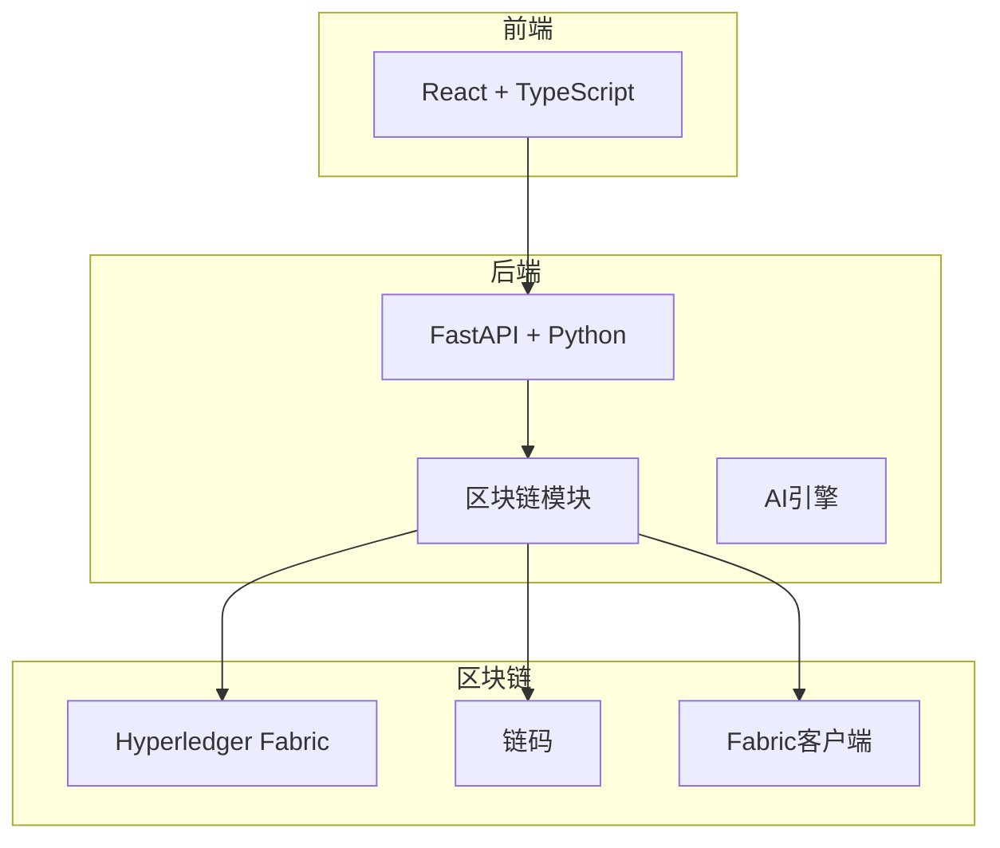
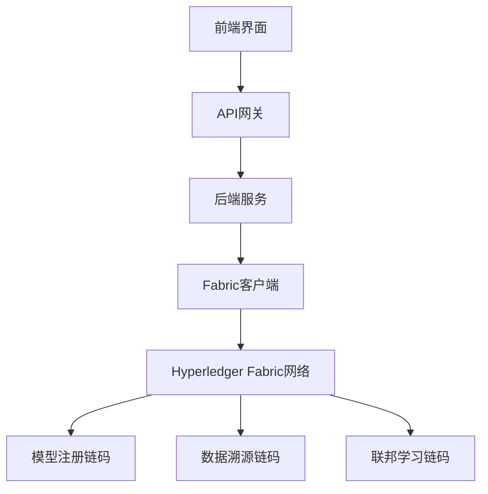
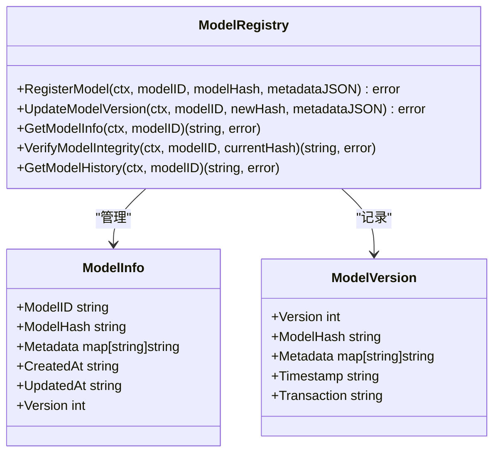
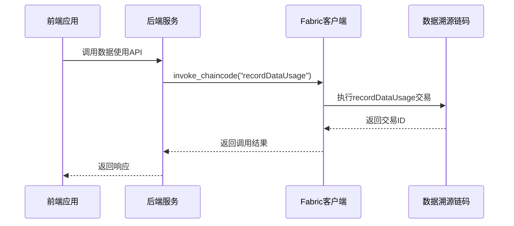
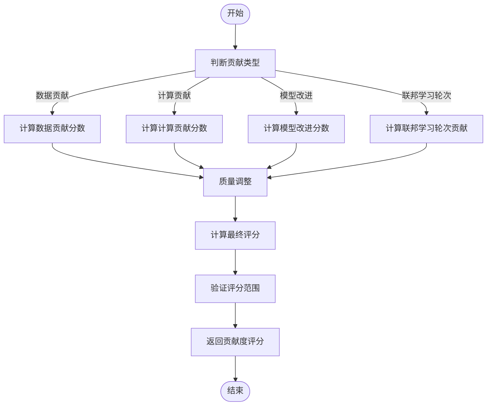
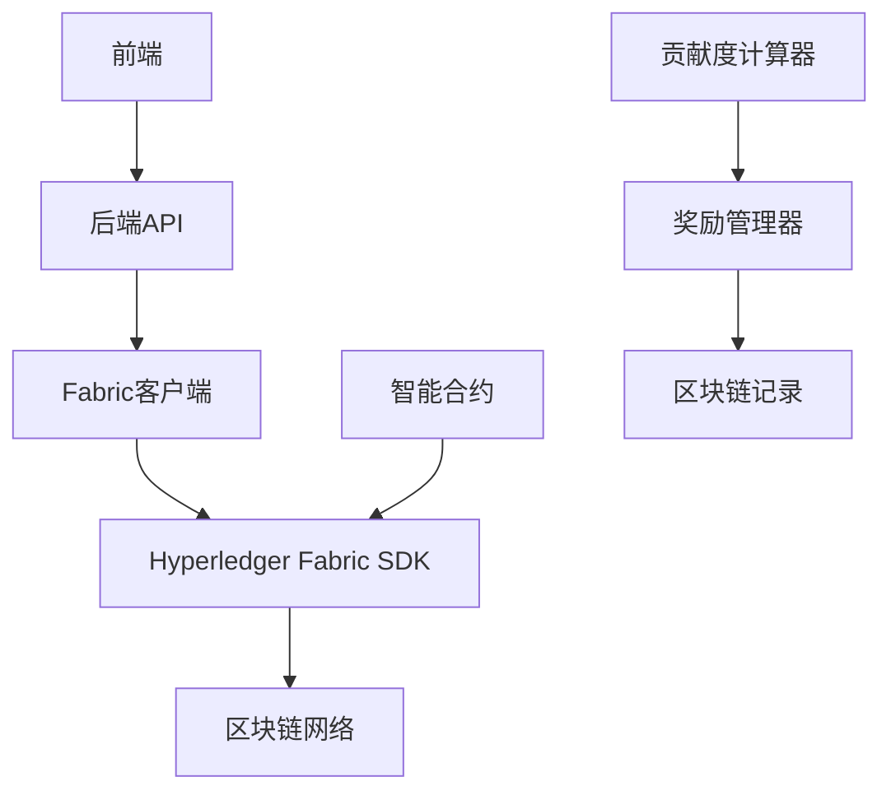

# 智能合约设计

<cite>
**本文档引用文件**  
- [smart_contracts_example.go](file://backend/blockchain/smart_contracts_example.go)
- [smart_contracts.py](file://backend/src/blockchain/smart_contracts.py)
- [fabric_config.yaml](file://backend/blockchain/fabric_config.yaml)
- [fabric_client.py](file://backend/src/blockchain/fabric_client.py)
- [blockchain_rewards.py](file://backend/src/distributed_dcnn/blockchain_rewards.py)
- [photon_rewards.py](file://backend/src/blockchain/photon_rewards.py)
- [federated_edge.py](file://backend/src/distributed_dcnn/federated_edge.py)
</cite>

## 目录
1. [引言](#引言)
2. [项目结构](#项目结构)
3. [核心组件](#核心组件)
4. [架构概述](#架构概述)
5. [详细组件分析](#详细组件分析)
6. [依赖分析](#依赖分析)
7. [性能考虑](#性能考虑)
8. [故障排除指南](#故障排除指南)
9. [结论](#结论)

## 引言
本文档深入解析基于Go语言编写的Hyperledger Fabric智能合约实现，重点说明合约如何定义模型版本注册、数据使用记录上链及贡献度评估逻辑。详细描述链码中的关键函数如RegisterModel、LogDataAccess、CalculateContribution的输入输出参数与业务规则。结合smart_contracts.py中的调用接口，说明前后端如何通过链码执行交易与查询状态。提供链码部署、升级与版本管理的操作流程，并附带错误处理与调试建议。

## 项目结构
本项目采用分层架构设计，包含前端、后端、区块链和基础设施模块。区块链相关代码主要位于backend/blockchain和backend/src/blockchain目录下，实现了Hyperledger Fabric智能合约的定义、调用和管理。

**图示来源**  
- [fabric_config.yaml](file://backend/blockchain/fabric_config.yaml#L1-L45)

**本节来源**  
- [README.md](file://README.md#L1-L165)

## 核心组件
本系统的核心组件包括模型注册智能合约、数据溯源智能合约和联邦学习智能合约。这些合约通过Hyperledger Fabric实现不可篡改的记录存储，确保AI模型生命周期的透明性和可追溯性。

**本节来源**  
- [smart_contracts_example.go](file://backend/blockchain/smart_contracts_example.go#L1-L246)
- [smart_contracts.py](file://backend/src/blockchain/smart_contracts.py#L1-L249)

## 架构概述
系统采用前后端分离架构，前端通过API网关与后端通信，后端服务通过Fabric客户端与Hyperledger Fabric网络交互。智能合约作为链上逻辑的核心，负责处理模型注册、数据溯源和贡献度计算等关键业务。

**图示来源**  
- [fabric_client.py](file://backend/src/blockchain/fabric_client.py#L28-L196)
- [smart_contracts.py](file://backend/src/blockchain/smart_contracts.py#L1-L249)

## 详细组件分析

### 模型注册合约分析
模型注册合约负责管理AI模型的全生命周期，包括注册、版本更新和完整性验证。合约通过状态数据库存储模型元数据，并使用复合键记录版本历史。

#### 模型注册合约类图

**图示来源**  
- [smart_contracts_example.go](file://backend/blockchain/smart_contracts_example.go#L10-L246)

**本节来源**  
- [smart_contracts_example.go](file://backend/blockchain/smart_contracts_example.go#L34-L93)

### 数据溯源合约分析
数据溯源合约记录数据使用情况，确保数据访问的可追溯性。通过recordDataUsage函数记录每次数据访问，包括操作类型、模型ID和元数据。

#### 数据溯源合约序列图

**图示来源**  
- [smart_contracts.py](file://backend/src/blockchain/smart_contracts.py#L112-L157)

**本节来源**  
- [smart_contracts.py](file://backend/src/blockchain/smart_contracts.py#L119-L137)

### 贡献度评估分析
贡献度评估系统通过多维度指标计算参与者的贡献值，包括数据贡献、计算贡献和模型改进贡献。系统采用加权算法结合质量因子，确保奖励分配的公平性。

#### 贡献度计算流程图

**图示来源**  
- [blockchain_rewards.py](file://backend/src/distributed_dcnn/blockchain_rewards.py#L69-L109)

**本节来源**  
- [blockchain_rewards.py](file://backend/src/distributed_dcnn/blockchain_rewards.py#L85-L109)

## 依赖分析
系统各组件之间存在明确的依赖关系。后端服务依赖Fabric客户端与区块链网络通信，智能合约依赖Hyperledger Fabric的合约API，前端应用依赖后端提供的REST API。

**图示来源**  
- [fabric_client.py](file://backend/src/blockchain/fabric_client.py#L28-L196)
- [photon_rewards.py](file://backend/src/blockchain/photon_rewards.py#L71-L106)

**本节来源**  
- [fabric_client.py](file://backend/src/blockchain/fabric_client.py#L83-L134)
- [smart_contracts.py](file://backend/src/blockchain/smart_contracts.py#L27-L43)

## 性能考虑
在智能合约设计中，性能优化主要体现在状态查询效率和交易处理速度。通过合理使用复合键和索引，可以提高版本历史查询的效率。同时，避免在合约中执行复杂计算，将繁重的计算任务放在链下处理。

**本节来源**  
- [smart_contracts_example.go](file://backend/blockchain/smart_contracts_example.go#L207-L234)
- [blockchain_rewards.py](file://backend/src/distributed_dcnn/blockchain_rewards.py#L85-L109)

## 故障排除指南
智能合约开发和部署过程中可能遇到多种问题，包括链码安装失败、交易执行错误和查询超时等。建议通过查看Fabric日志、验证链码语法和检查网络配置来定位问题。

**本节来源**  
- [smart_contracts_example.go](file://backend/blockchain/smart_contracts_example.go#L236-L246)
- [fabric_client.py](file://backend/src/blockchain/fabric_client.py#L128-L134)

## 结论
本文档详细解析了基于Hyperledger Fabric的智能合约实现，涵盖了模型注册、数据溯源和贡献度评估等核心功能。通过前后端协同工作，系统实现了AI模型生命周期的透明化管理，为构建可信的AI生态系统提供了技术基础。