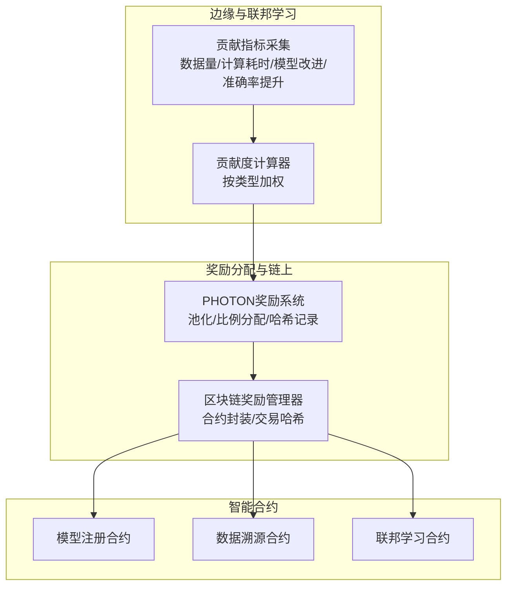
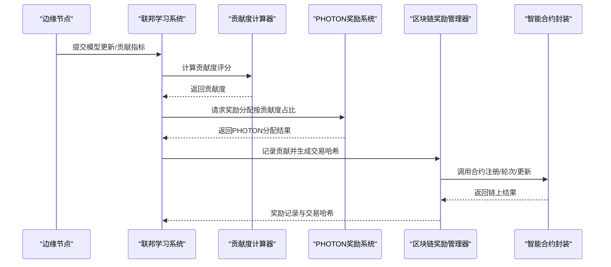
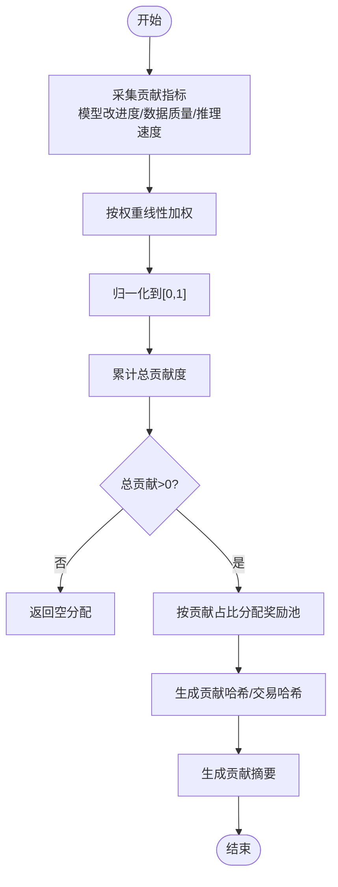
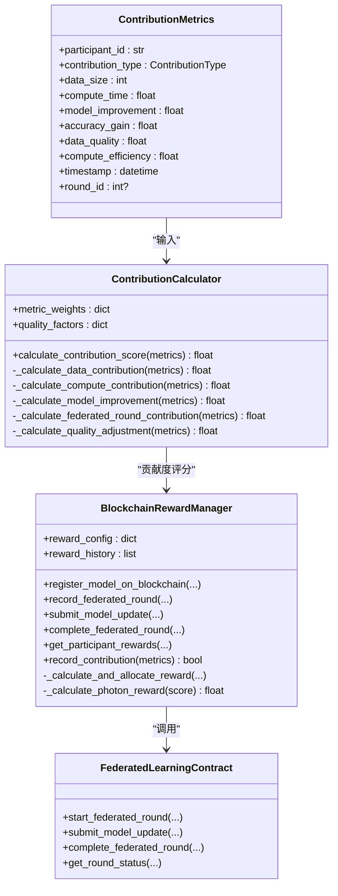
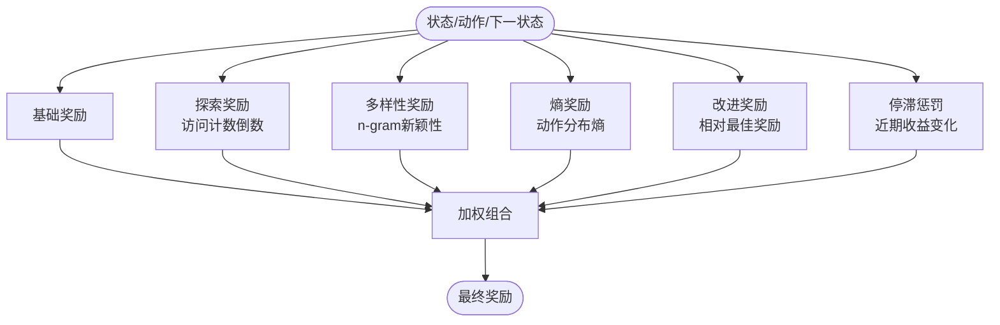
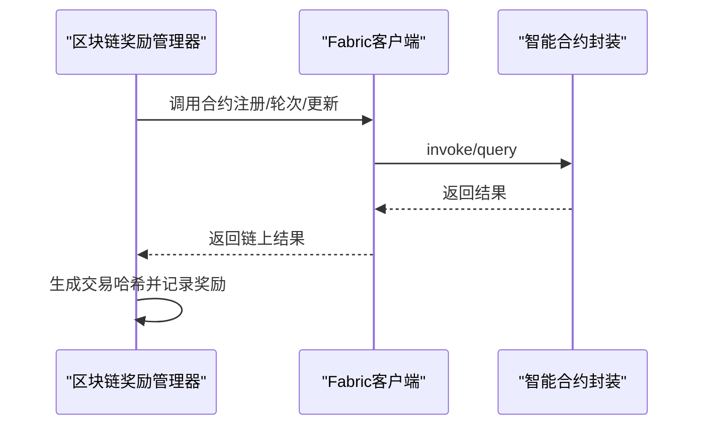
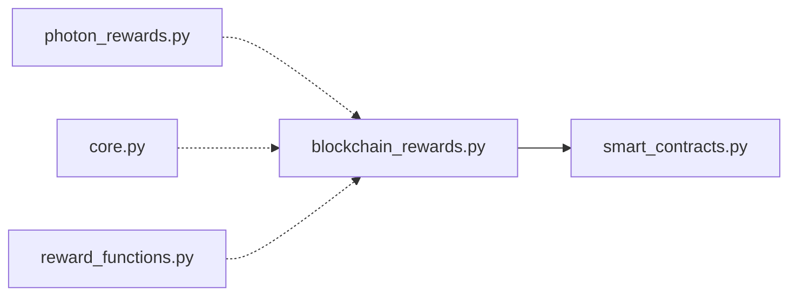

# 贡献奖励系统

<cite>
**本文引用的文件**
- [photon_rewards.py](file://backend/src/blockchain/photon_rewards.py)
- [reward_functions.py](file://backend/src/core/models/reward_functions.py)
- [blockchain_rewards.py](file://backend/src/distributed_dcnn/blockchain_rewards.py)
- [smart_contracts.py](file://backend/src/blockchain/smart_contracts.py)
- [core.py](file://backend/src/distributed_dcnn/core.py)
- [blockchain_reward_pool_optimization.md](file://blockchain_reward_pool_optimization.md)
- [test_compliance.py](file://backend/tests/test_compliance.py)
- [test_end_to_end.py](file://backend/tests/test_end_to_end.py)
</cite>

## 目录
1. [引言](#引言)
2. [项目结构](#项目结构)
3. [核心组件](#核心组件)
4. [架构总览](#架构总览)
5. [详细组件分析](#详细组件分析)
6. [依赖分析](#依赖分析)
7. [性能考量](#性能考量)
8. [故障排查指南](#故障排查指南)
9. [结论](#结论)
10. [附录](#附录)

## 引言
本文件系统性阐述基于模型使用频率、数据贡献质量与计算资源投入计算节点贡献值的激励机制，结合 reward_functions.py 中的评估逻辑，展示从边缘节点行为采集到最终奖励结算的完整流程，并给出奖励池资金管理、防作弊机制与经济模型可持续性的设计考量。文档同时覆盖链上交易发放 Photon 代币奖励的技术细节与参数配置方式。

## 项目结构
贡献奖励系统由三层组成：
- 边缘侧与联邦学习层：负责采集节点行为指标（数据量、计算耗时、模型改进度、准确率提升等），并计算贡献度评分。
- 奖励分配与链上交互层：负责将贡献度转换为 Photon 奖励，生成交易哈希并在区块链上记录。
- 模型与智能合约层：提供模型注册、数据溯源、联邦学习轮次记录等能力，支撑奖励的可信发放。

图表来源
- [blockchain_rewards.py](file://backend/src/distributed_dcnn/blockchain_rewards.py#L1-L120)
- [photon_rewards.py](file://backend/src/blockchain/photon_rewards.py#L1-L120)
- [smart_contracts.py](file://backend/src/blockchain/smart_contracts.py#L1-L120)

章节来源
- [blockchain_rewards.py](file://backend/src/distributed_dcnn/blockchain_rewards.py#L1-L120)
- [photon_rewards.py](file://backend/src/blockchain/photon_rewards.py#L1-L120)
- [smart_contracts.py](file://backend/src/blockchain/smart_contracts.py#L1-L120)

## 核心组件
- 贡献指标与评分
  - 贡献类型：数据贡献、计算贡献、模型改进、联邦学习轮次。
  - 评分公式：按类型加权（如数据量、计算耗时、模型改进度、准确率提升），并引入质量调整因子（数据质量、计算效率）。
- 奖励分配
  - 奖励池初始规模与分配比例；按总贡献度占比分配池内资金。
  - 生成贡献哈希与交易哈希，确保可追溯性。
- 链上交互
  - 通过智能合约封装记录模型注册、数据使用、联邦学习轮次与更新，奖励分配记录落地链上。
- 模型与训练
  - DCNN 模型定义与训练器，支撑联邦学习过程中的参数聚合与改进度评估。

章节来源
- [blockchain_rewards.py](file://backend/src/distributed_dcnn/blockchain_rewards.py#L37-L151)
- [photon_rewards.py](file://backend/src/blockchain/photon_rewards.py#L24-L105)
- [smart_contracts.py](file://backend/src/blockchain/smart_contracts.py#L169-L249)
- [core.py](file://backend/src/distributed_dcnn/core.py#L145-L212)

## 架构总览
下图展示了从边缘节点行为采集到链上奖励发放的关键流程与模块交互。

图表来源
- [blockchain_rewards.py](file://backend/src/distributed_dcnn/blockchain_rewards.py#L237-L333)
- [photon_rewards.py](file://backend/src/blockchain/photon_rewards.py#L47-L105)
- [smart_contracts.py](file://backend/src/blockchain/smart_contracts.py#L169-L249)

章节来源
- [blockchain_rewards.py](file://backend/src/distributed_dcnn/blockchain_rewards.py#L237-L333)
- [photon_rewards.py](file://backend/src/blockchain/photon_rewards.py#L47-L105)
- [smart_contracts.py](file://backend/src/blockchain/smart_contracts.py#L169-L249)

## 详细组件分析

### 组件A：PHOTON奖励系统（基于模型使用频率、数据质量与计算投入）
- 贡献记录数据结构：包含节点ID、模型改进度、数据质量、推理速度、时间戳与贡献哈希。
- 贡献度分数计算：按预设权重（模型改进、数据质量、推理速度、参与度）线性加权，归一化至[0,1]。
- 奖励分配：累计总贡献度，按各节点贡献占比从奖励池中分配对应金额。
- 贡献与交易哈希：记录贡献并生成哈希，便于审计与验证。
- 摘要统计：提供总贡献数、活跃节点数、剩余奖励池等信息。

图表来源
- [photon_rewards.py](file://backend/src/blockchain/photon_rewards.py#L37-L105)

章节来源
- [photon_rewards.py](file://backend/src/blockchain/photon_rewards.py#L13-L105)

### 组件B：联邦学习贡献度计算器与区块链奖励管理器
- 贡献类型与指标：数据量、计算耗时、模型改进度、准确率提升、数据质量、计算效率。
- 评分策略：
  - 数据贡献：对数尺度的数据量乘以权重与数据质量。
  - 计算贡献：线性计算耗时乘以权重。
  - 模型改进：准确率提升乘以权重。
  - 联邦轮次：综合数据贡献与模型改进。
  - 质量调整：数据质量与计算效率加权，得到0.5–1.5的调整因子。
- 奖励计算：贡献度×单位贡献点的PHOTON数，应用线性/对数曲线与最大奖励上限，生成交易哈希并记录奖励分配。
- 链上交互：通过智能合约封装记录模型注册、开始/完成联邦轮次、提交模型更新等。

图表来源
- [blockchain_rewards.py](file://backend/src/distributed_dcnn/blockchain_rewards.py#L37-L151)
- [blockchain_rewards.py](file://backend/src/distributed_dcnn/blockchain_rewards.py#L153-L333)
- [smart_contracts.py](file://backend/src/blockchain/smart_contracts.py#L169-L249)

章节来源
- [blockchain_rewards.py](file://backend/src/distributed_dcnn/blockchain_rewards.py#L37-L151)
- [blockchain_rewards.py](file://backend/src/distributed_dcnn/blockchain_rewards.py#L153-L333)
- [smart_contracts.py](file://backend/src/blockchain/smart_contracts.py#L169-L249)

### 组件C：奖励函数与评估逻辑（reward_functions.py）
- 探索奖励：鼓励探索未访问状态，奖励与访问计数的对数倒数相关，同时考虑状态距离。
- 多样性奖励：鼓励生成多样化输出，基于n-gram集合的新颖性计算。
- 熵奖励：基于动作概率分布的熵，鼓励不确定性下的探索。
- 局部最优避免奖励：综合探索、多样性、改进与停滞惩罚，动态抑制局部最优。

图表来源
- [reward_functions.py](file://backend/src/core/models/reward_functions.py#L31-L191)
- [reward_functions.py](file://backend/src/core/models/reward_functions.py#L192-L342)

章节来源
- [reward_functions.py](file://backend/src/core/models/reward_functions.py#L31-L191)
- [reward_functions.py](file://backend/src/core/models/reward_functions.py#L192-L342)

### 组件D：链上交易与可追溯性
- 交易哈希生成：对参与者ID、轮次ID、时间戳等关键字段进行哈希，保证唯一性与可验证性。
- 奖励记录：包含PHOTON数量、贡献度评分、分配原因、时间戳与交易哈希。
- 合约封装：提供模型注册、数据溯源、联邦学习轮次记录与更新的链上接口。

图表来源
- [blockchain_rewards.py](file://backend/src/distributed_dcnn/blockchain_rewards.py#L177-L236)
- [smart_contracts.py](file://backend/src/blockchain/smart_contracts.py#L1-L120)

章节来源
- [blockchain_rewards.py](file://backend/src/distributed_dcnn/blockchain_rewards.py#L177-L236)
- [smart_contracts.py](file://backend/src/blockchain/smart_contracts.py#L1-L120)

## 依赖分析
- 组件耦合
  - 贡献度计算器与区块链奖励管理器强耦合，前者提供评分，后者负责奖励计算与链上记录。
  - PHOTON奖励系统与区块链奖励管理器弱耦合，前者提供通用的贡献评分与分配逻辑，后者负责链上交互。
- 外部依赖
  - Fabric 客户端与智能合约封装提供链上能力。
  - NumPy/JAX 用于数值计算与张量操作。
- 潜在环依赖
  - 文件间通过模块导入形成单向依赖，未发现循环依赖。

图表来源
- [blockchain_rewards.py](file://backend/src/distributed_dcnn/blockchain_rewards.py#L1-L40)
- [smart_contracts.py](file://backend/src/blockchain/smart_contracts.py#L1-L40)
- [photon_rewards.py](file://backend/src/blockchain/photon_rewards.py#L1-L20)
- [core.py](file://backend/src/distributed_dcnn/core.py#L1-L20)
- [reward_functions.py](file://backend/src/core/models/reward_functions.py#L1-L20)

章节来源
- [blockchain_rewards.py](file://backend/src/distributed_dcnn/blockchain_rewards.py#L1-L40)
- [smart_contracts.py](file://backend/src/blockchain/smart_contracts.py#L1-L40)
- [photon_rewards.py](file://backend/src/blockchain/photon_rewards.py#L1-L20)
- [core.py](file://backend/src/distributed_dcnn/core.py#L1-L20)
- [reward_functions.py](file://backend/src/core/models/reward_functions.py#L1-L20)

## 性能考量
- 计算复杂度
  - 贡献度评分：O(1)（按类型加权与质量调整），整体复杂度低。
  - 奖励分配：遍历贡献列表O(n)，随后按占比分配O(n)，总体O(n)。
- 数值稳定性
  - 对数尺度用于数据量，避免过大数值主导评分。
  - 质量调整因子限制在0.5–1.5，防止极端放大。
- 并发与吞吐
  - 链上交互受限于网络共识与区块打包，建议批量提交与异步处理。
- 内存占用
  - 贡献记录与奖励历史随时间增长，需定期清理与归档。

[本节为一般性指导，无需特定文件来源]

## 故障排查指南
- 交易哈希验证
  - 测试用例验证交易哈希长度与存在性，确保每笔奖励均有唯一哈希。
- 奖励可追溯性
  - 通过参与者ID查询奖励历史，确认每条记录包含交易哈希。
- 链上调用异常
  - 检查智能合约封装的invoke/query返回状态，定位错误原因。
- 奖励池不足
  - 监控剩余奖励池与最大奖励上限，避免超支。

章节来源
- [test_compliance.py](file://backend/tests/test_compliance.py#L217-L280)
- [blockchain_rewards.py](file://backend/src/distributed_dcnn/blockchain_rewards.py#L356-L389)
- [smart_contracts.py](file://backend/src/blockchain/smart_contracts.py#L169-L249)

## 结论
本系统通过“贡献指标—贡献度评分—奖励分配—链上记录”的闭环，实现了对边缘节点在数据贡献、计算投入与模型改进方面的公平激励。reward_functions.py 提供了面向探索与多样性的奖励函数，有助于避免局部最优，提升整体学习效果。通过交易哈希与链上合约封装，系统具备可追溯性与可信性。经济模型方面，建议结合资金可持续性与风险控制策略，确保长期稳定运行。

[本节为总结性内容，无需特定文件来源]

## 附录

### 奖励池资金管理与可持续性
- 奖励池规模与增长：通过厂商投入与生态建设逐步扩大奖励池，提升激励强度。
- 分配曲线与上限：采用线性或对数曲线，设置最大奖励上限，平衡激励与成本。
- 可持续性监测：跟踪资金消耗速率与生态收益，动态调整参数。

章节来源
- [blockchain_reward_pool_optimization.md](file://blockchain_reward_pool_optimization.md#L1-L120)
- [blockchain_reward_pool_optimization.md](file://blockchain_reward_pool_optimization.md#L231-L256)

### 参数配置与使用示例
- 贡献度权重与质量因子：在贡献度计算器中配置，按业务目标调整。
- 奖励配置：单位贡献点PHOTON数、最大奖励上限、分配曲线类型。
- 使用示例：参考示例脚本，部署合约、记录贡献、执行奖励分配与打印摘要。

章节来源
- [blockchain_rewards.py](file://backend/src/distributed_dcnn/blockchain_rewards.py#L168-L173)
- [photon_rewards.py](file://backend/src/blockchain/photon_rewards.py#L24-L46)
- [photon_rewards.py](file://backend/src/blockchain/photon_rewards.py#L135-L165)