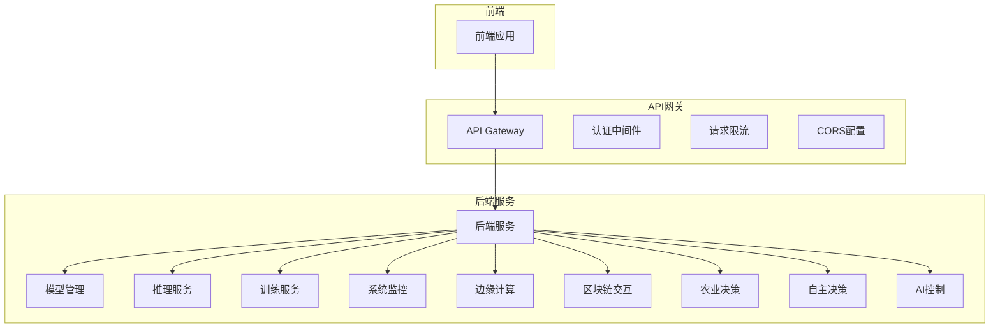
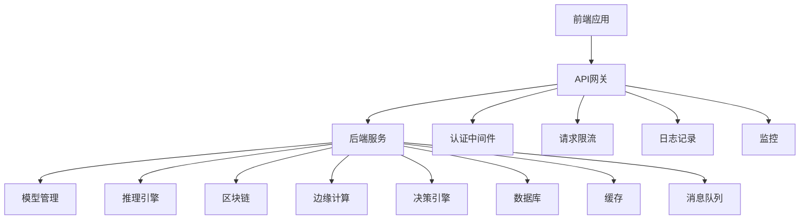
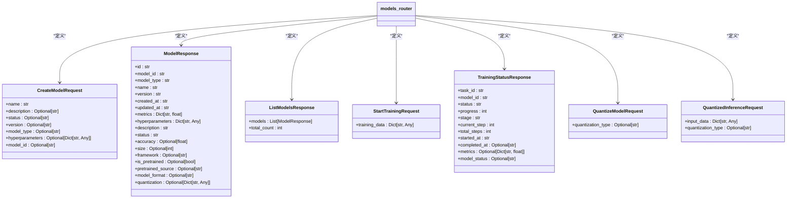
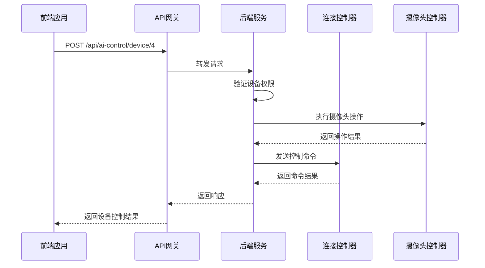
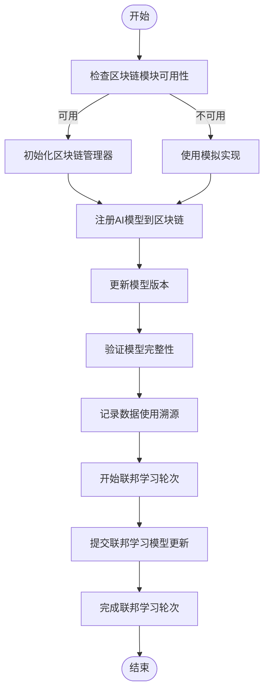
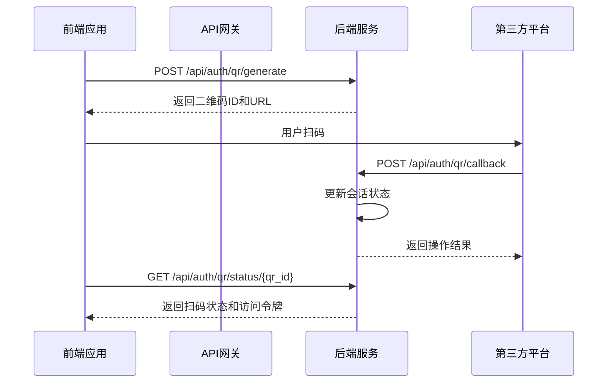
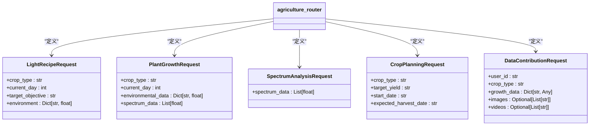
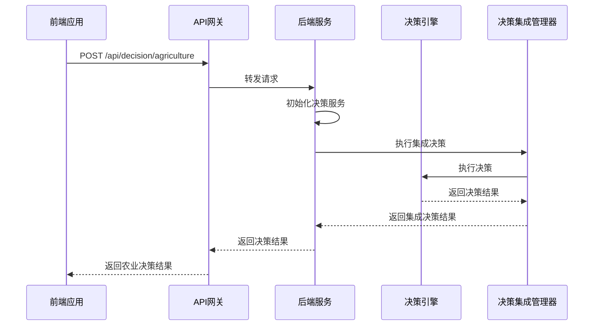
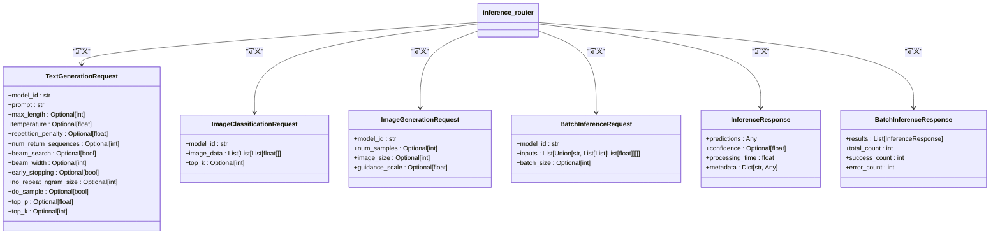
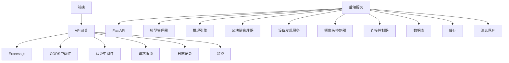

# API层设计

<cite>
**本文档引用的文件**   
- [api.py](file://backend/src/api.py)
- [main.py](file://backend/src/main.py)
- [simple_app.py](file://backend/src/api/simple_app.py)
- [models.py](file://backend/src/api/routes/models.py)
- [ai_control.py](file://backend/src/api/routes/ai_control.py)
- [blockchain.py](file://backend/src/api/routes/blockchain.py)
- [auth.py](file://backend/src/api/routes/auth.py)
- [agriculture.py](file://backend/src/api/routes/agriculture.py)
- [decision.py](file://backend/src/api/routes/decision.py)
- [inference.py](file://backend/src/api/routes/inference.py)
- [server.ts](file://api-gateway/src/server.ts)
- [router.ts](file://api-gateway/src/routing/router.ts)
- [auth.ts](file://api-gateway/src/middleware/auth.ts)
</cite>

## 目录
1. [简介](#简介)
2. [项目结构](#项目结构)
3. [核心组件](#核心组件)
4. [架构概述](#架构概述)
5. [详细组件分析](#详细组件分析)
6. [依赖分析](#依赖分析)
7. [性能考虑](#性能考虑)
8. [故障排除指南](#故障排除指南)
9. [结论](#结论)
10. [附录](#附录)（如有必要）

## 简介
本文档详细介绍了基于FastAPI构建的AI平台API层设计。该系统采用微服务架构，通过API网关统一管理多个后端服务，提供农业决策、AI控制、区块链交互、边缘计算等RESTful接口。文档将深入分析API路由模块、依赖注入机制、中间件集成、认证授权方案以及与前端和API网关的集成方式，为开发者提供完整的API使用和扩展指南。

## 项目结构
API层主要分布在`backend/src/api`目录下，采用模块化设计，每个功能领域都有独立的路由文件。系统通过API网关（api-gateway）统一入口，实现请求路由、认证、限流等功能。

**图源**
- [server.ts](file://api-gateway/src/server.ts#L1-L105)
- [router.ts](file://api-gateway/src/routing/router.ts#L1-L140)

**本节源**
- [api.py](file://backend/src/api.py#L1-L83)
- [main.py](file://backend/src/main.py#L1-L43)

## 核心组件
API层的核心组件包括FastAPI应用实例、路由模块、依赖注入系统、中间件和异常处理机制。系统通过`create_app()`函数创建FastAPI应用，注册CORS中间件以支持跨域请求，并通过`include_router()`方法集成各个功能模块的路由。API网关作为系统的统一入口，负责请求路由、认证、限流和监控。

**本节源**
- [api.py](file://backend/src/api.py#L6-L83)
- [server.ts](file://api-gateway/src/server.ts#L1-L105)

## 架构概述
系统采用分层架构设计，前端通过API网关访问后端服务。API网关基于Express.js构建，实现了请求路由、认证、限流、日志记录和监控等非功能性需求。后端服务基于FastAPI构建，提供高性能的RESTful API接口。系统支持两种部署模式：完整模式和简化模式，简化模式不依赖AI框架，只提供认证和社区功能。

**图源**
- [server.ts](file://api-gateway/src/server.ts#L1-L105)
- [api.py](file://backend/src/api.py#L6-L83)

## 详细组件分析

### 模型管理模块分析
模型管理模块提供模型的创建、查询、更新、删除、训练、量化等全生命周期管理功能。该模块通过`models.py`文件定义了完整的RESTful API接口，支持模型导入、版本管理、训练状态监控等高级功能。

#### 类图

**图源**
- [models.py](file://backend/src/api/routes/models.py#L1-L572)

**本节源**
- [models.py](file://backend/src/api/routes/models.py#L1-L572)

### AI控制模块分析
AI控制模块提供设备管理、AI主控、JEPA-DT-MPC融合预测等核心功能。该模块通过`ai_control.py`文件定义了控制设备、获取设备状态、激活AI主控、获取融合预测结果等API端点。

#### 序列图

**图源**
- [ai_control.py](file://backend/src/api/routes/ai_control.py#L1-L604)

**本节源**
- [ai_control.py](file://backend/src/api/routes/ai_control.py#L1-L604)

### 区块链交互模块分析
区块链交互模块提供模型注册、数据溯源、联邦学习等区块链相关功能。该模块通过`blockchain.py`文件定义了注册AI模型、更新模型版本、验证模型完整性、记录数据溯源等API端点。

#### 流程图

**图源**
- [blockchain.py](file://backend/src/api/routes/blockchain.py#L1-L416)

**本节源**
- [blockchain.py](file://backend/src/api/routes/blockchain.py#L1-L416)

### 认证授权模块分析
认证授权模块提供扫码登录、密码登录、用户注册等认证功能。该模块通过`auth.py`文件定义了生成二维码、检查扫码状态、处理扫码回调、密码登录等API端点。

#### 序列图

**图源**
- [auth.py](file://backend/src/api/routes/auth.py#L1-L343)

**本节源**
- [auth.py](file://backend/src/api/routes/auth.py#L1-L343)

### 农业决策模块分析
农业决策模块提供光配方生成、植物生长预测、光谱分析、种植规划等农业AI功能。该模块通过`agriculture.py`文件定义了生成光配方、预测植物生长、分析光谱数据、制定种植计划等API端点。

#### 类图

**图源**
- [agriculture.py](file://backend/src/api/routes/agriculture.py#L1-L319)

**本节源**
- [agriculture.py](file://backend/src/api/routes/agriculture.py#L1-L319)

### 自主决策模块分析
自主决策模块提供农业参数优化、风险分析、批量决策等决策功能。该模块通过`decision.py`文件定义了农业决策、风险分析决策、批量农业决策、提供决策反馈等API端点。

#### 序列图

**图源**
- [decision.py](file://backend/src/api/routes/decision.py#L1-L376)

**本节源**
- [decision.py](file://backend/src/api/routes/decision.py#L1-L376)

### 推理服务模块分析
推理服务模块提供文本生成、图像分类、图像生成、批量推理等推理功能。该模块通过`inference.py`文件定义了文本生成、图像分类、图像生成、批量推理等API端点，并实现了API密钥认证。

#### 类图

**图源**
- [inference.py](file://backend/src/api/routes/inference.py#L1-L284)

**本节源**
- [inference.py](file://backend/src/api/routes/inference.py#L1-L284)

## 依赖分析
系统通过API网关统一管理多个后端服务的依赖关系。API网关依赖Express.js框架和多个中间件（CORS、认证、限流、日志等），后端服务依赖FastAPI框架和多个核心服务（模型管理、推理引擎、区块链管理等）。

**图源**
- [package.json](file://api-gateway/package.json#L1-L20)
- [requirements.txt](file://backend/requirements.txt#L1-L10)

**本节源**
- [server.ts](file://api-gateway/src/server.ts#L1-L105)
- [api.py](file://backend/src/api.py#L6-L83)

## 性能考虑
系统在设计时充分考虑了性能因素。API网关实现了请求限流和压缩，后端服务采用了异步编程模型和缓存机制。模型管理模块支持模型量化和批量推理，推理服务模块实现了推理缓存和批量处理。系统还提供了性能监控接口，可以实时监控API调用性能。

**本节源**
- [server.ts](file://api-gateway/src/server.ts#L40-L45)
- [inference.py](file://backend/src/api/routes/inference.py#L245-L284)

## 故障排除指南
当API调用出现问题时，可以按照以下步骤进行排查：
1. 检查API网关是否正常运行
2. 检查后端服务是否正常运行
3. 检查API密钥是否正确
4. 检查请求参数是否符合要求
5. 查看日志文件获取详细错误信息

**本节源**
- [error.ts](file://api-gateway/src/middleware/error.ts#L1-L20)
- [logging.ts](file://api-gateway/src/middleware/logging.ts#L1-L20)

## 结论
本文档详细介绍了基于FastAPI构建的API层设计。系统采用微服务架构，通过API网关统一管理多个后端服务，提供了完整的农业决策、AI控制、区块链交互、边缘计算等RESTful接口。API设计遵循RESTful规范，支持版本控制、安全性配置和错误处理，为开发者提供了良好的使用体验。

## 附录
### API端点列表
| 模块 | HTTP方法 | URL路径 | 功能描述 |
| --- | --- | --- | --- |
| 模型管理 | POST | /api/models | 创建新模型 |
| 模型管理 | GET | /api/models | 获取模型列表 |
| 模型管理 | GET | /api/models/{model_id} | 获取模型详情 |
| 模型管理 | DELETE | /api/models/{model_id} | 删除模型 |
| 模型管理 | POST | /api/models/{model_id}/train | 开始模型训练 |
| 模型管理 | GET | /api/models/training/{task_id} | 获取训练任务状态 |
| AI控制 | GET | /api/ai-control/devices | 获取所有设备列表 |
| AI控制 | POST | /api/ai-control/device/{device_id} | 控制指定设备 |
| AI控制 | GET | /api/ai-control/device/{device_id}/status | 获取指定设备状态 |
| AI控制 | POST | /api/ai-control/master-control | 激活/关闭AI主控功能 |
| 区块链 | GET | /api/blockchain/status | 获取区块链系统状态 |
| 区块链 | POST | /api/blockchain/models/register | 注册AI模型到区块链 |
| 区块链 | GET | /api/blockchain/models/{model_id}/verify | 验证模型完整性 |
| 认证 | POST | /api/auth/qr/generate | 生成扫码登录的二维码 |
| 认证 | GET | /api/auth/qr/status/{qr_id} | 检查扫码登录状态 |
| 认证 | POST | /api/auth/qr/callback | 扫码回调接口 |
| 认证 | POST | /api/auth/login | 密码登录接口 |
| 农业决策 | POST | /api/agriculture/light-recipe | 生成光配方 |
| 农业决策 | POST | /api/agriculture/growth-prediction | 预测植物生长状态 |
| 农业决策 | POST | /api/agriculture/spectrum-analysis | 分析光谱数据 |
| 农业决策 | GET | /api/agriculture/crop-configs | 获取可用的作物配置 |
| 自主决策 | POST | /api/decision/agriculture | 农业参数优化决策 |
| 自主决策 | POST | /api/decision/agriculture/batch | 批量农业决策 |
| 自主决策 | POST | /api/decision/feedback | 提供决策反馈 |
| 推理服务 | POST | /api/inference/text/generation | 文本生成推理 |
| 推理服务 | POST | /api/inference/image/classification | 图像分类推理 |
| 推理服务 | POST | /api/inference/image/generation | 图像生成推理 |
| 推理服务 | POST | /api/inference/batch | 批量推理 |

### 错误码说明
| HTTP状态码 | 错误码 | 描述 |
| --- | --- | --- |
| 400 | BAD_REQUEST | 请求参数错误 |
| 401 | UNAUTHORIZED | 未授权，缺少或无效的认证信息 |
| 403 | FORBIDDEN | 禁止访问，权限不足 |
| 404 | NOT_FOUND | 资源未找到 |
| 429 | TOO_MANY_REQUESTS | 请求过于频繁，已达到限流阈值 |
| 500 | INTERNAL_SERVER_ERROR | 服务器内部错误 |
| 503 | SERVICE_UNAVAILABLE | 服务不可用，如区块链模块未初始化 |