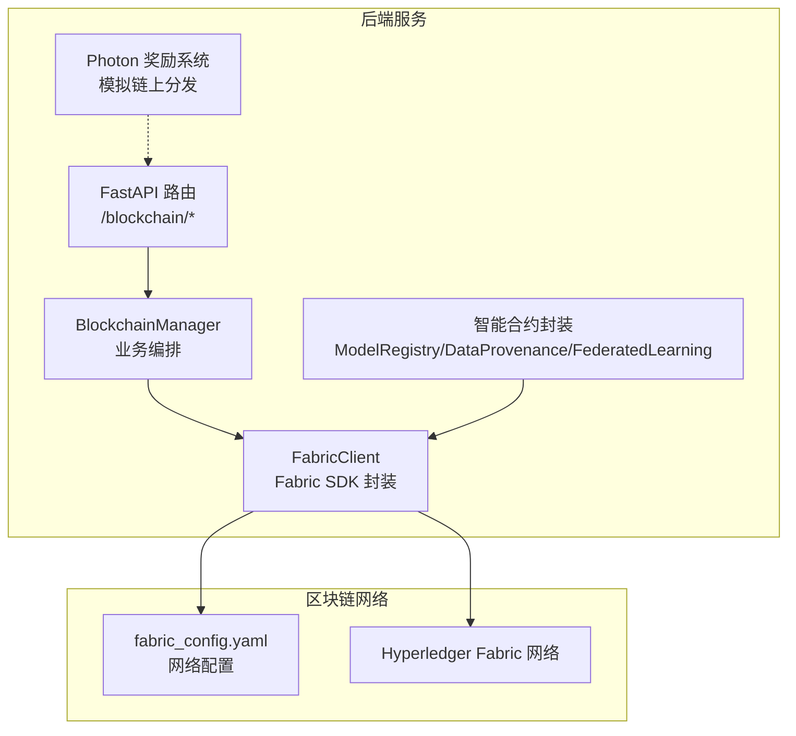
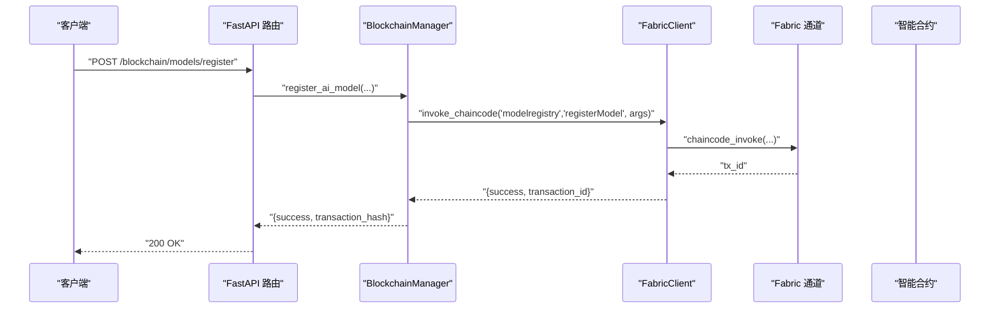
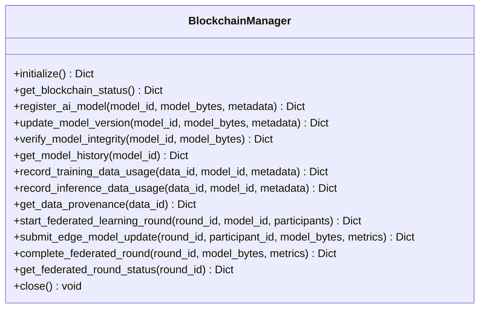
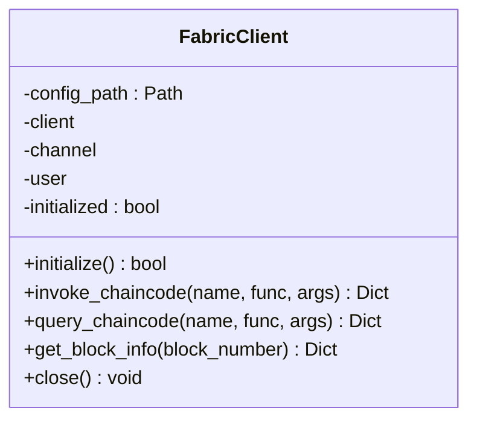
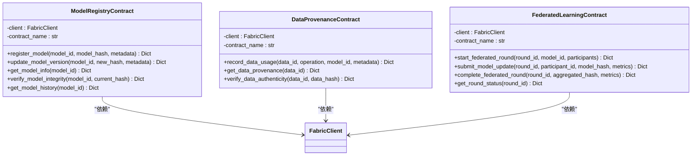
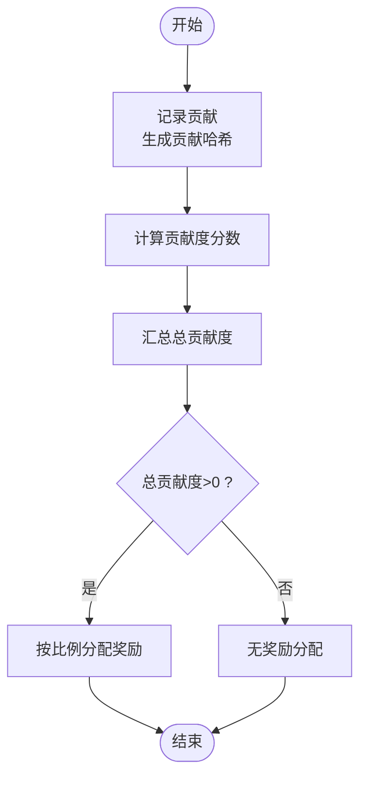
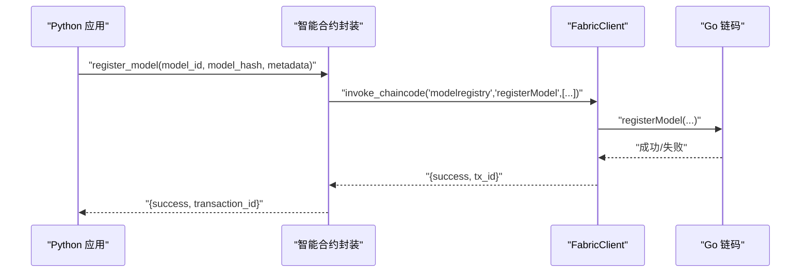
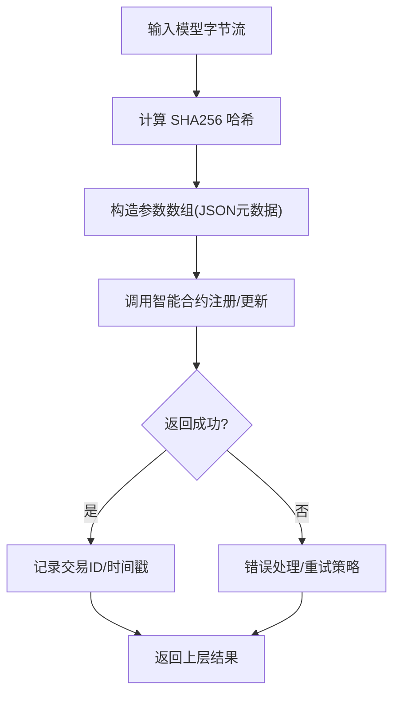
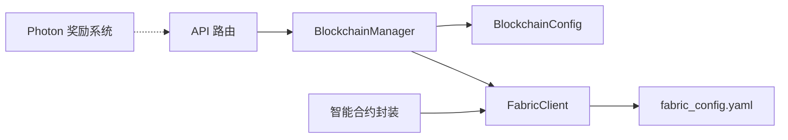

# 区块链集成模块

<cite>
**本文引用的文件列表**
- [backend/src/blockchain/blockchain_manager.py](file://backend/src/blockchain/blockchain_manager.py)
- [backend/src/blockchain/fabric_client.py](file://backend/src/blockchain/fabric_client.py)
- [backend/src/blockchain/smart_contracts.py](file://backend/src/blockchain/smart_contracts.py)
- [backend/src/blockchain/photon_rewards.py](file://backend/src/blockchain/photon_rewards.py)
- [backend/src/blockchain/config.py](file://backend/src/blockchain/config.py)
- [backend/blockchain/fabric_config.yaml](file://backend/blockchain/fabric_config.yaml)
- [backend/blockchain/smart_contracts_example.go](file://backend/blockchain/smart_contracts_example.go)
- [backend/src/api/routes/blockchain.py](file://backend/src/api/routes/blockchain.py)
- [backend/src/blockchain/__init__.py](file://backend/src/blockchain/__init__.py)
</cite>

## 目录
1. [简介](#简介)
2. [项目结构](#项目结构)
3. [核心组件](#核心组件)
4. [架构总览](#架构总览)
5. [详细组件分析](#详细组件分析)
6. [依赖关系分析](#依赖关系分析)
7. [性能考量](#性能考量)
8. [故障排查指南](#故障排查指南)
9. [结论](#结论)
10. [附录](#附录)

## 简介
本技术文档聚焦于后端区块链集成模块，系统性阐述其与 Hyperledger Fabric 的交互机制，包括：
- 通过 Fabric 客户端与 Fabric 网络通信，执行智能合约调用与状态查询
- 数据上链流程：模型版本记录、决策溯源、联邦学习轮次与更新
- PHOTON 奖励分发逻辑（包含模拟链上执行）
- 配置文件结构与证书管理策略
- 链码（Go 语言）示例与 SDK 调用模式
- 交易确认机制、错误重试策略与安全性保障（私钥保护）
- 链码升级与事件监听的集成指导

该模块采用“管理器-客户端-合约封装”的分层设计，既支持开发模式下的模拟实现，也预留了接入真实 Fabric 网络的能力。

## 项目结构
区块链集成模块位于后端工程的 blockchain 子目录，配合 FastAPI 路由对外暴露 REST 接口，并通过 Fabric 客户端与 Hyperledger Fabric 网络交互。

图表来源
- [backend/src/api/routes/blockchain.py](file://backend/src/api/routes/blockchain.py#L1-L120)
- [backend/src/blockchain/blockchain_manager.py](file://backend/src/blockchain/blockchain_manager.py#L1-L120)
- [backend/src/blockchain/fabric_client.py](file://backend/src/blockchain/fabric_client.py#L1-L120)
- [backend/blockchain/fabric_config.yaml](file://backend/blockchain/fabric_config.yaml#L1-L45)

章节来源
- [backend/src/blockchain/__init__.py](file://backend/src/blockchain/__init__.py#L1-L17)
- [backend/src/api/routes/blockchain.py](file://backend/src/api/routes/blockchain.py#L1-L120)

## 核心组件
- BlockchainManager：面向业务的统一入口，负责模型注册/版本更新/完整性校验/历史查询、数据溯源记录、联邦学习轮次生命周期管理等。
- FabricClient：对 Hyperledger Fabric SDK 的异步封装，提供智能合约调用、查询、区块信息获取以及通道健康检查。
- 智能合约封装：ModelRegistryContract、DataProvenanceContract、FederatedLearningContract，将 Fabric 合约函数映射为 Python 异步方法。
- Photon 奖励系统：提供贡献度评分与奖励分配的算法实现，并提供智能合约接口模拟用于演示链上分发。
- 配置模块：集中管理网络类型、账户、Gas、合约 ABI 与 Fabric 网络配置。
- Fabric 网络配置：YAML 文件定义组织、通道、节点、CA 等 Fabric 网络参数。

章节来源
- [backend/src/blockchain/blockchain_manager.py](file://backend/src/blockchain/blockchain_manager.py#L1-L120)
- [backend/src/blockchain/fabric_client.py](file://backend/src/blockchain/fabric_client.py#L1-L120)
- [backend/src/blockchain/smart_contracts.py](file://backend/src/blockchain/smart_contracts.py#L1-L120)
- [backend/src/blockchain/photon_rewards.py](file://backend/src/blockchain/photon_rewards.py#L1-L120)
- [backend/src/blockchain/config.py](file://backend/src/blockchain/config.py#L1-L80)
- [backend/blockchain/fabric_config.yaml](file://backend/blockchain/fabric_config.yaml#L1-L45)

## 架构总览
以下序列图展示了从 API 路由到 Fabric 的调用链路，以及智能合约封装层的作用。

图表来源
- [backend/src/api/routes/blockchain.py](file://backend/src/api/routes/blockchain.py#L100-L160)
- [backend/src/blockchain/blockchain_manager.py](file://backend/src/blockchain/blockchain_manager.py#L94-L128)
- [backend/src/blockchain/fabric_client.py](file://backend/src/blockchain/fabric_client.py#L83-L135)
- [backend/src/blockchain/smart_contracts.py](file://backend/src/blockchain/smart_contracts.py#L20-L61)

## 详细组件分析

### BlockchainManager 组件
- 职责：统一编排区块链相关业务，包括模型注册/版本更新/完整性校验/历史查询、数据溯源记录、联邦学习轮次生命周期管理。
- 关键能力：
  - 初始化与状态检查：支持开发模式与生产模式切换；开发模式下返回模拟状态。
  - 模型管理：注册模型（计算哈希、记录版本）、更新版本（追加历史）、完整性校验、历史查询。
  - 数据溯源：记录训练/推理数据使用，支持按 data_id 查询完整溯源链。
  - 联邦学习：启动轮次、提交边缘节点更新、完成轮次并记录聚合结果。
- 设计要点：所有与 Fabric 的交互在智能合约封装层完成；本层保留业务语义与数据结构转换。

图表来源
- [backend/src/blockchain/blockchain_manager.py](file://backend/src/blockchain/blockchain_manager.py#L1-L366)

章节来源
- [backend/src/blockchain/blockchain_manager.py](file://backend/src/blockchain/blockchain_manager.py#L1-L366)

### FabricClient 组件
- 职责：对 Hyperledger Fabric SDK 的异步封装，负责客户端初始化、通道健康检查、智能合约调用/查询、区块信息获取。
- 关键能力：
  - initialize：加载 YAML 网络配置，获取组织管理员用户与通道，进行健康检查。
  - invoke_chaincode/query_chaincode：封装链码调用与查询，返回统一结构。
  - get_block_info：获取区块头信息（模拟实现与真实实现并存）。
  - close：释放连接资源。
- 错误处理：捕获异常并返回统一错误结构，记录日志。

图表来源
- [backend/src/blockchain/fabric_client.py](file://backend/src/blockchain/fabric_client.py#L1-L222)

章节来源
- [backend/src/blockchain/fabric_client.py](file://backend/src/blockchain/fabric_client.py#L1-L222)

### 智能合约封装（ModelRegistry/DataProvenance/FederatedLearning）
- 职责：将 Fabric 合约函数映射为 Python 异步方法，统一参数序列化与返回值解析。
- ModelRegistryContract：注册模型、更新版本、查询模型信息、验证完整性、查询历史。
- DataProvenanceContract：记录数据使用、查询溯源、验证数据真实性。
- FederatedLearningContract：启动轮次、提交更新、完成轮次、查询状态。
- 参数约定：将 JSON 字符串作为元数据传递，时间戳附加在调用侧。

图表来源
- [backend/src/blockchain/smart_contracts.py](file://backend/src/blockchain/smart_contracts.py#L1-L249)

章节来源
- [backend/src/blockchain/smart_contracts.py](file://backend/src/blockchain/smart_contracts.py#L1-L249)

### PHOTON 奖励分发系统
- 职责：计算边缘节点贡献度并分配 PHOTON 奖励，提供模拟链上执行接口。
- 核心流程：
  - 记录贡献：收集模型改进度、数据质量、推理速度等指标，生成贡献哈希。
  - 计算得分：按权重计算贡献度分数。
  - 分配奖励：按总贡献归一化分配奖励池。
  - 模拟链上执行：打印交易分发过程。
- 适用场景：分布式 DCNN 场景中的激励与治理。

图表来源
- [backend/src/blockchain/photon_rewards.py](file://backend/src/blockchain/photon_rewards.py#L1-L165)

章节来源
- [backend/src/blockchain/photon_rewards.py](file://backend/src/blockchain/photon_rewards.py#L1-L165)

### 配置与证书管理
- 配置文件结构（YAML）：
  - client.organization、credentialStore（路径）
  - channels.mychannel.orderers/peers
  - organizations.Org1.mspid、peers、certificateAuthorities
  - orderers、peers、certificateAuthorities 的 URL、TLS 选项
- 配置加载：
  - FabricClient 读取 YAML 并初始化网络配置
  - BlockchainConfig 提供网络类型、账户、Gas、合约 ABI 等配置
- 证书与身份：
  - YAML 中定义 CA、Peer、Orderer 的 URL 与 TLS 选项
  - FabricClient 获取组织管理员用户并建立通道

章节来源
- [backend/blockchain/fabric_config.yaml](file://backend/blockchain/fabric_config.yaml#L1-L45)
- [backend/src/blockchain/config.py](file://backend/src/blockchain/config.py#L1-L80)
- [backend/src/blockchain/fabric_client.py](file://backend/src/blockchain/fabric_client.py#L38-L76)

### 链码（Go 语言）示例与 SDK 调用模式
- 链码示例（ModelRegistry）：
  - 结构体：ModelInfo、ModelVersion
  - 函数：RegisterModel、UpdateModelVersion、GetModelInfo、VerifyModelIntegrity、GetModelHistory
  - 状态存储：使用 PutState/GetState，版本历史使用复合键
- SDK 调用模式：
  - 通过 FabricClient.invoke_chaincode/query_chaincode 传入合约名、函数名与参数数组
  - 智能合约封装层负责参数序列化与返回值解析

图表来源
- [backend/src/blockchain/smart_contracts.py](file://backend/src/blockchain/smart_contracts.py#L20-L61)
- [backend/src/blockchain/fabric_client.py](file://backend/src/blockchain/fabric_client.py#L83-L135)
- [backend/blockchain/smart_contracts_example.go](file://backend/blockchain/smart_contracts_example.go#L1-L246)

章节来源
- [backend/blockchain/smart_contracts_example.go](file://backend/blockchain/smart_contracts_example.go#L1-L246)
- [backend/src/blockchain/smart_contracts.py](file://backend/src/blockchain/smart_contracts.py#L1-L249)
- [backend/src/blockchain/fabric_client.py](file://backend/src/blockchain/fabric_client.py#L83-L135)

### 数据上链流程（模型版本记录、决策溯源）
- 模型版本记录：
  - 业务层计算模型哈希，调用 register_ai_model/update_model_version
  - 智能合约封装层将元数据序列化为 JSON，调用 Fabric 合约
  - 链上存储模型信息与版本历史，返回交易 ID
- 决策溯源：
  - 业务层调用 record_training_data_usage/record_inference_data_usage
  - 生成溯源记录并保存；查询时按 data_id 返回完整链路
- 交易确认机制：
  - FabricClient 在调用链码时设置等待事件，返回 tx_id 表示已提交
  - 区块信息可通过 get_block_info 获取区块头哈希与交易数

图表来源
- [backend/src/blockchain/blockchain_manager.py](file://backend/src/blockchain/blockchain_manager.py#L94-L158)
- [backend/src/blockchain/smart_contracts.py](file://backend/src/blockchain/smart_contracts.py#L20-L61)
- [backend/src/blockchain/fabric_client.py](file://backend/src/blockchain/fabric_client.py#L83-L135)

章节来源
- [backend/src/blockchain/blockchain_manager.py](file://backend/src/blockchain/blockchain_manager.py#L94-L204)
- [backend/src/blockchain/smart_contracts.py](file://backend/src/blockchain/smart_contracts.py#L1-L120)
- [backend/src/blockchain/fabric_client.py](file://backend/src/blockchain/fabric_client.py#L83-L135)

### 交易确认机制、错误重试策略与安全性保障
- 交易确认：
  - FabricClient.invoke_chaincode 设置等待事件，返回 tx_id
  - 区块信息获取用于校验区块哈希与交易数量
- 错误重试策略建议：
  - 对网络异常或超时的调用进行指数退避重试
  - 对业务幂等操作（如重复注册）进行去重判断
  - 对 Fabric 通道健康检查失败时降级为模拟模式
- 安全性保障：
  - 配置模块提供账户与私钥字段（开发用途），生产环境应通过安全密钥管理服务注入
  - Fabric 网络配置启用 TLS 与证书校验（YAML 中已体现）

章节来源
- [backend/src/blockchain/fabric_client.py](file://backend/src/blockchain/fabric_client.py#L83-L135)
- [backend/src/blockchain/fabric_client.py](file://backend/src/blockchain/fabric_client.py#L177-L214)
- [backend/src/blockchain/config.py](file://backend/src/blockchain/config.py#L1-L80)
- [backend/blockchain/fabric_config.yaml](file://backend/blockchain/fabric_config.yaml#L25-L45)

### 链码升级与事件监听集成指导
- 链码升级：
  - 通过 Fabric CLI 或 SDK 升级链码版本，确保合约名与通道一致
  - 升级后更新智能合约封装层的合约名与函数签名
- 事件监听：
  - FabricClient 支持通过 eventUrl 监听事件（YAML 中已配置）
  - 在 invoke_chaincode 时可设置等待事件，结合 get_block_info 校验区块确认

章节来源
- [backend/blockchain/fabric_config.yaml](file://backend/blockchain/fabric_config.yaml#L32-L45)
- [backend/src/blockchain/fabric_client.py](file://backend/src/blockchain/fabric_client.py#L177-L214)

## 依赖关系分析
- 模块耦合：
  - API 路由依赖 BlockchainManager
  - BlockchainManager 依赖 FabricClient 与配置模块
  - 智能合约封装依赖 FabricClient
  - PHOTON 奖励系统独立，可与 API 路由组合使用
- 外部依赖：
  - Hyperledger Fabric SDK（hfc）用于真实网络
  - FastAPI 用于 REST 接口
  - Pydantic Settings 用于配置管理

图表来源
- [backend/src/api/routes/blockchain.py](file://backend/src/api/routes/blockchain.py#L1-L120)
- [backend/src/blockchain/blockchain_manager.py](file://backend/src/blockchain/blockchain_manager.py#L1-L60)
- [backend/src/blockchain/fabric_client.py](file://backend/src/blockchain/fabric_client.py#L1-L60)
- [backend/src/blockchain/config.py](file://backend/src/blockchain/config.py#L1-L80)
- [backend/blockchain/fabric_config.yaml](file://backend/blockchain/fabric_config.yaml#L1-L45)
- [backend/src/blockchain/smart_contracts.py](file://backend/src/blockchain/smart_contracts.py#L1-L60)
- [backend/src/blockchain/photon_rewards.py](file://backend/src/blockchain/photon_rewards.py#L1-L60)

章节来源
- [backend/src/api/routes/blockchain.py](file://backend/src/api/routes/blockchain.py#L1-L120)
- [backend/src/blockchain/__init__.py](file://backend/src/blockchain/__init__.py#L1-L17)

## 性能考量
- 异步调用：FabricClient 与 BlockchainManager 均采用异步实现，适合高并发场景
- 模拟模式：开发模式下使用模拟实现，降低本地调试成本
- 负载与吞吐：Fabric 通道配置与节点规模直接影响吞吐；建议在生产环境合理配置 peers/orderers 数量
- 日志与监控：FabricClient 记录错误日志，建议结合外部监控系统追踪交易耗时与成功率

## 故障排查指南
- 初始化失败：
  - 检查 fabric_config.yaml 是否正确，组织/通道/节点/CA 配置是否可达
  - 确认 FabricClient 初始化返回成功
- 通道健康检查失败：
  - 检查 orderer/peer 的 URL 与 TLS 配置
  - 确认 CA 证书与 ssl-target-name-override 设置
- 调用链码失败：
  - 检查合约名、函数名与参数数组是否匹配
  - 查看返回的错误字段与时间戳，定位具体问题
- 区块信息获取失败：
  - 确认区块号有效且通道存在
  - 检查网络连通性与权限

章节来源
- [backend/src/blockchain/fabric_client.py](file://backend/src/blockchain/fabric_client.py#L38-L135)
- [backend/blockchain/fabric_config.yaml](file://backend/blockchain/fabric_config.yaml#L25-L45)

## 结论
本区块链集成模块以 FabricClient 为核心，向上提供统一的业务编排（BlockchainManager），向下封装智能合约调用（smart_contracts.py），并辅以配置与 PHOTON 奖励系统。模块具备良好的扩展性与可测试性，既支持开发模式下的快速迭代，也为接入真实 Fabric 网络提供了清晰的路径。建议在生产环境中强化密钥与证书管理、完善重试与可观测性，并持续优化链码与网络配置以满足性能需求。

## 附录
- API 路由概览（部分）
  - GET /blockchain/status：获取系统状态
  - POST /blockchain/models/register：注册模型
  - PUT /blockchain/models/{model_id}/version：更新模型版本
  - GET /blockchain/models/{model_id}/verify：验证模型完整性
  - GET /blockchain/models/{model_id}/history：获取模型历史
  - POST /blockchain/data/provenance：记录数据使用溯源
  - GET /blockchain/data/{data_id}/provenance：获取数据溯源
  - POST /blockchain/federated/rounds/start：开始联邦学习轮次
  - POST /blockchain/federated/rounds/{round_id}/submit：提交模型更新
  - POST /blockchain/federated/rounds/{round_id}/complete：完成轮次
  - GET /blockchain/federated/rounds/{round_id}/status：获取轮次状态
  - GET /blockchain/config：获取配置信息

章节来源
- [backend/src/api/routes/blockchain.py](file://backend/src/api/routes/blockchain.py#L61-L416)