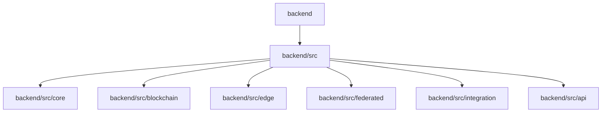
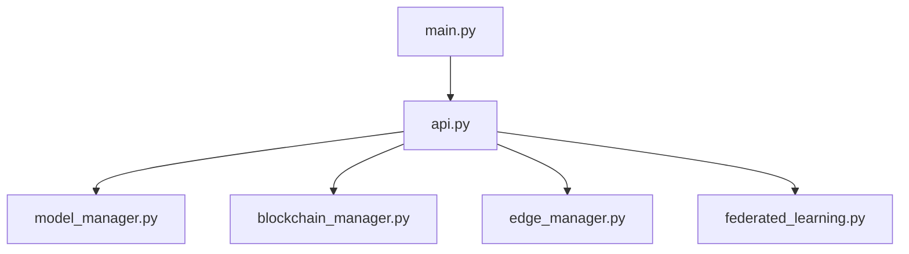
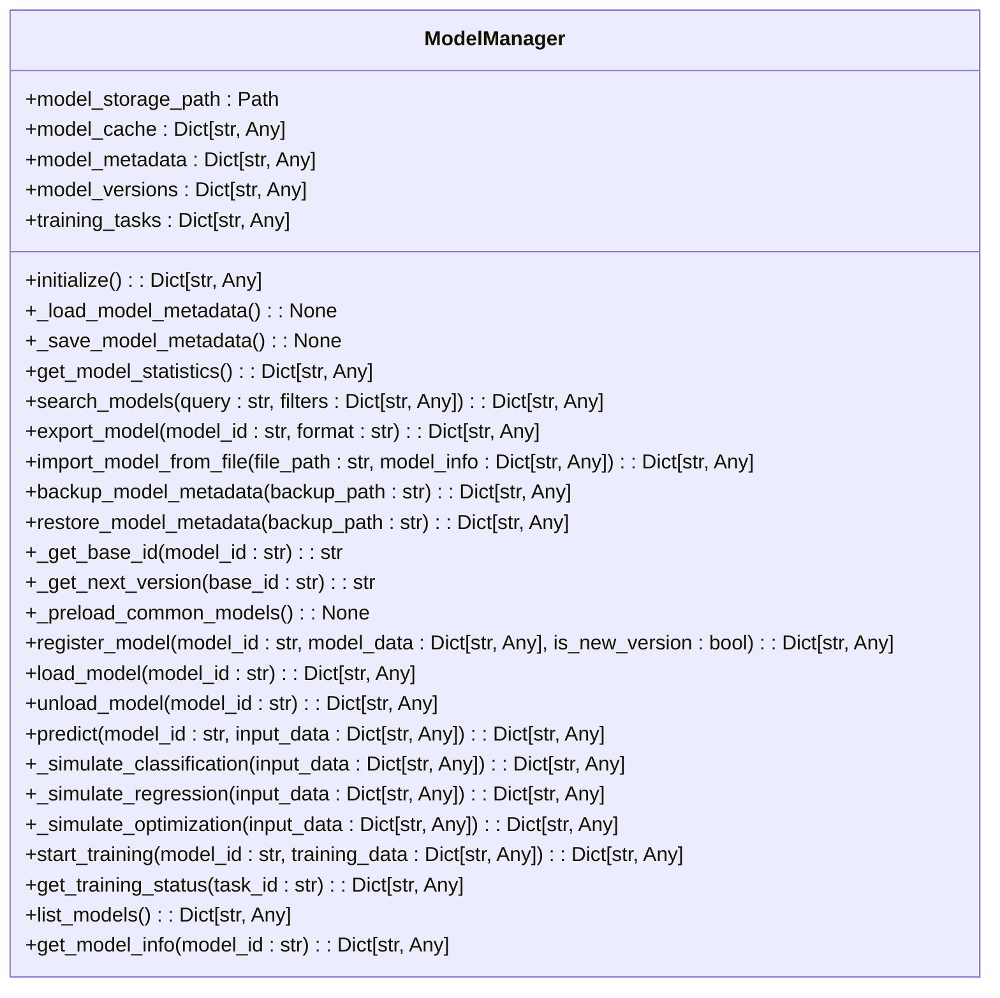
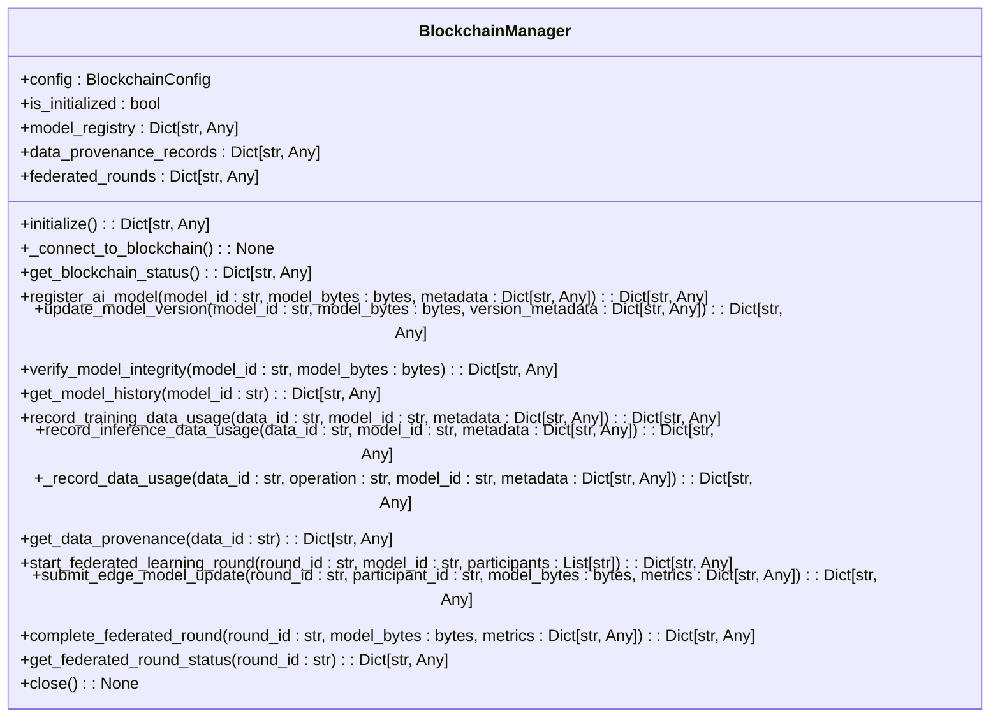
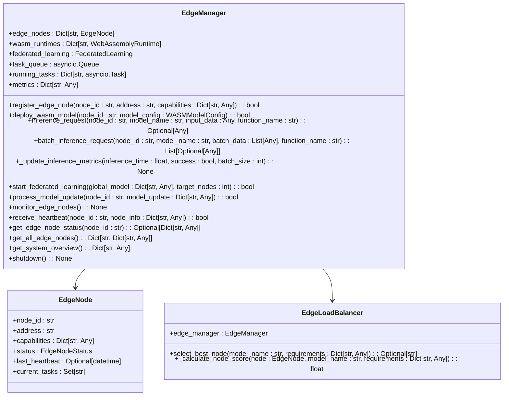
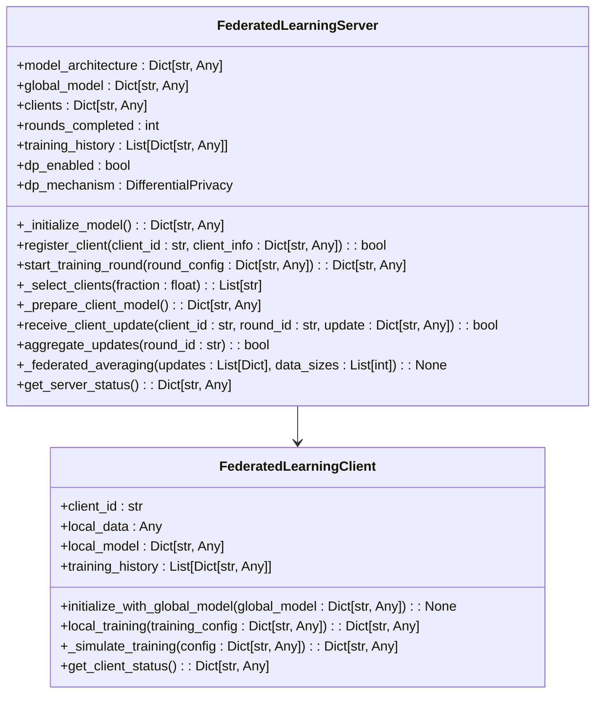

# 后端架构

<cite>
**本文档引用的文件**   
- [main.py](file://backend/src/main.py)
- [api.py](file://backend/src/api.py)
- [model_manager.py](file://backend/src/core/services/model_manager.py)
- [blockchain_manager.py](file://backend/src/blockchain/blockchain_manager.py)
- [edge_manager.py](file://backend/src/edge/edge_manager.py)
- [federated_learning.py](file://backend/src/federated/federated_learning.py)
- [decision_engine.py](file://backend/src/core/decision_engine.py)
- [decision_manager.py](file://backend/src/core/decision/decision_manager.py)
- [decision_integration.py](file://backend/src/integration/decision_integration.py)
- [models.py](file://backend/src/api/routes/models.py)
- [ai_control.py](file://backend/src/api/routes/ai_control.py)
- [blockchain.py](file://backend/src/api/routes/blockchain.py)
- [pyproject.toml](file://backend/pyproject.toml)
- [requirements.txt](file://backend/requirements.txt)
- [.env](file://backend/.env)
</cite>

## 目录
1. [简介](#简介)
2. [项目结构](#项目结构)
3. [核心组件](#核心组件)
4. [架构概览](#架构概览)
5. [详细组件分析](#详细组件分析)
6. [依赖分析](#依赖分析)
7. [性能考虑](#性能考虑)
8. [故障排除指南](#故障排除指南)
9. [结论](#结论)

## 简介
本文档详细描述了基于FastAPI的后端服务架构，涵盖了RESTful服务设计、核心业务逻辑分层与模块化组织。文档说明了`src`目录下各子模块（如`core`、`blockchain`、`edge`、`federated`）的职责与交互方式，文档化了服务启动流程、依赖注入机制与配置管理策略。同时，文档解释了AI模型管理、决策引擎调度与区块链交互的内部实现逻辑，提供了后端服务的性能优化实践（如异步处理、缓存策略）与安全控制（如输入验证、速率限制），并为后端开发者提供了API扩展、模块开发与集成测试的指导原则。

## 项目结构
后端服务的项目结构清晰地组织了各个功能模块，确保了代码的可维护性和可扩展性。`src`目录下的子模块分别负责不同的业务逻辑，如`core`模块负责核心服务和决策引擎，`blockchain`模块负责区块链操作，`edge`模块负责边缘计算管理，`federated`模块负责联邦学习。此外，`api`模块负责提供RESTful API接口，`integration`模块负责集成各个子模块的功能。

**图源**
- [backend](file://backend)
- [src](file://backend/src)

**章节源**
- [backend](file://backend)
- [src](file://backend/src)

## 核心组件
后端服务的核心组件包括`main.py`、`api.py`、`model_manager.py`、`blockchain_manager.py`、`edge_manager.py`和`federated_learning.py`。这些组件共同构成了服务的基础，提供了从服务启动到具体业务逻辑处理的完整功能。

**章节源**
- [main.py](file://backend/src/main.py)
- [api.py](file://backend/src/api.py)
- [model_manager.py](file://backend/src/core/services/model_manager.py)
- [blockchain_manager.py](file://backend/src/blockchain/blockchain_manager.py)
- [edge_manager.py](file://backend/src/edge/edge_manager.py)
- [federated_learning.py](file://backend/src/federated/federated_learning.py)

## 架构概览
后端服务采用微服务架构，基于FastAPI构建RESTful API，通过模块化设计实现了高内聚低耦合。服务启动时，`main.py`负责初始化Flax兼容性补丁并创建FastAPI应用实例。`api.py`定义了API路由和中间件，集成了所有服务模块，提供统一的API接口。`model_manager.py`负责AI模型的管理、训练和推理，`blockchain_manager.py`负责区块链操作，`edge_manager.py`负责边缘计算管理，`federated_learning.py`负责联邦学习。

**图源**
- [main.py](file://backend/src/main.py)
- [api.py](file://backend/src/api.py)
- [model_manager.py](file://backend/src/core/services/model_manager.py)
- [blockchain_manager.py](file://backend/src/blockchain/blockchain_manager.py)
- [edge_manager.py](file://backend/src/edge/edge_manager.py)
- [federated_learning.py](file://backend/src/federated/federated_learning.py)

## 详细组件分析
### 模型管理器分析
`model_manager.py`是后端服务的核心组件之一，负责AI模型的管理、训练和推理。它提供了模型的注册、加载、卸载、预测、训练和版本管理等功能。模型管理器通过异步处理和缓存策略优化了性能，确保了模型的高效使用。

#### 类图

**图源**
- [model_manager.py](file://backend/src/core/services/model_manager.py)

### 区块链管理器分析
`blockchain_manager.py`负责区块链操作，提供了区块链连接、状态检查、模型注册、版本更新、完整性验证、数据溯源记录和联邦学习轮次管理等功能。它通过模拟实现支持开发模式，确保了服务的灵活性和可测试性。

#### 类图

**图源**
- [blockchain_manager.py](file://backend/src/blockchain/blockchain_manager.py)

### 边缘计算管理器分析
`edge_manager.py`负责边缘计算管理，协调WebAssembly边缘节点和联邦学习客户端。它提供了边缘节点注册、WASM模型部署、推理请求处理、批量推理、联邦学习启动、模型更新处理、边缘节点监控、心跳接收、节点状态获取、系统概览和负载均衡等功能。

#### 类图

**图源**
- [edge_manager.py](file://backend/src/edge/edge_manager.py)

### 联邦学习分析
`federated_learning.py`负责联邦学习，实现了联邦学习算法，支持多设备协同训练。它提供了联邦学习服务器和客户端的实现，支持模型注册、版本更新、完整性验证、数据溯源记录和联邦学习轮次管理。

#### 类图

**图源**
- [federated_learning.py](file://backend/src/federated/federated_learning.py)

## 依赖分析
后端服务的依赖关系清晰，各模块之间通过明确的接口进行交互。`main.py`依赖`api.py`，`api.py`依赖`model_manager.py`、`blockchain_manager.py`、`edge_manager.py`和`federated_learning.py`。这些模块之间通过异步处理和事件驱动的方式进行通信，确保了服务的高效性和可扩展性。

**图源**
- [main.py](file://backend/src/main.py)
- [api.py](file://backend/src/api.py)
- [model_manager.py](file://backend/src/core/services/model_manager.py)
- [blockchain_manager.py](file://backend/src/blockchain/blockchain_manager.py)
- [edge_manager.py](file://backend/src/edge/edge_manager.py)
- [federated_learning.py](file://backend/src/federated/federated_learning.py)

## 性能考虑
后端服务通过异步处理和缓存策略优化了性能。`model_manager.py`通过异步处理和缓存策略确保了模型的高效使用，`edge_manager.py`通过负载均衡和批量推理优化了边缘计算的性能，`federated_learning.py`通过联邦平均算法和差分隐私机制优化了联邦学习的性能。

## 故障排除指南
后端服务的故障排除指南包括日志记录、错误处理和监控。`model_manager.py`通过日志记录和错误处理确保了模型管理的可靠性，`blockchain_manager.py`通过状态检查和错误处理确保了区块链操作的可靠性，`edge_manager.py`通过监控和心跳接收确保了边缘计算的可靠性，`federated_learning.py`通过状态检查和错误处理确保了联邦学习的可靠性。

**章节源**
- [model_manager.py](file://backend/src/core/services/model_manager.py)
- [blockchain_manager.py](file://backend/src/blockchain/blockchain_manager.py)
- [edge_manager.py](file://backend/src/edge/edge_manager.py)
- [federated_learning.py](file://backend/src/federated/federated_learning.py)

## 结论
本文档详细描述了基于FastAPI的后端服务架构，涵盖了RESTful服务设计、核心业务逻辑分层与模块化组织。文档说明了`src`目录下各子模块（如`core`、`blockchain`、`edge`、`federated`）的职责与交互方式，文档化了服务启动流程、依赖注入机制与配置管理策略。同时，文档解释了AI模型管理、决策引擎调度与区块链交互的内部实现逻辑，提供了后端服务的性能优化实践（如异步处理、缓存策略）与安全控制（如输入验证、速率限制），并为后端开发者提供了API扩展、模块开发与集成测试的指导原则。