# 核心业务逻辑

<cite>
**本文档引用的文件**   
- [main.py](file://backend/src/main.py)
- [api.py](file://backend/src/api.py)
- [decision_engine.py](file://backend/src/core/decision_engine.py)
- [inference_engine.py](file://backend/src/core/services/inference_engine.py)
- [model_manager.py](file://backend/src/core/services/model_manager.py)
- [decision_manager.py](file://backend/src/core/decision/decision_manager.py)
- [agriculture_decision_engine.py](file://backend/src/core/decision/agriculture_decision_engine.py)
- [blockchain_decision_engine.py](file://backend/src/core/decision/blockchain_decision_engine.py)
- [resource_decision_engine.py](file://backend/src/core/decision/resource_decision_engine.py)
- [model_training_decision_engine.py](file://backend/src/core/decision/model_training_decision_engine.py)
- [decision.py](file://backend/src/api/routes/decision.py)
- [inference.py](file://backend/src/api/routes/inference.py)
- [model_manager.py](file://backend/src/api/routes/model_manager.py)
- [agriculture_model.py](file://backend/src/core/models/agriculture_model.py)
- [decision_integration.py](file://backend/src/integration/decision_integration.py)
</cite>

## 目录
1. [项目结构](#项目结构)
2. [核心组件](#核心组件)
3. [决策引擎](#决策引擎)
4. [AI模型服务](#ai模型服务)
5. [决策管理器](#决策管理器)
6. [推理引擎](#推理引擎)
7. [模型管理器](#模型管理器)
8. [性能优化](#性能优化)
9. [常见问题排查](#常见问题排查)

## 项目结构

根据项目目录结构，核心业务逻辑主要位于`backend/src/core`目录下，包含`decision`（决策引擎）、`models`（模型定义）、`services`（核心服务）等子模块。API路由定义在`backend/src/api/routes`目录下，提供了与前端和其他服务的接口。

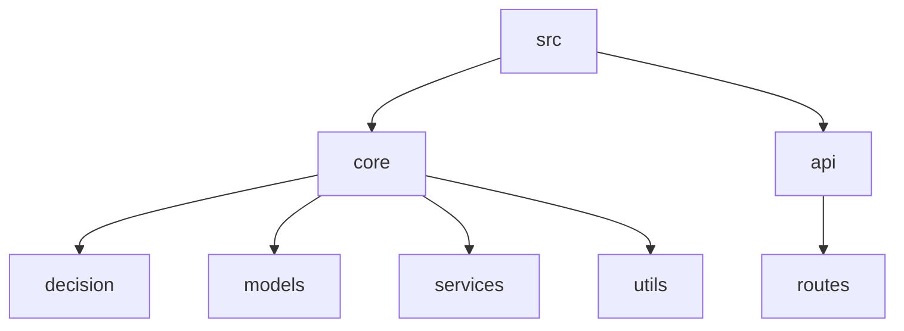

**图源**
- [backend/src](file://backend/src)

## 核心组件

系统的核心由决策引擎、AI模型服务、推理引擎和模型管理器构成。决策引擎负责根据业务需求做出智能决策，AI模型服务提供模型支持，推理引擎执行模型推理，模型管理器负责模型的全生命周期管理。

**节源**
- [backend/src/main.py](file://backend/src/main.py#L1-L43)
- [backend/src/api.py](file://backend/src/api.py#L1-L83)

## 决策引擎

决策引擎是系统的核心智能模块，基于强化学习算法实现自主决策。系统定义了决策引擎的抽象基类，并实现了多个具体领域的决策引擎。

### 决策引擎基类

`DecisionEngine`是一个抽象基类，定义了所有决策引擎必须实现的接口。它使用Python的`abc`模块确保子类实现`make_decision`方法。

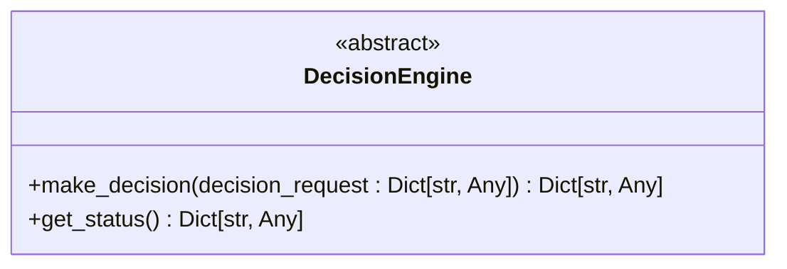

**图源**
- [backend/src/core/decision_engine.py](file://backend/src/core/decision_engine.py#L1-L36)

### 农业决策引擎

`AgricultureDecisionEngine`是针对农业场景的决策引擎，它基于强化学习算法，根据环境参数、作物状态和决策目标，优化光谱、温度、湿度等参数。

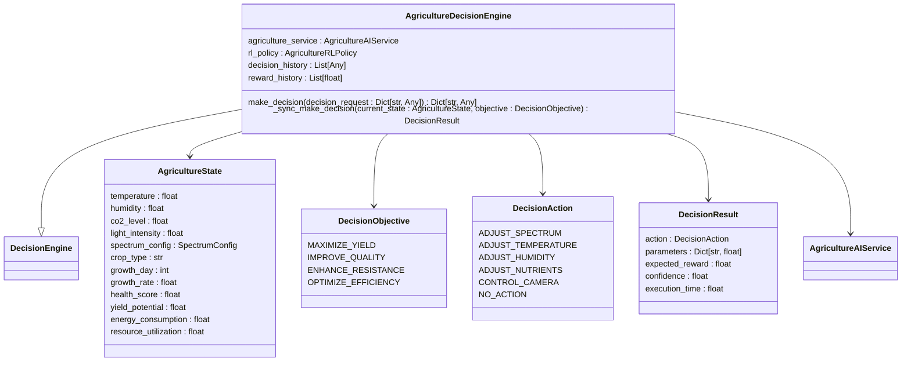

**图源**
- [backend/src/core/decision/agriculture_decision_engine.py](file://backend/src/core/decision/agriculture_decision_engine.py#L1-L508)

### 区块链决策引擎

`BlockchainDecisionEngine`负责区块链积分分配决策，基于用户行为、市场状态和系统状态，做出积分分配、交易审批等决策。

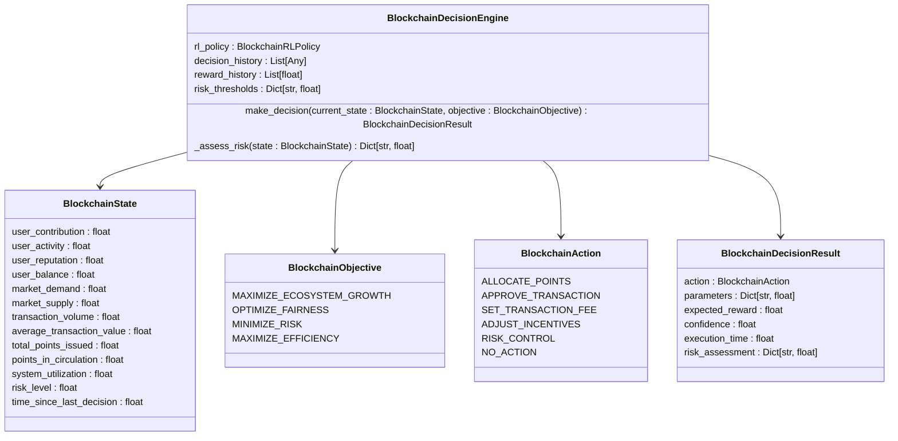

**图源**
- [backend/src/core/decision/blockchain_decision_engine.py](file://backend/src/core/decision/blockchain_decision_engine.py#L1-L507)

### 资源调度决策引擎

`ResourceDecisionEngine`负责系统资源的动态分配，根据CPU、内存、GPU等资源的使用情况，做出资源分配、负载均衡和扩缩容决策。

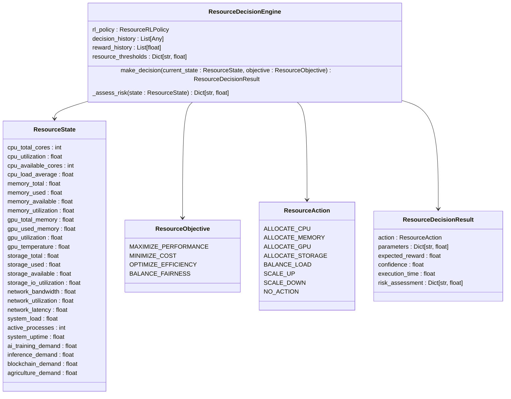

**图源**
- [backend/src/core/decision/resource_decision_engine.py](file://backend/src/core/decision/resource_decision_engine.py#L1-L651)

### 模型训练决策引擎

`ModelTrainingDecisionEngine`负责AI模型的自动训练决策，根据模型性能、资源使用和训练状态，决定是否开始/停止训练、调整超参数等。

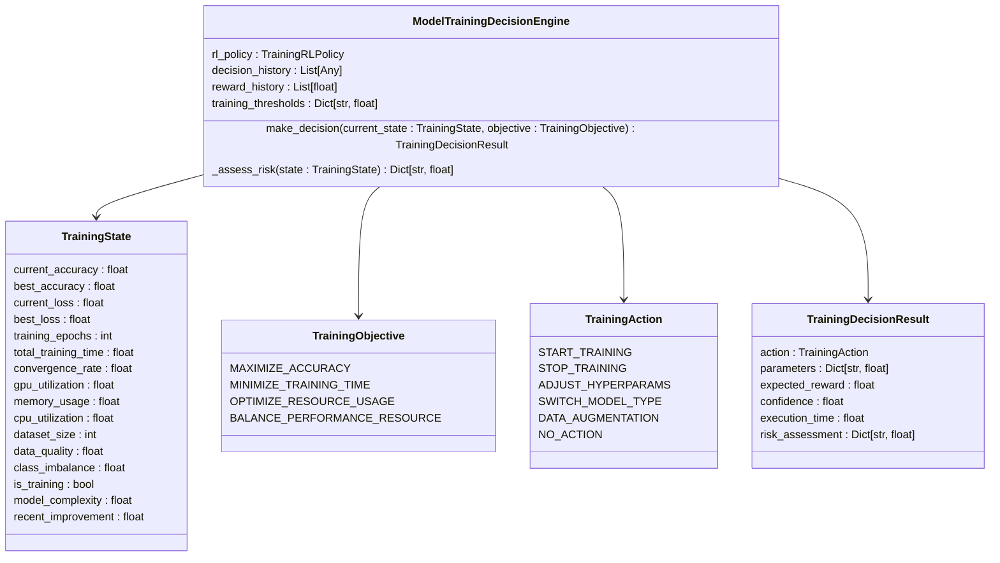

**图源**
- [backend/src/core/decision/model_training_decision_engine.py](file://backend/src/core/decision/model_training_decision_engine.py#L1-L548)

## AI模型服务

`AgricultureAIService`是农业AI服务的核心，它集成了光谱分析、植物生长模型和光配方生成器等功能。

```mermaid
classDiagram
class SpectrumConfig {
uv_380nm : float
far_red_720nm : float
white_light : float
red_660nm : float
white_red_ratio : float
}
class PlantGrowthStage {
stage_name : str
duration_days : int
optimal_temperature : Tuple[float, float]
optimal_humidity : Tuple[float, float]
light_hours : int
}
class CropConfig {
crop_name : str
growth_stages : List[PlantGrowthStage]
target_yield : str
quality_metrics : Dict[str, float]
}
class SpectrumAnalyzer {
__call__(spectrum_data : jnp.ndarray) Dict[str, float]
}
class PlantGrowthModel {
__call__(environmental_data : jnp.ndarray, spectrum_data : jnp.ndarray, growth_days : int) Dict[str, float]
}
class LightRecipeGenerator {
__call__(crop_config : CropConfig, current_stage : PlantGrowthStage, target_objective : str, environmental_conditions : Dict[str, float]) SpectrumConfig
_get_base_recipe(crop_config : CropConfig, stage : PlantGrowthStage) SpectrumConfig
_optimize_for_objective(recipe : SpectrumConfig, objective : str, env_conditions : Dict[str, float]) SpectrumConfig
}
class AgricultureAIService {
spectrum_analyzer : SpectrumAnalyzer
growth_model : PlantGrowthModel
recipe_generator : LightRecipeGenerator
crop_configs : Dict[str, CropConfig]
generate_light_recipe(crop_type : str, current_day : int, target_objective : str, environment : Dict[str, float]) Dict[str, any]
_get_current_stage(crop_config : CropConfig, current_day : int) PlantGrowthStage
_get_growth_recommendations(crop_config : CropConfig, stage : PlantGrowthStage) List[str]
}
AgricultureAIService --> SpectrumConfig
AgricultureAIService --> PlantGrowthStage
AgricultureAIService --> CropConfig
AgricultureAIService --> SpectrumAnalyzer
AgricultureAIService --> PlantGrowthModel
AgricultureAIService --> LightRecipeGenerator
```

**图源**
- [backend/src/core/models/agriculture_model.py](file://backend/src/core/models/agriculture_model.py#L1-L463)

## 决策管理器

`DecisionManager`是决策流程的协调者，负责处理决策请求，进行基础校验，并根据任务类型和风险级别做出决策。

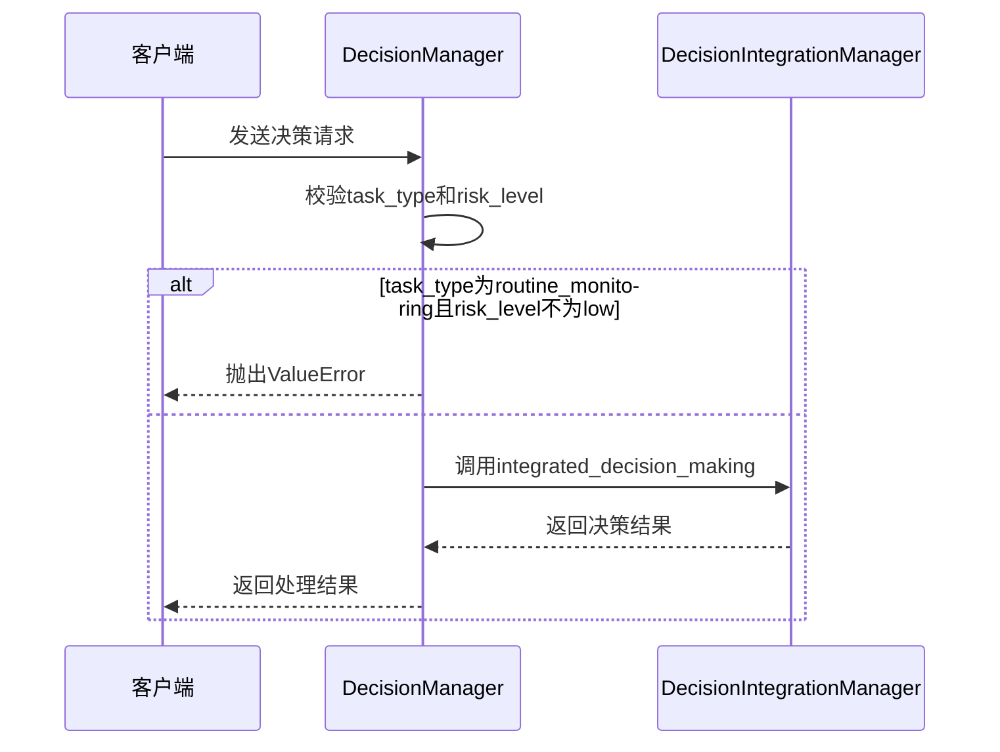

**图源**
- [backend/src/core/decision/decision_manager.py](file://backend/src/core/decision/decision_manager.py#L1-L50)
- [backend/src/integration/decision_integration.py](file://backend/src/integration/decision_integration.py#L1-L615)

## 推理引擎

`InferenceEngine`是高性能的AI推理服务，支持文本生成、图像分类、图像生成等多种推理任务，并实现了批处理和缓存机制。

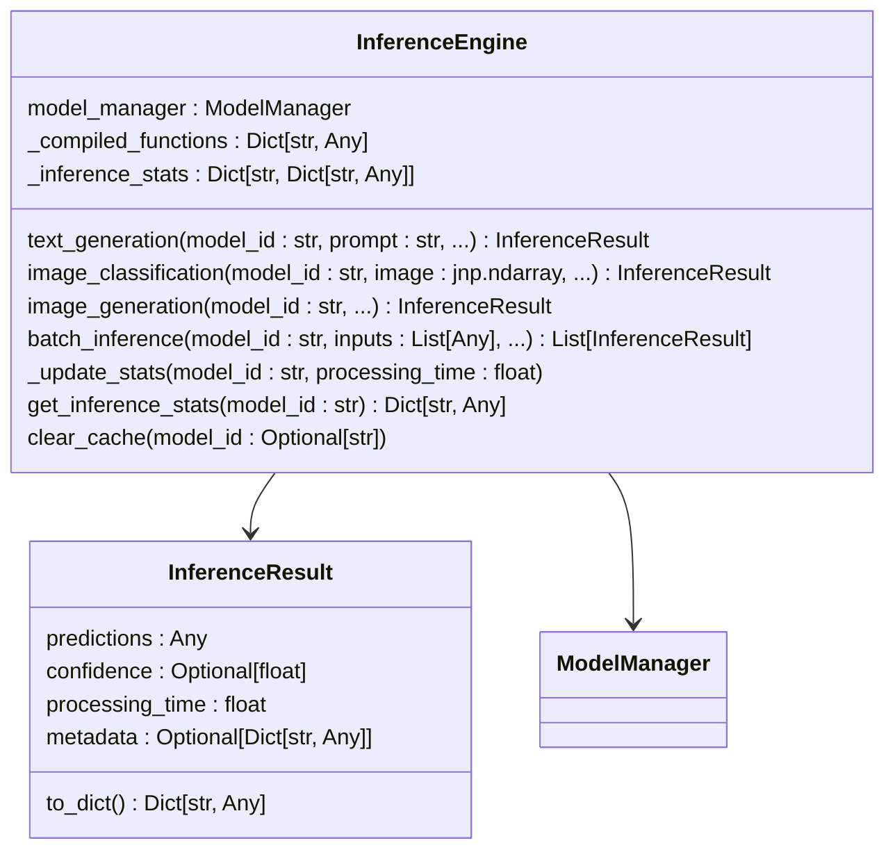

**图源**
- [backend/src/core/services/inference_engine.py](file://backend/src/core/services/inference_engine.py#L1-L415)

## 模型管理器

`ModelManager`提供AI模型的全生命周期管理，包括模型的注册、加载、卸载、预测、训练等核心功能。

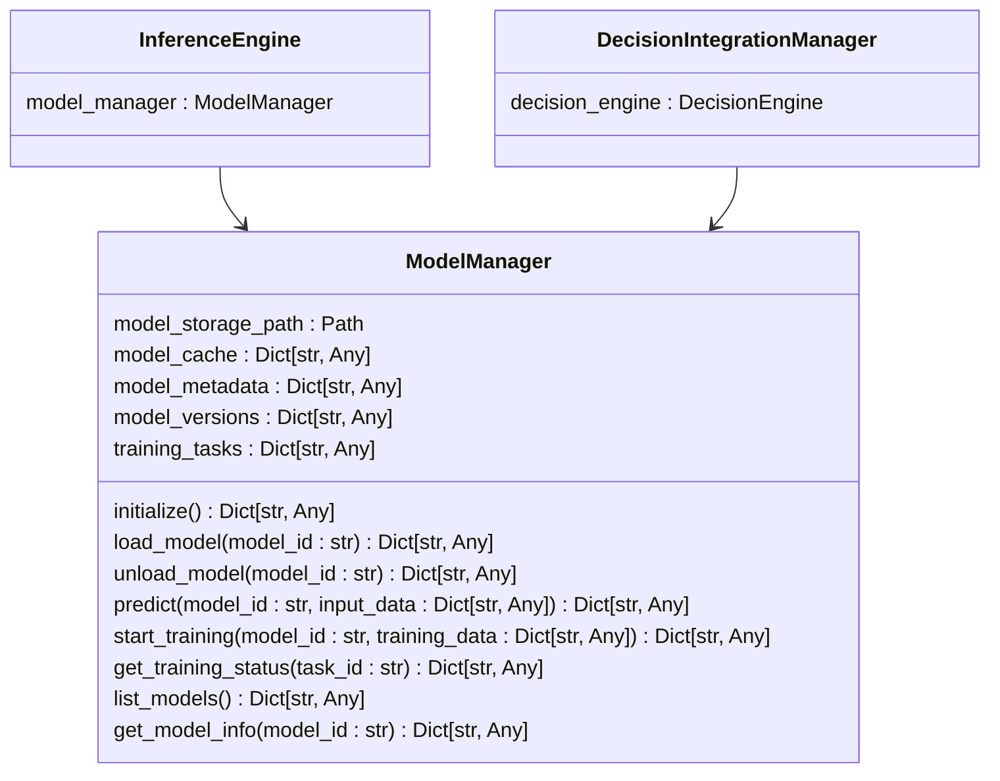

**图源**
- [backend/src/core/services/model_manager.py](file://backend/src/core/services/model_manager.py#L1-L1209)

## 性能优化

系统通过多种技术实现性能优化，包括批处理、缓存和JAX的JIT编译。

### 批处理

`InferenceEngine`的`batch_inference`方法支持批量推理，根据模型类型调用相应的批量处理方法。

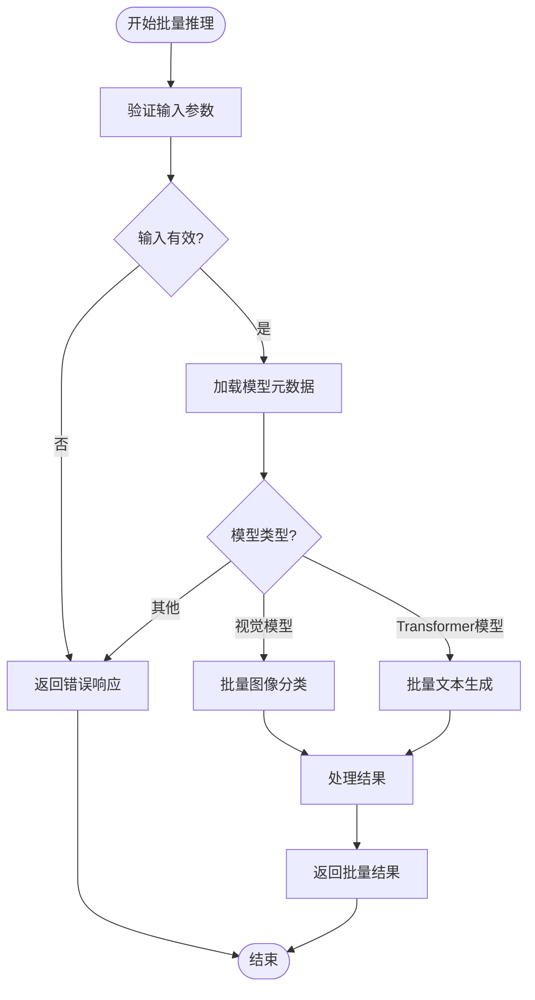

**图源**
- [backend/src/core/services/inference_engine.py](file://backend/src/core/services/inference_engine.py#L267-L297)

### 缓存

`InferenceEngine`使用`_compiled_functions`字典缓存已编译的推理函数，避免重复编译开销。

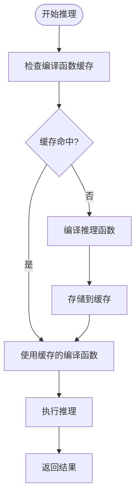

**图源**
- [backend/src/core/services/inference_engine.py](file://backend/src/core/services/inference_engine.py#L53-L54)

## 常见问题排查

### 模型加载失败

如果模型加载失败，首先检查`model_metadata`中是否存在该模型ID，然后确认模型文件路径是否正确。

**节源**
- [backend/src/core/services/model_manager.py](file://backend/src/core/services/model_manager.py#L496-L517)

### 决策请求验证失败

如果决策请求验证失败，检查`task_type`是否为空，以及`routine_monitoring`任务的`risk_level`是否为`low`。

**节源**
- [backend/src/core/decision/decision_manager.py](file://backend/src/core/decision/decision_manager.py#L17-L36)

### 推理性能低下

如果推理性能低下，检查是否启用了批处理和缓存。可以通过调用`get_inference_stats`方法查看推理统计信息。

**节源**
- [backend/src/core/services/inference_engine.py](file://backend/src/core/services/inference_engine.py#L393-L404)