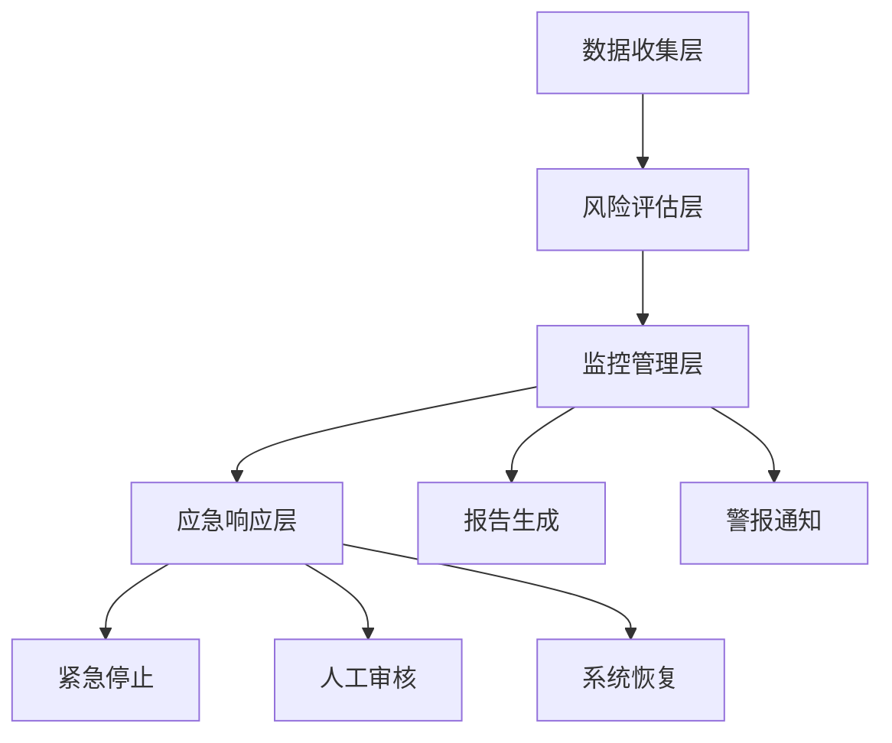
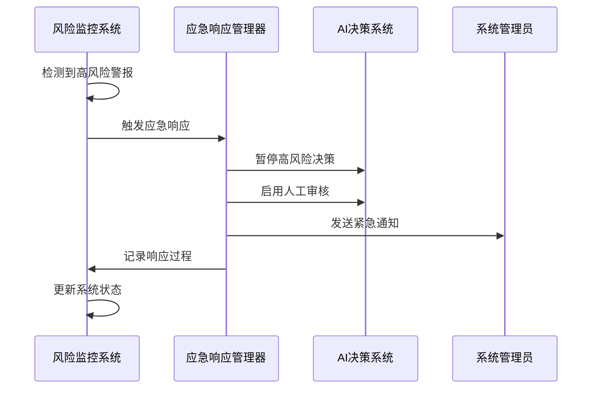
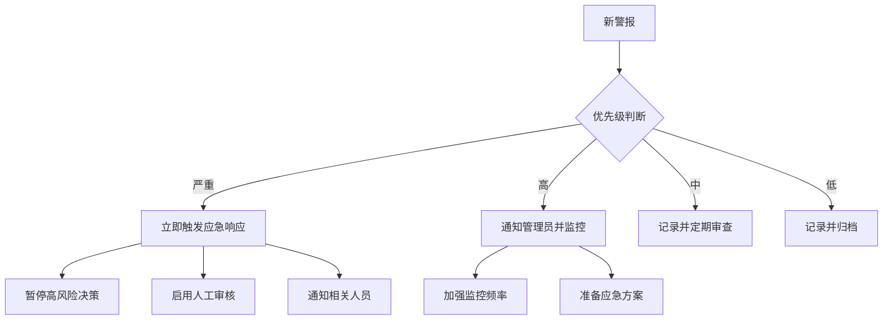
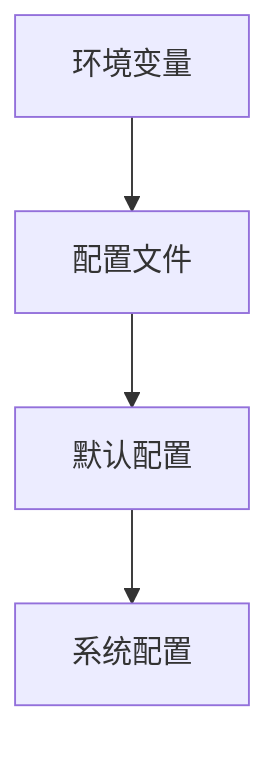

# AI风险控制

<cite>
**本文档引用文件**   
- [algorithm_bias_controller.py](file://backend/src/ai_risk_control/algorithm_bias_controller.py)
- [technical_risk_controller.py](file://backend/src/ai_risk_control/technical_risk_controller.py)
- [governance_conflict_controller.py](file://backend/src/ai_risk_control/governance_conflict_controller.py)
- [risk_monitoring_system.py](file://backend/src/ai_risk_control/risk_monitoring_system.py)
- [data_security_controller.py](file://backend/src/ai_risk_control/data_security_controller.py)
- [config.py](file://backend/src/ai_risk_control/config.py)
- [example_usage.py](file://backend/src/ai_risk_control/example_usage.py)
- [api.py](file://backend/src/ai_risk_control/api.py)
</cite>

## 目录
1. [引言](#引言)
2. [算法偏见控制](#算法偏见控制)
3. [技术风险控制](#技术风险控制)
4. [治理冲突控制](#治理冲突控制)
5. [风险监控系统](#风险监控系统)
6. [风险评估指标](#风险评估指标)
7. [警报处理流程](#警报处理流程)
8. [系统恢复指南](#系统恢复指南)
9. [API接口](#api接口)
10. [配置管理](#配置管理)

## 引言
AI风险控制系统旨在全面管理AI自主决策中的三大核心风险：算法偏见、技术失控和治理冲突。该系统通过四个核心控制器和一个集成监控系统，确保区块链经济模型中AI决策的安全、公平和稳定运行。算法偏见控制器检测和缓解数据偏见和模型偏见，技术风险控制器防止目标偏离和黑箱行为，治理冲突控制器解决人-AI权力冲突，而风险监控系统则集成所有控制器，实现统一的监控、预警和应急响应。

## 算法偏见控制
算法偏见控制器负责识别和缓解AI决策中的算法偏见，防止历史数据偏差导致的不平等固化，监控系统性风险，确保区块链经济系统的公平性和稳定性。该控制器通过多维度分析，全面评估AI决策的公平性。

### 数据偏见检测
算法偏见控制器通过分析训练数据的分布平衡性和历史数据偏见传递来检测数据偏见。系统计算不同群体的数据量差异和不平衡比率，当数据偏见分数超过阈值时，会触发高风险警报，并建议重新采样或数据增强以平衡数据分布。

**Section sources**
- [algorithm_bias_controller.py](file://backend/src/ai_risk_control/algorithm_bias_controller.py#L188-L212)

### 模型偏见检测
模型偏见检测通过分析模型决策中的偏见来实现。系统比较不同受保护群体的决策结果差异，计算群体间决策公平性。当模型偏见分数超过阈值时，会触发中等风险警报，并建议应用偏见缓解技术或重新训练模型。

**Section sources**
- [algorithm_bias_controller.py](file://backend/src/ai_risk_control/algorithm_bias_controller.py#L214-L238)

### 公平性评估
公平性评估器应用多种公平性指标，包括统计奇偶性、平等机会和预测平等，来综合评估AI决策的公平性。系统通过计算受保护群体的接受率差异来评估统计奇偶性，当公平性违反分数超过阈值时，会触发严重风险警报，并建议立即修正公平性算法。

**Section sources**
- [algorithm_bias_controller.py](file://backend/src/ai_risk_control/algorithm_bias_controller.py#L648-L715)

### 系统性风险分析
系统性风险分析器评估决策相关性、风险集中度和市场影响风险。系统通过计算决策间的平均相关性和基尼系数来衡量风险集中度，当系统性风险分数超过阈值时，会触发高风险警报，并建议分散决策风险并建立熔断机制。

**Section sources**
- [algorithm_bias_controller.py](file://backend/src/ai_risk_control/algorithm_bias_controller.py#L718-L773)

## 技术风险控制
技术风险控制器负责控制AI自主决策中的技术失控风险，确保AI决策与预设目标对齐，防止算法黑箱特性导致的决策偏离，保障区块链经济系统稳定运行。该控制器通过多维度监控，全面评估技术风险。

### 目标对齐验证
目标对齐验证器检查AI决策目标与区块链经济目标的对齐度。系统计算目标重叠度，当对齐分数低于阈值时，会触发高风险警报，并建议调整AI决策目标或重新训练模型。

**Section sources**
- [technical_risk_controller.py](file://backend/src/ai_risk_control/technical_risk_controller.py#L475-L494)

### 黑箱行为检测
行为异常检测器通过分析AI决策的可解释性来检测黑箱行为。系统计算可解释性评分，当黑箱行为置信度超过阈值时，会触发中等风险警报，并建议增加模型可解释性分析。

**Section sources**
- [technical_risk_controller.py](file://backend/src/ai_risk_control/technical_risk_controller.py#L496-L510)

### 安全机制绕过检测
系统通过检查AI决策日志来检测安全机制绕过尝试。当绕过尝试次数超过阈值时，会触发严重风险警报，并建议立即启用紧急停止机制。

**Section sources**
- [technical_risk_controller.py](file://backend/src/ai_risk_control/technical_risk_controller.py#L431-L444)

### 决策漂移监测
系统通过比较当前决策模式与历史决策模式的差异来检测决策漂移。当漂移分数超过阈值时，会触发中等风险警报，并建议重新校准AI模型或调整决策策略。

**Section sources**
- [technical_risk_controller.py](file://backend/src/ai_risk_control/technical_risk_controller.py#L446-L472)

## 治理冲突控制
治理冲突控制器负责处理区块链去中心化治理与AI自主决策之间的权力冲突，建立人-AI协同决策模式，防止治理失效和链上分叉风险。该控制器通过多维度分析，全面评估治理健康度。

### 权力争夺评估
系统通过分析AI与社区决策权的平衡来评估权力争夺风险。当权力平衡分数低于阈值时，会触发高风险警报，并建议建立人-AI协同决策机制。

**Section sources**
- [governance_conflict_controller.py](file://backend/src/ai_risk_control/governance_conflict_controller.py#L190-L215)

### 决策冲突分析
系统通过匹配时间相近的AI决策和社区投票来分析决策冲突。当冲突分数超过阈值时，会触发中等风险警报，并建议启动决策协调机制。

**Section sources**
- [governance_conflict_controller.py](file://backend/src/ai_risk_control/governance_conflict_controller.py#L217-L241)

### 共识破坏风险评估
共识管理器评估共识达成率、节点参与度和算力集中度风险。当共识破坏风险超过阈值时，会触发严重风险警报，并建议加强共识机制安全防护。

**Section sources**
- [governance_conflict_controller.py](file://backend/src/ai_risk_control/governance_conflict_controller.py#L545-L566)

### 治理失效检测
治理审计器评估决策效率、社区参与度和治理透明度。当治理失效风险超过阈值时，会触发严重风险警报，并建议启动治理机制改革。

**Section sources**
- [governance_conflict_controller.py](file://backend/src/ai_risk_control/governance_conflict_controller.py#L619-L643)

## 风险监控系统
风险监控系统集成所有风险控制模块，实现全面的AI自主决策风险监控、预警和应急响应。该系统通过统一的监控框架，协调各风险控制器，提供综合风险评估和应急响应。

### 系统架构
风险监控系统采用分层架构，包括数据收集层、风险评估层、监控管理层和应急响应层。系统通过并行执行各风险领域评估，实现高效的综合风险评估。



**Diagram sources**
- [risk_monitoring_system.py](file://backend/src/ai_risk_control/risk_monitoring_system.py#L89-L115)

**Section sources**
- [risk_monitoring_system.py](file://backend/src/ai_risk_control/risk_monitoring_system.py#L89-L115)

### 综合风险评估
系统通过并行执行技术风险、数据安全、算法偏见和治理冲突的评估，生成综合风险报告。各风险领域的评估结果按权重计算综合风险评分，权重分配为：技术风险40%、数据安全30%、算法偏见20%、治理冲突10%。

**Section sources**
- [risk_monitoring_system.py](file://backend/src/ai_risk_control/risk_monitoring_system.py#L180-L239)

### 应急响应机制
当检测到高风险警报时，系统自动触发应急响应。应急措施包括暂停高风险AI决策、启用人工审核、通知相关人员和记录应急响应过程。系统通过紧急响应管理器协调各项应急措施。



**Diagram sources**
- [risk_monitoring_system.py](file://backend/src/ai_risk_control/risk_monitoring_system.py#L432-L470)

**Section sources**
- [risk_monitoring_system.py](file://backend/src/ai_risk_control/risk_monitoring_system.py#L432-L470)

## 风险评估指标
系统采用多维度风险评估指标，全面衡量AI决策的各个风险方面。各指标均采用0-1的评分标准，便于比较和综合。

### 技术风险指标
| 指标 | 描述 | 阈值 | 严重程度 |
|------|------|------|----------|
| 目标对齐分数 | AI决策与预设目标的对齐度 | <0.8 | 高风险 |
| 黑箱行为置信度 | 决策不可解释性的置信度 | >0.3 | 中等风险 |
| 资源使用率 | 系统资源使用率 | >90% | 高风险 |
| 决策漂移分数 | 决策模式变化程度 | >0.15 | 中等风险 |

**Section sources**
- [technical_risk_controller.py](file://backend/src/ai_risk_control/technical_risk_controller.py#L83-L92)

### 算法偏见指标
| 指标 | 描述 | 阈值 | 严重程度 |
|------|------|------|----------|
| 数据偏见分数 | 训练数据分布不平衡度 | >0.3 | 高风险 |
| 模型偏见分数 | 模型决策偏见程度 | >0.25 | 中等风险 |
| 公平性违反分数 | 决策违反公平性原则程度 | >0.2 | 严重风险 |
| 决策趋同分数 | 决策多样性缺乏程度 | >0.7 | 中等风险 |

**Section sources**
- [algorithm_bias_controller.py](file://backend/src/ai_risk_control/algorithm_bias_controller.py#L89-L96)

### 治理冲突指标
| 指标 | 描述 | 阈值 | 严重程度 |
|------|------|------|----------|
| 权力平衡分数 | AI与社区决策权平衡度 | <0.6 | 高风险 |
| 决策冲突分数 | AI决策与社区意愿冲突度 | >0.5 | 中等风险 |
| 共识破坏风险 | 共识机制稳定性风险 | >0.4 | 严重风险 |
| 治理失效风险 | 治理机制有效性风险 | >0.7 | 严重风险 |

**Section sources**
- [governance_conflict_controller.py](file://backend/src/ai_risk_control/governance_conflict_controller.py#L83-L90)

## 警报处理流程
系统采用分级警报处理流程，根据警报的优先级和类型采取相应的处理措施。所有警报均记录在案，便于审计和追溯。

### 警报优先级
系统定义了四个警报优先级：低、中、高和严重。优先级根据风险严重程度和置信度确定，严重和高优先级警报会触发自动应急响应。



**Diagram sources**
- [risk_monitoring_system.py](file://backend/src/ai_risk_control/risk_monitoring_system.py#L420-L427)

**Section sources**
- [risk_monitoring_system.py](file://backend/src/ai_risk_control/risk_monitoring_system.py#L420-L427)

### 警报生命周期
警报从创建到解决的完整生命周期包括：检测、评估、通知、处理和关闭。系统自动管理警报的有效期，过期警报会被自动归档。

**Section sources**
- [risk_monitoring_system.py](file://backend/src/ai_risk_control/risk_monitoring_system.py#L384-L397)

## 系统恢复指南
当系统从高风险状态恢复时，需要遵循特定的恢复流程，确保系统稳定性和决策质量。

### 恢复步骤
1. **风险评估**：执行全面的风险评估，确认风险已消除
2. **配置检查**：检查系统配置，确保所有安全措施已启用
3. **模型验证**：验证AI模型的公平性和目标对齐度
4. **逐步恢复**：逐步恢复AI决策权限，从低风险决策开始
5. **持续监控**：加强监控频率，确保系统稳定

**Section sources**
- [example_usage.py](file://backend/src/ai_risk_control/example_usage.py#L304-L336)

### 恢复验证
恢复过程中需要验证以下指标：
- 综合风险评分持续低于0.3
- 无严重或高优先级警报
- 目标对齐分数高于0.8
- 公平性评分高于0.7
- 系统资源使用率正常

**Section sources**
- [example_usage.py](file://backend/src/ai_risk_control/example_usage.py#L304-L336)

## API接口
系统提供RESTful API接口，方便外部系统集成和调用风险控制功能。

### 主要端点
| 端点 | 方法 | 描述 |
|------|------|------|
| /status | GET | 获取系统状态 |
| /assess | POST | 执行综合风险评估 |
| /alerts | GET | 查询警报 |
| /emergency | POST | 手动触发应急响应 |
| /health | GET | 健康检查 |

**Section sources**
- [api.py](file://backend/src/ai_risk_control/api.py#L120-L287)

### 请求响应示例
```json
{
  "report_id": "abc123",
  "timestamp": "2023-01-01T00:00:00Z",
  "system_status": "normal",
  "overall_risk_score": 0.2,
  "risk_breakdown": {
    "technical": 0.15,
    "data_security": 0.25,
    "algorithm_bias": 0.1,
    "governance_conflict": 0.3
  },
  "active_alerts": [],
  "recommendations": ["系统运行良好，继续保持监控"]
}
```

**Section sources**
- [api.py](file://backend/src/ai_risk_control/api.py#L137-L183)

## 配置管理
系统提供灵活的配置管理，支持环境变量覆盖和动态配置更新。

### 配置层次
系统配置采用层次化结构，包括：
- 基础配置：环境、调试模式、日志级别
- 模块配置：各风险控制器的特定配置
- 监控配置：监控间隔、风险阈值、通知设置



**Diagram sources**
- [config.py](file://backend/src/ai_risk_control/config.py#L202-L327)

**Section sources**
- [config.py](file://backend/src/ai_risk_control/config.py#L202-L327)

### 配置优先级
配置优先级从高到低为：环境变量 > 配置文件 > 默认配置。系统启动时按此顺序加载配置，确保灵活性和可配置性。

**Section sources**
- [config.py](file://backend/src/ai_risk_control/config.py#L209-L247)