# 安全与隐私

<cite>
**本文档引用的文件**   
- [differential_privacy.py](file://backend/src/privacy/differential_privacy.py)
- [ai_risk_control/__init__.py](file://backend/src/ai_risk_control/__init__.py)
- [ai_risk_control/risk_monitoring_system.py](file://backend/src/ai_risk_control/risk_monitoring_system.py)
- [ai_risk_control/data_security_controller.py](file://backend/src/ai_risk_control/data_security_controller.py)
- [ai_risk_control/algorithm_bias_controller.py](file://backend/src/ai_risk_control/algorithm_bias_controller.py)
- [ai_risk_control/technical_risk_controller.py](file://backend/src/ai_risk_control/technical_risk_controller.py)
- [ai_risk_control/governance_conflict_controller.py](file://backend/src/ai_risk_control/governance_conflict_controller.py)
- [api-gateway/src/middleware/auth.ts](file://api-gateway/src/middleware/auth.ts)
- [api-gateway/src/server.ts](file://api-gateway/src/server.ts)
- [backend/tests/test_compliance.py](file://backend/tests/test_compliance.py)
</cite>

## 目录
1. [引言](#引言)
2. [差分隐私保护机制](#差分隐私保护机制)
3. [AI风险控制模块](#ai风险控制模块)
4. [认证与授权流程](#认证与授权流程)
5. [风险监控与告警系统](#风险监控与告警系统)
6. [安全合规与应急响应](#安全合规与应急响应)
7. [结论](#结论)

## 引言
本系统构建了一套全面的安全与隐私保护体系，旨在确保AI自主决策在区块链经济模型中的安全、公平和稳定运行。系统通过差分隐私技术保护训练数据隐私，防止敏感信息泄露；通过AI风险控制模块检测和缓解算法偏见、技术失控和治理冲突等风险；通过API网关实现严格的认证授权，确保系统访问安全；通过实时风险监控系统及时发现异常行为并触发告警。本文档将详细阐述这些安全机制的实现原理和操作流程。

## 差分隐私保护机制

差分隐私模块通过在数据或梯度上添加噪声来保护训练数据的隐私，确保攻击者无法从模型输出中推断出任何个体数据的信息。

### 差分隐私实现类
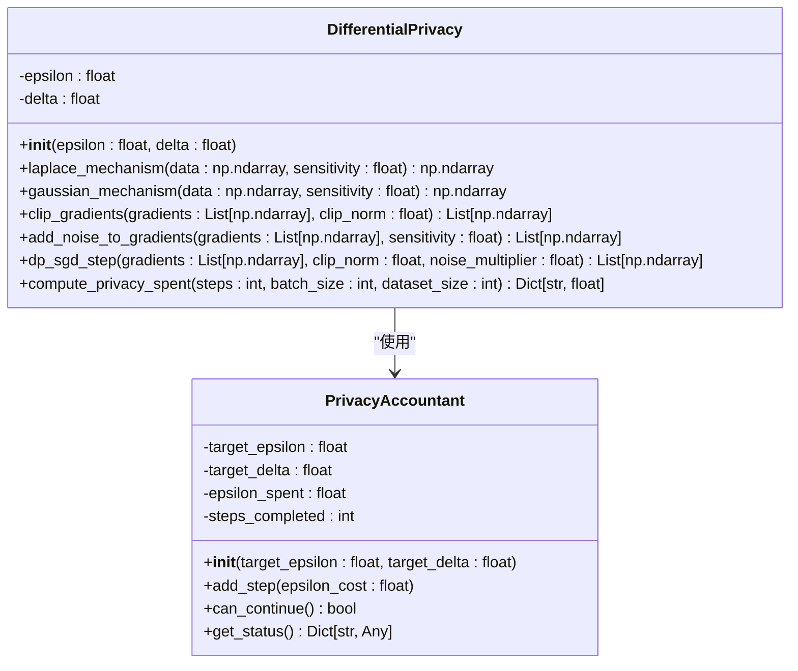

**图源**
- [differential_privacy.py](file://backend/src/privacy/differential_privacy.py)

**节源**
- [differential_privacy.py](file://backend/src/privacy/differential_privacy.py)

### 差分隐私工作流程
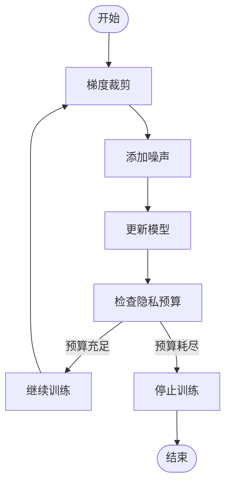

**图源**
- [differential_privacy.py](file://backend/src/privacy/differential_privacy.py)

**节源**
- [differential_privacy.py](file://backend/src/privacy/differential_privacy.py)

## AI风险控制模块

AI风险控制模块是一个综合性的风险管理系统，集成了技术风险、数据安全、算法偏见和治理冲突等多个子控制器，全面监控和管理AI自主决策的各类风险。

### AI风险控制架构
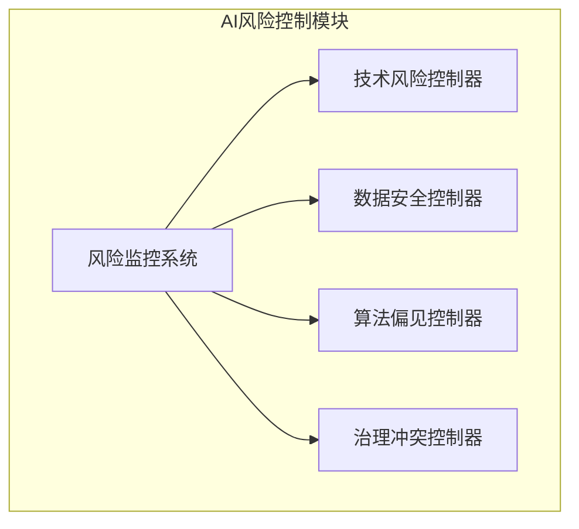

**图源**
- [ai_risk_control/__init__.py](file://backend/src/ai_risk_control/__init__.py)
- [ai_risk_control/risk_monitoring_system.py](file://backend/src/ai_risk_control/risk_monitoring_system.py)

**节源**
- [ai_risk_control/__init__.py](file://backend/src/ai_risk_control/__init__.py)
- [ai_risk_control/risk_monitoring_system.py](file://backend/src/ai_risk_control/risk_monitoring_system.py)

### 技术风险控制
技术风险控制器负责监控AI决策中的技术失控风险，包括目标偏离、黑箱行为、安全机制绕过、资源耗尽和决策漂移等。

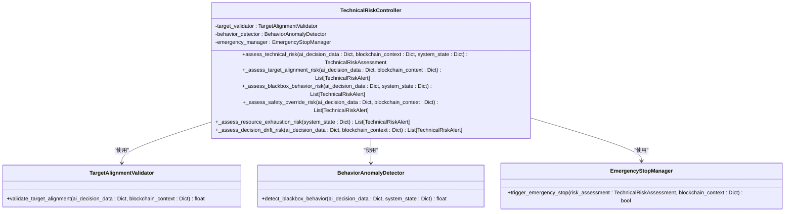

**图源**
- [ai_risk_control/technical_risk_controller.py](file://backend/src/ai_risk_control/technical_risk_controller.py)

**节源**
- [ai_risk_control/technical_risk_controller.py](file://backend/src/ai_risk_control/technical_risk_controller.py)

### 数据安全与隐私保护
数据安全控制器负责保护AI训练和决策过程中的数据安全，防止隐私泄露、数据窃取和滥用等风险。

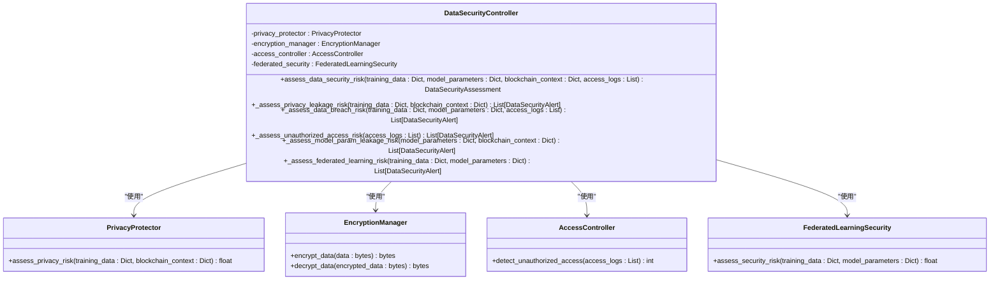

**图源**
- [ai_risk_control/data_security_controller.py](file://backend/src/ai_risk_control/data_security_controller.py)

**节源**
- [ai_risk_control/data_security_controller.py](file://backend/src/ai_risk_control/data_security_controller.py)

### 算法偏见与系统性风险控制
算法偏见控制器负责识别和缓解AI决策中的算法偏见，防止历史数据偏差导致的不平等固化，监控系统性风险。

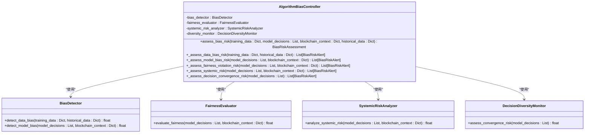

**图源**
- [ai_risk_control/algorithm_bias_controller.py](file://backend/src/ai_risk_control/algorithm_bias_controller.py)

**节源**
- [ai_risk_control/algorithm_bias_controller.py](file://backend/src/ai_risk_control/algorithm_bias_controller.py)

### 治理机制冲突解决
治理冲突控制器负责处理区块链去中心化治理与AI自主决策之间的权力冲突，建立人-AI协同决策模式。

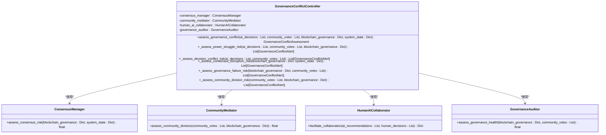

**图源**
- [ai_risk_control/governance_conflict_controller.py](file://backend/src/ai_risk_control/governance_conflict_controller.py)

**节源**
- [ai_risk_control/governance_conflict_controller.py](file://backend/src/ai_risk_control/governance_conflict_controller.py)

## 认证与授权流程

API网关实现了严格的认证与授权机制，确保只有经过验证的请求才能访问后端服务。

### API网关认证流程
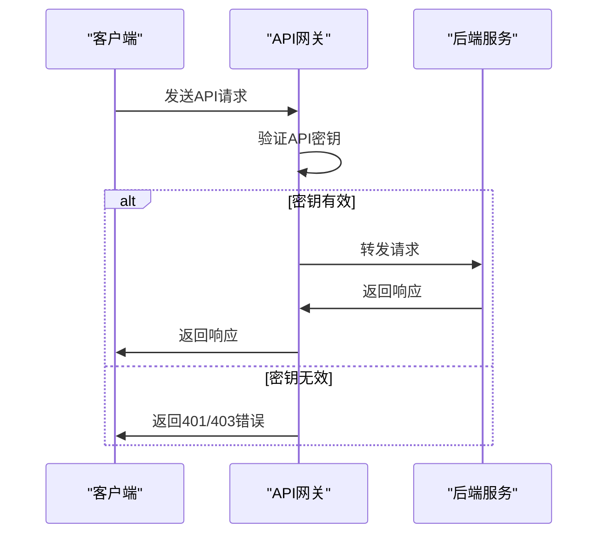

**图源**
- [api-gateway/src/middleware/auth.ts](file://api-gateway/src/middleware/auth.ts)
- [api-gateway/src/server.ts](file://api-gateway/src/server.ts)

**节源**
- [api-gateway/src/middleware/auth.ts](file://api-gateway/src/middleware/auth.ts)
- [api-gateway/src/server.ts](file://api-gateway/src/server.ts)

## 风险监控与告警系统

风险监控系统集成所有风险控制模块，实现全面的AI自主决策风险监控、预警和应急响应。

### 风险监控系统工作流程
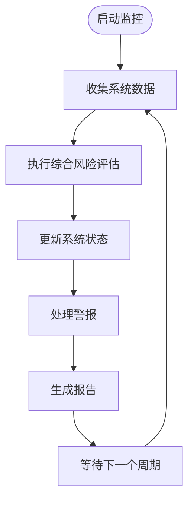

**图源**
- [ai_risk_control/risk_monitoring_system.py](file://backend/src/ai_risk_control/risk_monitoring_system.py)

**节源**
- [ai_risk_control/risk_monitoring_system.py](file://backend/src/ai_risk_control/risk_monitoring_system.py)

### 综合风险评估流程
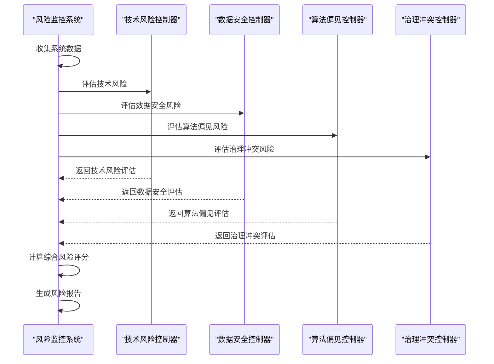

**图源**
- [ai_risk_control/risk_monitoring_system.py](file://backend/src/ai_risk_control/risk_monitoring_system.py)

**节源**
- [ai_risk_control/risk_monitoring_system.py](file://backend/src/ai_risk_control/risk_monitoring_system.py)

## 安全合规与应急响应

系统通过合规性测试和应急响应机制，确保符合相关法律法规要求，并能在紧急情况下快速响应。

### 合规性测试
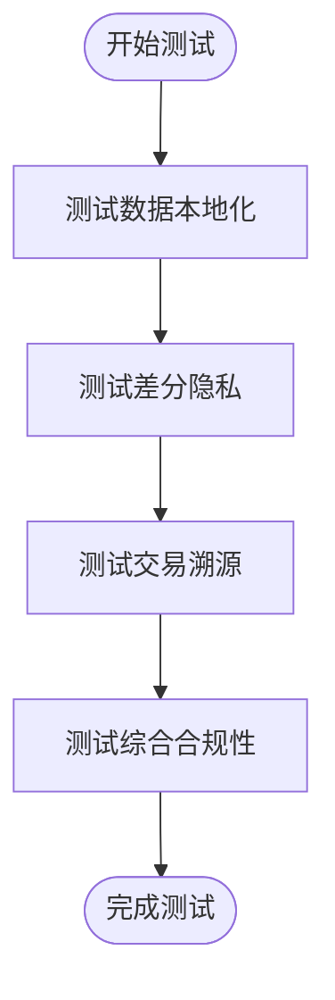

**图源**
- [backend/tests/test_compliance.py](file://backend/tests/test_compliance.py)

**节源**
- [backend/tests/test_compliance.py](file://backend/tests/test_compliance.py)

### 应急响应流程
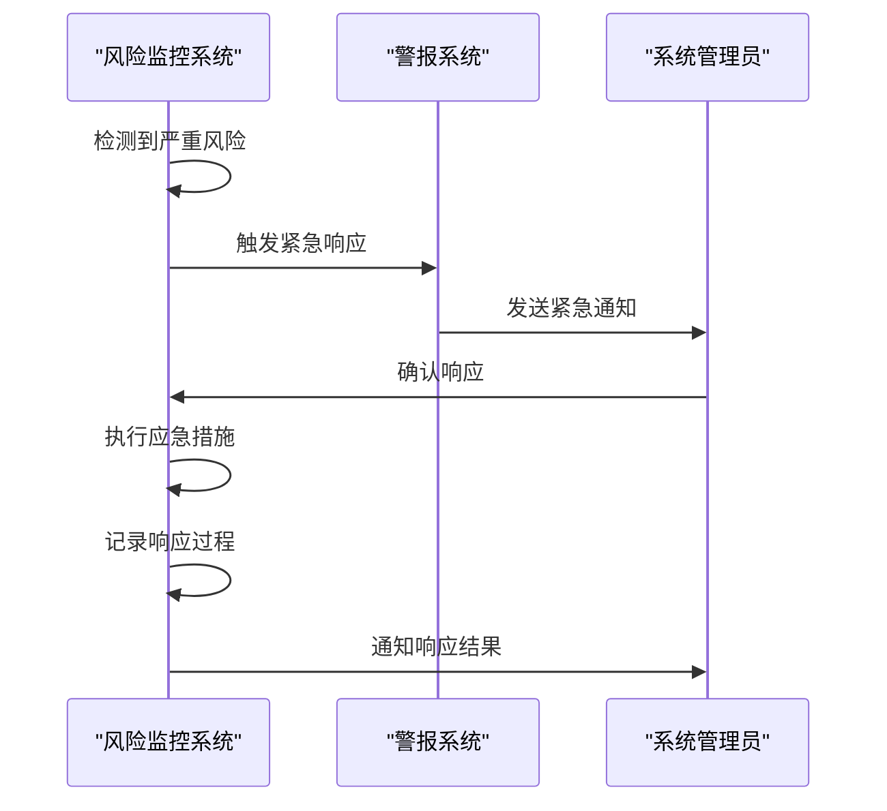

**图源**
- [ai_risk_control/risk_monitoring_system.py](file://backend/src/ai_risk_control/risk_monitoring_system.py)

**节源**
- [ai_risk_control/risk_monitoring_system.py](file://backend/src/ai_risk_control/risk_monitoring_system.py)

## 结论
本系统通过差分隐私、AI风险控制、认证授权和风险监控等多层次的安全机制，构建了一个全面的安全与隐私保护体系。系统能够有效保护训练数据隐私，检测和缓解各类AI风险，确保系统访问安全，并在紧急情况下快速响应。这些机制共同保障了AI自主决策在区块链经济模型中的安全、公平和稳定运行。