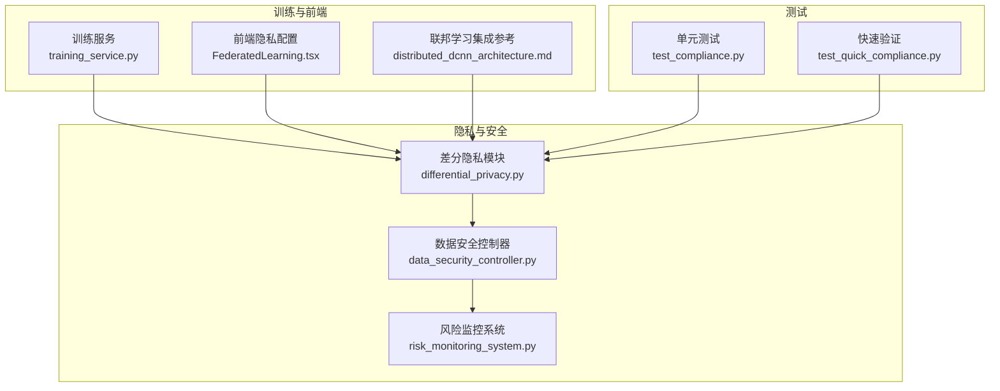
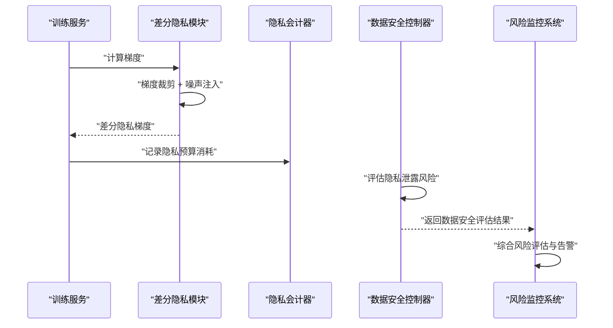
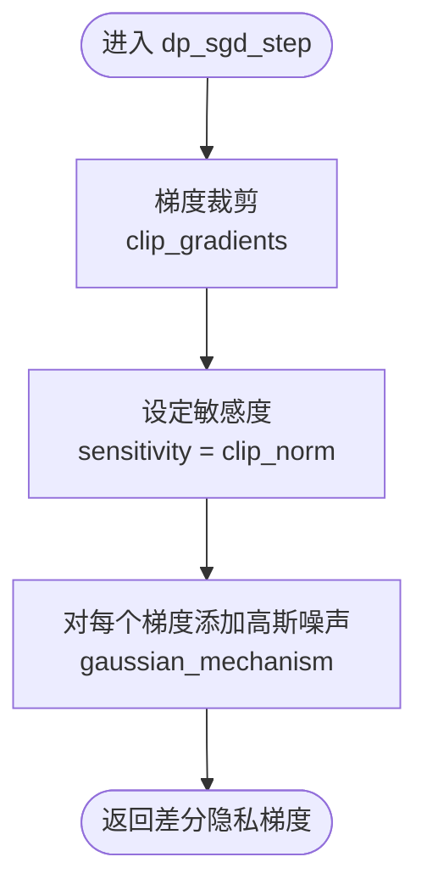
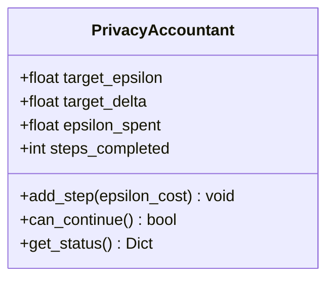
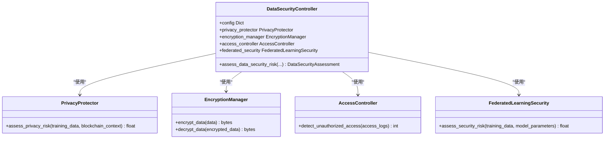

# 数据隐私保护

<cite>
**本文引用的文件**
- [differential_privacy.py](file://backend/src/privacy/differential_privacy.py)
- [data_security_controller.py](file://backend/src/ai_risk_control/data_security_controller.py)
- [risk_monitoring_system.py](file://backend/src/ai_risk_control/risk_monitoring_system.py)
- [training_service.py](file://backend/src/core/services/training_service.py)
- [FederatedLearning.tsx](file://frontend/src/pages/FederatedLearning.tsx)
- [distributed_dcnn_architecture.md](file://distributed_dcnn_architecture.md)
- [test_compliance.py](file://backend/tests/test_compliance.py)
- [test_quick_compliance.py](file://backend/test_quick_compliance.py)
</cite>

## 目录
1. [简介](#简介)
2. [项目结构](#项目结构)
3. [核心组件](#核心组件)
4. [架构总览](#架构总览)
5. [详细组件分析](#详细组件分析)
6. [依赖关系分析](#依赖关系分析)
7. [性能考量](#性能考量)
8. [故障排查指南](#故障排查指南)
9. [结论](#结论)
10. [附录](#附录)

## 简介
本文件系统化梳理系统在数据隐私保护方面的机制，重点覆盖以下方面：
- 差分隐私算法实现：Laplace与Gaussian机制如何在训练过程中保护原始数据与梯度隐私。
- 隐私预算跟踪：PrivacyAccountant如何量化并控制epsilon预算的消耗。
- DP-SGD流程：dp_sgd_step如何在梯度裁剪与噪声注入之间平衡隐私与模型收敛。
- 数据安全控制器：DataSecurityController如何评估隐私泄露风险并触发警报。
- 实践指南：面向数据科学家的隐私参数配置最佳实践，以及如何在隐私保护与模型效用之间取得平衡。

## 项目结构
围绕隐私保护的相关模块主要分布在以下路径：
- 差分隐私算法与预算管理：backend/src/privacy/differential_privacy.py
- 数据安全与隐私风险评估：backend/src/ai_risk_control/data_security_controller.py
- 风险监控与统一告警：backend/src/ai_risk_control/risk_monitoring_system.py
- 训练服务（梯度计算与优化）：backend/src/core/services/training_service.py
- 前端隐私配置界面：frontend/src/pages/FederatedLearning.tsx
- 联邦学习集成参考：distributed_dcnn_architecture.md
- 单元测试与快速验证：backend/tests/test_compliance.py、backend/test_quick_compliance.py

图表来源
- [differential_privacy.py](file://backend/src/privacy/differential_privacy.py#L1-L172)
- [data_security_controller.py](file://backend/src/ai_risk_control/data_security_controller.py#L1-L595)
- [risk_monitoring_system.py](file://backend/src/ai_risk_control/risk_monitoring_system.py#L1-L687)
- [training_service.py](file://backend/src/core/services/training_service.py#L1-L511)
- [FederatedLearning.tsx](file://frontend/src/pages/FederatedLearning.tsx#L401-L433)
- [distributed_dcnn_architecture.md](file://distributed_dcnn_architecture.md#L69-L97)
- [test_compliance.py](file://backend/tests/test_compliance.py#L108-L180)
- [test_quick_compliance.py](file://backend/test_quick_compliance.py#L67-L98)

章节来源
- [differential_privacy.py](file://backend/src/privacy/differential_privacy.py#L1-L172)
- [data_security_controller.py](file://backend/src/ai_risk_control/data_security_controller.py#L1-L595)
- [risk_monitoring_system.py](file://backend/src/ai_risk_control/risk_monitoring_system.py#L1-L687)
- [training_service.py](file://backend/src/core/services/training_service.py#L1-L511)
- [FederatedLearning.tsx](file://frontend/src/pages/FederatedLearning.tsx#L401-L433)
- [distributed_dcnn_architecture.md](file://distributed_dcnn_architecture.md#L69-L97)
- [test_compliance.py](file://backend/tests/test_compliance.py#L108-L180)
- [test_quick_compliance.py](file://backend/test_quick_compliance.py#L67-L98)

## 核心组件
- 差分隐私实现类 DifferentialPrivacy
  - 提供 Laplace 与 Gaussian 两种机制，用于向数据或梯度添加噪声，从而满足差分隐私定义下的隐私保护。
  - 提供梯度裁剪与噪声注入的组合流程 dp_sgd_step，作为 DP-SGD 的关键步骤。
  - 提供隐私消耗估算 compute_privacy_spent，用于基于高级组合定理估算在给定训练步数、批次大小与数据集规模下的epsilon消耗。
- 隐私会计器 PrivacyAccountant
  - 跟踪每一步的隐私预算消耗，并提供 can_continue 与 get_status 等接口，用于训练过程中的预算控制。
- 数据安全控制器 DataSecurityController
  - 对训练数据、模型参数、区块链上下文与访问日志进行综合评估，识别隐私泄露、数据泄露、未授权访问、模型参数泄露、联邦学习攻击等风险，并生成安全评估与改进建议。
  - 内部组合 PrivacyProtector、EncryptionManager、AccessController、FederatedLearningSecurity 等组件，形成端到端的数据安全能力。
- 风险监控系统 AIRiskMonitoringSystem
  - 将技术风险、数据安全、算法偏见、治理冲突等风险统一纳入监控，生成系统级风险报告与应急响应，联动 DataSecurityController 的评估结果。

章节来源
- [differential_privacy.py](file://backend/src/privacy/differential_privacy.py#L12-L172)
- [data_security_controller.py](file://backend/src/ai_risk_control/data_security_controller.py#L64-L195)
- [risk_monitoring_system.py](file://backend/src/ai_risk_control/risk_monitoring_system.py#L1-L120)

## 架构总览
差分隐私与数据安全在系统中的交互路径如下：
- 训练服务在计算梯度后，调用差分隐私模块对梯度进行裁剪与噪声注入，得到差分隐私梯度，再参与优化器更新。
- DataSecurityController 在训练前后对数据与模型参数进行风险评估，若发现隐私泄露风险，则触发高优先级警报。
- RiskMonitoringSystem 汇聚各风险域评估结果，统一生成系统级风险报告，并在必要时触发应急响应。

图表来源
- [training_service.py](file://backend/src/core/services/training_service.py#L140-L170)
- [differential_privacy.py](file://backend/src/privacy/differential_privacy.py#L96-L118)
- [data_security_controller.py](file://backend/src/ai_risk_control/data_security_controller.py#L103-L173)
- [risk_monitoring_system.py](file://backend/src/ai_risk_control/risk_monitoring_system.py#L180-L240)

## 详细组件分析

### 差分隐私算法与DP-SGD流程
- Laplace机制与Gaussian机制
  - Laplace机制通过以敏感度与epsilon为尺度的拉普拉斯噪声，保证差分隐私；Gaussian机制通过与delta相关的sigma参数添加高斯噪声，同样满足差分隐私。
  - 两者均以“敏感度/epsilon”或“敏感度×sqrt(2ln(1.25/delta))/epsilon”的形式控制噪声强度，确保隐私预算约束。
- 梯度裁剪与噪声注入
  - clip_gradients 通过计算梯度向量的范数，按阈值进行缩放，避免梯度爆炸导致隐私泄露放大。
  - add_noise_to_gradients 对每个梯度张量分别添加高斯噪声，保证局部差分隐私。
- DP-SGD步骤
  - dp_sgd_step 先裁剪梯度，再以“裁剪阈值×噪声乘子”的敏感度添加噪声，形成完整的差分隐私梯度更新流程。
- 隐私消耗估算
  - compute_privacy_spent 使用高级组合定理的近似公式，结合采样概率q=batch_size/dataset_size，估算在steps步训练中消耗的epsilon，并给出剩余预算。

图表来源
- [differential_privacy.py](file://backend/src/privacy/differential_privacy.py#L96-L118)

章节来源
- [differential_privacy.py](file://backend/src/privacy/differential_privacy.py#L26-L55)
- [differential_privacy.py](file://backend/src/privacy/differential_privacy.py#L56-L95)
- [differential_privacy.py](file://backend/src/privacy/differential_privacy.py#L96-L118)
- [differential_privacy.py](file://backend/src/privacy/differential_privacy.py#L120-L143)

### 隐私预算跟踪（PrivacyAccountant）
- 目标：在训练过程中持续跟踪epsilon预算的消耗，确保不超过预设上限。
- 关键行为：
  - add_step 接收每步的epsilon消耗，累加至已消耗总量。
  - can_continue 判断是否还能继续训练。
  - get_status 返回当前消耗、剩余预算、步数与继续状态。
- 使用场景：在训练循环中，每完成一次优化步骤，调用 add_step 记录本次DP-SGD的预算消耗；当 can_continue 为False时，应终止训练或降低噪声强度/提升epsilon预算。

图表来源
- [differential_privacy.py](file://backend/src/privacy/differential_privacy.py#L146-L172)

章节来源
- [differential_privacy.py](file://backend/src/privacy/differential_privacy.py#L146-L172)
- [test_compliance.py](file://backend/tests/test_compliance.py#L163-L180)
- [test_quick_compliance.py](file://backend/test_quick_compliance.py#L67-L98)

### 数据安全控制器（DataSecurityController）
- 功能概述
  - 综合评估隐私泄露、数据泄露、未授权访问、模型参数泄露、联邦学习攻击等风险。
  - 依据配置阈值与内部评估逻辑，生成 DataSecurityAssessment，包含总体安全等级、安全评分、活跃警报、加密状态、隐私保护状态与改进建议。
- 风险评估流程
  - 隐私泄露风险：通过 PrivacyProtector 评估训练数据中的敏感字段与隐私技术应用情况。
  - 数据泄露风险：综合数据加密状态、访问控制强度与异常访问模式进行评分。
  - 未授权访问风险：统计未授权访问尝试次数并判定是否触发警报。
  - 模型参数泄露风险：评估模型加密、安全存储与区块链溯源保护。
  - 联邦学习攻击风险：评估安全聚合、差分隐私应用与参与方认证。
- 警报与建议
  - 当某类风险超过阈值时，生成 DataSecurityAlert，并在评估结果中汇总。
  - 根据总体安全等级与活跃警报生成针对性改进建议。

图表来源
- [data_security_controller.py](file://backend/src/ai_risk_control/data_security_controller.py#L64-L195)
- [data_security_controller.py](file://backend/src/ai_risk_control/data_security_controller.py#L512-L595)

章节来源
- [data_security_controller.py](file://backend/src/ai_risk_control/data_security_controller.py#L103-L195)
- [data_security_controller.py](file://backend/src/ai_risk_control/data_security_controller.py#L196-L330)
- [data_security_controller.py](file://backend/src/ai_risk_control/data_security_controller.py#L331-L421)
- [data_security_controller.py](file://backend/src/ai_risk_control/data_security_controller.py#L441-L511)

### 风险监控系统与统一告警
- AIRiskMonitoringSystem 将技术风险、数据安全、算法偏见、治理冲突等风险统一评估，生成 SystemRiskReport，并根据阈值确定系统状态（NORMAL/WARNING/ALERT/CRITICAL/EMERGENCY）。
- 当检测到高优先级警报时，可触发应急响应，包括暂停高风险AI决策、启用人工审核、通知相关人员等。
- 该系统与 DataSecurityController 的评估结果紧密耦合，将数据安全风险转换为系统级风险评分与告警。

章节来源
- [risk_monitoring_system.py](file://backend/src/ai_risk_control/risk_monitoring_system.py#L1-L120)
- [risk_monitoring_system.py](file://backend/src/ai_risk_control/risk_monitoring_system.py#L180-L383)
- [risk_monitoring_system.py](file://backend/src/ai_risk_control/risk_monitoring_system.py#L418-L471)

### 前端隐私配置与联邦学习集成
- 前端页面提供 epsilon 与 delta 的配置入口，便于用户直观设置隐私强度与失败概率。
- 联邦学习集成参考展示了在本地训练阶段应用差分隐私与联邦学习客户端提交更新的典型流程。

章节来源
- [FederatedLearning.tsx](file://frontend/src/pages/FederatedLearning.tsx#L401-L433)
- [distributed_dcnn_architecture.md](file://distributed_dcnn_architecture.md#L69-L97)

## 依赖关系分析
- 训练服务与差分隐私
  - 训练服务在计算梯度后，调用差分隐私模块的 dp_sgd_step，将裁剪与噪声注入融入标准优化流程。
- 数据安全控制器与差分隐私
  - DataSecurityController 在评估联邦学习安全时，会检查差分隐私是否已应用，作为安全评分的一部分。
- 风险监控系统与数据安全控制器
  - AIRiskMonitoringSystem 调用 DataSecurityController 的评估接口，将数据安全风险转换为系统级风险评分与告警。

图表来源
- [training_service.py](file://backend/src/core/services/training_service.py#L140-L170)
- [differential_privacy.py](file://backend/src/privacy/differential_privacy.py#L96-L118)
- [data_security_controller.py](file://backend/src/ai_risk_control/data_security_controller.py#L103-L173)
- [risk_monitoring_system.py](file://backend/src/ai_risk_control/risk_monitoring_system.py#L268-L280)

章节来源
- [training_service.py](file://backend/src/core/services/training_service.py#L140-L170)
- [data_security_controller.py](file://backend/src/ai_risk_control/data_security_controller.py#L574-L595)
- [risk_monitoring_system.py](file://backend/src/ai_risk_control/risk_monitoring_system.py#L268-L280)

## 性能考量
- 梯度裁剪与噪声强度
  - 合理设置 clip_norm 与 noise_multiplier 可在隐私与收敛稳定性间取得平衡。过高的噪声会显著影响模型精度，过低则可能削弱隐私保护。
- 计算开销
  - 高斯噪声添加与范数计算属于轻量级操作，但在大规模分布式训练中仍需关注通信与同步成本。
- 隐私预算消耗
  - compute_privacy_spent 提供估算，有助于在训练前规划步数与批次大小，避免预算提前耗尽。

章节来源
- [differential_privacy.py](file://backend/src/privacy/differential_privacy.py#L56-L95)
- [differential_privacy.py](file://backend/src/privacy/differential_privacy.py#L120-L143)

## 故障排查指南
- 差分隐私机制未生效
  - 检查是否正确调用了 dp_sgd_step 或 gaussian_mechanism；确认敏感度与噪声强度设置合理。
- 隐私预算提前耗尽
  - 使用 PrivacyAccountant 的 can_continue 与 get_status 检查当前消耗；适当降低噪声强度或提高epsilon预算。
- 数据安全评估异常
  - DataSecurityController 在评估失败时会返回严重等级与异常信息，检查输入数据结构与配置阈值。
- 联邦学习安全不足
  - 确认 FederatedLearningSecurity 的评估项（安全聚合、差分隐私应用、参与方认证）均已启用。

章节来源
- [test_compliance.py](file://backend/tests/test_compliance.py#L108-L180)
- [test_quick_compliance.py](file://backend/test_quick_compliance.py#L67-L98)
- [data_security_controller.py](file://backend/src/ai_risk_control/data_security_controller.py#L174-L194)

## 结论
本系统通过差分隐私算法与隐私预算管理，结合数据安全控制器与风险监控体系，构建了从训练到部署的全链路隐私保护闭环。数据科学家可在保证模型效用的前提下，通过合理配置epsilon、delta、噪声乘子与裁剪阈值，实现隐私与性能的动态平衡。

## 附录

### 面向数据科学家的隐私参数配置最佳实践
- epsilon（隐私预算）
  - 值越小，隐私保护越强，但噪声越大，可能影响模型收敛与精度。建议从较小值（如0.1~1.0）开始试验，逐步调优。
  - 若预算紧张，可考虑分阶段训练并复用预算，或采用更严格的裁剪策略。
- delta（失败概率）
  - 通常设置为极小值（如1e-5~1e-8），越小越稳健，但也会增加所需epsilon。
- 噪声乘子（noise_multiplier）
  - 与敏感度成比例，直接影响噪声强度。建议与 clip_norm 协同调参，避免梯度爆炸或噪声过大。
- 梯度裁剪阈值（clip_norm）
  - 控制梯度范数上限，防止异常梯度放大隐私泄露。建议结合模型规模与批次大小进行基准测试。
- 隐私消耗估算
  - 使用 compute_privacy_spent 预估训练过程中的epsilon消耗，合理安排训练步数与批次大小，避免预算耗尽。

章节来源
- [differential_privacy.py](file://backend/src/privacy/differential_privacy.py#L120-L143)
- [FederatedLearning.tsx](file://frontend/src/pages/FederatedLearning.tsx#L401-L433)