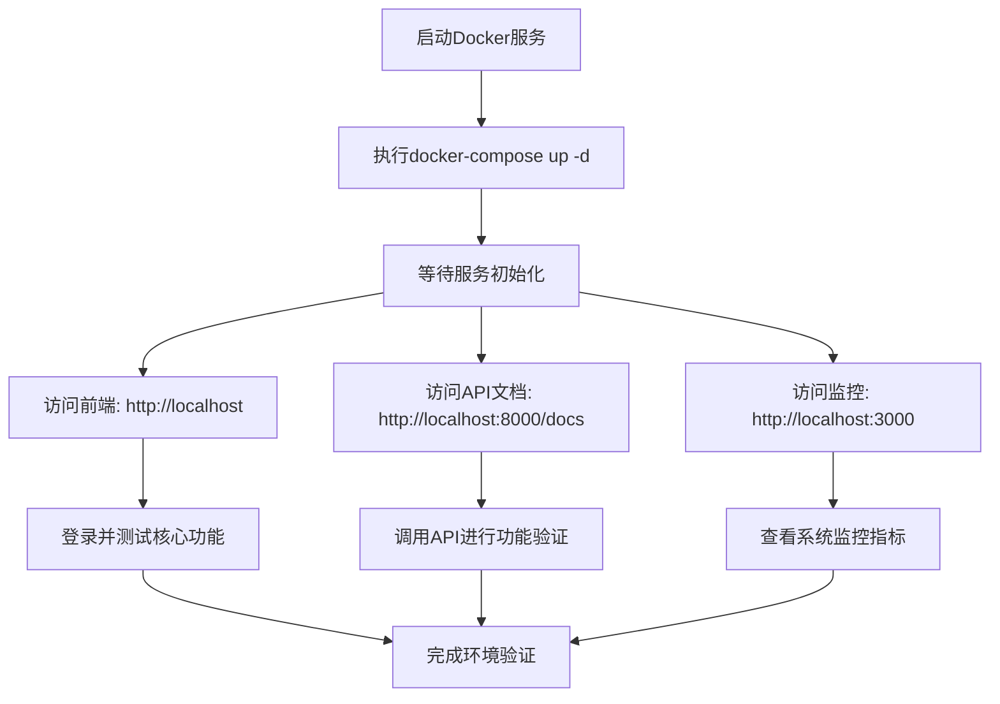
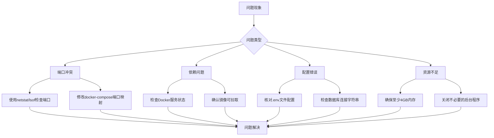

# 快速入门

<cite>
**本文档中引用的文件**  
- [README.md](file://README.md)
- [deployment_instructions.md](file://deployment_instructions.md)
- [docker-compose.yml](file://docker-compose.yml)
- [backend/requirements.txt](file://backend/requirements.txt)
- [frontend/package.json](file://frontend/package.json)
- [backend/Dockerfile](file://backend/Dockerfile)
- [frontend/Dockerfile](file://frontend/Dockerfile)
- [backend/init.sql](file://backend/init.sql)
- [backend/main.py](file://backend/main.py)
- [api-gateway/.env.example](file://api-gateway/.env.example)
- [decision-service/.env.example](file://decision-service/.env.example)
</cite>

## 目录

1. [简介](#简介)
2. [前置依赖安装](#前置依赖安装)
3. [项目克隆与环境配置](#项目克隆与环境配置)
4. [服务部署与启动](#服务部署与启动)
5. [服务访问与功能验证](#服务访问与功能验证)
6. [常见问题排查](#常见问题排查)
7. [总结](#总结)

## 简介

本指南旨在帮助新开发者在30分钟内完成AI决策系统的本地环境搭建与运行。系统采用现代化技术栈，包含前端、后端、区块链、边缘计算与监控组件。通过Docker Compose实现一键部署，确保开发环境一致性。

**Section sources**
- [README.md](file://README.md#L1-L165)

## 前置依赖安装

### 1. Docker 与 Docker Compose
系统依赖Docker进行容器化部署，请安装以下组件：
- **Docker Desktop**（Windows/Mac）或 **Docker Engine**（Linux）
- **Docker Compose**（通常随Docker Desktop自动安装）

验证安装：
```bash
docker --version
docker-compose --version
```

### 2. Python 3.9+
后端服务基于Python 3.9+构建，用于本地调试与开发。

安装方式：
- 推荐使用 [pyenv](https://github.com/pyenv/pyenv) 或 [Anaconda](https://www.anaconda.com/) 管理Python版本
- 验证安装：`python --version`

### 3. Node.js 18+
前端开发依赖Node.js 18+，用于构建与调试。

安装方式：
- 通过 [Node.js官网](https://nodejs.org/) 下载LTS版本
- 验证安装：`node --version`

### 4. 其他工具（可选）
- **Git**：用于代码克隆
- **curl**：用于健康检查
- **Postman** 或 **curl**：用于API测试

**Section sources**
- [README.md](file://README.md#L5-L26)

## 项目克隆与环境配置

### 1. 克隆项目仓库
```bash
git clone <repository-url>
cd 1.5
```

### 2. 环境变量配置
系统使用`.env`文件管理环境变量。根据示例文件创建配置：

#### 后端数据库与缓存配置
复制并编辑PostgreSQL与Redis配置：
```bash
# 查看数据库初始化脚本
cat backend/init.sql
```

该脚本将自动创建`ai_platform`数据库及`users`、`ai_models`、`performance_metrics`表。

#### API网关环境变量
```bash
cp api-gateway/.env.example api-gateway/.env
# 根据需要修改PORT、JWT_SECRET等
```

#### 决策服务环境变量
```bash
cp decision-service/.env.example decision-service/.env
# 修改DATABASE_URL、REDIS_URL等连接信息
```

### 3. 依赖安装（可选，用于本地开发）
若需在宿主机运行服务（非Docker），需安装依赖：

#### 安装前端依赖
```bash
cd frontend
npm install
```

#### 安装后端依赖
```bash
cd ../backend
pip install -r requirements.txt
```

**Section sources**
- [backend/requirements.txt](file://backend/requirements.txt#L1-L53)
- [frontend/package.json](file://frontend/package.json#L1-L63)
- [backend/init.sql](file://backend/init.sql#L1-L35)

## 服务部署与启动

### 1. 使用Docker Compose一键启动
系统提供完整的`docker-compose.yml`文件，包含所有服务：

```bash
# 在项目根目录执行
docker-compose up -d
```

该命令将启动以下服务：
- **backend**：后端API服务（端口8000）
- **frontend**：前端Web应用（端口80）
- **redis**：缓存服务（端口6379）
- **postgres**：PostgreSQL数据库（端口5432）
- **prometheus**：监控系统（端口9090）
- **grafana**：可视化仪表板（端口3000）

### 2. 服务状态检查
```bash
# 查看所有服务状态
docker-compose ps

# 查看后端日志
docker-compose logs -f backend

# 查看前端日志
docker-compose logs -f frontend
```

### 3. 健康检查
系统配置了健康检查机制，可通过以下方式验证：

```bash
# 检查后端健康状态
curl http://localhost:8000/health

# 预期返回
{"status":"healthy","timestamp":"2024-01-01T00:00:00Z"}
```

**Section sources**
- [docker-compose.yml](file://docker-compose.yml#L1-L113)
- [backend/Dockerfile](file://backend/Dockerfile#L1-L34)
- [frontend/Dockerfile](file://frontend/Dockerfile#L1-L32)

## 服务访问与功能验证

### 1. 前端应用访问
打开浏览器访问：
- **地址**: `http://localhost`
- **说明**: 前端服务通过Nginx暴露在80端口

### 2. 后端API访问
- **API基础地址**: `http://localhost:8000`
- **API文档**: `http://localhost:8000/docs`（Swagger UI）
- **健康检查**: `http://localhost:8000/health`

### 3. 监控系统访问
- **Grafana仪表板**: `http://localhost:3000`（用户名: admin, 密码: admin）
- **Prometheus**: `http://localhost:9090`

### 4. 功能验证步骤
1. **登录前端**：使用默认账户或注册新用户
2. **模型管理**：尝试加载预置AI模型
3. **推理测试**：调用`/api/v1/inference`接口进行预测
4. **区块链操作**：查看模型版本上链记录
5. **性能监控**：在Grafana中查看API响应时间与系统资源使用率



**Diagram sources**
- [docker-compose.yml](file://docker-compose.yml#L1-L113)
- [deployment_instructions.md](file://deployment_instructions.md#L28-L39)

**Section sources**
- [deployment_instructions.md](file://deployment_instructions.md#L28-L39)
- [README.md](file://README.md#L80-L89)

## 常见问题排查

### 1. 端口冲突
**问题**：`Error: Port 80 is already in use`
**解决方案**：
- 检查占用端口的进程：`netstat -ano | findstr :80`（Windows）或 `lsof -i :80`（Mac/Linux）
- 停止占用进程或修改`docker-compose.yml`中的端口映射

### 2. 镜像拉取失败
**问题**：`pull access denied for redis:7-alpine`
**解决方案**：
- 确保Docker服务正在运行
- 检查网络连接，必要时配置镜像加速器

### 3. 数据库连接失败
**问题**：后端日志显示`could not connect to server: Connection refused`
**解决方案**：
- 确认`postgres`服务已启动：`docker-compose ps`
- 检查`DATABASE_URL`环境变量配置是否正确
- 查看数据库日志：`docker-compose logs postgres`

### 4. 前端无法访问后端API
**问题**：浏览器报CORS错误
**解决方案**：
- 确认前端环境变量`VITE_API_BASE_URL`指向正确后端地址
- 检查后端CORS配置，确保包含前端域名

### 5. 服务启动缓慢
**首次启动时，数据库初始化和依赖安装可能导致延迟，建议等待2-3分钟再检查状态。**



**Diagram sources**
- [deployment_instructions.md](file://deployment_instructions.md#L58-L67)
- [docker-compose.yml](file://docker-compose.yml#L1-L113)

**Section sources**
- [deployment_instructions.md](file://deployment_instructions.md#L58-L67)

## 总结

通过本指南，您已成功完成AI决策系统的本地部署。系统采用微服务架构，通过Docker Compose实现一键启动，包含完整的前端、后端、数据库、缓存与监控组件。

**关键要点回顾**：
- 使用`docker-compose up -d`启动所有服务
- 前端访问`http://localhost`，API文档在`http://localhost:8000/docs`
- 监控系统位于`http://localhost:3000`（Grafana）
- 遇到问题时使用`docker-compose logs`查看日志

现在您可以开始探索系统功能，进行开发或测试工作。

**Section sources**
- [README.md](file://README.md#L1-L165)
- [deployment_instructions.md](file://deployment_instructions.md#L1-L81)