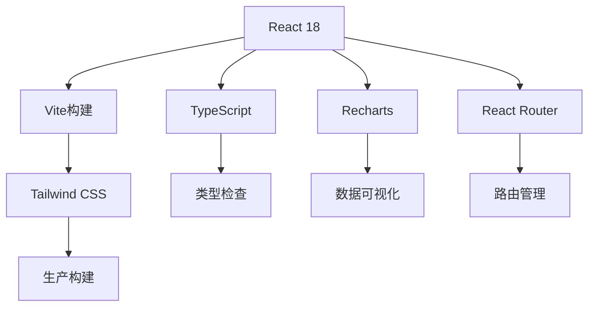
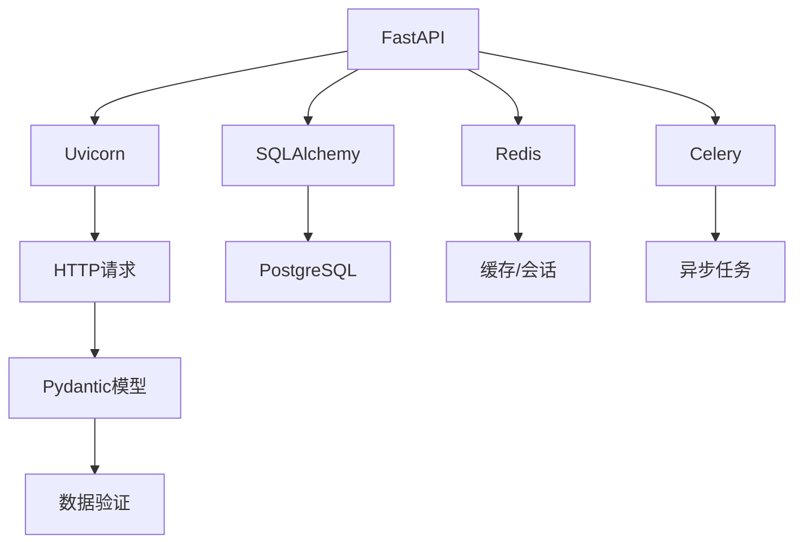
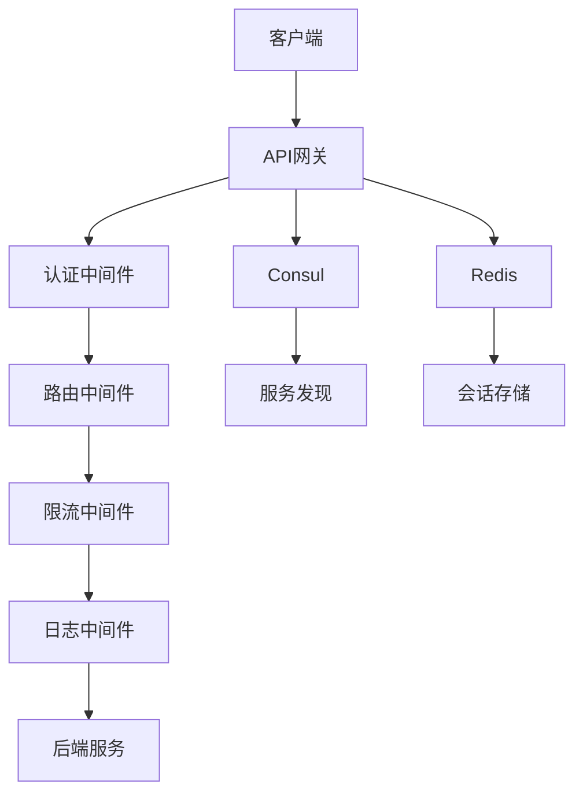
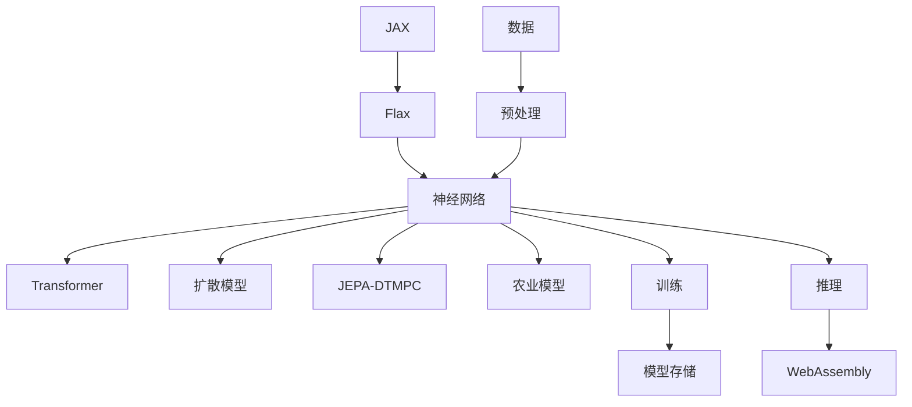
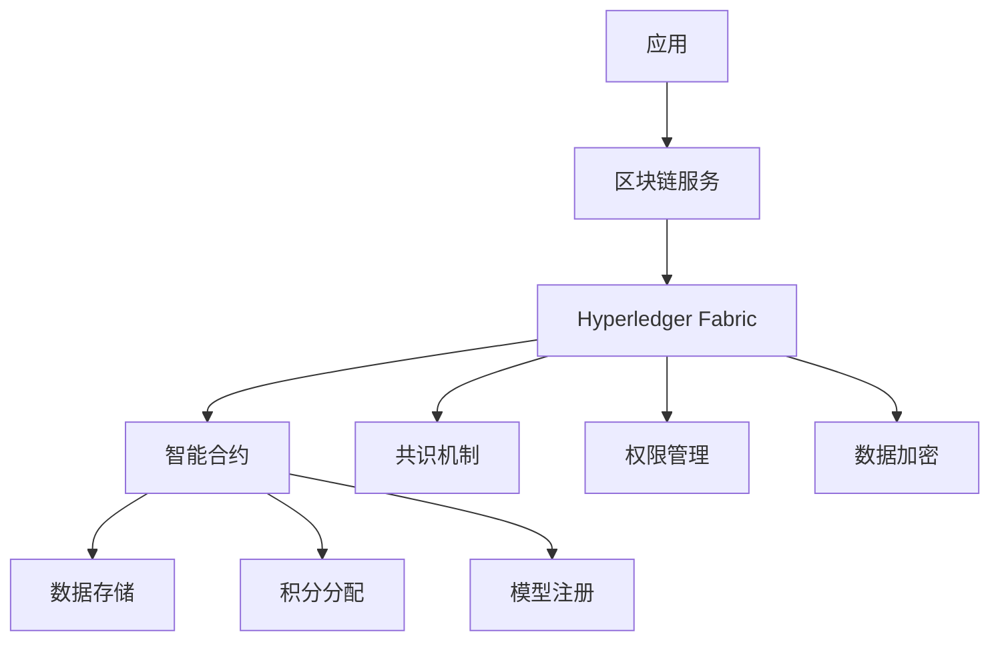
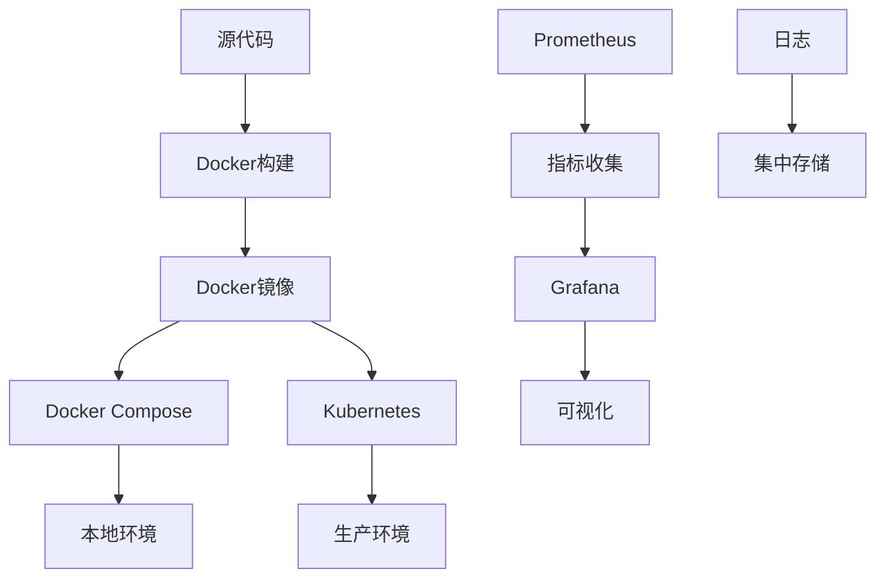
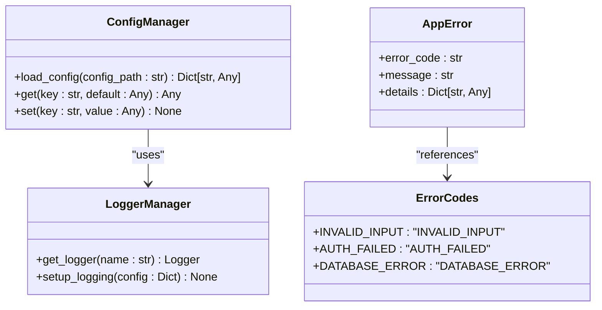

# 技术栈与依赖

<cite>
**本文档引用文件**  
- [package.json](file://package.json)
- [frontend/package.json](file://frontend/package.json)
- [api-gateway/package.json](file://api-gateway/package.json)
- [backend/requirements.txt](file://backend/requirements.txt)
- [core-framework/requirements.txt](file://core-framework/requirements.txt)
- [decision-service/requirements.txt](file://decision-service/requirements.txt)
- [backend/pyproject.toml](file://backend/pyproject.toml)
- [core-framework/pyproject.toml](file://core-framework/pyproject.toml)
- [decision-service/pyproject.toml](file://decision-service/pyproject.toml)
- [backend/Dockerfile](file://backend/Dockerfile)
- [frontend/Dockerfile](file://frontend/Dockerfile)
- [docker-compose.yml](file://docker-compose.yml)
- [infrastructure/docker-compose.yml](file://infrastructure/docker-compose.yml)
- [ai_decision_system_architecture.md](file://ai_decision_system_architecture.md)
- [microservices-architecture-design.md](file://microservices-architecture-design.md)
</cite>

## 目录
1. [引言](#引言)
2. [前端技术栈](#前端技术栈)
3. [后端技术栈](#后端技术栈)
4. [API网关技术栈](#api网关技术栈)
5. [AI框架与机器学习技术](#ai框架与机器学习技术)
6. [区块链技术](#区块链技术)
7. [基础设施与部署](#基础设施与部署)
8. [核心依赖版本与兼容性](#核心依赖版本与兼容性)
9. [内部框架：core-framework](#内部框架core-framework)
10. [依赖管理最佳实践](#依赖管理最佳实践)
11. [结论](#结论)

## 引言

本项目是一个基于微服务架构的AI农业决策系统，集成了人工智能、区块链、边缘计算和Web技术。系统采用现代化的技术栈，支持从数据采集、AI决策、区块链溯源到前端可视化展示的完整闭环。技术选型遵循高可用性、可扩展性和安全性原则，确保系统能够稳定运行并支持未来功能扩展。

**Section sources**
- [ai_decision_system_architecture.md](file://ai_decision_system_architecture.md)
- [microservices-architecture-design.md](file://microservices-architecture-design.md)

## 前端技术栈

前端系统基于React 18和TypeScript构建，采用现代化的开发工具链和UI组件库，提供高性能、响应式的用户界面。

### 核心技术组件

- **React 18**：作为前端核心框架，利用其并发渲染特性提升用户体验
- **TypeScript**：提供静态类型检查，增强代码可维护性和开发效率
- **Vite**：作为构建工具，提供快速的开发服务器启动和热更新
- **Tailwind CSS**：实用优先的CSS框架，实现高效的UI开发
- **React Router DOM**：处理前端路由和导航
- **Recharts**：基于React的图表库，用于数据可视化

### 开发与构建工具

- **ESLint**：代码质量检查工具
- **Prettier**：代码格式化工具
- **Vitest**：单元测试框架
- **Playwright**：端到端测试框架

**Diagram sources**
- [frontend/package.json](file://frontend/package.json)
- [frontend/vite.config.ts](file://frontend/vite.config.ts)

**Section sources**
- [frontend/package.json](file://frontend/package.json)
- [frontend/tsconfig.json](file://frontend/tsconfig.json)

## 后端技术栈

后端系统采用Python生态，以FastAPI为核心框架，构建高性能、类型安全的RESTful API服务。

### 核心技术组件

- **FastAPI**：现代化的Python Web框架，基于Starlette和Pydantic，提供自动API文档生成和高性能
- **Uvicorn**：ASGI服务器，支持异步请求处理
- **Pydantic**：数据验证和设置管理库，提供类型安全的数据模型
- **SQLAlchemy**：ORM框架，用于数据库操作
- **Redis**：内存数据结构存储，用于缓存和会话管理
- **PostgreSQL**：关系型数据库，存储结构化数据

### 安全与认证

- **PyJWT**：JSON Web Token实现，用于用户认证
- **bcrypt**：密码哈希算法，安全存储用户密码
- **Cryptography**：加密库，提供数据加密功能

### 异步处理

- **Celery**：分布式任务队列，处理异步任务
- **Asyncio**：Python异步编程框架

**Diagram sources**
- [backend/requirements.txt](file://backend/requirements.txt)
- [backend/main.py](file://backend/main.py)

**Section sources**
- [backend/requirements.txt](file://backend/requirements.txt)
- [backend/pyproject.toml](file://backend/pyproject.toml)

## API网关技术栈

API网关作为系统的统一入口，负责请求路由、认证授权、限流熔断等关键功能。

### 核心技术组件

- **Express.js**：Node.js Web框架，提供灵活的路由和中间件系统
- **TypeScript**：为网关提供类型安全
- **Consul**：服务发现和配置管理
- **JWT**：JSON Web Token，实现认证授权
- **Redis**：存储会话和限流数据
- **Winston**：日志记录库

### 核心功能

- **请求路由**：根据URL路径将请求转发到相应的后端服务
- **认证授权**：验证JWT令牌，确保请求合法性
- **限流熔断**：防止服务过载，保护后端系统
- **日志记录**：记录所有请求和响应，便于监控和调试
- **健康检查**：监控后端服务健康状态

**Diagram sources**
- [api-gateway/package.json](file://api-gateway/package.json)
- [api-gateway/src/server.ts](file://api-gateway/src/server.ts)

**Section sources**
- [api-gateway/package.json](file://api-gateway/package.json)
- [api-gateway/src/index.ts](file://api-gateway/src/index.ts)

## AI框架与机器学习技术

AI框架是系统的核心，支持复杂的机器学习模型训练和推理。

### 核心技术组件

- **JAX**：Google开发的数值计算库，支持自动微分和GPU/TPU加速
- **Flax**：基于JAX的神经网络库，提供灵活的模型定义方式
- **NumPy**：基础数值计算库
- **Pandas**：数据处理和分析库
- **Scikit-learn**：传统机器学习算法库

### 模型架构

- **Transformer模型**：用于序列数据处理
- **扩散模型**：用于生成式AI任务
- **JEPA-DTMPC融合模型**：项目特有的融合模型，结合了多种AI技术
- **农业模型**：针对农业场景优化的专用模型

### 训练与推理

- **分布式DCNN**：支持分布式深度卷积神经网络训练
- **联邦学习**：支持边缘设备上的分布式模型训练
- **WebAssembly**：在浏览器中运行AI模型推理

**Diagram sources**
- [backend/requirements.txt](file://backend/requirements.txt)
- [backend/src/core/models](file://backend/src/core/models)
- [backend/patched_flax](file://backend/patched_flax)

**Section sources**
- [backend/requirements.txt](file://backend/requirements.txt)
- [backend/src/core/models](file://backend/src/core/models)

## 区块链技术

区块链技术用于确保数据的不可篡改性和可追溯性，支持去中心化的积分奖励系统。

### 核心技术组件

- **Hyperledger Fabric**：企业级区块链平台，提供模块化架构和权限控制
- **HFC**：Hyperledger Fabric SDK for Python
- **Protobuf**：协议缓冲区，用于数据序列化
- **gRPC**：远程过程调用框架，用于节点间通信

### 核心功能

- **智能合约**：在区块链上执行的自动化合约
- **数据溯源**：记录数据的来源和变更历史
- **积分奖励**：基于贡献度的代币分配机制
- **模型注册**：将AI模型信息注册到区块链

### 配置与管理

- **fabric_config.yaml**：Hyperledger Fabric配置文件
- **smart_contracts.go**：用Go语言编写的智能合约示例

**Diagram sources**
- [backend/requirements.txt](file://backend/requirements.txt)
- [backend/blockchain/fabric_config.yaml](file://backend/blockchain/fabric_config.yaml)
- [backend/src/blockchain](file://backend/src/blockchain)

**Section sources**
- [backend/requirements.txt](file://backend/requirements.txt)
- [backend/blockchain/fabric_config.yaml](file://backend/blockchain/fabric_config.yaml)

## 基础设施与部署

系统采用现代化的基础设施技术，支持容器化部署和自动化运维。

### 核心技术组件

- **Docker**：容器化技术，实现环境一致性
- **Kubernetes**：容器编排系统，管理容器化应用
- **Prometheus**：监控系统，收集和存储指标数据
- **Grafana**：可视化平台，展示监控数据
- **Nginx**：反向代理和Web服务器

### 部署架构

- **多阶段Docker构建**：优化镜像大小和构建效率
- **Docker Compose**：本地开发环境的容器编排
- **Kubernetes部署**：生产环境的容器编排

### 监控与日志

- **Prometheus**：收集系统和应用指标
- **Grafana**：创建监控仪表板
- **日志聚合**：集中管理各服务的日志

**Diagram sources**
- [backend/Dockerfile](file://backend/Dockerfile)
- [frontend/Dockerfile](file://frontend/Dockerfile)
- [docker-compose.yml](file://docker-compose.yml)
- [infrastructure/kubernetes](file://infrastructure/kubernetes)
- [infrastructure/grafana](file://infrastructure/grafana)

**Section sources**
- [backend/Dockerfile](file://backend/Dockerfile)
- [frontend/Dockerfile](file://frontend/Dockerfile)
- [docker-compose.yml](file://docker-compose.yml)

## 核心依赖版本与兼容性

### 前端依赖版本

- React: ^18.2.0
- TypeScript: ^5.0.0
- Vite: ^5.0.0
- Tailwind CSS: ^3.4.17
- React Router DOM: ^6.8.0

### 后端依赖版本

- FastAPI: 0.104.1
- Uvicorn: 0.24.0
- JAX: 0.4.20
- Flax: 0.7.4
- SQLAlchemy: 2.0.0
- Redis: 5.0.0

### API网关依赖版本

- Express.js: ^4.18.2
- TypeScript: ^5.1.3
- Consul: ^0.40.0
- JWT: ^9.0.1

### 兼容性说明

- **Python版本**：所有Python服务要求Python 3.9或更高版本
- **Node.js版本**：前端和API网关要求Node.js 18或更高版本
- **Docker版本**：建议使用Docker 20.10或更高版本
- **Kubernetes版本**：建议使用Kubernetes 1.25或更高版本

**Section sources**
- [frontend/package.json](file://frontend/package.json)
- [backend/requirements.txt](file://backend/requirements.txt)
- [api-gateway/package.json](file://api-gateway/package.json)
- [backend/pyproject.toml](file://backend/pyproject.toml)

## 内部框架：core-framework

core-framework是系统的内部基础框架，为其他模块提供通用功能支持。

### 核心功能

- **配置管理**：统一的配置加载和管理机制
- **日志管理**：标准化的日志记录接口
- **错误处理**：统一的错误码和异常处理机制
- **异步支持**：基于asyncio的异步编程支持

### 设计原则

- **模块化**：功能按模块划分，便于维护和扩展
- **可复用性**：提供通用功能，避免代码重复
- **类型安全**：使用Pydantic和类型注解确保类型安全
- **可测试性**：设计时考虑单元测试和集成测试

### 依赖关系

- **核心依赖**：Pydantic、Loguru、PyYAML
- **可选依赖**：Redis、PostgreSQL（按需使用）
- **开发依赖**：pytest、black、mypy等

**Diagram sources**
- [core-framework/src/config/config_manager.py](file://core-framework/src/config/config_manager.py)
- [core-framework/src/logging/logger_manager.py](file://core-framework/src/logging/logger_manager.py)
- [core-framework/src/errors/app_errors.py](file://core-framework/src/errors/app_errors.py)

**Section sources**
- [core-framework/requirements.txt](file://core-framework/requirements.txt)
- [core-framework/pyproject.toml](file://core-framework/pyproject.toml)

## 依赖管理最佳实践

### 安全升级依赖

1. **定期检查**：使用`pip list --outdated`或`npm outdated`检查过时的依赖
2. **小步升级**：每次只升级一个主要版本，避免大规模变更
3. **测试验证**：升级后运行完整的测试套件，确保功能正常
4. **回滚计划**：准备回滚方案，应对升级后的问题

### 处理版本冲突

1. **依赖锁定**：使用`requirements.txt`或`package-lock.json`锁定依赖版本
2. **虚拟环境**：为不同项目使用独立的虚拟环境，避免全局冲突
3. **依赖隔离**：将不兼容的依赖放在不同的服务中
4. **兼容层**：为不兼容的API版本创建适配器

### 依赖管理策略

1. **最小化依赖**：只引入必要的依赖，减少攻击面
2. **定期审计**：使用`pip-audit`或`snyk`检查依赖的安全漏洞
3. **文档记录**：记录每个依赖的用途和版本选择原因
4. **自动化**：使用CI/CD自动化依赖更新和安全检查

### 版本控制实践

1. **语义化版本**：遵循语义化版本规范（MAJOR.MINOR.PATCH）
2. **变更日志**：为每个版本发布详细的变更日志
3. **分支策略**：使用Git分支管理不同版本的开发
4. **标签管理**：为稳定版本打标签，便于追溯

**Section sources**
- [backend/requirements.txt](file://backend/requirements.txt)
- [frontend/package.json](file://frontend/package.json)
- [api-gateway/package.json](file://api-gateway/package.json)
- [core-framework/requirements.txt](file://core-framework/requirements.txt)

## 结论

本项目采用现代化的技术栈，构建了一个功能完整、性能优越的AI农业决策系统。通过合理的技术选型和架构设计，系统具备高可用性、可扩展性和安全性。前端使用React 18和TypeScript提供优秀的用户体验，后端采用FastAPI和JAX/Flax支持复杂的AI计算，API网关确保系统的安全和稳定，区块链技术保障数据的可信性，而Docker和Kubernetes则实现了高效的部署和运维。

core-framework作为内部基础框架，为各模块提供了统一的配置、日志和错误处理机制，提高了代码的可维护性和复用性。通过遵循依赖管理的最佳实践，可以确保系统的长期稳定运行和安全。

未来，系统可以进一步优化AI模型的性能，扩展区块链的应用场景，以及增强边缘计算的能力，为用户提供更加智能和可靠的农业决策支持。