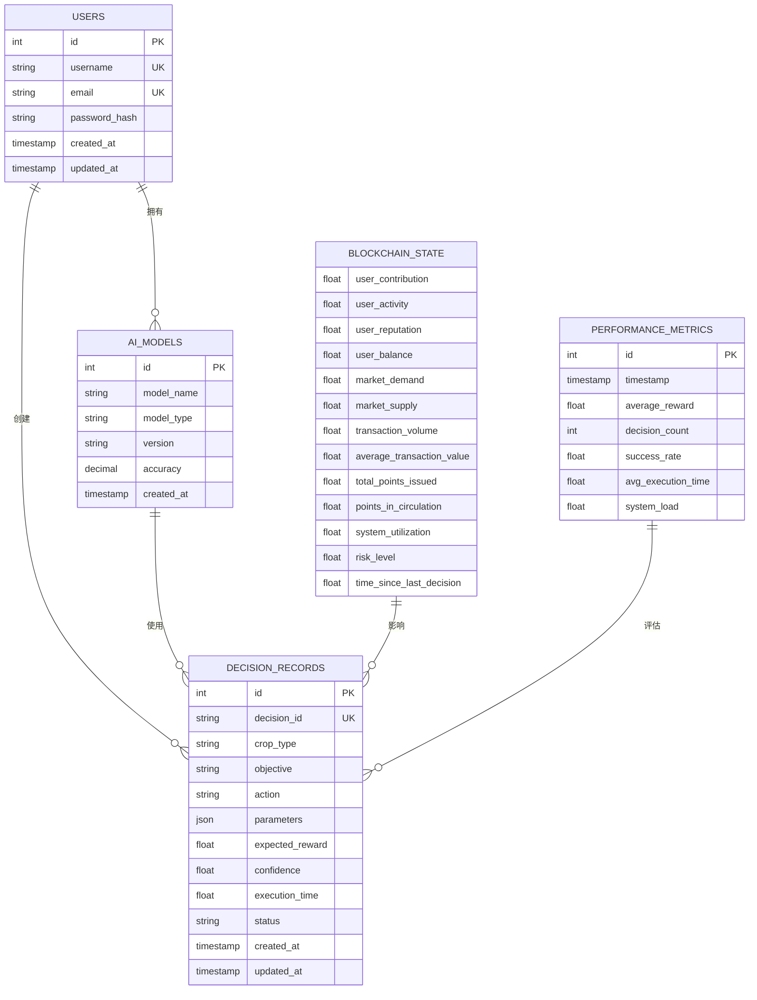
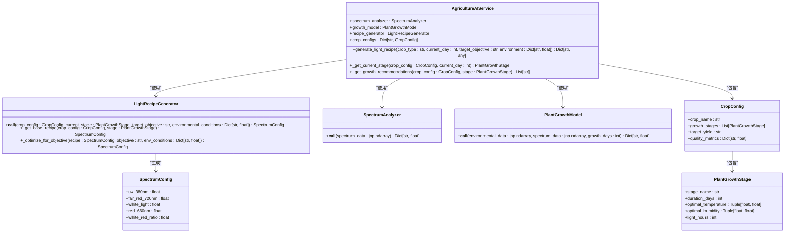
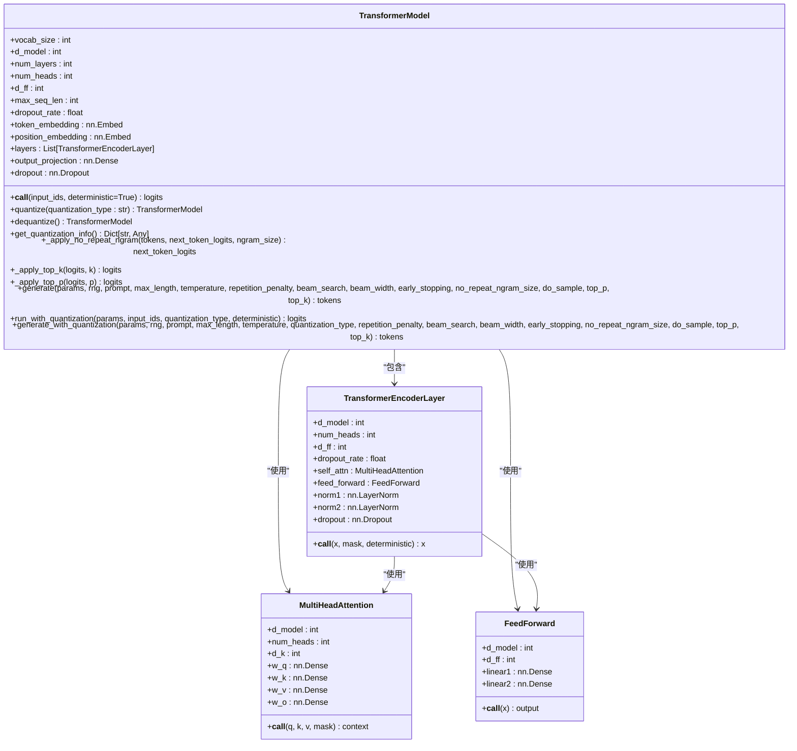

# 数据模型

<cite>
**本文档引用的文件**   
- [metadata.json](file://models/metadata.json)
- [init.sql](file://backend/init.sql)
- [agriculture_model.py](file://backend/src/core/models/agriculture_model.py)
- [transformer_model.py](file://backend/src/core/models/transformer_model.py)
- [decision_models.py](file://decision-service/src/models/decision_models.py)
</cite>

## 目录
1. [引言](#引言)
2. [核心数据实体](#核心数据实体)
3. [模型元数据管理](#模型元数据管理)
4. [用户信息模型](#用户信息模型)
5. [决策记录系统](#决策记录系统)
6. [区块链状态模型](#区块链状态模型)
7. [核心模型类与数据库映射](#核心模型类与数据库映射)
8. [数据生命周期与归档规则](#数据生命周期与归档规则)
9. [数据迁移与备份恢复](#数据迁移与备份恢复)
10. [查询优化最佳实践](#查询优化最佳实践)

## 引言
本文档全面阐述AI决策系统的核心数据模型，涵盖模型元数据、用户信息、决策记录与区块链状态等关键实体。基于`metadata.json`与`init.sql`文件，详细说明各实体的字段定义、数据类型、约束条件与索引策略。文档还描述了模型版本管理、数据生命周期与归档规则，并解释了核心模型类（如`agriculture_model.py`、`transformer_model.py`）与数据库表的映射关系。最后，为数据工程师提供数据迁移、备份恢复与查询优化的最佳实践。

## 核心数据实体
系统的核心数据实体包括AI模型、用户、性能指标、决策记录和区块链状态。这些实体通过数据库表和元数据文件进行定义和管理，支持系统的各项功能。

**图源**
- [init.sql](file://backend/init.sql#L10-L35)
- [decision_models.py](file://decision-service/src/models/decision_models.py#L42-L78)

## 模型元数据管理
模型元数据通过`metadata.json`文件进行管理，该文件定义了所有AI模型的详细信息，包括模型ID、名称、类型、框架、版本、状态、创建时间、更新时间、描述、文件路径、哈希值、是否预训练、预训练来源、模型格式和量化信息。

### 字段定义与约束
| 字段名 | 数据类型 | 约束 | 描述 |
| :--- | :--- | :--- | :--- |
| model_id | 字符串 | 唯一 | 模型唯一标识符 |
| name | 字符串 | 非空 | 模型中文名称 |
| type | 字符串 | 非空 | 模型类型（如classification, optimization, regression） |
| framework | 字符串 | 非空 | 开发框架（如pytorch, huggingface） |
| version | 字符串 | 非空 | 模型版本号 |
| status | 字符串 | 非空 | 模型状态（ready, trained, registered） |
| created_at | 时间戳 | 非空 | 模型创建时间 |
| updated_at | 时间戳 | 非空 | 模型更新时间 |
| description | 字符串 | 可选 | 模型功能描述 |
| file_path | 字符串 | 非空 | 模型文件存储路径 |
| hash | 字符串 | 非空 | 模型文件哈希值（SHA256） |
| is_pretrained | 布尔 | 非空 | 是否为预训练模型 |
| pretrained_source | 字符串 | 可选 | 预训练模型来源 |
| model_format | 字符串 | 非空 | 模型文件格式 |
| quantization | 对象 | 可选 | 量化配置信息 |

### 索引策略
- `model_id`字段建立唯一索引，确保模型ID的唯一性。
- `name`和`type`字段建立复合索引，支持按模型名称和类型进行快速查询。
- `status`字段建立索引，支持按模型状态进行过滤查询。

**节源**
- [metadata.json](file://models/metadata.json#L1-L171)

## 用户信息模型
用户信息存储在`users`表中，包含用户的基本信息和账户状态。

### 字段定义与约束
| 字段名 | 数据类型 | 约束 | 描述 |
| :--- | :--- | :--- | :--- |
| id | 整数 | 主键，自增 | 用户唯一标识符 |
| username | 字符串(50) | 唯一，非空 | 用户名 |
| email | 字符串(100) | 唯一，非空 | 电子邮箱 |
| password_hash | 字符串(255) | 非空 | 密码哈希值 |
| created_at | 时间戳 | 非空，默认当前时间 | 账户创建时间 |
| updated_at | 时间戳 | 非空，默认当前时间，更新时自动更新 | 账户更新时间 |

### 索引策略
- `id`字段作为主键，自动建立聚簇索引。
- `username`和`email`字段建立唯一索引，确保用户名和邮箱的唯一性。

**节源**
- [init.sql](file://backend/init.sql#L10-L17)

## 决策记录系统
决策记录系统用于跟踪和审计所有决策过程，确保系统的透明性和可追溯性。

### 决策记录表
`decision_records`表存储每次决策的详细信息。

| 字段名 | 数据类型 | 约束 | 描述 |
| :--- | :--- | :--- | :--- |
| id | 整数 | 主键，自增 | 记录唯一标识符 |
| decision_id | 字符串(64) | 唯一，非空 | 决策ID |
| batch_id | 字符串(64) | 可选 | 批次ID |
| crop_type | 字符串(50) | 非空 | 作物类型 |
| objective | 字符串(20) | 非空 | 决策目标 |
| action | 字符串(20) | 非空 | 执行动作 |
| parameters | JSON | 非空 | 动作参数 |
| expected_reward | 浮点数 | 非空 | 预期奖励 |
| confidence | 浮点数 | 非空 | 置信度 |
| execution_time | 浮点数 | 非空 | 执行时间（秒） |
| status | 字符串(20) | 默认'pending' | 决策状态 |
| created_at | 时间戳 | 非空，默认当前时间 | 创建时间 |
| updated_at | 时间戳 | 更新时自动更新 | 更新时间 |

### 决策反馈表
`decision_feedbacks`表存储决策执行后的反馈信息。

| 字段名 | 数据类型 | 约束 | 描述 |
| :--- | :--- | :--- | :--- |
| id | 整数 | 主键，自增 | 反馈记录唯一标识符 |
| decision_id | 字符串(64) | 非空，索引 | 关联的决策ID |
| actual_reward | 浮点数 | 非空 | 实际奖励 |
| next_state | JSON | 非空 | 下一状态 |
| success_indicator | 布尔 | 非空 | 成功指标 |
| feedback_notes | 文本 | 可选 | 反馈备注 |
| created_at | 时间戳 | 非空，默认当前时间 | 创建时间 |

### 索引策略
- `decision_id`字段建立唯一索引，确保决策ID的唯一性。
- `crop_type`和`objective`字段建立复合索引，支持按作物类型和决策目标进行查询。
- `created_at`字段建立索引，支持按时间范围进行查询。

**节源**
- [decision_models.py](file://decision-service/src/models/decision_models.py#L42-L72)

## 区块链状态模型
区块链状态模型用于描述系统的当前状态，支持基于状态的决策。

### 区块链状态实体
| 字段名 | 数据类型 | 描述 |
| :--- | :--- | :--- |
| user_contribution | 浮点数 | 用户贡献度 |
| user_activity | 浮点数 | 用户活跃度 |
| user_reputation | 浮点数 | 用户声誉 |
| user_balance | 浮点数 | 用户余额 |
| market_demand | 浮点数 | 市场需求 |
| market_supply | 浮点数 | 市场供应 |
| transaction_volume | 浮点数 | 交易量 |
| average_transaction_value | 浮点数 | 平均交易价值 |
| total_points_issued | 浮点数 | 总发行积分 |
| points_in_circulation | 浮点数 | 流通积分 |
| system_utilization | 浮点数 | 系统利用率 |
| risk_level | 浮点数 | 风险水平 |
| time_since_last_decision | 浮点数 | 距离上次决策时间（秒） |

### 决策目标枚举
- `MAXIMIZE_ECOSYSTEM_GROWTH`: 最大化生态系统增长
- `OPTIMIZE_FAIRNESS`: 优化公平性
- `MINIMIZE_RISK`: 最小化风险
- `MAXIMIZE_EFFICIENCY`: 最大化效率

**节源**
- [blockchain_decision_engine.py](file://backend/src/core/decision/blockchain_decision_engine.py#L44-L55)

## 核心模型类与数据库映射
核心模型类与数据库表之间存在明确的映射关系，确保数据的一致性和完整性。

### 农业模型类
`agriculture_model.py`文件中的`AgricultureAIService`类与`ai_models`表和`decision_records`表存在映射关系。

**图源**
- [agriculture_model.py](file://backend/src/core/models/agriculture_model.py#L1-L463)

### 变压器模型类
`transformer_model.py`文件中的`TransformerModel`类与`ai_models`表存在映射关系。

**图源**
- [transformer_model.py](file://backend/src/core/models/transformer_model.py#L1-L633)

## 数据生命周期与归档规则
系统实施严格的数据生命周期管理，确保数据的高效存储和合规性。

### 数据生命周期阶段
1. **创建阶段**：数据首次生成并写入数据库。
2. **活跃阶段**：数据被频繁访问和更新。
3. **归档阶段**：数据访问频率降低，被移动到低成本存储。
4. **删除阶段**：数据达到保留期限后被永久删除。

### 归档规则
- **决策记录**：保留最近30天的活跃记录，超过30天的记录自动归档到历史表。
- **性能指标**：保留最近7天的详细指标，超过7天的指标聚合为每日平均值。
- **用户信息**：永久保留，除非用户主动删除账户。
- **模型元数据**：永久保留，与模型文件同生命周期。

**节源**
- [decision_monitoring_system.py](file://backend/src/core/decision/decision_monitoring_system.py#L148-L150)

## 数据迁移与备份恢复
为确保数据安全和系统可靠性，实施全面的数据迁移和备份恢复策略。

### 数据迁移最佳实践
1. **迁移前准备**：
   - 备份现有数据
   - 验证目标数据库的兼容性
   - 制定详细的迁移计划和回滚方案
2. **迁移过程**：
   - 使用批量插入提高效率
   - 实施数据校验确保完整性
   - 监控迁移进度和性能
3. **迁移后验证**：
   - 验证数据完整性和一致性
   - 测试系统功能
   - 监控系统性能

### 备份恢复策略
- **备份频率**：每日全量备份，每小时增量备份。
- **备份存储**：本地存储+云存储，确保异地容灾。
- **恢复测试**：每月进行一次恢复演练，验证备份有效性。
- **恢复流程**：
  1. 确定需要恢复的数据范围
  2. 选择最近的完整备份
  3. 应用增量备份到目标时间点
  4. 验证数据完整性和系统功能

**节源**
- [model_manager.py](file://backend/src/core/services/model_manager.py#L73-L82)

## 查询优化最佳实践
为提高系统性能，实施以下查询优化最佳实践。

### 索引优化
- 为经常用于WHERE、JOIN和ORDER BY子句的列创建索引。
- 避免过度索引，每个表的索引数量不超过5个。
- 定期分析查询执行计划，优化索引策略。

### 查询语句优化
- 使用具体列名代替`SELECT *`。
- 避免在WHERE子句中对列使用函数或计算。
- 使用EXISTS代替IN进行子查询。
- 合理使用JOIN，避免笛卡尔积。

### 缓存策略
- 实现多级缓存：应用级缓存+数据库级缓存。
- 为频繁访问的静态数据设置较长的缓存时间。
- 为动态数据设置较短的缓存时间，并实现缓存失效机制。

**节源**
- [performance_monitor.py](file://backend/src/performance/performance_monitor.py#L273-L306)