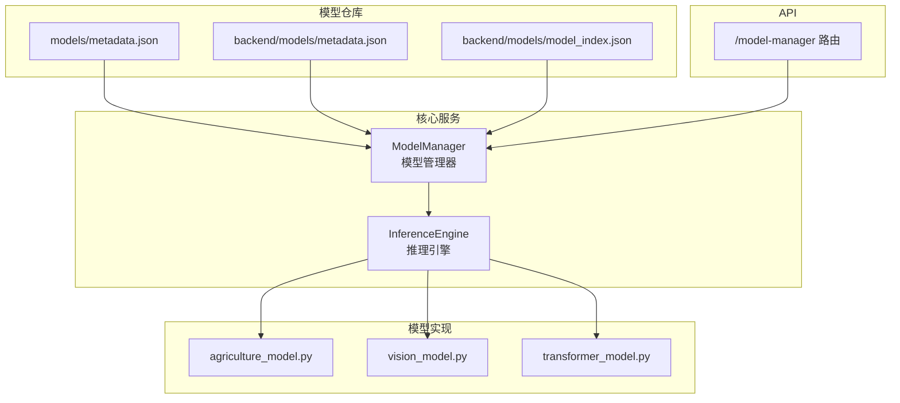
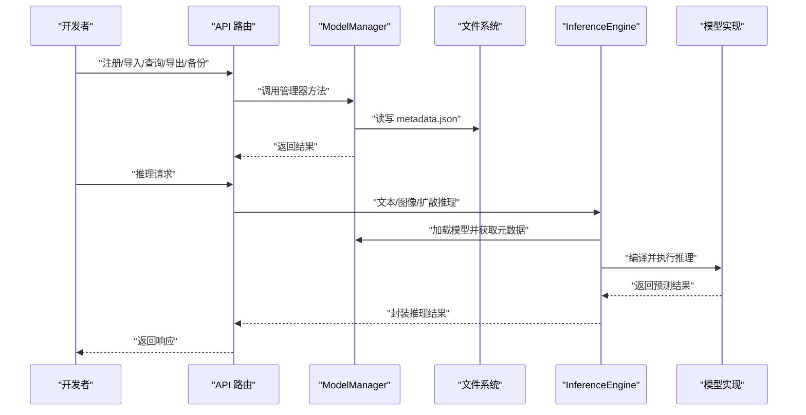
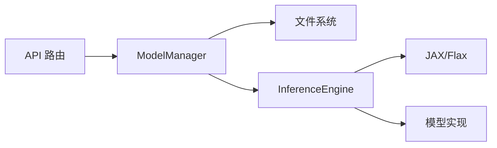

# 模型元数据

<cite>
**本文引用的文件**
- [models/metadata.json](file://models/metadata.json)
- [backend/models/metadata.json](file://backend/models/metadata.json)
- [backend/models/model_index.json](file://backend/models/model_index.json)
- [backend/src/core/models/agriculture_model.py](file://backend/src/core/models/agriculture_model.py)
- [backend/src/core/models/vision_model.py](file://backend/src/core/models/vision_model.py)
- [backend/src/core/models/transformer_model.py](file://backend/src/core/models/transformer_model.py)
- [backend/src/core/services/model_manager.py](file://backend/src/core/services/model_manager.py)
- [backend/src/api/routes/model_manager.py](file://backend/src/api/routes/model_manager.py)
- [backend/src/core/services/inference_engine.py](file://backend/src/core/services/inference_engine.py)
- [test_model_manager.py](file://test_model_manager.py)
</cite>

## 目录
1. [简介](#简介)
2. [项目结构](#项目结构)
3. [核心组件](#核心组件)
4. [架构总览](#架构总览)
5. [详细组件分析](#详细组件分析)
6. [依赖分析](#依赖分析)
7. [性能考虑](#性能考虑)
8. [故障排查指南](#故障排查指南)
9. [结论](#结论)
10. [附录](#附录)

## 简介
本文件系统性地文档化了系统中的“模型元数据”结构与管理流程，围绕两个 metadata.json 文件（顶层 models/metadata.json 与后端 backend/models/metadata.json）展开，详细说明：
- 模型注册信息、版本管理、状态跟踪与附加属性
- 字段 model_id、name、type、framework、version 的语义与约束
- 不同类型模型（transformer、vision、classification 等）的特定配置参数
- created_at/updated_at 时间戳管理机制、文件路径规范与哈希校验策略
- 与核心模型类（agriculture_model.py、vision_model.py、transformer_model.py）的映射关系
- 开发者最佳实践与元数据版本冲突的解决方案

## 项目结构
模型元数据主要分布在以下位置：
- 顶层模型仓库：models/metadata.json
- 后端模型仓库：backend/models/metadata.json
- 后端模型索引：backend/models/model_index.json
- 核心模型实现：backend/src/core/models/*
- 模型管理服务：backend/src/core/services/model_manager.py
- 推理引擎：backend/src/core/services/inference_engine.py
- API 路由：backend/src/api/routes/model_manager.py
- 测试脚本：test_model_manager.py

图表来源
- [models/metadata.json](file://models/metadata.json#L1-L171)
- [backend/models/metadata.json](file://backend/models/metadata.json#L1-L34)
- [backend/models/model_index.json](file://backend/models/model_index.json#L1-L95)
- [backend/src/core/services/model_manager.py](file://backend/src/core/services/model_manager.py#L1-L1209)
- [backend/src/core/services/inference_engine.py](file://backend/src/core/services/inference_engine.py#L1-L415)
- [backend/src/core/models/agriculture_model.py](file://backend/src/core/models/agriculture_model.py#L1-L463)
- [backend/src/core/models/vision_model.py](file://backend/src/core/models/vision_model.py#L1-L220)
- [backend/src/core/models/transformer_model.py](file://backend/src/core/models/transformer_model.py#L1-L633)
- [backend/src/api/routes/model_manager.py](file://backend/src/api/routes/model_manager.py#L1-L390)

章节来源
- [models/metadata.json](file://models/metadata.json#L1-L171)
- [backend/models/metadata.json](file://backend/models/metadata.json#L1-L34)
- [backend/models/model_index.json](file://backend/models/model_index.json#L1-L95)

## 核心组件
- 元数据文件：顶层与后端分别维护 models/metadata.json，后者更贴近后端模型持久化目录；两者共同构成模型注册与版本历史的权威来源。
- 模型管理器：负责元数据的加载、保存、版本生成、注册、导入导出、备份恢复、训练状态更新、量化与查询等。
- 推理引擎：依据元数据中的 type、metadata 等字段，编译并执行对应模型类型的推理（文本生成、图像分类、扩散生成等）。
- API 路由：提供统计、搜索、导出、导入、备份、恢复、版本查询等接口，统一调用模型管理器能力。
- 核心模型类：agriculture_model.py、vision_model.py、transformer_model.py 定义了具体模型结构与推理行为，与元数据中的 metadata 字段形成语义映射。

章节来源
- [backend/src/core/services/model_manager.py](file://backend/src/core/services/model_manager.py#L1-L1209)
- [backend/src/core/services/inference_engine.py](file://backend/src/core/services/inference_engine.py#L1-L415)
- [backend/src/api/routes/model_manager.py](file://backend/src/api/routes/model_manager.py#L1-L390)

## 架构总览
模型元数据贯穿“注册—版本—状态—推理—查询”的全链路，如下图所示：

图表来源
- [backend/src/api/routes/model_manager.py](file://backend/src/api/routes/model_manager.py#L1-L390)
- [backend/src/core/services/model_manager.py](file://backend/src/core/services/model_manager.py#L1-L1209)
- [backend/src/core/services/inference_engine.py](file://backend/src/core/services/inference_engine.py#L1-L415)

## 详细组件分析

### 元数据结构与字段语义
- 顶层 models/metadata.json 与后端 backend/models/metadata.json 的结构一致，均包含：
  - models：模型条目集合，键为 model_id，值为模型元数据
  - versions：按基础模型名分组的版本列表，记录每个版本的 model_id、version、created_at、status
- 关键字段语义与约束
  - model_id：模型唯一标识，建议采用“基础名_v版本号”或“基础名_语义化版本”的形式，便于版本追踪与映射
  - name：模型显示名称
  - type：模型类型，如 classification、regression、optimization、transformer、vision、diffusion 等
  - framework：模型框架，如 pytorch、huggingface、tensorflow、onnx 等
  - version：版本号，支持整数递增或语义化版本（如 1.0.0）
  - status：模型状态，如 registered、ready、training、trained、pretrained、quantized 等
  - created_at/updated_at：ISO 8601 时间戳，用于审计与排序
  - metadata：模型特定配置，如 transformer 的 vocab_size、max_seq_len、d_model、num_heads、num_layers、d_ff；vision 的 image_size、image_channels、num_classes、base_channels 等
  - description：模型描述
  - file_path：模型文件存储路径（相对或绝对）
  - hash：模型文件哈希（用于完整性校验）
  - is_pretrained/pretrained_source：预训练标志与来源
  - model_format：模型格式（如 pytorch、huggingface、onnx）
  - quantization：量化配置（enabled、type、original_model_id、压缩率、精度下降、推理加速等）
  - metrics/accuracy：训练后指标（accuracy、loss 等）

章节来源
- [models/metadata.json](file://models/metadata.json#L1-L171)
- [backend/models/metadata.json](file://backend/models/metadata.json#L1-L34)
- [backend/src/core/services/model_manager.py](file://backend/src/core/services/model_manager.py#L380-L495)
- [backend/src/core/services/model_manager.py](file://backend/src/core/services/model_manager.py#L846-L913)

### 版本管理与状态跟踪
- 版本生成策略
  - 新版本：若未显式提供 version，则根据基础模型 ID 自动推导下一个版本号（整数递增或语义化版本）
  - 版本历史：按基础模型名聚合，记录每个版本的 model_id、version、created_at、status
- 状态流转
  - 注册：registered
  - 训练中：training（训练任务期间）
  - 训练完成：trained（同时写入 metrics/accuracy）
  - 预训练：pretrained
  - 量化：quantized（含量化类型、压缩率、精度下降、推理加速等信息）
- 时间戳管理
  - created_at：首次创建时间
  - updated_at：最近变更时间（注册、训练、导入、备份恢复、指标更新等场景都会更新）

章节来源
- [backend/src/core/services/model_manager.py](file://backend/src/core/services/model_manager.py#L334-L366)
- [backend/src/core/services/model_manager.py](file://backend/src/core/services/model_manager.py#L380-L495)
- [backend/src/core/services/model_manager.py](file://backend/src/core/services/model_manager.py#L641-L693)
- [backend/src/core/services/model_manager.py](file://backend/src/core/services/model_manager.py#L846-L913)

### 元数据与代码实现的映射关系
- 农业模型（agriculture_model.py）
  - 类型：classification/optimization（通过元数据 type 字段区分）
  - 元数据映射：元数据中的 metadata 字段可包含与农业模型相关的超参（如作物类别、环境特征维度等），推理时可作为配置输入
  - 实现要点：该模块以数据类与模块化结构为主，推理模拟逻辑在模型管理器中体现
- 视觉模型（vision_model.py）
  - 类型：vision
  - 元数据映射：metadata 中的 image_size、image_channels、num_classes、base_channels 等与 VisionTransformer/ViT/CNN 架构参数一一对应
  - 实现要点：VisionModel 支持 VIT 与 CNN 两种子模型，推理引擎按 type 判断并编译相应函数
- Transformer 模型（transformer_model.py）
  - 类型：transformer
  - 元数据映射：metadata 中的 vocab_size、max_seq_len、d_model、num_heads、num_layers、d_ff 等与 TransformerModel 架构参数一一对应
  - 实现要点：提供量化推理接口（run_with_quantization/generate_with_quantization），并与元数据中的 quantization 字段协同

章节来源
- [backend/src/core/models/agriculture_model.py](file://backend/src/core/models/agriculture_model.py#L1-L463)
- [backend/src/core/models/vision_model.py](file://backend/src/core/models/vision_model.py#L1-L220)
- [backend/src/core/models/transformer_model.py](file://backend/src/core/models/transformer_model.py#L1-L633)
- [backend/src/core/services/inference_engine.py](file://backend/src/core/services/inference_engine.py#L1-L415)

### 文件路径规范与哈希校验策略
- 文件路径规范
  - 模型文件默认保存在模型存储目录下的 .pth 文件，文件名为“model_id.pth”
  - 导出/导入时生成对应格式文件（如 onnx），路径为“model_id.onnx”
- 哈希校验策略
  - 注册/导入时生成哈希（如 SHA256），用于模型文件完整性校验
  - 预训练模型加载时，模型 ID 基于来源路径的哈希生成，保证唯一性
- 备份与恢复
  - 备份包含元数据与版本信息，恢复时直接覆盖当前元数据，确保一致性

章节来源
- [backend/src/core/services/model_manager.py](file://backend/src/core/services/model_manager.py#L214-L269)
- [backend/src/core/services/model_manager.py](file://backend/src/core/services/model_manager.py#L380-L495)
- [backend/src/core/services/model_manager.py](file://backend/src/core/services/model_manager.py#L270-L333)
- [backend/src/core/services/model_manager.py](file://backend/src/core/services/model_manager.py#L997-L1091)

### API 与最佳实践
- 注册/导入/导出/备份/恢复/版本查询等接口由 API 路由统一暴露，底层委托给模型管理器
- 最佳实践
  - 注册模型时明确 type、framework、version、metadata，确保与实现类参数一致
  - 导入模型时提供准确的 metadata，以便推理引擎正确编译与预处理
  - 训练完成后及时更新 status 与 metrics/accuracy，便于查询与展示
  - 使用备份功能定期备份 metadata.json，防止数据丢失
  - 量化模型时记录 quantization 字段，便于后续推理加速与对比

章节来源
- [backend/src/api/routes/model_manager.py](file://backend/src/api/routes/model_manager.py#L1-L390)
- [backend/src/core/services/model_manager.py](file://backend/src/core/services/model_manager.py#L1-L1209)

### 版本冲突解决方案
- 冲突场景
  - 新版本模型 ID 已存在
  - 基础模型不存在却尝试创建新版本
- 解决方案
  - 在注册新版本前检查基础模型是否存在，若不存在则先注册基础模型
  - 若新版本 ID 已存在，应调整版本号或使用自动版本生成策略
  - 使用 get_model_versions 查询版本历史，避免重复注册相同版本

章节来源
- [backend/src/core/services/model_manager.py](file://backend/src/core/services/model_manager.py#L380-L495)
- [backend/src/core/services/model_manager.py](file://backend/src/core/services/model_manager.py#L961-L995)

## 依赖分析
- 模块耦合
  - ModelManager 依赖文件系统与 JSON 序列化，负责元数据的持久化与版本管理
  - InferenceEngine 依赖 ModelManager 获取元数据与模型状态，按 type 编译并执行推理
  - API 路由依赖 ModelManager 提供的管理能力
- 外部依赖
  - JAX/Flax 用于高性能推理与编译
  - FastAPI 用于 API 路由与响应模型

图表来源
- [backend/src/api/routes/model_manager.py](file://backend/src/api/routes/model_manager.py#L1-L390)
- [backend/src/core/services/model_manager.py](file://backend/src/core/services/model_manager.py#L1-L1209)
- [backend/src/core/services/inference_engine.py](file://backend/src/core/services/inference_engine.py#L1-L415)

章节来源
- [backend/src/core/services/model_manager.py](file://backend/src/core/services/model_manager.py#L1-L1209)
- [backend/src/core/services/inference_engine.py](file://backend/src/core/services/inference_engine.py#L1-L415)
- [backend/src/api/routes/model_manager.py](file://backend/src/api/routes/model_manager.py#L1-L390)

## 性能考虑
- 编译与缓存
  - 推理引擎对模型推理函数进行 JIT 编译并缓存，显著降低重复推理开销
- 量化推理
  - 支持量化推理（int8/float16/int16），在保证精度的前提下提升推理速度
- 批量推理
  - 支持批量处理，按批次切分输入，提高吞吐量
- 缓存与预加载
  - 模型管理器支持预加载常用模型，减少首次加载延迟

章节来源
- [backend/src/core/services/inference_engine.py](file://backend/src/core/services/inference_engine.py#L1-L415)
- [backend/src/core/services/model_manager.py](file://backend/src/core/services/model_manager.py#L367-L379)
- [backend/src/core/services/model_manager.py](file://backend/src/core/services/model_manager.py#L846-L913)

## 故障排查指南
- 模型不存在
  - 现象：加载/预测/导出/备份等操作返回“模型不存在”
  - 排查：确认 model_id 是否正确，是否已完成注册或导入；检查 metadata.json 是否存在且可读
- 版本冲突
  - 现象：注册新版本时报错“该版本模型已存在”或“原始模型不存在”
  - 排查：使用 get_model_versions 查看版本历史；确保基础模型已存在且版本号唯一
- 训练状态异常
  - 现象：训练任务长时间无进展或状态未更新
  - 排查：检查训练任务是否被取消；确认 status 是否在训练期间被错误修改
- 导入失败
  - 现象：导入文件报错“文件不存在”或“模型已存在”
  - 排查：确认上传文件路径有效；确保 model_id 唯一
- 备份/恢复失败
  - 现象：备份/恢复返回错误
  - 排查：确认备份路径可写；检查备份文件格式与内容完整性

章节来源
- [backend/src/core/services/model_manager.py](file://backend/src/core/services/model_manager.py#L496-L563)
- [backend/src/core/services/model_manager.py](file://backend/src/core/services/model_manager.py#L641-L718)
- [backend/src/api/routes/model_manager.py](file://backend/src/api/routes/model_manager.py#L149-L215)
- [backend/src/core/services/model_manager.py](file://backend/src/core/services/model_manager.py#L270-L333)

## 结论
本文件系统化梳理了模型元数据的结构、版本管理、状态跟踪与文件路径/哈希策略，并阐明了其与核心模型实现的映射关系。通过 API 路由与模型管理器的协作，实现了从注册、导入、训练、量化到推理与查询的完整闭环。开发者可据此建立标准化的模型生命周期管理流程，确保元数据与实现的一致性与可追溯性。

## 附录
- 元数据字段对照表（节选）
  - 必填字段：model_id、name、type、framework、version、status、created_at、updated_at
  - 可选字段：metadata、description、file_path、hash、is_pretrained、pretrained_source、model_format、quantization、metrics、accuracy
- 元数据版本历史查询
  - 通过 get_model_versions 获取按版本降序排列的历史记录，便于回溯与审计

章节来源
- [models/metadata.json](file://models/metadata.json#L1-L171)
- [backend/models/metadata.json](file://backend/models/metadata.json#L1-L34)
- [backend/src/core/services/model_manager.py](file://backend/src/core/services/model_manager.py#L961-L995)