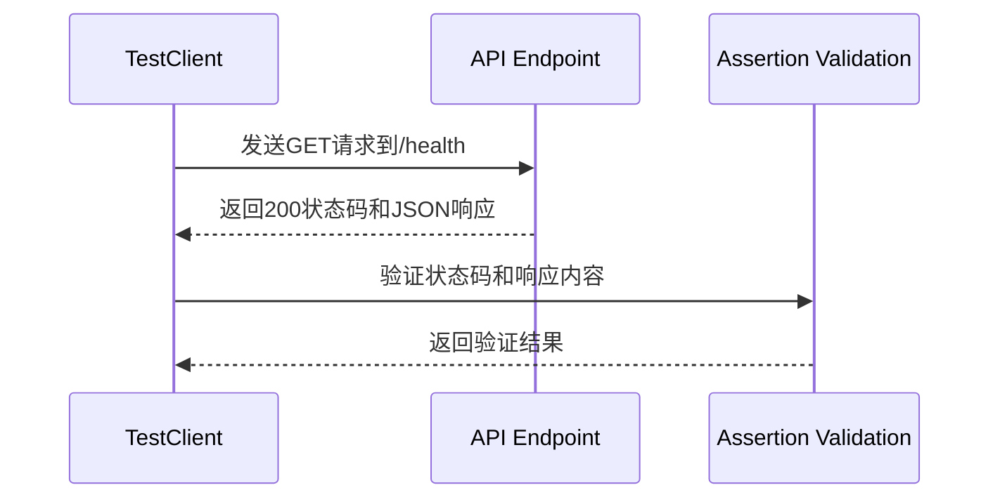
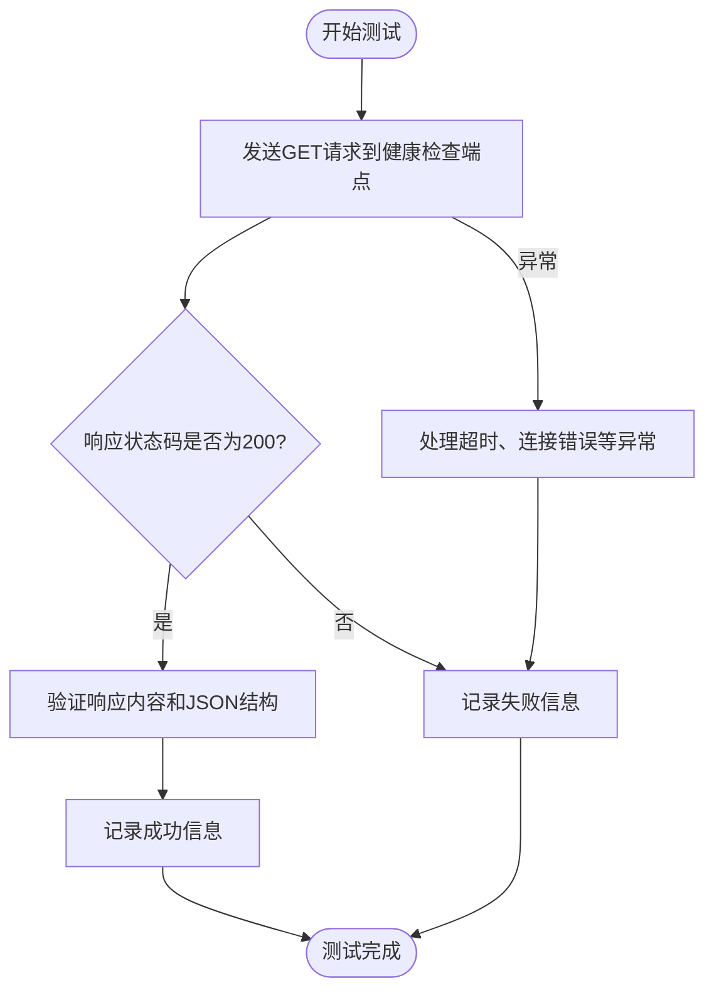
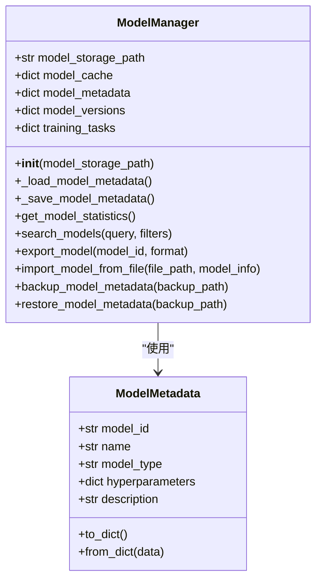
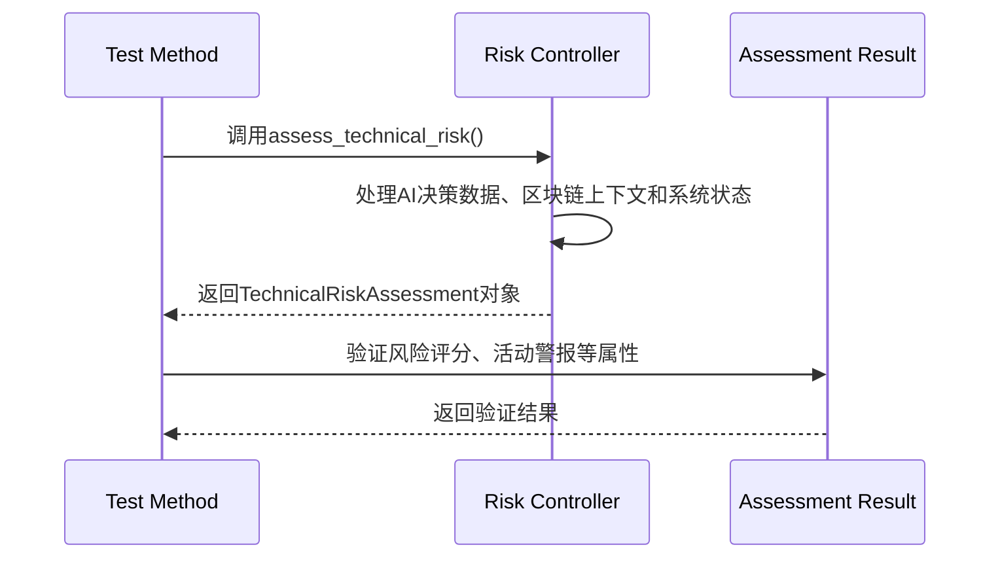
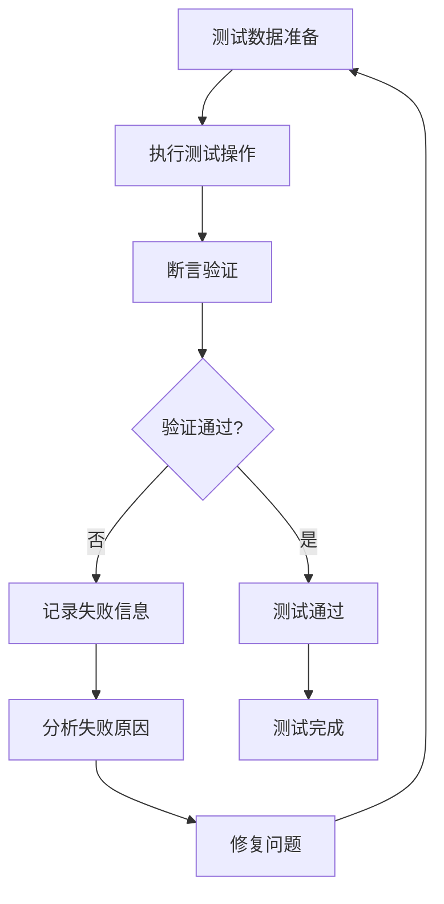

# 单元测试

<cite>
**本文档中引用的文件**  
- [test_api.py](file://backend/tests/test_api.py)
- [test_health.py](file://backend/test_health.py)
- [test_model_manager_simple.py](file://backend/test_model_manager_simple.py)
- [test_risk_control.py](file://backend/src/ai_risk_control/test_risk_control.py)
- [model_manager.py](file://backend/src/core/services/model_manager.py)
- [model_manager.py](file://backend/src/api/routes/model_manager.py)
- [health.py](file://backend/src/api/routes/health.py)
- [conftest.py](file://backend/conftest.py)
</cite>

## 目录
1. [简介](#简介)
2. [API端点测试实现](#api端点测试实现)
3. [健康检查功能测试](#健康检查功能测试)
4. [模型管理功能测试覆盖策略](#模型管理功能测试覆盖策略)
5. [AI风险控制模块单元测试逻辑](#ai风险控制模块单元测试逻辑)
6. [高效单元测试编写指导原则](#高效单元测试编写指导原则)
7. [核心业务逻辑验证](#核心业务逻辑验证)
8. [结论](#结论)

## 简介
本项目通过全面的单元测试确保AI平台核心功能的正确性和稳定性。测试覆盖了API端点、健康检查、模型管理以及AI风险控制等关键模块。测试框架采用pytest，结合FastAPI的TestClient进行API测试，使用unittest.mock进行依赖模拟，并通过自定义的conftest.py实现Flax框架的运行时补丁加载。测试设计遵循测试隔离、可重复性和高覆盖率的原则，确保每个功能模块都能在独立、可控的环境中进行验证。

## API端点测试实现
`backend/tests/test_api.py`文件实现了对后端API的全面测试，包括功能验证、性能测试和错误处理。测试使用FastAPI的TestClient创建测试客户端，模拟HTTP请求来验证各个API端点的行为。

测试用例涵盖了根端点、健康检查、模型管理、推理API、区块链API和联邦学习API等多个功能模块。每个测试函数都通过断言验证响应状态码和返回数据的正确性。例如，`test_health_check()`函数验证健康检查端点返回200状态码和预期的健康状态。

**Diagram sources**
- [test_api.py](file://backend/tests/test_api.py#L58-L63)

**Section sources**
- [test_api.py](file://backend/tests/test_api.py#L1-L165)

## 健康检查功能测试
`backend/test_health.py`文件实现了对系统健康检查功能的测试。该测试通过requests库向健康检查端点发送HTTP请求，验证系统的可用性和响应性能。

测试重点关注端点URL的正确性，使用`http://localhost:8000/system/health`作为测试地址。测试函数记录请求耗时，验证响应状态码为200，并检查返回的JSON数据结构。同时，测试还包含了异常处理机制，能够捕获并处理请求超时、连接错误等网络异常情况。

**Diagram sources**
- [test_health.py](file://backend/test_health.py#L4-L37)

**Section sources**
- [test_health.py](file://backend/test_health.py#L1-L39)
- [health.py](file://backend/src/api/routes/health.py#L13-L76)

## 模型管理功能测试覆盖策略
`backend/test_model_manager_simple.py`文件实现了对模型管理功能的简单测试，重点关注文件操作和元数据处理。测试策略采用隔离测试方法，不依赖实际模型创建，而是通过模拟文件系统操作来验证核心功能。

测试覆盖了模型管理器的多个关键功能：创建模型管理器实例、创建和保存元数据、创建模型保存目录、保存和加载模型状态、更新模型索引等。测试使用临时目录`test_models_simple`进行文件操作，确保测试的隔离性和可重复性。每个测试步骤都有明确的成功标记，便于定位问题。

**Diagram sources**
- [test_model_manager_simple.py](file://backend/test_model_manager_simple.py#L18-L112)
- [model_manager.py](file://backend/src/core/services/model_manager.py#L15-L800)

**Section sources**
- [test_model_manager_simple.py](file://backend/test_model_manager_simple.py#L1-L112)
- [model_manager.py](file://backend/src/core/services/model_manager.py#L1-L1209)
- [model_manager.py](file://backend/src/api/routes/model_manager.py#L1-L390)

## AI风险控制模块单元测试逻辑
`backend/src/ai_risk_control/test_risk_control.py`文件实现了对AI风险控制模块的全面测试，包括技术风险、数据安全、算法偏见和治理冲突等多个子模块。测试采用类结构组织，每个风险控制器都有对应的测试类。

测试逻辑设计了多种场景：正常情况、高风险情况和边界情况。例如，`TestTechnicalRiskController`类中的`test_assess_technical_risk_normal()`和`test_assess_technical_risk_critical()`分别测试了正常和高风险情况下的技术风险评估。测试使用asyncio和pytest.mark.asyncio装饰器处理异步操作，确保异步方法的正确性。

性能测试部分通过创建大量测试数据（如1000条决策数据）来验证系统性能，确保风险评估在合理时间内完成。API集成测试则验证了风险评估API的可用性和正确性。

**Diagram sources**
- [test_risk_control.py](file://backend/src/ai_risk_control/test_risk_control.py#L24-L103)

**Section sources**
- [test_risk_control.py](file://backend/src/ai_risk_control/test_risk_control.py#L1-L561)

## 高效单元测试编写指导原则
本项目展示了编写高效单元测试的最佳实践，包括测试数据准备、断言验证和异常处理等方面。

### 测试数据准备
测试数据准备遵循"测试隔离"原则，每个测试都使用独立的数据集，避免测试间的相互影响。对于文件操作测试，使用临时目录和文件；对于API测试，使用TestClient模拟请求；对于复杂对象测试，使用mock对象模拟依赖。

### 断言验证
断言验证采用多层次验证策略：首先验证基本状态码，然后验证数据结构，最后验证具体值。例如，在API测试中，先验证响应状态码，再验证JSON结构，最后验证具体字段值。对于复杂对象，验证其类型、属性和方法行为。

### 异常处理
异常处理测试覆盖了各种错误场景，包括无效输入、网络异常、资源不存在等。测试使用try-except块捕获异常，并验证异常类型和消息的正确性。对于异步测试，使用asyncio的异常处理机制。

### 测试组织
测试组织采用模块化和分层结构：每个功能模块有独立的测试文件，每个测试文件按功能组织测试类和方法。测试方法命名清晰，如`test_assess_technical_risk_normal()`明确表达了测试目的。

**Section sources**
- [test_api.py](file://backend/tests/test_api.py#L140-L149)
- [test_health.py](file://backend/test_health.py#L28-L36)
- [conftest.py](file://backend/conftest.py#L6-L103)

## 核心业务逻辑验证
单元测试通过多种方式确保核心业务逻辑的正确性。首先，通过功能测试验证每个API端点和业务方法的正确行为；其次，通过边界测试验证系统在极端情况下的表现；最后，通过集成测试验证多个组件协同工作的正确性。

对于模型管理功能，测试验证了模型的注册、加载、卸载、预测和训练等完整生命周期。对于风险控制功能，测试验证了风险评估的准确性、警报生成的及时性和应急响应的有效性。

测试还关注性能要求，如`test_assessment_performance()`验证了风险评估在1秒内完成，确保系统响应速度满足要求。错误处理测试验证了系统在异常情况下的健壮性，如处理无效JSON输入和不存在的端点。

**Section sources**
- [test_api.py](file://backend/tests/test_api.py#L121-L138)
- [test_risk_control.py](file://backend/src/ai_risk_control/test_risk_control.py#L526-L557)

## 结论
本项目的单元测试体系全面覆盖了API端点、健康检查、模型管理和AI风险控制等核心功能。测试设计遵循最佳实践，采用模块化组织、清晰的命名规范和多层次的验证策略。通过使用pytest、TestClient和unittest.mock等工具，实现了高效、可靠的测试执行。测试不仅验证了功能正确性，还关注性能、异常处理和边界情况，确保系统在各种场景下都能稳定运行。建议继续完善测试覆盖率，增加更多边界情况和异常场景的测试，以进一步提高系统的可靠性和稳定性。