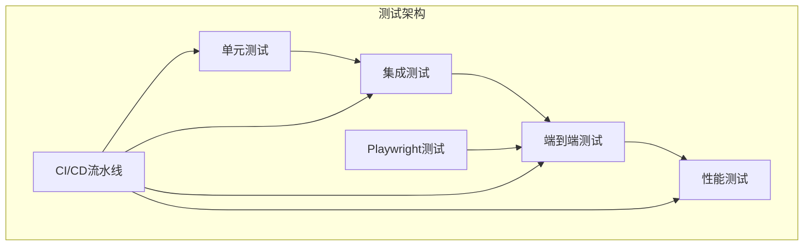
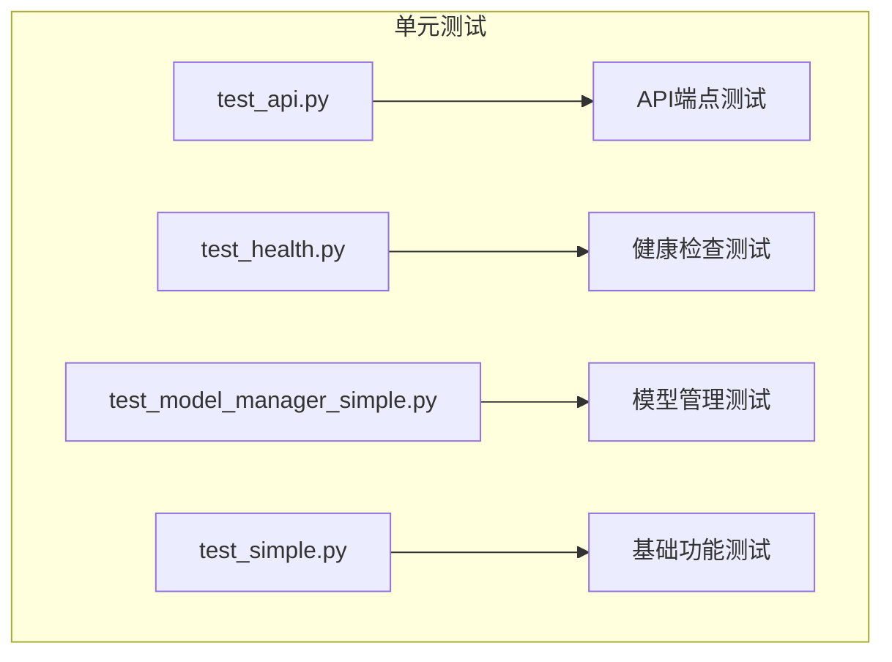
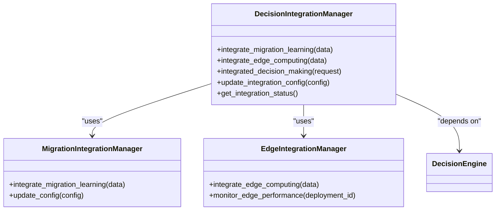
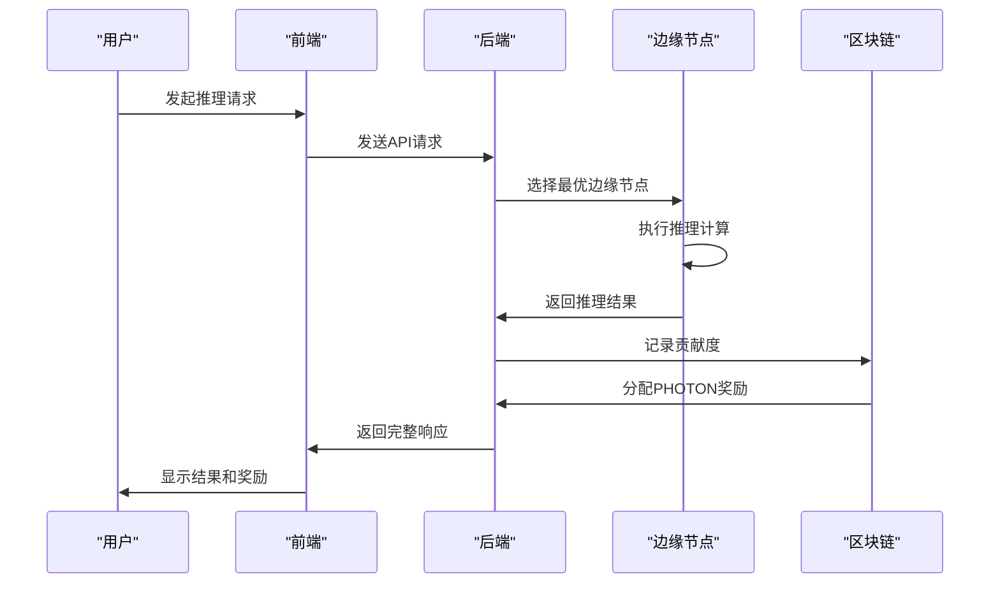
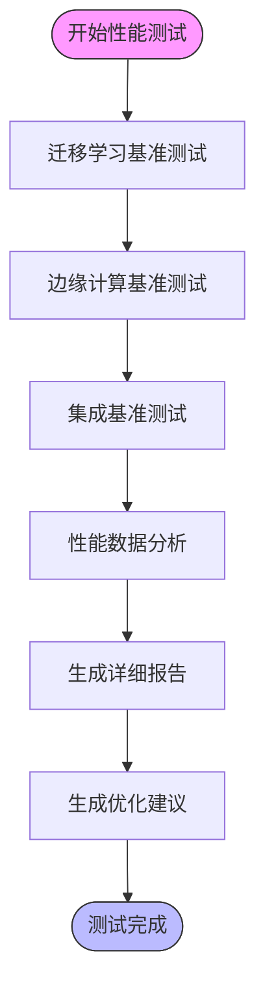
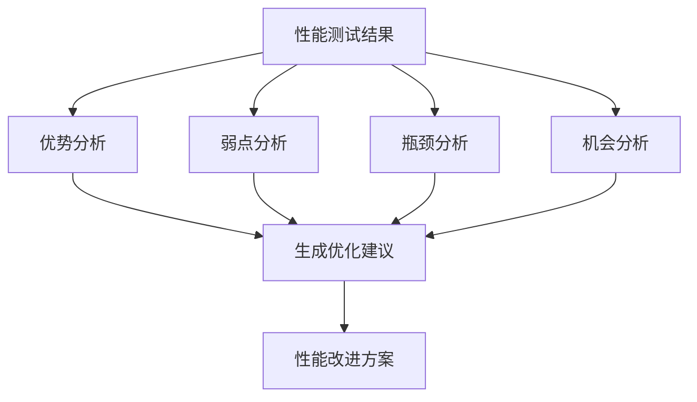
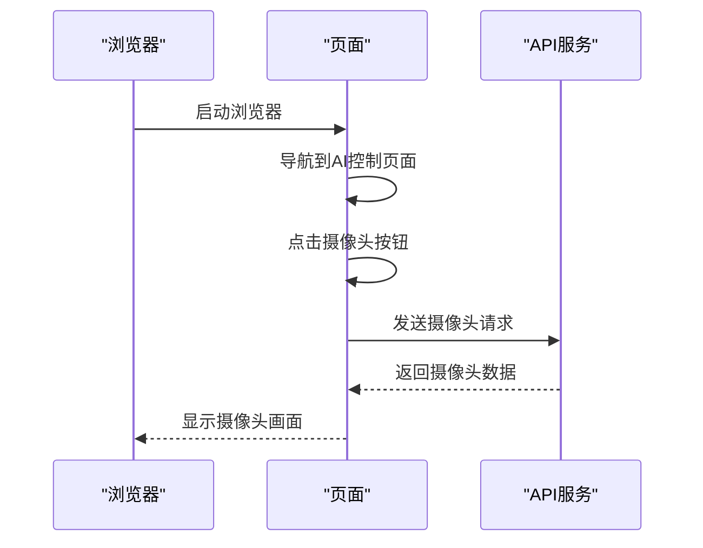
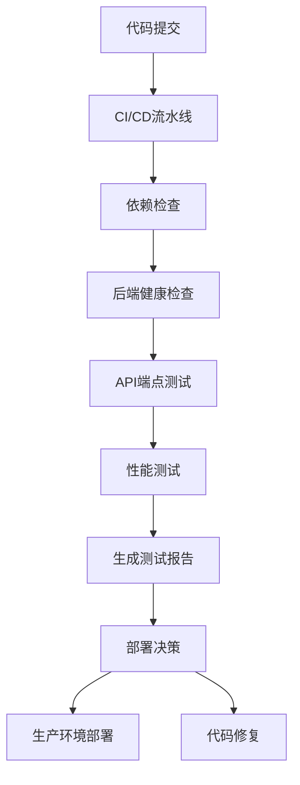
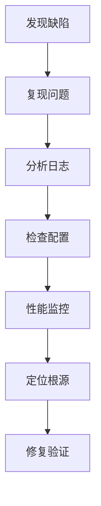
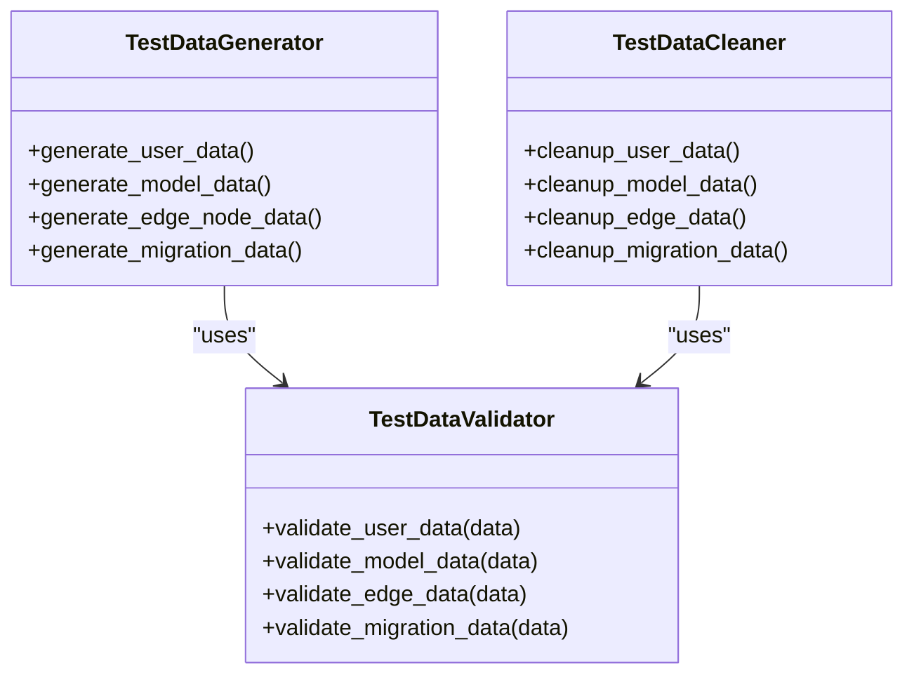

# 测试策略

<cite>
**本文档引用的文件**   
- [test_api.py](file://backend/tests/test_api.py)
- [test_end_to_end.py](file://backend/tests/test_end_to_end.py)
- [run_performance_benchmark.py](file://run_performance_benchmark.py)
- [run_tests.py](file://run_tests.py)
- [test_decision_integration.py](file://backend/tests/integration/test_decision_integration.py)
- [test_edge_integration.py](file://backend/tests/integration/test_edge_integration.py)
- [test_migration_integration.py](file://backend/tests/integration/test_migration_integration.py)
- [conftest.py](file://backend/conftest.py)
- [test_edge_inference_performance.py](file://backend/tests/test_edge_inference_performance.py)
- [test_edge_inference_simple.py](file://backend/tests/test_edge_inference_simple.py)
- [decision_performance_test.py](file://backend/tests/decision_performance_test.py)
- [cameraframetest_25926128-0d11-411a-bbce-4360397526be.spec.ts](file://playwright_tests/cameraframetest_25926128-0d11-411a-bbce-4360397526be.spec.ts)
</cite>

## 目录
1. [引言](#引言)
2. [测试架构与组织结构](#测试架构与组织结构)
3. [单元测试策略](#单元测试策略)
4. [集成测试策略](#集成测试策略)
5. [端到端测试策略](#端到端测试策略)
6. [性能测试策略](#性能测试策略)
7. [Playwright端到端测试](#playwright端到端测试)
8. [测试自动化与CI/CD集成](#测试自动化与cicd集成)
9. [测试工程师指导原则](#测试工程师指导原则)
10. [结论](#结论)

## 引言

本测试策略文档旨在系统性地阐述AI决策系统的测试实践，涵盖从单元测试到端到端测试的完整测试体系。文档详细说明了backend/tests目录中各类测试用例的组织结构、Playwright端到端测试的场景设计、性能基准测试的指标定义，以及测试自动化流水线的CI/CD集成规范。通过建立全面的测试框架，确保系统的可靠性、性能和安全性，为测试工程师提供缺陷定位、回归测试和测试数据管理的指导原则。

## 测试架构与组织结构

AI决策系统的测试架构采用分层设计，包含单元测试、集成测试、端到端测试和性能测试四个主要层次。测试文件主要分布在backend/tests目录下，按照功能模块进行组织。

**图源**
- [backend/tests](file://backend/tests)
- [playwright_tests](file://playwright_tests)

**本节源**
- [backend/tests](file://backend/tests)
- [playwright_tests](file://playwright_tests)

## 单元测试策略

单元测试主要验证系统中最小可测试单元的正确性，重点关注API端点、核心算法和工具函数的独立功能。测试用例通过pytest框架实现，采用参数化测试和模拟对象来覆盖各种边界条件。

**图源**
- [backend/tests/test_api.py](file://backend/tests/test_api.py)
- [backend/tests/test_health.py](file://backend/tests/test_health.py)
- [backend/tests/test_model_manager_simple.py](file://backend/tests/test_model_manager_simple.py)
- [backend/tests/test_simple.py](file://backend/tests/test_simple.py)

**本节源**
- [backend/tests/test_api.py](file://backend/tests/test_api.py)
- [backend/tests/test_health.py](file://backend/tests/test_health.py)

## 集成测试策略

集成测试验证不同模块之间的交互和数据流，确保系统组件能够协同工作。测试重点包括决策引擎集成、边缘计算集成和迁移学习集成，通过模拟组件依赖来测试集成逻辑。

**图源**
- [backend/tests/integration/test_decision_integration.py](file://backend/tests/integration/test_decision_integration.py)
- [backend/tests/integration/test_migration_integration.py](file://backend/tests/integration/test_migration_integration.py)
- [backend/tests/integration/test_edge_integration.py](file://backend/tests/integration/test_edge_integration.py)

**本节源**
- [backend/tests/integration/test_decision_integration.py](file://backend/tests/integration/test_decision_integration.py)
- [backend/tests/integration/test_migration_integration.py](file://backend/tests/integration/test_migration_integration.py)
- [backend/tests/integration/test_edge_integration.py](file://backend/tests/integration/test_edge_integration.py)

## 端到端测试策略

端到端测试验证系统从用户界面到后端服务的完整工作流程，确保所有组件协同工作正常。测试涵盖边缘推理服务与区块链奖励机制的完整流程，包括推理请求处理、贡献度计算和奖励分配。

**图源**
- [backend/tests/test_end_to_end.py](file://backend/tests/test_end_to_end.py)

**本节源**
- [backend/tests/test_end_to_end.py](file://backend/tests/test_end_to_end.py)

## 性能测试策略

性能测试策略通过run_performance_benchmark.py脚本实现，自动化运行性能基准测试并生成详细的性能报告。测试涵盖迁移学习、边缘计算和系统集成三个主要方面，评估系统的响应时间、吞吐量和资源利用率。

**图源**
- [run_performance_benchmark.py](file://run_performance_benchmark.py)

**本节源**
- [run_performance_benchmark.py](file://run_performance_benchmark.py)

### 性能基准测试指标

性能基准测试定义了多个关键指标来评估系统性能，包括综合得分、成功率、吞吐量和延迟等。这些指标用于生成性能等级和优化建议。

| 指标 | 定义 | 目标值 |
|------|------|--------|
| 综合得分 | 基于成功率和吞吐量计算的综合性能评分 | > 0.7 |
| 成功率 | 成功完成的测试用例比例 | > 90% |
| 吞吐量 | 每秒处理的请求数 | > 10 请求/秒 |
| 平均延迟 | 请求的平均响应时间 | < 500ms |
| 最大延迟 | 请求的最大响应时间 | < 1000ms |

**本节源**
- [run_performance_benchmark.py](file://run_performance_benchmark.py)

### 性能测试结果分析

性能测试结果分析模块对测试数据进行深入分析，识别系统的优势、弱点、瓶颈和优化机会。基于分析结果生成具体的优化建议，指导系统性能改进。

**图源**
- [run_performance_benchmark.py](file://run_performance_benchmark.py)

**本节源**
- [run_performance_benchmark.py](file://run_performance_benchmark.py)

## Playwright端到端测试

Playwright端到端测试用于验证前端用户界面的功能和交互流程。测试脚本模拟用户操作，验证页面导航、按钮点击和表单提交等交互行为。

**图源**
- [playwright_tests/cameraframetest_25926128-0d11-411a-bbce-4360397526be.spec.ts](file://playwright_tests/cameraframetest_25926128-0d11-411a-bbce-4360397526be.spec.ts)

**本节源**
- [playwright_tests/cameraframetest_25926128-0d11-411a-bbce-4360397526be.spec.ts](file://playwright_tests/cameraframetest_25926128-0d11-411a-bbce-4360397526be.spec.ts)

## 测试自动化与CI/CD集成

测试自动化流水线通过run_tests.py脚本实现，集成到CI/CD流程中。流水线执行系统依赖检查、后端健康检查、API端点测试和性能测试，生成测试报告并提供优化建议。

**图源**
- [run_tests.py](file://run_tests.py)

**本节源**
- [run_tests.py](file://run_tests.py)

## 测试工程师指导原则

为测试工程师提供缺陷定位、回归测试和测试数据管理的指导原则，确保测试工作的高效性和一致性。

### 缺陷定位策略

建立系统化的缺陷定位流程，通过日志分析、断点调试和性能监控等手段快速定位问题根源。

**本节源**
- [backend/conftest.py](file://backend/conftest.py)

### 回归测试规范

制定回归测试规范，确保新功能开发和代码修改不会影响现有功能的正确性。

| 测试类型 | 触发条件 | 测试范围 | 执行频率 |
|---------|---------|---------|---------|
| 快速回归 | 代码提交 | 核心功能 | 每次提交 |
| 完整回归 | 版本发布 | 全部功能 | 每周一次 |
| 专项回归 | 模块修改 | 相关模块 | 按需执行 |

**本节源**
- [backend/tests](file://backend/tests)

### 测试数据管理

建立测试数据管理规范，确保测试数据的一致性、可重复性和安全性。

**本节源**
- [backend/tests](file://backend/tests)

## 结论

本测试策略文档系统性地阐述了AI决策系统的测试实践，建立了从单元测试到端到端测试的完整测试体系。通过分层测试架构、自动化测试流水线和详细的测试指导原则，确保系统的可靠性、性能和安全性。测试框架不仅验证了当前功能的正确性，还为未来的系统扩展和优化提供了坚实的基础。建议持续完善测试用例覆盖，加强性能监控，优化CI/CD集成流程，以支持系统的持续演进和高质量交付。