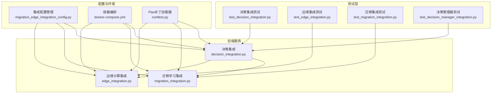
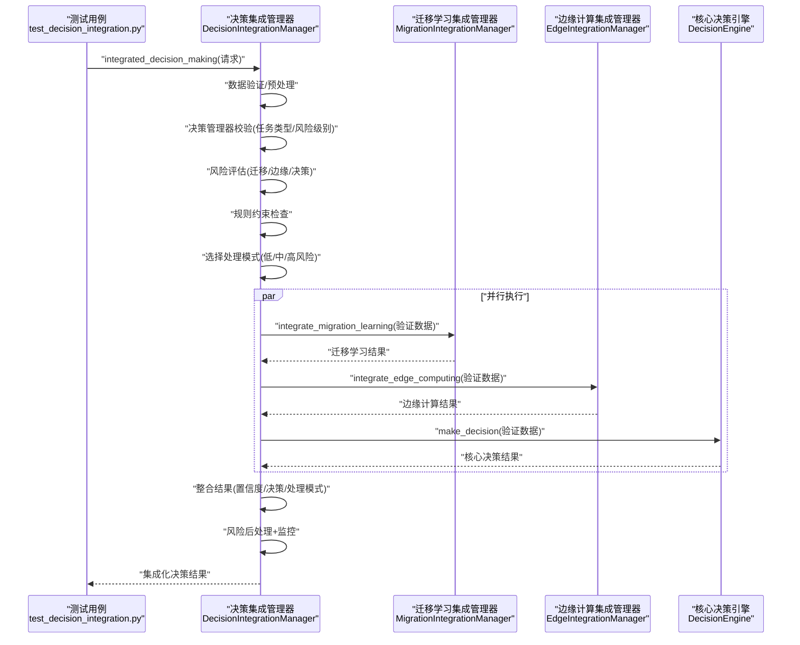
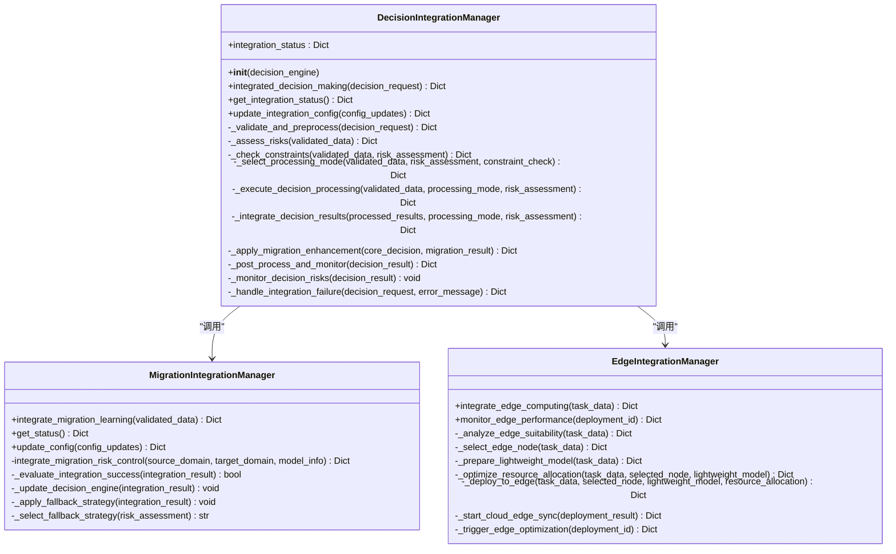
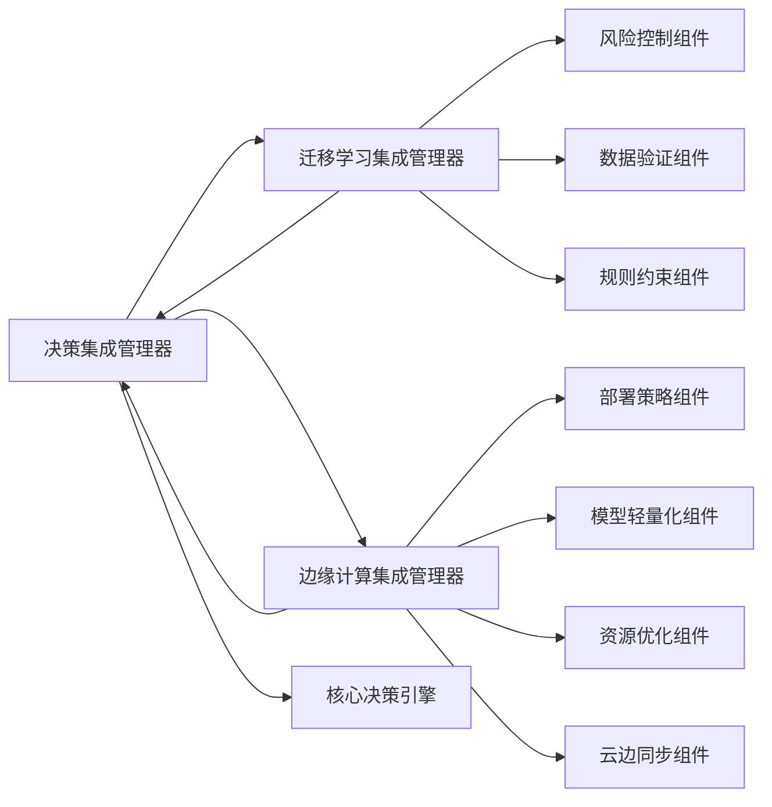

# 集成测试

<cite>
**本文引用的文件**
- [test_decision_integration.py](file://backend/tests/integration/test_decision_integration.py)
- [test_edge_integration.py](file://backend/tests/integration/test_edge_integration.py)
- [test_migration_integration.py](file://backend/tests/integration/test_migration_integration.py)
- [test_decision_manager_integration.py](file://backend/tests/test_decision_manager_integration.py)
- [decision_integration.py](file://backend/src/integration/decision_integration.py)
- [migration_integration.py](file://backend/src/integration/migration_integration.py)
- [edge_integration.py](file://backend/src/integration/edge_integration.py)
- [conftest.py](file://backend/conftest.py)
- [run_integration_tests.py](file://run_integration_tests.py)
- [docker-compose.yml](file://docker-compose.yml)
- [migration_edge_integration_config.py](file://backend/config/migration_edge_integration_config.py)
</cite>

## 目录
1. [引言](#引言)
2. [项目结构](#项目结构)
3. [核心组件](#核心组件)
4. [架构总览](#架构总览)
5. [详细组件分析](#详细组件分析)
6. [依赖关系分析](#依赖关系分析)
7. [性能考量](#性能考量)
8. [故障排查指南](#故障排查指南)
9. [结论](#结论)
10. [附录](#附录)

## 引言
本文件系统化梳理本项目的集成测试策略，重点覆盖以下方面：
- 决策服务与迁移学习、边缘计算的集成测试方法与断言要点
- 边缘计算模块的适用性分析、节点选择、资源优化与回退机制验证
- 迁移学习与核心系统的数据流测试方法与风险控制集成
- 决策管理器的跨服务调用与任务类型/风险级别的验证机制
- 集成测试的环境配置、依赖管理与服务启动顺序最佳实践
- 如何通过集成测试发现接口兼容性与数据一致性问题

## 项目结构
本项目采用“后端服务 + 集成测试 + 配置管理 + 容器编排”的组织方式。与集成测试直接相关的关键位置如下：
- 后端集成层：位于 backend/src/integration，封装了迁移学习、边缘计算与决策引擎的集成逻辑
- 集成测试：位于 backend/tests/integration 与 backend/tests，分别覆盖迁移学习、边缘计算、决策集成与决策管理器
- 配置与环境：backend/config 提供集成配置管理；docker-compose.yml 提供容器化服务编排
- 运行脚本：run_integration_tests.py 提供统一的集成测试执行入口

图表来源
- [decision_integration.py](file://backend/src/integration/decision_integration.py#L1-L615)
- [migration_integration.py](file://backend/src/integration/migration_integration.py#L1-L452)
- [edge_integration.py](file://backend/src/integration/edge_integration.py#L1-L299)
- [test_decision_integration.py](file://backend/tests/integration/test_decision_integration.py#L1-L491)
- [test_edge_integration.py](file://backend/tests/integration/test_edge_integration.py#L1-L450)
- [test_migration_integration.py](file://backend/tests/integration/test_migration_integration.py#L1-L298)
- [test_decision_manager_integration.py](file://backend/tests/test_decision_manager_integration.py#L1-L269)
- [migration_edge_integration_config.py](file://backend/config/migration_edge_integration_config.py#L1-L467)
- [docker-compose.yml](file://docker-compose.yml#L1-L113)
- [conftest.py](file://backend/conftest.py#L1-L103)

章节来源
- [docker-compose.yml](file://docker-compose.yml#L1-L113)
- [migration_edge_integration_config.py](file://backend/config/migration_edge_integration_config.py#L1-L467)

## 核心组件
- 决策集成管理器：协调迁移学习、边缘计算与核心决策引擎，统一执行、结果整合与风险后处理
- 迁移学习集成管理器：封装风险控制、数据验证、规则约束与降级策略，向核心决策引擎注入迁移学习参数
- 边缘计算集成管理器：提供任务适用性分析、节点选择、模型轻量化、资源优化与云边协同
- 决策管理器：对任务类型与风险级别的前置校验，保障后续集成流程的输入合法性
- 集成配置管理器：提供环境化配置、策略化优化与部署脚本生成，支撑测试与生产环境的一致性

章节来源
- [decision_integration.py](file://backend/src/integration/decision_integration.py#L1-L615)
- [migration_integration.py](file://backend/src/integration/migration_integration.py#L1-L452)
- [edge_integration.py](file://backend/src/integration/edge_integration.py#L1-L299)
- [migration_edge_integration_config.py](file://backend/config/migration_edge_integration_config.py#L1-L467)

## 架构总览
下图展示决策集成测试的端到端流程：测试驱动决策集成管理器，后者并行调用迁移学习与边缘计算子系统，再由核心决策引擎产出结果，最后进行风险后处理与监控。

图表来源
- [test_decision_integration.py](file://backend/tests/integration/test_decision_integration.py#L1-L491)
- [decision_integration.py](file://backend/src/integration/decision_integration.py#L1-L615)
- [migration_integration.py](file://backend/src/integration/migration_integration.py#L1-L452)
- [edge_integration.py](file://backend/src/integration/edge_integration.py#L1-L299)

## 详细组件分析

### 决策集成测试（test_decision_integration.py）
- 测试目标
  - 验证集成化决策流程的正确性与鲁棒性
  - 验证基于风险的处理模式选择与约束违反处理
  - 验证组件失败时的容错与回退机制
  - 验证并行执行与结果整合
  - 验证后处理与监控机制
  - 验证集成状态管理与配置更新
- 关键断言点
  - 结果结构完整性：包含决策、置信度、风险评估、处理模式、时间戳等
  - 风险模式选择：低风险启用迁移学习与边缘计算，高风险禁用并启用严格风控
  - 约束违反处理：当约束不满足时，处理模式标记为严格或回退
  - 组件失败处理：迁移学习组件异常不应导致整体失败
  - 并行执行：总耗时应小于串行预期
  - 结果整合：迁移学习增强因子、边缘处理信息等
  - 监控与后处理：监控任务激活、风险后处理标记
  - 状态与配置：集成状态查询、配置更新生效
- 边界与高并发
  - 空请求抛出异常
  - 大数据场景下的回退策略
  - 高并发场景下结果结构一致性

章节来源
- [test_decision_integration.py](file://backend/tests/integration/test_decision_integration.py#L1-L491)
- [decision_integration.py](file://backend/src/integration/decision_integration.py#L1-L615)

### 边缘计算集成测试（test_edge_integration.py）
- 测试目标
  - 验证边缘计算适用性分析与节点选择
  - 验证模型轻量化处理与资源优化分配
  - 验证部署到边缘节点与云边协同
  - 验证性能监控与回退机制
  - 验证组件级集成（部署策略、轻量化、资源优化、云边同步）
- 关键断言点
  - 适用性分析：任务类型、数据大小、延迟要求、隐私要求
  - 节点选择：返回节点ID、计算容量、内存可用
  - 轻量化：压缩比、精度、压缩率
  - 资源优化：CPU/Memory/Network分配
  - 部署与同步：部署ID、状态、同步ID、状态
  - 性能监控：延迟、吞吐、资源利用率
  - 回退与错误处理：不适合边缘时回退云端并返回错误字段
- 组件级验证
  - 部署策略：按计算/内存/网络需求选择最优节点
  - 轻量化策略：按模型类型与精度需求选择策略并应用
  - 资源优化器：按资源需求与节点容量进行优化
  - 云边同步：启动同步、获取性能指标

章节来源
- [test_edge_integration.py](file://backend/tests/integration/test_edge_integration.py#L1-L450)
- [edge_integration.py](file://backend/src/integration/edge_integration.py#L1-L299)

### 迁移学习集成测试（test_migration_integration.py）
- 测试目标
  - 验证迁移学习集成流程与风险控制
  - 验证高风险场景的禁用与降级策略
  - 验证数据验证、规则约束与预警系统
  - 验证性能监控与错误处理
  - 验证配置管理与回退决策
- 关键断言点
  - 成功场景：迁移应用标记、风险评估、决策结果、集成状态成功
  - 高风险场景：整体风险等级高、禁用迁移学习
  - 数据验证：无效数据抛出异常
  - 规则约束：约束检查结果字段存在
  - 预警系统：触发警告并返回警告ID
  - 性能：平均响应时间阈值
  - 错误处理：决策引擎失败时返回错误状态与回退决策
  - 配置更新：返回成功并包含更新后的配置
- 组件级验证
  - 风险控制：风险评估、推荐策略、风险因素
  - 数据验证：有效/无效数据校验
  - 规则约束：合规性检查
  - 预警系统：触发与活跃警告查询

章节来源
- [test_migration_integration.py](file://backend/tests/integration/test_migration_integration.py#L1-L298)
- [migration_integration.py](file://backend/src/integration/migration_integration.py#L1-L452)

### 决策管理器跨服务调用验证（test_decision_manager_integration.py）
- 测试目标
  - 验证任务类型与风险级别的前置校验
  - 验证未知任务类型与缺失字段的错误处理
  - 验证默认风险级别与高优先级任务的灵活性
  - 验证关键决策任务的严格风控模式
- 关键断言点
  - routine_monitoring 必须为低风险
  - high_priority 可使用任意风险级别
  - 缺少 task_type 抛出异常
  - 未知任务类型抛出异常
  - 缺失 risk_level 时默认 medium
  - critical_decision 使用严格风控模式

章节来源
- [test_decision_manager_integration.py](file://backend/tests/test_decision_manager_integration.py#L1-L269)

### 决策集成管理器类图

图表来源
- [decision_integration.py](file://backend/src/integration/decision_integration.py#L1-L615)
- [migration_integration.py](file://backend/src/integration/migration_integration.py#L1-L452)
- [edge_integration.py](file://backend/src/integration/edge_integration.py#L1-L299)

## 依赖关系分析
- 组件耦合
  - 决策集成管理器聚合迁移学习与边缘计算集成管理器，形成高内聚、低耦合的协调层
  - 迁移学习与边缘计算均依赖各自组件库（风险控制、数据验证、规则约束、部署策略、轻量化、资源优化、云边同步）
- 直接与间接依赖
  - 决策集成管理器直接依赖核心决策引擎接口，间接依赖摄像头控制等外部服务
  - 迁移学习集成管理器依赖决策引擎的参数更新接口
  - 边缘计算集成管理器依赖部署策略、轻量化、资源优化与云边同步组件
- 循环依赖
  - 当前设计未见循环依赖，集成管理器仅单向依赖子系统
- 外部依赖与集成点
  - Docker Compose 提供后端、前端、Redis、PostgreSQL、Prometheus/Grafana等服务编排
  - conftest.py 提供Flax补丁加载器，确保测试环境的模块导入稳定性

图表来源
- [decision_integration.py](file://backend/src/integration/decision_integration.py#L1-L615)
- [migration_integration.py](file://backend/src/integration/migration_integration.py#L1-L452)
- [edge_integration.py](file://backend/src/integration/edge_integration.py#L1-L299)

章节来源
- [docker-compose.yml](file://docker-compose.yml#L1-L113)
- [conftest.py](file://backend/conftest.py#L1-L103)

## 性能考量
- 并行执行
  - 决策集成管理器对迁移学习、边缘计算与核心决策引擎采用并行执行，缩短端到端延迟
  - 测试中通过并发请求与统计平均延迟验证并行效果
- 资源与回退
  - 边缘计算在任务过大或延迟要求过高时回退云端，避免资源超限
  - 迁移学习在高风险场景禁用或采用保守策略，降低系统风险
- 监控与优化
  - 风险后处理与监控任务持续跟踪决策风险变化，必要时触发预警
  - 集成配置管理器提供多种优化策略（性能、精度、资源效率、延迟、成本）

章节来源
- [test_decision_integration.py](file://backend/tests/integration/test_decision_integration.py#L1-L491)
- [test_edge_integration.py](file://backend/tests/integration/test_edge_integration.py#L1-L450)
- [migration_edge_integration_config.py](file://backend/config/migration_edge_integration_config.py#L1-L467)

## 故障排查指南
- 接口兼容性问题
  - 核心决策引擎接口差异：集成管理器对异步/同步接口做了兼容处理，若测试中出现类型错误，需检查引擎实现是否遵循约定
  - 迁移学习参数更新：确保决策引擎具备相应接口，否则会触发降级策略
- 数据一致性问题
  - 风险评估与约束检查：若结果中风险等级与约束状态不一致，需检查风险控制与规则约束组件的输入数据
  - 结果整合：当核心决策无决策字段时，应从边缘或迁移结果中回填，测试中验证了该逻辑
- 组件失败处理
  - 迁移学习组件异常：应不影响整体流程，测试验证了回退与错误信息
  - 边缘节点不可用：应回退云端并返回错误字段
- 环境与依赖
  - Flax补丁：conftest.py确保Flax模块导入稳定，避免测试期间因类型注解问题导致失败
  - 服务编排：docker-compose提供健康检查与依赖关系，确保后端、前端、数据库、缓存等服务按序启动

章节来源
- [decision_integration.py](file://backend/src/integration/decision_integration.py#L1-L615)
- [migration_integration.py](file://backend/src/integration/migration_integration.py#L1-L452)
- [edge_integration.py](file://backend/src/integration/edge_integration.py#L1-L299)
- [conftest.py](file://backend/conftest.py#L1-L103)
- [docker-compose.yml](file://docker-compose.yml#L1-L113)

## 结论
本项目的集成测试围绕“决策集成管理器”为核心，系统性验证了迁移学习与边缘计算两大子系统的数据流、风险控制与容错机制。测试覆盖了正常流程、边界条件、高并发与性能指标，并通过统一的配置管理与容器编排保障了测试环境的一致性与可重复性。建议在持续集成中引入自动化脚本与报告生成，进一步提升测试效率与可观测性。

## 附录

### 集成测试环境配置与最佳实践
- 依赖管理
  - 使用 conftest.py 提供的Flax补丁加载器，确保测试期间模块导入稳定
  - 通过 requirements.txt/requirements.lock 管理后端依赖，保证测试环境一致性
- 服务启动顺序
  - docker-compose 中使用 depends_on 与健康检查，确保后端服务就绪后再启动前端
  - 建议在集成测试前显式等待关键服务健康状态
- 配置管理
  - 使用 IntegrationConfigManager 生成环境化配置与部署脚本，便于在不同环境（开发/测试/生产）间切换
  - 通过优化策略（性能/精度/资源效率/延迟/成本）调整迁移学习与边缘计算的行为
- 运行脚本
  - run_integration_tests.py 提供统一的集成测试入口，支持迁移学习、边缘计算、系统集成与性能测试的组合执行

章节来源
- [conftest.py](file://backend/conftest.py#L1-L103)
- [docker-compose.yml](file://docker-compose.yml#L1-L113)
- [migration_edge_integration_config.py](file://backend/config/migration_edge_integration_config.py#L1-L467)
- [run_integration_tests.py](file://run_integration_tests.py#L1-L388)