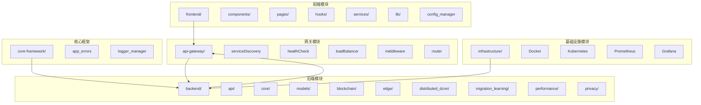
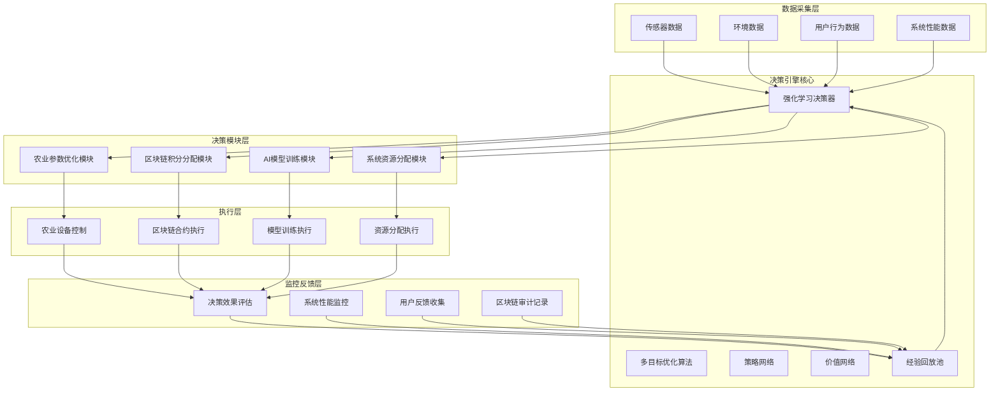
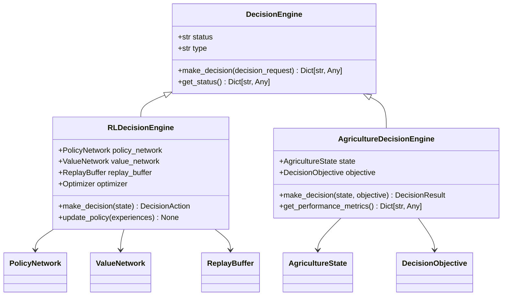
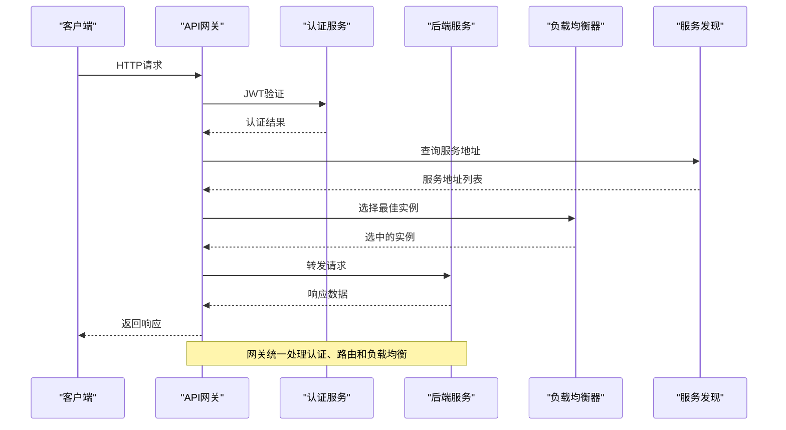
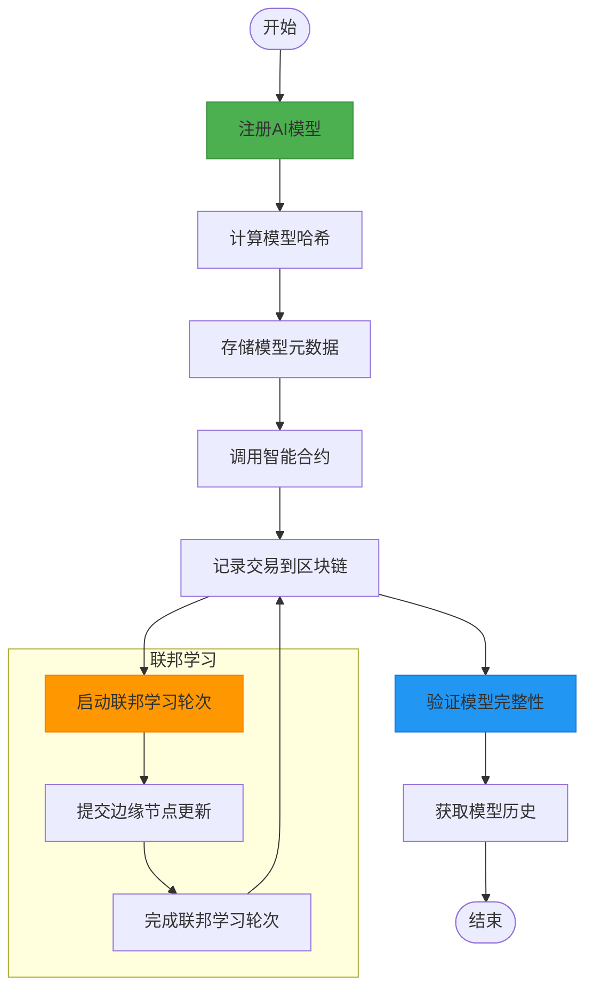
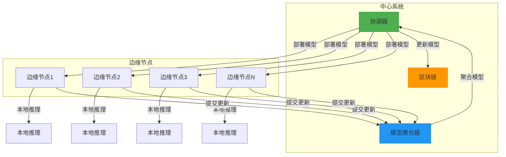
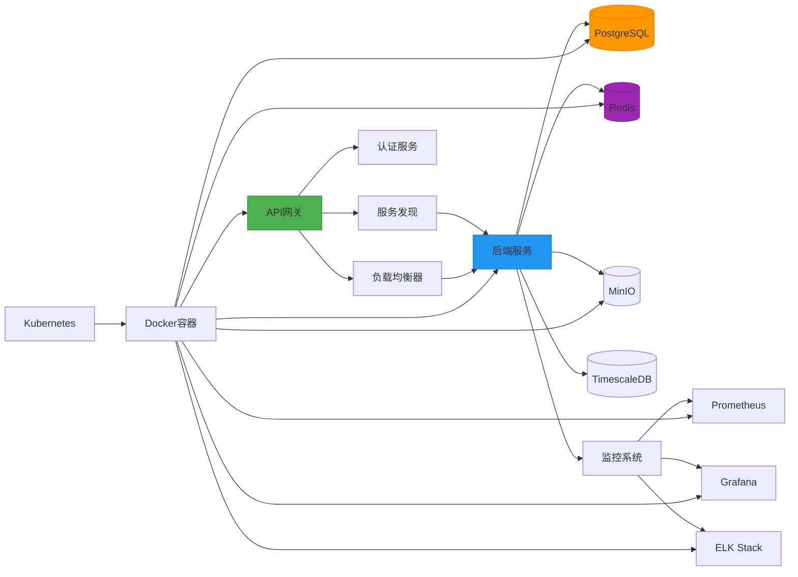

# 系统概述

<cite>
**本文档引用文件**   
- [README.md](file://README.md)
- [ai_decision_system_architecture.md](file://ai_decision_system_architecture.md)
- [microservices-architecture-design.md](file://microservices-architecture-design.md)
- [main.py](file://backend/src/main.py)
- [api.py](file://backend/src/api.py)
- [server.ts](file://api-gateway/src/server.ts)
- [index.ts](file://api-gateway/src/index.ts)
- [App.tsx](file://frontend/src/App.tsx)
- [decision.py](file://backend/src/api/routes/decision.py)
- [model_manager.py](file://backend/src/api/routes/model_manager.py)
- [inference_engine.py](file://backend/src/core/services/inference_engine.py)
- [blockchain_manager.py](file://backend/src/blockchain/blockchain_manager.py)
- [edge_manager.py](file://backend/src/edge/edge_manager.py)
- [docker-compose.yml](file://infrastructure/docker-compose.yml)
</cite>

## 目录
1. [引言](#引言)
2. [项目结构](#项目结构)
3. [核心组件](#核心组件)
4. [架构概览](#架构概览)
5. [详细组件分析](#详细组件分析)
6. [依赖关系分析](#依赖关系分析)
7. [性能考量](#性能考量)
8. [故障排除指南](#故障排除指南)
9. [结论](#结论)

## 引言

本现代化AI农业决策系统是一个集成了人工智能、区块链和边缘计算技术的先进平台，旨在实现农业生产过程的智能化和自动化。系统采用微服务架构设计，通过强化学习算法实现完全自主的AI决策能力，覆盖农业参数优化、区块链积分分配、AI模型自动训练和系统资源动态分配四大核心领域。平台基于最前沿的技术栈构建，前端采用React 18 + TypeScript，后端使用FastAPI + Python，AI引擎基于JAX + Flax，同时集成Hyperledger Fabric区块链和WebAssembly边缘计算技术。系统设计遵循微服务架构原则，每个决策模块独立部署，具有松耦合特性，支持高并发场景下的秒级决策响应。通过联邦学习和差分隐私技术，系统在保护数据隐私的同时实现了模型的持续优化。本文档将全面介绍系统的整体架构、核心目标与关键功能模块之间的关系，为初学者提供易于理解的系统全景图，同时为高级开发者提供深入的技术背景与设计权衡分析。

**Section sources**
- [README.md](file://README.md#L1-L165)
- [ai_decision_system_architecture.md](file://ai_decision_system_architecture.md#L1-L340)

## 项目结构

本现代化AI农业决策系统采用模块化设计，项目结构清晰，各组件职责分明。系统主要分为前端、后端、基础设施和文档四大模块，每个模块都有明确的职责和功能定位。

**Diagram sources**
- [README.md](file://README.md#L27-L57)

**Section sources**
- [README.md](file://README.md#L27-L57)

## 核心组件

本系统的核心组件包括API网关、后端服务、前端应用、区块链管理器和边缘计算管理器。API网关作为系统的统一入口，负责路由转发、认证授权、限流熔断等功能，采用Node.js + Express.js + TypeScript技术栈实现。后端服务基于FastAPI框架构建，提供AI决策和模型管理平台的核心功能，集成JAX + Flax作为AI引擎，支持高性能机器学习任务。前端应用采用React 18 + TypeScript开发，结合Vite 5构建工具和Tailwind CSS样式框架，提供现代化的用户界面。区块链管理器集成Hyperledger Fabric，实现模型版本溯源、数据使用记录和贡献奖励机制等关键功能。边缘计算管理器协调WebAssembly边缘节点和联邦学习客户端，支持低延迟推理和离线能力。这些核心组件通过微服务架构协同工作，共同构成了一个完整的AI农业决策系统。

**Section sources**
- [README.md](file://README.md#L5-L165)
- [main.py](file://backend/src/main.py#L1-L43)
- [api.py](file://backend/src/api.py#L1-L83)
- [server.ts](file://api-gateway/src/server.ts#L1-L105)
- [index.ts](file://api-gateway/src/index.ts#L1-L45)
- [App.tsx](file://frontend/src/App.tsx#L1-L131)

## 架构概览

本系统采用微服务架构设计，将复杂的AI农业决策系统分解为多个独立的服务模块，每个模块都可以独立开发、部署和扩展。这种架构设计提高了系统的可维护性和可扩展性，同时降低了模块间的耦合度。系统整体架构分为数据采集层、决策引擎核心、决策模块层、执行层和监控反馈层五个层次。数据采集层负责收集传感器数据、环境数据、用户行为数据和系统性能数据；决策引擎核心基于强化学习算法，通过PPO算法实现多目标优化决策；决策模块层包含农业参数优化、区块链积分分配、AI模型训练和系统资源分配四个核心模块；执行层负责将决策结果转化为实际操作，如农业设备控制、区块链合约执行等；监控反馈层收集决策效果评估、系统性能监控和用户反馈数据，形成闭环反馈机制。

**Diagram sources**
- [ai_decision_system_architecture.md](file://ai_decision_system_architecture.md#L25-L89)

**Section sources**
- [ai_decision_system_architecture.md](file://ai_decision_system_architecture.md#L1-L340)
- [microservices-architecture-design.md](file://microservices-architecture-design.md#L1-L303)

## 详细组件分析

### 决策引擎分析

决策引擎是本系统的核心组件，负责基于强化学习算法生成最优决策。引擎采用PPO（Proximal Policy Optimization）算法，通过策略网络和价值网络协同工作，实现多目标优化决策。系统设计了经验回放池，存储历史决策数据，用于策略更新和优化。决策引擎接收来自数据采集层的多源数据输入，包括传感器数据、环境数据、用户行为数据和系统性能数据，经过预处理后生成状态向量，作为强化学习算法的输入。引擎通过策略网络生成决策建议，经价值网络评估后，选择最优决策方案。决策结果通过执行层转化为实际操作，并通过监控反馈层收集执行效果数据，形成闭环反馈机制，持续优化决策策略。

#### 决策引擎类图

**Diagram sources**
- [backend/src/core/decision_engine.py](file://backend/src/core/decision_engine.py#L1-L36)
- [ai_decision_system_architecture.md](file://ai_decision_system_architecture.md#L93-L117)

### API网关分析

API网关作为系统的统一入口，承担着路由转发、认证授权、限流熔断等关键职责。网关采用Node.js + Express.js + TypeScript技术栈实现，具有高性能和良好的可扩展性。网关通过服务发现机制动态获取后端服务的地址信息，实现灵活的路由配置。系统实现了JWT认证机制，确保API访问的安全性。同时，网关集成了限流、熔断、日志记录和监控等中间件，提供了完整的API管理功能。网关的负载均衡器根据服务的健康状况和负载情况，智能地将请求分发到不同的后端实例，提高了系统的可用性和性能。

#### API网关序列图

**Diagram sources**
- [api-gateway/src/server.ts](file://api-gateway/src/server.ts#L1-L105)
- [api-gateway/src/index.ts](file://api-gateway/src/index.ts#L1-L45)

### 区块链集成分析

区块链集成模块是本系统的重要组成部分，负责实现模型版本溯源、数据使用记录、贡献奖励机制和审计日志等关键功能。系统采用Hyperledger Fabric作为区块链平台，通过智能合约管理AI模型的生命周期。当新模型被训练或更新时，其哈希值和元数据会被记录在区块链上，确保模型的可追溯性和不可篡改性。系统还实现了数据溯源功能，记录训练数据和推理数据的使用情况，为数据贡献者提供奖励依据。通过区块链技术，系统建立了透明、可信的激励机制，鼓励用户贡献高质量数据，促进AI模型的持续优化。

#### 区块链功能流程图

**Diagram sources**
- [backend/src/blockchain/blockchain_manager.py](file://backend/src/blockchain/blockchain_manager.py#L1-L366)

### 边缘计算分析

边缘计算模块协调WebAssembly边缘节点和联邦学习客户端，支持低延迟推理和离线能力。系统通过边缘管理器统一管理所有边缘节点，实现节点注册、模型部署、推理请求和状态监控等功能。边缘节点可以在本地执行AI模型推理，减少数据传输延迟，提高响应速度。同时，系统支持联邦学习模式，边缘节点在本地训练模型，只将模型更新（而非原始数据）发送到中心服务器进行聚合，既保护了数据隐私，又实现了模型的持续优化。边缘计算管理器还实现了智能负载均衡，根据节点的计算能力和网络状况，动态分配推理任务，最大化资源利用率。

#### 边缘计算架构图

**Diagram sources**
- [backend/src/edge/edge_manager.py](file://backend/src/edge/edge_manager.py#L1-L440)

**Section sources**
- [backend/src/api/routes/decision.py](file://backend/src/api/routes/decision.py#L1-L376)
- [backend/src/api/routes/model_manager.py](file://backend/src/api/routes/model_manager.py#L1-L390)
- [backend/src/core/services/inference_engine.py](file://backend/src/core/services/inference_engine.py#L1-L415)

## 依赖关系分析

本系统的组件间存在复杂的依赖关系，通过微服务架构实现了松耦合设计。API网关作为系统的统一入口，依赖于服务发现组件获取后端服务的地址信息，并通过负载均衡器将请求分发到不同的后端实例。后端服务之间通过API进行通信，决策引擎服务依赖于数据服务获取农业数据，同时依赖于区块链服务记录决策过程和结果。模型训练服务与边缘计算服务协同工作，实现联邦学习功能。系统采用Redis作为缓存和消息队列，PostgreSQL作为主数据库，TimescaleDB用于存储时序数据。通过Docker和Kubernetes实现容器化部署，Prometheus和Grafana提供监控和可视化功能。这种分层架构设计确保了系统的可扩展性和可靠性。

**Diagram sources**
- [infrastructure/docker-compose.yml](file://infrastructure/docker-compose.yml#L1-L123)
- [microservices-architecture-design.md](file://microservices-architecture-design.md#L109-L133)

**Section sources**
- [infrastructure/docker-compose.yml](file://infrastructure/docker-compose.yml#L1-L123)
- [microservices-architecture-design.md](file://microservices-architecture-design.md#L1-L303)

## 性能考量

本系统在设计时充分考虑了性能优化需求，采用了多种策略确保系统的高效运行。首先，系统实现了数据预处理流水线，通过并行处理多源数据，减少数据准备时间。其次，引入了决策缓存机制，对常用决策结果进行缓存，避免重复计算。系统采用异步执行引擎，实现非阻塞决策执行，提高响应速度。对于相似的决策请求，系统支持批量处理优化，合并请求以减少开销。在算法层面，采用分布式训练技术，实现多节点并行强化学习，加速模型训练过程。同时，系统利用迁移学习技术，复用预训练策略网络，减少训练时间。通过Pareto最优解搜索实现多目标优化，确保决策质量。系统还实现了在线学习机制，能够持续优化决策策略，适应环境变化。

**Section sources**
- [ai_decision_system_architecture.md](file://ai_decision_system_architecture.md#L275-L286)

## 故障排除指南

本系统提供了完善的监控和日志功能，便于故障排查和系统维护。系统通过Prometheus收集各项性能指标，包括CPU/内存使用率、网络流量、AI模型训练进度、推理延迟、准确率、区块链交易量、区块高度、节点状态以及边缘节点的在线状态、负载情况和响应时间等。Grafana提供可视化仪表板，实时展示系统运行状况。ELK Stack（Elasticsearch + Logstash + Kibana）实现集中日志收集、存储和分析，支持实时搜索和日志分析。系统实现了健康检查端点，可通过HTTP请求检测服务状态。对于关键服务，系统采用冗余部署和故障转移机制，确保高可用性。当出现异常时，系统会生成详细的错误日志，并通过多种渠道发送告警通知，帮助运维人员快速定位和解决问题。

**Section sources**
- [README.md](file://README.md#L117-L122)
- [infrastructure/docker-compose.yml](file://infrastructure/docker-compose.yml#L83-L114)

## 结论

本现代化AI农业决策系统通过创新的微服务架构设计，成功整合了人工智能、区块链和边缘计算三大前沿技术，为农业生产智能化提供了全面的解决方案。系统采用强化学习算法实现完全自主的AI决策能力，覆盖农业参数优化、区块链积分分配、AI模型自动训练和系统资源动态分配四大核心领域。通过联邦学习和差分隐私技术，系统在保护数据隐私的同时实现了模型的持续优化。区块链技术的应用确保了决策过程的可追溯性和不可篡改性，建立了透明、可信的激励机制。边缘计算架构支持低延迟推理和离线能力，提高了系统的响应速度和可靠性。系统设计遵循微服务架构原则，具有高可用性、可扩展性和容错能力，支持快速迭代和持续演进。未来，系统可进一步优化强化学习算法，提升决策准确率，同时扩展应用场景，为更多农业领域提供智能化支持。