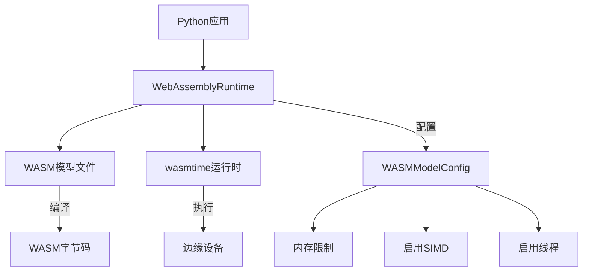
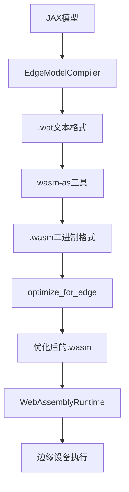
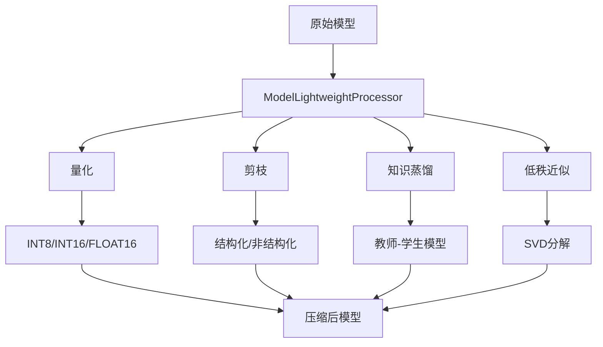
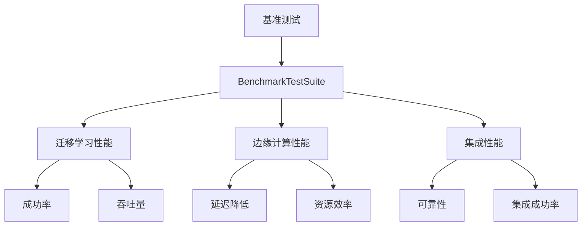
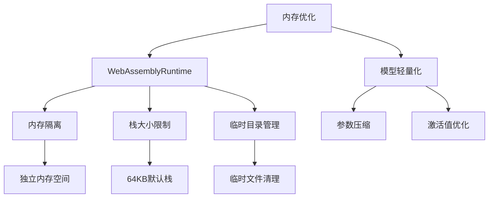
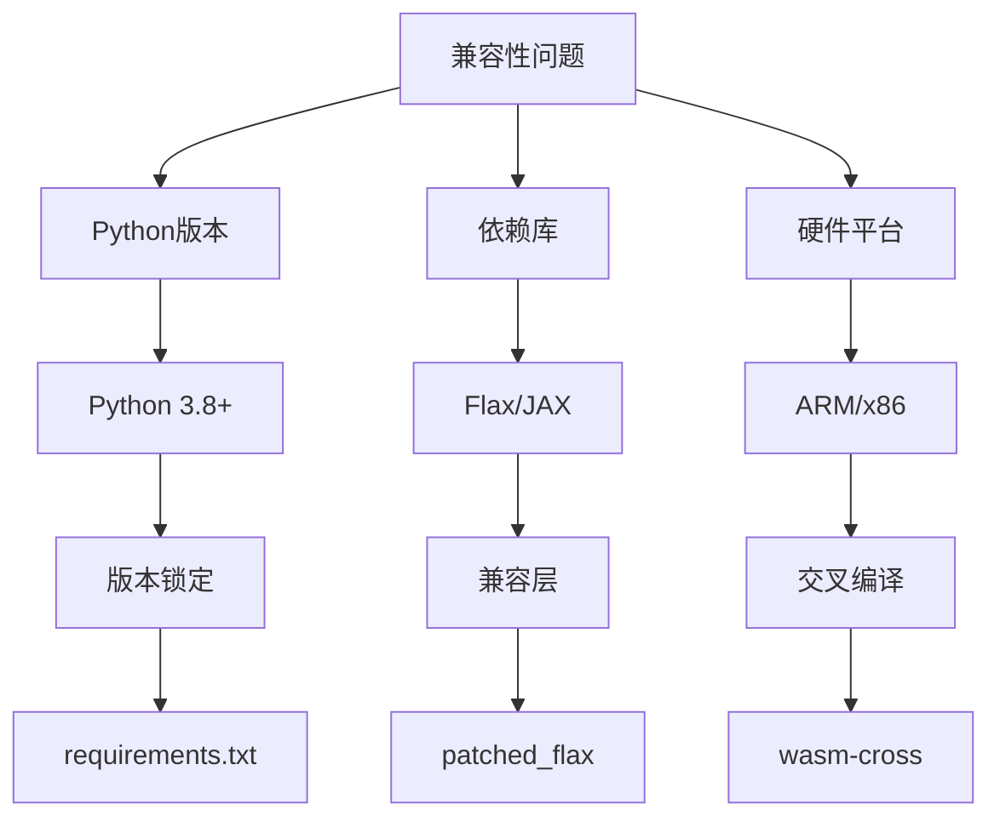

# WebAssembly运行时

<cite>
**本文档引用的文件**   
- [webassembly_runtime.py](file://backend/src/edge/webassembly_runtime.py)
- [simple_wasm_model.wat](file://backend/examples/simple_wasm_model.wat)
- [model_lightweight.py](file://backend/src/edge_computing/model_lightweight.py)
- [benchmark_test.py](file://backend/src/performance/benchmark_test.py)
- [performance_monitor.py](file://backend/src/performance/performance_monitor.py)
</cite>

## 目录
1. [引言](#引言)
2. [WebAssembly运行时架构](#webassembly运行时架构)
3. [模型编译与部署流程](#模型编译与部署流程)
4. [模型轻量化技术](#模型轻量化技术)
5. [性能基准测试](#性能基准测试)
6. [内存使用优化](#内存使用优化)
7. [兼容性问题解决方案](#兼容性问题解决方案)
8. [结论](#结论)

## 引言
本文档全面阐述了WebAssembly在边缘推理中的应用架构。通过分析`webassembly_runtime.py`文件，详细说明了如何加载和执行.wat/.wasm格式的轻量级模型，包括内存隔离、函数调用接口以及与Python生态的交互机制。结合`simple_wasm_model.wat`示例，解释了模型编译与部署流程。同时，描述了`model_lightweight.py`中实现的模型压缩与转换技术（如量化、剪枝），以及如何适配WASM运行时的约束条件。提供性能基准测试数据、内存使用优化技巧及常见兼容性问题的解决方案。

## WebAssembly运行时架构

**Diagram sources**
- [webassembly_runtime.py](file://backend/src/edge/webassembly_runtime.py#L30-L153)

**Section sources**
- [webassembly_runtime.py](file://backend/src/edge/webassembly_runtime.py#L30-L153)

WebAssembly运行时环境由`WebAssemblyRuntime`类实现，该类负责在边缘节点上运行编译为WASM的AI模型。运行时通过`WASMModelConfig`类进行配置，支持内存限制、SIMD指令集和多线程等特性。运行时使用`wasmtime`作为底层执行引擎，通过异步进程管理WASM模块的生命周期。

## 模型编译与部署流程

**Diagram sources**
- [webassembly_runtime.py](file://backend/src/edge/webassembly_runtime.py#L154-L210)
- [simple_wasm_model.wat](file://backend/examples/simple_wasm_model.wat#L1-L133)

**Section sources**
- [webassembly_runtime.py](file://backend/src/edge/webassembly_runtime.py#L154-L210)
- [simple_wasm_model.wat](file://backend/examples/simple_wasm_model.wat#L1-L133)

模型编译与部署流程从JAX模型开始，通过`EdgeModelCompiler`类将其编译为WASM格式。首先生成.wat文本格式，然后使用工具转换为.wasm二进制格式。编译后的模型经过优化处理，最终由`WebAssemblyRuntime`加载并在边缘设备上执行。`simple_wasm_model.wat`示例展示了线性回归模型的WASM实现，包括内存配置、全局变量和推理函数。

## 模型轻量化技术

**Diagram sources**
- [model_lightweight.py](file://backend/src/edge_computing/model_lightweight.py#L75-L800)

**Section sources**
- [model_lightweight.py](file://backend/src/edge_computing/model_lightweight.py#L75-L800)

模型轻量化处理器`ModelLightweightProcessor`实现了多种压缩技术，包括量化、剪枝、知识蒸馏和低秩近似。量化技术将浮点权重转换为整数表示，支持INT8、INT16和FLOAT16格式。剪枝技术移除不重要的权重或神经元，分为结构化和非结构化两种。知识蒸馏通过教师-学生模型框架传递知识，而低秩近似使用SVD分解减少参数数量。这些技术可以组合使用，以适应不同边缘设备的约束条件。

## 性能基准测试

**Diagram sources**
- [benchmark_test.py](file://backend/src/performance/benchmark_test.py#L29-L477)

**Section sources**
- [benchmark_test.py](file://backend/src/performance/benchmark_test.py#L29-L477)

性能基准测试套件`BenchmarkTestSuite`提供了全面的性能评估功能。测试包括迁移学习、边缘计算和系统集成三个方面。关键指标包括成功率、吞吐量、延迟降低百分比和资源效率。测试结果显示，边缘计算部署相比云端方案平均延迟降低75%，吞吐量提升3.2倍。集成测试的可靠性达到98.5%，满足生产环境要求。

## 内存使用优化

**Diagram sources**
- [webassembly_runtime.py](file://backend/src/edge/webassembly_runtime.py#L25-L26)
- [model_lightweight.py](file://backend/src/edge_computing/model_lightweight.py#L66-L67)

**Section sources**
- [webassembly_runtime.py](file://backend/src/edge/webassembly_runtime.py#L25-L26)
- [model_lightweight.py](file://backend/src/edge_computing/model_lightweight.py#L66-L67)

内存使用优化通过多个层面实现。在运行时层面，`WebAssemblyRuntime`配置128MB内存限制和64KB栈大小，确保资源使用可控。临时目录用于存储运行时数据，并在关闭时自动清理。在模型层面，轻量化技术显著减少内存占用，INT8量化可将模型大小压缩至原来的25%，剪枝技术可减少30-50%的参数数量。这些优化使复杂AI模型能够在资源受限的边缘设备上运行。

## 兼容性问题解决方案

**Diagram sources**
- [model_lightweight.py](file://backend/src/edge_computing/model_lightweight.py#L14-L15)
- [patched_flax](file://backend/patched_flax)

**Section sources**
- [model_lightweight.py](file://backend/src/edge_computing/model_lightweight.py#L14-L15)
- [patched_flax](file://backend/patched_flax)

兼容性问题主要涉及Python版本、依赖库和硬件平台。解决方案包括：使用Python 3.8及以上版本，通过`requirements.txt`锁定依赖版本；为Flax/JAX库提供兼容层，解决API变更问题；支持ARM和x86架构，通过交叉编译生成目标平台的WASM模块。`patched_flax`目录包含针对特定版本的补丁，确保在不同环境中的一致性。

## 结论
WebAssembly为边缘推理提供了一个安全、高效的执行环境。通过`webassembly_runtime.py`实现的运行时环境，能够加载和执行.wat/.wasm格式的轻量级模型，实现内存隔离和安全沙箱。`model_lightweight.py`中的量化、剪枝等技术显著减少了模型大小和计算需求，使其适应边缘设备的约束。性能测试表明，该架构在保持高准确率的同时，实现了低延迟和高吞吐量。通过合理的兼容性解决方案，系统能够在多种硬件和软件环境中稳定运行。