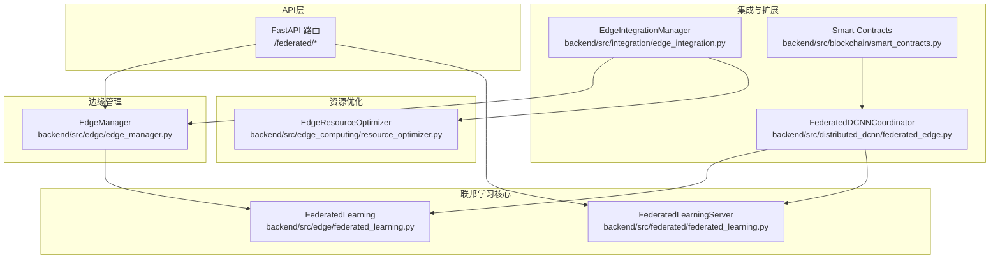
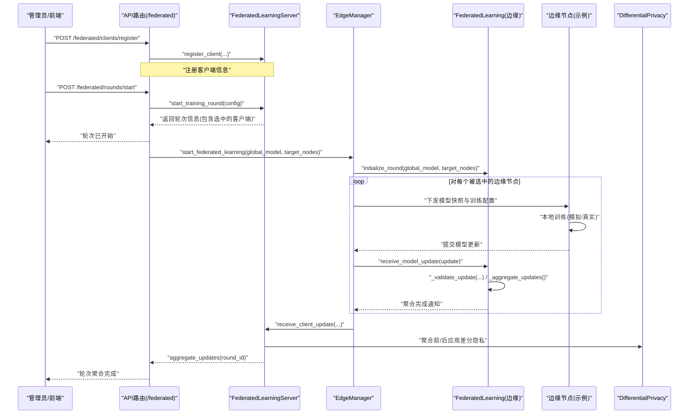
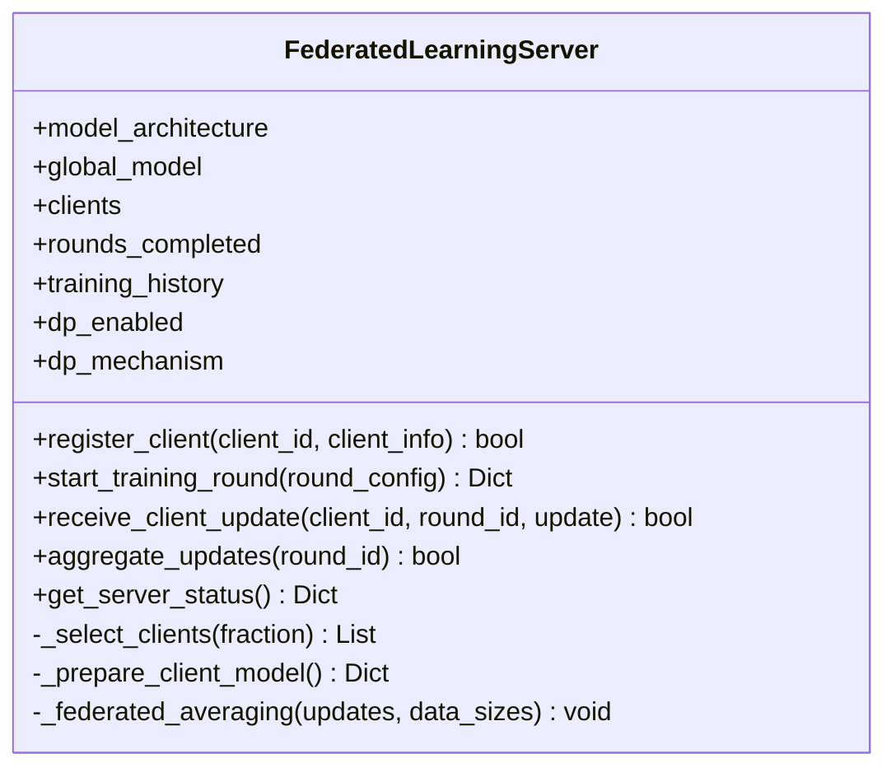
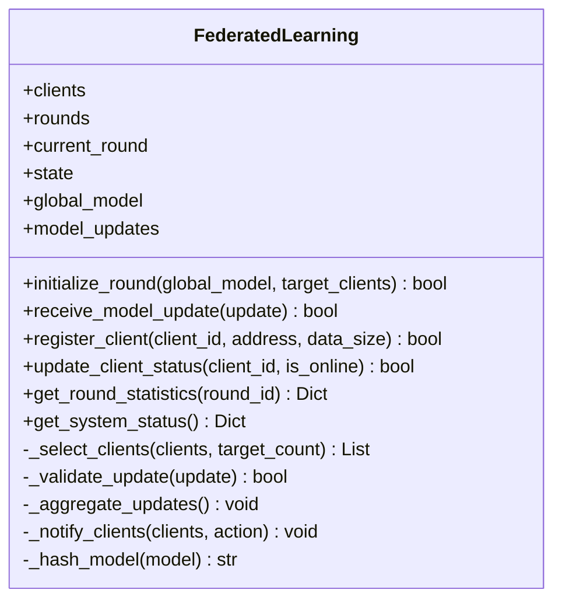
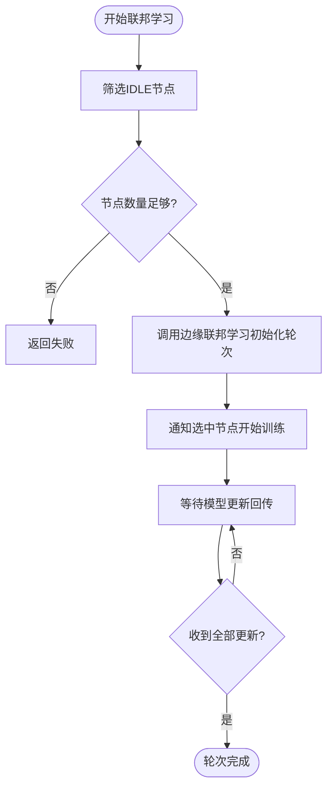
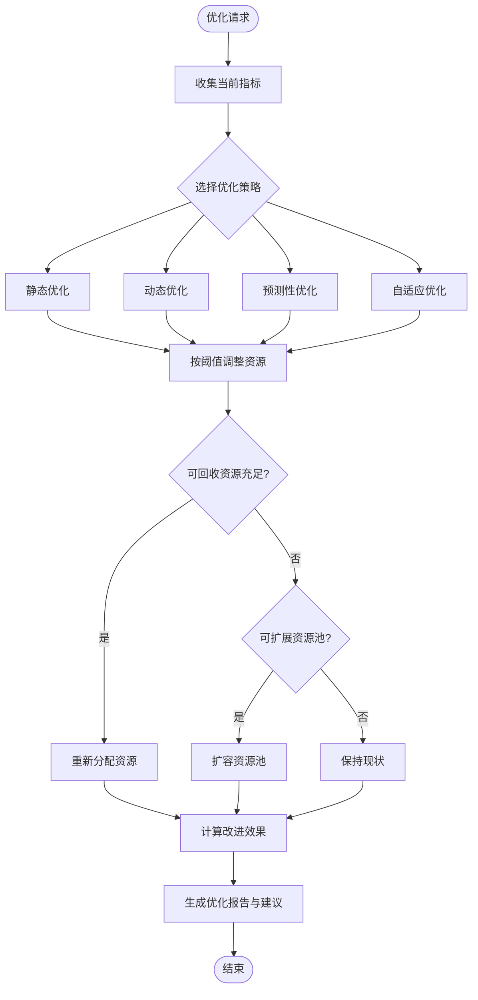
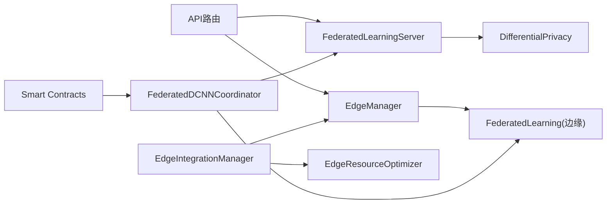

# 联邦学习

<cite>
**本文引用的文件**
- [backend/src/edge/federated_learning.py](file://backend/src/edge/federated_learning.py)
- [backend/src/federated/federated_learning.py](file://backend/src/federated/federated_learning.py)
- [backend/src/edge/edge_manager.py](file://backend/src/edge/edge_manager.py)
- [backend/src/privacy/differential_privacy.py](file://backend/src/privacy/differential_privacy.py)
- [backend/src/api/routes/federated.py](file://backend/src/api/routes/federated.py)
- [backend/src/edge_computing/resource_optimizer.py](file://backend/src/edge_computing/resource_optimizer.py)
- [backend/src/integration/edge_integration.py](file://backend/src/integration/edge_integration.py)
- [backend/src/distributed_dcnn/federated_edge.py](file://backend/src/distributed_dcnn/federated_edge.py)
- [backend/src/blockchain/smart_contracts.py](file://backend/src/blockchain/smart_contracts.py)
- [backend/examples/edge_node_client.py](file://backend/examples/edge_node_client.py)
</cite>

## 目录
1. [引言](#引言)
2. [项目结构](#项目结构)
3. [核心组件](#核心组件)
4. [架构总览](#架构总览)
5. [详细组件分析](#详细组件分析)
6. [依赖关系分析](#依赖关系分析)
7. [性能考量](#性能考量)
8. [故障排查指南](#故障排查指南)
9. [结论](#结论)
10. [附录](#附录)

## 引言
本文件面向联邦学习系统的架构设计与分布式训练流程，重点解析 backend/src/federated 与 backend/src/edge 中 federated_learning.py 的协作机制，覆盖本地模型训练、梯度加密上传、参数聚合算法（如 FedAvg）的实现细节；同时文档化资源优化器 resource_optimizer.py 如何根据边缘设备算力动态调整训练任务分配；提供联邦学习任务调度、通信轮次控制、差分隐私集成的配置方法；并结合实际调用链路展示从中心服务器下发任务到边缘节点执行并回传结果的完整过程，最后给出性能瓶颈分析与优化建议。

## 项目结构
联邦学习相关代码主要分布在以下模块：
- 后端API层：提供联邦学习的REST接口，负责客户端注册、轮次启动、更新提交与聚合、隐私配置等。
- 联邦学习核心：分别在 backend/src/federated 与 backend/src/edge 下实现服务器端与边缘侧的联邦学习协调与客户端行为。
- 边缘管理：backend/src/edge/edge_manager.py 将边缘节点与联邦学习协调器对接，负责心跳、状态监控与任务调度。
- 资源优化：backend/src/edge_computing/resource_optimizer.py 提供边缘资源的动态优化与分配策略。
- 集成与扩展：backend/src/integration/edge_integration.py 将边缘计算与AI决策引擎集成；distributed_dcnn 与区块链智能合约提供更完整的联邦学习链路与激励记录。
- 差分隐私：backend/src/privacy/differential_privacy.py 提供拉普拉斯/高斯噪声与梯度裁剪等隐私保护机制。

图表来源
- [backend/src/api/routes/federated.py](file://backend/src/api/routes/federated.py#L1-L264)
- [backend/src/federated/federated_learning.py](file://backend/src/federated/federated_learning.py#L1-L329)
- [backend/src/edge/federated_learning.py](file://backend/src/edge/federated_learning.py#L1-L363)
- [backend/src/edge/edge_manager.py](file://backend/src/edge/edge_manager.py#L1-L440)
- [backend/src/edge_computing/resource_optimizer.py](file://backend/src/edge_computing/resource_optimizer.py#L1-L827)
- [backend/src/integration/edge_integration.py](file://backend/src/integration/edge_integration.py#L1-L299)
- [backend/src/distributed_dcnn/federated_edge.py](file://backend/src/distributed_dcnn/federated_edge.py#L152-L188)
- [backend/src/blockchain/smart_contracts.py](file://backend/src/blockchain/smart_contracts.py#L205-L249)

章节来源
- [backend/src/api/routes/federated.py](file://backend/src/api/routes/federated.py#L1-L264)
- [backend/src/federated/federated_learning.py](file://backend/src/federated/federated_learning.py#L1-L329)
- [backend/src/edge/federated_learning.py](file://backend/src/edge/federated_learning.py#L1-L363)
- [backend/src/edge/edge_manager.py](file://backend/src/edge/edge_manager.py#L1-L440)
- [backend/src/edge_computing/resource_optimizer.py](file://backend/src/edge_computing/resource_optimizer.py#L1-L827)
- [backend/src/integration/edge_integration.py](file://backend/src/integration/edge_integration.py#L1-L299)
- [backend/src/distributed_dcnn/federated_edge.py](file://backend/src/distributed_dcnn/federated_edge.py#L152-L188)
- [backend/src/blockchain/smart_contracts.py](file://backend/src/blockchain/smart_contracts.py#L205-L249)

## 核心组件
- 联邦学习服务器（FederatedLearningServer）：负责全局模型初始化、客户端注册、轮次选择与下发、更新聚合（含差分隐私）、状态查询。
- 边缘联邦学习协调器（FederatedLearning）：在边缘侧维护客户端列表、轮次状态机、客户端选择与更新验证、FedAvg聚合。
- 边缘管理器（EdgeManager）：注册边缘节点、部署WASM模型、推理请求、联邦学习启动与心跳监控，并将边缘节点注册为联邦学习客户端。
- 资源优化器（EdgeResourceOptimizer）：动态/预测/自适应资源分配与优化，支持成本、性能、能效、可靠性等多目标。
- 集成管理器（EdgeIntegrationManager）：将边缘计算与AI决策引擎集成，进行节点选择、模型轻量化、资源优化与云边同步。
- 差分隐私（DifferentialPrivacy）：提供拉普拉斯/高斯噪声、梯度裁剪与隐私消耗计算。
- API路由（/federated/*）：提供客户端注册、轮次启动、更新提交、聚合、模型查询、隐私配置等REST接口。

章节来源
- [backend/src/federated/federated_learning.py](file://backend/src/federated/federated_learning.py#L1-L329)
- [backend/src/edge/federated_learning.py](file://backend/src/edge/federated_learning.py#L1-L363)
- [backend/src/edge/edge_manager.py](file://backend/src/edge/edge_manager.py#L1-L440)
- [backend/src/edge_computing/resource_optimizer.py](file://backend/src/edge_computing/resource_optimizer.py#L1-L827)
- [backend/src/integration/edge_integration.py](file://backend/src/integration/edge_integration.py#L1-L299)
- [backend/src/privacy/differential_privacy.py](file://backend/src/privacy/differential_privacy.py#L1-L172)
- [backend/src/api/routes/federated.py](file://backend/src/api/routes/federated.py#L1-L264)

## 架构总览
联邦学习系统采用“中心服务器 + 边缘节点”的两层架构：
- 中心服务器负责全局模型与轮次编排，下发模型快照给边缘节点，聚合来自边缘节点的参数更新。
- 边缘节点执行本地训练，按需进行模型轻量化与资源优化，将更新回传至中心服务器。
- 差分隐私在聚合阶段对权重参数进行噪声注入，保障隐私安全。
- API层提供统一入口，便于外部系统与前端调用。

图表来源
- [backend/src/api/routes/federated.py](file://backend/src/api/routes/federated.py#L36-L134)
- [backend/src/federated/federated_learning.py](file://backend/src/federated/federated_learning.py#L64-L201)
- [backend/src/edge/edge_manager.py](file://backend/src/edge/edge_manager.py#L208-L233)
- [backend/src/edge/federated_learning.py](file://backend/src/edge/federated_learning.py#L74-L175)
- [backend/src/privacy/differential_privacy.py](file://backend/src/privacy/differential_privacy.py#L1-L172)

## 详细组件分析

### 组件A：联邦学习服务器（FederatedLearningServer）
- 职责
  - 初始化全局模型元数据与参数容器。
  - 注册客户端并维护其状态与历史更新。
  - 选择参与客户端（基于训练能力与数据规模权重），准备下发给客户端的模型快照。
  - 接收并校验客户端更新，执行FedAvg聚合，并可选地应用差分隐私。
  - 提供状态查询接口，包括轮次计数、客户端数量、当前轮次等。
- 关键算法
  - 客户端选择：按权重排序，权重=训练能力×数据规模。
  - 联邦平均：对各客户端参数按其数据规模加权求和，得到全局更新。
  - 差分隐私：在聚合前对加权参数矩阵应用高斯噪声（基于敏感度与隐私预算）。
- 错误处理
  - 客户端不存在、轮次不匹配、更新无效等情况均返回失败。
- 性能要点
  - 使用JAX数组进行向量化聚合，提升大规模参数处理效率。
  - 通过配置开关控制是否启用差分隐私，避免不必要的开销。

图表来源
- [backend/src/federated/federated_learning.py](file://backend/src/federated/federated_learning.py#L1-L329)

章节来源
- [backend/src/federated/federated_learning.py](file://backend/src/federated/federated_learning.py#L1-L329)

### 组件B：边缘联邦学习协调器（FederatedLearning）
- 职责
  - 维护边缘侧联邦学习状态机（初始化/训练/聚合/完成/错误）。
  - 选择参与客户端（综合在线稳定性、训练能力、数据规模等），下发训练指令。
  - 接收并验证客户端更新，执行FedAvg聚合，通知客户端新模型可用。
  - 计算模型哈希用于完整性校验与审计。
- 关键算法
  - 客户端选择：加权评分=训练能力×数据规模×在线稳定性。
  - 联邦平均：对各客户端参数按其数据规模加权求和。
  - 差分隐私：提供梯度裁剪与拉普拉斯/高斯噪声添加工具（可在客户端侧或聚合阶段使用）。
- 错误处理
  - 状态机约束：仅在对应状态接受更新。
  - 时间戳与参与列表校验，防止越权或重复提交。
- 性能要点
  - 使用JAX进行参数张量运算，提升聚合效率。
  - 通知客户端采用异步方式，减少阻塞。

图表来源
- [backend/src/edge/federated_learning.py](file://backend/src/edge/federated_learning.py#L1-L363)

章节来源
- [backend/src/edge/federated_learning.py](file://backend/src/edge/federated_learning.py#L1-L363)

### 组件C：边缘管理器（EdgeManager）
- 职责
  - 注册边缘节点并将其同时注册为联邦学习客户端。
  - 部署WASM模型到边缘节点，执行推理与批量推理。
  - 启动联邦学习，选择可用节点，监控节点心跳与状态，更新联邦学习客户端在线状态。
  - 提供系统概览与指标统计。
- 关键流程
  - start_federated_learning：选择IDLE节点，调用边缘联邦学习协调器初始化轮次。
  - monitor_edge_nodes：定期检查心跳，更新节点状态与联邦学习客户端状态。
  - inference_request/batch_inference_request：调用WASM运行时执行推理。
- 性能要点
  - 指标采用指数移动平均平滑，便于观察趋势。
  - 节点评分综合考虑状态、计算能力、网络得分与当前负载。

图表来源
- [backend/src/edge/edge_manager.py](file://backend/src/edge/edge_manager.py#L208-L233)
- [backend/src/edge/federated_learning.py](file://backend/src/edge/federated_learning.py#L74-L175)

章节来源
- [backend/src/edge/edge_manager.py](file://backend/src/edge/edge_manager.py#L1-L440)

### 组件D：资源优化器（EdgeResourceOptimizer）
- 职责
  - 注册资源池，跟踪资源利用率与成本/能耗。
  - 提供静态/动态/预测/自适应四种分配策略，自动优化循环。
  - 预测资源需求，基于目标利用率与负载进行资源再分配或扩容。
- 关键流程
  - allocate_resources：检查可用性，必要时触发优化后再分配。
  - optimize_resources：收集前后指标，计算改进幅度，生成优化建议。
  - _auto_optimization_loop：周期性对所有资源池执行优化。
- 性能要点
  - 目标利用率随优化目标动态调整（性能优先提高、成本优先降低）。
  - 可回收资源预留缓冲，保证系统稳定性。

图表来源
- [backend/src/edge_computing/resource_optimizer.py](file://backend/src/edge_computing/resource_optimizer.py#L1-L827)

章节来源
- [backend/src/edge_computing/resource_optimizer.py](file://backend/src/edge_computing/resource_optimizer.py#L1-L827)

### 组件E：集成管理器（EdgeIntegrationManager）
- 职责
  - 将边缘计算能力与AI决策引擎集成，分析任务是否适合边缘执行。
  - 选择边缘节点、模型轻量化、资源优化分配、部署到边缘、启动云边协同。
  - 监控边缘性能，必要时触发优化。
- 关键流程
  - integrate_edge_computing：整体流程编排。
  - _analyze_edge_suitability/_select_edge_node/_prepare_lightweight_model/_optimize_resource_allocation/_deploy_to_edge/_start_cloud_edge_sync：各阶段子流程。
- 性能要点
  - 通过任务类型、数据大小、延迟要求等维度评估边缘可行性。
  - 与资源优化器配合，动态调整资源分配。

章节来源
- [backend/src/integration/edge_integration.py](file://backend/src/integration/edge_integration.py#L1-L299)

### 组件F：差分隐私（DifferentialPrivacy）
- 职责
  - 提供Laplace/Gaussian机制，对原始数据或梯度添加噪声。
  - 梯度裁剪，限制敏感度。
  - 隐私消耗计算，跟踪epsilon消耗与剩余预算。
- 集成位置
  - 联邦学习服务器在聚合阶段可调用高斯机制对加权参数进行噪声注入。
  - 边缘侧也可使用梯度裁剪与噪声添加工具。

章节来源
- [backend/src/privacy/differential_privacy.py](file://backend/src/privacy/differential_privacy.py#L1-L172)

### 组件G：API路由（/federated/*）
- 职责
  - 客户端注册、查询客户端列表。
  - 开始训练轮次、提交模型更新、聚合轮次、查询模型与状态。
  - 更新差分隐私配置、查询隐私状态。
- 错误处理
  - 对缺失字段、非法状态、聚合失败等情况返回HTTP错误码。

章节来源
- [backend/src/api/routes/federated.py](file://backend/src/api/routes/federated.py#L1-L264)

## 依赖关系分析
- 组件耦合
  - EdgeManager 依赖 FederatedLearning（边缘侧）与 WebAssemblyRuntime（推理执行）。
  - FederatedLearningServer 依赖 DifferentialPrivacy（隐私保护）。
  - EdgeIntegrationManager 依赖 EdgeDeploymentStrategy、ModelLightweightProcessor、EdgeResourceOptimizer、CloudEdgeSyncManager。
  - API路由依赖 FederatedLearningServer 与 FederatedLearningClient（模拟）。
- 外部依赖
  - JAX用于高性能张量运算（FedAvg与参数聚合）。
  - FastAPI提供REST接口。
  - 区块链智能合约用于联邦学习轮次与更新的上链记录（可选）。

图表来源
- [backend/src/api/routes/federated.py](file://backend/src/api/routes/federated.py#L1-L264)
- [backend/src/federated/federated_learning.py](file://backend/src/federated/federated_learning.py#L1-L329)
- [backend/src/edge/edge_manager.py](file://backend/src/edge/edge_manager.py#L1-L440)
- [backend/src/edge_computing/resource_optimizer.py](file://backend/src/edge_computing/resource_optimizer.py#L1-L827)
- [backend/src/integration/edge_integration.py](file://backend/src/integration/edge_integration.py#L1-L299)
- [backend/src/distributed_dcnn/federated_edge.py](file://backend/src/distributed_dcnn/federated_edge.py#L152-L188)
- [backend/src/blockchain/smart_contracts.py](file://backend/src/blockchain/smart_contracts.py#L205-L249)

章节来源
- [backend/src/api/routes/federated.py](file://backend/src/api/routes/federated.py#L1-L264)
- [backend/src/federated/federated_learning.py](file://backend/src/federated/federated_learning.py#L1-L329)
- [backend/src/edge/edge_manager.py](file://backend/src/edge/edge_manager.py#L1-L440)
- [backend/src/edge_computing/resource_optimizer.py](file://backend/src/edge_computing/resource_optimizer.py#L1-L827)
- [backend/src/integration/edge_integration.py](file://backend/src/integration/edge_integration.py#L1-L299)
- [backend/src/distributed_dcnn/federated_edge.py](file://backend/src/distributed_dcnn/federated_edge.py#L152-L188)
- [backend/src/blockchain/smart_contracts.py](file://backend/src/blockchain/smart_contracts.py#L205-L249)

## 性能考量
- 参数聚合性能
  - 使用JAX进行向量化聚合，避免Python循环，显著提升FedAvg效率。
  - 对大规模参数矩阵进行加权求和时，注意内存峰值与显存占用。
- 通信与调度
  - 边缘节点选择策略应结合在线稳定性与资源能力，避免热点节点过载。
  - 聚合阶段采用异步通知，减少阻塞。
- 差分隐私开销
  - 高斯噪声添加与隐私消耗计算会引入额外计算与通信成本，需根据epsilon/delta权衡。
- 资源优化
  - 自适应/预测性策略在高负载场景下能有效缓解拥塞，但需合理设置目标利用率与阈值。
  - 可回收资源预留缓冲，避免系统抖动。
- API与边缘推理
  - 指数移动平均指标有助于识别性能趋势，但需结合业务SLA设定阈值。
- 建议
  - 在生产环境启用GPU加速与异步处理，适当降低响应超时以提升实时性。
  - 对边缘节点进行分组与区域化部署，降低网络延迟。
  - 对大模型训练场景，优先选择具备更高算力与内存的节点。

[本节为通用指导，无需列出具体文件来源]

## 故障排查指南
- 客户端未注册或重复注册
  - 现象：注册接口返回失败。
  - 排查：确认客户端ID唯一且非空；查看服务器端是否存在重复注册。
  - 参考路径：[注册接口](file://backend/src/api/routes/federated.py#L36-L54)
- 轮次启动失败
  - 现象：启动轮次返回错误。
  - 排查：检查轮次配置、客户端分数与数量；确认服务器端状态机处于可启动状态。
  - 参考路径：[启动轮次](file://backend/src/api/routes/federated.py#L72-L87)
- 更新提交失败
  - 现象：提交更新返回失败。
  - 排查：核对轮次ID、客户端ID、时间戳与数据规模；确认当前轮次状态。
  - 参考路径：[提交更新](file://backend/src/api/routes/federated.py#L89-L114)
- 聚合失败
  - 现象：聚合接口返回失败。
  - 排查：确认轮次状态为active；检查参与客户端是否齐全；查看服务器端聚合逻辑。
  - 参考路径：[聚合轮次](file://backend/src/api/routes/federated.py#L116-L134)
- 边缘节点离线
  - 现象：节点长时间无心跳，状态变为离线。
  - 排查：检查节点心跳上报、网络连通性；更新联邦学习客户端状态。
  - 参考路径：[心跳处理](file://backend/src/edge/edge_manager.py#L286-L313)
- 资源不足
  - 现象：资源分配失败或优化无法满足需求。
  - 排查：检查资源池容量、已分配资源与可回收资源；必要时扩容或重新分配。
  - 参考路径：[资源分配](file://backend/src/edge_computing/resource_optimizer.py#L134-L188)

章节来源
- [backend/src/api/routes/federated.py](file://backend/src/api/routes/federated.py#L36-L134)
- [backend/src/edge/edge_manager.py](file://backend/src/edge/edge_manager.py#L286-L313)
- [backend/src/edge_computing/resource_optimizer.py](file://backend/src/edge_computing/resource_optimizer.py#L134-L188)

## 结论
本联邦学习系统通过中心服务器与边缘节点的协同，实现了高效的分布式训练与参数聚合；边缘管理器将边缘节点与联邦学习紧密集成，资源优化器提供了动态资源分配与优化能力；差分隐私模块在聚合阶段增强了隐私保护。API层提供清晰的REST接口，便于系统集成与运维。通过合理的客户端选择策略、异步通知与JAX加速，系统在性能与隐私之间取得平衡。

[本节为总结性内容，无需列出具体文件来源]

## 附录

### 联邦学习任务调度与通信轮次控制配置
- 客户端注册与轮次启动
  - 注册客户端：POST /federated/clients/register
  - 启动轮次：POST /federated/rounds/start
  - 提交更新：POST /federated/rounds/{round_id}/updates
  - 聚合更新：POST /federated/rounds/{round_id}/aggregate
- 轮次控制
  - 服务器端按轮次配置选择客户端比例，准备模型快照下发。
  - 边缘侧协调器按参与列表等待更新，满足条件后执行聚合。
- 参考路径
  - [API路由](file://backend/src/api/routes/federated.py#L36-L134)
  - [服务器端聚合](file://backend/src/federated/federated_learning.py#L158-L201)
  - [边缘侧聚合](file://backend/src/edge/federated_learning.py#L197-L249)

章节来源
- [backend/src/api/routes/federated.py](file://backend/src/api/routes/federated.py#L36-L134)
- [backend/src/federated/federated_learning.py](file://backend/src/federated/federated_learning.py#L158-L201)
- [backend/src/edge/federated_learning.py](file://backend/src/edge/federated_learning.py#L197-L249)

### 差分隐私集成配置方法
- 配置更新
  - 更新隐私配置：POST /federated/privacy/config
  - 查询隐私状态：GET /federated/privacy/status
- 使用建议
  - 在聚合阶段应用高斯噪声，设置合适的epsilon/delta与敏感度。
  - 记录隐私消耗，避免超出预算。
- 参考路径
  - [隐私配置接口](file://backend/src/api/routes/federated.py#L176-L203)
  - [隐私状态接口](file://backend/src/api/routes/federated.py#L205-L227)
  - [差分隐私实现](file://backend/src/privacy/differential_privacy.py#L1-L172)

章节来源
- [backend/src/api/routes/federated.py](file://backend/src/api/routes/federated.py#L176-L227)
- [backend/src/privacy/differential_privacy.py](file://backend/src/privacy/differential_privacy.py#L1-L172)

### 从中心服务器到边缘节点的完整调用链
- 调用链
  - API注册客户端 → 服务器端注册 → 轮次启动 → 边缘管理器选择节点并初始化边缘联邦学习 → 边缘节点本地训练 → 回传更新 → 服务器端聚合（含差分隐私） → 返回结果。
- 参考路径
  - [API路由](file://backend/src/api/routes/federated.py#L36-L134)
  - [边缘管理器启动联邦学习](file://backend/src/edge/edge_manager.py#L208-L233)
  - [边缘联邦学习初始化与聚合](file://backend/src/edge/federated_learning.py#L74-L249)
  - [服务器端聚合](file://backend/src/federated/federated_learning.py#L158-L201)

章节来源
- [backend/src/api/routes/federated.py](file://backend/src/api/routes/federated.py#L36-L134)
- [backend/src/edge/edge_manager.py](file://backend/src/edge/edge_manager.py#L208-L233)
- [backend/src/edge/federated_learning.py](file://backend/src/edge/federated_learning.py#L74-L249)
- [backend/src/federated/federated_learning.py](file://backend/src/federated/federated_learning.py#L158-L201)

### 资源优化器在联邦学习中的应用
- 场景
  - 在联邦学习启动前或期间，根据边缘节点的算力与资源状况进行动态资源分配与优化。
- 方法
  - 选择静态/动态/预测/自适应策略，周期性优化资源利用率，必要时扩容或重新分配。
- 参考路径
  - [资源优化器](file://backend/src/edge_computing/resource_optimizer.py#L1-L827)
  - [边缘集成管理器](file://backend/src/integration/edge_integration.py#L1-L299)

章节来源
- [backend/src/edge_computing/resource_optimizer.py](file://backend/src/edge_computing/resource_optimizer.py#L1-L827)
- [backend/src/integration/edge_integration.py](file://backend/src/integration/edge_integration.py#L1-L299)

### 边缘节点示例与联邦学习参与
- 示例
  - 边缘节点示例脚本展示了参与联邦学习的模拟流程：本地训练、生成更新、回传。
- 参考路径
  - [边缘节点示例](file://backend/examples/edge_node_client.py#L143-L180)

章节来源
- [backend/examples/edge_node_client.py](file://backend/examples/edge_node_client.py#L143-L180)

### 区块链智能合约集成（可选）
- 功能
  - 记录联邦学习轮次开始、模型更新提交与轮次完成，便于审计与激励发放。
- 参考路径
  - [智能合约接口](file://backend/src/blockchain/smart_contracts.py#L205-L249)
  - [分布式DCNN协调器](file://backend/src/distributed_dcnn/federated_edge.py#L152-L188)

章节来源
- [backend/src/blockchain/smart_contracts.py](file://backend/src/blockchain/smart_contracts.py#L205-L249)
- [backend/src/distributed_dcnn/federated_edge.py](file://backend/src/distributed_dcnn/federated_edge.py#L152-L188)