# 边缘节点管理

<cite>
**本文引用的文件**
- [edge_manager.py](file://backend/src/edge/edge_manager.py)
- [config.py](file://backend/src/edge/config.py)
- [deployment_strategy.py](file://backend/src/edge_computing/deployment_strategy.py)
- [device_discovery_service.py](file://backend/src/core/services/device_discovery_service.py)
- [webassembly_runtime.py](file://backend/src/edge/webassembly_runtime.py)
- [federated_learning.py](file://backend/src/edge/federated_learning.py)
- [edge_integration.py](file://backend/src/integration/edge_integration.py)
- [serviceDiscovery.ts](file://api-gateway/src/discovery/serviceDiscovery.ts)
- [decision_engine.py](file://decision-service/src/core/decision_engine.py)
</cite>

## 目录
1. [简介](#简介)
2. [项目结构](#项目结构)
3. [核心组件](#核心组件)
4. [架构总览](#架构总览)
5. [详细组件分析](#详细组件分析)
6. [依赖关系分析](#依赖关系分析)
7. [性能考量](#性能考量)
8. [故障排查指南](#故障排查指南)
9. [结论](#结论)
10. [附录](#附录)

## 简介
本文件系统化梳理了边缘节点的发现、注册、配置与生命周期管理机制，重点围绕以下方面：
- edge_manager.py 如何通过设备发现服务实现边缘节点的自动识别与连接控制
- config.py 中的配置参数如何影响节点部署策略与运行行为
- deployment_strategy.py 中定义的边缘部署模式（集中式、分布式、混合、自适应）及其在实际场景中的应用
- 边缘节点健康检查、状态同步与故障恢复的实现细节
- 与 API 网关及决策服务之间的通信协议与集成方式

## 项目结构
本项目采用多模块分层组织，边缘节点管理涉及后端边缘计算模块、设备发现服务、API 网关服务发现、以及决策服务等。下图展示了与边缘节点管理直接相关的模块关系。

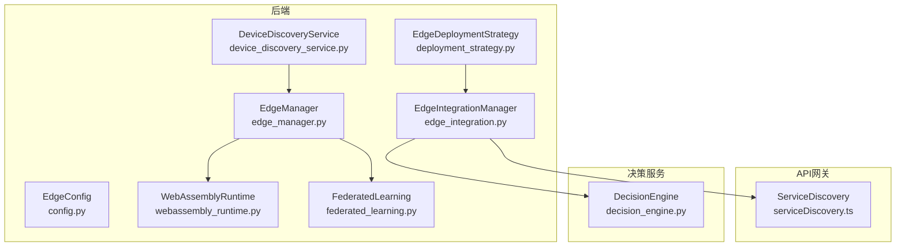

图表来源
- [edge_manager.py](file://backend/src/edge/edge_manager.py#L1-L440)
- [config.py](file://backend/src/edge/config.py#L1-L142)
- [webassembly_runtime.py](file://backend/src/edge/webassembly_runtime.py#L1-L210)
- [federated_learning.py](file://backend/src/edge/federated_learning.py#L1-L363)
- [device_discovery_service.py](file://backend/src/core/services/device_discovery_service.py#L1-L447)
- [deployment_strategy.py](file://backend/src/edge_computing/deployment_strategy.py#L1-L550)
- [edge_integration.py](file://backend/src/integration/edge_integration.py#L1-L299)
- [serviceDiscovery.ts](file://api-gateway/src/discovery/serviceDiscovery.ts#L1-L268)
- [decision_engine.py](file://decision-service/src/core/decision_engine.py#L1-L397)

章节来源
- [edge_manager.py](file://backend/src/edge/edge_manager.py#L1-L120)
- [config.py](file://backend/src/edge/config.py#L1-L142)
- [deployment_strategy.py](file://backend/src/edge_computing/deployment_strategy.py#L1-L120)
- [device_discovery_service.py](file://backend/src/core/services/device_discovery_service.py#L1-L120)
- [webassembly_runtime.py](file://backend/src/edge/webassembly_runtime.py#L1-L80)
- [federated_learning.py](file://backend/src/edge/federated_learning.py#L1-L120)
- [edge_integration.py](file://backend/src/integration/edge_integration.py#L1-L120)
- [serviceDiscovery.ts](file://api-gateway/src/discovery/serviceDiscovery.ts#L1-L120)
- [decision_engine.py](file://decision-service/src/core/decision_engine.py#L1-L120)

## 核心组件
- 边缘管理器（EdgeManager）：负责边缘节点注册、WASM 模型部署、推理请求、联邦学习协调、心跳监控与状态同步、系统概览与关闭。
- 配置管理（EdgeConfig）：集中管理边缘计算相关配置，包括环境、心跳、WASM 运行时、联邦学习、差分隐私、负载均衡权重、监控与网络等。
- 部署策略（EdgeDeploymentStrategy）：定义部署层级、策略与负载均衡算法，提供节点注册、部署计划创建与执行、优化与故障恢复流程。
- 设备发现服务（DeviceDiscoveryService）：扫描网络、蓝牙、红外设备，自动识别设备类型，为边缘节点接入提供基础。
- WebAssembly 运行时（WebAssemblyRuntime）：封装 WASM 进程生命周期、推理与批量推理、运行时信息查询与关闭。
- 联邦学习（FederatedLearning）：协调边缘节点参与联邦学习，选择客户端、聚合模型更新、状态管理与差分隐私。
- 边缘集成（EdgeIntegrationManager）：将边缘计算能力与决策引擎集成，进行任务适配性分析、节点选择、轻量化模型、资源优化与云边协同。
- API 网关服务发现（ServiceDiscovery）：维护服务实例、心跳检测、健康状态与负载均衡器对接。
- 决策引擎（DecisionEngine）：基于强化学习的农业参数优化决策，为边缘任务提供目标与参数建议。

章节来源
- [edge_manager.py](file://backend/src/edge/edge_manager.py#L40-L120)
- [config.py](file://backend/src/edge/config.py#L1-L142)
- [deployment_strategy.py](file://backend/src/edge_computing/deployment_strategy.py#L1-L120)
- [device_discovery_service.py](file://backend/src/core/services/device_discovery_service.py#L1-L120)
- [webassembly_runtime.py](file://backend/src/edge/webassembly_runtime.py#L1-L80)
- [federated_learning.py](file://backend/src/edge/federated_learning.py#L1-L120)
- [edge_integration.py](file://backend/src/integration/edge_integration.py#L1-L120)
- [serviceDiscovery.ts](file://api-gateway/src/discovery/serviceDiscovery.ts#L1-L120)
- [decision_engine.py](file://decision-service/src/core/decision_engine.py#L1-L120)

## 架构总览
下图展示了边缘节点管理的整体架构与交互路径，包括设备发现、注册、部署策略、推理执行、联邦学习、健康检查与服务发现。

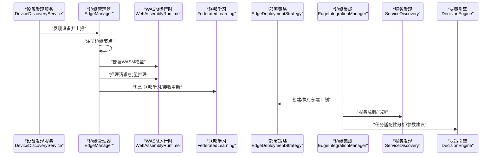

图表来源
- [device_discovery_service.py](file://backend/src/core/services/device_discovery_service.py#L1-L120)
- [edge_manager.py](file://backend/src/edge/edge_manager.py#L60-L120)
- [webassembly_runtime.py](file://backend/src/edge/webassembly_runtime.py#L38-L110)
- [federated_learning.py](file://backend/src/edge/federated_learning.py#L74-L120)
- [deployment_strategy.py](file://backend/src/edge_computing/deployment_strategy.py#L136-L204)
- [edge_integration.py](file://backend/src/integration/edge_integration.py#L30-L96)
- [serviceDiscovery.ts](file://api-gateway/src/discovery/serviceDiscovery.ts#L40-L120)
- [decision_engine.py](file://decision-service/src/core/decision_engine.py#L99-L153)

## 详细组件分析

### 边缘管理器（EdgeManager）
- 节点注册：接收节点标识、地址与能力信息，建立节点对象并同时注册为联邦学习客户端。
- WASM 模型部署：校验节点状态、初始化 WASM 运行时、存储运行时实例并更新节点状态与任务集合。
- 推理与批量推理：记录推理耗时、更新指标、返回结果；异常时记录错误并返回空值。
- 联邦学习：选择可用节点、初始化轮次、聚合更新、通知客户端。
- 健康检查与状态同步：周期性检查心跳超时，更新节点状态与运行时间统计；接收心跳时同步状态与在线状态。
- 负载均衡：按节点状态、计算能力、网络评分与当前负载评分选择最优节点。
- 系统概览与关闭：汇总节点状态、WASM 实例数、联邦学习状态与指标；关闭时清理 WASM 进程与取消任务。

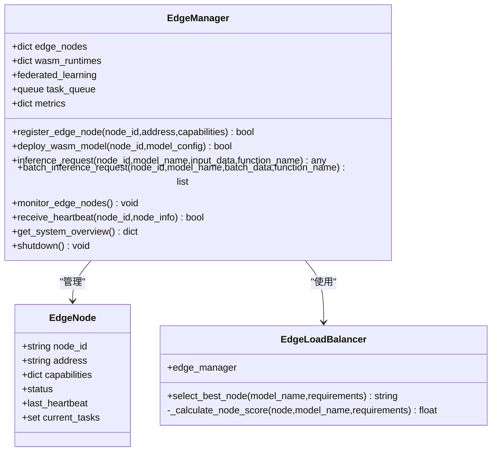

图表来源
- [edge_manager.py](file://backend/src/edge/edge_manager.py#L19-L120)
- [edge_manager.py](file://backend/src/edge/edge_manager.py#L251-L440)

章节来源
- [edge_manager.py](file://backend/src/edge/edge_manager.py#L60-L120)
- [edge_manager.py](file://backend/src/edge/edge_manager.py#L126-L194)
- [edge_manager.py](file://backend/src/edge/edge_manager.py#L208-L249)
- [edge_manager.py](file://backend/src/edge/edge_manager.py#L251-L313)
- [edge_manager.py](file://backend/src/edge/edge_manager.py#L314-L360)
- [edge_manager.py](file://backend/src/edge/edge_manager.py#L380-L440)

### 配置管理（EdgeConfig）
- 环境与调试：开发/预发/生产环境切换、日志级别与调试开关。
- 节点与心跳：最大节点数、心跳间隔与超时。
- WASM 运行时：内存限制、栈大小、SIMD/线程支持。
- 联邦学习：最小/最大客户端数、轮次超时、聚合方法。
- 差分隐私：ε、δ、梯度裁剪范数。
- 负载均衡权重：计算能力、网络、负载权重。
- 监控与网络：指标保留天数、协调器地址、节点端口范围。
- 存储：模型与数据缓存目录。
- 环境变量覆盖：从环境变量动态覆盖默认配置。

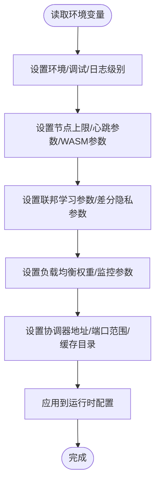

图表来源
- [config.py](file://backend/src/edge/config.py#L1-L142)

章节来源
- [config.py](file://backend/src/edge/config.py#L1-L142)

### 部署策略（EdgeDeploymentStrategy）
- 部署层级：云中心、边缘服务器、边缘网关、终端设备。
- 部署策略：集中式、分布式、混合、自适应。
- 负载均衡算法：轮询、最少连接、加权轮询、最少响应时间、自适应。
- 节点注册：记录节点能力、当前负载、网络延迟、可用资源与最后更新时间。
- 部署计划：选择策略、目标层级、节点分配、资源需求、成本估算、性能预测与风险评估。
- 执行流程：可行性验证、环境准备、分层部署、结果验证、监控与优化、故障恢复。
- 优化与恢复：分析当前性能、识别优化机会、生成优化计划、应用优化、执行故障恢复。

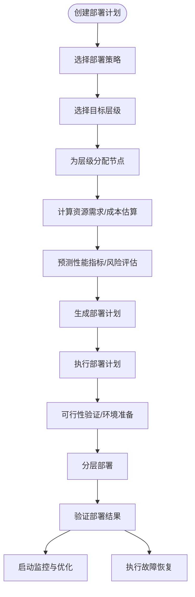

图表来源
- [deployment_strategy.py](file://backend/src/edge_computing/deployment_strategy.py#L136-L204)
- [deployment_strategy.py](file://backend/src/edge_computing/deployment_strategy.py#L204-L275)
- [deployment_strategy.py](file://backend/src/edge_computing/deployment_strategy.py#L276-L550)

章节来源
- [deployment_strategy.py](file://backend/src/edge_computing/deployment_strategy.py#L1-L120)
- [deployment_strategy.py](file://backend/src/edge_computing/deployment_strategy.py#L136-L204)
- [deployment_strategy.py](file://backend/src/edge_computing/deployment_strategy.py#L204-L275)
- [deployment_strategy.py](file://backend/src/edge_computing/deployment_strategy.py#L276-L550)

### 设备发现服务（DeviceDiscoveryService）
- 网络扫描：对 IP 段进行端口探测，识别 Web/SSH/应用服务器/Windows 设备等。
- 蓝牙扫描：跨平台调用系统命令或回退模拟数据，识别传感器与控制器。
- 红外扫描：模拟红外设备发现。
- 自动分类：基于名称关键词、连接类型、权限与端口等综合判定设备类型。
- 并行扫描：网络、蓝牙、红外三类扫描并行执行，合并去重后返回。

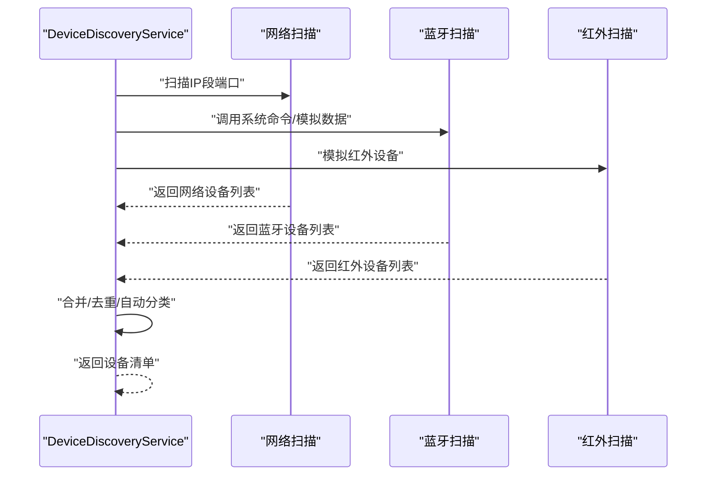

图表来源
- [device_discovery_service.py](file://backend/src/core/services/device_discovery_service.py#L29-L120)
- [device_discovery_service.py](file://backend/src/core/services/device_discovery_service.py#L130-L285)
- [device_discovery_service.py](file://backend/src/core/services/device_discovery_service.py#L286-L361)
- [device_discovery_service.py](file://backend/src/core/services/device_discovery_service.py#L362-L418)

章节来源
- [device_discovery_service.py](file://backend/src/core/services/device_discovery_service.py#L1-L120)
- [device_discovery_service.py](file://backend/src/core/services/device_discovery_service.py#L120-L240)
- [device_discovery_service.py](file://backend/src/core/services/device_discovery_service.py#L240-L360)
- [device_discovery_service.py](file://backend/src/core/services/device_discovery_service.py#L360-L447)

### WebAssembly 运行时（WebAssemblyRuntime）
- 初始化：检查 WASM 文件、创建临时目录、启动运行时进程（示例使用 wasmtime），设置特性与内存限制。
- 推理：序列化输入、写入 stdin、读取 stdout 输出、解析 JSON 结果、返回数组。
- 批量推理：循环调用单次推理。
- 关闭：终止进程、等待退出、清理临时目录。

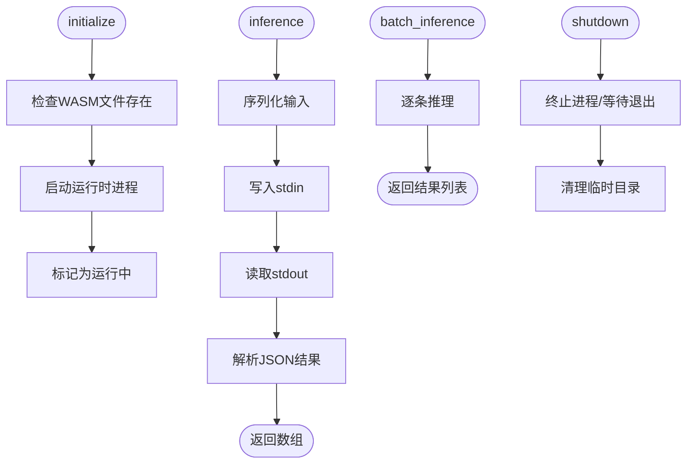

图表来源
- [webassembly_runtime.py](file://backend/src/edge/webassembly_runtime.py#L38-L110)
- [webassembly_runtime.py](file://backend/src/edge/webassembly_runtime.py#L115-L153)

章节来源
- [webassembly_runtime.py](file://backend/src/edge/webassembly_runtime.py#L1-L80)
- [webassembly_runtime.py](file://backend/src/edge/webassembly_runtime.py#L80-L153)
- [webassembly_runtime.py](file://backend/src/edge/webassembly_runtime.py#L154-L210)

### 联邦学习（FederatedLearning）
- 客户端注册：记录节点地址、在线状态、最后在线时间与数据规模。
- 轮次初始化：选择参与客户端、生成轮次 ID、记录全局模型哈希、通知客户端开始训练。
- 更新接收与验证：检查轮次匹配、时间戳、数据规模等，聚合更新（FedAvg）后通知客户端。
- 在线稳定性：基于最后在线时间计算权重，优先选择稳定在线节点。
- 状态与统计：跟踪状态机、轮次统计与系统状态。

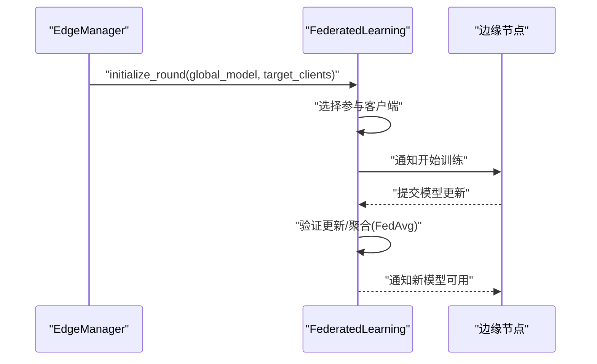

图表来源
- [federated_learning.py](file://backend/src/edge/federated_learning.py#L74-L120)
- [federated_learning.py](file://backend/src/edge/federated_learning.py#L150-L245)
- [federated_learning.py](file://backend/src/edge/federated_learning.py#L271-L332)

章节来源
- [federated_learning.py](file://backend/src/edge/federated_learning.py#L1-L120)
- [federated_learning.py](file://backend/src/edge/federated_learning.py#L120-L240)
- [federated_learning.py](file://backend/src/edge/federated_learning.py#L240-L363)

### 边缘集成（EdgeIntegrationManager）
- 任务适配性分析：检查任务类型、数据大小、延迟与隐私要求，决定是否启用边缘。
- 节点选择：基于任务需求与可用节点能力，使用部署策略选择最优节点。
- 轻量化模型：根据模型类型与精度要求选择轻量化策略并应用。
- 资源优化：注册资源池，优化资源分配。
- 部署与同步：将任务部署到边缘节点并启动云边协同。
- 性能监控与优化：监控延迟、吞吐与资源利用率，触发优化。

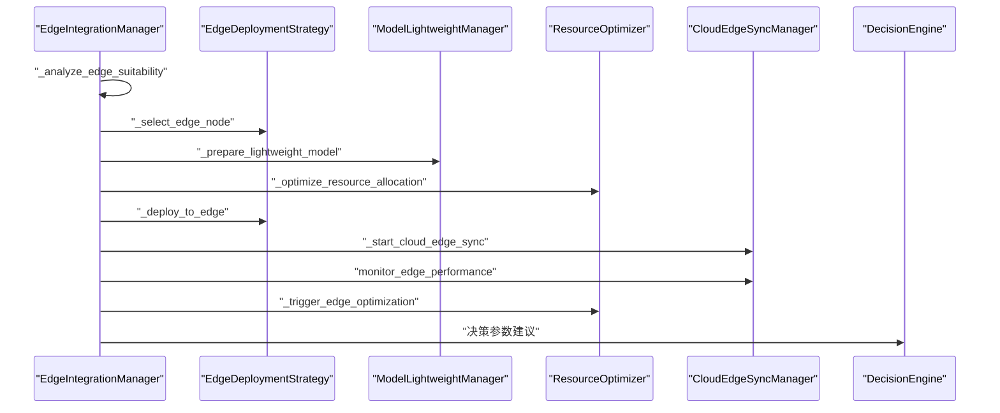

图表来源
- [edge_integration.py](file://backend/src/integration/edge_integration.py#L30-L96)
- [edge_integration.py](file://backend/src/integration/edge_integration.py#L97-L162)
- [edge_integration.py](file://backend/src/integration/edge_integration.py#L163-L237)
- [edge_integration.py](file://backend/src/integration/edge_integration.py#L238-L299)

章节来源
- [edge_integration.py](file://backend/src/integration/edge_integration.py#L1-L120)
- [edge_integration.py](file://backend/src/integration/edge_integration.py#L120-L200)
- [edge_integration.py](file://backend/src/integration/edge_integration.py#L200-L299)

### API 网关服务发现（ServiceDiscovery）
- 服务注册：生成实例 ID、维护实例列表、注册到负载均衡器、发出事件。
- 心跳更新：更新最后心跳时间与健康状态，联动负载均衡器。
- 心跳检测：定时检查心跳超时，标记不健康实例并发出事件。
- 预注册：预注册多个服务实例（如决策、区块链、联邦学习、边缘、性能、模型、数据）。
- 状态查询：返回服务总数、健康实例数与实例详情。

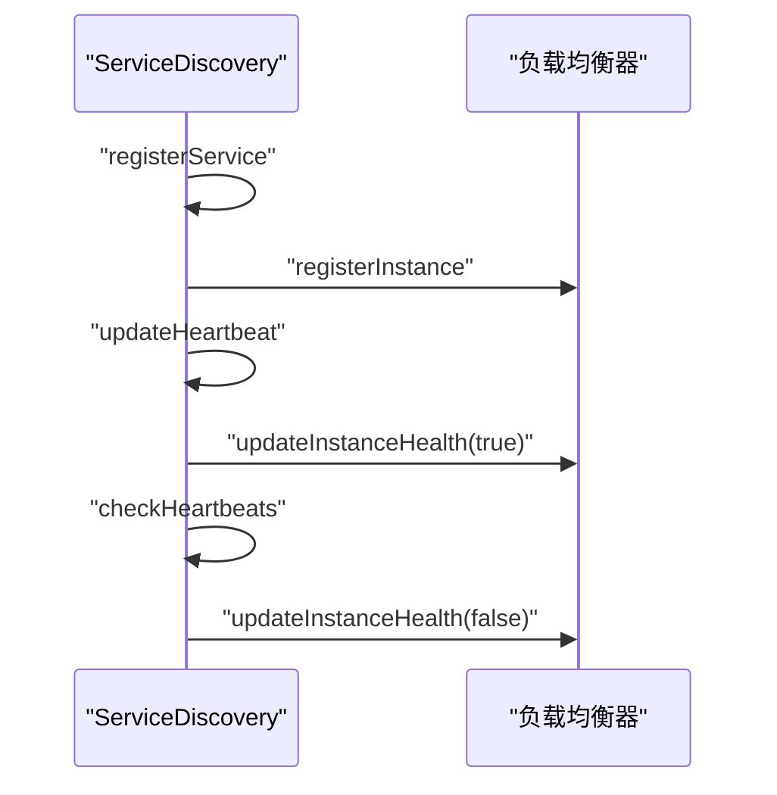

图表来源
- [serviceDiscovery.ts](file://api-gateway/src/discovery/serviceDiscovery.ts#L40-L120)
- [serviceDiscovery.ts](file://api-gateway/src/discovery/serviceDiscovery.ts#L126-L173)
- [serviceDiscovery.ts](file://api-gateway/src/discovery/serviceDiscovery.ts#L180-L268)

章节来源
- [serviceDiscovery.ts](file://api-gateway/src/discovery/serviceDiscovery.ts#L1-L120)
- [serviceDiscovery.ts](file://api-gateway/src/discovery/serviceDiscovery.ts#L120-L200)
- [serviceDiscovery.ts](file://api-gateway/src/discovery/serviceDiscovery.ts#L200-L268)

### 决策引擎（DecisionEngine）
- 强化学习策略网络：基于 JAX/Flax 的策略网络，输出动作概率与价值估计。
- 决策流程：提取状态特征、选择动作、生成参数、计算预期奖励。
- 规则回退：当策略网络不可用时，基于规则生成安全决策。
- 参数生成：根据目标生成光谱、温度、湿度、营养液等参数调整。
- 性能指标：平均奖励、决策次数与近期成功率。

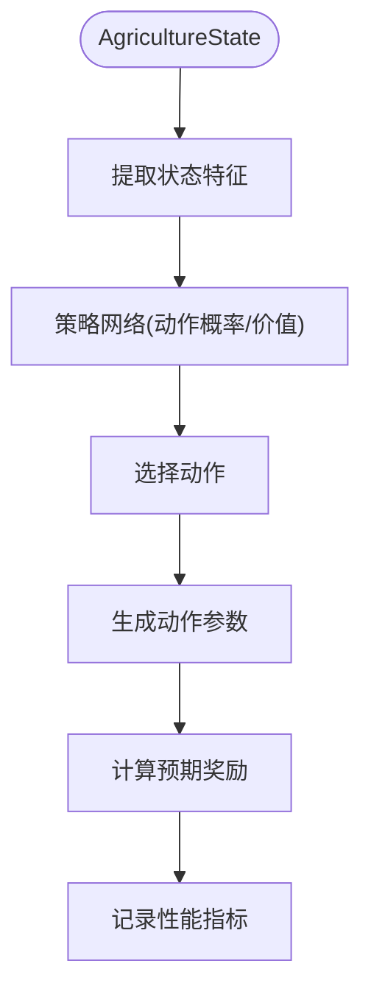

图表来源
- [decision_engine.py](file://decision-service/src/core/decision_engine.py#L99-L153)
- [decision_engine.py](file://decision-service/src/core/decision_engine.py#L154-L224)
- [decision_engine.py](file://decision-service/src/core/decision_engine.py#L225-L316)
- [decision_engine.py](file://decision-service/src/core/decision_engine.py#L317-L397)

章节来源
- [decision_engine.py](file://decision-service/src/core/decision_engine.py#L1-L120)
- [decision_engine.py](file://decision-service/src/core/decision_engine.py#L120-L240)
- [decision_engine.py](file://decision-service/src/core/decision_engine.py#L240-L360)
- [decision_engine.py](file://decision-service/src/core/decision_engine.py#L360-L397)

## 依赖关系分析
- 边缘管理器依赖 WebAssemblyRuntime 与 FederatedLearning，用于模型部署与联邦学习协调。
- 部署策略与边缘集成共同驱动任务到边缘的落地，EdgeIntegrationManager 依赖 EdgeDeploymentStrategy、模型轻量化与资源优化组件。
- 设备发现服务为边缘节点接入提供基础，EdgeManager 通过心跳与状态同步维持节点健康。
- API 网关服务发现负责服务注册与心跳，EdgeIntegrationManager 通过服务发现与负载均衡器对接。
- 决策引擎为边缘任务提供目标与参数建议，EdgeIntegrationManager 将其纳入整体流程。

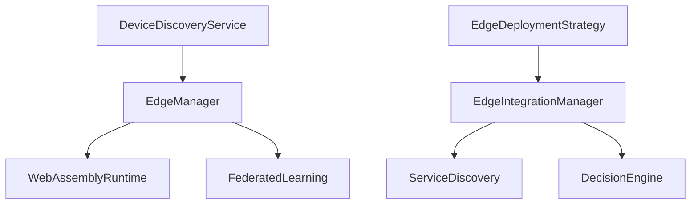

图表来源
- [edge_manager.py](file://backend/src/edge/edge_manager.py#L1-L120)
- [webassembly_runtime.py](file://backend/src/edge/webassembly_runtime.py#L1-L80)
- [federated_learning.py](file://backend/src/edge/federated_learning.py#L1-L120)
- [device_discovery_service.py](file://backend/src/core/services/device_discovery_service.py#L1-L120)
- [deployment_strategy.py](file://backend/src/edge_computing/deployment_strategy.py#L1-L120)
- [edge_integration.py](file://backend/src/integration/edge_integration.py#L1-L120)
- [serviceDiscovery.ts](file://api-gateway/src/discovery/serviceDiscovery.ts#L1-L120)
- [decision_engine.py](file://decision-service/src/core/decision_engine.py#L1-L120)

章节来源
- [edge_manager.py](file://backend/src/edge/edge_manager.py#L1-L120)
- [deployment_strategy.py](file://backend/src/edge_computing/deployment_strategy.py#L1-L120)
- [edge_integration.py](file://backend/src/integration/edge_integration.py#L1-L120)
- [serviceDiscovery.ts](file://api-gateway/src/discovery/serviceDiscovery.ts#L1-L120)
- [decision_engine.py](file://decision-service/src/core/decision_engine.py#L1-L120)

## 性能考量
- 心跳与超时：合理的 heartbeat_interval 与 heartbeat_timeout 可平衡延迟与误判；过短可能导致频繁切换状态，过长可能延迟故障感知。
- WASM 运行时：内存与栈大小限制应与模型大小匹配，避免频繁重启；SIMD/线程支持可提升推理性能。
- 联邦学习：客户端选择需考虑在线稳定性与数据规模权重，避免弱节点拖累全局进度。
- 负载均衡：节点评分综合考虑状态、计算能力、网络延迟与当前负载，避免热点节点过载。
- 部署策略：根据模型大小、延迟与成本预算选择合适策略，混合/自适应策略在不同场景下更具弹性。
- 监控与指标：指数移动平均的推理时间与失败计数有助于快速定位性能瓶颈。

[本节为通用指导，无需列出具体文件来源]

## 故障排查指南
- 节点离线/错误状态：检查心跳超时阈值与监控间隔，确认节点是否持续发送心跳；查看节点 last_heartbeat 与状态变更日志。
- 推理失败：确认 WASM 文件路径与运行时初始化是否成功；检查输入序列化与 stdout 读取流程；查看运行时关闭与清理逻辑。
- 联邦学习异常：核对轮次状态机、客户端在线状态与更新验证逻辑；检查聚合算法与通知流程。
- 部署计划失败：验证可行性检查、环境准备与分层部署步骤；关注资源需求与成本估算是否合理。
- 服务发现异常：检查心跳超时与健康状态更新；确认预注册服务与实例 ID 生成逻辑。

章节来源
- [edge_manager.py](file://backend/src/edge/edge_manager.py#L251-L313)
- [webassembly_runtime.py](file://backend/src/edge/webassembly_runtime.py#L38-L110)
- [federated_learning.py](file://backend/src/edge/federated_learning.py#L150-L245)
- [deployment_strategy.py](file://backend/src/edge_computing/deployment_strategy.py#L204-L275)
- [serviceDiscovery.ts](file://api-gateway/src/discovery/serviceDiscovery.ts#L126-L173)

## 结论
该边缘节点管理体系以 EdgeManager 为核心，结合设备发现、WASM 运行时、联邦学习与部署策略，形成从发现、注册、部署到健康监控与故障恢复的完整闭环。通过 EdgeIntegrationManager 将边缘能力与决策引擎集成，实现了面向任务的自动化与智能化决策。API 网关的服务发现与负载均衡进一步保障了边缘节点的可发现性与高可用性。配置管理（EdgeConfig）提供了灵活的参数化能力，便于在不同环境中快速适配。

[本节为总结性内容，无需列出具体文件来源]

## 附录
- 扩展自定义节点管理逻辑建议：
  - 在 EdgeManager 中新增节点状态枚举与评分维度，结合业务场景扩展负载均衡评分函数。
  - 在 EdgeDeploymentStrategy 中新增部署策略与节点评分因子，支持滚动更新、蓝绿部署等模式。
  - 在 EdgeIntegrationManager 中扩展任务适配性分析规则，引入更多业务约束与成本模型。
  - 在 ServiceDiscovery 中扩展心跳检测策略与健康阈值，支持更细粒度的服务健康度量。

[本节为概念性内容，无需列出具体文件来源]