# 边缘计算

<cite>
**本文档引用的文件**   
- [edge_manager.py](file://backend/src/edge/edge_manager.py)
- [webassembly_runtime.py](file://backend/src/edge/webassembly_runtime.py)
- [federated_learning.py](file://backend/src/edge/federated_learning.py)
- [cloud_edge_sync.py](file://backend/src/edge_computing/cloud_edge_sync.py)
- [model_lightweight.py](file://backend/src/edge_computing/model_lightweight.py)
- [deployment_strategy.py](file://backend/src/edge_computing/deployment_strategy.py)
- [resource_optimizer.py](file://backend/src/edge_computing/resource_optimizer.py)
- [edge_integration.py](file://backend/src/integration/edge_integration.py)
- [edge.py](file://backend/src/api/routes/edge.py)
</cite>

## 目录
1. [引言](#引言)
2. [边缘节点管理](#边缘节点管理)
3. [WebAssembly运行时](#webassembly运行时)
4. [联邦学习机制](#联邦学习机制)
5. [云边协同策略](#云边协同策略)
6. [部署与优化策略](#部署与优化策略)
7. [开发者技术指南](#开发者技术指南)
8. [API接口说明](#api接口说明)
9. [系统架构图](#系统架构图)

## 引言
本文档系统性地描述了边缘计算架构，涵盖边缘节点管理、WebAssembly运行时、联邦学习机制与云边协同策略。通过分析核心组件的实现原理，为边缘开发者提供节点部署、模型轻量化与性能优化的技术指南。

## 边缘节点管理
`edge_manager.py` 是边缘计算的核心管理模块，负责发现、注册和控制边缘设备。它通过心跳机制监控节点状态，并提供负载均衡功能。

### 节点注册与状态管理
边缘节点通过 `register_edge_node` 方法向管理器注册，管理器会维护节点的ID、地址、能力集和状态。节点状态包括离线、空闲、繁忙和错误四种。

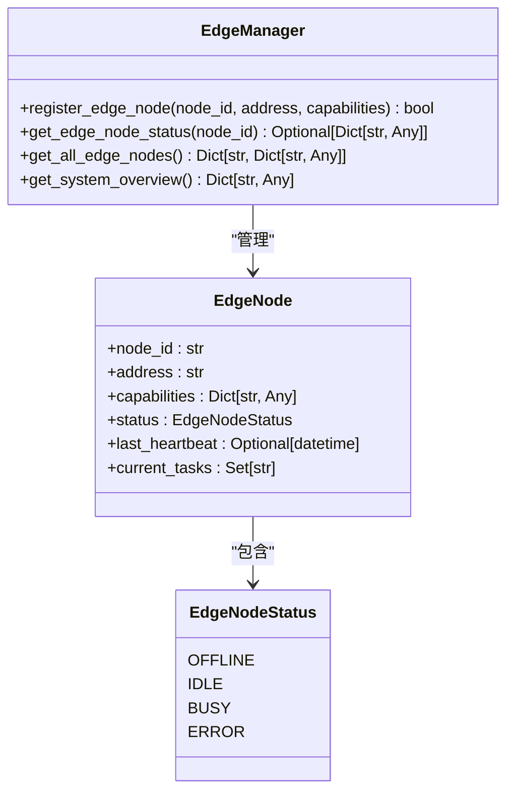

**Diagram sources**
- [edge_manager.py](file://backend/src/edge/edge_manager.py#L19-L39)

**Section sources**
- [edge_manager.py](file://backend/src/edge/edge_manager.py#L1-L440)

### 负载均衡策略
`EdgeLoadBalancer` 类实现了基于评分的负载均衡算法，综合考虑节点状态、计算能力、网络延迟和当前负载等因素，选择最优的边缘节点执行任务。

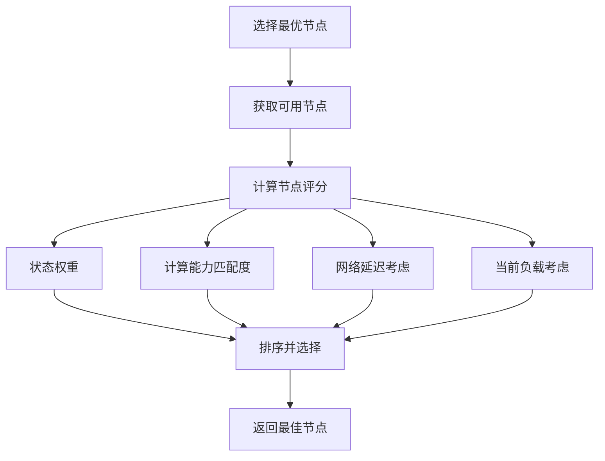

**Diagram sources**
- [edge_manager.py](file://backend/src/edge/edge_manager.py#L380-L440)

## WebAssembly运行时
`webassembly_runtime.py` 模块提供了在边缘节点上执行轻量级模型推理的WebAssembly运行时环境。

### WASM模型配置
通过 `WASMModelConfig` 数据类定义WASM模型的配置参数，包括内存限制、堆栈大小和SIMD/线程支持等。

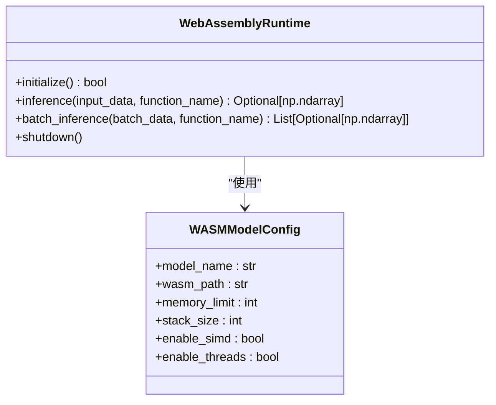

**Diagram sources**
- [webassembly_runtime.py](file://backend/src/edge/webassembly_runtime.py#L20-L30)

### 推理执行流程
WASM运行时通过 `wasmtime` 工具启动WASM进程，将输入数据序列化后发送给WASM模块执行推理，并接收和解析输出结果。

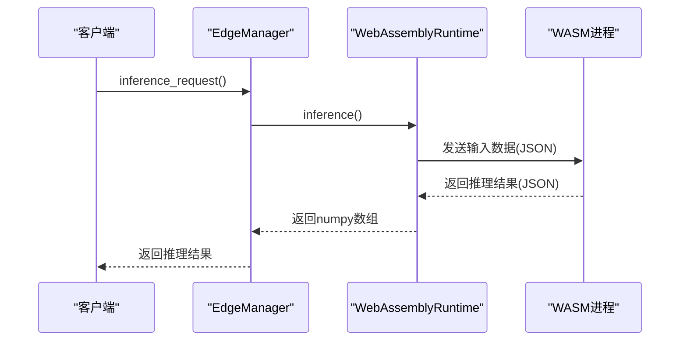

**Diagram sources**
- [webassembly_runtime.py](file://backend/src/edge/webassembly_runtime.py#L75-L113)

**Section sources**
- [webassembly_runtime.py](file://backend/src/edge/webassembly_runtime.py#L1-L210)

## 联邦学习机制
`federated_learning.py` 实现了分布式训练流程与参数聚合机制，支持去中心化的模型训练。

### 联邦学习状态机
联邦学习协调器通过状态机管理训练轮次，包括初始化、训练、聚合和完成等状态。

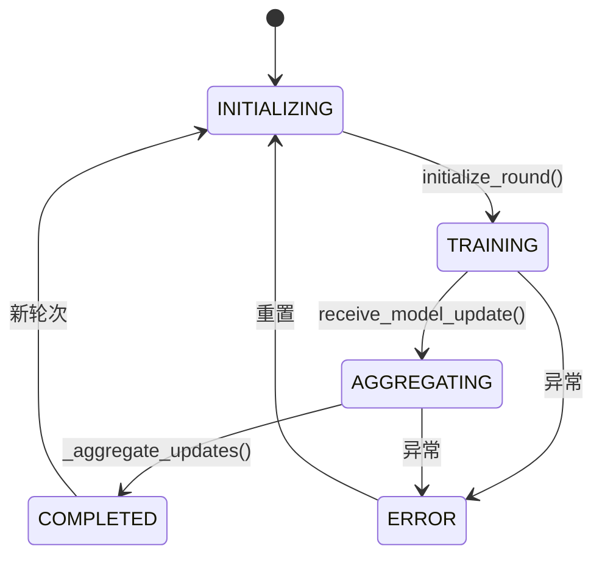

**Diagram sources**
- [federated_learning.py](file://backend/src/edge/federated_learning.py#L23-L29)

### 参数聚合算法
采用联邦平均算法（FedAvg）对客户端的模型更新进行加权平均，权重为各客户端的数据规模占比。

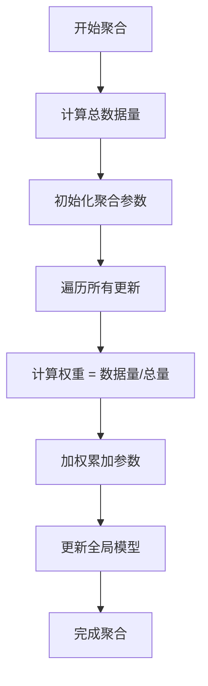

**Diagram sources**
- [federated_learning.py](file://backend/src/edge/federated_learning.py#L197-L239)

**Section sources**
- [federated_learning.py](file://backend/src/edge/federated_learning.py#L1-L363)

## 云边协同策略
`cloud_edge_sync.py` 模块负责保证云边数据一致性与低延迟通信，实现双向同步机制。

### 同步任务管理
通过任务队列和工作器模式处理同步任务，支持数据、模型和配置的同步。

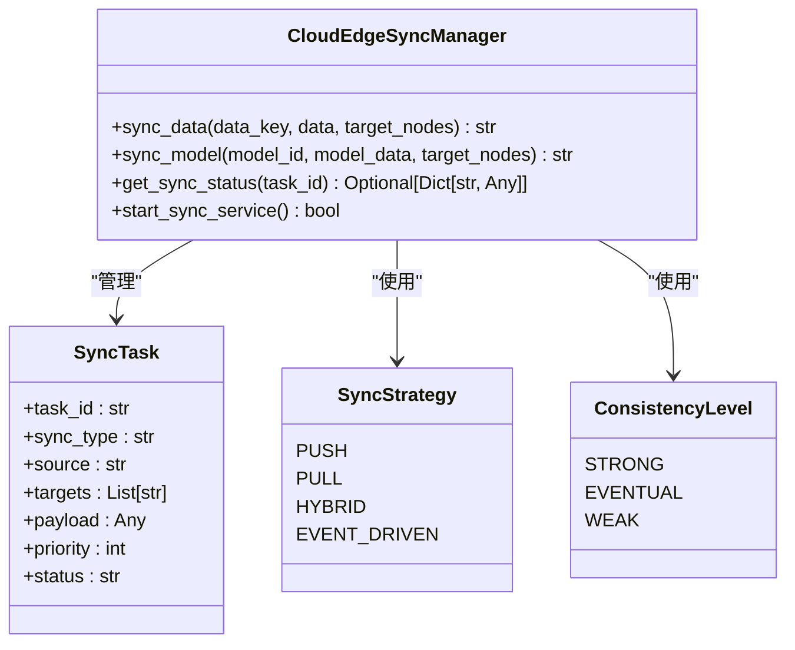

**Diagram sources**
- [cloud_edge_sync.py](file://backend/src/edge_computing/cloud_edge_sync.py#L20-L33)

### 数据本地化保护
实现数据本地化审计机制，确保敏感数据仅在允许的地理区域内存储和处理。

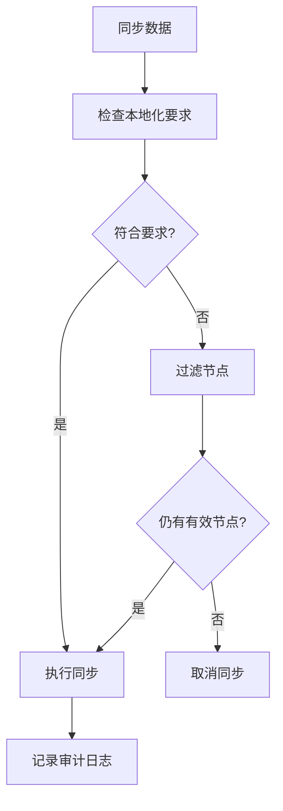

**Diagram sources**
- [cloud_edge_sync.py](file://backend/src/edge_computing/cloud_edge_sync.py#L224-L242)

**Section sources**
- [cloud_edge_sync.py](file://backend/src/edge_computing/cloud_edge_sync.py#L1-L701)

## 部署与优化策略
边缘计算系统提供了一系列部署与优化策略，确保资源的高效利用。

### 模型轻量化处理
`model_lightweight.py` 模块支持多种模型压缩技术，包括量化、剪枝和知识蒸馏。

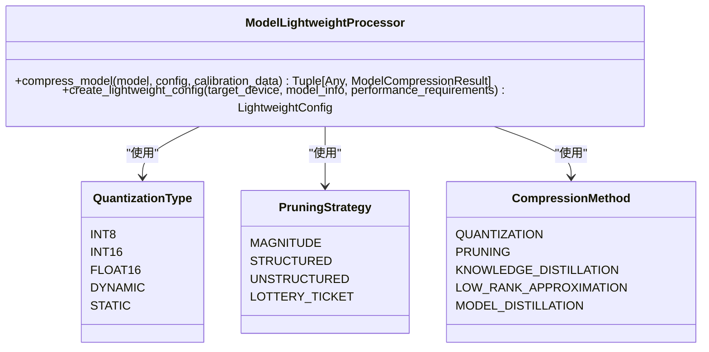

**Diagram sources**
- [model_lightweight.py](file://backend/src/edge_computing/model_lightweight.py#L24-L48)

### 资源优化调度
`resource_optimizer.py` 实现了自适应的资源分配策略，根据性能、成本和能效目标进行优化。

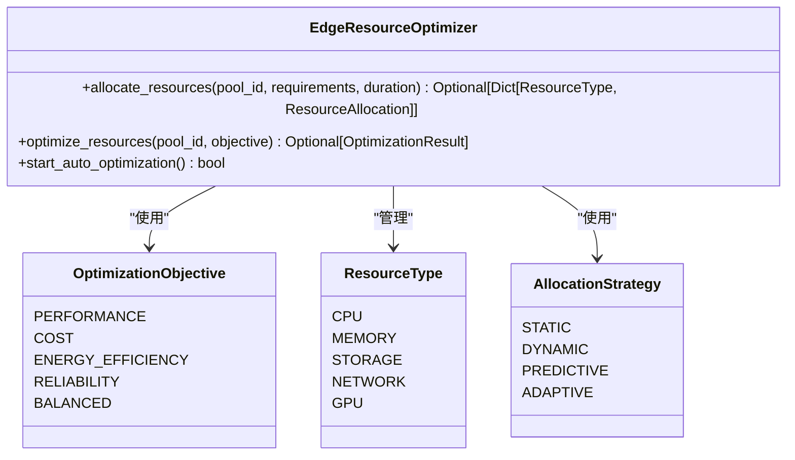

**Diagram sources**
- [resource_optimizer.py](file://backend/src/edge_computing/resource_optimizer.py#L20-L44)

**Section sources**
- [model_lightweight.py](file://backend/src/edge_computing/model_lightweight.py#L1-L800)
- [deployment_strategy.py](file://backend/src/edge_computing/deployment_strategy.py#L1-L550)
- [resource_optimizer.py](file://backend/src/edge_computing/resource_optimizer.py#L1-L800)

## 开发者技术指南
为边缘开发者提供节点部署、模型轻量化与性能优化的技术指南。

### 节点部署流程
1. 启动边缘节点并注册到管理器
2. 部署WASM模型到边缘节点
3. 通过API接口执行推理任务
4. 监控节点状态和性能指标

### 模型轻量化最佳实践
- 根据目标设备选择合适的量化类型（INT8用于高性能设备，FLOAT16用于高精度要求）
- 对CNN模型采用结构化剪枝，对Transformer模型采用非结构化剪枝
- 对复杂模型启用知识蒸馏以保持准确率
- 根据设备能力和性能要求确定压缩级别

### 性能优化建议
- 使用自适应资源优化策略，根据实时负载动态调整资源分配
- 启用自动优化任务，定期执行资源优化
- 监控性能指标，及时发现和解决性能瓶颈
- 利用预测性优化，根据历史数据预测资源需求

**Section sources**
- [deployment_strategy.py](file://backend/src/edge_computing/deployment_strategy.py#L71-L550)
- [resource_optimizer.py](file://backend/src/edge_computing/resource_optimizer.py#L73-L800)

## API接口说明
系统提供RESTful API接口，方便开发者集成边缘计算能力。

### 边缘计算API
`edge.py` 路由提供了边缘节点管理、模型部署和推理执行的API接口。

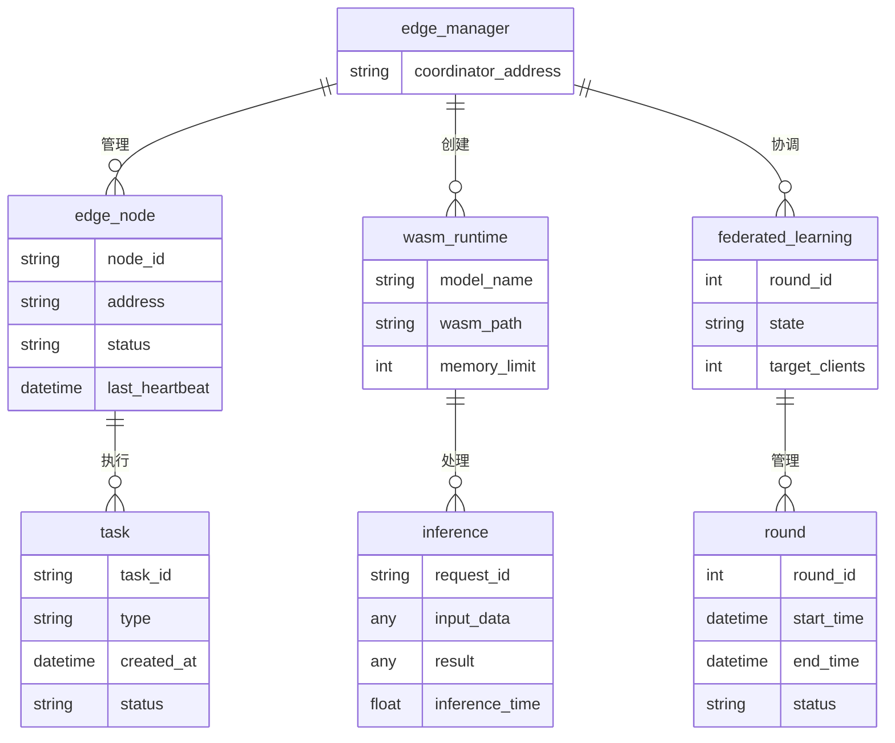

**Diagram sources**
- [edge.py](file://backend/src/api/routes/edge.py#L102-L432)

### 联邦学习API
`federated.py` 路由提供了联邦学习相关的API接口，支持客户端注册、训练轮次管理和模型更新提交。

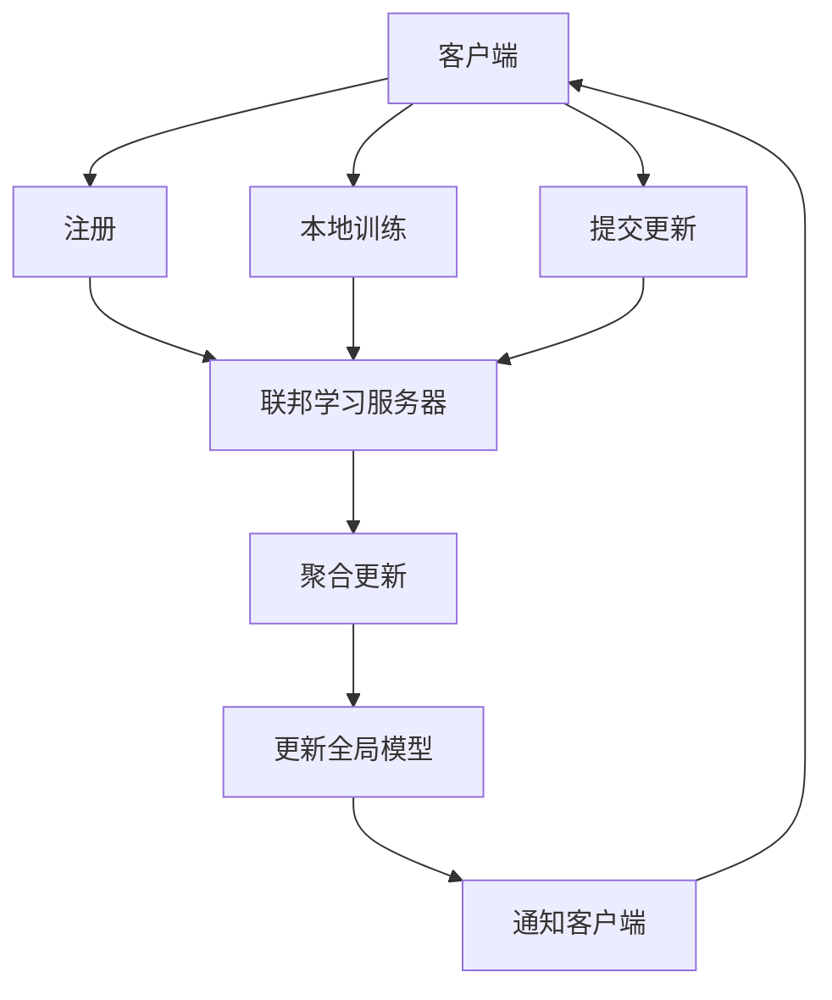

**Diagram sources**
- [federated.py](file://backend/src/api/routes/federated.py#L13-L264)

**Section sources**
- [edge.py](file://backend/src/api/routes/edge.py#L1-L432)
- [federated.py](file://backend/src/api/routes/federated.py#L1-L264)

## 系统架构图
展示边缘计算系统的整体架构和组件关系。

```mermaid
graph TD
subgraph "云端"
CloudSync[云边协同管理器]
CloudModel[模型仓库]
CloudFL[联邦学习协调器]
end
subgraph "边缘层"
EdgeManager[边缘管理器]
EdgeLoadBalancer[负载均衡器]
EdgeNode1[边缘节点1]
EdgeNode2[边缘节点2]
EdgeNodeN[边缘节点N]
end
subgraph "终端设备"
Device1[终端设备1]
Device2[终端设备2]
DeviceN[终端设备N]
end
CloudSync --> EdgeManager : "同步模型/数据"
CloudModel --> CloudSync : "提供模型"
CloudFL --> EdgeManager : "协调训练"
EdgeManager --> EdgeLoadBalancer : "委托负载均衡"
EdgeManager --> EdgeNode1 : "部署/控制"
EdgeManager --> EdgeNode2 : "部署/控制"
EdgeManager --> EdgeNodeN : "部署/控制"
EdgeNode1 --> Device1 : "本地推理"
EdgeNode2 --> Device2 : "本地推理"
EdgeNodeN --> DeviceN : "本地推理"
Device1 --> EdgeNode1 : "上传数据"
Device2 --> EdgeNode2 : "上传数据"
DeviceN --> EdgeNodeN : "上传数据"
```

**Diagram sources**
- [edge_manager.py](file://backend/src/edge/edge_manager.py#L40-L58)
- [cloud_edge_sync.py](file://backend/src/edge_computing/cloud_edge_sync.py#L68-L95)
- [federated_learning.py](file://backend/src/edge/federated_learning.py#L60-L67)

**Section sources**
- [edge_integration.py](file://backend/src/integration/edge_integration.py#L17-L299)