# Kubernetes编排

<cite>
**本文档中引用的文件**  
- [namespace.yaml](file://infrastructure/kubernetes/namespace.yaml)
- [frontend-deployment.yaml](file://infrastructure/kubernetes/frontend-deployment.yaml)
- [backend-deployment.yaml](file://infrastructure/kubernetes/backend-deployment.yaml)
- [database-deployment.yaml](file://infrastructure/kubernetes/database-deployment.yaml)
- [redis-deployment.yaml](file://infrastructure/kubernetes/redis-deployment.yaml)
- [deployment_instructions.md](file://deployment_instructions.md)
- [docker-compose.yml](file://docker-compose.yml)
- [prometheus.yml](file://infrastructure/prometheus.yml)
- [datasource.yml](file://infrastructure/grafana/provisioning/datasources/datasource.yml)
- [dashboard.yml](file://infrastructure/grafana/provisioning/dashboards/dashboard.yml)
</cite>

## 目录
1. [简介](#简介)
2. [命名空间隔离策略](#命名空间隔离策略)
3. [前端服务部署配置](#前端服务部署配置)
4. [后端服务部署配置](#后端服务部署配置)
5. [数据库服务部署配置](#数据库服务部署配置)
6. [Redis缓存服务部署配置](#redis缓存服务部署配置)
7. [服务发现与负载均衡](#服务发现与负载均衡)
8. [就绪与存活探针配置](#就绪与存活探针配置)
9. [资源请求与限制策略](#资源请求与限制策略)
10. [Ingress控制器配置](#ingress控制器配置)
11. [Helm Chart集成建议](#helm-chart集成建议)
12. [滚动更新与故障恢复机制](#滚动更新与故障恢复机制)
13. [安全上下文设置](#安全上下文设置)
14. [监控与告警系统](#监控与告警系统)
15. [部署验证与测试](#部署验证与测试)

## 简介
本文档详细描述了AI平台在Kubernetes环境下的部署架构与配置策略。系统包含前端、后端、PostgreSQL数据库和Redis缓存四个核心组件，所有资源均部署在独立的命名空间中以实现环境隔离。文档涵盖了从命名空间创建到服务暴露的完整部署流程，并提供了Helm集成、滚动更新、监控告警等生产级运维建议。

## 命名空间隔离策略
AI平台使用专用的Kubernetes命名空间`ai-platform`来实现资源隔离和环境管理。该命名空间通过标签标识其用途和环境属性，确保资源组织的清晰性和可管理性。

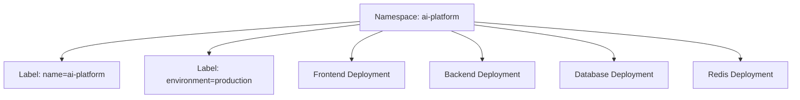

**图示来源**  
- [namespace.yaml](file://infrastructure/kubernetes/namespace.yaml#L1-L7)

## 前端服务部署配置
前端服务采用Deployment方式部署，配置了副本集、资源限制、健康检查探针和环境变量。通过Service以ClusterIP类型暴露服务，并通过Ingress规则对外提供HTTPS访问。

**前端部署关键配置：**
- **副本数**：2个Pod实例，确保高可用性
- **镜像**：`ai-platform-frontend:latest`
- **端口**：容器端口80
- **环境变量**：`VITE_API_BASE_URL`指向后端服务
- **服务类型**：ClusterIP内部服务
- **外部访问**：通过Ingress控制器暴露域名`ai-platform.example.com`

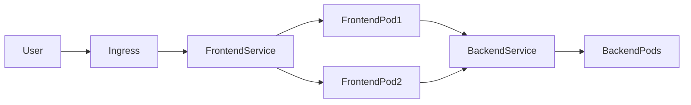

**图示来源**  
- [frontend-deployment.yaml](file://infrastructure/kubernetes/frontend-deployment.yaml#L1-L93)

## 后端服务部署配置
后端服务是系统的核心业务逻辑处理单元，配置了更高的资源需求和持久化存储。通过环境变量和Secret管理敏感配置，确保安全性。

**后端部署关键配置：**
- **副本数**：3个Pod实例，提高服务可用性
- **镜像**：`ai-platform-backend:latest`
- **端口**：容器端口8000
- **环境变量**：通过Secret引用数据库连接信息
- **存储卷**：使用PVC挂载数据卷`/app/data`，emptyDir挂载日志卷`/app/logs`
- **服务发现**：服务名为`ai-platform-backend`，供前端和内部组件调用

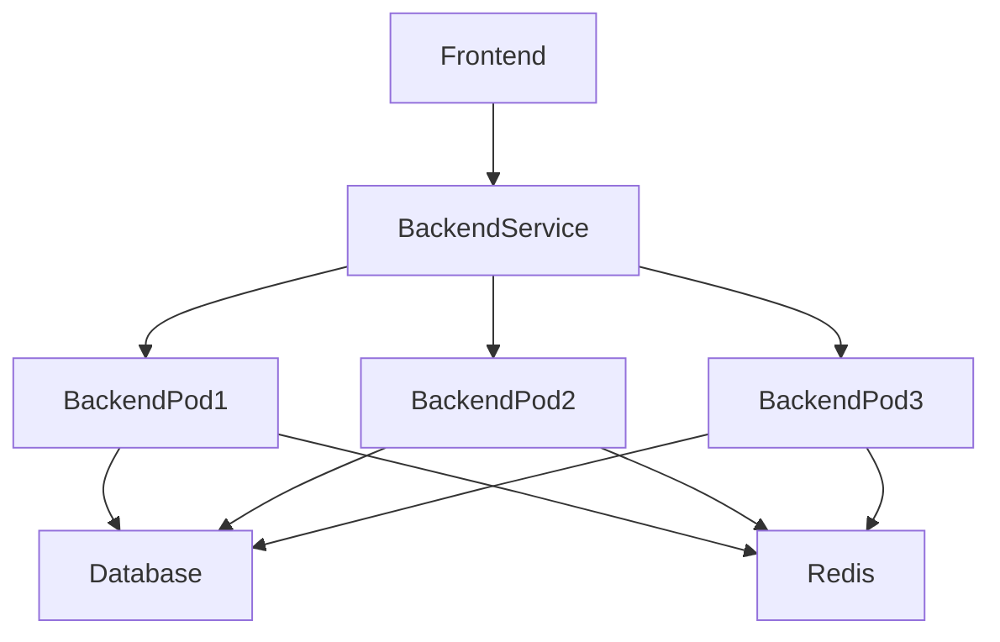

**图示来源**  
- [backend-deployment.yaml](file://infrastructure/kubernetes/backend-deployment.yaml#L1-L86)

## 数据库服务部署配置
PostgreSQL数据库作为系统的持久化存储，采用单实例部署模式（生产环境建议主从架构），配置了持久化存储卷和资源限制。

**数据库部署关键配置：**
- **副本数**：1个Pod实例（生产环境应考虑高可用架构）
- **镜像**：`postgres:15-alpine`
- **端口**：容器端口5432
- **环境变量**：数据库名、用户名和密码通过Secret管理
- **持久化存储**：使用`postgres-data-pvc`持久卷声明，存储容量10Gi
- **初始化脚本**：通过`init.sql`文件在启动时初始化数据库结构

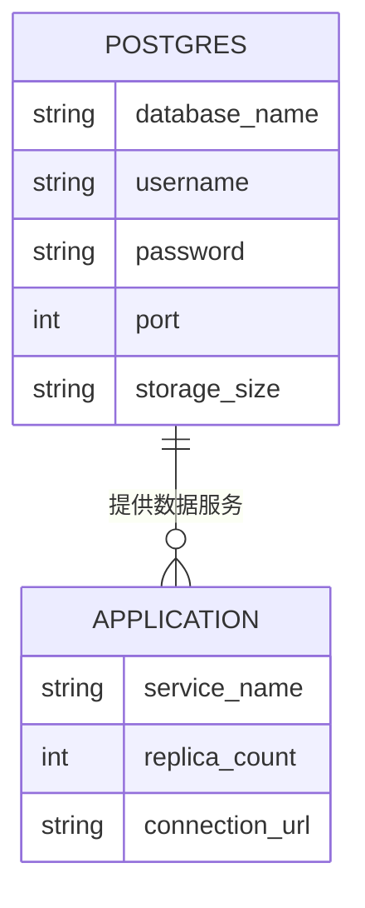

**图示来源**  
- [database-deployment.yaml](file://infrastructure/kubernetes/database-deployment.yaml#L1-L97)

## Redis缓存服务部署配置
Redis作为系统的缓存和会话存储组件，配置了持久化存储和密码认证，确保数据安全和可靠性。

**Redis部署关键配置：**
- **副本数**：1个Pod实例
- **镜像**：`redis:7-alpine`
- **端口**：容器端口6379
- **启动命令**：启用AOF持久化（appendonly yes）和密码认证
- **密码管理**：通过Secret注入`REDIS_PASSWORD`
- **持久化存储**：使用`redis-data-pvc`持久卷声明，存储容量5Gi

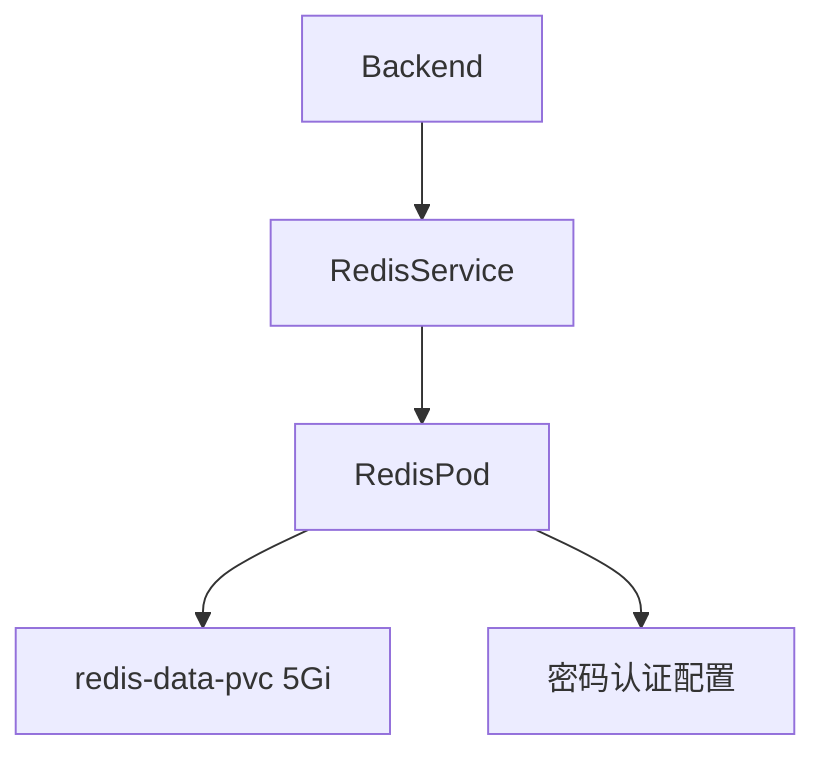

**图示来源**  
- [redis-deployment.yaml](file://infrastructure/kubernetes/redis-deployment.yaml#L1-L98)

## 服务发现与负载均衡
系统通过Kubernetes原生的服务发现机制实现组件间的通信。每个服务通过标签选择器关联对应的Pod，并通过Service提供稳定的网络端点。

**服务发现配置细节：**
- **标签选择器**：所有组件使用`app: ai-platform`和`component: [frontend/backend/database/redis]`标签
- **内部通信**：
  - 前端通过`http://ai-platform-backend:8000`访问后端API
  - 后端通过`redis://ai-platform-redis:6379`连接Redis
  - 后端通过Secret中的数据库URL连接PostgreSQL
- **外部访问**：通过Ingress控制器将外部请求路由到前端服务

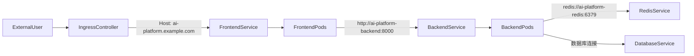

**图示来源**  
- [frontend-deployment.yaml](file://infrastructure/kubernetes/frontend-deployment.yaml#L50-L93)
- [backend-deployment.yaml](file://infrastructure/kubernetes/backend-deployment.yaml#L70-L86)

## 就绪与存活探针配置
所有服务均配置了就绪探针（readinessProbe）和存活探针（livenessProbe），确保Kubernetes能够正确管理Pod的生命周期。

**探针配置策略：**
- **前端服务**：
  - 存活探针：HTTP GET `/health`，初始延迟30秒，周期10秒
  - 就绪探针：HTTP GET `/health`，初始延迟5秒，周期5秒
- **后端服务**：
  - 存活探针：HTTP GET `/health`，初始延迟30秒，周期10秒
  - 就绪探针：HTTP GET `/health`，初始延迟5秒，周期5秒
- **数据库服务**：
  - 存活探针：执行`pg_isready`命令检查数据库状态
  - 就绪探针：执行`pg_isready`命令检查数据库状态
- **Redis服务**：
  - 存活探针：执行`redis-cli ping`命令检查Redis状态
  - 就绪探针：执行`redis-cli ping`命令检查Redis状态

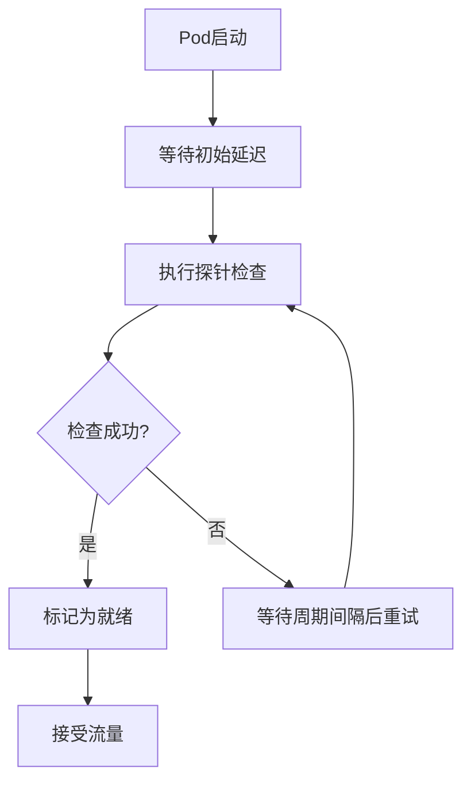

**图示来源**  
- [frontend-deployment.yaml](file://infrastructure/kubernetes/frontend-deployment.yaml#L36-L47)
- [backend-deployment.yaml](file://infrastructure/kubernetes/backend-deployment.yaml#L45-L56)
- [database-deployment.yaml](file://infrastructure/kubernetes/database-deployment.yaml#L49-L64)
- [redis-deployment.yaml](file://infrastructure/kubernetes/redis-deployment.yaml#L48-L65)

## 资源请求与限制策略
系统为每个组件配置了合理的资源请求和限制，确保资源的公平分配和系统的稳定性。

**资源配置详情：**
| 组件 | CPU请求 | CPU限制 | 内存请求 | 内存限制 |
|------|---------|---------|----------|----------|
| 前端 | 100m | 250m | 256Mi | 512Mi |
| 后端 | 250m | 500m | 512Mi | 1Gi |
| 数据库 | 500m | 1 | 1Gi | 2Gi |
| Redis | 100m | 250m | 256Mi | 512Mi |

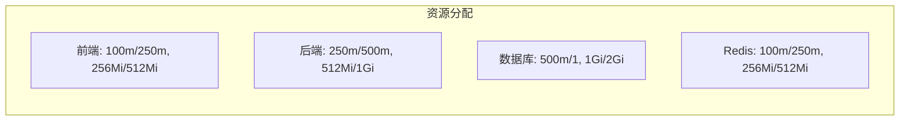

**图示来源**  
- [frontend-deployment.yaml](file://infrastructure/kubernetes/frontend-deployment.yaml#L30-L35)
- [backend-deployment.yaml](file://infrastructure/kubernetes/backend-deployment.yaml#L39-L44)
- [database-deployment.yaml](file://infrastructure/kubernetes/database-deployment.yaml#L40-L45)
- [redis-deployment.yaml](file://infrastructure/kubernetes/redis-deployment.yaml#L39-L44)

## Ingress控制器配置
系统通过Ingress资源定义外部访问规则，使用Nginx Ingress控制器实现HTTPS路由和负载均衡。

**Ingress配置要点：**
- **主机名**：`ai-platform.example.com`
- **TLS配置**：使用`ai-platform-tls` Secret，由`letsencrypt-prod`签发
- **路径路由**：根路径`/`转发到前端服务
- **注解配置**：
  - `kubernetes.io/ingress.class: nginx`：指定Ingress控制器
  - `nginx.ingress.kubernetes.io/rewrite-target: /`：URL重写规则
  - `nginx.ingress.kubernetes.io/ssl-redirect: "true"`：强制HTTPS重定向
  - `cert-manager.io/cluster-issuer: letsencrypt-prod`：证书签发者

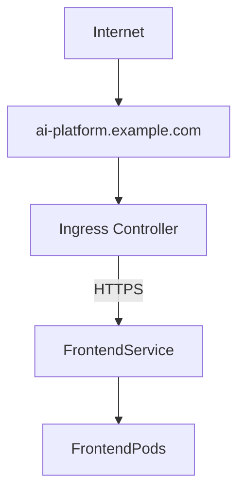

**图示来源**  
- [frontend-deployment.yaml](file://infrastructure/kubernetes/frontend-deployment.yaml#L68-L93)

## Helm Chart集成建议
为提高部署的可重复性和可管理性，建议将当前的YAML配置转换为Helm Chart。以下是具体的集成建议：

**Helm Chart结构建议：**
```
ai-platform/
├── Chart.yaml
├── values.yaml
├── templates/
│   ├── namespace.yaml
│   ├── frontend-deployment.yaml
│   ├── backend-deployment.yaml
│   ├── database-deployment.yaml
│   ├── redis-deployment.yaml
│   ├── service.yaml
│   └── ingress.yaml
└── charts/
```

**values.yaml配置示例：**
```yaml
frontend:
  replicaCount: 2
  image: ai-platform-frontend:latest
  resources:
    requests:
      memory: "256Mi"
      cpu: "100m"
    limits:
      memory: "512Mi"
      cpu: "250m"

backend:
  replicaCount: 3
  image: ai-platform-backend:latest
  resources:
    requests:
      memory: "512Mi"
      cpu: "250m"
    limits:
      memory: "1Gi"
      cpu: "500m"
```

**部署命令：**
```bash
helm install ai-platform ./ai-platform --namespace ai-platform --create-namespace
```

**图示来源**  
- [frontend-deployment.yaml](file://infrastructure/kubernetes/frontend-deployment.yaml)
- [backend-deployment.yaml](file://infrastructure/kubernetes/backend-deployment.yaml)
- [database-deployment.yaml](file://infrastructure/kubernetes/database-deployment.yaml)
- [redis-deployment.yaml](file://infrastructure/kubernetes/redis-deployment.yaml)

## 滚动更新与故障恢复机制
系统采用Kubernetes的滚动更新策略，确保服务更新时的高可用性。同时，通过健康检查和自动恢复机制保障系统稳定性。

**滚动更新配置：**
```yaml
spec:
  strategy:
    type: RollingUpdate
    rollingUpdate:
      maxUnavailable: 1
      maxSurge: 1
```

**故障恢复机制：**
- **自动重启**：容器崩溃时由Kubernetes自动重启
- **健康检查**：通过liveness和readiness探针检测服务状态
- **资源限制**：防止资源耗尽导致的节点不稳定
- **持久化存储**：关键数据通过PVC持久化，避免数据丢失

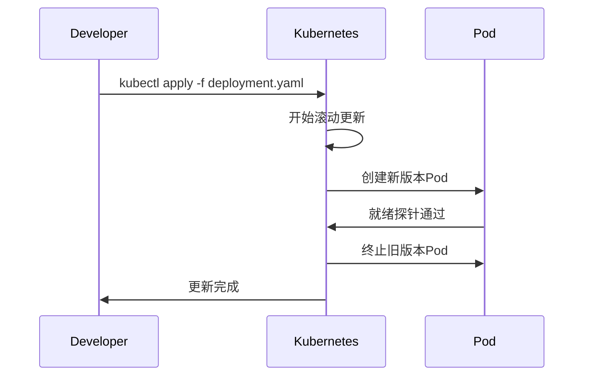

**图示来源**  
- [deployment_instructions.md](file://deployment_instructions.md#L26-L47)

## 安全上下文设置
系统通过多种安全机制保护组件的安全性，包括网络策略、Secret管理和安全上下文配置。

**安全配置建议：**
- **Secret管理**：数据库密码、Redis密码等敏感信息通过Kubernetes Secret管理
- **网络策略**：建议配置NetworkPolicy限制组件间的网络访问
- **安全上下文**：建议为Pod配置非root用户运行和只读根文件系统
- **镜像安全**：使用官方基础镜像并定期更新

**Secret使用示例：**
```yaml
env:
- name: DATABASE_URL
  valueFrom:
    secretKeyRef:
      name: ai-platform-secrets
      key: database-url
```

**图示来源**  
- [backend-deployment.yaml](file://infrastructure/kubernetes/backend-deployment.yaml#L32-L35)
- [database-deployment.yaml](file://infrastructure/kubernetes/database-deployment.yaml#L30-L38)
- [redis-deployment.yaml](file://infrastructure/kubernetes/redis-deployment.yaml#L34-L37)

## 监控与告警系统
系统集成了Prometheus和Grafana监控栈，实现全面的性能监控和可视化。

**监控配置：**
- **Prometheus**：配置了对前端、后端和自身的目标抓取
- **Grafana**：配置了数据源和仪表板自动发现
- **监控指标**：API响应时间、并发处理能力、资源使用率等

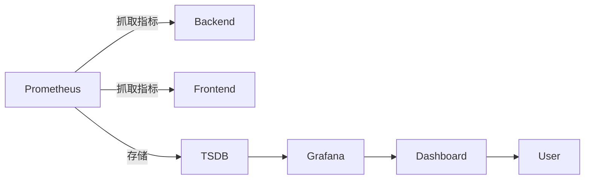

**图示来源**  
- [prometheus.yml](file://infrastructure/prometheus.yml#L1-L24)
- [datasource.yml](file://infrastructure/grafana/provisioning/datasources/datasource.yml#L1-L9)
- [dashboard.yml](file://infrastructure/grafana/provisioning/dashboards/dashboard.yml#L1-L11)

## 部署验证与测试
部署完成后，应进行完整的系统验证和测试，确保所有组件正常工作。

**验证步骤：**
1. **检查Pod状态**：
   ```bash
   kubectl get pods -n ai-platform
   ```
2. **检查服务状态**：
   ```bash
   kubectl get services -n ai-platform
   ```
3. **访问前端应用**：通过Ingress域名访问Web界面
4. **测试API连通性**：从前端Pod测试后端API可达性
5. **验证数据持久化**：重启数据库Pod验证数据是否保留

**常见问题排查：**
- **Pod无法启动**：检查镜像名称、Secret配置和存储卷
- **服务无法访问**：检查Service标签选择器和端口配置
- **健康检查失败**：验证探针路径和初始延迟设置
- **外部访问失败**：检查Ingress控制器和DNS配置

**图示来源**  
- [deployment_instructions.md](file://deployment_instructions.md#L40-L67)