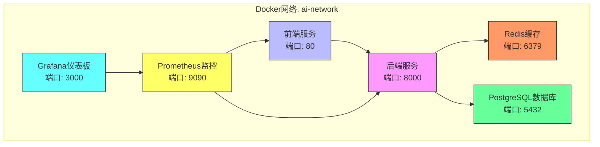
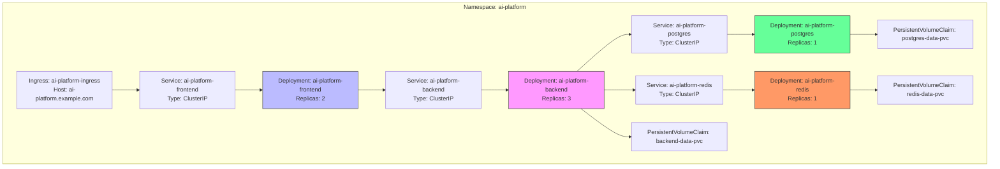
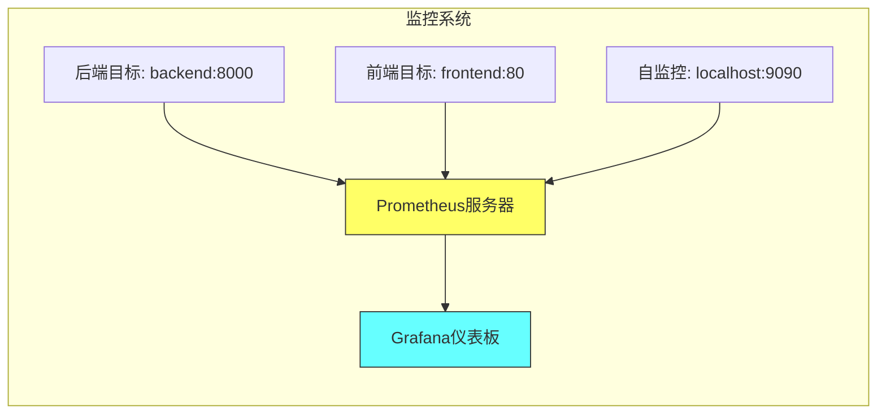

# 部署与运维

<cite>
**本文档中引用的文件**  
- [docker-compose.yml](file://docker-compose.yml)
- [infrastructure/docker-compose.yml](file://infrastructure/docker-compose.yml)
- [infrastructure/prometheus.yml](file://infrastructure/prometheus.yml)
- [infrastructure/grafana/provisioning/datasources/datasource.yml](file://infrastructure/grafana/provisioning/datasources/datasource.yml)
- [infrastructure/grafana/provisioning/dashboards/dashboard.yml](file://infrastructure/grafana/provisioning/dashboards/dashboard.yml)
- [infrastructure/grafana/provisioning/dashboards/ai-platform-dashboard.json](file://infrastructure/grafana/provisioning/dashboards/ai-platform-dashboard.json)
- [infrastructure/kubernetes/namespace.yaml](file://infrastructure/kubernetes/namespace.yaml)
- [infrastructure/kubernetes/backend-deployment.yaml](file://infrastructure/kubernetes/backend-deployment.yaml)
- [infrastructure/kubernetes/frontend-deployment.yaml](file://infrastructure/kubernetes/frontend-deployment.yaml)
- [infrastructure/kubernetes/database-deployment.yaml](file://infrastructure/kubernetes/database-deployment.yaml)
- [infrastructure/kubernetes/redis-deployment.yaml](file://infrastructure/kubernetes/redis-deployment.yaml)
- [backend/Dockerfile](file://backend/Dockerfile)
- [frontend/Dockerfile](file://frontend/Dockerfile)
- [decision-service/Dockerfile](file://decision-service/Dockerfile)
</cite>

## 目录
1. [简介](#简介)
2. [Docker容器化部署](#docker容器化部署)
3. [Kubernetes编排部署](#kubernetes编排部署)
4. [监控与告警系统](#监控与告警系统)
5. [日志管理](#日志管理)
6. [系统健康检查与性能基准测试](#系统健康检查与性能基准测试)
7. [故障恢复流程](#故障恢复流程)
8. [生产环境部署检查清单](#生产环境部署检查清单)
9. [日常维护指南](#日常维护指南)

## 简介
本手册为AI决策平台提供完整的部署与运维指导，涵盖从Docker容器化到Kubernetes集群编排的全流程。文档详细说明了各服务的配置参数、网络拓扑结构、监控告警机制以及日志管理策略。通过标准化的健康检查、性能测试和故障恢复流程，确保系统在生产环境中的高可用性和稳定性。运维团队可依据本手册执行部署、监控和维护操作。

## Docker容器化部署

本系统提供多套Docker Compose配置，支持本地开发和生产环境部署。主要服务包括后端API、前端界面、数据库、缓存及监控组件。

**图源**  
- [docker-compose.yml](file://docker-compose.yml#L3-L113)
- [infrastructure/docker-compose.yml](file://infrastructure/docker-compose.yml#L3-L123)

### 后端服务配置
后端服务基于Python 3.9构建，使用Uvicorn作为ASGI服务器。关键配置包括：
- 构建上下文：`./backend`
- 暴露端口：8000
- 环境变量：`ENVIRONMENT=production`, `LOG_LEVEL=INFO`
- 数据卷挂载：`./backend/data:/app/data`, `./backend/logs:/app/logs`
- 健康检查：通过`/health`端点进行HTTP检测

**节源**  
- [backend/Dockerfile](file://backend/Dockerfile#L1-L34)
- [docker-compose.yml](file://docker-compose.yml#L5-L25)

### 前端服务配置
前端服务采用多阶段Docker构建策略，优化生产环境镜像大小。关键配置包括：
- 构建上下文：`./frontend`
- 暴露端口：80（HTTP）
- 环境变量：`VITE_API_BASE_URL=http://localhost:8000`
- 依赖关系：等待后端服务健康后启动
- 构建过程：先使用Node镜像构建，再复制到Nginx镜像

**节源**  
- [frontend/Dockerfile](file://frontend/Dockerfile#L1-L32)
- [docker-compose.yml](file://docker-compose.yml#L28-L41)

### 数据库与缓存服务
系统包含PostgreSQL数据库和Redis缓存服务，配置要点如下：

**PostgreSQL配置**
- 镜像版本：`postgres:15-alpine`
- 环境变量：数据库名、用户名、密码
- 数据持久化：通过`postgres_data`卷实现
- 初始化脚本：`./backend/init.sql`在容器启动时执行

**Redis配置**
- 镜像版本：`redis:7-alpine`
- 持久化：启用AOF（Append Only File）
- 数据卷：`redis_data`用于数据持久化

**节源**  
- [docker-compose.yml](file://docker-compose.yml#L55-L70)
- [docker-compose.yml](file://docker-compose.yml#L43-L53)

## Kubernetes编排部署

Kubernetes部署文件位于`infrastructure/kubernetes/`目录下，采用命名空间隔离的部署策略。

**图源**  
- [infrastructure/kubernetes/namespace.yaml](file://infrastructure/kubernetes/namespace.yaml#L1-L7)
- [infrastructure/kubernetes/backend-deployment.yaml](file://infrastructure/kubernetes/backend-deployment.yaml#L1-L86)
- [infrastructure/kubernetes/frontend-deployment.yaml](file://infrastructure/kubernetes/frontend-deployment.yaml#L1-L93)
- [infrastructure/kubernetes/database-deployment.yaml](file://infrastructure/kubernetes/database-deployment.yaml#L1-L97)
- [infrastructure/kubernetes/redis-deployment.yaml](file://infrastructure/kubernetes/redis-deployment.yaml#L1-L98)

### 命名空间配置
系统使用独立的`ai-platform`命名空间进行资源隔离，便于管理和权限控制。

**节源**  
- [infrastructure/kubernetes/namespace.yaml](file://infrastructure/kubernetes/namespace.yaml#L1-L7)

### 后端部署配置
后端服务采用高可用部署模式，关键配置包括：
- 副本数：3个Pod实例
- 资源限制：内存512Mi-1Gi，CPU 250m-500m
- 环境变量：通过Secret引用数据库连接和密码
- 健康探针：存活探针和就绪探针均检查`/health`端点
- 存储：数据卷使用PVC，日志卷使用emptyDir

**节源**  
- [infrastructure/kubernetes/backend-deployment.yaml](file://infrastructure/kubernetes/backend-deployment.yaml#L1-L86)

### 前端部署配置
前端服务部署配置要点：
- 副本数：2个Pod实例
- 资源限制：内存256Mi-512Mi，CPU 100m-250m
- 环境变量：API基础URL指向后端服务
- Ingress配置：支持HTTPS访问，配置TLS证书

**节源**  
- [infrastructure/kubernetes/frontend-deployment.yaml](file://infrastructure/kubernetes/frontend-deployment.yaml#L1-L93)

### 数据库部署配置
数据库服务采用单实例部署（生产环境建议主从架构），配置包括：
- 副本数：1
- 存储：10Gi的PersistentVolumeClaim
- 安全：数据库凭证通过Secret管理
- 健康检查：使用pg_isready命令检测

**节源**  
- [infrastructure/kubernetes/database-deployment.yaml](file://infrastructure/kubernetes/database-deployment.yaml#L1-L97)

### Redis部署配置
Redis缓存服务配置：
- 副本数：1
- 存储：5Gi的PersistentVolumeClaim
- 安全：密码通过Secret管理
- 健康检查：使用redis-cli ping命令检测

**节源**  
- [infrastructure/kubernetes/redis-deployment.yaml](file://infrastructure/kubernetes/redis-deployment.yaml#L1-L98)

## 监控与告警系统

系统集成Prometheus和Grafana实现全面的监控和可视化。

**图源**  
- [infrastructure/prometheus.yml](file://infrastructure/prometheus.yml#L1-L24)
- [infrastructure/grafana/provisioning/datasources/datasource.yml](file://infrastructure/grafana/provisioning/datasources/datasource.yml#L1-L9)

### Prometheus配置
Prometheus配置文件定义了多个数据采集任务：

**采集配置**
- `ai-platform-backend`：采集后端服务的指标，路径为`/metrics`，间隔10秒
- `ai-platform-frontend`：采集前端服务的指标，路径为`/metrics`，间隔10秒
- `prometheus`：自监控，采集Prometheus服务器自身指标

**全局配置**
- 采集间隔：15秒
- 评估间隔：15秒
- 数据保留时间：200小时

**节源**  
- [infrastructure/prometheus.yml](file://infrastructure/prometheus.yml#L1-L24)

### Grafana数据源配置
Grafana预配置了Prometheus数据源，关键参数：
- 名称：Prometheus
- 类型：prometheus
- URL：`http://prometheus:9090`
- 默认数据源：是

**节源**  
- [infrastructure/grafana/provisioning/datasources/datasource.yml](file://infrastructure/grafana/provisioning/datasources/datasource.yml#L1-L9)

### Grafana仪表板配置
系统预置了AI平台专用的监控仪表板，通过自动发现机制加载。

**仪表板供应配置**
- 供应路径：`/etc/grafana/provisioning/dashboards`
- 更新间隔：10秒
- 禁用删除：否

**AI平台仪表板功能**
- 系统健康状态：实时显示系统整体健康状况
- 资源使用率：CPU、内存、磁盘使用率的仪表盘显示
- API性能：请求速率和响应时间的趋势图
- AI模型性能：模型准确率的表格展示
- 视觉处理指标：跟踪FPS、识别FPS和检测准确率

**节源**  
- [infrastructure/grafana/provisioning/dashboards/dashboard.yml](file://infrastructure/grafana/provisioning/dashboards/dashboard.yml#L1-L11)
- [infrastructure/grafana/provisioning/dashboards/ai-platform-dashboard.json](file://infrastructure/grafana/provisioning/dashboards/ai-platform-dashboard.json#L1-L631)

## 日志管理
系统采用集中式日志管理策略，各服务的日志输出到挂载的数据卷中。

**日志配置要点**
- 后端服务：日志目录挂载到`./backend/logs`
- 前端服务：Nginx访问日志和错误日志默认输出到容器标准输出
- 可视化：可通过Grafana Loki或ELK栈集成实现日志集中管理
- 保留策略：建议配置日志轮转和归档策略

**节源**  
- [docker-compose.yml](file://docker-compose.yml#L15-L16)
- [infrastructure/kubernetes/backend-deployment.yaml](file://infrastructure/kubernetes/backend-deployment.yaml#L58-L61)

## 系统健康检查与性能基准测试

### 健康检查机制
系统实现了多层次的健康检查：

**容器级健康检查**
- 后端服务：通过`/health`端点进行HTTP检测
- 前端服务：通过`/health`端点进行HTTP检测
- 数据库：通过`pg_isready`命令检测
- Redis：通过`redis-cli ping`命令检测

**Kubernetes探针**
- 存活探针（livenessProbe）：检测服务是否存活
- 就绪探针（readinessProbe）：检测服务是否准备好接收流量

**节源**  
- [docker-compose.yml](file://docker-compose.yml#L17-L22)
- [infrastructure/kubernetes/backend-deployment.yaml](file://infrastructure/kubernetes/backend-deployment.yaml#L45-L56)

### 性能基准测试
建议定期执行性能基准测试，包括：

**测试类型**
- API响应时间测试
- 并发用户压力测试
- AI模型推理性能测试
- 数据库查询性能测试

**测试工具**
- 使用`load_test.py`脚本进行API负载测试
- 使用`performance_benchmark_report.json`作为性能基线参考
- 监控Grafana仪表板中的性能指标变化

**节源**  
- [load_test.py](file://load_test.py)
- [performance_benchmark_report.json](file://performance_benchmark_report.json)

## 故障恢复流程

### 常见故障场景及恢复步骤

**后端服务不可用**
1. 检查Pod状态：`kubectl get pods -n ai-platform`
2. 查看日志：`kubectl logs <pod-name> -n ai-platform`
3. 检查健康探针配置
4. 必要时重启Deployment：`kubectl rollout restart deployment/ai-platform-backend -n ai-platform`

**数据库连接失败**
1. 检查数据库Pod状态
2. 验证Secret中的数据库凭证
3. 检查网络策略和Service配置
4. 检查PersistentVolumeClaim状态

**前端无法访问**
1. 检查Ingress控制器状态
2. 验证TLS证书配置
3. 检查前端Service和Pod
4. 查看Nginx错误日志

**节源**  
- [infrastructure/kubernetes/backend-deployment.yaml](file://infrastructure/kubernetes/backend-deployment.yaml#L45-L56)
- [infrastructure/kubernetes/database-deployment.yaml](file://infrastructure/kubernetes/database-deployment.yaml#L49-L64)

## 生产环境部署检查清单

### 部署前检查
- [ ] 确认Kubernetes集群资源充足
- [ ] 验证镜像仓库访问权限
- [ ] 检查存储类（StorageClass）配置
- [ ] 准备数据库备份
- [ ] 验证域名和TLS证书

### 部署步骤
1. 创建命名空间：`kubectl apply -f namespace.yaml`
2. 创建Secrets：数据库凭证、Redis密码等
3. 部署数据库：`kubectl apply -f database-deployment.yaml`
4. 部署Redis：`kubectl apply -f redis-deployment.yaml`
5. 部署后端：`kubectl apply -f backend-deployment.yaml`
6. 部署前端：`kubectl apply -f frontend-deployment.yaml`
7. 验证服务状态

### 验证步骤
- [ ] 检查所有Pod处于Running状态
- [ ] 验证Service可访问
- [ ] 测试API端点连通性
- [ ] 登录前端界面验证功能
- [ ] 检查Grafana仪表板数据采集正常

**节源**  
- [infrastructure/kubernetes/namespace.yaml](file://infrastructure/kubernetes/namespace.yaml#L1-L7)
- 所有Kubernetes部署文件

## 日常维护指南

### 监控巡检
每日检查以下指标：
- 系统健康状态（Grafana仪表板）
- 资源使用率（CPU、内存、磁盘）
- API错误率和响应时间
- AI模型性能指标
- 数据库连接数和查询性能

### 日志审查
定期审查关键日志：
- 后端应用日志：`./backend/logs/`
- 数据库慢查询日志
- API访问日志和错误日志
- 安全审计日志

### 备份策略
实施定期备份：
- 数据库每日备份
- 配置文件版本控制
- 模型数据定期归档
- 监控数据保留策略

### 升级流程
服务升级标准流程：
1. 在测试环境验证新版本
2. 备份当前生产环境配置和数据
3. 使用滚动更新策略部署新版本
4. 监控升级后系统状态
5. 准备回滚方案

**节源**  
- [infrastructure/kubernetes/backend-deployment.yaml](file://infrastructure/kubernetes/backend-deployment.yaml#L10)
- [infrastructure/kubernetes/frontend-deployment.yaml](file://infrastructure/kubernetes/frontend-deployment.yaml#L10)