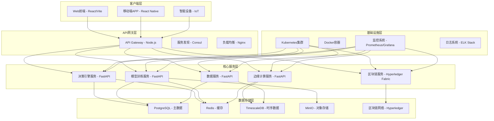

# AI农业决策系统技术架构文档

## 1. 系统概述

AI农业决策系统是一个融合强化学习、区块链与边缘计算的前沿项目，采用微服务架构设计，支持高并发访问和分布式部署。系统通过"空天地一体化感知+云端智能决策+终端自主执行"的技术闭环，实现从种植管理到市场预判的全流程数字化。

## 2. 整体架构



## 3. 核心技术栈

### 3.1 后端技术栈
- **主框架**: FastAPI (Python 3.10+)
- **AI框架**: JAX + Flax (用于强化学习和深度学习)
- **数据库**: PostgreSQL 15, Redis 7, TimescaleDB
- **区块链**: Hyperledger Fabric 2.5
- **消息队列**: RabbitMQ
- **对象存储**: MinIO
- **容器化**: Docker, Kubernetes

### 3.2 前端技术栈
- **框架**: React 18 + TypeScript
- **构建工具**: Vite 5
- **样式**: Tailwind CSS
- **状态管理**: React Context + Zustand
- **图表库**: Recharts
- **路由**: React Router DOM

### 3.3 部署与运维
- **容器编排**: Kubernetes + Istio
- **监控**: Prometheus + Grafana
- **日志**: ELK Stack (Elasticsearch + Logstash + Kibana)
- **CI/CD**: GitHub Actions / GitLab CI

## 4. 核心功能模块详解

### 4.1 决策引擎模块

#### 4.1.1 强化学习决策器
- **算法**: PPO (Proximal Policy Optimization)
- **网络结构**: 策略网络 + 价值网络
- **经验回放**: ReplayBuffer (容量100000)
- **优化器**: Adam优化器

#### 4.1.2 决策类型
1. **农业参数优化决策**
   - 光谱参数调整 (380nm-720nm)
   - 温湿度控制策略
   - 灌溉和施肥计划

2. **区块链积分分配决策**
   - 个体积分分配比例
   - 系统收益分配方案
   - 智能合约参数调整

3. **模型训练决策**
   - 训练任务调度
   - 超参数调整策略
   - 模型版本升级决策

4. **资源分配决策**
   - CPU/GPU资源分配
   - 内存和存储配额
   - 网络带宽分配

### 4.2 边缘计算模块

#### 4.2.1 WebAssembly模型部署
- **模型格式**: WASM兼容格式
- **推理延迟**: <200ms
- **支持协议**: WebAssembly标准
- **离线支持**: 支持离线推理

#### 4.2.2 设备适配
- **硬件要求**: ARM64/x86_64, 2GB+ RAM
- **操作系统**: Linux, Windows, Android
- **网络要求**: 支持离线模式

### 4.3 区块链溯源模块

#### 4.3.1 智能合约功能
- **数据上链**: 传感器数据、操作记录
- **溯源验证**: 全程可追溯
- **共识机制**: PBFT共识算法
- **数据压缩**: 语义分片技术 (压缩95%)

#### 4.3.2 隐私保护
- **联邦学习**: 支持分布式训练
- **差分隐私**: 保护敏感数据
- **安全多方计算**: 保障数据安全

## 5. API接口设计

### 5.1 决策引擎API
```python
# 决策请求接口
class DecisionRequest(BaseModel):
    decision_type: str  # "agriculture", "blockchain", "training", "resource"
    state_data: Dict[str, Any]
    context: Optional[Dict[str, Any]] = None

# 决策响应接口
class DecisionResponse(BaseModel):
    decision_id: str
    decision_type: str
    action: Dict[str, Any]
    confidence: float
    reasoning: Optional[str] = None
    timestamp: datetime
```

### 5.2 模型管理API
```python
# 模型信息
class ModelInfo(BaseModel):
    model_id: str
    model_name: str
    model_type: str  # "classification", "regression", "reinforcement_learning"
    version: str
    accuracy: float
    created_at: datetime
    updated_at: datetime
    status: str  # "active", "inactive", "training"
```

## 6. 数据库设计

### 6.1 核心表结构

#### 决策记录表
```sql
CREATE TABLE decision_records (
    id BIGINT PRIMARY KEY AUTO_INCREMENT,
    decision_id VARCHAR(64) UNIQUE NOT NULL,
    decision_type VARCHAR(32) NOT NULL,
    input_data JSON NOT NULL,
    output_result JSON NOT NULL,
    confidence DECIMAL(5,4) NOT NULL,
    execution_time_ms INT NOT NULL,
    created_at TIMESTAMP DEFAULT CURRENT_TIMESTAMP,
    updated_at TIMESTAMP DEFAULT CURRENT_TIMESTAMP ON UPDATE CURRENT_TIMESTAMP,
    INDEX idx_decision_type (decision_type),
    INDEX idx_created_at (created_at)
);
```

#### 模型版本表
```sql
CREATE TABLE model_versions (
    id BIGINT PRIMARY KEY AUTO_INCREMENT,
    model_id VARCHAR(64) NOT NULL,
    version VARCHAR(32) NOT NULL,
    model_path VARCHAR(500) NOT NULL,
    performance_metrics JSON,
    training_data_size BIGINT,
    created_at TIMESTAMP DEFAULT CURRENT_TIMESTAMP,
    status TINYINT DEFAULT 1 COMMENT '1-active, 0-inactive',
    UNIQUE KEY uk_model_version (model_id, version)
);
```

## 7. 安全设计

### 7.1 认证授权
- **认证方式**: JWT Token
- **授权机制**: RBAC (基于角色的访问控制)
- **Token管理**: Redis存储，支持刷新和撤销

### 7.2 数据安全
- **传输加密**: HTTPS/TLS 1.3
- **数据加密**: AES-256加密敏感数据
- **隐私保护**: 差分隐私 + 联邦学习

### 7.3 网络安全
- **网络隔离**: 微服务间网络隔离
- **API安全**: 输入验证 + SQL注入防护
- **DDOS防护**: 限流 + 熔断机制

## 8. 性能优化

### 8.1 缓存策略
- **Redis缓存**: 热点数据缓存
- **CDN加速**: 静态资源分发
- **数据库优化**: 索引优化 + 查询优化

### 8.2 负载均衡
- **服务级别**: 基于服务发现的负载均衡
- **数据级别**: 数据库读写分离
- **网络级别**: CDN + 负载均衡器

### 8.3 扩展性设计
- **水平扩展**: 无状态服务设计
- **垂直扩展**: 资源密集型服务独立部署
- **弹性伸缩**: 基于监控指标的自动伸缩

## 9. 监控与运维

### 9.1 监控指标
- **系统指标**: CPU、内存、磁盘、网络
- **应用指标**: QPS、响应时间、错误率
- **业务指标**: 决策准确率、模型性能

### 9.2 日志管理
- **结构化日志**: JSON格式日志
- **日志级别**: DEBUG/INFO/WARNING/ERROR
- **日志聚合**: ELK Stack集中管理

### 9.3 告警机制
- **告警规则**: 基于Prometheus Alertmanager
- **告警渠道**: 邮件、短信、钉钉、微信
- **告警级别**: 紧急、重要、一般

## 10. 部署方案

### 10.1 开发环境
```yaml
version: '3.8'
services:
  api-gateway:
    image: api-gateway:latest
    ports: ["8080:8080"]
    depends_on: [service-registry]
    
  decision-engine:
    image: decision-engine:latest
    ports: ["8001:8001"]
    environment:
      - ENVIRONMENT=development
      - LOG_LEVEL=DEBUG
    depends_on: [postgres, redis]
```

### 10.2 生产环境
```yaml
apiVersion: apps/v1
kind: Deployment
metadata:
  name: decision-engine
spec:
  replicas: 3
  selector:
    matchLabels:
      app: decision-engine
  template:
    metadata:
      labels:
        app: decision-engine
    spec:
      containers:
      - name: decision-engine
        image: decision-engine:latest
        ports:
        - containerPort: 8001
        env:
        - name: CONFIG_SERVER_URL
          value: "http://config-service:8888"
        - name: SERVICE_REGISTRY_URL
          value: "http://service-registry:8500"
        resources:
          requests:
            memory: "512Mi"
            cpu: "500m"
          limits:
            memory: "1Gi"
            cpu: "1000m"
```

## 11. 集成接口

### 11.1 第三方设备集成
- **PTZ摄像头**: Pelco-D/P, ONVIF协议
- **传感器设备**: Modbus, MQTT协议
- **农机设备**: 自定义协议适配

### 11.2 数据源集成
- **气象数据**: API接口集成
- **土壤数据**: IoT传感器接入
- **市场数据**: 第三方数据提供商

## 12. 测试策略

### 12.1 单元测试
- **覆盖率**: >90%
- **框架**: pytest
- **Mock**: 单元测试中使用mock对象

### 12.2 集成测试
- **API测试**: 接口功能验证
- **数据库测试**: 数据操作验证
- **消息队列测试**: 异步处理验证

### 12.3 性能测试
- **压力测试**: 模拟高并发场景
- **负载测试**: 长时间运行稳定性
- **容量测试**: 系统承载能力

## 13. 未来发展规划

### 13.1 技术演进
- **AI算法**: 引入更先进的强化学习算法
- **边缘计算**: 优化WASM模型性能
- **区块链**: 升级到更高效的共识算法

### 13.2 功能扩展
- **多作物支持**: 扩展到更多农作物类型
- **国际市场**: 支持多语言和多地区
- **生态合作**: 开放API和SDK

### 13.3 标准化
- **行业标准**: 推动农业AI标准化
- **开源贡献**: 开源核心算法和组件
- **生态建设**: 构建开发者社区