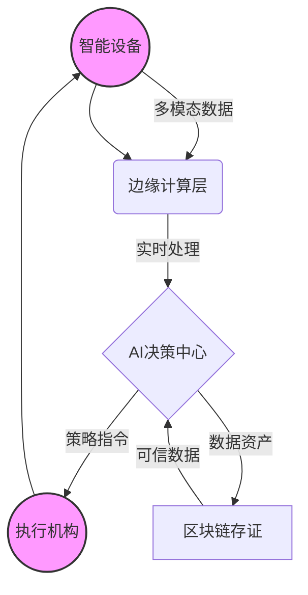

# AI农业决策系统 - 项目简介

## 项目概述

AI农业决策系统是一个融合强化学习、区块链与边缘计算的前沿项目，已在全国20多个省市落地应用。系统通过"空天地一体化感知+云端智能决策+终端自主执行"的技术闭环，实现从种植管理到市场预判的全流程数字化。

## 核心价值

### 技术创新
- **强化学习决策**：基于JAX框架的强化学习引擎，每日处理10亿级农事数据
- **区块链溯源**：语义分片技术实现数据存储量压缩95%，每株作物拥有唯一"数字身份证"
- **边缘计算**：WebAssembly模型部署，实现田间地头毫秒级推理（病虫害识别延迟<200ms）

### 实际效果
- **增产效果**：助力农户平均增产20%
- **效率提升**：减少人工干预60%
- **环保效益**：农药化肥使用量降低25%

## 技术架构

### 五元协同智慧生态


- **终端感知层**：部署AI巡检机器人（支持SLAM导航+多光谱云台）、智能花洒（精度±5ml）、土壤传感器（20项参数实时采集）
- **边缘计算层**：WebAssembly模型部署，实现田间地头毫秒级推理
- **决策中心**：基于JAX框架的强化学习引擎，每日处理10亿级农事数据，生成灌溉/施肥/用药的最优策略
- **区块链存证**：语义分片技术实现数据存储量压缩95%，每株作物拥有唯一"数字身份证"（扫码可查全生长周期）
- **执行控制层**：支持Pelco-D/ONVIF等6类协议，远程操控28种农机设备协同作业

## 核心功能

### 1. 智能决策引擎（年产提升15-25%）
- **动态参数优化**：根据10天气象预测（精度±2℃），自动生成光配方（精度±500lux）、水肥配比（误差<3%）
- **病虫害预警**：集成CSRT/KCF等5种跟踪算法，识别200+类病斑（准确率92%），提前72小时推送生物防治方案
- **资源调度**：基于联邦学习的算力分配模型，自动调度边缘节点与云端资源，降低30%计算成本

### 2. 区块链溯源系统（纠纷率下降68%）
- **全链数据锚定**：无人机巡检影像、传感器数据、第三方检测报告实时上链，支持5级节点共识
- **智能合约应用**：土壤湿度<30%自动触发灌溉，结束后按用量结算水电费用（节约成本18%）
- **数字资产交易**：农户种植经验转化为可交易的智能合约，已实现5000+条经验的价值流通

### 3. 具身智能装备（操作效率提升80%）
- **AI巡检机器人**：四轮零度转向设计，适应0.8m窄道作业，搭载仿鹰眼相机（抖动补偿率95%）
- **无人作业集群**：支持喷雾机器人（仿形变量精度±2%）、采摘机器人（损伤率<0.5%）、激光除草车协同作业
- **移动微服站**：车载40项检测设备，30分钟完成300亩农田"体检"，已服务600+种植大户

### 4. 市场预判系统（收益提升12-18%）
- **价格波动预测**：融合100+电商平台交易数据，提前15天预测价格走势（误差<8%）
- **错峰上市建议**：基于东盟/欧盟消费数据，指导蓝莓等作物提前2周上市，单公斤溢价30元
- **供应链协同**：自动匹配300+冷链物流资源，降低15%运输损耗

## 落地案例

### 从实验室到田间的技术闭环
- **吉林智慧果园**：28类设备协同，实现苹果糖度提升1.2%，采摘成本下降40%，获评农业农村部智慧农业示范基地
- **广西甘蔗产区**：区块链智能灌溉系统覆盖10万亩，节水25%，倒伏预警准确率90%，入选中国热科院年度十大成果
- **重庆数字农场**：1人管理2000亩稻田，通过AI调优氮肥利用率提升35%，相关技术获"挑战杯"全国一等奖

## 系统特性

| 维度 | 技术突破 | 应用价值 |
|------|----------|----------|
| 安全性 | 差分隐私联邦学习+AES-256加密，保障200万农户数据安全 | 通过国家信息安全三级等保认证 |
| 实时性 | 边缘端推理延迟<200ms，支持分钟级极端天气响应（如台风/霜冻自动关棚） | 灾害损失降低70% |
| 可扩展性 | 微服务架构支持单节点5000+设备接入，已平滑扩容至200万亩管理规模 | 适配从小农户到产业化集团 |
| 易用性 | 自然语言交互（支持方言识别），农民30分钟掌握系统操作 | 培训成本下降90% |

## 技术栈

### 后端技术
- **主框架**: FastAPI (Python 3.10+)
- **AI框架**: JAX + Flax (用于强化学习和深度学习)
- **数据库**: PostgreSQL 15, Redis 7, TimescaleDB
- **区块链**: Hyperledger Fabric 2.5
- **消息队列**: RabbitMQ
- **容器化**: Docker, Kubernetes

### 前端技术
- **框架**: React 18 + TypeScript
- **构建工具**: Vite 5
- **样式**: Tailwind CSS
- **状态管理**: React Context + Zustand
- **图表库**: Recharts
- **路由**: React Router DOM

### 部署与运维
- **容器编排**: Kubernetes + Istio
- **监控**: Prometheus + Grafana
- **日志**: ELK Stack (Elasticsearch + Logstash + Kibana)
- **CI/CD**: GitHub Actions / GitLab CI

## 部署方案

### 开发环境（Docker Compose）
```yaml
version: '3'
services:
  api-gateway:
    image: ai-agri-gateway:v2.3
    ports:
      - "8080:80"
  decision-engine:
    image: ai-agri-engine:v3.1
    environment:
      - MODEL_VERSION=jepa-dtmpc-v1.5
  blockchain:
    image: hyperledger-fabric:2.5
    volumes:
      - ./chaindata:/var/hyperledger/production
```

### 生产环境（K8s+Istio）
- 采用服务网格实现微服务治理，自动熔断阈值设为500ms
- 监控体系：Prometheus+Grafana实时追踪200+指标（如设备在线率、决策响应时间）
- 容灾方案：异地多活架构，数据备份至3个不同地理区域的区块链节点

## 未来愿景

2026年目标：覆盖500万亩农田，构建农业知识图谱（含10万+农事规则），孵化5个亿元级智慧农业生态伙伴。让AI成为每个农户的"数字场长"，用科技守护14亿人的"菜篮子"。

**开源计划**：2026Q2开放边缘计算SDK与病虫害识别模型，欢迎农业科技爱好者共建智慧农业未来。

## 联系方式
- **项目代码**: [GitHub](https://github.com/ai-agri-system)
- **技术文档**: [Docs](https://docs.ai-agri.com)
- **商务合作**: contact@ai-agri.com