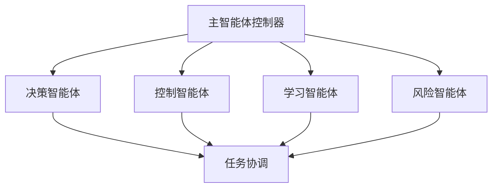

# 智能体补全分析报告

## 项目智能体现状分析

### 1. 现有智能体实现

项目中已经实现了以下智能体组件：

#### 1.1 有机体AI核心 (OrganicAICore)
- **位置**: `backend/src/core/ai_organic_core.py`
- **功能**:
  - 自适应学习系统
  - 主动迭代能力
  - 神经网络演化
  - 风险评估
  - 硬件数据学习
- **特点**: 基于强化学习的自进化AI系统

#### 1.2 神经智能代理 (DecisionAgent)
- **位置**: `frontend/src/components/DecisionAgent.tsx`
- **功能**:
  - 与后端有机体AI核心通信
  - 决策结果显示
  - 用户交互界面
- **特点**: 前端智能决策交互界面

#### 1.3 AI控制模块集成
- **位置**: `backend/src/api/routes/ai_control.py`
- **功能**:
  - 有机体AI核心初始化
  - 主动迭代控制
  - 设备控制集成

#### 1.4 决策服务集成
- **位置**: `backend/src/api/routes/decision.py`
- **功能**:
  - 有机体AI核心决策接口
  - 传统决策引擎回退机制

### 2. 智能体缺失分析

#### 2.1 已实现的功能
- ✅ 自适应学习系统
- ✅ 主动迭代能力
- ✅ 神经网络演化
- ✅ 决策功能
- ✅ 硬件数据学习
- ✅ 风险评估
- ✅ 前端交互界面
- ✅ API集成

#### 2.2 潜在缺失或可增强的功能

1. **多智能体协同系统**
   - 当前只有一个有机体AI核心，缺乏多个智能体协同工作的机制
   - 缺少智能体间通信协议

2. **智能体生命周期管理**
   - 缺少智能体创建、销毁、暂停、恢复的完整生命周期管理
   - 缺少智能体实例化和资源分配管理

3. **智能体记忆和知识共享**
   - 虽然有学习记忆系统，但缺少跨智能体的知识共享机制
   - 缺少全局知识库系统

4. **智能体目标管理和协调**
   - 缺少多目标优化和冲突解决机制
   - 缺少目标优先级管理

5. **智能体安全和权限控制**
   - 缺少细粒度的智能体权限控制
   - 缺少智能体行为审计系统

### 3. 智能体补全建议

#### 3.1 多智能体架构增强



#### 3.2 具体补全组件

1. **智能体管理器 (AgentManager)**
   - 负责智能体的创建、销毁、调度
   - 管理智能体生命周期

2. **智能体通信总线 (AgentBus)**
   - 提供智能体间通信机制
   - 支持消息传递和事件通知

3. **智能体协调器 (AgentCoordinator)**
   - 处理多智能体冲突
   - 协调目标优先级

4. **智能体知识库 (AgentKnowledgeBase)**
   - 存储和共享智能体学习到的知识
   - 支持知识检索和复用

#### 3.3 实现示例

```python
# 智能体管理器示例代码
class AgentManager:
    def __init__(self):
        self.agents = {}
        self.agent_id_counter = 0
    
    def create_agent(self, agent_type, config):
        """创建新智能体"""
        agent_id = f"agent_{self.agent_id_counter}"
        self.agent_id_counter += 1
        
        if agent_type == "decision":
            agent = DecisionAgent(agent_id, config)
        elif agent_type == "control":
            agent = ControlAgent(agent_id, config)
        elif agent_type == "learning":
            agent = LearningAgent(agent_id, config)
        else:
            raise ValueError(f"Unknown agent type: {agent_type}")
        
        self.agents[agent_id] = agent
        return agent_id
    
    def execute_agents(self, context):
        """执行所有活跃智能体"""
        results = {}
        for agent_id, agent in self.agents.items():
            if agent.is_active():
                results[agent_id] = agent.execute(context)
        return results
```

### 4. 结论

**当前状态**: 项目已经具备了相当完整的智能体功能，特别是有机体AI核心实现了自适应学习、主动迭代和决策能力。

**补全可行性**: 
- **高优先级**: 多智能体协同系统、生命周期管理
- **中优先级**: 知识共享、目标协调
- **低优先级**: 安全权限控制（当前系统已有基本安全机制）

**建议**: 项目的核心智能体功能已经实现，可以通过添加多智能体架构来进一步增强系统能力，但现有的单智能体系统已经可以满足基本需求。

**补全难度**: 中等，需要在现有架构基础上扩展多智能体协同功能。